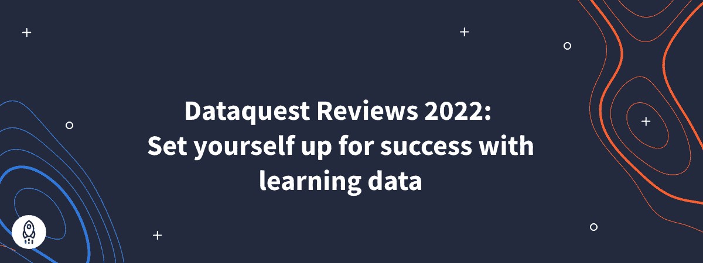

# Dataquest Reviews 2022:用学习数据为成功做准备

> 原文：<https://www.dataquest.io/blog/dataquest-reviews-2022-set-yourself-up-for-success-with-learning-data/>

April 6, 2022

无论您正在进行数据学习，还是刚刚开始数据学习之旅，来自已实现学习目标的学习者的见解和评价都可以帮助您实现自己的目标。

坦率地说:学习一项新技能并不容易。这需要动力、纪律、耐心，以及更多的组织来平衡你的其他承诺。但这绝对不是不可能完成的任务，正如去年我们 77%的学员所显示的那样，他们实现了自己的目标，推进了自己的职业生涯。

在这篇博文中，我们将分享一些帮助你实现目标的技巧。

## 学习 Dataquest 可以让你走向成功

获得新技能可以创造许多机会——获得一份新工作、获得晋升或加薪。大多数时候，学习者报告这些好处以及更多。

例如，在去年达到学习目标的 Dataquest 学员中:

*   44%的人开始做更有趣、更令人兴奋的工作
*   38%的人找到了新工作
*   35%的人表示对自己的工作更有信心。
*   33%的人说他们的新技能帮助他们在工作中保持相关性
*   28%的人说，他们的工资增加了，各国的工资中位数增加了 33%

所以要做好准备！达到你的目标会给你带来意想不到的好处，打开你从未想过的大门。

**下面是我们的学习者所说的:**

*“通过使用 Dataquest，我能够在以前的公司横向进入数据分析工作，并使用我的新技能继续学习和成长。我后来转到了一家新公司，现在的工资几乎是原来的两倍！”*——泰·洛佩兹——美国。

“给了我数据分析师的工作技能。”—大卫——英国。

“我经历了面试过程，感觉更自信了，技术部分也没什么问题。”—巴西克拉丽莎·山北。

## 边做边学——行之有效的教学方法

在开始或沿着您的数据学习之旅前进的过程中，当您不知道如何编码时，您可能会感到有点焦虑，或者您可能会有偷工减料的冲动。但是不要担心:

我们的绝大多数学习者(75%)在开始他们的旅程之前都是初学者，所以在开始之前你不需要知道如何编码。我们的大多数学习者称赞我们的动手学习平台是实现您目标的有效途径。

**下面是我们的学习者所说的:**

“我相信它为没有技能或不了解数据和数据使用的人提供了一个很好的基础。”—加里·罗伯茨——巴哈马群岛。

“这些课程是为了直接教你那些我想要学习和需要的技能而设计的。”——凯尔·罗兰——美国。

“我认为 Dataquest 是一个很好的自学平台，同时还能获得社区的支持。我真的很喜欢这些课程和项目中的实践练习。”—巴西克拉丽莎·山北。

“我想学习数据科学，Dataquest 的方法论帮助了我很多——边做边学。”—丹亚尔·艾哈迈德——巴基斯坦。

“我认为阅读和练习同时进行是最有效的学习方法。”—穆罕默德·巴达维——埃及。

## 达到目标的秘密

当我们分析成功学习者的学习习惯时，我们发现了一些趋势。大多数达到目标的学员每周至少学习一次，时间超过两个小时，这有助于他们在不到一年的时间内实现目标:

*   89%达到目标的受访者每周至少在 Dataquest 上学习一次。
*   70%达到目标的受访者每周花两个多小时学习。
*   84%达到目标的受访者在不到一年的时间里做到了。

在你的日历和铅笔上选择一个可靠的时间在两个小时内学习。这将有助于确保你的学习之旅不会成为你任务清单上的最后一件事。

通过 Dataquest 阅读 Ashray 如何在几个月内找到新工作的故事。