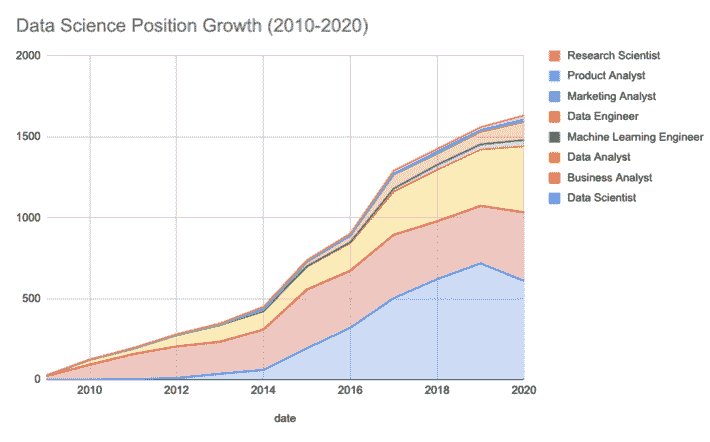
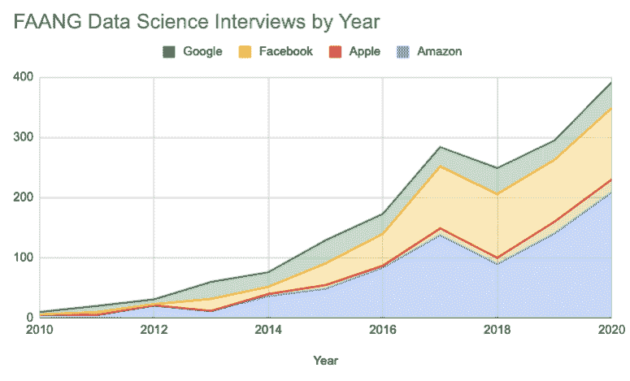
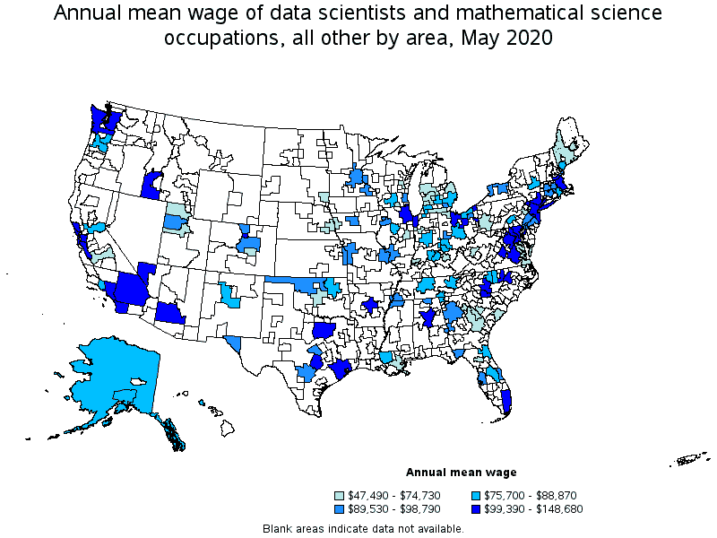

# 在 2021 年发现您的数据科学职业

> 原文：<https://www.dataquest.io/blog/discovering-your-data-science-career/>

September 30, 2021

数据科学职业是世界上最受欢迎的职业之一，而且这一趋势没有停止的迹象。随着人工智能、物联网设备以及流媒体和实时通信服务的广泛使用，许多人追求数据职业也就不足为奇了。事实上，根据 Glassdoor 的数据，数据科学家是美国第二好的工作。数据科学的这一非凡进步为许多行业创造了对数据专业人员的非凡需求。这对有抱负的数据科学家来说是个好消息，因为这意味着奖励工资和福利。需求的增加加上训练有素的申请人的短缺意味着数十万新的数据科学工作机会。即使您只是刚刚发现数据科学和成为数据专业人员的可能性，也没有比这更好的开始时间了，大量前所未有的机会正等待着您。

## 数据职业需要什么？

简单地说，数据职业围绕着数据的收集、清理、组织、操作、可视化和解释。即使不同的职业道路专攻不同的领域，并且每条道路都需要一些特定的过程和工具，但许多道路都有一些共同的主题。

从告知政府把税款花在哪里的预算分析师，到帮助像你我这样的用户观看我们最喜欢的电影的数据工程师，数据科学的宇宙是巨大的，并且不断扩大。

因此，在数据世界中有数百个职位，许多职位在所需技能方面有所重叠。这为数据专业人员提供了一个独特而灵活的位置，让他们在发现哪个专业适合自己的同时发展有用的技能。

数据中的一些职位包括:

*   数据分析师
*   金融分析师
*   运营分析师
*   医疗保健分析师
*   营销分析师
*   数据科学家
*   数据工程师
*   数据技术员
*   商业智能分析师
*   数据挖掘工程师
*   研究员
*   数据库管理员
*   数据和分析经理
*   数字营销经理统计学家
*   运输逻辑学家
*   系统分析员
*   定量分析师
*   数据架构师
*   软件开发人员
*   计算机网络架构师
*   数据库管理员
*   信息安全分析师

如果你想知道在哪里获得这些工作，Dataquest 创建了一个关于如何以及在哪里找到数据工作的奇妙资源—[链接此处](https://www.dataquest.io/blog/career-guide-find-data-science-jobs/)。

## 如何成为 2021 年及以后的数据专业人士

在过去，获得一份体面的数据工作的唯一途径是获得计算机科学、数学、统计学或其他相关领域的学士学位。但随着对数据专业人员的需求不断增长，而受过培训的申请人供应不足，招聘经理现在更看重技能和相关经验，而不是正规教育。

现在，数据科学领域的新申请人有了前所未有的机会，可以在没有大学学位的情况下获得一份高回报的入门级工作，前提是申请人可以展示出必要技能的资质，以及学习和发展数据职业生涯的愿望。

Glassdoor 的一项研究列出了一些公司，这些公司的许多开放数据科学职位不再要求学位。这些公司包括谷歌、苹果、诺德斯特龙、Publix、星巴克、IBM、美国银行等等。越来越普遍的情况是，企业根据能力而不是学历来招聘员工。

那么，如何开始走上[数据科学职业道路](https://www.dataquest.io/path/data-scientist/)？这是我们最好的建议:

*   研究这个领域，发现你的角色。如果数据科学似乎适合你，制定一个学习计划来指导你的职业研究！
*   加入 Kaggle 和 GitHub 等平台上的数据科学社区，寻求想法和支持。如果可以，找个导师！
*   通过在线课程和训练营培养基本的数据科学技能；考虑证书而不是学位。如果你更喜欢通过写代码而不是看视频来学习，我们建议使用 [Dataquest 课程](https://www.dataquest.io/data-science-courses-directory/)来学习。
*   利用这些技能建立一个真实工作的文件夹来展示你的能力。
*   申请实习或你的第一份入门级工作来展示你的能力。
*   永不停止学习；继续接受数据科学方面的进一步教育，磨练您的技能。

## 数据职业的基本技能、工具和技术

木匠的好坏取决于他的工具。同样，数据专业人员不仅依赖于他们的技能，还依赖于一系列强大的工具和前沿技术。

以下是您作为数据专业人员将使用的资源和技能的概述:

技能

*   分析思维
*   编程能力
*   强大的沟通能力
*   创造性思维
*   解决问题
*   注意细节
*   良好的组织

工具

*   Python 库
*   （舞台上由人扮的）静态画面
*   火花
*   Jupyter 笔记型电脑
*   斯堪的纳维亚航空公司
*   快速采矿机
*   谷歌分析

使用的技术

*   计算机编程语言
*   稀有
*   神谕
*   SQLAWS S3 和其他云数据仓库

对于许多数据专业人员来说，这些领域的熟练程度是不容置疑的。幸运的是，已经有令人难以置信的资源可供[开始发展从事数据职业的必要技能](https://www.dataquest.io/)。数十家公司现在提供在线数据专业训练营、在线课程或认证，可以是通用的，也可以是专业的。例如，Dataquest 提供了具体的职业道路，旨在成为您从初学者到工作就绪所需的唯一资源。

例如，Dataquest 提供了具体的职业道路，旨在成为您从初学者到工作就绪所需的唯一资源。

*   [数据分析师在 R](https://www.dataquest.io/path/data-analyst-r/) 或 [Python](https://www.dataquest.io/path/data-analyst/)
*   [Python 中的数据科学家](https://www.dataquest.io/path/data-scientist/)
*   [数据工程师](https://www.dataquest.io/path/data-engineer/)

你也可以选择在我们的技能路径中采用更专业的方法，比如使用 Python 的[机器学习入门](https://www.dataquest.io/path/machine-learning-intro-with-python/)、使用 Python 的[概率和统计](https://www.dataquest.io/path/probability-and-statistics-with-python/)、用于数据分析的 [R 基础](https://www.dataquest.io/path/r-basics-for-data-analysis/)，以及[许多其他的](https://www.dataquest.io/data-science-courses-directory/)。

## 数据工作的增长和前景

对数据专业人员的需求从未像现在这样高，从各方面来看，他们是一些增长最快的职业机会。世界经济论坛的 2020 年就业报告发现，数据分析师、机器学习专家和大数据专家是美国各行业中增长最快的三个职位。

每年，LinkedIn 都会发布他们的[新兴工作报告](https://business.linkedin.com/content/dam/me/business/en-us/talent-solutions/emerging-jobs-report/Emerging_Jobs_Report_U.S._FINAL.pdf)，根据他们从受欢迎的工作委员会收集的数据，概述最热门的新工作。2020 年，数据科学相关的工作占据了十大新兴工作中的三个:

*   #1:人工智能专家角色在过去四年中每年增长 74%。
*   #3:数据科学家的角色在过去四年中增长了 37%。
*   #8:数据工程师职位在过去四年中增长了 33%。

此外，[面试查询博客](https://www.interviewquery.com/blog-data-science-interview-report/)分析了超过 10，000 份与数据科学相关的面试经历，发现尽管在疫情期间略有放缓，但数据科学职位仍在快速增长:

来源:[https://www . interview query . com/blog-data-science-interview-report/](https://www.interviewquery.com/blog-data-science-interview-report/https://www.datasciencecentral.com/profiles/blogs/data-science-job-market-shrinking-not-so-fast)

然而，增长率的下降并没有体现在 FAANG 公司身上——与去年相比，他们的面试人数增加了 25%。

来源:[https://www . interview query . com/blog-data-science-interview-report/](https://www.interviewquery.com/blog-data-science-interview-report/https://www.datasciencecentral.com/profiles/blogs/data-science-job-market-shrinking-not-so-fast)

根据劳工统计局的最新数据，到 2030 年，数据科学就业市场将增长近 33%，是全国平均水平的三倍多。此外，大数据市场规模预计将增长超过 1000 亿美元。

随着这种需求的爆炸式增长，工资也在上涨——即使是入门级的数据专业人员也可以要求可观的数字和福利。Glassdoor 报道称，数据可视化职业的平均工资为 85，000 美元。另一方面，根据 Springboard 的一项研究，在金融、保险、科学或技术服务领域工作的数据分析师可以获得 9 万美元的薪水。根据[薪级表](https://www.payscale.com/research/US/Job=Data_Scientist/Salary)，数据科学家的平均年薪为 96，455 美元，而[劳工统计局](https://www.bls.gov/OES/current/oes152098.htm)设定的平均年薪略高于 10 万美元。专业、高级或经理数据科学职位的预期薪资可达 20 万美元以上。

你准备好加入数据科学人才崛起的热潮了吗？你可以的！但是获得你需要的技能不会在一夜之间发生。如果你[养成健康的学习习惯，并保持频繁的学习日程](https://www.dataquest.io/dataquest-challenge/)，在半年到一年内，你就可以开始一个令人难以置信的回报和终身的职业生涯，成为一名数据专家。如果你觉得这听起来不错，Dataquest 的所有人都愿意帮助你开始。

**停止等待，立即开始您的数据科学生涯**

通过 Dataquest，您可以获得所需的高回报数据科学职位所需的技能和知识。如果你想增加薪水和工作机会，我们有你需要的工具和资源。

[免费开始使用](https://app.dataquest.io/signup)