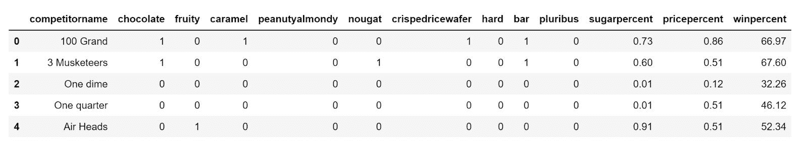
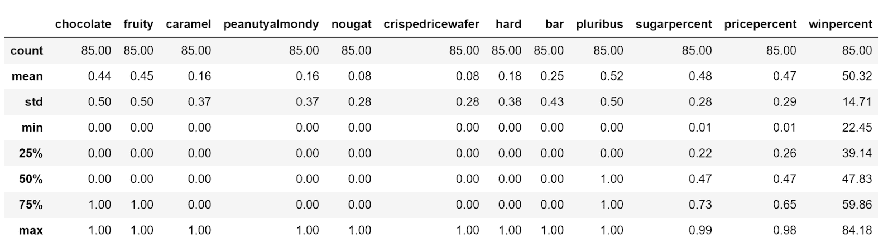

# 大量调查揭示了最好的万圣节糖果

> 原文：<https://www.dataquest.io/blog/enormous-survey-reveals-the-best-halloween-candies/>

October 30, 2021

对于我们这些喜欢糖果的人(也就是所有人)来说，万圣节可以说是最好的节日了。我一直喜欢万圣节，因为不管你多大，你可能都想要某种类型的糖果。但是，离这个季节只有几天了，你可能会想知道两件事:你会穿什么服装，以及(更重要的)你如何确保你得到了不给糖就捣蛋的人想要的糖果？

根据你住的地方，你也许能猜出什么糖果比你所在地区的其他糖果做得更好。但是，思考并不总是足以做出明确的决定。幸运的是，数据和调查让我们有更好的机会做出正确的选择。

特别是在万圣节，有一个数据集很有趣，它揭示了最佳糖果选择的秘密。2017 年， [FiveThirtyEight 创建了一个数据集](https://fivethirtyeight.com/videos/the-ultimate-halloween-candy-power-ranking/) ，根据超过 26.5 万名参与者的随机匹配，比较了 85 种有趣大小的流行糖果，以一劳永逸地决定真正的万圣节糖果之王。

## 数据集的第一印象

现在，作为一名热爱糖的数据科学家，为万圣节做准备，我不能错过探索这个数据集的机会，看看我应该在购物清单上添加什么糖果。

最终的万圣节糖果权力排名数据集基于 12 个特征变量比较了 85 种糖果，其中 9 个是描述糖果性质和内容的二元变量，例如它们是否包含巧克力、焦糖或坚果；它们是固体糖果还是棒状的，等等。剩下的 3 个变量描述了糖果的含糖量(或者我认为的甜度)，价格，以及基于其他 11 个变量的获奖率。

## 更深入的探究(了解数据)

我们需要首先看到这些数据，以使用这个数据集来决定这个万圣节最好的糖果——或者只是知道哪个是最好的万圣节糖果。所以，让我们从使用 Python 和熊猫 T3 的简单 [数据探索开始。](https://www.dataquest.io/course/pandas-fundamentals/)

**1。加载数据并浏览基本信息**

从 GitHub 克隆数据集后，我们需要将数据集加载到 Pandas 数据框架中，并探索不同的方面，如数据集的大小和其中变量的类型。我们甚至可以将精度设置为 2 个小数点，以便更容易地处理浮点数字数据。

```py
import pandas as pd
span class="token keyword">import matplotlib.pyplot as plt
span class="token operator">%matplotlib inline
andy = pd.read_csv("candy-data.csv")
span class="token comment" spellcheck="true">#Dispaly the size of the dataset
en(candy)
span class="token comment" spellcheck="true">#Examining the shape of the data frame
andy.shape
span class="token comment" spellcheck="true">#Set display precision to 2
d.set_option("display.precision", 2)
span class="token comment" spellcheck="true">#Getting the first 5 rows of the dataframe
andy.head()
```



我们还可以使用 candy.info()来确定数据集中的变量类型

")

我们可以使用 candy.info()获得基本的统计数据



**2。访问和查询数据集**

了解变量类型和数据集的构造将允许我们使用简单的查询和分组来探索数据。例如，我们可以只显示含有巧克力和焦糖的糖果，或者显示胜率为 70%或更高的糖果。我们也可以把两个条件放在一起，看看什么巧克力-焦糖糖果的中奖概率会更高。

```py
candy[(candy["chocolate"] == 1) & (candy["caramel"] == 1) & (candy["winpercent"] > 70)]
```


我们还可以确定任何含有巧克力的糖果相对于同时含有巧克力和焦糖的糖果的平均获胜百分比，以及如果糖果含有巧克力、焦糖和坚果，该百分比将如何变化(将为 60.92%)。

candy.groupby('巧克力')['winpercent']。均值()[1]

**3。可视化数据**

探索任何新数据集时，我最喜欢的部分是可视化数据。虽然你可以通过查询数据、对一些列和行进行分组，并以书面形式分析数据的内容，但因为我们是视觉动物，所以当信息可视化时，我们会更好地感知信息。此外，有时数据可能包含隐藏的模式或趋势，您只能通过可视化来发现。

假设我们想知道甜度或价格是否会影响糖果的百分比。我们可以用散点图来显示甜度、价格和胜率。如果我们这样做，我们会发现这两个因素之间没有直接的联系。我们可以看到，一些甜度高的糖果，中奖几率很低。价格并不是决定一颗糖果输赢的决定性因素。

```py
ax1 = nba.plot(kind='scatter', x='sugarpercent', y='winpercent', color='r', label ='sweetness leve')
x2 = nba.plot(kind='scatter', x='pricepercent', y='winpercent', color='g', label='price', ax=ax1)
x2.set_xlabel("Sugar/ Price Percentage")
x2.set_ylabel("Win Percentage")
```

")

所以，这将导致我们想知道哪个因素影响糖果中奖的百分比。然后，我们可以关注 9 个二元变量，看看每个变量如何影响胜率。我们可以从绘制这 9 个变量的平均胜率开始。

```py
cat = ["chocolate","fruity","caramel","peanutyalmondy","nougat","crispedricewafer","hard","bar","pluribus"]
ve_win = [nba.groupby(item)['winpercent'].mean()[1] for item in cat]
lt.figure(figsize=(15,5))
lt.bar(cat, ave_win )
```

")

从那里，我们可以看到，含有巧克力、坚果(花生或杏仁)和一种酥脆元素(如威化饼)的糖果获胜的几率最高。如果我们根据胜率降序排列数据，然后根据胜率绘制前 10 种糖果，我们会发现这些糖果都含有巧克力和坚果成分。在这个数据集中，前两种糖果是里斯的花生酱杯和它的继任者，迷你里斯的。

从平均值中，我们还可以看到，如果糖果含有水果成分或者是硬糖，他们获胜的机会将比坚果巧克力竞争者少得多。

```py
df = candy.sort_values("winpercent", ascending=False)
f.head(10).plot(x="competitorname" , y="winpercent" , kind="bar")
```

")

## 结论

从我们在这个数据集上使用的简单的 [数据探索技术](https://www.dataquest.io/course/exploratory-data-visualization/) 来看，我可以非常自信地告诉你，如果你想在这个万圣节成为热门，就去买含有巧克力、坚果和松脆成分的糖果。这一定会让你的房子成为今年不给糖就捣蛋的人的最爱。

除了赢得万圣节的“不给糖就捣蛋”之战，你还可以使用这个数据集来决定下次聚会要带哪种糖果。你也可以用这个数据集来训练一个机器学习模型，来预测这个数据集中没有的其他糖果的胜率。最后，您可以使用这个数据集和一些聚类算法，根据超过 25 万人的意见创建一个完美糖果的公式。

所以，下次你在选择糖果来满足你的甜食时，要知道这些数据总能帮助你做出更明智的决定。毕竟，没有什么比万圣节前分析糖果更有趣的了。