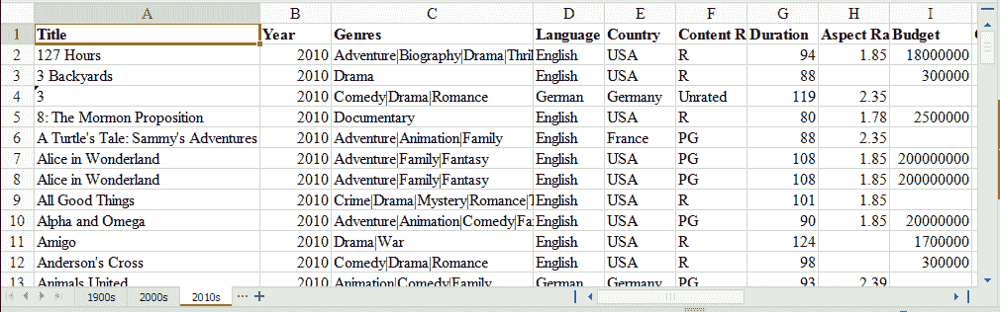
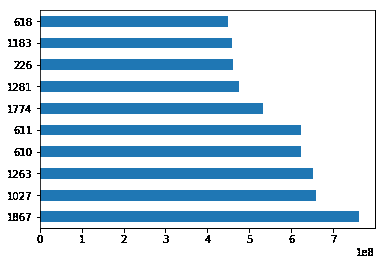
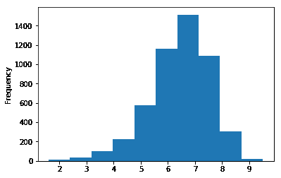
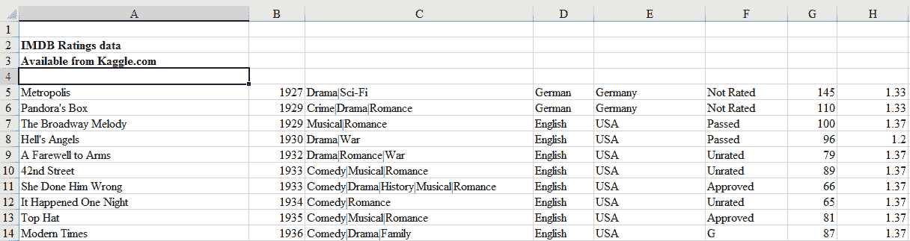
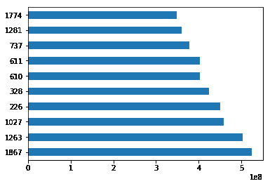
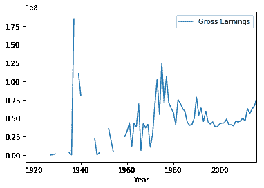
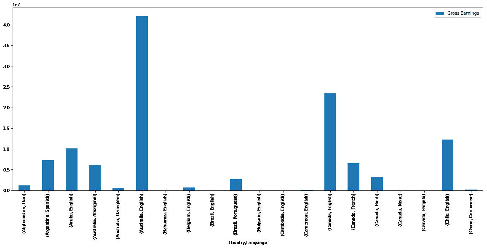

# 使用 Python 和 Pandas 的 Excel 教程

> 原文：<https://www.dataquest.io/blog/excel-and-pandas/>

December 8, 2017

为什么要用 Python 学习使用 Excel？Excel 是最流行和最广泛使用的数据工具之一；很难找到一个不以某种方式与之合作的组织。从分析师到销售副总裁，再到首席执行官，各种专业人士都使用 Excel 进行快速统计和严肃的数据处理。

随着 Excel 如此普及，数据专业人员必须熟悉它。用 Python 或 R [处理数据比用 Excel 的 UI](https://www.dataquest.io/blog/9-reasons-excel-users-should-consider-learning-programming/) 更有优势，所以找到一种使用代码处理 Excel 的方法至关重要。令人欣慰的是，已经有一个很好的工具可以将 Excel 与 Python 结合使用，这个工具叫做`pandas`。

Pandas 拥有从 Excel 文件中读取各种数据的优秀方法。如果您的目标受众喜欢，您也可以将 pandas 中的结果导出回 Excel。Pandas 非常适合其他常规数据分析任务，例如:

*   快速探索性数据分析
*   画出吸引人的情节
*   将数据输入 scikit-learn 等机器学习工具
*   基于您的数据构建机器学习模型
*   将经过清理和处理的数据用于任意数量的数据工具

Pandas 比 Excel 更擅长自动化数据处理任务，包括处理 Excel 文件。

在本教程中，我们将向您展示如何在 pandas 中使用 Excel 文件。我们将涵盖以下概念。

*   用必要的软件安装您的计算机
*   将 Excel 文件中的数据读入 pandas
*   熊猫的数据探索
*   使用 matplotlib 可视化库可视化熊猫中的数据
*   在 pandas 中操作和重塑数据
*   将数据从 pandas 移动到 Excel

请注意，本教程不提供对熊猫的深入研究。要更多地探索熊猫，请查看我们的[课程](https://www.dataquest.io/course/python-for-data-science-intermediate/)。

## 系统先决条件

我们将使用 [Python 3](https://www.python.org/) 和 [Jupyter Notebook](https://jupyter.org) 来演示本教程中的代码。除了 Python 和 Jupyter Notebook，您还需要以下 Python 模块:

*   [matplotlib](https://matplotlib.org/)–数据可视化
*   [NumPy](https://www.numpy.org/)–数字数据功能
*   [open pyxl](https://openpyxl.readthedocs.io/en/stable/)–读/写 Excel 2010 xlsx/xlsm 文件
*   [熊猫](https://pandas.pydata.org/)–数据导入、清理、探索和分析
*   [xlrd](https://xlrd.readthedocs.io/en/latest/)–读取 Excel 数据
*   [xlwt](https://xlwt.readthedocs.io/en/latest/)–写入 Excel
*   [XlsxWriter](https://xlsxwriter.readthedocs.io/)–写入 Excel (xlsx)文件

有多种方法可以设置所有模块。下面我们介绍三种最常见的场景。

*   如果您通过 [Anaconda 包管理器](https://www.anaconda.com/)安装了 Python，那么您可以使用命令`conda install`安装所需的模块。例如，要安装 pandas，您可以执行命令-`conda install pandas`。
*   如果您已经在计算机上安装了一个常规的非 Anaconda Python，那么您可以使用`pip`来安装所需的模块。打开你的命令行程序，执行命令`pip install <module name>`安装一个模块。你应该用你要安装的模块的真实名称替换`<module name>`。例如，要安装 pandas，您可以执行命令-`pip install pandas`。
*   如果您还没有安装 Python，您应该通过 [Anaconda 包管理器](https://www.anaconda.com/)来获得它。Anaconda 为 Windows、Mac 和 Linux 计算机提供安装程序。如果您选择完整安装程序，您将在一个包中获得您需要的所有模块，以及 Python 和 pandas。这是最简单快捷的入门方式。

## 数据集

在本教程中，我们将使用从 Kaggle 的 IMDB 分数数据创建的多表 Excel 文件。你可以在这里下载文件。



我们的 Excel 文件有三张表:“1900 年代”、“2000 年代”和“2010 年代”每一页都有当年的电影数据。

我们将使用该数据集来查找电影的分级分布，可视化具有最高分级和净收益的电影，并计算关于电影的统计信息。我们将使用 Python 和 pandas 来分析和探索这些数据，从而展示 pandas 在 Python 中处理 Excel 数据的能力。

## 从 Excel 文件中读取数据

我们需要首先将 Excel 文件中的数据导入 pandas。为此，我们从导入 pandas 模块开始。

```py
import pandas as pd
```

然后，我们使用 pandas 的 read_excel 方法从 excel 文件中读入数据。调用此方法最简单的方法是传递文件名。如果没有指定工作表名称，那么它将读取索引中的第一个工作表(如下所示)。

```py
excel_file = 'movies.xls'
movies = pd.read_excel(excel_file)
```

这里，`read_excel`方法将 Excel 文件中的数据读入 pandas DataFrame 对象。Pandas 默认将数据存储在数据帧中。然后，我们将这个数据帧存储到一个名为`movies`的变量中。

Pandas 有一个内置的`DataFrame.head()`方法，我们可以使用它轻松地显示数据帧的前几行。如果没有传递参数，它将显示前五行。如果传递了一个数字，它将从顶部开始显示相同数量的行。

```py
movies.head()
```

|  | 标题 | 年 | 体裁 | 语言 | 国家 | 内容分级 | 持续时间 | 长宽比 | 预算 | 总收入 | … | 脸书喜欢——演员 1 | 脸书喜欢——演员 2 | 脸书喜欢——演员 3 | 脸书喜欢——演员总数 | 脸书喜欢电影 | 海报中的面号 | 用户投票 | 用户的评论 | 评论家的评论 | IMDB 分数 |
| --- | --- | --- | --- | --- | --- | --- | --- | --- | --- | --- | --- | --- | --- | --- | --- | --- | --- | --- | --- | --- | --- |
| Zero | 不宽容:爱情的斗争贯穿了整个时代 | One thousand nine hundred and sixteen | 戏剧&#124;历史&#124;战争 | 圆盘烤饼 | 美利坚合众国 | 未评级 | One hundred and twenty-three | One point three three | Three hundred and eighty-five thousand nine hundred and seven | 圆盘烤饼 | … | Four hundred and thirty-six | Twenty-two | Nine | Four hundred and eighty-one | Six hundred and ninety-one | one | Ten thousand seven hundred and eighteen | Eighty-eight | Sixty-nine | Eight |
| one | 翻过山去救济院 | One thousand nine hundred and twenty | 犯罪&#124;戏剧 | 圆盘烤饼 | 美利坚合众国 | 圆盘烤饼 | One hundred and ten | One point three three | One hundred thousand | Three million | … | Two | Two | Zero | four | Zero | one | five | one | One | Four point eight |
| Two | 大游行 | One thousand nine hundred and twenty-five | 戏剧&#124;爱情&#124;战争 | 圆盘烤饼 | 美利坚合众国 | 未评级 | One hundred and fifty-one | One point three three | Two hundred and forty-five thousand | 圆盘烤饼 | … | Eighty-one | Twelve | Six | One hundred and eight | Two hundred and twenty-six | Zero | Four thousand eight hundred and forty-nine | Forty-five | Forty-eight | Eight point three |
| three | 大都市 | One thousand nine hundred and twenty-seven | 戏剧&#124;科幻 | 德国人 | 德国 | 未评级 | One hundred and forty-five | One point three three | Six million | Twenty-six thousand four hundred and thirty-five | … | One hundred and thirty-six | Twenty-three | Eighteen | Two hundred and three | Twelve thousand | one | One hundred and eleven thousand eight hundred and forty-one | Four hundred and thirteen | Two hundred and sixty | Eight point three |
| four | 潘多拉的盒子 | One thousand nine hundred and twenty-nine | 犯罪&#124;戏剧&#124;爱情 | 德国人 | 德国 | 未评级 | One hundred and ten | One point three three | 圆盘烤饼 | Nine thousand nine hundred and fifty | … | Four hundred and twenty-six | Twenty | Three | Four hundred and fifty-five | Nine hundred and twenty-six | one | Seven thousand four hundred and thirty-one | Eighty-four | Seventy-one | Eight |

5 行× 25 列

Excel 文件通常有多个工作表，读取特定工作表或全部工作表的能力非常重要。为了使这变得简单，pandas `read_excel`方法采用了一个名为`sheetname`的参数，它告诉 pandas 从哪个表中读取数据。为此，您可以使用图纸名称或图纸编号。图纸编号从零开始。如果没有给出`sheetname`参数，则默认为 0，pandas 将导入第一个工作表。

默认情况下，pandas 会自动分配一个从零开始的数字索引或行标签。如果数据中没有包含唯一值的列可以作为更好的索引，您可能希望保留默认索引。如果您认为有一列可以作为更好的索引，您可以通过将`index_col`属性设置为一列来覆盖默认行为。它采用一个数值来设置一个列作为索引，或者采用一个数值列表来创建一个多索引。

在下面的代码中，我们选择第一列“Title”作为索引(index=0)，方法是将 0 传递给参数`index_col`。

```py
movies_sheet1 = pd.read_excel(excel_file, sheetname=0, index_col=0)
movies_sheet1.head()
```

|  | 年 | 体裁 | 语言 | 国家 | 内容分级 | 持续时间 | 长宽比 | 预算 | 总收入 | 导演 | … | 脸书喜欢——演员 1 | 脸书喜欢——演员 2 | 脸书喜欢——演员 3 | 脸书喜欢——演员总数 | 脸书喜欢电影 | 海报中的面号 | 用户投票 | 用户的评论 | 评论家的评论 | IMDB 分数 |
| --- | --- | --- | --- | --- | --- | --- | --- | --- | --- | --- | --- | --- | --- | --- | --- | --- | --- | --- | --- | --- | --- |
| 标题 |  |  |  |  |  |  |  |  |  |  |  |  |  |  |  |  |  |  |  |  |  |
| --- | --- | --- | --- | --- | --- | --- | --- | --- | --- | --- | --- | --- | --- | --- | --- | --- | --- | --- | --- | --- | --- |
| 不宽容:爱情的斗争贯穿了整个时代 | One thousand nine hundred and sixteen | 戏剧&#124;历史&#124;战争 | 圆盘烤饼 | 美利坚合众国 | 未评级 | One hundred and twenty-three | One point three three | Three hundred and eighty-five thousand nine hundred and seven | 圆盘烤饼 | 大卫·格里菲斯 | … | Four hundred and thirty-six | Twenty-two | Nine | Four hundred and eighty-one | Six hundred and ninety-one | one | Ten thousand seven hundred and eighteen | Eighty-eight | Sixty-nine | Eight |
| 翻过山去救济院 | One thousand nine hundred and twenty | 犯罪&#124;戏剧 | 圆盘烤饼 | 美利坚合众国 | 圆盘烤饼 | One hundred and ten | One point three three | One hundred thousand | Three million | 哈里·米勒德 | … | Two | Two | Zero | four | Zero | one | five | one | One | Four point eight |
| 大游行 | One thousand nine hundred and twenty-five | 戏剧&#124;爱情&#124;战争 | 圆盘烤饼 | 美利坚合众国 | 未评级 | One hundred and fifty-one | One point three three | Two hundred and forty-five thousand | 圆盘烤饼 | 金·维多 | … | Eighty-one | Twelve | Six | One hundred and eight | Two hundred and twenty-six | Zero | Four thousand eight hundred and forty-nine | Forty-five | Forty-eight | Eight point three |
| 大都市 | One thousand nine hundred and twenty-seven | 戏剧&#124;科幻 | 德国人 | 德国 | 未评级 | One hundred and forty-five | One point three three | Six million | Twenty-six thousand four hundred and thirty-five | 弗里茨·兰 | … | One hundred and thirty-six | Twenty-three | Eighteen | Two hundred and three | Twelve thousand | one | One hundred and eleven thousand eight hundred and forty-one | Four hundred and thirteen | Two hundred and sixty | Eight point three |
| 潘多拉的盒子 | One thousand nine hundred and twenty-nine | 犯罪&#124;戏剧&#124;爱情 | 德国人 | 德国 | 未评级 | One hundred and ten | One point three three | 圆盘烤饼 | Nine thousand nine hundred and fifty | 乔治·威廉·帕布斯特 | … | Four hundred and twenty-six | Twenty | Three | Four hundred and fifty-five | Nine hundred and twenty-six | one | Seven thousand four hundred and thirty-one | Eighty-four | Seventy-one | Eight |

5 行× 24 列

正如您在上面注意到的，我们的 Excel 数据文件有三张表。我们已经阅读了上面数据框中的第一页。现在，使用相同的语法，我们也将读入两张表的其余部分。

```py
movies_sheet2 = pd.read_excel(excel_file, sheetname=1, index_col=0)
movies_sheet2.head()
```

|  | 年 | 体裁 | 语言 | 国家 | 内容分级 | 持续时间 | 长宽比 | 预算 | 总收入 | 导演 | … | 脸书喜欢——演员 1 | 脸书喜欢——演员 2 | 脸书喜欢——演员 3 | 脸书喜欢——演员总数 | 脸书喜欢电影 | 海报中的面号 | 用户投票 | 用户的评论 | 评论家的评论 | IMDB 分数 |
| --- | --- | --- | --- | --- | --- | --- | --- | --- | --- | --- | --- | --- | --- | --- | --- | --- | --- | --- | --- | --- | --- |
| 标题 |  |  |  |  |  |  |  |  |  |  |  |  |  |  |  |  |  |  |  |  |  |
| --- | --- | --- | --- | --- | --- | --- | --- | --- | --- | --- | --- | --- | --- | --- | --- | --- | --- | --- | --- | --- | --- |
| 102 只斑点狗 | Two thousand | 冒险&#124;喜剧&#124;家庭 | 英语 | 美利坚合众国 | G | One hundred | One point eight five | Eighty-five million | Sixty-six million nine hundred and forty-one thousand five hundred and fifty-nine | 凯文·利玛 | … | Two thousand | Seven hundred and ninety-five | Four hundred and thirty-nine | Four thousand one hundred and eighty-two | Three hundred and seventy-two | one | Twenty-six thousand four hundred and thirteen | Seventy-seven | Eighty-four | Four point eight |
| 28 天 | Two thousand | 喜剧&#124;戏剧 | 英语 | 美利坚合众国 | PG-13 | One hundred and three | one point three seven | Forty-three million | Thirty-seven million thirty-five thousand five hundred and fifteen | 贝蒂·托马斯 | … | Twelve thousand | Ten thousand | Six hundred and sixty-four | Twenty-three thousand eight hundred and sixty-four | Zero | one | Thirty-four thousand five hundred and ninety-seven | One hundred and ninety-four | One hundred and sixteen | Six |
| 三振出局 | Two thousand | 喜剧 | 英语 | 美利坚合众国 | 稀有 | Eighty-two | One point eight five | Six million | Nine million eight hundred and twenty-one thousand three hundred and thirty-five | DJ 维尼 | … | Nine hundred and thirty-nine | Seven hundred and six | Five hundred and eighty-five | Three thousand three hundred and fifty-four | One hundred and eighteen | one | One thousand four hundred and fifteen | Ten | Twenty-two | Four |
| 阿伯丁 | Two thousand | 戏剧 | 英语 | 英国 | 圆盘烤饼 | One hundred and six | One point eight five | Six million five hundred thousand | Sixty-four thousand one hundred and forty-eight | Hans Petter Moland | … | Eight hundred and forty-four | Two | Zero | Eight hundred and forty-six | Two hundred and sixty | Zero | Two thousand six hundred and one | Thirty-five | Twenty-eight | Seven point three |
| 所有漂亮的马 | Two thousand | 戏剧&#124;爱情&#124;西部片 | 英语 | 美利坚合众国 | PG-13 | Two hundred and twenty | Two point three five | Fifty-seven million | Fifteen million five hundred and twenty-seven thousand one hundred and twenty-five | 比利·鲍伯·松顿 | … | Thirteen thousand | Eight hundred and sixty-one | Eight hundred and twenty | Fifteen thousand and six | Six hundred and fifty-two | Two | Eleven thousand three hundred and eighty-eight | One hundred and eighty-three | Eighty-five | Five point eight |

5 行× 24 列

```py
movies_sheet3 = pd.read_excel(excel_file, sheetname=2, index_col=0)
movies_sheet3.head()
```

|  | 年 | 体裁 | 语言 | 国家 | 内容分级 | 持续时间 | 长宽比 | 预算 | 总收入 | 导演 | … | 脸书喜欢——演员 1 | 脸书喜欢——演员 2 | 脸书喜欢——演员 3 | 脸书喜欢——演员总数 | 脸书喜欢电影 | 海报中的面号 | 用户投票 | 用户的评论 | 评论家的评论 | IMDB 分数 |
| --- | --- | --- | --- | --- | --- | --- | --- | --- | --- | --- | --- | --- | --- | --- | --- | --- | --- | --- | --- | --- | --- |
| 标题 |  |  |  |  |  |  |  |  |  |  |  |  |  |  |  |  |  |  |  |  |  |
| --- | --- | --- | --- | --- | --- | --- | --- | --- | --- | --- | --- | --- | --- | --- | --- | --- | --- | --- | --- | --- | --- |
| 127 小时 | Two thousand and ten | 冒险&#124;传记&#124;戏剧&#124;惊悚 | 英语 | 美利坚合众国 | 稀有 | Ninety-four | One point eight five | Eighteen million | Eighteen million three hundred and twenty-nine thousand four hundred and sixty-six | 丹尼·鲍伊尔 | … | Eleven thousand | Six hundred and forty-two | Two hundred and twenty-three | Eleven thousand nine hundred and eighty-four | Sixty-three thousand | Zero | Two hundred and seventy-nine thousand one hundred and seventy-nine | Four hundred and forty | Four hundred and fifty | Seven point six |
| 3 个后院 | Two thousand and ten | 戏剧 | 英语 | 美利坚合众国 | 稀有 | Eighty-eight | 圆盘烤饼 | Three hundred thousand | 圆盘烤饼 | 埃里克·门德尔松 | … | Seven hundred and ninety-five | Six hundred and fifty-nine | Three hundred and one | One thousand eight hundred and eighty-four | Ninety-two | Zero | Five hundred and fifty-four | Twenty-three | Twenty | Five point two |
| three | Two thousand and ten | 喜剧&#124;戏剧&#124;爱情 | 德国人 | 德国 | 未征税的 | One hundred and nineteen | Two point three five | 圆盘烤饼 | Fifty-nine thousand seven hundred and seventy-four | 汤姆·提克威 | … | Twenty-four | Twenty | Nine | sixty-nine | Two thousand | Zero | Four thousand two hundred and twelve | Eighteen | Seventy-six | Six point eight |
| 8:摩门教的主张 | Two thousand and ten | 纪录片 | 英语 | 美利坚合众国 | 稀有 | Eighty | One point seven eight | Two million five hundred thousand | Ninety-nine thousand eight hundred and fifty-one | 里德·考恩 | … | One hundred and ninety-one | Twelve | Five | Two hundred and ten | Zero | Zero | One thousand one hundred and thirty-eight | Thirty | Twenty-eight | Seven point one |
| 海龟的故事:萨米的冒险 | Two thousand and ten | 冒险&#124;动画&#124;家庭 | 英语 | 法国 | 宜在家长指导下观看的 | Eighty-eight | Two point three five | 圆盘烤饼 | 圆盘烤饼 | 本·斯塔西 | … | Seven hundred and eighty-three | Seven hundred and forty-nine | Six hundred and two | Three thousand eight hundred and seventy-four | Zero | Two | Five thousand three hundred and eighty-five | Twenty-two | Fifty-six | Six point one |

5 行× 24 列

由于所有三个工作表都有相似的数据，但记录移动不同，我们将从上面创建的所有三个数据帧中创建一个数据帧。为此，我们将使用 pandas `concat`方法，传入我们刚刚创建的三个数据帧的名称，并将结果分配给一个新的数据帧对象`movies`。通过保持数据帧名称与之前相同，我们覆盖了之前创建的数据帧。

```py
movies = pd.concat([movies_sheet1, movies_sheet2, movies_sheet3])
```

我们可以通过检查组合数据帧中的行数来检查这种连接，方法是对其调用方法`shape`，该方法将给出行数和列数。

```py
movies.shape
```

```py
(5042, 24)
```

### 使用 ExcelFile 类读取多个工作表

我们还可以使用 ExcelFile 类来处理同一个 Excel 文件中的多个工作表。我们首先使用`ExcelFile`包装 Excel 文件，然后将其传递给`read_excel`方法。

```py
xlsx = pd.ExcelFile(excel_file)
movies_sheets = []
for sheet in xlsx.sheet_names:
   movies_sheets.append(xlsx.parse(sheet))
movies = pd.concat(movies_sheets)
```

如果您正在读取一个包含许多工作表的 Excel 文件，并且正在创建许多数据帧，那么与`read_excel`相比，`ExcelFile`更加方便和高效。使用 ExcelFile，您只需要传递一次 Excel 文件，然后就可以使用它来获取数据帧。使用`read_excel`时，每次都要传递 Excel 文件，因此每个工作表都要重新加载该文件。如果 Excel 文件有许多包含大量行的工作表，这可能会严重影响性能。

## 探索数据

现在我们已经从 Excel 文件中读取了电影数据集，我们可以开始使用 pandas 来研究它。pandas DataFrame 以表格格式存储数据，就像 Excel 在工作表中显示数据的方式一样。Pandas 有许多内置方法来探索我们从刚刚读入的 Excel 文件中创建的数据帧。

我们已经在前一节中介绍了方法`head`,该方法显示数据帧中从顶部开始的几行。让我们看看在探索数据集时更方便的一些方法。

我们可以使用`shape`方法找出数据帧的行数和列数。

```py
movies.shape
```

```py
(5042, 25)
```

这告诉我们，我们的 Excel 文件有 5042 条记录和 25 列或观察值。这对于报告记录和列的数量并将其与源数据集进行比较非常有用。

我们可以使用`tail`方法来查看底部的行。如果没有传递参数，则只返回底部的五行。

```py
movies.tail()
```

|  | 标题 | 年 | 体裁 | 语言 | 国家 | 内容分级 | 持续时间 | 长宽比 | 预算 | 总收入 | … | 脸书喜欢——演员 1 | 脸书喜欢——演员 2 | 脸书喜欢——演员 3 | 脸书喜欢——演员总数 | 脸书喜欢电影 | 海报中的面号 | 用户投票 | 用户的评论 | 评论家的评论 | IMDB 分数 |
| --- | --- | --- | --- | --- | --- | --- | --- | --- | --- | --- | --- | --- | --- | --- | --- | --- | --- | --- | --- | --- | --- |
| One thousand five hundred and ninety-nine | 战争与和平 | 圆盘烤饼 | 戏剧&#124;历史&#124;爱情&#124;战争 | 英语 | 英国 | 电视-14 | 圆盘烤饼 | Sixteen | 圆盘烤饼 | 圆盘烤饼 | … | One thousand | Eight hundred and eighty-eight | Five hundred and two | Four thousand five hundred and twenty-eight | Eleven thousand | One | Nine thousand two hundred and seventy-seven | Forty-four | Ten | Eight point two |
| One thousand six hundred | 翅膀 | 圆盘烤饼 | 喜剧&#124;戏剧 | 英语 | 美利坚合众国 | 圆盘烤饼 | Thirty | One point three three | 圆盘烤饼 | 圆盘烤饼 | … | Six hundred and eighty-five | Five hundred and eleven | Four hundred and twenty-four | One thousand eight hundred and eighty-four | One thousand | Five | Seven thousand six hundred and forty-six | Fifty-six | Nineteen | Seven point three |
| One thousand six hundred and one | 沃尔夫克里克 | 圆盘烤饼 | 戏剧&#124;恐怖&#124;惊悚 | 英语 | 澳大利亚 | 圆盘烤饼 | 圆盘烤饼 | Two | 圆盘烤饼 | 圆盘烤饼 | … | Five hundred and eleven | Four hundred and fifty-seven | Two hundred and six | One thousand six hundred and seventeen | Nine hundred and fifty-four | Zero | Seven hundred and twenty-six | Six | Two | Seven point one |
| One thousand six hundred and two | 呼啸山庄 | 圆盘烤饼 | 戏剧&#124;浪漫 | 英语 | 英国 | 圆盘烤饼 | One hundred and forty-two | 圆盘烤饼 | 圆盘烤饼 | 圆盘烤饼 | … | Twenty-seven thousand | Six hundred and ninety-eight | Four hundred and twenty-seven | Twenty-nine thousand one hundred and ninety-six | Zero | Two | Six thousand and fifty-three | Thirty-three | Nine | Seven point seven |
| One thousand six hundred and three | 游戏王。决斗怪物 | 圆盘烤饼 | 动作&#124;冒险&#124;动画&#124;家庭&#124;幻想 | 日本人 | 日本 | 圆盘烤饼 | Twenty-four | 圆盘烤饼 | 圆盘烤饼 | 圆盘烤饼 | … | Zero | 圆盘烤饼 | 圆盘烤饼 | Zero | One hundred and twenty-four | Zero | Twelve thousand four hundred and seventeen | Fifty-one | Six | Seven |

5 行× 25 列

在 Excel 中，您可以根据一列或多列中的值对工作表进行排序。在熊猫身上，你可以用`sort_values`方法做同样的事情。例如，让我们根据总收入列对电影数据帧进行排序。

```py
sorted_by_gross = movies.sort_values(['Gross Earnings'], ascending=False)
```

因为我们有按列中的值排序的数据，所以我们可以用它做一些有趣的事情。例如，我们可以按总收入显示前 10 部电影。

```py
sorted_by_gross["Gross Earnings"].head(10)
```

```py
1867 760505847.0
1027 658672302.0
1263 652177271.0
610 623279547.0
611 623279547.0
1774 533316061.0
1281 474544677.0
226 460935665.0
1183 458991599.0
618 448130642.0
Name: Gross Earnings, dtype: float64
```

我们还可以根据总收入为前 10 名电影创建一个情节。Pandas 通过 matplotlib(一个流行的数据可视化库)可以很容易地用图和图表可视化您的数据。有了几行代码，你就可以开始绘图了。此外，matplotlib 绘图在 Jupyter 笔记本中工作良好，因为您可以在代码下移动绘图。

首先，我们导入 matplotlib 模块，并设置 matplotlib 在 Jupyter 笔记本中显示绘图。

```py
import matplotlib.pyplot as plt%matplotlib inline
```

我们将绘制一个条形图，其中每个条形代表前 10 部电影中的一部。我们可以通过调用 plot 方法并将参数`kind`设置为`barh`来实现这一点。这告诉`matplotlib`画一个单杠图。

```py
sorted_by_gross['Gross Earnings'].head(10).plot(kind="barh")
plt.show()
```



让我们创建一个 IMDB 分数直方图，以检查 IMDB 分数在所有电影中的分布。直方图是可视化数据集分布的好方法。我们对来自电影数据帧的 IMDB 分数序列使用`plot`方法，并向其传递参数。

```py
movies['IMDB Score'].plot(kind="hist")
plt.show()
```



这种数据可视化表明，大多数 IMDB 得分在 6 到 8 分之间。

## 获取数据的统计信息

Pandas 有一些非常方便的方法来查看我们数据集的统计数据。例如，我们可以使用`describe`方法来获得数据集的统计摘要。

```py
movies.describe()
```

|  | 年 | 持续时间 | 长宽比 | 预算 | 总收入 | 脸书喜欢——导演 | 脸书喜欢——演员 1 | 脸书喜欢——演员 2 | 脸书喜欢——演员 3 | 脸书喜欢——演员总数 | 脸书喜欢电影 | 海报中的面号 | 用户投票 | 用户的评论 | 评论家的评论 | IMDB 分数 |
| --- | --- | --- | --- | --- | --- | --- | --- | --- | --- | --- | --- | --- | --- | --- | --- | --- |
| 数数 | 4935.000000 | 5028.000000 | 4714.000000 | 4.551000e+03 | 4.159000e+03 | 4938.000000 | 5035.000000 | 5029.000000 | 5020.000000 | 5042.000000 | 5042.000000 | 5029.000000 | 5.042000e+03 | 5022.000000 | 4993.000000 | 5042.000000 |
| 意思是 | 2002.470517 | 107.201074 | 2.220403 | 3.975262e+07 | 4.846841e+07 | 686.621709 | 6561.323932 | 1652.080533 | 645.009761 | 9700.959143 | 7527.457160 | 1.371446 | 8.368475e+04 | 272.770808 | 140.194272 | 6.442007 |
| 标准 | 12.474599 | 25.197441 | 1.385113 | 2.061149e+08 | 6.845299e+07 | 2813.602405 | 15021.977635 | 4042.774685 | 1665.041728 | 18165.101925 | 19322.070537 | 2.013683 | 1.384940e+05 | 377.982886 | 121.601675 | 1.125189 |
| 部 | 1916.000000 | 7.000000 | 1.180000 | 2.180000e+02 | 1.620000e+02 | 0.000000 | 0.000000 | 0.000000 | 0.000000 | 0.000000 | 0.000000 | 0.000000 | 5.000000e+00 | 1.000000 | 1.000000 | 1.600000 |
| 25% | 1999.000000 | 93.000000 | 1.850000 | 6.000000e+06 | 5.340988e+06 | 7.000000 | 614.500000 | 281.000000 | 133.000000 | 1411.250000 | 0.000000 | 0.000000 | 8.599250e+03 | 65.000000 | 50.000000 | 5.800000 |
| 50% | 2005.000000 | 103.000000 | 2.350000 | 2.000000e+07 | 2.551750e+07 | 49.000000 | 988.000000 | 595.000000 | 371.500000 | 3091.000000 | 166.000000 | 1.000000 | 3.437100e+04 | 156.000000 | 110.000000 | 6.600000 |
| 75% | 2011.000000 | 118.000000 | 2.350000 | 4.500000e+07 | 6.230944e+07 | 194.750000 | 11000.000000 | 918.000000 | 636.000000 | 13758.750000 | 3000.000000 | 2.000000 | 9.634700e+04 | 326.000000 | 195.000000 | 7.200000 |
| 最大 | 2016.000000 | 511.000000 | 16.000000 | 1.221550e+10 | 7.605058e+08 | 23000.000000 | 640000.000000 | 137000.000000 | 23000.000000 | 656730.000000 | 349000.000000 | 43.000000 | 1.689764e+06 | 5060.000000 | 813.000000 | 9.500000 |

`describe`方法显示每一列的以下信息。

*   值的计数或数量
*   意思是
*   标准偏差
*   最小值、最大值
*   25%、50%和 75%分位数

请注意，此信息仅针对数值进行计算。

我们也可以使用相应的方法一次访问一个信息。例如，要获得特定列的平均值，可以对该列使用`mean`方法。

```py
movies["Gross Earnings"].mean()
```

```py
48468407.526809327
```

就像均值一样，对于我们想要访问的每个统计信息，都有可用的方法。你可以在我们的免费熊猫小抄中读到这些方法[。](https://www.dataquest.io/blog/pandas-cheat-sheet/)

## 读取没有标题的文件并跳过记录

在本教程的前面，我们看到了一些读取特定类型的 Excel 文件的方法，这些文件有标题，没有需要跳过的行。有时，Excel 表没有任何标题行。对于这种情况，您可以告诉 pandas 不要将第一行视为标题或列名。如果 Excel 表的前几行包含不应该读入的数据，您可以要求`read_excel`方法从顶部开始跳过一定数量的行。

例如，看看这个 Excel 文件的前几行。

这个文件显然没有标题，前四行不是实际记录，因此不应该读入。我们可以通过将参数`header`设置为`None`来告诉 read_excel 没有标题，并且我们可以通过将参数`skiprows`设置为 4 来跳过前四行。

```py
movies_skip_rows = pd.read_excel("movies-no-header-skip-rows.xls", header=None, skiprows=4)
movies_skip_rows.head(5)
```

|  | Zero | one | Two | three | four | five | six | seven | eight | nine | … | Fifteen | Sixteen | Seventeen | Eighteen | Nineteen | Twenty | Twenty-one | Twenty-two | Twenty-three | Twenty-four |
| --- | --- | --- | --- | --- | --- | --- | --- | --- | --- | --- | --- | --- | --- | --- | --- | --- | --- | --- | --- | --- | --- |
| Zero | 大都市 | One thousand nine hundred and twenty-seven | 戏剧&#124;科幻 | 德国人 | 德国 | 未评级 | One hundred and forty-five | One point three three | Six million | Twenty-six thousand four hundred and thirty-five | … | One hundred and thirty-six | Twenty-three | Eighteen | Two hundred and three | Twelve thousand | one | One hundred and eleven thousand eight hundred and forty-one | Four hundred and thirteen | Two hundred and sixty | Eight point three |
| one | 潘多拉的盒子 | One thousand nine hundred and twenty-nine | 犯罪&#124;戏剧&#124;爱情 | 德国人 | 德国 | 未评级 | One hundred and ten | One point three three | 圆盘烤饼 | Nine thousand nine hundred and fifty | … | Four hundred and twenty-six | Twenty | Three | Four hundred and fifty-five | Nine hundred and twenty-six | one | Seven thousand four hundred and thirty-one | Eighty-four | Seventy-one | Eight |
| Two | 百老汇的旋律 | One thousand nine hundred and twenty-nine | 音乐&#124;浪漫 | 英语 | 美利坚合众国 | 通过 | One hundred | one point three seven | Three hundred and seventy-nine thousand | Two million eight hundred and eight thousand | … | Seventy-seven | Twenty-eight | Four | One hundred and nine | One hundred and sixty-seven | eight | Four thousand five hundred and forty-six | Seventy-one | Thirty-six | Six point three |
| three | 地狱天使 | One thousand nine hundred and thirty | 戏剧&#124;战争 | 英语 | 美利坚合众国 | 通过 | Ninety-six | One point two | Three million nine hundred and fifty thousand | 圆盘烤饼 | … | Four hundred and thirty-one | Twelve | Four | Four hundred and fifty-seven | Two hundred and seventy-nine | one | Three thousand seven hundred and fifty-three | Fifty-three | Thirty-five | Seven point eight |
| four | 永别了，武器 | One thousand nine hundred and thirty-two | 戏剧&#124;爱情&#124;战争 | 英语 | 美利坚合众国 | 未征税的 | Seventy-nine | one point three seven | Eight hundred thousand | 圆盘烤饼 | … | Nine hundred and ninety-eight | One hundred and sixty-four | Ninety-nine | One thousand two hundred and eighty-four | Two hundred and thirteen | one | Three thousand five hundred and nineteen | Forty-six | Forty-two | Six point six |

5 行× 25 列

我们跳过了工作表中的四行，没有使用任何一行作为标题。另外，请注意，可以在一个 read 语句中组合不同的选项。要跳过工作表底部的行，您可以使用选项`skip_footer`，它的工作方式与`skiprows`类似，唯一的区别是行是从底部向上计数的。

前面数据帧中的列名是数字，由 pandas 默认分配。我们可以通过调用 DataFrame 上的方法`columns`并将列名作为列表传递来将列名重命名为描述性的名称。

```py
movies_skip_rows.columns = ['Title', 'Year', 'Genres', 'Language', 'Country', 'Content Rating', 'Duration', 'Aspect Ratio', 'Budget', 'Gross Earnings', 'Director', 'Actor 1', 'Actor 2', 'Actor 3', 'Facebook Likes - Director', 'Facebook Likes - Actor 1', 'Facebook Likes - Actor 2', 'Facebook Likes - Actor 3', 'Facebook Likes - cast Total', 'Facebook likes - Movie', 'Facenumber in posters', 'User Votes', 'Reviews by Users', 'Reviews by Crtiics', 'IMDB Score']
movies_skip_rows.head()
```

|  | 标题 | 年 | 体裁 | 语言 | 国家 | 内容分级 | 持续时间 | 长宽比 | 预算 | 总收入 | … | 脸书喜欢——演员 1 | 脸书喜欢——演员 2 | 脸书喜欢——演员 3 | 脸书喜欢——演员总数 | 脸书喜欢电影 | 海报中的面号 | 用户投票 | 用户的评论 | 评论家的评论 | IMDB 分数 |
| --- | --- | --- | --- | --- | --- | --- | --- | --- | --- | --- | --- | --- | --- | --- | --- | --- | --- | --- | --- | --- | --- |
| Zero | 大都市 | One thousand nine hundred and twenty-seven | 戏剧&#124;科幻 | 德国人 | 德国 | 未评级 | One hundred and forty-five | One point three three | Six million | Twenty-six thousand four hundred and thirty-five | … | One hundred and thirty-six | Twenty-three | Eighteen | Two hundred and three | Twelve thousand | one | One hundred and eleven thousand eight hundred and forty-one | Four hundred and thirteen | Two hundred and sixty | Eight point three |
| one | 潘多拉的盒子 | One thousand nine hundred and twenty-nine | 犯罪&#124;戏剧&#124;爱情 | 德国人 | 德国 | 未评级 | One hundred and ten | One point three three | 圆盘烤饼 | Nine thousand nine hundred and fifty | … | Four hundred and twenty-six | Twenty | Three | Four hundred and fifty-five | Nine hundred and twenty-six | one | Seven thousand four hundred and thirty-one | Eighty-four | Seventy-one | Eight |
| Two | 百老汇的旋律 | One thousand nine hundred and twenty-nine | 音乐&#124;浪漫 | 英语 | 美利坚合众国 | 通过 | One hundred | one point three seven | Three hundred and seventy-nine thousand | Two million eight hundred and eight thousand | … | Seventy-seven | Twenty-eight | Four | One hundred and nine | One hundred and sixty-seven | eight | Four thousand five hundred and forty-six | Seventy-one | Thirty-six | Six point three |
| three | 地狱天使 | One thousand nine hundred and thirty | 戏剧&#124;战争 | 英语 | 美利坚合众国 | 通过 | Ninety-six | One point two | Three million nine hundred and fifty thousand | 圆盘烤饼 | … | Four hundred and thirty-one | Twelve | Four | Four hundred and fifty-seven | Two hundred and seventy-nine | one | Three thousand seven hundred and fifty-three | Fifty-three | Thirty-five | Seven point eight |
| four | 永别了，武器 | One thousand nine hundred and thirty-two | 戏剧&#124;爱情&#124;战争 | 英语 | 美利坚合众国 | 未征税的 | Seventy-nine | one point three seven | Eight hundred thousand | 圆盘烤饼 | … | Nine hundred and ninety-eight | One hundred and sixty-four | Ninety-nine | One thousand two hundred and eighty-four | Two hundred and thirteen | one | Three thousand five hundred and nineteen | Forty-six | Forty-two | Six point six |

5 行× 25 列

现在我们已经看到了如何从 Excel 文件中读取行的子集，我们可以学习如何读取列的子集。

## 读取列的子集

尽管 read_excel 默认读取并导入所有列，但您可以选择仅导入某些列。通过传递 parse_cols=6，我们告诉`read_excel`方法只读取第一列，直到索引 6 或前 7 列(第一列的索引为零)。

```py
movies_subset_columns = pd.read_excel(excel_file, parse_cols=6)
movies_subset_columns.head()
```

|  | 标题 | 年 | 体裁 | 语言 | 国家 | 内容分级 | 持续时间 |
| --- | --- | --- | --- | --- | --- | --- | --- |
| Zero | 不宽容:爱情的斗争贯穿了整个时代 | One thousand nine hundred and sixteen | 戏剧&#124;历史&#124;战争 | 圆盘烤饼 | 美利坚合众国 | 未评级 | One hundred and twenty-three |
| one | 翻过山去救济院 | One thousand nine hundred and twenty | 犯罪&#124;戏剧 | 圆盘烤饼 | 美利坚合众国 | 圆盘烤饼 | One hundred and ten |
| Two | 大游行 | One thousand nine hundred and twenty-five | 戏剧&#124;爱情&#124;战争 | 圆盘烤饼 | 美利坚合众国 | 未评级 | One hundred and fifty-one |
| three | 大都市 | One thousand nine hundred and twenty-seven | 戏剧&#124;科幻 | 德国人 | 德国 | 未评级 | One hundred and forty-five |
| four | 潘多拉的盒子 | One thousand nine hundred and twenty-nine | 犯罪&#124;戏剧&#124;爱情 | 德国人 | 德国 | 未评级 | One hundred and ten |

或者，您可以传入一个数字列表，这将允许您在特定索引处导入列。

## 在列上应用公式

Excel 常用的功能之一是应用公式从现有列值创建新列。在我们的 Excel 文件中，我们有总收入和预算列。我们可以从总收入中减去预算得到净收益。然后，我们可以将 Excel 文件中的公式应用于所有行。我们可以在熊猫身上这样做，如下图所示。

```py
movies["Net Earnings"] = movies["Gross Earnings"] - movies["Budget"]
```

在上面，我们使用 pandas 创建了一个名为净收入的新列，并用总收入和预算的差额填充它。值得注意的是 Excel 和 pandas 在公式处理上的不同。在 Excel 中，一个公式存在于单元格中，并在数据改变时更新——使用 Python，计算发生，值被存储——如果一部电影的总收入被手动改变，净收入不会被更新。

让我们使用`sort_values`方法根据我们创建的新列对数据进行排序，并根据净收入可视化排名前 10 位的电影。

```py
sorted_movies = movies[['Net Earnings']].sort_values(['Net Earnings'], ascending=[False])sorted_movies.head(10)['Net Earnings'].plot.barh()
plt.show()
```



## 熊猫中的数据透视表

高级 Excel 用户也经常使用数据透视表。数据透视表通过对索引上的数据进行分组并应用排序、求和或平均等操作来汇总另一个表的数据。你也可以在熊猫身上使用这个功能。

我们需要首先确定将用作索引的一列或多列，以及将应用汇总公式的列。让我们从小处着手，选择 Year 作为索引列，选择 Gross Earnings 作为汇总列，并根据这些数据创建一个单独的数据框架。

```py
movies_subset = movies[['Year', 'Gross Earnings']]
movies_subset.head()
```

|  | 年 | 总收入 |
| --- | --- | --- |
| Zero | One thousand nine hundred and sixteen | 圆盘烤饼 |
| one | One thousand nine hundred and twenty | Three million |
| Two | One thousand nine hundred and twenty-five | 圆盘烤饼 |
| three | One thousand nine hundred and twenty-seven | Twenty-six thousand four hundred and thirty-five |
| four | One thousand nine hundred and twenty-nine | Nine thousand nine hundred and fifty |

我们现在对这个数据子集调用`pivot_table`。方法`pivot_table`接受一个参数`index`。如前所述，我们希望使用年份作为索引。

```py
earnings_by_year = movies_subset.pivot_table(index=['Year'])
earnings_by_year.head()
```

|  | 总收入 |
| --- | --- |
| 年 |  |
| --- | --- |
| One thousand nine hundred and sixteen | 圆盘烤饼 |
| One thousand nine hundred and twenty | Three million |
| One thousand nine hundred and twenty-five | 圆盘烤饼 |
| One thousand nine hundred and twenty-seven | Twenty-six thousand four hundred and thirty-five |
| One thousand nine hundred and twenty-nine | One million four hundred and eight thousand nine hundred and seventy-five |

这给了我们一个数据透视表，它按年份分组，按总收入汇总。请注意，我们不需要明确指定总收入列，因为 pandas 会自动确定汇总应该应用的值。

我们可以使用这个数据透视表来创建一些数据可视化。我们可以调用 DataFrame 上的`plot`方法创建一个线图，并调用`show`方法在笔记本中显示该图。

```py
earnings_by_year.plot()
plt.show()
```



我们看到了如何将单个列作为索引进行透视。如果我们可以使用多个列，事情会变得更有趣。让我们创建另一个数据框架子集，但这次我们将选择国家、语言和总收入列。

```py
movies_subset = movies[['Country', 'Language', 'Gross Earnings']]
movies_subset.head()
```

|  | 国家 | 语言 | 总收入 |
| --- | --- | --- | --- |
| Zero | 美利坚合众国 | 圆盘烤饼 | 圆盘烤饼 |
| one | 美利坚合众国 | 圆盘烤饼 | Three million |
| Two | 美利坚合众国 | 圆盘烤饼 | 圆盘烤饼 |
| three | 德国 | 德国人 | Twenty-six thousand four hundred and thirty-five |
| four | 德国 | 德国人 | Nine thousand nine hundred and fifty |

我们将使用国家和语言列作为数据透视表的索引。我们将使用总收入作为汇总表，但是，我们不需要像前面看到的那样明确指定。

```py
earnings_by_co_lang = movies_subset.pivot_table(index=['Country', 'Language'])
earnings_by_co_lang.head()
```

|  |  | 总收入 |
| --- | --- | --- |
| 国家 | 语言 |  |
| --- | --- | --- |
| 阿富汗 | 达里语 | 1.127331e+06 |
| 阿根廷 | 西班牙语 | 7.230936e+06 |
| 阿鲁巴岛 | 英语 | 1.007614e+07 |
| 澳大利亚 | 土著居民 | 6.165429e+06 |
| 宗卡语 | 5.052950e+05 |

让我们用条形图来可视化这个数据透视表。由于这个数据透视表中还有几百条记录，我们将只画出其中的几条。

```py
earnings_by_co_lang.head(20).plot(kind='bar', figsize=(20,8))
plt.show()
```



## 将结果导出到 Excel

如果你要和使用 Excel 的同事一起工作，在 pandas 中保存 Excel 文件是很重要的。您可以使用 pandas `to_excel`方法将 pandas 数据帧导出或写入 Excel 文件。Pandas 在内部使用`xlwt` Python 模块写入 Excel 文件。在我们想要导出的数据帧上调用了`to_excel`方法。我们还需要传递一个文件名，这个数据帧将被写入其中。

```py
movies.to_excel('output.xlsx')
```

默认情况下，索引也会保存到输出文件中。然而，有时索引并不提供任何有用的信息。例如，`movies`数据帧有一个数字自动递增索引，它不是原始 Excel 数据的一部分。

```py
movies.head()
```

|  | 标题 | 年 | 体裁 | 语言 | 国家 | 内容分级 | 持续时间 | 长宽比 | 预算 | 总收入 | … | 脸书喜欢——演员 2 | 脸书喜欢——演员 3 | 脸书喜欢——演员总数 | 脸书喜欢电影 | 海报中的面号 | 用户投票 | 用户的评论 | 评论家的评论 | IMDB 分数 | 净收益 |
| --- | --- | --- | --- | --- | --- | --- | --- | --- | --- | --- | --- | --- | --- | --- | --- | --- | --- | --- | --- | --- | --- |
| Zero | 不宽容:爱情的斗争贯穿了整个时代 | One thousand nine hundred and sixteen | 戏剧&#124;历史&#124;战争 | 圆盘烤饼 | 美利坚合众国 | 未评级 | One hundred and twenty-three | One point three three | Three hundred and eighty-five thousand nine hundred and seven | 圆盘烤饼 | … | Twenty-two | Nine | Four hundred and eighty-one | Six hundred and ninety-one | One | Ten thousand seven hundred and eighteen | Eighty-eight | Sixty-nine | Eight | 圆盘烤饼 |
| one | 翻过山去救济院 | One thousand nine hundred and twenty | 犯罪&#124;戏剧 | 圆盘烤饼 | 美利坚合众国 | 圆盘烤饼 | One hundred and ten | One point three three | One hundred thousand | Three million | … | Two | Zero | four | Zero | One | five | One | One | Four point eight | Two million nine hundred thousand |
| Two | 大游行 | One thousand nine hundred and twenty-five | 戏剧&#124;爱情&#124;战争 | 圆盘烤饼 | 美利坚合众国 | 未评级 | One hundred and fifty-one | One point three three | Two hundred and forty-five thousand | 圆盘烤饼 | … | Twelve | Six | One hundred and eight | Two hundred and twenty-six | Zero | Four thousand eight hundred and forty-nine | Forty-five | Forty-eight | Eight point three | 圆盘烤饼 |
| three | 大都市 | One thousand nine hundred and twenty-seven | 戏剧&#124;科幻 | 德国人 | 德国 | 未评级 | One hundred and forty-five | One point three three | Six million | Twenty-six thousand four hundred and thirty-five | … | Twenty-three | Eighteen | Two hundred and three | Twelve thousand | One | One hundred and eleven thousand eight hundred and forty-one | Four hundred and thirteen | Two hundred and sixty | Eight point three | -5973565.0 |
| four | 潘多拉的盒子 | One thousand nine hundred and twenty-nine | 犯罪&#124;戏剧&#124;爱情 | 德国人 | 德国 | 未评级 | One hundred and ten | One point three three | 圆盘烤饼 | Nine thousand nine hundred and fifty | … | Twenty | Three | Four hundred and fifty-five | Nine hundred and twenty-six | One | Seven thousand four hundred and thirty-one | Eighty-four | Seventy-one | Eight | 圆盘烤饼 |

5 行× 26 列

您可以通过传递 index-False 来选择跳过索引。

```py
movies.to_excel('output.xlsx', index=False)
```

在将输出文件发送给同事之前，我们需要能够使输出文件看起来更好。我们可以使用 pandas `ExcelWriter`类和`XlsxWriter` Python 模块来应用格式。

我们可以通过创建一个`ExcelWriter`对象来使用这些高级输出选项，并使用该对象写入 EXcel 文件。

```py
writer = pd.ExcelWriter('output.xlsx', engine='xlsxwriter')
movies.to_excel(writer, index=False, sheet_name='report')
workbook = writer.bookworksheet = writer.sheets['report']
```

我们可以通过在我们正在写入的工作簿上调用`add_format`来应用定制。这里我们将标题格式设置为粗体。

```py
header_fmt = workbook.add_format({'bold': True})
worksheet.set_row(0, None, header_fmt)
```

最后，我们通过调用 writer 对象上的方法`save`来保存输出文件。

```py
writer.save()
```

例如，我们保存了列标题设置为粗体的数据。保存的文件如下图所示。


像这样，可以使用`XlsxWriter`将各种格式应用到输出的 Excel 文件。

## 结论

熊猫不是 Excel 的替代品。这两种工具在数据分析工作流中都有自己的位置，并且可以成为非常好的配套工具。正如我们所展示的，pandas 可以进行大量复杂的数据分析和操作，这取决于您的需求和专业知识，可以超越您仅使用 Excel 所能实现的。在 Excel 上使用 Python 和 pandas 的主要好处之一是，它通过编写脚本和与自动化数据工作流集成来帮助您自动化 Excel 文件处理。Pandas 也有从 Excel 文件中读取各种数据的优秀方法。如果您的目标受众喜欢，您也可以将 pandas 中的结果导出回 Excel。

另一方面，Excel 是一个如此广泛使用的数据工具，忽视它是不明智的。获得 pandas 和 Excel 的专业知识，并让它们一起工作，可以让你获得帮助你在组织中脱颖而出的技能。

如果你想了解更多关于这个话题的信息，请查看 Dataquest 的交互式 [Pandas 和 NumPy Fundamentals](https://www.dataquest.io/course/pandas-fundamentals/) 课程，以及我们的[Python 数据分析师](https://www.dataquest.io/path/data-analyst)和[Python 数据科学家](https://www.dataquest.io/path/data-scientist)路径，它们将帮助你在大约 6 个月内做好工作准备。