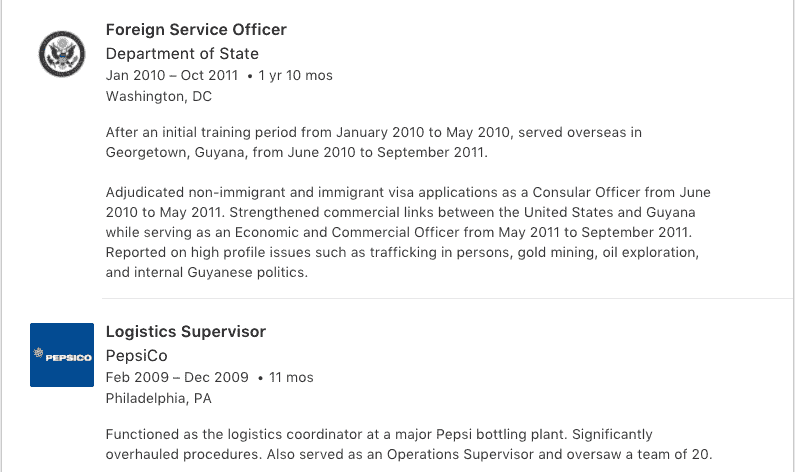
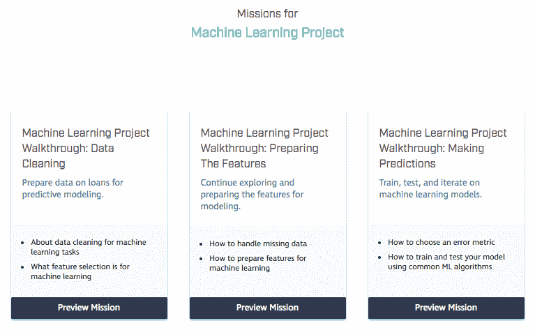

# 修正教育:动机与自由

> 原文：<https://www.dataquest.io/blog/fixing-education/>

February 8, 2018

公共教育，至少在美国，只让你接触一种学习方式——自上而下的等级制度和作业。虽然有些人在这种环境中茁壮成长，但我不是其中之一。大学毕业后，我带着 2.1 的 GPA，没有真本事，不知道下一步该怎么做，被扔进了这个世界。我并不孤单。

由于这个系统对我不起作用，我认为我不喜欢学习，像数学和物理这样“更难”的科目不适合我。我从一个职业跳到另一个职业——UPS 卸货员、百事可乐仓库经理、美国外交官——才意识到我可以按照自己的方式学习我想学的东西。

我已经[详细描述了](https://www.dataquest.io/blog/learn-data-science/)[如何](https://www.dataquest.io/blog/how-to-become-a-data-scientist/) [其他地方](https://www.dataquest.io/blog/learn-python-the-right-way/)，但对我来说，故事最有趣的部分不是我如何学习，甚至不是结果——而是我如何从枯燥的学习变成快乐的学习。关键部分是探索的自由，以及能够解决有趣的问题(例如[预测股票市场](https://www.dataquest.io/blog/i-barely-graduated-college/))。

在这篇文章中，我分享了我认为我们需要的教育变革。我在这里的观点并不适用于每个人，因为教育不是放之四海而皆准的，但我确实相信它们对许多人来说是正确的。让我们开始吧。

## 鼓励动力和探索

如何激励学生并给予他们探索的自由，这个核心问题在教育界还没有得到很好的解决(尽管这正在慢慢地改变 T2)。即使在线教育可以进行更多的尝试，但仍然或多或少地局限于内容交付模式，创新围绕着内容交付模式(视频、交互式代码等)。).

为了鼓励动机，你必须允许学生选择他们学什么，以及他们如何学。真正想学习的人可以解决最枯燥的数学课本，并理解其中的概念。然而，一个没有动机的学生可能会因为一开始被迫阅读这本书、这本书的大小或任何其他负面因素而感到厌烦。

当我两年前开始 Dataquest 时，我们几乎完全是关于内容交付的——我们有交互式数据科学教程，要求学生编写代码来解决问题。随着时间的推移，我们已经发展到通过在浏览器中构建更多的开放式项目来帮助学生应用他们的知识，然后让他们进行评审。随着学生能力的提升，学习变得越来越不基于内容，而更多的是基于项目。

这种学习方式让你变得更加独立。当您编写第一个 Javascript 应用程序时，您可能需要先学习编程概念和其他基础知识，这需要大量的介绍性内容。然而，一旦你写了 20 个应用程序，并且你正在写另一个使用[服务工作者](https://developers.google.com/web/fundamentals/primers/service-workers/)的应用程序，一个你还没有听说过的概念，你可能需要文档和一些来自同行的反馈。随着你获得技能，不仅你需要多少帮助会改变，你需要的帮助类型也会改变。

## 转向基于项目的学习

在“真实世界”的工作中，你基本上只是创建一系列的项目。每个项目都有一定的时间范围，并最终根据其质量进行评判。当您构建项目时，您会查阅许多资源来了解您需要的所有概念。因为这就是真实世界的工作，所以学习使用项目也是有意义的。你的学习方式和现实世界中的做事方式之间的差距越大，转变就越困难。

创建项目也很有动力。想想我之前关于预测股票市场的例子——我就是这样学习统计学的。我发现了一些我感兴趣的东西，并逆向学习完成这个项目所需要的东西。

我相信理想的在线学习环境是相似的——你能够学习一些基础知识，选择你感兴趣的项目，并且只获得你需要的帮助来完成这些项目。这种帮助可以是来自导师的反馈、文档链接、内容或其他任何东西。这种学习永远不会结束——你可以继续处理不同的兴趣领域来获得技能。

不幸的是，建立这种学习方式有几个挑战。其中最重要的是教育没有灵丹妙药。例如，如果你从事乘车共享，你可以制作一个连接乘客和司机的应用程序，筹集大量资金，并[向 hypergrowth](https://www.brookings.edu/blog/the-avenue/2017/06/01/ridesharing-hits-hyper-growth/) 问好。

然而，在教育领域，学生有如此多不同的目标和偏好的学习方法，以至于开发一个新产品要花很多时间。你必须编写和修改内容，设计一个支持这些内容的平台，了解你的学生和他们是如何学习的，然后在我前面描述的所有其他帮助方法上再加一层。最重要的是，你必须能够有效地向以结果为导向的学生推销你所做的事情。很明显，大多数最大的教育科技公司(Pluralsight、Lynda、Coursera、Udemy)的教学方式基本相同，这与面授课程的教学方式非常相似——结构化的课程，由讲师向你讲述。

构建基于项目的学习的其他挑战包括:

*   如何帮助学生探索他们感兴趣的东西
*   如何判断学生在什么时候需要什么帮助
*   设计吸引人且有效的项目
*   弄清楚如何将学生与项目匹配到合适的技能水平

诚然，解决这个问题令人生畏，但影响将是巨大的。

## 今后

真正的终身学习可以确保没有人拥有错误的技能，或者陷入自己不喜欢的职业。能够激励传统体制不兼容的学生也可以帮助世界上数百万在毕业后没有太多机会的人。这是一个关键问题，尤其是当学费上涨只会加剧教育机会不平等的问题时。

尽管存在挑战，但我相信在未来几年里，我们有很好的机会来建立更吸引人的在线学习体验。在线教育仍然很新([MOOC 的年份是 2013 年](https://www.informationweek.com/software/is-2013-year-of-the-mooc/d/d-id/1108232?))，非传统证书[正变得越来越被接受](https://www.elonnewsnetwork.com/article/2017/09/alternative-paths-to-success-college-dropouts)(尤其是在科技领域)，互联网接入正在迅速增加。

迟早，在线教育将提供比面对面教育更好的体验——问题只是什么时候。

如果你对这篇文章有任何想法，或者你对教育有强烈的意见，我很乐意和你聊天(尤其是如果你不同意的话)。在 [【邮件保护】](/cdn-cgi/l/email-protection#5127383a113530253020243422257f383e) 给我发邮件！