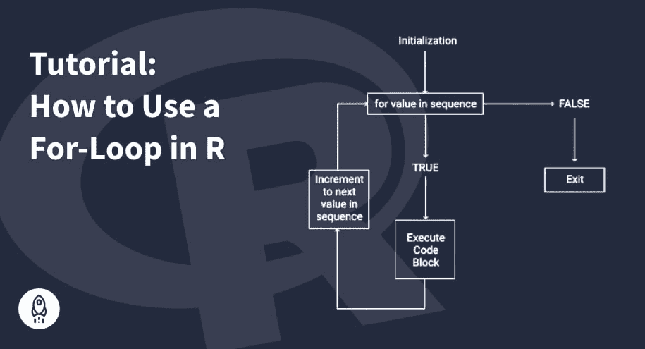

# 如何在 R 中使用 For 循环(有 18 个代码示例)

> 原文：<https://www.dataquest.io/blog/for-loop-in-r/>

June 13, 2022

for 循环是 R 编程语言中主要的控制流结构之一。那是什么意思，你如何使用它？

在本教程中，我们将讨论 R 中的 for 循环是什么，它有什么语法，什么时候可以应用，如何在不同的数据结构上使用它，如何嵌套几个 for 循环，以及如何调节 for 循环的执行。

## 什么是 R 中的 For 循环？

for 循环是 R 编程语言的主要控制流结构之一。它用于迭代对象集合，如向量、列表、矩阵或数据帧，并对给定数据结构的每一项应用相同的操作集。我们使用 for 循环来保持代码的整洁，避免代码块不必要的重复。

R 中 for 循环的基本语法如下:

```
for (variable in sequence) {
    expression
}
```

这里，*序列*是 for 循环迭代的对象(例如向量)的集合，*变量*是该集合在每次迭代中的一项，循环体中的*表达式*是为每一项计算的一组运算。

从上面的语法来看，关键字`for`和`in`是强制的，括号也是。其他元素，如花括号、缩进、将表达式和结束花括号放在新行上、for 循环头和循环体之间的空白，不是强制的，但强烈建议使用。推荐使用它们的目的是为了突出 for 循环的主要部分，从而提高代码的可读性并便于调试(如果需要的话)。

除非使用了`break`语句，否则 for 循环会在对象集合的最后一项之后停止(我们将在本教程的后面考虑该语句)。

## 如何在 R 中使用 For 循环

让我们看看 R 中的 for 循环如何用于遍历各种类型的对象集合。特别地，让我们考虑一个向量、一个列表和一个矩阵。

### 对向量使用 For 循环

从一个非常简单的例子开始，让我们打印从 1 到 5 的所有数字。为此，我们将采用由`:`操作符(`1:5`)创建的相应向量，并使用`print()`函数作为表达式:

```
for (x in 1:5) {
    print(x)
}
```

```
[1] 1
[1] 2
[1] 3
[1] 4
[1] 5
```

在现实世界中，我们可能希望使用更有意义的变量名，而不是`x`(例如`price`、`month`等)。).

如果我们需要将每个值打印为一个字符，给出更多的上下文，我们可以将`paste()`函数添加到表达式中:

```
for (month in 1:5) {
    print(paste('Month:', month))
}
```

```
[1] "Month: 1"
[1] "Month: 2"
[1] "Month: 3"
[1] "Month: 4"
[1] "Month: 5"
```

通常，我们需要评估 for 循环体中的条件表达式，并基于此输出相应的结果:

```
for (month in 1:5) {
    if (month < 3) {
        print(paste('Winter, month', month))
    } else {
        print(paste('Spring, month', month))
    }
}
```

```
[1] "Winter, month 1"
[1] "Winter, month 2"
[1] "Spring, month 3"
[1] "Spring, month 4"
[1] "Spring, month 5"
```

使用易于理解且一致的语法，注意缩进，并将循环体的每个部分放在新的一行上，我们清楚地看到，对于第 1 个月和第 2 个月(即小于 3 个月)，for 循环打印“Winter”和该月的数字。对于其他月份，For 循环输出“Spring”和月份号。通过下面这段代码，我们有效地获得了相同的结果:

```
for(month in 1:5) if(month < 3)print(paste('Winter, month', month))else print(paste('Spring, month', month))
```

```
[1] "Winter, month 1"
[1] "Winter, month 2"
[1] "Spring, month 3"
[1] "Spring, month 4"
[1] "Spring, month 5"
```

在第二种情况下，代码看起来更难掌握。这证实了使用正确的语法，包括非强制元素，对于提高代码可读性是非常重要的。

我们可以通过将每次迭代的结果附加到一个最初为空的向量，将 for 循环的输出存储在一个新的向量中，如下例所示:

```
vect_1 <- c(2, 7, 4, 9, 8)
vect_2 <- numeric()

for(num in vect_1) {
    vect_2 <- c(vect_2, num * 10)
}

vect_2
```

1.  Twenty
2.  Seventy
3.  Forty
4.  Ninety
5.  Eighty

上面，我们将数值向量`vect_1`的每一项乘以 10，并将每次迭代的值加到`vect_2`。

for 循环也适用于字符向量:

```
animals <- c('koala', 'cat', 'dog', 'panda')

for (animal in animals) {
    print(animal)
}
```

```
[1] "koala"
[1] "cat"
[1] "dog"
[1] "panda"
```

### 在列表中使用 For 循环

让我们尝试在列表上应用 for 循环。

首先，让我们创建一个混合数据类型和结构的列表:

```
my_list <- list(c(5, 8, 2, 9), 'cat', 'dog', c('koala', 'panda', 'rabbit'), TRUE, 3.14)
my_list
```

2.  “猫”

```
*   “狗” 
```

*   真实的

```
*   Three point one four
```

我们可以打印列表中每个项目的值:

```
for (item in my_list) {
    print(item)
}
```

```
[1] 5 8 2 9
[1] "cat"
[1] "dog"
[1] "koala"  "panda"  "rabbit"
[1] TRUE
[1] 3.14
```

我们还可以打印列表中每个项目的长度:

```
for (item in my_list) {
    print(length(item))
}
```

```
[1] 4
[1] 1
[1] 1
[1] 3
[1] 1
[1] 1
```

现在，让我们基于`my_list`创建一个新列表，初始列表的每一项都复制两次:

```
my_list_2 <- list()

for(i in 1:length(my_list)) {
    my_list_2[[i]] <- rep(my_list[[i]], 2)
}

my_list_2
```

```

正如我们在向量部分所做的那样，我们可以在上面的 for 循环体中添加一个条件评估。让我们创建一个新的列表`my_list_3`，同样基于`my_list`，初始列表的每个条目复制两次，*，但是只针对长度大于 1* 的条目。否则会加一个人物`'Too short item'`:

```
my_list_3 <- list()

for(i in 1:length(my_list)) {
    if (length(my_list[[i]]) > 1) {
        my_list_3[[i]] <- rep(my_list[[i]], 2)
    } else {
        my_list_3[[i]] <- 'Too short item'
    }
}

my_list_3
```

2.  '太短的项目'

```
*   '太短的项目' 
```

'太短的项目'

```
*   '太短的项目'
```

在矩阵上使用 For 循环
由于 R 中的矩阵是具有行和列的二维数据结构，为了循环通过矩阵，我们必须使用**嵌套 for 循环**，即一个 for 循环在另一个 for 循环内:

```
my_matrix <- matrix(1:9, nrow=3, ncol=3)

for (row in 1:nrow(my_matrix)) {
    for (col in 1:ncol(my_matrix)) {
        print(paste('Row', row, 'col', col, 'value', my_matrix[row, col]))
    }
}
```

```
[1] "Row 1 col 1 value 1"
[1] "Row 1 col 2 value 4"
[1] "Row 1 col 3 value 7"
[1] "Row 2 col 1 value 2"
[1] "Row 2 col 2 value 5"
[1] "Row 2 col 3 value 8"
[1] "Row 3 col 1 value 3"
[1] "Row 3 col 2 value 6"
[1] "Row 3 col 3 value 9"
```

在上面这段代码中，我们创建了一个 3×3 的矩阵，用 1 到 9 的整数填充它，并使用 2 个嵌套的 for 循环来遍历行和列，并打印矩阵中每个单元格的值。
通过嵌套的 for 循环，我们可以修改矩阵的值。例如，让我们重置矩阵的所有值，使每个值都等于相应单元格的索引之和。为此，我们将使用一个内置的 R 函数`dim()`来返回矩阵的维数:

```
for(i in 1:dim(my_matrix)[1]) {
    for(j in 1:dim(my_matrix)[2]) {
        my_matrix[i, j] = i + j
    }
}

my_matrix
```

 Two |
 three |
 four |

 three |
 four |
 five |

 four |
 five |
 six |

R 中的嵌套 for 循环不仅适用于操作矩阵。下面是一个简单的例子，说明如何创建两个向量值的各种组合并打印这些组合:

```
qualities <- c('funny', 'cute', 'friendly')
animals <- c('koala', 'cat', 'dog', 'panda')

for (x in qualities) {
    for (y in animals) {
        print(paste(x, y))
    }
}
```

```
[1] "funny koala"
[1] "funny cat"
[1] "funny dog"
[1] "funny panda"
[1] "cute koala"
[1] "cute cat"
[1] "cute dog"
[1] "cute panda"
[1] "friendly koala"
[1] "friendly cat"
[1] "friendly dog"
[1] "friendly panda"
```

在数据帧上使用 For 循环
就像我们对上述矩阵所做的一样，我们可以循环遍历 dataframe，它也是一个二维数据结构:

```
super_sleepers <- data.frame(rating=1:4, 
                             animal=c('koala', 'hedgehog', 'sloth', 'panda'), 
                             country=c('Australia', 'Italy', 'Peru', 'China'),
                             avg_sleep_hours=c(21, 18, 17, 10))

print(super_sleepers)
```

```
 rating   animal   country avg_sleep_hours
1      1    koala Australia              21
2      2 hedgehog     Italy              18
3      3    sloth      Peru              17
4      4    panda     China              10
```

```
for (row in 1:nrow(super_sleepers)) {
    for (col in 1:ncol(super_sleepers)) {
        print(paste('Row', row, 'col', col, 'value', super_sleepers[row, col]))
    }
}
```

```
[1] "Row 1 col 1 value 1"
[1] "Row 1 col 2 value koala"
[1] "Row 1 col 3 value Australia"
[1] "Row 1 col 4 value 21"
[1] "Row 2 col 1 value 2"
[1] "Row 2 col 2 value hedgehog"
[1] "Row 2 col 3 value Italy"
[1] "Row 2 col 4 value 18"
[1] "Row 3 col 1 value 3"
[1] "Row 3 col 2 value sloth"
[1] "Row 3 col 3 value Peru"
[1] "Row 3 col 4 value 17"
[1] "Row 4 col 1 value 4"
[1] "Row 4 col 2 value panda"
[1] "Row 4 col 3 value China"
[1] "Row 4 col 4 value 10"
```

在 For 循环中使用`Break`语句
在 for 循环的逻辑条件中使用了`break`语句，以便在遍历完所有项之前退出循环。在嵌套循环的情况下，该语句只中断最内层的循环。
让我们遍历前一个例子中的动物的字符向量，一旦遇到少于 4 个字符的项，就停止 for 循环:

```
animals <- c('koala', 'cat', 'dog', 'panda')

for (animal in animals) {
    if (nchar(animal) < 4) {
        break
    }
    print(animal)
}
```

```
[1] "koala"
```

我们看到，即使在“koala”之后的某个地方，我们的向量`animals`中有另一个至少有 4 个字符的项目(“panda”)，for 循环也没有达到那个值，并在第一次出现一个少于 4 个字符的项目(“cat”)时停止执行。
在 For 循环中使用`Next`语句
与`break`语句不同，这个语句用于根据某些预定义的条件跳过迭代，而不是退出整个循环。
为了理解这条语句是如何工作的，让我们运行与上面相同的代码，用`next`替换`break`:

```
animals <- c('koala', 'cat', 'dog', 'panda')

for (animal in animals) {
    if (nchar(animal) < 4) {
        next
    }
    print(animal)
}
```

```
[1] "koala"
[1] "panda"
```

这一次，少于 4 个字符的两个项目(“猫”和“狗”)都被丢弃，而另外两个项目(“考拉”和“熊猫”)被打印。
结论
在本教程中，我们探讨了 r 中 for 循环的用法。现在我们知道了以下内容:

*   如何在 R 中定义 for 循环
*   for 循环的语法——以及哪些语法元素是必需的
*   R 中 for 循环的目的
*   如何在向量、列表和矩阵上使用 for 循环
*   如何以及为什么嵌套多个 for 循环
*   哪些语句有助于控制 for 循环的行为，以及如何使用它们

```