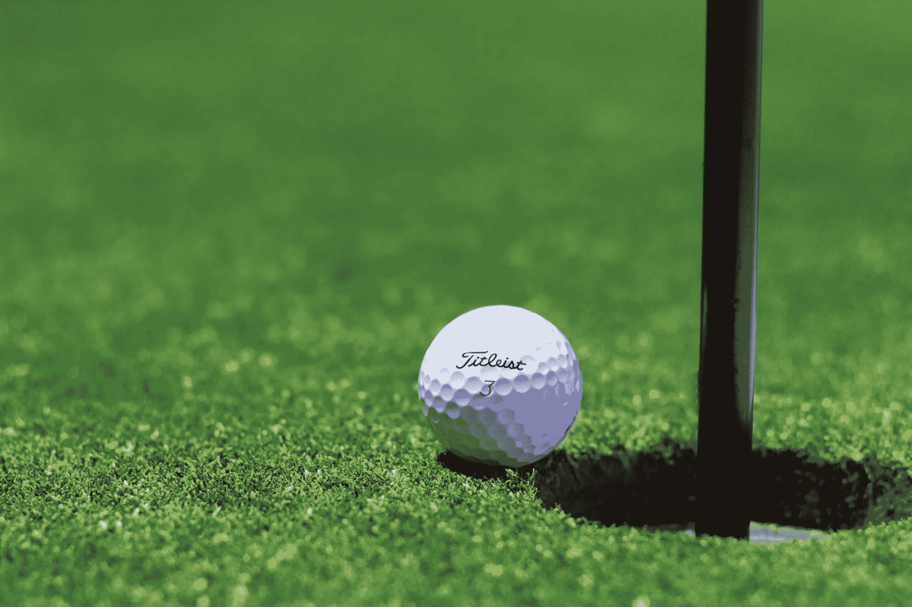

# 数据故事:父亲在美国公开赛父亲节表现更好

> 原文：<https://www.dataquest.io/blog/golf-us-open-fathers-day-data-analysis/>

June 14, 2019

对于高尔夫球迷来说，美国公开赛是最令人兴奋的赛事之一。多年来，比赛一直安排在六月中旬，所以比赛的最后一天正好是父亲节。这个节日是锦标赛中一些最激动人心的时刻的来源，包括去年当新爸爸汤米·弗利特伍德度过了一个绝对壮观的日子，并且只差一杆就赢得了锦标赛。

那场表演让我不禁想:**当爸爸的高尔夫球手在父亲节会打得更好吗？**

这个问题并不像看起来那么荒谬。高尔夫球是一项非常需要脑力的运动。球员必须在高压力的情况下集中注意力，即使是一点点额外的积极性也可能会有所不同。​

那么，在父亲节做父亲会带来某种小优势吗？没有办法确切知道因果关系，但数据表明，无论原因是什么，父亲们在父亲节往往比其他人表现得更好。

为了弄清楚这一点，我从 USGA 的美国公开赛网站上搜集了过去十年来每一位高尔夫球手在父亲节的表现数据。然后，我从[的 PGA 巡回赛网站](https://www.pgatour.com/)获取数据，其中包括每个球员的传记资料，包括他们孩子的生日(如果他们有孩子的话)。这让我能够计算出在过去十年的每个父亲节，每个球员是否是父亲，并相应地分析他们的表现。

由于美国网球公开赛每年在不同的球场举行，所以没有办法比较每年的表现，所以下面的图表显示了从 2009 年开始，在锦标赛的每一年中，*是*父亲的球员与*不是*父亲的球员的表现。

箱形图，极端异常值以点的形式绘制。

上图每个方框中的黑线代表非父亲(蓝色)和父亲(绿色)的*中值*分数。如你所见，在过去的十年中，有六年的父亲节，父亲的得分低于非父亲的得分(回想一下，在高尔夫球比赛中，*得分最低的*获胜)。

在另外两年中，父亲和非父亲的得分中值持平。在过去的十个父亲节里，没有父亲的美国公开赛平均成绩只赢过父亲两次。

诚然，这可能并不意味着父亲有任何特殊的父亲节权力。美国公开赛确实包括业余高尔夫球手，他们的分数往往高于职业球手。这些业余爱好者的平均年龄也可能比专业人士小，因此不太可能成为父母，这可能是父亲的一个优势。

还值得指出的是，这里的边距很小——在大多数情况下，差别只有一两个笔画。

尽管如此，数字不会说谎:不管是什么原因，在过去十年的美国公开赛上，父亲们在父亲节的表现比其他高尔夫球手都要好。

也许泰格·伍兹、达斯汀·约翰逊和本周末锦标赛中的其他父亲们可以希望得到一点鼓励，因为他们试图阻止年轻的布鲁克斯·科普卡(Brooks Koepka)获得美国公开赛的三连冠，布鲁克斯不是父亲。

### 成为数据分析师！

立即学习成为数据分析师所需的技能。注册一个免费帐户，获得免费的交互式 Python、R 和 SQL 课程内容。

[Sign up now!](https://app.dataquest.io/signup)

*(不需要信用卡！)*