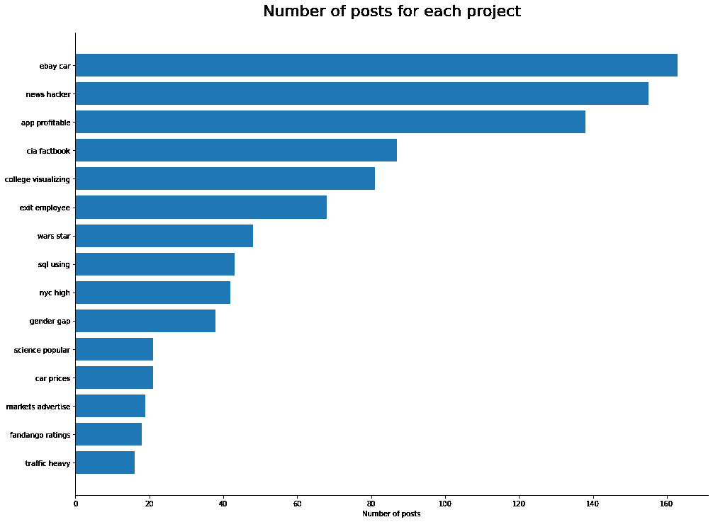

# nlp 项目第 2 部分:如何清理和修复用于分析的数据

> 原文：<https://www.dataquest.io/blog/how-to-clean-and-prepare-your-data-for-analysis/>

January 24, 2022

这是描述我的自然语言处理项目的系列文章的第二篇。要真正从这篇 NLP 文章中受益，您应该阅读[的第一篇文章](https://www.dataquest.io/blog/nlp-project-scraping-the-web-to-gather-data/)，了解如何使用 pandas 处理文本数据，并了解列表理解和 [lambda 函数](https://app.dataquest.io/m/49)。我们还将编写一些函数，并导入许多包和工具。在继续之前，有必要熟悉一下这些概念。

这篇文章的主要目的是分析学员在 [Dataquest 社区](https://community.dataquest.io/)上收到的回复。Dataquest 鼓励学习者在他们的论坛上发布他们的指导项目。发布项目后，其他学习者或工作人员可以分享他们对项目的看法。我们对这些观点的内容感兴趣。

在[第一帖](https://www.dataquest.io/blog/nlp-project-scraping-the-web-to-gather-data/)中，我们学习了如何使用[美汤](https://beautiful-soup-4.readthedocs.io/en/latest/)进行网页抓取。我们从 Dataquest 的论坛页面收集数据，并将其组织在一个熊猫数据框架中:

*   我们提取了每个帖子的标题、链接、回复数和浏览量
*   我们还抓取了帖子的网站——具体来说，我们锁定了帖子的第一个回复

这是我们继续工作的地方。在这篇文章中，我们将清理和分析文本数据。我们将从小处着手:清理和组织标题数据，然后我们将对每个标题的数字信息(浏览、回复)进行一些数据分析。我们主要是展示潜力，然后快速前进。

接下来，我们将处理和分析反馈帖子。我们将使用各种 NLP 技术来分析反馈的内容:

*   标记化
*   N-grams
*   词性标注
*   组块
*   词汇化

我们将使用上面提到的所有技术。我们的主要目标是了解提供了什么样的反馈。我们特别感兴趣的是关于我们项目的技术建议。比起情感分析，我们更感兴趣的是什么样的技术评论是最常见的。

你可以在我的 Github 上找到这个项目的[文件夹。所有文件都已经在那个文件夹中了，所以如果你想在不抓取数据的情况下处理数据，你可以下载数据集。笔记本也有。如果你有任何问题，请随时伸出手问我任何事情:](https://github.com/grumpyclimber/portfolio/blob/main/ml/nlp_feedback/) [Dataquest](https://community.dataquest.io/u/adam.kubalica/) ， [LinkedIn](https://www.linkedin.com/in/kubalica/) 。

## 第 1 部分:标题问题——每个人都想要一个不同的标题

我们都有罪:我们想发布我们的项目并获得关注。获得一定关注的最简单方法是什么？想一个有趣又原创的标题！所以现在当有人想把所有的文章按标题分组时。我们得到 1102 个结果，因为有 1102 个不同的标题。我们知道不同项目的数量接近 20 或 30 个。所以让我们试着根据内容对这些帖子进行分类。

## 小写、标点和停用词

在我们开始打扫卫生之前，让我们先了解一个简单的事实:

```
'ebay' == 'Ebay'
```

输出

```
False
```

如上所述，Python 是一种区分大小写的语言——“e”与“e”不同。这就是为什么清理字符串数据的第一步是将所有单词转换为小写:

```
df['title'] = df['title'].str.lower()
```

现在让我们继续删除标点符号；我们将创建一个简单的函数，并将其应用于每个“标题”单元格:

```
import string

# create function for punctuation removal:
def remove_punctuations(text):
	for char in string.punctuation:
		text = text.replace(char, '')
	return text

# apply the function:
df['title'] = df['title'].apply(remove_punctuations)
```

请注意我们是如何从“string”包中导入标点符号列表的，而不是创建一个列表并手动填充所有这些符号。我们将更频繁地使用这种方法，因为它更快更容易。

上面的方法是一个易于理解的函数，但不是最有效的方法。如果您的数据集非常大，您应该检查[堆栈溢出](https://stackoverflow.com/questions/265960/best-way-to-strip-punctuation-from-a-string)以获得更好的解决方案。

### 停止言语

最后但同样重要的是，我们将删除停用词。什么是停用词？如果我们只是问一个搜索引擎，我们应该会收到一个字典的答案:

**停用词** —从计算机生成的索引或索引中自动省略的词。

来自牛津语言的定义

有很多“the”、“in”、“I”和其他单词使我们的标题语法正确，但往往没有任何其他用途。

让我们检查其中一个标题的删除示例:

```
# import list of stopwords:
from nltk.corpus import stopwords
stop = stopwords.words('english')

# remove stopwords from the below example:
example1 = 'guided project visualizing the gender gap in college degrees'
' '.join([word for word in example1.split() if word not in stop])
```

输出

```
'guided project visualizing gender gap college degrees'
```

我们已经删除了停用词，但内容仍然很容易理解。值得一提的是[有时候](https://medium.com/@limavallantin/why-is-removing-stop-words-not-always-a-good-idea-c8d35bd77214)删除停用词并不是最好的主意。

我们可以将上面的方法应用于所有的“标题”单元格，但在此之前，我们想在列表中添加一些我们选择的单词。我们知道许多标题包含“项目”、“反馈”等词。他们没有给我们任何关于帖子内容的信息，所以我们应该删除它们:

```
# add more words to stopwords list:
guided_list = ['guided', 'project', 'feedback']
stop_extended = stop + guided_list

# create a column without the stopwords:
df['title_nostop'] = df['title'].apply(lambda x: ' '.join([word for word in x.split() if word not in stop_extended]))
```

让我们在最初的几个步骤之后检查一下我们有多少独特的标题:

```
len(df['title_nostop'].unique())
```

输出

```
927
```

与预期的 20-30 本相比，这仍然是一个非常大的数字。我们必须要有创意！

## 使用标签号

```
df['content'][1]
```

输出

```
<tr class="topic-list-item category-share-guided-project tag-python tag-pandas tag-469 tag-data-analysis-business tag-469-11 has-excerpt ember-view" data-topic-id="558226" id="ember77">\n<td class="main-link clearfix" colspan="">\n<div class="topic-details">\n<div class="topic-title">\n<span class="link-top-line">\n<a class="title raw-link raw-topic-link" data-topic-id="558226" href="https://community.dataquest.io/t/re-upload-project-feedback-popular-data-science-questions/558226/2" level="2" role="heading"><span dir="ltr">[Re-upload]Project Feedback - Popular Data Science Questions</span></a>\n<span class="topic-post-badges"></span>\n</span>\n</div>\n<div class="discourse-tags"><a class="discourse-tag bullet" data-tag-name="python" href="https://community.dataquest.io/tag/python">python</a> <a class="discourse-tag bullet" data-tag-name="pandas" href="https://community.dataquest.io/tag/pandas">pandas</a> <a class="discourse-tag bullet" data-tag-name="469" href="https://community.dataquest.io/tag/469">469</a> <a class="discourse-tag bullet" data-tag-name="data-analysis-business" href="https://community.dataquest.io/tag/data-analysis-business">data-analysis-business</a> <a class="discourse-tag bullet" data-tag-name="469-11" href="https://community.dataquest.io/tag/469-11">469-11</a> </div>\n<div class="actions-and-meta-data">\n</div>\n</div></td>\n<td class="posters">\n<a class="" data-user-card="kevindarley2024" href="https://community.dataquest.io/u/kevindarley2024"></a>\n<a class="latest" data-user-card="jesmaxavier" href="https://community.dataquest.io/u/jesmaxavier"></a>\n</td>\n<td class="num posts-map posts" title="This topic has 3 replies">\n<button class="btn-link posts-map badge-posts">\n<span aria-label="This topic has 3 replies" class="number">3</span>\n</button>\n</td>\n<td class="num likes">\n</td>\n<td class="num views"><span class="number" title="this topic has been viewed 47 times">47</span></td>\n<td class="num age activity" title="First post: Nov 14, 2021 2:57 am\nPosted: Nov 18, 2021 6:38 pm">\n<a class="post-activity" href="https://community.dataquest.io/t/re-upload-project-feedback-popular-data-science-questions/558226/4"><span class="relative-date" data-format="tiny" data-time="1637221085326">3d</span></a>\n</td>\n</tr>
```

指导项目的每一课都有唯一的编号。大多数发布的项目都标有这些数字。利用这些知识，我们可以尽可能地提取标签号:

```
df['tag'] = df['content'].str.extract('data-tag-name="(\d+)" href')
```

现在，让我们检查一下有多少帖子标有课程编号:

```
df['tag'].value_counts().sum()
```

输出

```
700
```

1102 个帖子中有 700 个贴上了课程编号；现在我们必须填写缺失的部分。我们将这样解决这个问题:

1.  检查每个课程编号标题中最常见的单词
2.  如果该词出现不止一次，或者与项目内容无关，则将其从所有标题中删除
3.  循环遍历顶部的 25 个(可以调整为不同的数量)标签，对于每个标签，执行以下操作:

*   检查该标签最常用的单词
*   选择标题包含最常用单词且“标签”值为空的行
*   将当前标签分配给这些行

## 第一步。检查每个标签最常用的单词

```
from collections import Counter
for a_tag in df['tag'].value_counts()[:25].index:
	top_word = Counter(" ".join(df[df['tag']==a_tag]['title_nostop']).split()).most_common(1)[0][0]
	print(a_tag,top_word)
```

输出

294 ebay
356 黑客
350 app
257 cia
146 学院
348 出口
149 性别
201 战争
217 nyc
191 sql
524 交通
469 数据
155 汽车
310 极品
288 fandango
529 交流
64

## 第二步:删除重复出现的单词

上述大多数关键词都指向我们都必须忍受的教训。但是“最佳”或“数据”并不能真正给我们任何关于这个项目的信息。最重要的是，两个不同的标签有相同的单词(“预测”)作为最常见的单词。让我们去掉这些词:

```
more_stop = ['predicting','best','analyzing','data','exploring']
df['title_nostop'] = df['title_nostop'].apply(lambda x: ' '.join([word for word in x.split() if word not in (more_stop)]))

for a_tag in df['tag'].value_counts()[:25].index:
	top_word = Counter(" ".join(df[df['tag']==a_tag]['title_nostop']).split()).most_common(1)[0][0]
	print(a_tag,top_word)
```

## 步骤 3:遍历标签号

```
for a_tag in df['tag'].value_counts()[:25].index:
	top_word = Counter(" ".join(df[df['tag']==a_tag]['title_nostop']).split()).most_common(1)[0][0]
	df.loc[(df['title_nostop'].str.contains(top_word)) & df['tag'].isnull(), 'tag'] = a_tag

df[df['tag'].isnull()].shape
```

## “汽车”问题

你可能注意到了，tag 155 最常见的词是 car 不幸的是，这个词在易贝项目中非常常见。以下是将不正确的标签编号分配给不正确的项目的问题的快速解决方法:

```
df.loc[(df['title_nostop'].str.contains('german')) & (df['tag']=='155'),'tag'] = '294'
df[df['tag'].isnull()].shape
```

输出

```
(59, 8)
```

我们可以删除 59 行以获得一致的数据集；当我们这样做时，让我们删除原来的“标题”列:

```
df = df[~(df['tag'].isnull())].copy()
df = df.drop(columns='title')
```

好的，我们有一个数据集，其中每一行都有一个指定的课程编号，但是为了执行进一步的分析，我们不想过于依赖这些编号。毕竟，“294”并没有告诉我们太多，但“易趣”已经给了我们一个项目的线索。但一个单词有时是不够的，所以让我们为每个课号检查最常见的两个单词，并为它们创建一个列。有时这种组合不会按照预期的顺序，但它会清楚地指向项目的主题。

有一个问题:我们只能用前 29 课的数字来做；其余的只出现一次，所以如果标题在数据集中只出现一次，我们就无法检查最常见的单词。

```
# create empty dictionary and a column filled with '0's
pop_tags = {}
df['short_title'] = None
# loop trough first 29 tags and extract 2 most common words, merge them into 1 string and store it in a dictionary:
for a_tag in df['tag'].value_counts()[:29].index:
	top_word = Counter(" ".join(df[df['tag']==a_tag]['title_nostop']).split()).most_common(2)[0][0]
	top_word2 = Counter(" ".join(df[df['tag']==a_tag]['title_nostop']).split()).most_common(2)[1][0]
	pop_tags[a_tag] = top_word+' '+top_word2
```

现在，我们已经有了一个字典，其中包含了每个课程编号最常用的两个单词，让我们将它们分配给每一行:

```
for a_tag in df['tag'].value_counts()[:29].index:
	df.loc[df['tag']==a_tag, 'short_title'] = pop_tags[a_tag]
```

让我们来看看 10 个最受欢迎的短篇:

```
df['short_title'].value_counts()[:10]
```

输出

| 新闻黑客 | One hundred and sixty-three |
| 易趣汽车 | One hundred and fifty-five |
| app 盈利 | One hundred and thirty-eight |
| 大学可视化 | Eighty-seven |
| 中情局实况报道 | Eighty-one |
| 离职员工 | sixty-eight |
| 星球大战 | Forty-eight |
| 性别差距 | Forty-three |
| 纽约高中 | forty-two |
| sql 使用 | Thirty-eight |
| 名称:短标题 | dtype: int64 |

## 第 2 部分:EDA 潜力

“星球大战”对于一部太空歌剧来说并不是一个朗朗上口的名字，但我们可以认出一个熟悉的话题。现在，我们可以将每个独特的标题归类到一个特定的项目，我们可以开始分析数据集。哪个项目的职位数量最多？

```
import matplotlib.pyplot as plt

# group the dataset by project title:
plot_index = df.groupby('short_title')['views'].sum().sort_values()[-15:].index
plot_counts = df.groupby('short_title')['views'].count().sort_values()[-15:].values

# create a plot:
fig, ax = plt.subplots(figsize=(16,12))
plt.barh(plot_index,plot_counts, label='number of posts')
ax.spines['right'].set_visible(False)
ax.spines['top'].set_visible(False)
ax.set_xlabel('Number of posts')
plt.title('Number of posts for each project',fontsize=22,pad=24)
plt.show()
```

[](https://www.dataquest.io/wp-content/uploads/2022/01/number-of-posts-chart.webp)

这只是我们可以使用当前数据集生成的许多可能图中的一个；以下是更多情节的一些想法:

*   每个项目的平均查看次数
*   每个项目的平均回复数
*   观点比例/帖子数量

我们还可以继续从我们收集的原始 HTML 块中提取数据——我们仍然可以提取日期并跟踪主题随时间的流行程度。

另一个潜在的方法是将项目分为不同的技能级别，并根据项目的难度跟踪所有的度量标准。

在我们做以上任何事情之前，我们应该组织标题，并确保单词的顺序是合乎逻辑的，这样我们就不会再有“星球大战”的案例了。

我们可以做到所有这些，甚至更多，但现在不是这样做的时间和地点。这篇文章是关于自然语言处理技术的，我们还没有完全覆盖它们。这就是为什么我们将跳过数值数据的探索性数据分析，转到第 3 部分。

## 第 3 部分:使用 NLP 技术的反馈分析

### 清理文本数据

```
df['feedback'][0]
```

输出

```
\nprocessing data inside a function saves memory (the variables you create stay inside the function and are not stored in memory, when you’re done with the function) it’s important when you’re working with larger datasets - if you’re interested with experimenting:\nhttps://www1.nyc.gov/site/tlc/about/tlc-trip-record-data.page\nTry cleaning 1 month of this dataset on kaggle notebook (and look at your RAM usage) outside the function and inside the function, compare the RAM usage in both examples\n
```

让我们从删除不必要的 HTML 代码和小写字母开始。下一步，我们将展开所有的缩写(将“不”展开为“不”等。)—我们将为此使用一个方便的[收缩包](https://github.com/kootenpv/contractions)。之后，我们将删除标点并将结果存储在一个新列中。为什么？去掉标点符号会阻止我们识别句子，我们会想要分析单个的句子。这就是为什么我们要保留两个选项:带标点和不带标点的字符串。接下来，我们将删除停用词和 10 个最常出现的词。

```
import contractions

# remove '\n' and punctuation, lowercase all letters
df['feedback'] = df['feedback'].str.replace('\n',' ').str.lower()

# expand contractions
df['feedback'] = df['feedback'].apply(lambda x: contractions.fix(x))

# remove punctuations
df['feedback_clean'] = df['feedback'].apply(remove_punctuations)

# remove stopwords
df['feedback_clean'] = df['feedback_clean'].apply(lambda x: ' '.join([word for word in x.split() if word not in (stop)]))

# check 10 most common words:
freq10 = pd.Series(' '.join(df['feedback_clean']).split()).value_counts()[:10]

# remove 10 most common words:
df['feedback_clean2'] = df['feedback_clean'].apply(lambda x: ' '.join([word for word in x.split() if word not in (freq10)]))
```

## 最流行的词

我们已经清理了数据。我们根据清理文本的强度将它存储在几列中。现在我们可以开始一些分析了。让我们从一件非常简单的事情开始:检查最流行的词。

请记住，我们还没有从“反馈”栏中删除停用词。我们不会检查它—该专栏中最流行的单词将是停用词。知道“the”、“to”或“you”在文本中出现了多少次，不会给我们任何关于内容的概念。相反，我们将检查“反馈 _ 清理”和“反馈 _ 清理 2”:

```
from collections import Counter

# function for checking popular words:
def popular_words(series):
	df['temp_list'] = series.apply(lambda x:str(x).split())
	top = Counter([item for sublist in df['temp_list'] for item in sublist])
	temp = pd.DataFrame(top.most_common(10))
	temp.columns = ['Common_words','count']
	return temp

popular_words(df['feedback_clean'])
```

输出

|  | 常用词 | 数数 |
| Zero | 项目 | Two thousand two hundred and thirty-nine |
| one | 密码 | One thousand one hundred and forty |
| Two | 好的 | Seven hundred and twenty-one |
| three | 喜欢 | Five hundred and fifty-one |
| four | 将 | Five hundred and forty-four |
| five | 共享 | Five hundred and twenty-five |
| six | 你好 | Five hundred and twenty-two |
| seven | 也 | Five hundred and twenty-one |
| eight | 良好的 | Four hundred and ninety-four |
| nine | 工作 | Four hundred and thirty-five |

```
popular_words(df['feedback_clean2'])
```

输出

|  | 常用词 | 数数 |
| Zero | 数据 | Four hundred and thirty-four |
| one | 谢谢 | Four hundred and twenty-one |
| Two | 伟大的 | Three hundred and ninety-four |
| three | 使用 | Three hundred and eighty-nine |
| four | 较好的 | Three hundred and eighty-five |
| five | 细胞 | Three hundred and sixty-eight |
| six | 幸福的 | Three hundred and sixty-one |
| seven | 社区 | Three hundred and fifty-three |
| eight | 评论 | Three hundred and forty-seven |
| nine | 结论 | Three hundred and forty-three |

我们可以继续剔除那些不能给我们任何重要信息的单词(“谢谢”、“太好了”、“开心”)，或者尝试不同的方法。但在此之前，我们先来学习如何标记文本。

## 标记化

许多 NLP 技术需要输入标记化的字符串。什么是标记化？本质上，它是将一个字符串分割成更小的单元(记号)。最常见的方法是单词标记化。这里有一个简单的例子:

```
from nltk.tokenize import word_tokenize

word_tokenize('The most common method is word tokenizing.')
```

输出

```
['The', 'most', 'common', 'method', 'is', 'word', 'tokenizing', '.']
```

在对句子进行标记后，我们得到了句子中所有单词(和符号)的列表。另一种常见的方法是句子标记化，它将文本分成一系列句子:

```
from nltk.tokenize import sent_tokenize

sent_tokenize("You can also come across sentence tokenizing. This is a simple example.")
```

输出

```
['You can also come across sentence tokenizing.', 'This is a simple example.']
```

您应该至少知道这两种类型的标记化；有许多方法可以达到预期的输出。在本文中，我们不会关注它们，但是如果您感兴趣，这里有一些可以探索:[更多关于标记化的阅读](https://www.analyticsvidhya.com/blog/2019/07/how-get-started-nlp-6-unique-ways-perform-tokenization/)

### 旁注:nltk

到目前为止，您可能已经注意到我们已经从 nltk 库中导入了一些包。当处理文本数据时，您应该熟悉他们的[网站](https://www.nltk.org/)和 nltk 工具的潜力。我们将使用许多从他们的库中导入的包和函数。

## N-grams

那么，我们为什么要把这些文本分成列表呢？正如我们提到的，许多 NLP 技术需要输入标记化的文本。让我们从 n-grams 开始。n-gram 是 N 个单词的序列:

*   Unigram:“计算机”
*   Bigram:“快速计算机”
*   三元模型:“非常快的计算机”

等等。

在积累了超过 1000 个反馈帖子后，我们希望看到一些 n-grams 更频繁地出现，这应该表明我们在共享项目中的常见错误。

```
from nltk.util import ngrams 
import collections

trigrams = ngrams(word_tokenize(df['feedback_clean2'].sum()), 3)
trigrams_freq = collections.Counter(trigrams)
trigrams_freq.most_common(10)
```

您是否注意到我们必须将标记化的文本传递给 n 元语法函数？

输出

```
[(('otherwise', 'everything', 'look'), 47),
(('cell', 'order', 'start'), 30),
(('order', 'start', '1'), 30),
(('upload', 'ipynb', 'file'), 29),
(('upcoming', 'project', 'happy'), 28),
(('best', 'upcoming', 'project'), 27),
(('everything', 'look', 'nice'), 25),
(('project', '’', 's'), 25),
(('guide', 'community', 'helpful'), 25),
(('community', 'helpful', 'difficulty'), 25)]
```

不幸的是，许多 n-grams 是祝贺和赞美的一些积极变化；这很好，但是它没有给我们任何与反馈内容相关的信息。如果我们能只过滤掉某些 n-gram，我们会得到一个更好的图片。我们假设以“考虑”、“制作”或“使用”这样的词开头的 n 元语法应该会让我们非常感兴趣。另一方面，如果一个 n-gram 包含像“快乐”、“祝贺”或“社区”这样的词，它对我们就没有任何意义。这应该不难，因为我们可以通过收集。计数器输出到熊猫数据帧:

```
f4grams = ngrams(word_tokenize(df['feedback_clean2'].sum()), 4)
f4grams_freq = collections.Counter(f4grams)
df_4grams = pd.DataFrame(f4grams_freq.most_common())
df_4grams.head()
```

输出

|  | Zero | one |
| Zero | (单元格，顺序，开始，1) | Thirty |
| one | (最佳、即将推出、项目、快乐) | Twenty-six |
| Two | (指南、社区、帮助、困难) | Twenty-five |
| three | (社区、帮助、困难、获得) | Twenty-five |
| four | (有帮助、困难、得到、帮助) | Twenty-five |

以下是我们将要遵循的步骤:

*   创建一个我们想要避免的单词列表——我们将排除包含这些单词的 n 元语法
*   创建一个我们最感兴趣的单词列表——我们将过滤掉第一个单词中不包含这些单词的行

```
# lists of words to exclude and include:
exclude = ['best','help', 'happy', 'congratulation', 'learning', 'community', 'feedback', 'project', 'guided','guide', 'job', 'great', 'example', 
		   'sharing', 'suggestion', 'share', 'download', 'topic', 'everything', 'nice', 'well', 'done', 'look', 'file', 'might']

include = ['use', 'consider', 'should', 'make', 'get', 'give', 'should', 'better', "would", 'code', 'markdown','cell']

# change the name of the columns:
df_4grams.columns = ['n_gram','count']

# filter out the n-grams:
df_4grams = df_4grams[(~df_4grams['n_gram'].str[0].isin(exclude))&(~df_4grams['n_gram'].str[1].isin(exclude))&(~df_4grams['n_gram'].str[2].isin(exclude))&(~df_4grams['n_gram'].str[3].isin(exclude))]
df_4grams = df_4grams[df_4grams['n_gram'].str[0].isin(include)]
df_4grams[:10]
```

输出

|  | n_gram | 数数 |
| forty-two | (考虑、重新运行、顺序、排序) | Four hundred and thirty-four |
| Eighty | (制造、适当、文件、开始) | Four hundred and twenty-one |
| eighty-nine | (使用、技术、文字、文档) | Three hundred and ninety-four |
| One hundred and twenty-five | (用途、制服、风格、报价) | Three hundred and eighty-nine |
| One hundred and twenty-nine | (品牌、项目、专业、社交) | Three hundred and eighty-five |
| Two hundred and twenty-five | (使用，“，我们，”) | Three hundred and sixty-eight |
| Two hundred and forty-eight | (制作、始终、考虑、重新运行) | Three hundred and sixty-one |
| Two hundred and seventy-eight | (用途、类型、成功、数据) | Three hundred and fifty-three |
| Two hundred and ninety | (更好，使用，统一，引用) | Three hundred and forty-seven |
| Two hundred and ninety-one | (使用、统一、引用、标记) | Three hundred and forty-three |

瞧啊。我们可以在上面的 n-grams 中清楚地看到一些适当的建议。看起来我们的大多数 n-grams 都包含一个动词作为第一个单词。如果我们能以某种方式只过滤掉开头带动词的 n 元语法，那就太好了。仔细想想，一个动词后跟一个名词或形容词会很完美。要是有办法就好了。。。

## 词性标注

在语料库语言学中，词性标注，也称为“语法标注”，是根据词的定义和上下文将文本中的词标记为对应于特定词性的过程。

*来源:维基百科*

如果你更喜欢实践而不是理论，这里有一个 POS 的例子:

```
from nltk import pos_tag

pos_tag(word_tokenize('The most common method is word tokenizing.'))
```

输出

```
[('The', 'DT'),
('most', 'RBS'),
('common', 'JJ'),
('method', 'NN'),
('is', 'VBZ'),
('word', 'NN'),
('tokenizing', 'NN'),
('.', '.')]
```

我们得到了一些分析！我们可以快速解读大多数标签(名词，JJ，形容词等等)。).但是要获得完整的列表，只需使用这一行:

```
nltk.help.upenn_tagset()
```

…或者查看[这篇文章](https://medium.com/@gianpaul.r/tokenization-and-parts-of-speech-pos-tagging-in-pythons-nltk-library-2d30f70af13b)

## 组块

我们可以标记每个单词，所以让我们试着寻找特定的模式(也就是组块！).我们在找什么？许多反馈帖子中反复出现的主题之一是建议添加或更改某些内容。我们如何从语法上构建这个句子？让我们检查一下！

```
pos_tag(word_tokenize('You should add more color.'))
```

输出

```
[('You', 'PRP'),
('should', 'MD'),
('add', 'VB'),
('more', 'JJR'),
('color', 'NN'),
('.', '.')]
```

我们只对“添加更多颜色”部分感兴趣，它被标记为 VB、JJR 和 NN。(动词、比较级形容词和名词)。我们如何只针对文本的特定部分？这是作战计划:

1.  我们将把一小段保存到变量中；这一段将包括我们想要的组块语法(类似于“添加更多的颜色”)
2.  我们将标记变量，然后我们将标记词性

新的部分来了:

3.  命名我们正在寻找的块(例如，“target_phrase”)，并使用 POS 标签来指定我们正在寻找的内容。

4.  解析段落，并打印结果。

	```
	from nltk import RegexpParser 
	```

# 1.我们的段落:

```
paragraph = '我认为你可以改进内容。你应该补充更多的信息。我就是这样做的，我永远是对的'
```

# 2.对段落进行标记，然后使用词性标注:

```
paragraph_tokenized = word_tokenize(paragraph)
```

# 3.命名并组织我们正在寻找的语法:

```
grammar = "target_phrase:{<vb><jjr><nn>}" 
CP = nltk.RegexpParser(grammar)
```

# 4.解析带标签的段落:

```
result = CP.parse(paragraph_taged)
print(result)
```

输出

```
(S
I/PRP
think/VBP
you/PRP
can/MD
improve/VB
content/NN
./.
You/PRP
should/MD
(target_phrase add/VB more/JJR information/NN)
./.
I/PRP
do/VBP
it/PRP
that/DT
way/NN
and/CC
I/PRP
am/VBP
always/RB
right/RB)
```

如果我们只对我们要找的那块感兴趣呢？我们不想显示整个文本！我们的反馈帖子中会有很多文字！

```
target_chunks = []
for subtree in result.subtrees(filter=lambda t: t.label() == 'target_phrase'):
	target_chunks.append(tuple(subtree))

print(target_chunks)
```

```
Output
[(('add', 'VB'), ('more', 'JJR'), ('information', 'NN'))]
```

好了，问题解决了。现在我们要做的最后一件事是计算我们的块在文本中出现的次数:

```
from collections import Counter

# create a Counter:
chunk_counter = Counter()

# loop through the list of target_chunks
for chunk in target_chunks:
	chunk_counter[chunk] += 1

print(chunk_counter)
```

输出

```
Counter({(('add', 'VB'), ('more', 'JJR'), ('information', 'NN')): 1})
```

在完成了小段落的词性标注和组块之后，让我们来看一个更大的集合:所有的反馈帖子。我们将遵循类似的路径来分析反馈帖子。为了更容易地分析不同的文本和 POS 模式，我们将创建三个独立的函数，以便我们可以随时交换输入的文本数据或 POS regex 模式。

第一个功能将为 NLP 工作准备文本数据:它将标记句子和单词，然后标记词性。它将返回一个带有词性标签的单词列表。

```
def prep_text(text):
	# tokenize sentences:
	sent_tokenized = sent_tokenize(text)
	# tokenize words:
	word_tokens = []
	for sent in sent_tokenized:
		word_tokens.append(word_tokenize(sent))
	# POS tagging:
	pos_tagged = []
	for sent in word_tokens:
		pos_tagged.append(pos_tag(sent))
	return pos_tagged
```

我们将使用第一个函数来准备所有反馈帖子的文本数据:

```
all_feedback = df['feedback'].sum()
all_feedback_tagged = prep_text(all_feedback)
```

第二个函数将解析所有标记文本数据，并寻找我们将提供的特定块语法；如果单词的标签与提供的模式匹配，它会用一个标签标记这个块。

```
def parser(regex_pattern, pos_tagged):
	np_chunk_grammar = regex_pattern
	np_chunk_parser = RegexpParser(np_chunk_grammar)
	np_chunked_text = []
	for pos_tagged_sentence in pos_tagged:
		np_chunked_text.append(np_chunk_parser.parse(pos_tagged_sentence))
	return np_chunked_text
```

```
chunked_text = parser("bingo: {<VB|NN|NNP><JJR><NN|NNS>}",all_feedback_tagged)
```

最后一个函数将只过滤出我们要查找的块，并计算它们出现的次数，它还将显示前 10 个:

```
def chunk_counter(chunked_sentences):
	chunks = []
	# loop through each chunked sentence to extract phrase chunks of our desired sequence:
	for chunked_sentence in chunked_sentences:
		for subtree in chunked_sentence.subtrees(filter=lambda t: t.label() == 'bingo'):
			chunks.append(tuple(subtree))
	# create a Counter object and loop through the list of chunks
	chunk_counter = Counter()
	for chunk in chunks:
		chunk_counter[chunk] += 1
	# return 10 most frequent chunks
	return chunk_counter.most_common(10)
```

```
chunk_counter(chunked_text)
```

输出

```
[((('add', 'VB'), ('more', 'JJR'), ('information', 'NN')), 3),
((('add', 'VB'), ('more', 'JJR'), ('weight', 'NN')), 3),
((('see', 'VB'), ('more', 'JJR'), ('projects', 'NNS')), 2),
((('add', 'VB'), ('more', 'JJR'), ('explanations', 'NNS')), 2),
((('add', 'VB'), ('more', 'JJR'), ('comments', 'NNS')), 2),
((('add', 'VB'), ('more', 'JJR'), ('info', 'NNS')), 2),
((('add', 'VB'), ('more', 'JJR'), ('readability', 'NN')), 2),
((('find', 'VB'), ('more', 'JJR'), ('tips', 'NNS')), 1),
((('add', 'VB'), ('more', 'JJR'), ('detail', 'NN')), 1),
((('attract', 'NN'), ('more', 'JJR'), ('users', 'NNS')), 1)]
```

因为我们的文本已经被标记，如果我们想要寻找不同的模式，我们只需要交换最后两个函数的输入:

```
chunked_text = parser("bingo: {<VB|NN><RB|VBG>?<JJ><NN|NNS><NN|NNS>?}",all_feedback_tagged)
np_chunk_counter(chunked_text)
```

```
[((('make', 'VB'), ('proper', 'JJ'), ('documentation', 'NN')), 9),
 ((('have', 'VB'), ('sequential', 'JJ'), ('ordering', 'NN')), 6),
 ((('combine', 'VB'), ('adjacent', 'JJ'), ('code', 'NN'), ('cells', 'NNS')),
  4),
 ((('vs', 'NN'), ('shallow', 'JJ'), ('copy', 'NN'), ('vs', 'NN')), 4),
 ((('avoid', 'VB'),
   ('too', 'RB'),
   ('obvious', 'JJ'),
   ('code', 'NN'),
   ('comments', 'NNS')),
  3),
 ((('combine', 'VB'), ('subsequent', 'JJ'), ('code', 'NN'), ('cells', 'NNS')),
  3),
 ((('rotate', 'VB'), ('x-tick', 'JJ'), ('labels', 'NNS')), 3),
 ((('remove', 'VB'), ('unnecessary', 'JJ'), ('spines', 'NNS')), 3),
 ((('remove', 'VB'), ('empty', 'JJ'), ('lines', 'NNS')), 2),
 ((('show', 'NN'), ('original', 'JJ'), ('hi', 'NN')), 2)]
```

```
chunked_text = parser("bingo: {<VB><DT><NN|NNS>}",all_feedback_tagged)
chunk_counter(chunked_text)
```

输出

```
[((('have', 'VB'), ('a', 'DT'), ('look', 'NN')), 19),
((('take', 'VB'), ('a', 'DT'), ('look', 'NN')), 14),
((('improve', 'VB'), ('the', 'DT'), ('readability', 'NN')), 13),
((('view', 'VB'), ('the', 'DT'), ('jupyter', 'NN')), 12),
((('re-run', 'VB'), ('the', 'DT'), ('project', 'NN')), 12),
((('add', 'VB'), ('a', 'DT'), ('title', 'NN')), 11),
((('create', 'VB'), ('a', 'DT'), ('function', 'NN')), 11),
((('add', 'VB'), ('a', 'DT'), ('conclusion', 'NN')), 11),
((('follow', 'VB'), ('the', 'DT'), ('guideline', 'NN')), 9),
((('add', 'VB'), ('some', 'DT'), ('information', 'NN')), 9)]
```

```
chunked_text = parser("bingo: {<JJR><NN|NNS>}",all_feedback_tagged)
np_chunk_counter(chunked_text)
```

输出

```
[((('better', 'JJR'), ('readability', 'NN')), 15),
((('more', 'JJR'), ('information', 'NN')), 12),
((('more', 'JJR'), ('comments', 'NNS')), 11),
((('better', 'JJR'), ('understanding', 'NN')), 10),
((('more', 'JJR'), ('projects', 'NNS')), 7),
((('more', 'JJR'), ('explanations', 'NNS')), 6),
((('more', 'JJR'), ('clarification', 'NN')), 5),
((('more', 'JJR'), ('details', 'NNS')), 5),
((('more', 'JJR'), ('detail', 'NN')), 4),
((('more', 'JJR'), ('users', 'NNS')), 4)]
```

注意一些组合几乎是相同的:“更多细节”和“更多细节”这给了我们一个引入引理化的好机会

## 词汇化

我们可以把词汇化描述为把单词剥离到它的词根形式。如果我们的文本充满了同一个单词的单数或复数形式，或者同一个动词的不同时态，这可能是有用的。下面举个简单的例子:看函数下面的文字；看完课文后，我们将分析这个函数。

```
from nltk.stem import WordNetLemmatizer
lemmatizer = WordNetLemmatizer()

def lemmatize_it(sent):
	empty = []
	for word, tag in pos_tag(word_tokenize(sent)):
		wntag = tag[0].lower()
		wntag = wntag if wntag in ['a', 'r', 'n', 'v'] else None
		if not wntag:
			lemma = word
			empty.append(lemma)
		else:
			lemma = lemmatizer.lemmatize(word, wntag)
			empty.append(lemma)
	return ' '.join(empty)

string1 = 'Adam wrote this great article, spending many hours on his computer. He is truly amazing.'
lemmatize_it(string1)
```

输出

```
Adam write this great article , spend many hour on his computer . He be truly amazing
```

我们可以看到所有的动词都简化成了它们的词根形式。此外，“小时”，是唯一的复数名词，减少到单数形式。如果我们看一下上面的函数，我们可以看到词汇化首先需要词性标注。如果我们忽略了词性标注，分类器将只处理名词的单数形式。大多数动词会保持原样。

让我们看看，当我们在词条化的文本上使用我们的 POS 管道时，会发生什么:

```
lemmatized = lemmatize_it(df['feedback'].sum())
feedback_lemmed_tagged = prep_text(lemmatized)
chunked_text = parser("bingo: {<VB|NN><RB|VBG>?<JJ><NN|NNS><NN|NNS>?}",feedback_lemmed_tagged)
chunk_counter(chunked_text)
```

输出

```
[((('render', 'VB'), ('good', 'JJ'), ('output', 'NN')), 11),
((('make', 'VB'), ('proper', 'JJ'), ('documentation', 'NN')), 9),
((('be', 'VB'), ('not', 'RB'), ('skip', 'JJ'), ('sql', 'NN')), 7),
((('have', 'VB'), ('sequential', 'JJ'), ('ordering', 'NN')), 6),
((('combine', 'VB'), ('adjacent', 'JJ'), ('code', 'NN'), ('cell', 'NN')), 4),
((('v', 'NN'), ('shallow', 'JJ'), ('copy', 'NN'), ('v', 'NN')), 4),
((('add', 'VB'), ('empty', 'JJ'), ('line', 'NN')), 3),
((('combine', 'VB'), ('subsequent', 'JJ'), ('code', 'NN'), ('cell', 'NN')),
3),
((('rotate', 'VB'), ('x-tick', 'JJ'), ('label', 'NN')), 3),
((('remove', 'VB'), ('unnecessary', 'JJ'), ('spine', 'NN')), 3)]
```

查看 POS 标记的结果，我们可以看到，第一名被一个甚至没有进入前 10 名的组合占据。它为我们提供了最常见组合的更好表示，但另一方面，单词的词条化使这些结构更难理解。另一个重要的因素是计算能力和引理满足所需的时间。生成上述输出所需的时间增加了一倍。

我们还没有介绍词汇化的一个兄弟:词干。这在计算上要便宜得多，但是结果并不理想。如果你对它们之间的区别感兴趣，请阅读这篇关于堆栈溢出的文章:[词干化与词汇化](https://stackoverflow.com/questions/1787110/what-is-the-difference-between-lemmatization-vs-stemming)。

## 一锤定音

如果你觉得这很难理解，以下是我们采取的主要步骤的总结:

*   正确清理文本数据:
	*   应用小写
	*   删除停用词
	*   删除标点符号
	*   保留原始文本和清理后的版本
*   将文本数据标记化
*   使用词干或词汇化(记住正确的词汇化需要词性标注)
*   根据数据集大小/目标/内存可用性，您可以检查以下内容:
	*   最流行的词
	*   常见 n 元语法
	*   寻找特定的语法块

## 进一步的工作

如果你想要更多的编码经验，这里有一些想法可以考虑:

*   将项目分成 2-3 个难度级别，这样我们就可以分析最常见的 n-gram、POS 等。在初级和高级项目中，看看它们有什么不同。
*   引理化后重做 n-gram 分析。
*   考虑每种方法需要多少时间和计算能力——在你考虑之后，进行实际的计算。

## 有什么问题吗？

随时伸出手问我任何事情: [Dataquest](https://community.dataquest.io/u/adam.kubalica/summary) ， [LinkedIn](https://www.linkedin.com/in/kubalica/) ， [GitHub](https://github.com/grumpyclimber/portfolio)