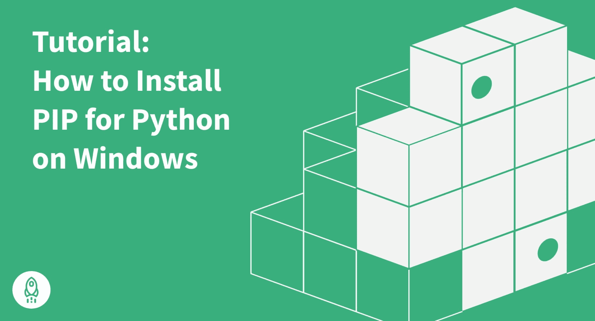
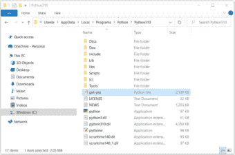
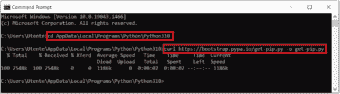
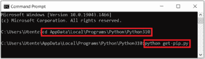
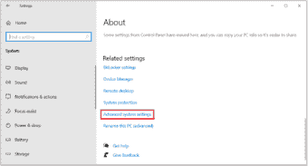
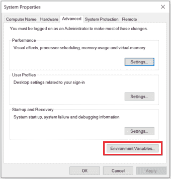
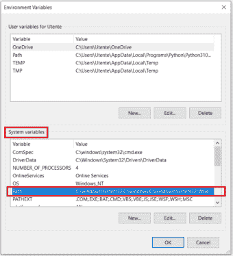
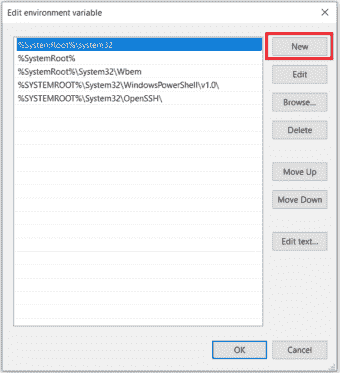
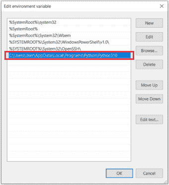

# 如何在 Windows 上安装 PIP:带截图的简单指南(2022)

> 原文：<https://www.dataquest.io/blog/install-pip-windows/>

June 9, 2022

在本教程中，我们将识别 Python 的 PIP，何时使用，如何安装，如何检查其版本，如何在 Windows 上配置，以及如何升级(或降级)。

## Python 的 PIP 是什么？

PIP 代表“PIP Installs Packages”，这是一个递归的首字母缩略词(指的是它自己)，由它的创建者创造。从更实际的角度来说，PIP 是一个广泛使用的包管理系统，旨在在我们的本地机器上安装 Python 编程语言的标准发行版中没有包含的库，然后从命令行管理它们。

默认情况下，PIP 从 Python 包索引(PyPI)中获取这样的库，Python 包索引是一个中央在线存储库，包含各种应用程序的大量第三方包。如果需要，PIP 还可以连接到另一个本地或在线存储库，只要它符合 [PEP 503](https://www.python.org/dev/peps/pep-0503/) 。

## 如何在 Windows 上安装 PIP

在继续在 Windows 上安装 PIP 之前，我们需要确保 Python 已经安装，并且 PIP 是*而不是*安装的。

### 检查 Python 是否可用

为了验证 Python 在我们的本地机器上可用，我们需要打开命令行(在 Windows search 中，键入`cmd`并按`Enter`打开命令提示符，或者右键单击`Start`按钮并选择`Windows PowerShell`，键入`python`，并按`Enter`。

如果 Python 安装正确，我们将会看到如下所示的通知:

`Python 3.10.2 (tags/v3.10.2:a58ebcc, Jan 17 2022, 14:12:15) [MSC v.1929 64 bit (AMD64)] on win32 Type "help," "copyright," "credits," or "license" for more information.`

在相反的情况下，我们会看到以下通知:

`'python' is not recognized as an internal or external command, operable program or batch file.`

这意味着 Python 要么没有安装在我们的本地机器上，要么安装不正确，需要设置系统变量。如果您需要关于如何在 Windows 上正确安装 Python 的进一步指导，可以使用 Dataquest 博客中的这篇文章:[教程:在 Windows 上安装 Python](https://www.dataquest.io/blog/installing-python-on-windows/)。

### 检查 PIP 是否已经安装

既然我们已经验证了 Python 已经安装在 Windows 上(或者，如果没有，已经安装了它)，让我们检查一下 PIP 是否已经安装在我们的系统上。

最新发布的 Python 3.4+和 Python 2.7.9+，以及虚拟环境`virtualenv`和`pyvenv`，都自动附带 PIP(我们可以通过在命令行运行`python --version`或`python -V`来检查我们的 Python 版本)。然而，Python 的旧版本在默认情况下没有这个优势。如果我们使用较旧的 Python 版本，但由于某种原因无法升级(例如，当我们必须使用与较新版本不兼容的旧版本 Python 中的项目时)，我们可能需要手动下载并在 Windows 上安装 PIP。

要检查 PIP 是否已经安装在 Windows 上，我们应该再次打开命令行，键入`pip`，然后按下`Enter`。

如果安装了 PIP，我们会收到一个很长的通知，解释程序的用法，所有可用的命令和选项。否则，如果没有安装 PIP，输出将是:

`'pip' is not recognized as an internal or external command, operable program or batch file.`

当我们必须在 Windows 上手动安装 PIP 时，情况正是如此。

### 下载 PIP

在安装 PIP 之前，我们必须下载`get-pip.py`文件。我们可以通过两种方式做到这一点:

1.  转到 https://bootstrap.pypa.io/get-pip.py[的](https://bootstrap.pypa.io/get-pip.py)，在 Python 所在的同一个文件夹下将该文件另存为`get-pip.py`。
    默认情况下，Python 安装存储在文件夹`AppData`中。整个路径可能如下所示:

`C:\Users\User\AppData\Local\Programs\Python\Python310`

文件夹`User`可以在特定的机器上以不同的方式调用，而且上面路径中的最终文件夹取决于 Python 的版本。在我们的例子中——Python 3.10:

2.  打开命令行，使用`cd`命令导航到存储 Python 的文件夹(如果您不确定 Python 的位置，请参见上一点)。

现在，运行下面的 curl 命令:

`curl https://bootstrap.pypa.io/get-pip.py -o get-pip.py`

### 在 Windows 上安装 PIP

现在我们已经下载了`get-pip.py`文件，我们需要完成以下步骤。

1.  打开命令行
2.  使用`cd`命令导航到存储 Python 和`get-pip.py`文件的文件夹
3.  通过运行以下命令启动安装程序:

`python get-pip.py`

在快速安装过程之后，会出现一条包含所有安装详细信息的消息，最后一行如下所示:

`Successfully installed pip-22.0.1 wheel-0.37.1`

PIP 现已成功安装在 Windows 上。

### 验证 PIP 安装过程并检查 PIP 版本

要再次检查 PIP 是否已正确安装并检查其版本，我们需要在命令行中运行以下命令之一:

`pip --version`

或者

`pip -V`

如果 PIP 安装正确，我们将看到一条消息，指示 PIP 的版本及其在本地系统上的位置，如下所示:

`pip 22.0.2 from C:\Users\Utente\AppData\Local\Programs\Python\Python310\lib\site-packages\pip (python 3.10)`。

相反，如果抛出错误，则需要重复安装过程。

### 将 PIP 添加到 Windows 环境变量中

为了能够从命令行中的任何文件夹运行 PIP 而不出现问题(而不是像前面那样每次都导航到存储 PIP 安装程序的文件夹)，我们必须将带有`get-pip.py`文件的文件夹的路径添加到 Windows 环境变量中。这在极少数情况下尤其重要，因为我们已经安装了几个版本的 Python，包括旧版本。在这种情况下，为了避免为每个旧版本的 Python 单独安装 PIP，我们应该只为其中一个版本安装 PIP，然后执行以下步骤:

*   打开`Control Panel`(在 Windows 搜索中输入)，选择`System and Security`，然后选择`System`。
*   转到打开窗口的末尾，选择`Advanced system settings`:

*   点击`Environment Variables`:

*   在`System variables`部分，找到并双击变量`Path`:

*   点击`New`并将路径添加到存储 PIP 安装程序的文件夹中:

*   点击`OK`确认修改。

## 在 Windows 上升级 PIP

有时，我们可能需要将 Windows 上的 PIP 更新到最新版本，以保持其最新并完美地工作。为此，我们可以在命令行中运行以下命令:

`python -m pip install --upgrade pip`

因此，旧版本的 PIP 将被卸载，而最新版本将被安装。

## 在 Windows 上降级画中画

我们还可以将 PIP 降级到特定的旧版本。在某些情况下，此操作可能是必要的，例如，如果新版本存在一些兼容性问题。要在 Windows 上降级 PIP，我们需要打开命令行并运行具有以下语法的命令:

`python -m pip install pip==<version>`

比方说，我们想将其降级到 v20.3。那么确切的命令将是:
`python -m pip install pip==20.3`

在降级 PIP 之后，我们可以通过运行`python -V`来验证我们现在拥有了它的必要版本。

## 结论

在本教程中，我们讨论了关于在 Windows 上安装 PIP 的各种主题:

*   PIP 如何工作
*   如何检查 Python 和 PIP 是否已经安装
*   当可能需要在 Windows 上手动安装 PIP 时
*   如何在 Windows 上下载和安装 PIP
*   如何验证 PIP 是否已成功安装并检查其版本
*   如何在 Windows 上配置 PIP 以及何时需要配置
*   何时以及如何升级或降级 Windows 上的 PIP

现在我们已经在 Windows 上正确安装了 PIP，我们可以开始使用它来管理 Python 库。让我们从在命令行运行`pip help`开始，探索这个程序可用的命令和选项。