# 教程:在 Mac 上安装 Python

> 原文：<https://www.dataquest.io/blog/installing-python-on-mac/>

January 12, 2022

Python 是最强大的编程语言之一，主要用于数据科学、机器学习和大数据分析。所以，安装 Python 对所有程序员来说都是必不可少的。作为一名程序员新手，你可能想知道如何在 Mac 上正确安装或更新 Python。在这里，我们将介绍在 macOS 上安装和更新 Python 的不同方法。

然后，为了在集成开发环境(IDE)中编写和运行我们的 Python 代码，我们将学习如何在 Mac 上安装和配置 Visual Studio 代码。在 Mac 上安装和更新 Python 有不同的方法，但让我们坚持 Python 的**禅的第三个原则，即:“*简单比复杂好。*“因此，我们会尝试简单的方法，而不是复杂的方法。在我们开始学习如何在 Mac 上安装或更新 Python 之前，让我们先回顾一下我们将在本教程中讨论的内容:**

*   [在 Mac 上安装和更新 Python](#installing-python-mac)
*   [在 Mac 上安装 Visual Studio 代码](#installing-visual-studio-mac)
*   [在 Mac 上运行我们的第一个 Python 脚本](#running-python-script-mac)

## 在 Mac 上安装和更新 Python

我有两条消息要告诉你:一个好，一个坏。好消息是为了兼容遗留系统，你的 Mac 上预装了 Python 2.7，坏消息是 Python 2.7 已经退役了。因此，不建议新的开发使用它。所以，如果你想利用新 Python 版本的许多特性和改进，你需要安装最新的 Python 和 macOS 上预装的版本。在开始安装最新版本的 Python 之前，我们先来看看为什么同一个编程语言会有不同的版本。随着时间的推移，所有的编程语言都通过添加新的特性来发展。编程语言开发人员通过增加版本号来宣布这些变化和改进。

### 将 Python 3 作为命令行开发工具的一部分进行安装

要检查已经安装的 Python 的当前版本，请通过键入 command + space 打开终端应用程序，然后拼出 Terminal 并按 return 键。现在，键入以下命令，然后按 return 键查看您已经在 Mac 上预装了 Python 2.7:

`% python --version`


现在，尝试以下命令来检查您的 Mac 上是否安装了 Python 3:

`~ % python3 --version`

终端窗口上可能会出现以下消息，

`xcode-select: note: no developer tools were found at '/Applications/Xcode.app', requesting install. Choose an option in the dialog to download the command line developer tools.`

在终端窗口旁边，会自动出现一个对话框，提示该命令需要命令行开发工具。首先，让我们确定命令行开发工具。简而言之，命令行开发人员工具包是一套主要用于开发过程的工具。它们帮助运行特定的命令，如 make、git、python3 等。所以，虽然不安装命令行开发者工具也有其他方法在 Mac 上安装 Python 3.x，但是我还是推荐你安装，因为它提供了一串在 Mac 上开发的工具。要安装该软件包，请单击 install 按钮，并按照步骤完成安装过程。安装过程完成后，重新运行前面的命令。是的，Python 3.x 安装在您的 Mac 上。

`~ % python3 --version`


### 用官方安装程序安装 Python 3

从 Python 官方网站(python.org)下载最新的 Python 版本是在 Mac 上安装 Python 最常见的(也是推荐的)方法。让我们试一试。

1.首先，从 Python 网站下载一个安装包。为此，请在您的 Mac 上访问[https://www.python.org/downloads/](https://www.python.org/downloads/)；它会自动检测您的操作系统，并显示一个大按钮，用于在 Mac 上下载最新版本的 Python 安装程序。如果没有，请单击 macOS 链接并选择最新的 Python 版本。


2.下载完成后，双击包开始安装 Python。安装程序将引导您完成安装，在大多数情况下，默认设置很好，所以像 macOS 上的其他应用程序一样安装它。您可能还需要输入您的 Mac 密码，让它知道您同意安装 Python。
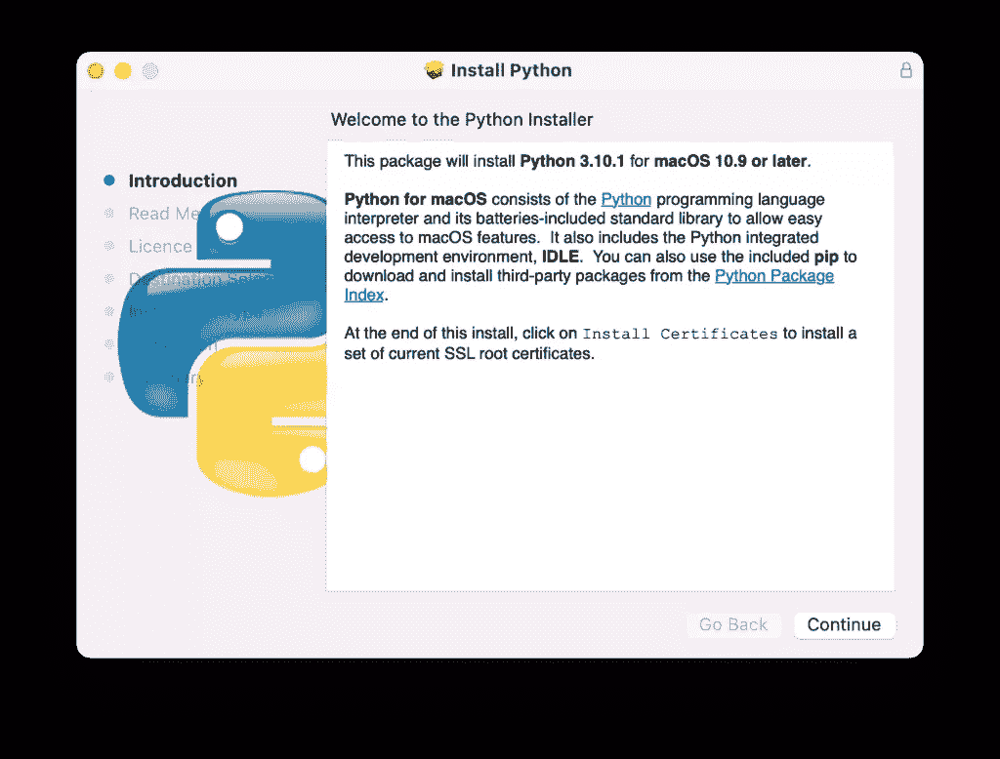

* * *

**注意**如果你用的是苹果 M1 Mac，你需要安装 Rosetta。Rosetta 使基于英特尔的特性能够在苹果硅 MAC 上运行。

* * *

3.安装完成后，将打开 Python 文件夹。
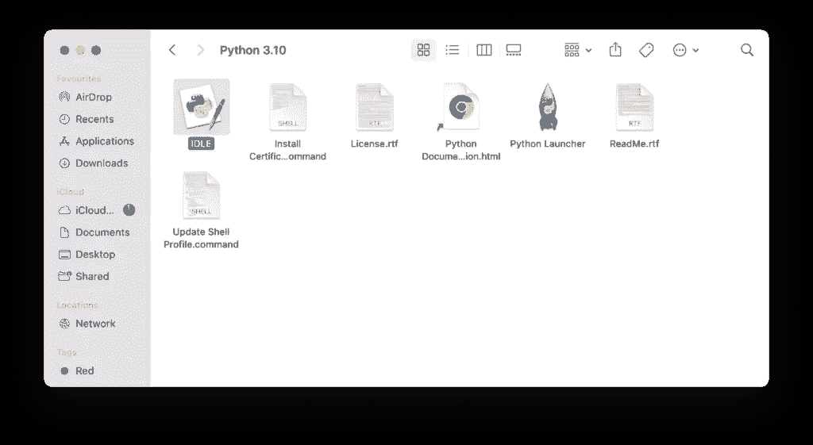

4.让我们验证一下 Python 和 IDLE 的最新版本是否安装正确。为此，双击 IDLE，这是 Python 附带的集成开发环境。如果一切正常，IDLE 显示 Python shell 如下:
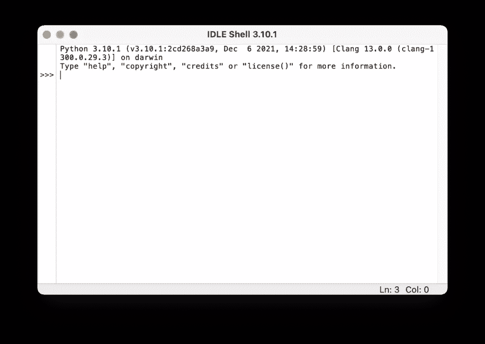

5.让我们编写一个简单的 Python 代码，并在空闲时运行它。键入以下语句，然后按回车键。

```
print(“Hello, World!”)
```

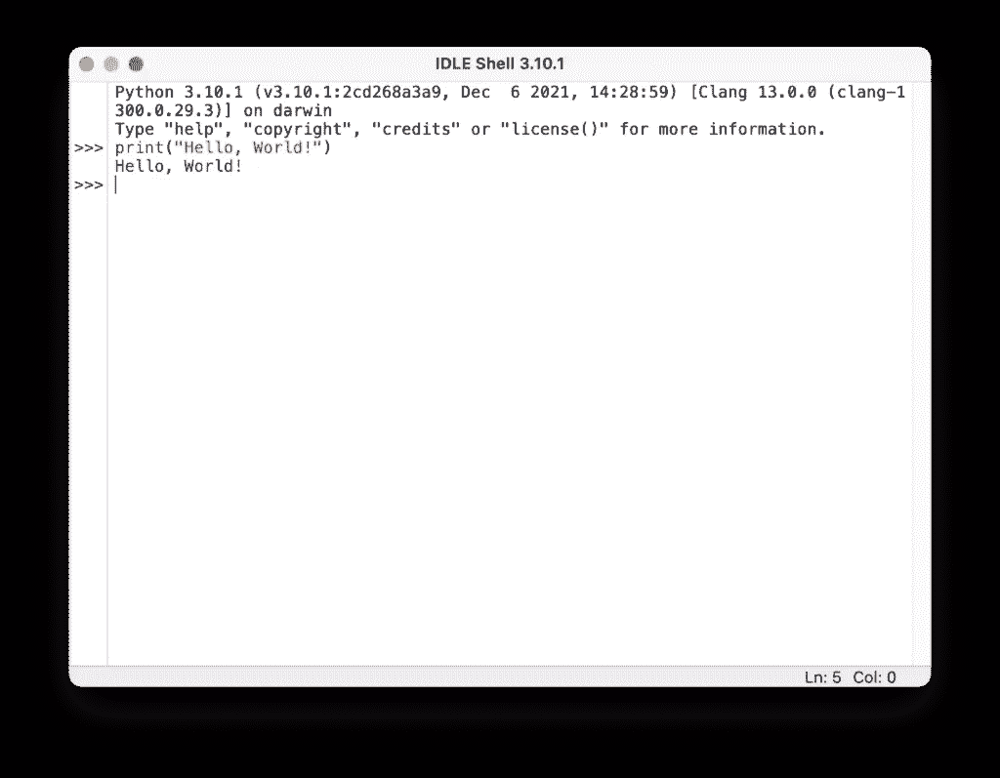

或者我们用 Python 做一个基本计算如下:
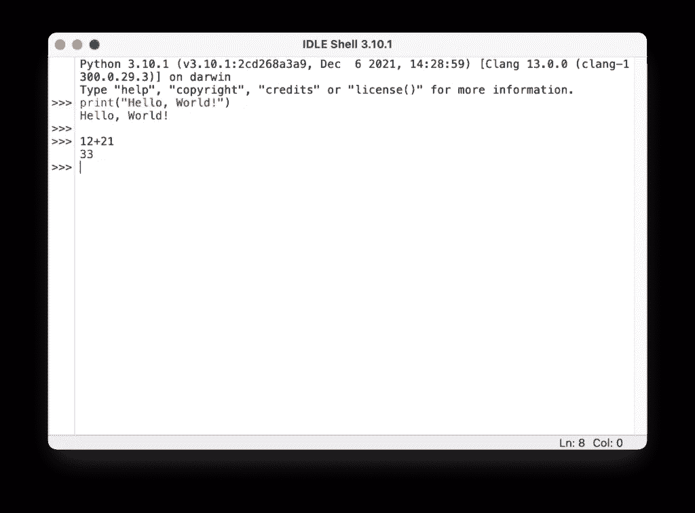

* * *

**注意**这种安装方法令人兴奋的优点是，您可以通过下载最新的 Python 安装程序来轻松更新过时的 Python 安装。安装完成后，新版本的 Python 就可以在 Mac 上使用了。

* * *

## 在 Mac 上安装 Visual Studio 代码

虽然我们可以使用 IDLE 或终端应用程序来编写 Python 脚本，但我们更喜欢使用功能强大、可扩展的轻量级代码编辑器，而不是僵化的编码环境。在教程的这一部分，我们将在 macOS 上安装用于 Python 开发的 Visual Studio 代码。

1.首先，你需要在 https://code.visualstudio.com/的官方网站下载 macOS 的 Visual Studio 代码。
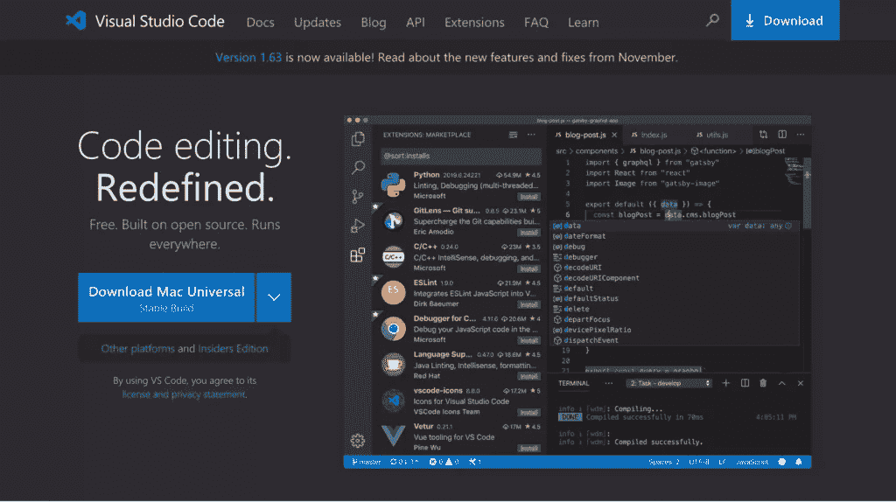
2。双击下载的文件以提取存档的内容。
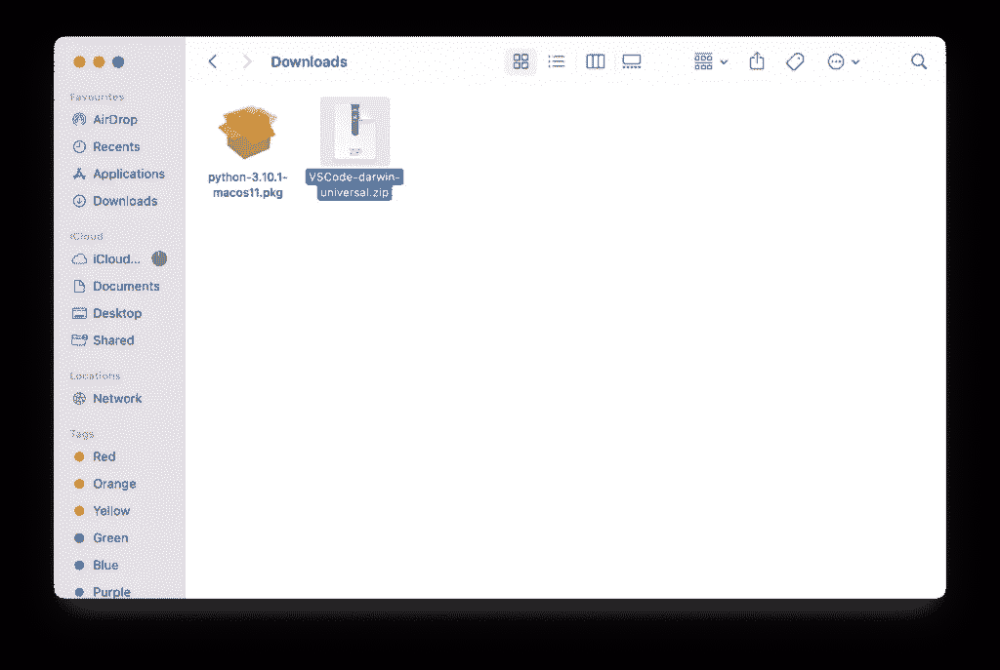
3。将 Visual Studio 代码应用程序移动到 application 文件夹，使其在 macOS launchpad 中可用。
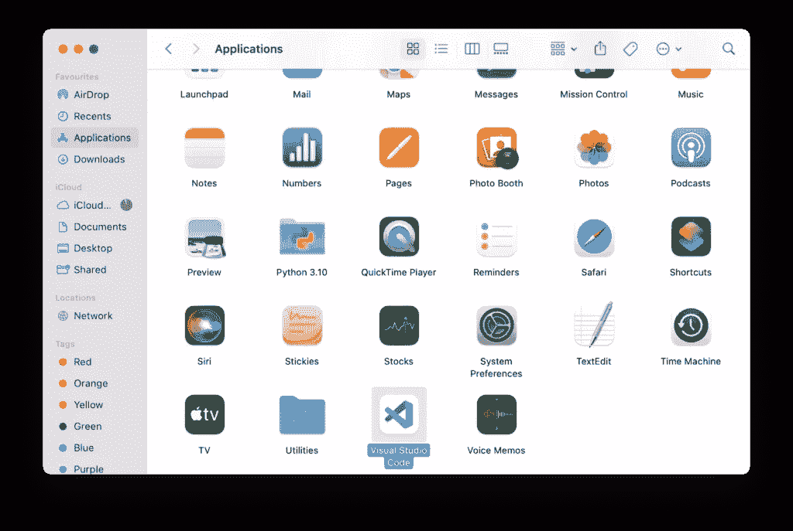
4。启动 Visual Studio 代码，然后打开 Python 脚本所在的文件夹(或创建一个新文件夹)。例如，在你的桌面上创建一个新文件夹，并将其命名为`py_scripts`，然后尝试在 VS 代码上打开该文件夹。通常，VS 代码需要你的权限才能访问你桌面文件夹中的文件；单击确定。


此外，您可能需要声明您信任存储在桌面文件夹中的文件的作者。
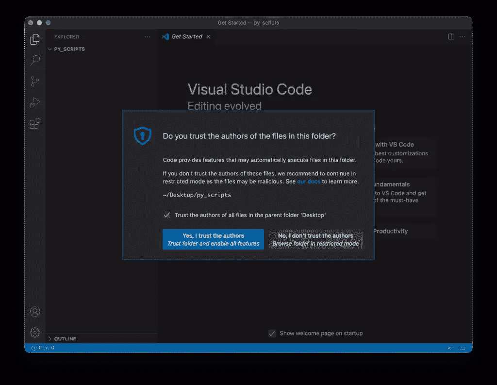
5。创建一个扩展名为`.py`的新文件。例如，创建一个新文件，并将其命名为`prog_01.py.` VS 代码检测到了`.py`扩展名，并希望安装一个 Python 扩展。
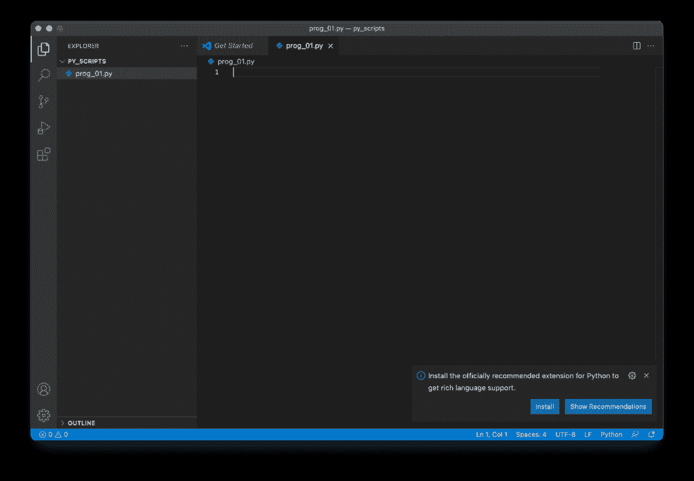
要在 VS 代码内部使用 Python，我们需要使用 Python 扩展，它包含了很多有用的特性，比如带智能感知的代码完成、调试、单元测试支持等。

点击安装按钮进行安装。
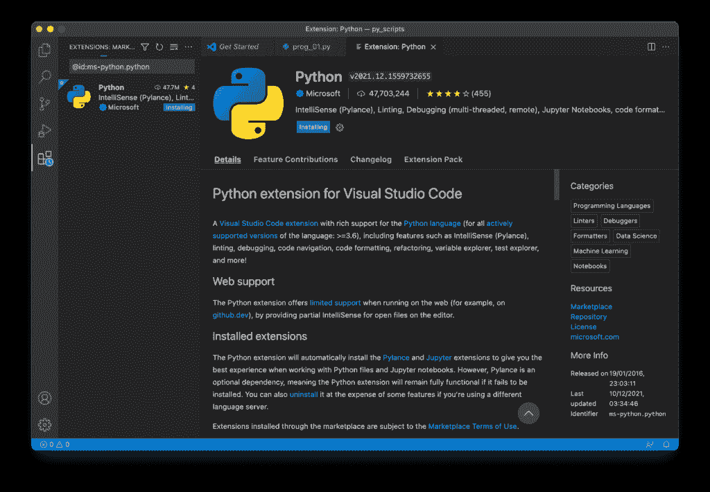

我们也可以通过浏览扩展来安装 Python 扩展。单击 VS 代码左侧的扩展图标。


这将显示 VS 代码市场上最流行的 VS 代码扩展列表。现在，我们可以选择 Python 扩展并安装它。
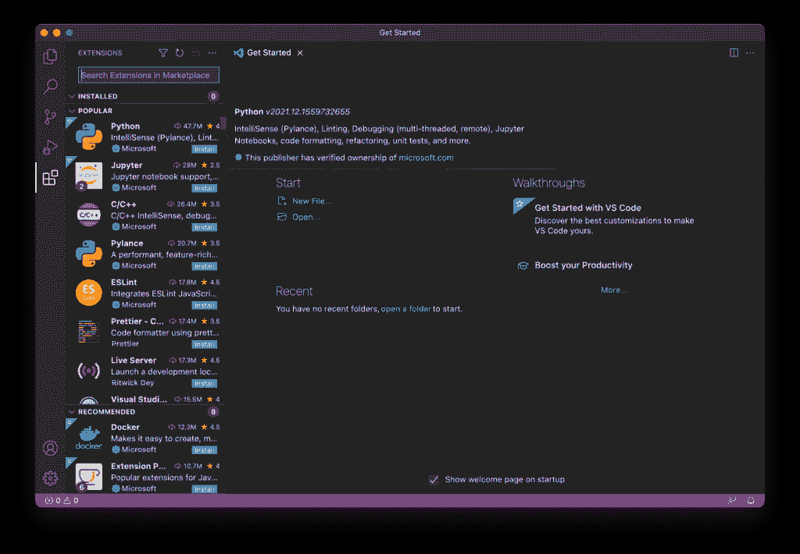

6.一旦安装了扩展，您必须选择一个 Python 解释器。点击选择 Python 解释器按钮:
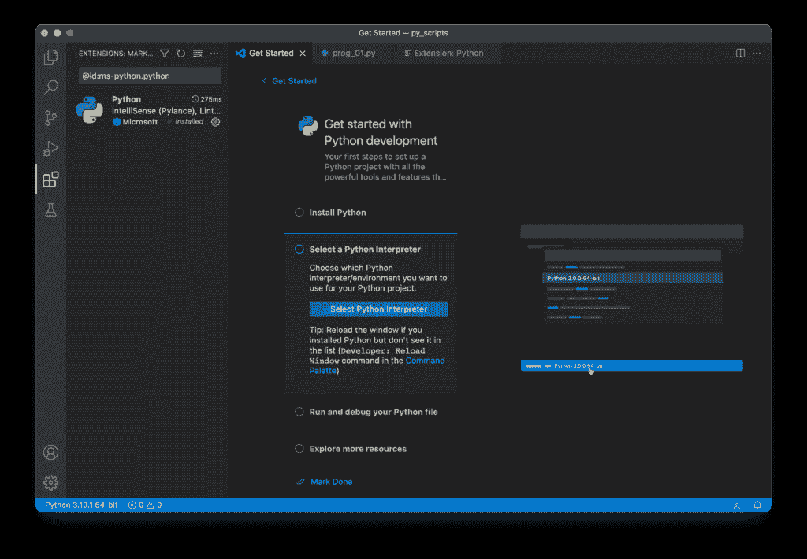

然后在列表中选择推荐的 Python 解释器。
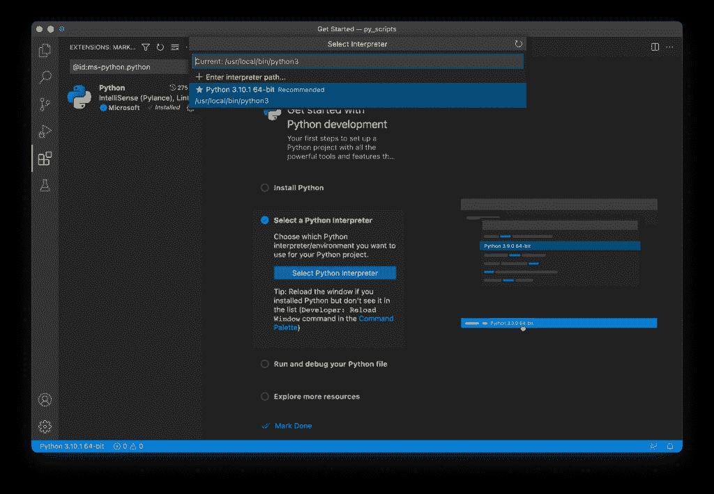

如果你的 Mac 上安装了多个 Python 版本，最好选择最新版本。
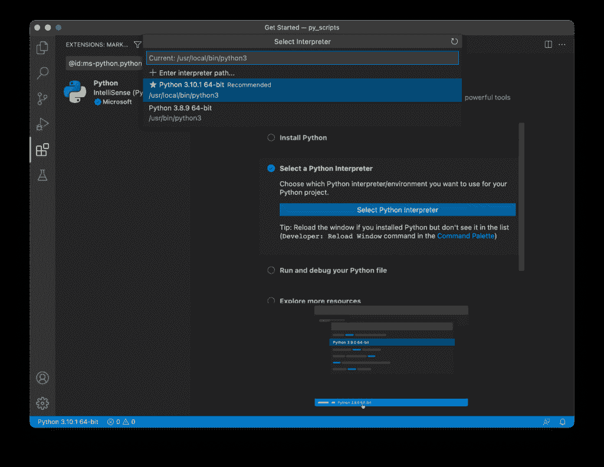

您也可以使用命令面板中的 Python: Select Interpreter 命令来选择 Python 解释器。为此，请按 CMD + SHIFT + P，键入 Python，然后选择*选择解释器。*

## 在 Mac 上运行我们的第一个 Python 脚本

太好了，我们拥有了在 VS 代码中编写和运行 Python 代码所需的一切。让我们用 VS 代码写下面的代码，然后运行它。

```
print("Hello, World!)
name = input("What's your name? ")
print("Hello {}!\nWelcome to Dataquest!".format(name))
```

通过点击 VS 代码右上角的▶️按钮来运行代码。首先，它显示你好，世界！在综合终端，然后它问你的名字；输入你的名字，然后按回车键。它输出`Hello <your name,>`，并在下一行写入`Welcome to Dataquest!`。


## 结论

在本教程中，我们学习了如何在 Mac 上安装最新版本的 Python，以及更新过时的 Python 版本。此外，我们还学习了如何将 Visual Studio 代码安装为代码编辑器，并对其进行配置以运行 Python 脚本。最后，我们用 VS 代码编写了一个小的 Python 脚本，并成功运行。在下一个教程中，我们将学习 [Python 虚拟环境](https://www.dataquest.io/blog/a-complete-guide-to-python-virtual-environments/)以及如何创建和使用它们。恭喜你！从现在开始，前途无量，你可以成为伟大的皮托尼斯塔！

如果你想了解这个话题的更多信息，请查看 Dataquest 的 Python 课程的互动[介绍，以及我们的 Python](https://www.dataquest.io/course/introduction-to-python/) 的[数据分析师和 Python](https://www.dataquest.io/path/data-analyst) 的[数据科学家，它们将帮助你在大约 6 个月内做好工作准备。](https://www.dataquest.io/path/data-scientist)