# Python 合集简介

> 原文：<https://www.dataquest.io/blog/introduction-to-ensembles/>

January 11, 2018

## 在 Python 中高效地堆叠模型

集成已经迅速成为应用机器学习中最热门和最流行的方法之一。几乎每一个获奖的 Kaggle 解决方案都有它们的特色，许多数据科学管道都有它们的组合。简而言之，集成将来自不同模型的预测结合起来生成最终预测，我们包含的模型越多，它的性能就越好。更好的是，由于集成结合了基线预测，它们的表现至少和最好的基线模型一样好。合奏几乎免费为我们带来性能提升！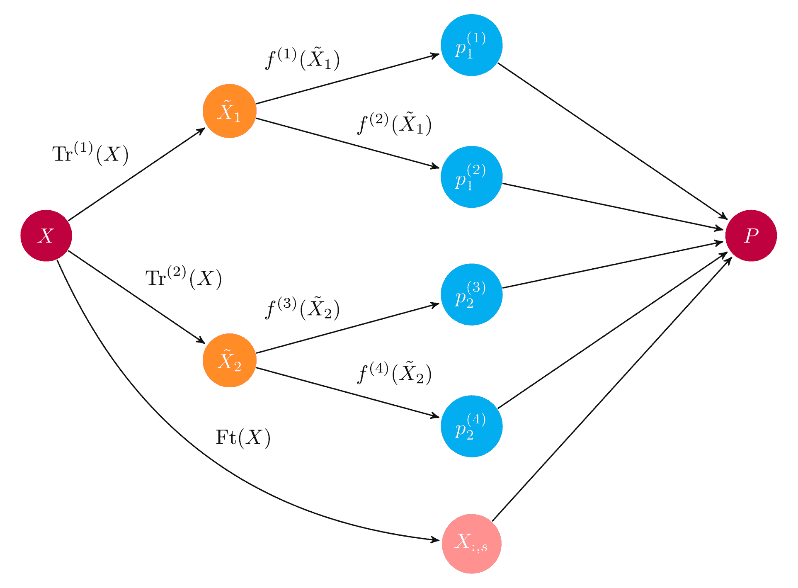 *一部系综的示例示意图。输入数组\(X\)通过两个预处理管道，然后送到一组基础学习器\(f^{(i)}\).集成将所有基本学习者预测组合成最终预测数组\(P\)。[来源](https://ml-ensemble.com/)* 在本帖中，我们将带你了解合奏的基础——它们是什么，为什么它们工作得这么好——并提供构建基本合奏的实践指南。在这篇文章结束时，你将:

*   理解合奏的基础
*   知道如何编码它们
*   理解合奏的主要陷阱和缺点

## 预测共和党和民主党的捐款

为了说明集合是如何工作的，我们将使用美国政治捐款的数据集。[原始数据集](https://github.com/fivethirtyeight/data/tree/master/science-giving)是由[fivethirtyeeight](https://fivethirtyeight.com/)的 [Ben Wieder](https://fivethirtyeight.com/contributors/ben-wieder/) 准备的，他研究了美国政府的政治捐款登记册，发现当[科学家向政客捐款时，通常是给民主党人](https://fivethirtyeight.com/features/when-scientists-donate-to-politicians-its-usually-to-democrats/)。这种说法是基于对共和党和民主党捐款份额的观察。然而，还有很多可以说的:例如，哪个科学学科最有可能为共和党捐款，哪个州最有可能为民主党捐款？我们将更进一步，预测捐款最有可能是给共和党还是民主党。我们在这里使用的[数据](https://s3.amazonaws.com/dq-blog-files/input.csv)略有改动。除了民主党或共和党，我们删除了对其他党派的任何捐赠，以使我们的阐述更加清晰，并删除一些重复和不太有趣的功能。数据脚本可以在[这里](https://s3.amazonaws.com/dq-blog-files/gen_data.py)找到。数据如下:

```
 import numpy as np
import pandas as pd

import matplotlib.pyplot as plt

### Import data
# Always good to set a seed for reproducibility
SEED = 222
np.random.seed(SEED)

df = pd.read_csv('input.csv')

### Training and test set
from sklearn.model_selection import train_test_split
from sklearn.metrics import roc_auc_score

def get_train_test(test_size=0.95):
    """Split Data into train and test sets."""
    y = 1 * (df.cand_pty_affiliation == "REP")
    X = df.drop(["cand_pty_affiliation"], axis=1)
    X = pd.get_dummies(X, sparse=True)
    X.drop(X.columns[X.std() == 0], axis=1, inplace=True)
    return train_test_split(X, y, test_size=test_size, random_state=SEED)

xtrain, xtest, ytrain, ytest = get_train_test()

# A look at the data
print("\nExample data:")
df.head() 
```

|  | cand_pty_affiliation | 加拿大办公室街 | cand_office | 坎德 _status | rpt_tp | 交易 _tp | 实体 _tp | 状态 | 分类 | 循环 | 交易 _ 金额 |
| --- | --- | --- | --- | --- | --- | --- | --- | --- | --- | --- | --- |
| Zero | 代表 | 美国 | P | C | Q3 | Fifteen | 印度 | 纽约州 | 工程师 | Two thousand and sixteen | Five hundred |
| one | 那个人 | 美国 | P | C | M5 | 15E | 印度 | 运筹学 | Math-Stat | Two thousand and sixteen | Fifty |
| Two | 那个人 | 美国 | P | C | M3 | Fifteen | 印度 | 谢谢 | 科学家 | Two thousand and eight | Two hundred and fifty |
| three | 那个人 | 美国 | P | C | Q2 | 15E | 印度 | 在…里 | Math-Stat | Two thousand and sixteen | Two hundred and fifty |
| four | 代表 | 美国 | P | C | 12G | Fifteen | 印度 | 马萨诸塞州 | 工程师 | Two thousand and sixteen | One hundred and eighty-four |

```
df.cand_pty_affiliation.value_counts(normalize=True).plot(    kind="bar", title="Share of No. donations")
plt.show()
```

上图是支持本索赔的数据。事实上，在民主党和共和党之间，大约 75%的捐款都给了民主党。让我们浏览一下我们可以使用的特性。我们有关于捐赠者、交易和接受者的数据:为了衡量我们的模型表现如何，我们使用 [ROC-AUC](https://en.wikipedia.org/wiki/Receiver_operating_characteristic#Area_under_the_curve) 分数，该分数以高精确度和高召回率为代价(如果这些概念对你来说是新的，请参见维基百科关于[精确度和召回率](https://en.wikipedia.org/wiki/Precision_and_recall)的条目以获得快速介绍)。如果您以前没有使用过这个指标，随机猜测的得分为 0.5，完全回忆和精确率为 1.0。

## 什么是合奏？

想象你在玩琐碎的追求。当你一个人玩的时候，可能会有一些你擅长的话题，而一些你几乎一无所知。如果我们想最大化我们琐碎的追求分数，我们需要建立一个涵盖所有主题的团队。这是集合的基本思想:将几个模型的预测结合起来，可以消除特殊的误差，产生更好的整体预测。一个重要的问题是如何组合预测。在我们琐碎的追踪例子中，很容易想象团队成员可能会提出他们的案例，多数投票决定选择哪一个。机器学习在分类问题上非常相似:采用最常见的类别标签预测相当于多数投票规则。但是有许多其他方法来组合预测，更普遍的是，我们可以使用一个模型来*学习*如何最好地组合预测。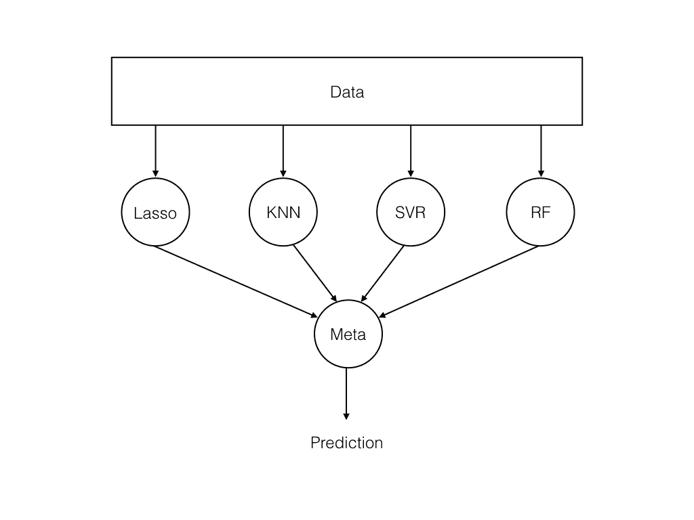 *基本系综结构。数据被输入到一组模型中，元学习器组合模型预测。来源*

### 通过组合决策树来理解集成

为了说明集成的机制，我们将从一个简单的可解释模型开始:决策树，它是一个由`if-then`规则组成的树。如果你对决策树不熟悉，或者想更深入地学习，请查看 Dataquest 网站上的[决策树课程](https://www.dataquest.io/course/decision-trees)。树越深，它能捕捉的模式越复杂，但越容易过度拟合。正因为如此，我们需要一种替代的方法来构建复杂的决策树模型，不同决策树的集合就是这样一种方法。我们将使用下面的帮助器函数来可视化我们的决策规则:

```
 import pydotplus  # you can install pydotplus with: pip install pydotplus 
from IPython.display import Image
from sklearn.metrics import roc_auc_score
from sklearn.tree import DecisionTreeClassifier, export_graphviz

def print_graph(clf, feature_names):
    """Print decision tree."""
    graph = export_graphviz(
        clf,
        label="root",
        proportion=True,
        impurity=False, 
        out_file=None, 
        feature_names=feature_names,
        class_names={0: "D", 1: "R"},
        filled=True,
        rounded=True
    )
    graph = pydotplus.graph_from_dot_data(graph)  
    return Image(graph.create_png())
```

让我们在训练数据上拟合一个具有单个节点(决策规则)的决策树，并看看它在测试集上的表现如何:

```
 t1 = DecisionTreeClassifier(max_depth=1, random_state=SEED)
t1.fit(xtrain, ytrain)
p = t1.predict_proba(xtest)[:, 1]

print("Decision tree ROC-AUC score: %.3f" % roc_auc_score(ytest, p))
print_graph(t1, xtrain.columns) 
```

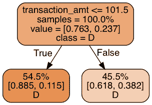
*决策树 ROC-AUC 得分:0.672*

两个叶子中的每一个都记录它们的训练样本份额、它们份额内的类别分布以及类别标签预测。我们的决策树基于贡献大小是否大于 101.5 来进行预测:但是不管怎样，它都会做出相同的预测！考虑到 75%的捐款都给了民主党，这并不奇怪。但是它没有利用我们现有的数据。让我们使用三个级别的决策规则，看看我们能得到什么:

```
 t2 = DecisionTreeClassifier(max_depth=3, random_state=SEED)
t2.fit(xtrain, ytrain)
p = t2.predict_proba(xtest)[:, 1]

print("Decision tree ROC-AUC score: %.3f" % roc_auc_score(ytest, p))
print_graph(t2, xtrain.columns)
```

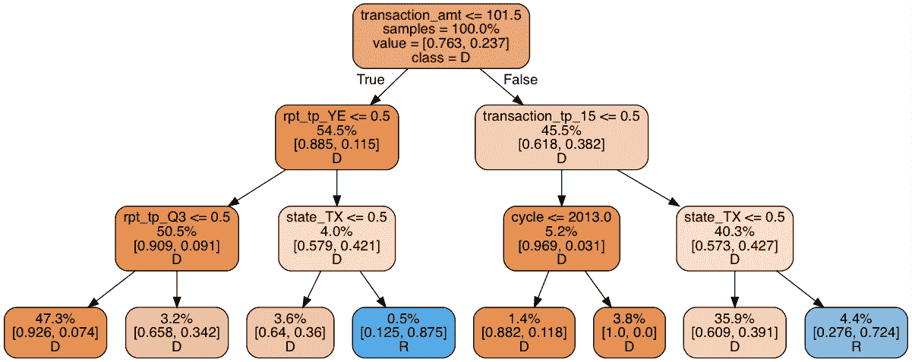 *决策树 ROC-AUC 得分:0.751*

这个模型比简单的决策树好不了多少:所有捐款中只有少得可怜的 5%预计会流向共和党——远远低于我们预期的 25%。仔细观察我们会发现决策树使用了一些可疑的分裂规则。多达 47.3%的观察结果出现在最左边的叶子，而另外 35.9%出现在右边第二个叶子。因此，绝大多数叶子是不相关的。让模型变得更深只会让它过度拟合。在固定深度的情况下，可以通过增加“宽度”来使一棵决策树变得更加复杂，也就是创建几棵决策树，并将它们组合起来。换句话说，就是决策树的集合。为了理解为什么这样的模型会有所帮助，考虑一下我们如何强迫一个决策树去调查除了上面的树之外的其他模式。最简单的解决方案是删除树中出现较早的特征。例如，假设我们移除了交易金额特征(`transaction_amt`)，即树的根。我们的新决策树将如下所示:

```
 drop = ["transaction_amt"]
xtrain_slim = xtrain.drop(drop, 1)
xtest_slim = xtest.drop(drop, 1)

t3 = DecisionTreeClassifier(max_depth=3, random_state=SEED)
t3.fit(xtrain_slim, ytrain)p = t3.predict_proba(xtest_slim)[:, 1]

print("Decision tree ROC-AUC score: %.3f" % roc_auc_score(ytest, p))
print_graph(t3, xtrain_slim.columns)
```

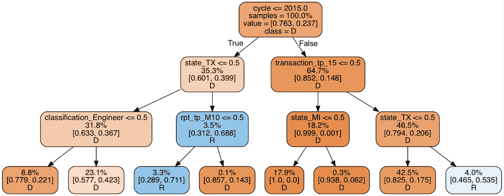 *决策树 ROC-AUC 得分:0.740* 。

ROC-AUC 得分相似，但共和党捐款份额增加到 7.3%。还是太低，但是比以前高了。重要的是，与第一棵树不同，在第一棵树中，大多数规则与交易本身相关，这棵树更关注候选人的居住地。我们现在有两个模型，它们本身具有相似的预测能力，但根据不同的规则运行。正因为如此，它们很可能会产生不同的预测误差，我们可以用集合来平均这些误差。

#### 插曲:为什么平均预测有效

为什么我们会期望平均预测有效呢？考虑一个玩具示例，它有两个我们想要生成预测的观察值。第一个观察的真正标签是共和党，第二个观察的真正标签是民主党。在这个玩具示例中，假设模型 1 倾向于预测民主党，而模型 2 倾向于预测共和党，如下表所示:

| 模型 | 意见 1 | 意见 2 |
| --- | --- | --- |
| 真实标签 | 稀有 | D |
| 模型预测:\(P(R)\) |  |  |
| 模型 1 | Zero point four | Zero point two |
| 模型 2 | Zero point eight | Zero point six |

如果我们使用标准的 50%截止规则来进行分类预测，每个决策树都会得到一个正确的观察结果和一个错误的观察结果。我们通过平均模型的类别概率来创建集成，这是由模型预测的强度(概率)加权的多数投票。在我们的玩具例子中，模型 2 对观察 1 的预测是确定的，而模型 1 相对不确定。权衡他们的预测，集合支持模型 2，并正确预测共和党。对于第二个观察结果，形势发生了逆转，总体正确地预测了民主党:

| 模型 | 意见 1 | 意见 2 |
| --- | --- | --- |
| 真实标签 | 稀有 | D |
| 全体 | Zero point six | Zero point four |

对于两个以上的决策树，集合根据多数进行预测。出于这个原因，平均分类器预测的集成被称为**多数投票分类器**。当集合基于概率进行平均时(如上所述)，我们称之为**软投票**，平均最终类别标签预测被称为**硬投票**。当然，合奏不是灵丹妙药。你可能已经注意到，在我们的玩具例子中，为了平均，预测误差必须是**不相关的**。如果两个模型都做出不正确的预测，集合就不能做出任何修正。此外，在软投票方案中，如果一个模型以高概率值做出不正确的预测，则集合将被淹没。一般来说，集成不会得到所有正确的观察结果，但是预期会比基础模型做得更好。

#### 森林是树木的集合体

回到我们的预测问题，让我们看看是否可以从我们的两个决策树中构建一个集合。我们首先检查误差相关性:高度相关的误差导致较差的集成。

```
 p1 = t2.predict_proba(xtest)[:, 1]
p2 = t3.predict_proba(xtest_slim)[:, 1]

pd.DataFrame({"full_data": p1,
              "red_data": p2}).corr()
```

|  | 完整数据 | 红色 _ 数据 |
| --- | --- | --- |
| 完整数据 | 1.000000 | 0.669128 |
| 红色 _ 数据 | 0.669128 | 1.000000 |

有一些相关性，但并不过分:仍然有大量的预测方差可以利用。为了建立我们的第一个集合，我们简单地平均两个模型的预测。

```
 p1 = t2.predict_proba(xtest)[:, 1]
p2 = t3.predict_proba(xtest_slim)[:, 1]
p = np.mean([p1, p2], axis=0)
print("Average of decision tree ROC-AUC score: %.3f" % roc_auc_score(ytest, p))
```

*决策树 ROC-AUC 得分平均值:0.783*

事实上，合奏程序导致分数增加。但是如果我们有更多不同的树，我们可能会有更大的收获。在设计决策树时，我们应该如何选择排除哪些特征？一种在实践中行之有效的快速方法是随机选择一个特征子集，在每个绘图上拟合一个决策树，并对它们的预测进行平均。这个过程被称为**自举平均**(通常缩写为*装袋*)，当应用于决策树时，得到的模型是一个**随机森林**。让我们看看随机森林能为我们做什么。我们使用 [Scikit-learn](https://scikit-learn.org/stable/modules/ensemble.html#forest) 实现并构建了一个由 10 个决策树组成的集合，每个决策树包含 3 个特征。

```
 from sklearn.ensemble import RandomForestClassifier

rf = RandomForestClassifier(
    n_estimators=10,
    max_features=3,
    random_state=SEED)

rf.fit(xtrain, ytrain)
p = rf.predict_proba(xtest)[:, 1]
print("Average of decision tree ROC-AUC score: %.3f" % roc_auc_score(ytest, p))
```

*决策树 ROC-AUC 得分平均值:0.844*

随机森林对我们以前的模型产生了显著的改进。我们有所发现了！但是你只能用决策树做这么多。是我们扩展视野的时候了。

## 作为平均预测的集合

到目前为止，我们对合奏的尝试向我们展示了合奏的两个重要方面:

1.  预测误差的相关性越小越好
2.  模型越多越好

出于这个原因，尽可能使用不同的模型是一个好主意(只要它们表现得体面)。到目前为止，我们一直依赖于简单的平均，但稍后我们将看到如何使用更复杂的组合。为了跟踪我们的进展，将我们的系综形式化为\(n\)模型\(f_i\)平均成系综\(e \):\(e(x)= \ frac 1n \sum_{i=1}^n f _ I(x)是有帮助的。\)对包含什么模型没有限制:决策树、线性模型、基于内核的模型、非参数模型、神经网络甚至其他集合！请记住，我们包含的模型越多，整体速度就越慢。为了构建各种模型的集成，我们首先在数据集上对一组 Scikit-learn 分类器进行基准测试。为了避免重复代码，我们使用下面的帮助函数:

```
 # A host of Scikit-learn models
from sklearn.svm import SVC, LinearSVC
from sklearn.naive_bayes import GaussianNB
from sklearn.ensemble import RandomForestClassifier, GradientBoostingClassifier
from sklearn.linear_model import LogisticRegression
from sklearn.neighbors import KNeighborsClassifier
from sklearn.neural_network import MLPClassifier
from sklearn.kernel_approximation import Nystroem
from sklearn.kernel_approximation import RBFSampler
from sklearn.pipeline import make_pipeline

def get_models():
    """Generate a library of base learners."""
    nb = GaussianNB()
    svc = SVC(C=100, probability=True)
    knn = KNeighborsClassifier(n_neighbors=3)
    lr = LogisticRegression(C=100, random_state=SEED)
    nn = MLPClassifier((80, 10), early_stopping=False, random_state=SEED)
    gb = GradientBoostingClassifier(n_estimators=100, random_state=SEED)
    rf = RandomForestClassifier(n_estimators=10, max_features=3, random_state=SEED)

    models = {'svm': svc,
              'knn': knn,
              'naive bayes': nb,
              'mlp-nn': nn,
              'random forest': rf,
              'gbm': gb,
              'logistic': lr,
              }

    return models

def train_predict(model_list):
    """Fit models in list on training set and return preds"""
    P = np.zeros((ytest.shape[0], len(model_list)))
    P = pd.DataFrame(P)

    print("Fitting models.")
    cols = list()
    for i, (name, m) in enumerate(models.items()):
        print("%s..." % name, end=" ", flush=False)
        m.fit(xtrain, ytrain)
        P.iloc[:, i] = m.predict_proba(xtest)[:, 1]
        cols.append(name)
        print("done")

    P.columns = cols
    print("Done.\n")
    return P

def score_models(P, y):
    """Score model in prediction DF"""
    print("Scoring models.")
    for m in P.columns:
        score = roc_auc_score(y, P.loc[:, m])
        print("%-26s: %.3f" % (m, score))
    print("Done.\n") 
```

我们现在准备创建预测矩阵\(P\)，其中每个特征对应于给定模型做出的预测，并根据测试集对每个模型进行评分:

```
 models = get_models()
P = train_predict(models)
score_models(P, ytest)
```

| 模型 | 得分 |
| --- | --- |
| 支持向量机 | Zero point eight five |
| knn | Zero point seven seven nine |
| 朴素贝叶斯 | Zero point eight zero three |
| 多层前馈神经网络 | Zero point eight five one |
| 随机森林 | Zero point eight four four |
| 恶性胶质瘤 | Zero point eight seven eight |
| 物流的 | Zero point eight five four |

这是我们的底线。梯度推进机(GBM)效果最好，其次是简单的逻辑回归。为了使我们的集合策略有效，预测误差必须是相对不相关的。确认这一点是我们的首要任务:

```
 # You need ML-Ensemble for this figure: you can install it with: pip install mlens
from mlens.visualization import corrmat

corrmat(P.corr(), inflate=False)
plt.show()
```

误差是显著相关的，这对于表现良好的模型来说是意料之中的，因为通常是离群值很难得到正确的结果。然而，大多数相关性都在 50-80%的区间内，因此还有相当大的改进空间。事实上，如果我们在类预测的基础上看误差相关性，事情看起来更有希望:

```
 corrmat(P.apply(lambda pred: 1*(pred >= 0.5) - ytest.values).corr(), inflate=False)
plt.show()
```

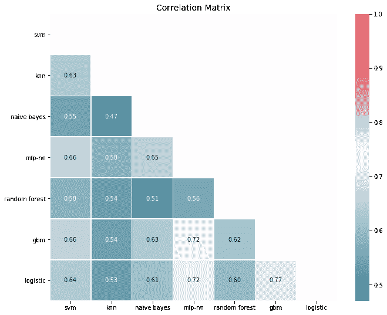

为了创建集合，我们像以前一样进行并平均预测，正如我们可能期望的那样，集合优于基线。平均是一个简单的过程，如果我们存储模型预测，我们可以从一个简单的集合开始，并在训练新模型时动态增加它的大小。

```
print("Ensemble ROC-AUC score: %.3f" % roc_auc_score(ytest, P.mean(axis=1)))
```

*总体 ROC-AUC 评分:0.884*

### 想象合奏是如何工作的

我们已经理解了集合作为纠错机制的力量。这意味着集成通过消除不规则性来平滑决策边界。判定边界向我们展示了估计器如何将特征空间分割成邻域，在该邻域内，所有观察值被预测为具有相同的类别标签。通过平均基本学习者决策边界，集成被赋予更平滑的边界，从而更自然地概括。下图显示了这一点。这里的例子是 iris 数据集，评估者试图对三种类型的花进行分类。基本学习器在它们的边界中都有一些不期望的属性，但是集成具有相对平滑的决策边界，与观察值一致。令人惊讶的是，系综既增加了模型的复杂性，又起到了正则化的作用！

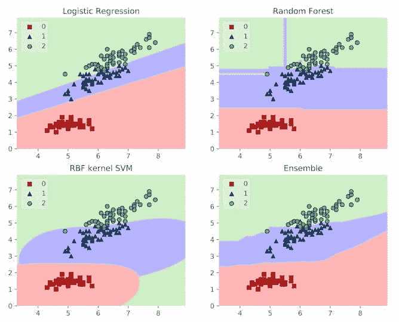 *示例判定边界为三个模型和这三个模型的合集。[来源](https://github.com/rasbt/mlxtend)*

当任务是分类时，理解集合中正在发生什么的另一种方法是检查接收算子曲线(ROC)。这条曲线向我们展示了评估者如何权衡精确度和召回率。通常，不同的基础学习者做出不同的权衡:一些人通过牺牲回忆来获得更高的精确度，而另一些人通过牺牲精确度来获得更高的回忆。另一方面，非线性元学习者能够针对每个训练点调整它所依赖的模型。这意味着它可以显著减少必要的牺牲，并在提高召回率的同时保持高精度(反之亦然)。在下图中，为了提高召回率，集合在精确度上做了更小的牺牲(ROC 在“东北”角)。

```
from sklearn.metrics import roc_curve

def plot_roc_curve(ytest, P_base_learners, P_ensemble, labels, ens_label):
    """Plot the roc curve for base learners and ensemble."""
    plt.figure(figsize=(10, 8))
    plt.plot([0, 1], [0, 1], 'k--')

    cm = [plt.cm.rainbow(i)
      for i in np.linspace(0, 1.0, P_base_learners.shape[1] + 1)]

    for i in range(P_base_learners.shape[1]):
        p = P_base_learners[:, i]
        fpr, tpr, _ = roc_curve(ytest, p)
        plt.plot(fpr, tpr, label=labels[i], c=cm[i + 1])

    fpr, tpr, _ = roc_curve(ytest, P_ensemble)
    plt.plot(fpr, tpr, label=ens_label, c=cm[0])

    plt.xlabel('False positive rate')
    plt.ylabel('True positive rate')
    plt.title('ROC curve')
    plt.legend(frameon=False)
    plt.show()

plot_roc_curve(ytest, P.values, P.mean(axis=1), list(P.columns), "ensemble") 
```

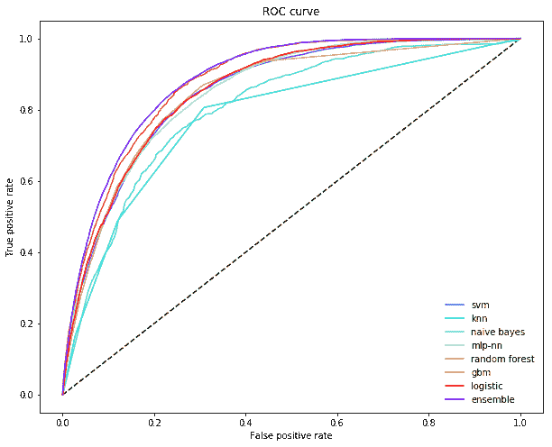

### 超越作为简单平均值的总体

但是，考虑到预测误差的变化，你难道不会期待更多的提升吗？嗯，有一件事有点烦。有些模型的表现比其他模型差得多，但它们的影响与表现更好的模型一样大。这对于不平衡的数据集来说可能是毁灭性的:回想一下软投票，如果一个模型做出极端的预测(即接近 0 或 1)，该预测对预测平均值有很大的影响。对我们来说，一个重要的因素是模型是否能够捕捉到共和党的全部内涵。一个简单的检查表明，所有的模型都没有充分代表共和党的捐款，但有些模型比其他模型要差得多。

```
 p = P.apply(lambda x: 1*(x >= 0.5).value_counts(normalize=True))
p.index = ["DEM", "REP"]
p.loc["REP", :].sort_values().plot(kind="bar")
plt.axhline(0.25, color="k", linewidth=0.5)plt.text(0., 0.23, "True share republicans")
plt.show()
```

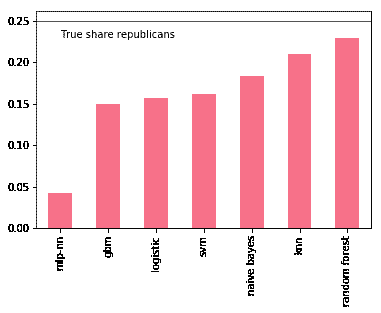

我们可以尝试通过移除最坏的罪犯来改善集成，比如说多层感知器(MLP):

```
 include = [c for c in P.columns if c not in ["mlp-nn"]]
print("Truncated ensemble ROC-AUC score: %.3f" % roc_auc_score(ytest, P.loc[:, include].mean(axis=1)))
```

*截断集合 ROC-AUC 得分:0.883*

这算不上什么进步:我们需要一种更智能的方式来区分模型之间的优先级。显然，从集合中移除模型是相当激烈的，因为可能存在被移除的模型携带重要信息的情况。我们真正想要的是*学习*一组合理的权重，在平均预测时使用。这将集合变成需要训练的参数模型。

## 学习组合预测

学习加权平均意味着对于每个模型\(f_i\)，我们有一个权重参数\(\omega_i \in (0，1)\)将我们的权重分配给该模型的预测。加权平均要求所有权重总和为 1。系综现在定义为\(e(x)= \sum_{i=1}^n \ω_ I \ f _ I(x)。\)这与我们之前的定义相比是一个微小的变化，但很有趣，因为一旦模型生成了预测\(p_i = f_i(x)\，学习权重就等同于对这些预测拟合线性回归:\( e(p_1，…，p _ n)= \ omega _ 1 p _ 1+…+\ \ omega _ n p _ n，\)，并对权重进行一些约束。再说一次，没有理由限制我们自己去拟合一个线性模型。相反，假设我们符合最近邻模型。然后，集成将基于给定观测值的最近邻取局部平均值，使集成能够适应输入变化时模型性能的变化。

### 实现合奏

为了建立这种类型的合奏，我们需要三样东西:

1.  生成预测的基础学习者库
2.  学习如何最好地组合这些预测的元学习者
3.  一种在基础学习者和元学习者之间分割训练数据的方法。

基础学习者是输入模型，它接受原始输入并生成一组预测。如果我们有一个按形状为`(n_samples, n_features)`的矩阵\(X\)排序的原始数据集，则基础学习者库输出一个大小为`(n_samples, n_base_learners)`的新预测矩阵\(P_{\text{base}}\ ),其中每一列代表一个基础学习者做出的预测。元学习者在\(P_{\text{base}}\)上接受训练。这意味着以适当的方式处理训练集(X)是绝对重要的。特别是，如果我们都在\(X\)上训练基础学习者，并让他们预测\(X\)，元学习者将在基础学习者的*训练错误*上训练，但在测试时间它将面对他们的*测试错误*。我们需要一种策略来生成反映测试误差的预测矩阵\(P\)。最简单的策略是将整个数据集(X)一分为二:在一半上训练基础学习者，让他们预测另一半，然后这一半成为元学习者的输入。虽然简单且相对较快，但我们丢失了相当多的数据。对于小型和中型数据集，信息丢失可能很严重，导致基础学习者和元学习者表现不佳。为了确保覆盖完整的数据集，我们可以使用*交叉验证*，这是一种最初为在模型选择期间验证测试集性能而开发的方法。有许多方法可以执行交叉验证，在我们深入研究之前，让我们通过自己一步一步地实现一个来感受一下这种类型的集成。

#### 步骤 1:定义基础学习者库

这些模型获取原始输入数据并生成预测，可以是从线性回归到神经网络再到另一个集成的任何东西。一如既往，多样性蕴含着力量！唯一要考虑的是，我们添加的模型越多，合奏的速度就越慢。这里，我们将使用之前的一组模型:

```
base_learners = get_models()
```

#### 步骤 2:定义元学习者

使用哪种元学习器并不明显，但流行的选择是线性模型、基于核的模型(SVM 和 KNNS)和基于决策树的模型。但是你也可以使用另一个集成作为“元学习者”:在这种特殊情况下，你最终得到一个两层集成，类似于一个前馈神经网络。在这里，我们将使用梯度推进机。为了确保 GBM 探索局部模式，我们限制 1000 个决策树中的每一个在 4 个基础学习者和 50%输入数据的随机子集上训练。这样，GBM 将在输入空间的不同邻域中暴露给每个基础学习者的力量。

```
 meta_learner = GradientBoostingClassifier(
    n_estimators=1000,
    loss="exponential",
    max_features=4,
    max_depth=3,
    subsample=0.5,
    learning_rate=0.005,
    random_state=SEED)
```

#### 步骤 3:定义生成训练集和测试集的过程

为了简单起见，我们将完整的训练集分成基础学习者的训练和预测集。这种方法有时被称为**混合**。不幸的是，不同的社区有不同的术语，所以并不总是很容易知道集成使用的是什么类型的交叉验证。

```
xtrain_base, xpred_base, ytrain_base, ypred_base = train_test_split(
    xtrain, ytrain, test_size=0.5, random_state=SEED)
```

我们现在有一个基础学习者的训练集\((X_{\text{train_base}}，y_{\text{train_base}})\)和一个预测集\((X_{\text{pred_base}}，y_{\text{pred_base}})\)，并准备好为元学习者生成预测矩阵。

#### 步骤 4:在训练集上训练基础学习者

为了根据基础学习者训练数据训练基础学习者库，我们照常进行:

```
 def train_base_learners(base_learners, inp, out, verbose=True):
    """
    Train all base learners in the library.
    """
    if verbose: print("Fitting models.")
    for i, (name, m) in enumerate(base_learners.items()):
        if verbose: print("%s..." % name, end=" ", flush=False)
        m.fit(inp, out)
        if verbose: print("done")
```

要培训基础学员，请执行

```
train_base_learners(base_learners, xtrain_base, ytrain_base)
```

#### 步骤 5:生成基础学习者预测

有了合适的基础学习者，我们现在可以为元学习者生成一组预测来训练。注意，我们为用于训练基础学习者的观察值*而不是*生成预测。对于基础学习者预测集中的每个观察\(x_{\text{pred}}^{(i)}，我们生成一组基础学习者预测:\(p_{\text{base}}^{(i)} = \左(\ f_1(x_{\text{pred}}^{(i)}) \，…，\ f_n(x_{\text{pred}}^{(i)})\ \右)。\)如果您实现自己的集成，请特别注意如何索引预测矩阵的行和列。当我们将数据一分为二时，这并不困难，但是对于交叉验证，事情就更有挑战性了。

```
 def predict_base_learners(pred_base_learners, inp, verbose=True):
    """
    Generate a prediction matrix.
    """
    P = np.zeros((inp.shape[0], len(pred_base_learners)))

    if verbose: print("Generating base learner predictions.")
    for i, (name, m) in enumerate(pred_base_learners.items()):
        if verbose: print("%s..." % name, end=" ", flush=False)
        p = m.predict_proba(inp)
        # With two classes, need only predictions for one class
        P[:, i] = p[:, 1]
        if verbose: print("done")

    return P
```

要生成预测，请执行

```
P_base = predict_base_learners(base_learners, xpred_base)
```

#### 6.训练元学习者

预测矩阵\(P_{\text{base}}\)反映了测试时的表现，可以用来训练元学习者:

```
meta_learner.fit(P_base, ypred_base)
```

就是这样！我们现在有了一个训练有素的集合，可以用来预测新的数据。为了生成对某些观察值的预测(\(x^{(j)}\)，我们首先将其提供给基础学习者。这些输出一组我们提供给元学习者的预测\(p_{\text{base}}^{(j)} = \左(\ f_1(x^{(j)}) \，…，\ f_n(x^{(j)})\ \右)\)。元学习者然后给我们集合的最终预测\(p^{(j)} = m\left(p_{\text{base}}^{(j)} \右)。\)现在，我们对集成学习有了一个明确的理解，是时候看看它能做些什么来提高我们在政治捐款数据集上的预测性能了:

```
 def ensemble_predict(base_learners, meta_learner, inp, verbose=True):
    """
    Generate predictions from the ensemble.
    """
    P_pred = predict_base_learners(base_learners, inp, verbose=verbose)
    return P_pred, meta_learner.predict_proba(P_pred)[:, 1]
```

要生成预测，请执行

```
 P_pred, p = ensemble_predict(base_learners, meta_learner, xtest)
print("\nEnsemble ROC-AUC score: %.3f" % roc_auc_score(ytest, p))
```

*总体 ROC-AUC 评分:0.881*

正如预期的那样，总体优于我们之前基准测试中的最佳估计量，但它优于简单平均总体。这是因为我们只在一半的数据上训练了基础学习者和元学习者，所以很多信息都丢失了。为了防止这种情况，我们需要使用交叉验证策略。

## 交叉验证培训

在对基础学习者进行交叉验证训练的过程中，每个基础学习者的一个副本被拟合在\(K-1\)个折叠上，并预测被遗漏的折叠。重复这个过程，直到每个折叠都被预测。我们指定的折叠越多，每次训练中遗漏的数据就越少。这使得交叉验证的预测噪音更小，更好地反映了测试期间的性能。成本是培训时间明显增加。用交叉验证来拟合一个集合通常被称为**叠加**，而集合本身被称为**超级学习者**。为了理解交叉验证是如何工作的，我们可以把它看作是我们之前的系综的外部循环。外部循环迭代\(K\)个不同的测试折叠，剩余的数据用于训练。内部循环训练基础学习器，并为保留的数据生成预测。下面是一个简单的堆栈实现:

```
 from sklearn.base import clone

def stacking(base_learners, meta_learner, X, y, generator):
    """Simple training routine for stacking."""

    # Train final base learners for test time
    print("Fitting final base learners...", end="")
    train_base_learners(base_learners, X, y, verbose=False)
    print("done")

    # Generate predictions for training meta learners
    # Outer loop:
    print("Generating cross-validated predictions...")
    cv_preds, cv_y = [], []
    for i, (train_idx, test_idx) in enumerate(generator.split(X)):

        fold_xtrain, fold_ytrain = X[train_idx, :], y[train_idx]
        fold_xtest, fold_ytest = X[test_idx, :], y[test_idx]

        # Inner loop: step 4 and 5
        fold_base_learners = {name: clone(model)
                              for name, model in base_learners.items()}
        train_base_learners(
            fold_base_learners, fold_xtrain, fold_ytrain, verbose=False)

        fold_P_base = predict_base_learners(
            fold_base_learners, fold_xtest, verbose=False)

        cv_preds.append(fold_P_base)
        cv_y.append(fold_ytest)
        print("Fold %i done" % (i + 1))

    print("CV-predictions done")

    # Be careful to get rows in the right order
    cv_preds = np.vstack(cv_preds)
    cv_y = np.hstack(cv_y)

    # Train meta learner
    print("Fitting meta learner...", end="")
    meta_learner.fit(cv_preds, cv_y)
    print("done")

    return base_learners, meta_learner
```

让我们回顾一下这里涉及的步骤。首先，我们使我们的最终基础学习者适合所有数据:与我们之前的混合集合相比，在测试时使用的基础学习者是在所有可用数据上训练的。然后，我们循环所有折叠，然后循环所有基础学习器，以生成交叉验证的预测。这些预测叠加起来，为元学习者建立训练集，元学习者也能看到所有数据。因此，混合和堆叠之间的基本区别在于，堆叠允许基础学习者和元学习者在整个数据集上进行训练。使用双重交叉验证，我们可以衡量这在我们的案例中产生的差异:

```
 from sklearn.model_selection import KFold

# Train with stacking
cv_base_learners, cv_meta_learner = stacking(
    get_models(), clone(meta_learner), xtrain.values, ytrain.values, KFold(2))

P_pred, p = ensemble_predict(cv_base_learners, cv_meta_learner, xtest, verbose=False)
print("\nEnsemble ROC-AUC score: %.3f" % roc_auc_score(ytest, p))
```

*总体 ROC-AUC 评分:0.889*

堆叠产生了相当大的性能提升:事实上，它给了我们迄今为止最好的分数。这种结果对于中小型数据集来说是典型的，在这种情况下，混合的影响可能会很严重。随着数据集大小的增加，混合和堆叠的表现类似。堆叠有其自身的缺点，尤其是速度。一般来说，当涉及到实现交叉验证的集成时，我们需要注意以下重要问题:

1.  计算的复杂性
2.  结构复杂性(信息泄露的风险)
3.  内存消耗

理解这些对于有效地使用合奏是很重要的，所以让我们依次来看一下。

#### 1.计算的复杂性

假设我们要使用 10 个折叠进行堆叠。这需要对 90%的数据对所有基础学习者进行 10 次训练，对所有数据进行一次训练。有了 4 个基础学习者，集成大约比使用最好的基础学习者慢 40 倍。但是每个 cv-fit 都是独立的，所以我们不需要依次拟合模型。如果我们可以并行地适应所有的折叠，那么这个整体将只比最好的基础学习者慢大约 4 倍，这是一个巨大的进步。集成是**并行化**的主要候选，最大限度地利用这种能力至关重要。并行拟合所有模型的所有折叠，集合的时间损失可以忽略不计。为了更好地理解这一点，下面是来自 [ML-Ensemble](https://ml-ensemble.com) 的一个基准测试，它显示了通过在 4 个线程上顺序或并行堆叠或混合来适应一个 Ensemble 所需的时间。

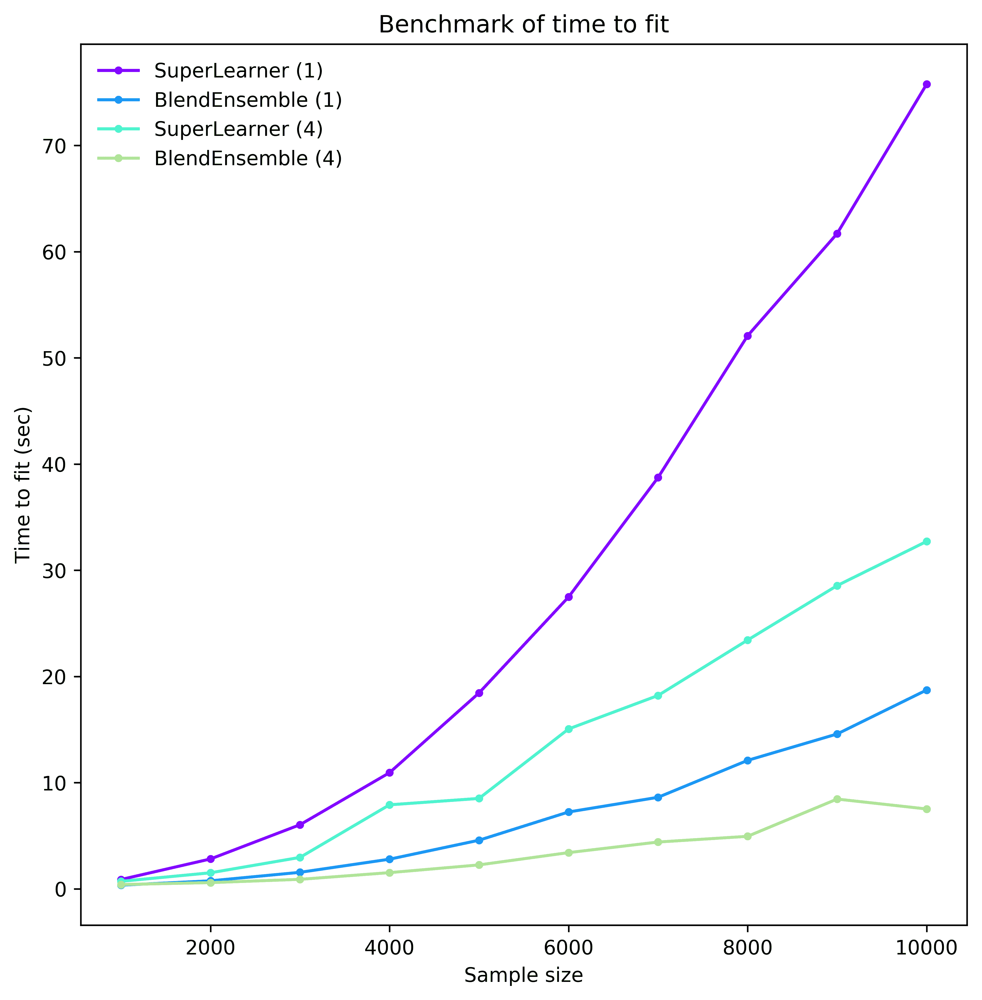

即使有这种适度的并行度，我们也可以实现计算时间的显著减少。但是并行化伴随着一系列潜在的棘手问题，比如竞争条件、死锁和内存爆炸。

#### 2.结构复杂性

一旦我们决定使用整个训练集来元学习者，我们必须担心**信息泄露**。当我们错误地预测训练中使用的样本时，就会出现这种现象，例如，通过混淆我们的折叠或使用在错误子集上训练的模型。当元学习者的训练集中存在信息泄漏时，它将不会学习正确地纠正基本学习者预测错误:垃圾输入，垃圾输出。然而发现这样的漏洞是极其困难的。

#### 3.内存消耗

最后一个问题是并行化，尤其是在 Python 中经常出现的多处理。在这种情况下，每个子进程都有自己的内存，因此需要从父进程复制所有数据。因此，天真的实现会将所有数据复制到所有进程，耗尽内存并在数据序列化上浪费时间。防止这种情况需要共享数据内存，这反过来容易导致数据损坏。

#### 结果:使用包

结论是，你应该使用一个经过单元测试的包，并专注于构建你的机器学习管道。事实上，一旦你选定了一个集成包，构建集成就变得非常简单:你需要做的就是指定基础学习者、元学习者和训练集成的方法。幸运的是，在所有流行的编程语言中都有许多可用的包，尽管它们有不同的风格。在本帖的最后，我们列举了一些作为参考。现在，让我们选择一个，看看堆叠系综在我们的政治捐款数据集上表现如何。这里，我们使用 [ML-Ensemble](https://ml-ensemble.com) 并构建我们之前的广义系综，但是现在使用 10 重交叉验证:

```
 from mlens.ensemble import SuperLearner

# Instantiate the ensemble with 10 folds
sl = SuperLearner(
    folds=10,
    random_state=SEED,
    verbose=2,
    backend="multiprocessing"
)

# Add the base learners and the meta learner
sl.add(list(base_learners.values()), proba=True) 
sl.add_meta(meta_learner, proba=True)

# Train the ensemble
sl.fit(xtrain, ytrain)

# Predict the test set
p_sl = sl.predict_proba(xtest)

print("\nSuper Learner ROC-AUC score: %.3f" % roc_auc_score(ytest, p_sl[:, 1])) 
```

```
 Fitting 2 layers
Processing layer-1             done | 00:02:03
Processing layer-2             done | 00:00:03
Fit complete                        | 00:02:08

Predicting 2 layers
Processing layer-1             done | 00:00:50
Processing layer-2             done | 00:00:02
Predict complete                    | 00:00:54

Super Learner ROC-AUC score: 0.890 
```

就这么简单！对照简单平均系综检查超级学习者的 ROC 曲线揭示了如何利用全部数据使超级学习者在给定精度水平下牺牲较少的回忆。

```
plot_roc_curve(ytest, p.reshape(-1, 1), P.mean(axis=1), ["Simple average"], "Super Learner")
```

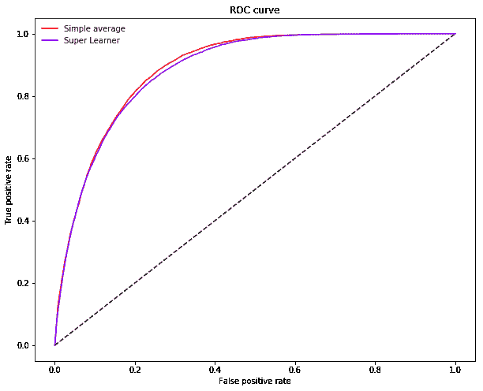

## 从这里去哪里

除了这里介绍的，还有许多其他类型的合奏。然而，基本要素总是相同的:基础学习者库、元学习者和训练过程。通过摆弄这些组件，可以创建各种特殊形式的合奏。mlware 的这篇出色的[帖子](https://mlwave.com/kaggle-ensembling-guide/)是一个很好的起点，可以用来学习更高级的集成学习材料。说到软件，那就是品味的问题了。随着合奏越来越受欢迎，可用的套装数量也在增加。传统上，集成是在统计社区中开发的，所以 R 在专门构建的库方面处于领先地位。最近用 Python 和其他语言开发了几个包，更多的包正在开发中。每个包都迎合不同的需求，处于不同的成熟阶段，所以我们建议货比三家，直到你找到你要找的东西。这里有几个软件包供您使用:

| 语言 | 名字 | 评论 |
| --- | --- | --- |
| 计算机编程语言 | [ml-组合](https://ml-ensemble.com) | 通用集成学习 |
| 计算机编程语言 | [Scikit-learn](https://scikit-learn.org/stable/modules/ensemble.html) | Bagging，多数投票分类器。用于开发中堆叠的 API |
| 计算机编程语言 | [mlxe tend](https://rasbt.github.io/mlxtend/) | 回归和分类集成 |
| 稀有 | [超级赢家](https://cran.r-project.org/web/packages/SuperLearner/index.html) | 超级学习者合奏 |
| 稀有 | [子集合](https://cran.r-project.org/web/packages/subsemble/index.html) | 子进程 |
| 稀有 | [caretenemble](https://cran.r-project.org/web/packages/caretEnsemble/index.html) | 插入估计的集合 |
| 多个的 | [H20](https://docs.h2o.ai/h2o/latest-stable/h2o-docs/data-science/stacked-ensembles.html) | 分布式堆叠集成学习。仅限于 H20 库中的估计器 |
| Java 语言(一种计算机语言，尤用于创建网站) | [堆栈网](https://github.com/kaz-Anova/StackNet) | 由 H20 支持 |
| 基于网络的 | xcessive | 基于网络的集成学习 |