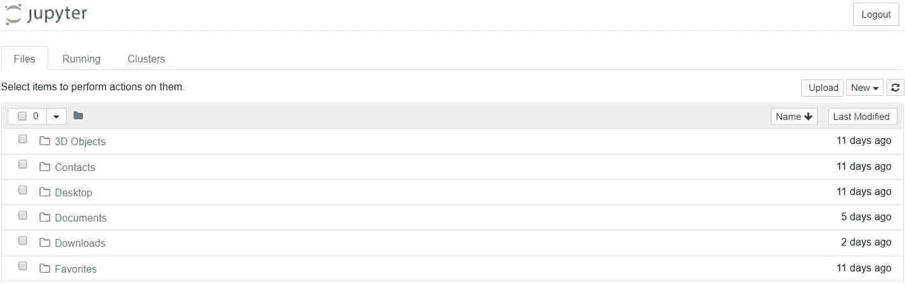
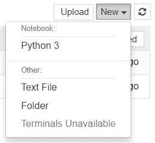
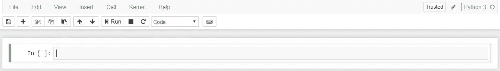
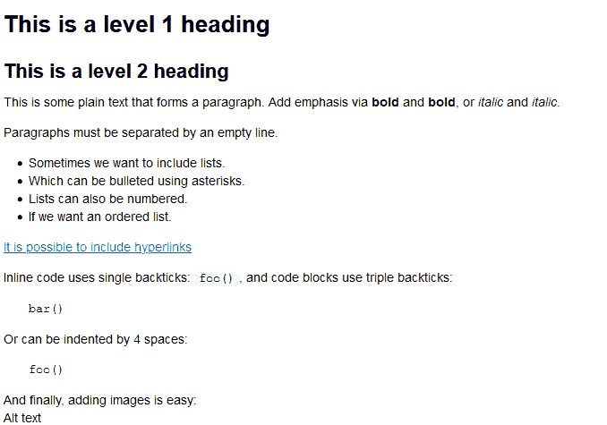
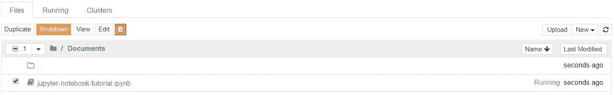
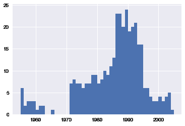
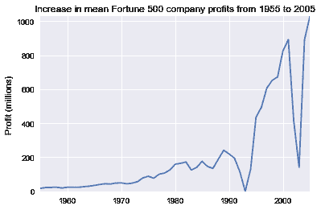
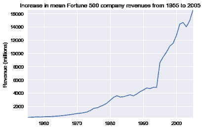
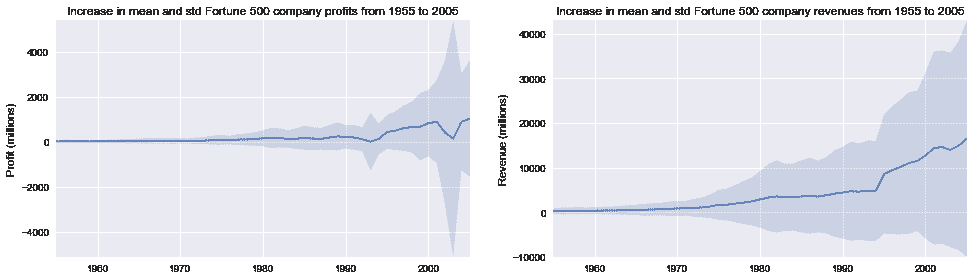
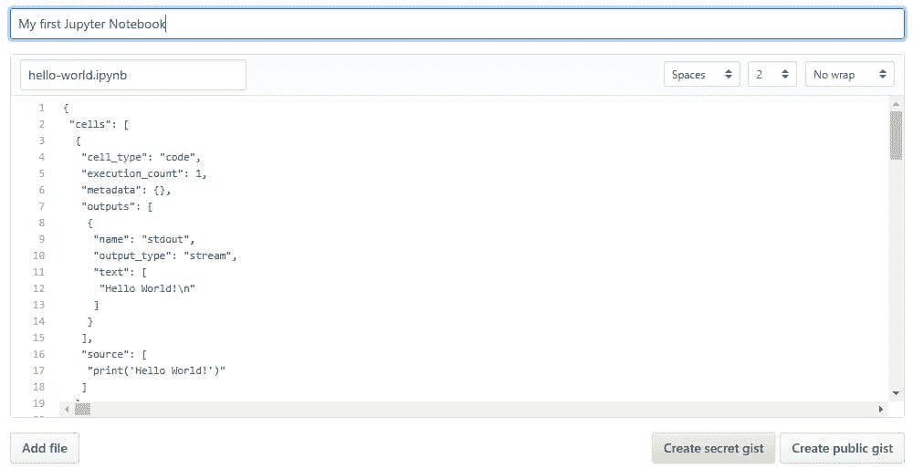

# 如何使用 Jupyter 笔记本:初学者教程

> 原文：<https://www.dataquest.io/blog/jupyter-notebook-tutorial/>

August 24, 2020

## Jupyter 笔记本是什么？

Jupyter Notebook 是一个非常强大的交互式开发和展示数据科学项目的工具。本文将带您了解如何使用 Jupyter 笔记本进行数据科学项目，以及如何在您的本地机器上设置它。

首先，什么是“笔记本”？

笔记本将代码及其输出集成到一个文档中，该文档结合了可视化、叙述性文本、数学公式和其他富媒体。换句话说:这是一个单一的文档，你可以在其中运行代码，显示输出，还可以添加解释，公式，图表，并使你的工作更加透明，可理解，可重复和可共享。

使用笔记本电脑现在是全球公司数据科学工作流程的主要部分。如果您的目标是处理数据，使用笔记本将加快您的工作流程，并使交流和共享您的结果变得更加容易。

最棒的是，作为开源项目 Jupyter 的一部分，Jupyter 笔记本是完全免费的。你可以下载软件[本身](https://jupyter.org/install)，或者作为 [Anaconda 数据科学工具包](https://www.anaconda.com/products/individual)的一部分。

尽管在 Jupyter 笔记本中可以使用许多不同的编程语言，但本文将重点讨论 Python，因为它是最常见的用例。(在 R 用户中， [R Studio](https://www.dataquest.io/blog/tutorial-getting-started-with-r-and-rstudio/) 往往是更受欢迎的选择)。

## 如何遵循本教程

为了从本教程中获得最大收益，你应该熟悉编程——特别是 Python 和 [pandas](https://pandas.pydata.org/) 。也就是说，如果你有使用另一种语言的经验，本文中的 Python 应该不会太晦涩难懂，仍然可以帮助你在本地设置 Jupyter 笔记本。

Jupyter 笔记本也可以作为一个灵活的平台来学习熊猫甚至 Python，这在本教程中会变得很明显。

我们将:

*   涵盖安装 Jupyter 和创建您的第一台笔记本的基础知识
*   深入钻研，学习所有重要的术语
*   探索在线共享和发布笔记本有多容易。

(其实这篇文章是作为 Jupyter 笔记本写的！它以只读形式发布在这里，但这是一个很好的例子，说明笔记本可以多么多功能。事实上，我们大多数的[编程教程](https://www.dataquest.io/python-tutorials-for-data-science/)甚至我们的 [Python 课程](https://www.dataquest.io/r-for-data-science-courses/)都是用 Jupyter 笔记本创建的。

### Jupyter 笔记本中的示例数据分析

首先，我们将通过设置和样本分析来回答一个实际问题。这将展示笔记本流程如何在我们工作时让数据科学任务变得更加直观，以及在需要分享我们的工作时让其他人更加直观。

假设你是一名数据分析师，你的任务是找出美国最大公司的利润历史变化。你会发现一组财富 500 强公司的数据，从 1955 年第一次发布到现在已经超过 50 年了，这些数据是从[财富的公共档案](https://archive.fortune.com/magazines/fortune/fortune500_archive/full/2005/)中收集的。我们已经创建了一个 CSV 格式的数据，您可以在这里[使用](https://s3.amazonaws.com/dq-blog-files/fortune500.csv)。

正如我们将要展示的，Jupyter 笔记本非常适合这项调查。首先，让我们继续安装 Jupyter。

## 装置

初学者开始使用 Jupyter 笔记本最简单的方法是安装 [Anaconda](https://www.anaconda.com/distribution/) 。

Anaconda 是数据科学中使用最广泛的 Python 发行版，预装了所有最流行的库和工具。

Anaconda 中包含的一些最大的 Python 库包括 [NumPy](https://www.numpy.org/) 、 [pandas](https://pandas.pydata.org/) 和 [Matplotlib](https://matplotlib.org/) ，尽管[完整的 1000+列表](https://docs.anaconda.com/anaconda/packages/pkg-docs)是详尽的。

因此，Anaconda 让我们可以立即开始运行一个库存充足的数据科学研讨会，而不会有管理无数安装的麻烦，也不用担心依赖关系和特定于操作系统(即特定于 Windows)的安装问题。

要得到 Anaconda，很简单:

1.  [下载](https://www.anaconda.com/products/individual)Python 3.8 的 Anaconda 最新版本。
2.  按照下载页面和/或可执行文件中的说明安装 Anaconda。

如果你是一个已经安装了 Python 的高级用户，并且喜欢手动管理你的包，你可以使用 pip :

```py
pip3 install jupyter
```

## 创建您的第一个笔记本

在本节中，我们将学习运行和保存笔记本，熟悉它们的结构，并理解界面。我们将熟悉一些核心术语，引导您实际理解如何自己使用 Jupyter 笔记本，并为下一部分做好准备，下一部分将介绍一个数据分析示例，并将我们在此学到的一切融入生活。

### 跑步 Jupyter

在 Windows 上，您可以通过 Anaconda 添加到开始菜单的快捷方式来运行 Jupyter，这将在您的默认 web 浏览器中打开一个新的选项卡，看起来应该类似于下面的截图。



这还不是一个笔记本，但不要惊慌！没什么大不了的。这是笔记本仪表盘，专门用于管理您的 Jupyter 笔记本。将它视为探索、编辑和创建笔记本的发射台。

请注意，仪表板将只允许您访问 Jupyter 的启动目录(即 Jupyter 或 Anaconda 的安装位置)中包含的文件和子文件夹。但是，启动目录[可以更改](https://stackoverflow.com/q/35254852/604687)。

也可以在任何系统上通过命令提示符(或 Unix 系统上的终端)输入命令`jupyter notebook`来启动仪表板；在这种情况下，当前工作目录将是启动目录。

在浏览器中打开 Jupyter Notebook 时，您可能已经注意到仪表板的 URL 类似于`[https://localhost:8888/tree](https://localhost:8888/tree)`。Localhost 不是一个网站，但它表明内容是从你的本地机器:你自己的电脑上提供的。

Jupyter 的笔记本和仪表板是 web 应用程序，Jupyter 启动一个本地 Python 服务器来为您的 web 浏览器提供这些应用程序，使其基本上独立于平台，并打开了更容易在 web 上共享的大门。

(如果你还不明白这一点，不要担心，重要的是，虽然 Jupyter 笔记本可以在你的浏览器中打开，但它是在你的本地机器上托管和运行的。在你决定分享它们之前，你的笔记本实际上并不在网上。)

仪表板的界面基本上是不言自明的——尽管我们稍后会简单地回到它。那么我们还在等什么呢？浏览到您想要创建第一个笔记本的文件夹，单击右上角的“新建”下拉按钮，然后选择“Python 3”:



嘿，很快，我们到了！您的第一个 Jupyter 笔记本将在新选项卡中打开，每个笔记本都使用自己的选项卡，因为您可以同时打开多个笔记本。

如果您切换回仪表板，您将会看到新文件`Untitled.ipynb`，并且您应该会看到一些绿色文本，告诉您您的笔记本正在运行。

#### 什么是 ipynb 文件？

简而言之:每个`.ipynb`文件都是一个笔记本，所以每次创建新笔记本时，都会创建一个新的`.ipynb`文件。

更长的答案是:每个`.ipynb`文件都是一个文本文件，以一种叫做 [JSON](https://en.wikipedia.org/wiki/JSON) 的格式描述你笔记本的内容。每个单元格及其内容，包括已经转换成文本字符串的图像附件，与一些[元数据](https://ipython.org/ipython-doc/3/notebook/nbformat.html#metadata)一起列在其中。

如果你知道你在做什么，你可以自己编辑它！—从笔记本的菜单栏中选择“编辑>编辑笔记本元数据”。您还可以通过从仪表板上的控件中选择“编辑”来查看笔记本文件的内容

但是，这里的关键词是*可以。*在大多数情况下，您没有理由需要手动编辑笔记本元数据。

### 笔记本界面

现在你面前有一个打开的笔记本，希望它的界面不会看起来完全陌生。毕竟，Jupyter 本质上只是一个高级的文字处理器。

为什么不四处看看呢？检查一下菜单，感受一下，特别是花一些时间向下滚动命令面板中的命令列表，命令面板是带有键盘图标的小按钮(或`Ctrl + Shift + P`)。



你应该注意到两个相当突出的术语，它们可能对你来说是新的:*细胞*和*内核*是理解 Jupyter 的关键，也是它不仅仅是一个文字处理器的关键。好在这些概念并不难理解。

*   一个**内核**是一个“计算引擎”,它执行笔记本文档中包含的代码。
*   一个**单元**是一个容器，用于显示笔记本中的文本或者由笔记本内核执行的代码。

### 细胞

稍后我们将回到内核，但首先让我们来了解一下细胞。细胞构成了笔记本的主体。在上一节中新笔记本的屏幕截图中，带有绿色轮廓的框是一个空单元格。我们将介绍两种主要的细胞类型:

*   一个**代码单元**包含要在内核中执行的代码。当代码运行时，笔记本在生成它的代码单元格下面显示输出。
*   一个**降价单元格**包含使用[降价](https://www.markdownguide.org/basic-syntax/)格式化的文本，并在降价单元格运行时就地显示其输出。

新笔记本中的第一个单元格总是代码单元格。

让我们用一个经典的 hello world 例子来测试一下:在单元格中键入`print('Hello World!')`，然后点击上面工具栏中的运行按钮或者按下`Ctrl + Enter`。

结果应该是这样的:

```py
print('Hello World!')
```

```py
Hello World!
```

当我们运行该单元时，其输出显示在下方，其左侧的标签将从`In [ ]`变为`In [1]`。

代码单元的输出也构成了文档的一部分，这就是为什么您可以在本文中看到它。您总是可以区分代码单元格和降价单元格，因为代码单元格的标签在左边，而降价单元格没有。

标签的“In”部分是“Input”的简称，而标签号表示当单元在内核上被执行时的*——在这种情况下，单元首先被执行。*

再次运行该单元，标签将变为`In [2]`，因为现在该单元是第二个在内核上运行的单元。当我们更仔细地研究内核时，会更清楚为什么这是如此有用。

从菜单栏中，点击*插入*并选择*在*下面插入单元格，在你的第一个下面创建一个新的代码单元格，并尝试下面的代码看看会发生什么。你注意到什么不同了吗？

```py
import time
time.sleep(3)
```

这个单元格不产生任何输出，但是它确实需要三秒钟来执行。注意 Jupyter 如何通过将标签更改为`In [*]`来表示单元当前正在运行。

一般来说，单元格的输出来自于在单元格执行期间专门打印的任何文本数据，以及单元格中最后一行的值，无论是单独的变量、函数调用还是其他内容。例如:

```py
def say_hello(recipient):
    return 'Hello, {}!'.format(recipient)

say_hello('Tim')
```

```py
'Hello, Tim!'
```

您会发现自己在自己的项目中几乎经常使用这种方法，以后我们会看到更多。

### 快捷键

运行单元格时，您可能观察到的最后一件事是，它们的边框变成了蓝色，而在您编辑时它是绿色的。在 Jupyter 笔记本中，总有一个“活跃”单元格用边框高亮显示，边框的颜色表示其当前模式:

*   **绿色轮廓** —单元格处于“编辑模式”
*   **蓝色轮廓** —单元格处于“命令模式”

那么，当细胞处于命令模式时，我们能对它做什么呢？到目前为止，我们已经看到了如何使用`Ctrl + Enter`运行单元格，但是我们还可以使用许多其他命令。使用它们的最佳方式是使用键盘快捷键

键盘快捷键是 Jupyter 环境中非常流行的一个方面，因为它们促进了基于单元格的快速工作流。其中许多操作是您可以在活动单元格处于命令模式时执行的。

下面，你会发现一些 Jupyter 的键盘快捷键列表。你不需要马上记住它们，但是这个列表会给你一个很好的主意，什么是可能的。

*   分别用`Esc`和`Enter`在编辑和命令模式之间切换。
*   一旦进入命令模式:
    *   用`Up`和`Down`键上下滚动单元格。
    *   按`A`或`B`在当前单元格的上方或下方插入一个新单元格。
    *   `M`将活动单元格转换为减价单元格。
    *   `Y`将当前单元格设置为代码单元格。
    *   `D + D` ( `D`两次)将删除当前单元格。
    *   `Z`将撤消单元格删除。
    *   按住`Shift`并按下`Up`或`Down`一次选择多个单元格。选中多个单元格，`Shift + M`会合并你的选择。
*   `Ctrl + Shift + -`，在编辑模式下，将光标处的活动单元格拆分。
*   您也可以点击单元格左边的空白处的和`Shift + Click`来选择它们。

继续在你自己的笔记本上尝试这些。准备好之后，创建一个新的减价单元格，我们将学习如何设置笔记本中文本的格式。

### 降价

Markdown 是一种轻量级的、易于学习的标记语言，用于格式化纯文本。它的语法与 HTML 标记一一对应，所以这里的一些先验知识会有帮助，但绝对不是先决条件。

请记住，这篇文章是在 Jupyter 笔记本上写的，所以到目前为止你看到的所有叙述性文本和图像都是用 Markdown 写的。让我们用一个简单的例子来介绍一下基础知识:

```py
# This is a level 1 heading

## This is a level 2 heading

This is some plain text that forms a paragraph. Add emphasis via **bold** and __bold__, or *italic* and _italic_. 

Paragraphs must be separated by an empty line. 

* Sometimes we want to include lists. 
* Which can be bulleted using asterisks. 

1\. Lists can also be numbered. 
2\. If we want an ordered list.

[It is possible to include hyperlinks](https://www.example.com)

Inline code uses single backticks: `foo()`, and code blocks use triple backticks: 
```
bar()
```py 
Or can be indented by 4 spaces: 

    foo()

And finally, adding images is easy: 
```

以下是运行单元格进行渲染后的降价效果:



*(注意，此处显示了图像的替代文本，因为在我们的示例中，我们实际上没有使用有效的图像 URL)*

附加图像时，您有三种选择:

*   使用网络上图像的 URL。
*   使用一个本地 URL 链接到您将与笔记本一起保存的图像，比如在同一个 git repo 中。
*   通过“编辑>插入图像”添加附件；这将把图像转换成一个字符串并存储在你的笔记本`.ipynb`文件中。请注意，这将使您的`.ipynb`文件更大！

还有更多的东西需要削减，尤其是超链接，也可以简单地包含普通的 HTML。一旦你发现自己正在挑战上述基础知识的极限，你可以参考 Markdown 的创始人约翰·格鲁伯在其网站上发布的官方指南。

### 核心

每台笔记本背后都运行着一个内核。当您运行代码单元时，该代码在内核中执行。任何输出都返回到单元格中进行显示。内核的状态会随着时间的推移在单元格之间持续存在——它属于整个文档，而不是单个单元格。

例如，如果您在一个单元格中导入库或声明变量，它们将在另一个单元格中可用。让我们试试这个来感受一下。首先，我们将导入一个 Python 包并定义一个函数:

```py
import numpy as np
def square(x):
    return x * x
```

一旦我们执行了上面的单元格，我们就可以在任何其他单元格中引用`np`和`square`。

```py
x = np.random.randint(1, 10)
y = square(x)
print('%d squared is %d' % (x, y))
```

```py
1 squared is 1
```

不管笔记本中单元格的顺序如何，这都将有效。只要一个单元已经运行，您声明的任何变量或您导入的库将在其他单元中可用。

你可以自己试试，我们再把变量打印出来。

```py
print('Is %d squared %d?' % (x, y))
```

```py
Is 1 squared 1?
```

这里没有惊喜！但是如果我们改变`y?`的值会发生什么

```py
y = 10
print('Is %d squared is %d?' % (x, y))
```

如果我们运行上面的单元，你认为会发生什么？

我们将得到类似于`Is 4 squared 10?`的输出。这是因为一旦我们运行了`y = 10`代码单元，`y`不再等于内核中 x 的平方。

大多数时候，当你创建一个笔记本时，流程是自上而下的。但是回去做改动是常有的事。当我们确实需要对一个更早的单元进行更改时，我们可以在每个单元的左侧看到的执行顺序，比如`In [6]`，可以通过查看单元的运行顺序来帮助我们诊断问题。

如果我们希望重新设置，内核菜单中有几个非常有用的选项:

*   重启:重启内核，从而清除所有已定义的变量等。
*   重新启动并清除输出:同上，但也会清除代码单元格下方显示的输出。
*   重启并运行全部:同上，但也将从第一个到最后一个顺序运行所有单元格。

如果您的内核在某个计算上停滞不前，并且您希望停止它，您可以选择中断选项。

#### 选择内核

你可能注意到了，Jupyter 给了你改变内核的选项，事实上有很多不同的选项可供选择。当您通过选择 Python 版本从仪表板创建新笔记本时，您实际上是在选择使用哪个内核。

有不同版本 Python 的内核，也有超过 100 种语言的内核，包括 Java，C，甚至 Fortran。数据科学家可能会对 [R](https://irkernel.github.io/) 和 [Julia](https://github.com/JuliaLang/IJulia.jl) 的内核，以及 [imatlab](https://github.com/imatlab/imatlab) 和 [Calysto MATLAB 的内核](https://github.com/calysto/matlab_kernel)特别感兴趣。

SoS 内核在一台笔记本电脑中提供多语言支持。

每个内核都有自己的安装说明，但可能需要您在计算机上运行一些命令。

## 实例分析

现在我们已经了解了什么是 Jupyter 笔记本，是时候看看*如何在实践中使用它们了，这将让我们更清楚地了解*为什么*它们如此受欢迎。*

终于到了开始使用前面提到的财富 500 强数据集的时候了。请记住，我们的目标是找出美国最大公司的利润是如何发生历史性变化的。

值得注意的是，每个人都会发展自己的喜好和风格，但总的原则仍然适用。如果您愿意，可以在自己的笔记本上跟随这一部分，或者将它作为创建自己的方法的指南。

### 命名您的笔记本

在开始编写项目之前，您可能希望给它起一个有意义的名称。文件名`Untitled`在屏幕左上角输入一个新的文件名，点击其下方的保存图标(看起来像软盘)进行保存。

请注意，关闭浏览器中的“笔记本”选项卡将**而不是**“关闭”笔记本，就像在传统应用程序中关闭文档一样。笔记本的内核将继续在后台运行，并且需要在它真正“关闭”之前关闭——尽管如果你不小心关闭了标签或浏览器，这是非常方便的！

如果内核关闭，您可以关闭标签页，而不用担心它是否还在运行。

最简单的方法是从笔记本菜单中选择“文件>关闭并暂停”。但是，您也可以关闭内核，方法是在笔记本应用程序中进入“内核>关闭”，或者在仪表板中选择笔记本，然后单击“关闭”(见下图)。



### 设置

通常从专门用于导入和设置的代码单元开始，这样，如果您选择添加或更改任何内容，您可以简单地编辑并重新运行该单元，而不会导致任何副作用。

```py
%matplotlib inline
import pandas as pd
import matplotlib.pyplot as plt
import seaborn as sns sns.set(style="darkgrid")
```

我们将导入 [pandas](https://pandas.pydata.org/) 来处理我们的数据，导入 [Matplotlib](https://matplotlib.org/) 来绘制图表，导入 [Seaborn](https://seaborn.pydata.org/) 来使我们的图表更漂亮。进口 NumPy 也很常见，但在这种情况下，熊猫为我们进口。

第一行不是 Python 命令，而是使用一种叫做 line magic 的东西来指示 Jupyter 捕获 Matplotlib 图并在单元格输出中呈现它们。我们稍后会谈到更多的线魔法，它们也包含在我们的[高级 Jupyter 笔记本教程](https://www.dataquest.io/blog/advanced-jupyter-notebooks-tutorial/)中。

现在，让我们继续加载我们的数据。

```py
df = pd.read_csv('fortune500.csv')
```

明智的做法是在单个单元格中也这样做，以防我们需要在任何时候重新加载它。

### 保存和检查点

现在我们已经开始了，定期储蓄是最好的做法。按`Ctrl + S`会通过调用“保存和检查点”命令来保存我们的笔记本，但是这个检查点是什么东西呢？

每当我们创建一个新的笔记本时，检查点文件会随笔记本文件一起创建。它位于保存位置的隐藏子目录`.ipynb_checkpoints`中，也是一个`.ipynb`文件。

默认情况下，Jupyter 会每隔 120 秒自动将您的笔记本保存到该检查点文件，而不会改变您的主笔记本文件。当您“保存并检查”时，笔记本和检查点文件都会更新。因此，检查点使您能够在出现意外问题时恢复未保存的工作。

您可以通过“文件”>“恢复到检查点”从菜单中恢复到检查点

### 调查我们的数据集

现在我们真的开始了！我们的笔记本被安全保存，我们已经将数据集`df`加载到最常用的 pandas 数据结构中，该数据结构被称为`DataFrame`，基本上看起来像一个表。我们的看起来像什么？

```py
df.head()
```

| 年 | 军阶 | 公司 | 收入(百万) | 利润(百万) |
| --- | --- | --- | --- | --- |
| Zero | One thousand nine hundred and fifty-five | one | 通用汽车 | Nine thousand eight hundred and twenty-three point five | Eight hundred and six |
| one | One thousand nine hundred and fifty-five | Two | 埃克森美孚 | Five thousand six hundred and sixty-one point four | Five hundred and eighty-four point eight |
| Two | One thousand nine hundred and fifty-five | three | 美国钢铁 | Three thousand two hundred and fifty point four | One hundred and ninety-five point four |
| three | One thousand nine hundred and fifty-five | four | 通用电气 | Two thousand nine hundred and fifty-nine point one | Two hundred and twelve point six |
| four | One thousand nine hundred and fifty-five | five | 埃斯马特 | Two thousand five hundred and ten point eight | Nineteen point one |

```py
df.tail()
```

| 年 | 军阶 | 公司 | 收入(百万) | 利润(百万) |
| --- | --- | --- | --- | --- |
| Twenty-five thousand four hundred and ninety-five | Two thousand and five | Four hundred and ninety-six | Wm。小箭牌 | Three thousand six hundred and forty-eight point six | Four hundred and ninety-three |
| Twenty-five thousand four hundred and ninety-six | Two thousand and five | Four hundred and ninety-seven | 皮博迪能源公司 | Three thousand six hundred and thirty-one point six | One hundred and seventy-five point four |
| Twenty-five thousand four hundred and ninety-seven | Two thousand and five | Four hundred and ninety-eight | 温迪国际 | Three thousand six hundred and thirty point four | Fifty-seven point eight |
| Twenty-five thousand four hundred and ninety-eight | Two thousand and five | Four hundred and ninety-nine | 亲属保健 | Three thousand six hundred and sixteen point six | Seventy point six |
| Twenty-five thousand four hundred and ninety-nine | Two thousand and five | Five hundred | 辛辛那提金融公司 | Three thousand six hundred and fourteen | Five hundred and eighty-four |

看起来不错。我们有我们需要的列，每一行对应于一年中的一家公司。

让我们重新命名这些列，以便以后引用它们。

```py
df.columns = ['year', 'rank', 'company', 'revenue', 'profit']
```

接下来，我们需要探索我们的数据集。完成了吗？熊猫如预期的读了吗？是否缺少任何值？

```py
len(df)
```

```py
25500
```

好的，看起来不错——从 1955 年到 2005 年，每年都有 500 行。

让我们检查一下我们的数据集是否像我们期望的那样被导入了。一个简单的检查是查看数据类型(或 dtypes)是否被正确解释。

```py
df.dtypes
```

```py
year int64 rank int64 company object revenue float64 profit object dtype: object
```

啊哦。看起来利润栏有问题——我们认为它会像收入栏一样。这表明它很可能包含一些非整数值，所以我们来看看。

```py
non_numberic_profits = df.profit.str.contains('[^0-9.-]')
df.loc[non_numberic_profits].head()
```

| 年 | 等级 | 公司 | 税收 | 利润 |
| --- | --- | --- | --- | --- |
| Two hundred and twenty-eight | One thousand nine hundred and fifty-five | Two hundred and twenty-nine | 诺顿(男子名) | One hundred and thirty-five | 不适用 |
| Two hundred and ninety | One thousand nine hundred and fifty-five | Two hundred and ninety-one | 施利茨酿酒公司 | One hundred | 不适用 |
| Two hundred and ninety-four | One thousand nine hundred and fifty-five | Two hundred and ninety-five | 太平洋植物油 | Ninety-seven point nine | 不适用 |
| Two hundred and ninety-six | One thousand nine hundred and fifty-five | Two hundred and ninety-seven | 利伯曼啤酒厂 | Ninety-six | 不适用 |
| Three hundred and fifty-two | One thousand nine hundred and fifty-five | Three hundred and fifty-three | 明尼阿波利斯-魔线 | Seventy-seven point four | 不适用 |

正如我们所怀疑的！有些值是字符串，用于指示丢失的数据。有没有其他的价值观已经悄然进入？

```py
set(df.profit[non_numberic_profits])
```

```py
{'N.A.'}
```

这很容易解释，但是我们应该怎么做呢？嗯，那要看少了多少个值。

```py
len(df.profit[non_numberic_profits])
```

```py
369
```

这只是我们数据集的一小部分，尽管并非完全无关紧要，因为它仍然在 1.5%左右。

如果包含`N.A.`的行在这些年中大致均匀分布，最简单的解决方法就是删除它们。所以让我们快速看一下分布情况。

```py
bin_sizes, _, _ = plt.hist(df.year[non_numberic_profits], bins=range(1955, 2006))
```



一眼看去，我们可以看到一年中最无效的值少于 25，并且由于每年有 500 个数据点，删除这些值将占最差年份数据的不到 4%。事实上，除了 90 年代左右的飙升，大多数年份都不到峰值的一半。

出于我们的目的，假设这是可以接受的，并继续删除这些行。

```py
df = df.loc[~non_numberic_profits]
df.profit = df.profit.apply(pd.to_numeric)
```

我们应该检查一下是否有效。

```py
len(df)
```

```py
25131
```

```py
df.dtypes
```

```py
year int64 rank int64 company object revenue float64 profit float64 dtype: object
```

太好了！我们已经完成了数据集设置。

如果我们要将您的笔记本显示为一个报告，我们可以去掉我们创建的调查单元格，这些单元格在这里是作为笔记本工作流程的演示，并合并相关的单元格(有关这方面的更多信息，请参见下面的高级功能部分)来创建一个单独的数据集设置单元格。

这意味着，如果我们在其他地方弄乱了数据集，我们可以重新运行 setup 单元来恢复它。

### 使用 matplotlib 绘图

接下来，我们可以通过绘制每年的平均利润来解决手头的问题。我们也可以绘制收入图，所以首先我们可以定义一些变量和一个减少代码的方法。

```py
group_by_year = df.loc[:, ['year', 'revenue', 'profit']].groupby('year')
avgs = group_by_year.mean()
x = avgs.index
y1 = avgs.profit
def plot(x, y, ax, title, y_label):
    ax.set_title(title)
    ax.set_ylabel(y_label)
    ax.plot(x, y)
    ax.margins(x=0, y=0)
```

现在我们来策划！

```py
fig, ax = plt.subplots()
plot(x, y1, ax, 'Increase in mean Fortune 500 company profits from 1955 to 2005', 'Profit (millions)')
```



哇，这看起来像一个指数，但它有一些巨大的下降。它们必须与 20 世纪 90 年代初的衰退和 T2 的网络泡沫相对应。在数据中看到这一点很有趣。但是，每次衰退之后，利润是如何恢复到更高水平的呢？

也许收入能告诉我们更多。

```py
y2 = avgs.revenue
fig, ax = plt.subplots()
plot(x, y2, ax, 'Increase in mean Fortune 500 company revenues from 1955 to 2005', 'Revenue (millions)')
```



这增加了故事的另一面。收入没有受到那么严重的打击——这是财务部门的一些出色的会计工作。

在栈溢出的一点帮助下[，我们可以用+/-它们的标准偏差叠加这些图。](https://stackoverflow.com/a/47582329/604687)

```py
def plot_with_std(x, y, stds, ax, title, y_label):
    ax.fill_between(x, y - stds, y + stds, alpha=0.2)
    plot(x, y, ax, title, y_label)
fig, (ax1, ax2) = plt.subplots(ncols=2)
title = 'Increase in mean and std Fortune 500 company %s from 1955 to 2005'
stds1 = group_by_year.std().profit.values
stds2 = group_by_year.std().revenue.values
plot_with_std(x, y1.values, stds1, ax1, title % 'profits', 'Profit (millions)')
plot_with_std(x, y2.values, stds2, ax2, title % 'revenues', 'Revenue (millions)')
fig.set_size_inches(14, 4)
fig.tight_layout()
```



这是惊人的，标准差是巨大的！一些财富 500 强公司赚了数十亿美元，而另一些公司却损失了数十亿美元，而且随着这些年利润的增加，风险也在增加。

也许有些公司比其他公司表现更好；前 10%的利润比后 10%的利润波动更大还是更小？

接下来我们可以研究很多问题，很容易看出在笔记本上工作的流程如何与一个人自己的思维过程相匹配。出于本教程的目的，我们将在这里停止我们的分析，但是您可以自由地自己继续挖掘数据！

这个流程帮助我们轻松地在一个地方调查我们的数据集，而无需在应用程序之间切换上下文，并且我们的工作可以立即共享和复制。如果我们希望为特定的受众创建更简洁的报告，我们可以通过合并单元格和删除中间代码来快速重构我们的工作。

## 共享您的笔记本

当人们谈论共享他们的笔记本时，他们通常会考虑两种模式。

大多数情况下，个人分享他们工作的最终结果，就像这篇文章本身一样，这意味着分享他们笔记本的非交互式、预渲染版本。然而，借助于版本控制系统，如 [Git](https://git-scm.com/) 或在线平台如 [Google Colab](https://colab.research.google.com/notebooks/intro.ipynb) ，在笔记本上进行合作也是可能的。

### 在分享之前

共享笔记本将完全按照导出或保存时的状态显示，包括任何代码单元格的输出。因此，为了确保您的笔记本可以共享，您应该在共享前采取以下几个步骤:

1.  单击“单元格>所有输出>清除”
2.  点击“内核>重启并全部运行”
3.  等待您的代码单元完成执行，并按预期检查运行情况

这将确保您的笔记本不包含中间输出，没有过时的状态，并在共享时按顺序执行。

### 导出您的笔记本

Jupyter 内置了对导出为 HTML 和 PDF 以及其他几种格式的支持，你可以在“文件>下载为”下的菜单中找到

如果您希望与一个小型私人团体共享您的笔记本电脑，此功能可能正是您所需要的。事实上，由于学术机构中的许多研究人员都获得了一些公共或内部网络空间，并且因为您可以将笔记本导出为 HTML 文件，所以 Jupyter 笔记本对于研究人员来说是一种与同行共享他们的成果的特别方便的方式。

但是如果共享导出的文件对你来说还不够，还有一些非常流行的方法可以更直接地在网上共享`.ipynb`文件。

### 开源代码库

随着 GitHub 上的[公共笔记本数量在 2018 年初超过 180 万，它无疑是最受欢迎的与世界分享 Jupyter 项目的独立平台。GitHub 已经集成了对直接在存储库和网站上的 gists 中呈现`.ipynb`文件的支持。如果你还不知道的话，](https://github.com/parente/nbestimate) [GitHub](https://github.com/) 是一个代码托管平台，为用 [Git](https://git-scm.com/) 创建的存储库提供版本控制和协作。你需要一个帐户来使用他们的服务，但标准帐户是免费的。

一旦你有了 GitHub 账户，在 GitHub 上分享笔记本最简单的方法实际上根本不需要 Git。自 2008 年以来，GitHub 提供了 Gist 服务来托管和共享代码片段，每个代码片段都有自己的存储库。要使用 Gists 共享笔记本:

1.  登录并导航至[gist.github.com](https://gist.github.com/)。
2.  在一个文本编辑器中打开您的`.ipynb`文件，选择 all 并将 JSON 复制到里面。
3.  将笔记本 JSON 粘贴到要点中。
4.  给你的要点一个文件名，记住要加上`.iypnb`，否则就没用了。
5.  点按“创建秘密要点”或“创建公开要点”

这应该类似于以下内容:



如果你创建了一个公共 Gist，你现在可以和任何人分享它的 URL，其他人也可以[派生和克隆](https://help.github.com/articles/forking-and-cloning-gists/)你的作品。

创建自己的 Git 库并在 GitHub 上共享超出了本教程的范围，但是 [GitHub 提供了大量的指南](https://guides.github.com/)让你自己开始。

对于那些使用 git 的人来说，一个额外的提示是[为 Jupyter 创建的那些隐藏的`.ipynb_checkpoints`目录添加一个例外](https://stackoverflow.com/q/35916658/604687)到你的`.gitignore`中，这样就不会不必要地提交检查点文件到你的 repo 中。

### abviewer

到 2015 年，NBViewer 已经发展到每周渲染[数十万台](https://blog.jupyter.org/rendering-notebooks-on-github-f7ac8736d686)笔记本，是网络上最受欢迎的笔记本渲染器。如果你已经有一个地方可以在线存放你的 Jupyter 笔记本，无论是 GitHub 还是其他地方，NBViewer 都会呈现你的笔记本并提供一个可共享的 URL。作为 Jupyter 项目的一部分，它是免费提供的，可在 nbviewer.jupyter.org[的](https://nbviewer.jupyter.org/)获得。

NBViewer 最初是在 GitHub 的 Jupyter 笔记本集成之前开发的，它允许任何人输入 URL、Gist ID 或 GitHub 用户名/repo/file，它会将笔记本呈现为网页。Gist 的 ID 是其 URL 末尾的唯一数字；比如`[https://gist.github.com/username/50896401c23e0bf417e89cd57e89e1de](https://gist.github.com/username/50896401c23e0bf417e89cd57e89e1de)`中最后一个反斜杠后的字符串。如果您输入 GitHub 用户名或用户名/回购，您将看到一个最小的文件浏览器，让您浏览用户的回购及其内容。

显示笔记本时，NBViewer 显示的 URL 是一个常数，基于它所渲染的笔记本的 URL，因此您可以与任何人共享它，只要原始文件保持在线，它就可以工作-nb viewer 不会缓存文件很长时间。

如果你不喜欢 Nbviewer，还有其他类似的选择— [这里有一个帖子](https://community.dataquest.io/t/how-to-easily-view-shared-projects-without-even-downloadning-anything/517267)，有一些来自我们社区的可以考虑。

## 附加功能:Jupyter 笔记本扩展

我们已经涵盖了您在 Jupyter 笔记本上开始工作所需的一切。

### 什么是扩展？

扩展正是它们听起来的样子——扩展 Jupyter 笔记本功能的附加功能。虽然基本的 Jupyter 笔记本可以做很多事情，但扩展提供了一些额外的功能，这些功能可能有助于特定的工作流程，或者只是改善用户体验。

例如，一个名为“目录”的扩展为你的笔记本生成一个目录，使大笔记本更容易可视化和导航。

另一个叫做变量检查器，可以显示笔记本中每个变量的值、类型、大小和形状，便于快速参考和调试。

另一个叫做 ExecuteTime，让您知道每个单元何时运行以及运行了多长时间——如果您试图加快代码片段的速度，这可能特别方便。

这些只是冰山一角；有许多扩展可用。

### 你能在哪里得到延长？

要获得扩展，您需要安装 Nbextensions。您可以使用 pip 和命令行来实现这一点。如果您有 Anaconda，那么通过 Anaconda 提示符而不是常规的命令行来完成可能更好。

关闭 Jupyter 笔记本，打开 Anaconda 提示符，运行以下命令:`pip install jupyter_contrib_nbextensions && jupyter contrib nbextension install`。

一旦你这样做了，启动一个笔记本，你应该看到一个 Nbextensions 标签。单击此选项卡将显示可用扩展的列表。只需勾选您想要启用的扩展的复选框，您就可以开始比赛了！

### 安装扩展

一旦安装了 Nbextensions 本身，就不需要额外安装每个扩展。然而，如果你已经安装了 Nbextensons，但是没有看到这个标签，你并不孤单。[Github](https://github.com/Jupyter-contrib/jupyter_nbextensions_configurator/issues/72)上的这个帖子详细介绍了一些常见问题和解决方案。

## 临时演员:朱庇特的线条魔术

当我们使用`%matplotlib inline`使 Matplotlib 图表在我们的笔记本中正确呈现时，我们前面提到了神奇的命令。我们也可以使用许多其他的魔法。

### 如何在 Jupyter 中使用魔法

好的第一步是打开一个 Jupyter 笔记本，在单元格中键入`%lsmagic`,然后运行单元格。这将输出一个可用的线条魔术和单元格魔术的列表，它还会告诉你“自动魔术”是否打开。

*   **线条魔术**在代码单元的单行上操作
*   **单元魔法**作用于调用它们的整个代码单元

如果 automagic 是打开的，你可以简单地运行一个魔术，只需在代码单元中键入它自己的行，然后运行这个单元。如果关闭，你需要将`%`放在线魔法之前，将`%%`放在单元魔法之前来使用它们。

许多魔法需要额外的输入(就像函数需要参数一样)来告诉它们如何操作。我们将在下一节中查看一个示例，但是您可以通过带问号运行它来查看任何魔术的文档，就像这样:

```py
%matplotlib?
```

当你在笔记本上运行上述单元格时，屏幕上会弹出一个很长的文档字符串，详细说明如何使用这个魔法。

### 一些有用的魔法命令

我们将在[高级 Jupyter 教程](https://www.dataquest.io/blog/advanced-jupyter-notebooks-tutorial/)中介绍更多内容，但这里有一些可以帮助您入门:

| **魔法命令** | **它的作用** |
| --- | --- |
| **%运行** | Runs an external script file as part of the cell being executed.例如，如果 **%run myscript.py** 出现在代码单元格中，myscript.py 将作为该单元格的一部分由内核执行。 |
| **%timeit** | 计算循环次数，测量并报告代码单元执行所需的时间。 |
| **%writefile** | Save the contents of a cell to a file.例如， **%savefile myscript.py** 会将代码单元格保存为名为 myscript.py 的外部文件。 |
| **%商店** | 保存变量以在不同的笔记本中使用。 |
| **% n-d** | 打印当前工作的目录路径。 |
| **%%javascript** | 将单元格作为 JavaScript 代码运行。 |

从那里来的还有很多。跳进 Jupyter 笔记本，开始使用`%lsmagic`探索吧！

## 最后的想法

从零开始，我们已经掌握了 Jupyter 笔记本的自然工作流程，深入研究了 IPython 更高级的功能，并最终学会了如何与朋友、同事和世界分享我们的工作。我们从一台笔记本电脑上完成了这一切！

应该清楚笔记本如何通过减少上下文切换和模仿项目过程中思维的自然发展来促进高效的工作体验。使用 Jupyter 笔记本的力量也应该是显而易见的，我们涵盖了大量线索，让您开始在自己的项目中探索更多的[高级功能](https://www.dataquest.io/blog/advanced-jupyter-notebooks-tutorial/)。

如果你想为你自己的笔记本寻找更多的灵感，Jupyter 已经收集了[一系列有趣的 Jupyter 笔记本](https://github.com/jupyter/jupyter/wiki/A-gallery-of-interesting-Jupyter-Notebooks)，你可能会觉得有帮助，并且 [Nbviewer 主页](https://nbviewer.jupyter.org/)链接到一些真正精美的优质笔记本。

如果你想了解更多关于这个话题的信息，请查看 Dataquest 的交互式 [Python 函数，学习 Jupyter 笔记本](https://www.dataquest.io/course/python-functions-and-jupyter-notebook/)课程，以及我们的[Python 数据分析师](https://www.dataquest.io/path/data-analyst)和[Python 数据科学家](https://www.dataquest.io/path/data-scientist)路径，它们将帮助你在大约 6 个月内做好工作准备。

## 更多优秀的 Jupyter 笔记本资源

*   [高级 Jupyter 笔记本教程](https://www.dataquest.io/blog/advanced-jupyter-notebooks-tutorial/)–现在您已经掌握了基础知识，通过本高级教程成为 Jupyter 笔记本专业版！
*   [28 个 Jupyter 笔记本提示、技巧和快捷方式](https://www.dataquest.io/blog/jupyter-notebook-tips-tricks-shortcuts/)——用这些提示和技巧让自己成为超级用户并提高效率！
*   [引导式项目——安装并学习 Jupyter 笔记本电脑](https://app.dataquest.io/m/349/)—通过完成这个交互式引导式项目，为自己使用 Jupyter 笔记本电脑打下良好的基础，该项目将帮助您进行设置并教会您使用技巧。