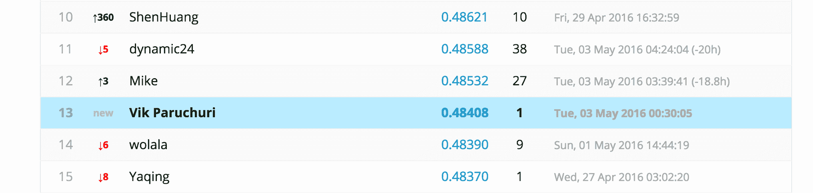

# 如何使用 Python 进入 Kaggle 比赛的前 15 名

> 原文：<https://www.dataquest.io/blog/kaggle-tutorial/>

May 3, 2016

Kaggle 竞赛是学习数据科学和建立投资组合的绝佳方式。我个人用 Kaggle 学习了很多数据科学概念。学编程几个月就开始和 Kaggle 一起了，后来赢了几次比赛。在 Kaggle 比赛中取得好成绩需要的不仅仅是知道机器学习算法。它需要正确的心态、学习的意愿和大量的数据探索。不过，在 Kaggle 入门教程中，这些方面通常都不会被强调。在这篇文章中，我将讲述如何开始参加 [Kaggle Expedia 酒店推荐竞赛](https://www.kaggle.com/c/expedia-hotel-recommendations)，包括建立正确的思维模式，建立测试基础设施，探索数据，创建特征，以及做出预测。最后，我们将使用本文中的技术生成一个 sublesson 文件。在撰写本文时，sublesson 将排在第一位。

截至本文撰写时，该分契的排名。

## Expedia Kaggle 竞赛

Expedia 竞赛的挑战是，根据用户在 Expedia 上进行搜索的一些属性，预测用户将预订哪家酒店。在我们开始任何编码之前，我们需要花时间去理解问题和数据。

### 对这些列的快速浏览

第一步是查看数据集列的描述。你可以在这里找到。在页面底部，您会看到数据中每一列的描述。看一下这个，我们似乎有相当多的关于用户在 Expedia 上进行搜索的数据，以及他们最终在`test.csv`和`train.csv`预订的酒店集群的数据。`destinations.csv`包含用户搜索酒店的地区信息。我们不会担心我们现在预测什么，我们会专注于理解这些列。

### Expedia

由于竞争包括来自 Expedia 上预订酒店的用户的活动数据，我们需要花一些时间来了解 Expedia 网站。查看预订流程将有助于我们了解数据中的字段，以及它们如何与 Expedia 结合使用。


预订酒店时最初看到的页面。

标有`Going To`的方框映射到数据中的`srch_destination_type_id`、`hotel_continent`、`hotel_country`和`hotel_market`字段。标有`Check-in`的方框映射到数据中的`srch_ci`字段，标有`Check out`的方框映射到数据中的`srch_co`字段。标有`Guests`的框映射到数据中的`srch_adults_cnt`、`srch_children_cnt`和`srch_rm_cnt`字段。标有`Add a Flight`的方框映射到数据中的`is_package`字段。`site_name`是您访问的站点的名称，无论它是主`Expedia.com`站点还是其他站点。`user_location_country`、`user_location_region`、`user_location_city`、`is_mobile`、`channel`、`is_booking`和`cnt`都是由用户在哪里、他们的设备是什么或者他们在 Expedia 站点上的会话所决定的属性。只要看一个屏幕，我们就可以立即将所有的变量联系起来。摆弄屏幕、填充值和浏览预订流程可以帮助进一步了解上下文。

## 探索 Python 中的 Kaggle 数据

现在我们已经在高层次上处理了数据，我们可以做一些探索来更深入地了解。

### 下载数据

你可以在这里下载[的资料。数据集相当大，因此您需要大量的磁盘空间。您需要解压缩文件以获得原始的`.csv`文件，而不是`.csv.gz`。](https://www.kaggle.com/c/expedia-hotel-recommendations/data)

### 用熊猫探索数据

考虑到系统的内存容量，读取所有数据可能可行，也可能不可行。如果不是，您应该考虑在 EC2 或 DigitalOcean 上创建一台机器来处理数据。

这里有一个关于如何开始的教程。一旦我们下载了数据，我们就可以用[熊猫](https://pandas.pydata.org/)来读取它:

```py
 import pandas as pd
destinations = pd.read_csv("destinations.csv")
test = pd.read_csv("test.csv")
train = pd.read_csv("train.csv") 
```

我们先来看看有多少数据:

```py
train.shape
```

```py
(37670293, 24)
```

```py
test.shape
```

```py
(2528243, 22)
```

我们有大约`37`百万训练集行，和`2`百万测试集行，这将使这个问题变得有点挑战性。我们可以研究数据的前几行:

```py
train.head(5)
```

|  | 日期时间 | 站点名称 | 波萨大陆 | 用户 _ 位置 _ 国家 | 用户 _ 位置 _ 区域 | 用户 _ 位置 _ 城市 | 起点 _ 终点 _ 距离 | 用户标识 | 不变的 | is _ 包 | … | srch_children_cnt | srch _ rm _ cnt | 目的地标识 | 目的地类型标识 | is _ 预订 | （cannot）不能 | 大陆酒店 | 国家酒店 | 酒店 _ 市场 | 酒店 _ 集群 |
| --- | --- | --- | --- | --- | --- | --- | --- | --- | --- | --- | --- | --- | --- | --- | --- | --- | --- | --- | --- | --- | --- |
| Zero | 2014-08-11 07:46:59 | Two | three | Sixty-six | Three hundred and forty-eight | Forty-eight thousand eight hundred and sixty-two | 2234.2641 | Twelve | Zero | one | … | Zero | one | Eight thousand two hundred and fifty | one | Zero | three | Two | Fifty | Six hundred and twenty-eight | one |
| one | 2014-08-11 08:22:12 | Two | three | Sixty-six | Three hundred and forty-eight | Forty-eight thousand eight hundred and sixty-two | 2234.2641 | Twelve | Zero | one | … | Zero | one | Eight thousand two hundred and fifty | one | one | one | Two | Fifty | Six hundred and twenty-eight | one |
| Two | 2014-08-11 08:24:33 | Two | three | Sixty-six | Three hundred and forty-eight | Forty-eight thousand eight hundred and sixty-two | 2234.2641 | Twelve | Zero | Zero | … | Zero | one | Eight thousand two hundred and fifty | one | Zero | one | Two | Fifty | Six hundred and twenty-eight | one |
| three | 2014-08-09 18:05:16 | Two | three | Sixty-six | Four hundred and forty-two | Thirty-five thousand three hundred and ninety | 913.1932 | Ninety-three | Zero | Zero | … | Zero | one | Fourteen thousand nine hundred and eighty-four | one | Zero | one | Two | Fifty | One thousand four hundred and fifty-seven | Eighty |
| four | 2014-08-09 18:08:18 | Two | three | Sixty-six | Four hundred and forty-two | Thirty-five thousand three hundred and ninety | 913.6259 | Ninety-three | Zero | Zero | … | Zero | one | Fourteen thousand nine hundred and eighty-four | one | Zero | one | Two | Fifty | One thousand four hundred and fifty-seven | Twenty-one |

有几件事马上就凸显出来了:

*   可能对我们的预测有用，所以我们需要转换它。
*   大多数列都是整数或浮点数，所以我们不能做很多特性工程。比如，`user_location_country`不是一个国家的名字，是一个整数。这使得创建新功能更加困难，因为我们不知道每个值的确切含义。

```py
test.head(5)
```

|  | 身份证明（identification） | 日期时间 | 站点名称 | 波萨大陆 | 用户 _ 位置 _ 国家 | 用户 _ 位置 _ 区域 | 用户 _ 位置 _ 城市 | 起点 _ 终点 _ 距离 | 用户标识 | 不变的 | … | srch_ci | srch 怎么了 | srch _ 成人 _ 计数 | srch_children_cnt | srch _ rm _ cnt | 目的地标识 | 目的地类型标识 | 大陆酒店 | 国家酒店 | 酒店 _ 市场 |
| --- | --- | --- | --- | --- | --- | --- | --- | --- | --- | --- | --- | --- | --- | --- | --- | --- | --- | --- | --- | --- | --- |
| Zero | Zero | 2015-09-03 17:09:54 | Two | three | Sixty-six | One hundred and seventy-four | Thirty-seven thousand four hundred and forty-nine | 5539.0567 | one | one | … | 2016-05-19 | 2016-05-23 | Two | Zero | one | Twelve thousand two hundred and forty-three | six | six | Two hundred and four | Twenty-seven |
| one | one | 2015-09-24 17:38:35 | Two | three | Sixty-six | One hundred and seventy-four | Thirty-seven thousand four hundred and forty-nine | 5873.2923 | one | one | … | 2016-05-12 | 2016-05-15 | Two | Zero | one | Fourteen thousand four hundred and seventy-four | seven | six | Two hundred and four | One thousand five hundred and forty |
| Two | Two | 2015-06-07 15:53:02 | Two | three | Sixty-six | One hundred and forty-two | Seventeen thousand four hundred and forty | 3975.9776 | Twenty | Zero | … | 2015-07-26 | 2015-07-27 | four | Zero | one | Eleven thousand three hundred and fifty-three | one | Two | Fifty | Six hundred and ninety-nine |
| three | three | 2015-09-14 14:49:10 | Two | three | Sixty-six | Two hundred and fifty-eight | Thirty-four thousand one hundred and fifty-six | 1508.5975 | Twenty-eight | Zero | … | 2015-09-14 | 2015-09-16 | Two | Zero | one | Eight thousand two hundred and fifty | one | Two | Fifty | Six hundred and twenty-eight |
| four | four | 2015-07-17 09:32:04 | Two | three | Sixty-six | Four hundred and sixty-seven | Thirty-six thousand three hundred and forty-five | 66.7913 | Fifty | Zero | … | 2015-07-22 | 2015-07-23 | Two | Zero | one | Eleven thousand eight hundred and twelve | one | Two | Fifty | Five hundred and thirty-eight |

我们可以从看`test.csv`中学到一些东西:

*   看起来`test.csv`中的所有日期都晚于`train.csv`中的日期，并且[数据页](https://www.kaggle.com/c/expedia-hotel-recommendations/data)证实了这一点。测试集包含来自`2015`的数据，训练集包含来自`2013`和`2014`的数据。
*   考虑到重叠的整数范围，`test.csv`中的用户 id 似乎是`train.csv`中用户 id 的子集。我们稍后可以证实这一点。
*   在`test.csv`中，`is_booking`列总是看起来像是`1`。[数据页](https://www.kaggle.com/c/expedia-hotel-recommendations/data)证实了这一点。

## 弄清楚要预测什么

### 我们预测的是

我们将预测用户在给定搜索后会预订哪本`hotel_cluster`。根据[描述](https://www.kaggle.com/c/expedia-hotel-recommendations)，总共有`100`个星团。

### 我们将如何得分

[评估页面](https://www.kaggle.com/c/expedia-hotel-recommendations#evaluation)说我们将使用[平均精度](https://www.kaggle.com/c/FacebookRecruiting/forums/t/2002/alternate-explanation-of-mean-average-precision) @ 5 进行评分，这意味着我们需要对每一行进行`5`聚类预测，并将根据正确的预测是否出现在我们的列表中进行评分。如果正确的预测出现在列表的前面，我们会得到更多的分数。例如，如果“正确的”聚类是`3`，并且我们预测了`4, 43, 60, 3, 20`，那么我们的得分将低于我们预测的`3, 4, 43, 60, 20`。我们应该把更有把握的预测放在预测列表的前面。

### 探索酒店集群

现在我们知道了我们预测的是什么，是时候投入进去探索了。我们可以对序列使用 [value_counts](https://pandas.pydata.org/pandas-docs/stable/generated/pandas.Series.value_counts.html) 方法来做到这一点:

```py
train["hotel_cluster"].value_counts()
```

```py
 91    1043720
41     772743
48     754033
64     704734
65     670960
5      620194
       ...
53     134812
88     107784
27     105040
74      48355
```

上面的输出被截断了，但是它显示了每个集群中的酒店数量分布相当均匀。聚类数和项目数之间似乎没有任何关系。

### 探索培训和测试用户 id

最后，我们将确认我们的假设，即所有的`test`用户 id 都在`train`数据帧中找到。我们可以通过在`test`中找到`user_id`的唯一值，并查看它们是否都存在于`train`中。在下面的代码中，我们将:

*   创建一组唯一的`test`用户 id。
*   创建一组唯一的`train`用户 id。
*   计算出`train`用户 id 中有多少个`test`用户 id。
*   查看计数是否与`test`用户 id 的总数相匹配。

```py
 test_ids = set(test.user_id.unique())
train_ids = set(train.user_id.unique())
intersection_count = len(test_ids & train_ids)
intersection_count == len(test_ids)
```

```py
True
```

看起来我们的假设是正确的，这将使处理这些数据更加容易！

## 缩减采样我们的 Kaggle 数据

整个`train.csv`数据集包含`37`百万行，这使得很难试验不同的技术。理想情况下，我们需要一个足够小的数据集，让我们能够快速迭代不同的方法，但仍能代表整个训练数据。我们可以这样做，首先从我们的数据中随机抽取行，然后从`train.csv`中选择新的训练和测试数据集。通过从`train.csv`中选择两个集合，我们将拥有每一行的真正的`hotel_cluster`标签，并且我们将能够在测试技术时计算我们的准确度。

### 添加时间和日期

第一步是给`train`添加`month`和`year`字段。因为`train`和`test`数据是按日期区分的，所以我们需要添加日期字段，以允许我们以同样的方式将数据分成两组。如果我们添加`year`和`month`字段，我们可以使用它们将数据分成训练集和测试集。下面的代码将:

*   将`train`中的`date_time`列从`object`转换为`datetime`值。这使得约会时更容易相处。
*   从`date_time`中提取`year`和`month`，并将它们分配到各自的列中。

```py
 train["date_time"] = pd.to_datetime(train["date_time"])
train["year"] = train["date_time"].dt.year
train["month"] = train["date_time"].dt.month 
```

### 挑选 10000 名用户

因为`test`中的用户 id 是`train`中用户 id 的子集，所以我们需要以保留每个用户的完整数据的方式进行随机采样。我们可以通过随机选择一定数量的用户来实现这一点，然后只从`train`中选择行，其中`user_id`在我们的用户 id 随机样本中。

```py
 import random

unique_users = train.user_id.unique()

sel_user_id = random.sample(unique_user_id,10000)
sel_train = train[train.user_id.isin(sel_user_ids)] 
```

上面的代码创建了一个名为`sel_train`的 DataFrame，它只包含来自`10000`用户的数据。

### 选择新的训练和测试集

我们现在需要从`sel_train`中挑选新的训练和测试集。我们将这些集合称为`t1`和`t2`。

```py
 t1 = sel_train[((sel_train.year == 2013) | ((sel_train.year == 2014) & (sel_train.month < 8)))]
t2 = sel_train[((sel_train.year == 2014) & (sel_train.month >= 8))]
```

在原始的`train`和`test`数据帧中，`test`包含来自`2015`的数据，`train`包含来自`2013`和`2014`的数据。我们分割这些数据，使`July 2014`之后的数据在`t2`中，之前的数据在`t1`中。这为我们提供了具有与`train`和`test`相似特征的更小的训练和测试集。

### 移除点击事件

如果`is_booking`是`0`，代表点击，`1`代表预订。`test`只包含预订事件，所以我们需要对`t2`进行采样，使其也只包含预订。

```py
t2 = t2[t2.is_booking == True]
```

## 简单的算法

我们可以对这些数据尝试的最简单的技术是找出数据中最常见的聚类，然后将它们用作预测。我们可以再次使用 value_counts 方法来帮助我们:

```py
most_common_clusters = list(train.hotel_cluster.value_counts().head().index)
```

上面的代码会给我们一个在`train`中最常见的`5`集群的列表。这是因为 [head](https://pandas.pydata.org/pandas-docs/stable/generated/pandas.DataFrame.head.html) 方法默认返回第一个`5`行， [index](https://pandas.pydata.org/pandas-docs/stable/generated/pandas.Index.html) 属性将返回 DataFrame 的索引，data frame 是运行 [value_counts](https://pandas.pydata.org/pandas-docs/stable/generated/pandas.Series.value_counts.html) 方法后的酒店集群。

### 生成预测

我们可以通过对每一行进行相同的预测，将`most_common_clusters`变成一个预测列表。

```py
predictions = [most_common_clusters for i in range(t2.shape[0])]
```

这将创建一个包含与`t2`中的行数一样多的元素的列表。每个元素将等于`most_common_clusters`。

### 评估误差

为了评估误差，我们首先需要弄清楚如何计算平均精度。幸运的是， [Ben Hamner](https://github.com/benhamner) 写了一个实现，可以在[这里](https://github.com/benhamner/Metrics/blob/master/Python/ml_metrics/average_precision.py)找到。它可以作为`ml_metrics`包的一部分安装，你可以在这里找到如何安装它的安装说明[。我们可以用`ml_metrics`中的`mapk`方法计算我们的误差度量:](https://github.com/benhamner/Metrics/tree/master/Python)

```py
 import ml_metrics as metrics
target = [[l] for l in t2["hotel_cluster"]]
metrics.mapk(target, predictions, k=5) 
```

```py
0.058020770920711007
```

我们的目标需要列表格式的列表才能让`mapk`工作，所以我们将`t2`的`hotel_cluster`列转换成列表的列表。然后，我们用我们的目标、我们的预测和我们想要评估的预测数量来调用`mapk`方法(`5`)。我们的结果不是很好，但我们刚刚生成了第一组预测，并评估了我们的误差！我们构建的框架将允许我们快速测试各种技术，并查看它们的得分情况。我们正在为排行榜构建一个性能良好的解决方案。

### 寻找相关性

在我们继续创建一个更好的算法之前，让我们看看是否有什么东西与`hotel_cluster`有很好的关联。这将告诉我们是否应该更深入地研究任何特定的列。我们可以使用 [corr](https://pandas.pydata.org/pandas-docs/stable/generated/pandas.DataFrame.corr.html) 方法在训练集中找到线性相关性:

```py
train.corr()["hotel_cluster"]
```

```py
 site_name                   -0.022408
posa_continent               0.014938
user_location_country       -0.010477
user_location_region         0.007453
user_location_city           0.000831
orig_destination_distance    0.007260
user_id                      0.001052
is_mobile                    0.008412
is_package                   0.038733
channel                      0.000707
```

这告诉我们没有列与`hotel_cluster`线性相关。这是有意义的，因为对`hotel_cluster`没有线性排序。例如，拥有更高的集群编号并不意味着拥有更高的`srch_destination_id`。不幸的是，这意味着像线性回归和逻辑回归这样的技术对我们的数据不起作用，因为它们依赖于预测者和目标之间的线性相关性。

## 为我们的 Kaggle 入口创造更好的预测

这个比赛的数据很难对使用机器学习进行预测，原因如下:

*   有数百万行，这增加了算法的运行时间和内存使用。
*   有不同的组别，根据竞赛管理人员的说法，界限相当模糊，因此很难做出预测。随着聚类数量的增加，分类器的准确性通常会降低。
*   没有什么是与目标(`hotel_clusters`)线性相关的，这意味着我们不能使用像线性回归这样的快速机器学习技术。

出于这些原因，机器学习可能不会很好地处理我们的数据，但我们可以尝试一种算法来找出答案。

### 生成特征

应用机器学习的第一步是生成特征。我们可以利用训练数据中的可用信息和`destinations`中的可用信息生成特征。我们还没有看到`destinations`，所以让我们快速浏览一下。

### 从目的地生成要素

Destinations 包含一个对应于`srch_destination_id`的 id，以及关于该目的地的潜在信息的`149`列。这里有一个例子:

|  | 目的地标识 | d1 | d2 | d3 | d4 | d5 | d6 | d7 | d8 | d9 | … | d140 | d141 | d142 | d143 | d144 | d145 | d146 | d147 | d148 | d149 |
| --- | --- | --- | --- | --- | --- | --- | --- | --- | --- | --- | --- | --- | --- | --- | --- | --- | --- | --- | --- | --- | --- |
| Zero | Zero | -2.198657 | -2.198657 | -2.198657 | -2.198657 | -2.198657 | -1.897627 | -2.198657 | -2.198657 | -1.897627 | … | -2.198657 | -2.198657 | -2.198657 | -2.198657 | -2.198657 | -2.198657 | -2.198657 | -2.198657 | -2.198657 | -2.198657 |
| one | one | -2.181690 | -2.181690 | -2.181690 | -2.082564 | -2.181690 | -2.165028 | -2.181690 | -2.181690 | -2.031597 | … | -2.165028 | -2.181690 | -2.165028 | -2.181690 | -2.181690 | -2.165028 | -2.181690 | -2.181690 | -2.181690 | -2.181690 |
| Two | Two | -2.183490 | -2.224164 | -2.224164 | -2.189562 | -2.105819 | -2.075407 | -2.224164 | -2.118483 | -2.140393 | … | -2.224164 | -2.224164 | -2.196379 | -2.224164 | -2.192009 | -2.224164 | -2.224164 | -2.224164 | -2.224164 | -2.057548 |
| three | three | -2.177409 | -2.177409 | -2.177409 | -2.177409 | -2.177409 | -2.115485 | -2.177409 | -2.177409 | -2.177409 | … | -2.161081 | -2.177409 | -2.177409 | -2.177409 | -2.177409 | -2.177409 | -2.177409 | -2.177409 | -2.177409 | -2.177409 |
| four | four | -2.189562 | -2.187783 | -2.194008 | -2.171153 | -2.152303 | -2.056618 | -2.194008 | -2.194008 | -2.145911 | … | -2.187356 | -2.194008 | -2.191779 | -2.194008 | -2.194008 | -2.185161 | -2.194008 | -2.194008 | -2.194008 | -2.188037 |

竞争并没有告诉我们每个潜在的特征是什么，但可以肯定的是，它是一些目的地特征的组合，如名称、描述等等。这些潜在的特征被转换成数字，因此可以匿名。我们可以使用目的地信息作为机器学习算法中的特征，但是我们需要首先压缩列数，以最小化运行时间。

我们可以使用 [PCA](https://en.wikipedia.org/wiki/Principal_component_analysis) 来做到这一点。PCA 将减少矩阵中的列数，同时试图保持每行的方差不变。理想情况下，PCA 会将所有列中包含的所有信息压缩到更少，但实际上，一些信息会丢失。在下面的代码中，我们:

*   使用 [scikit-learn](https://scikit-learn.org/) 初始化 PCA 模型。
*   指定我们希望数据中只有`3`列。
*   将列`d1-d149`转换为`3`列。

```py
 from sklearn.decomposition import PCA

pca = PCA(n_components=3)
dest_small = pca.fit_transform(destinations[["d{0}".format(i + 1) for i in range(149)]])
dest_small = pd.DataFrame(dest_small)
dest_small["srch_destination_id"] = destinations["srch_destination_id"]
```

上面的代码将`destinations`中的`149`列压缩为`3`列，并创建一个名为`dest_small`的新数据帧。在这样做的时候，我们保留了`destinations`中的大部分方差，所以我们不会丢失很多信息，但是为机器学习算法节省了很多运行时间。

### 生成特征

既然预备工作已经完成，我们可以生成我们的特征。我们将执行以下操作:

*   基于`date_time`、`srch_ci`和`srch_co`生成新的日期特征。
*   删除非数字列，如`date_time`。
*   添加来自`dest_small`的功能。
*   用`-1`替换任何缺失值。

```py
 def calc_fast_features(df):
    df["date_time"] = pd.to_datetime(df["date_time"])
    df["srch_ci"] = pd.to_datetime(df["srch_ci"], format='%Y-%m-%d', errors="coerce")
    df["srch_co"] = pd.to_datetime(df["srch_co"], format='%Y-%m-%d', errors="coerce")

    props = {}
    for prop in ["month", "day", "hour", "minute", "dayofweek", "quarter"]:
        props[prop] = getattr(df["date_time"].dt, prop)

    carryover = [p for p in df.columns if p not in ["date_time", "srch_ci", "srch_co"]]
    for prop in carryover:
        props[prop] = df[prop]

    date_props = ["month", "day", "dayofweek", "quarter"]
    for prop in date_props:
        props["ci_{0}".format(prop)] = getattr(df["srch_ci"].dt, prop)
        props["co_{0}".format(prop)] = getattr(df["srch_co"].dt, prop)
    props["stay_span"] = (df["srch_co"] - df["srch_ci"]).astype('timedelta64[h]')

    ret = pd.DataFrame(props)

    ret = ret.join(dest_small, on="srch_destination_id", how='left', rsuffix="dest")
    ret = ret.drop("srch_destination_iddest", axis=1)
    return ret

df = calc_fast_features(t1)
df.fillna(-1, inplace=True) 
```

上面将计算诸如停留时间、入住日和退房月等特征。这些特征将帮助我们稍后训练机器学习算法。用`-1`替换丢失的值并不是最好的选择，但是目前来说它工作得很好，并且我们总是可以在以后优化行为。

### 机器学习

现在我们有了训练数据的特征，我们可以尝试机器学习。我们将在训练集中使用`3-fold` [交叉验证](https://en.wikipedia.org/wiki/Cross-validation)来生成可靠的误差估计。交叉验证将训练设置分割成`3`个部分，然后使用其他部分预测每个部分的`hotel_cluster`进行训练。我们将使用[随机森林](https://en.wikipedia.org/wiki/Random_forest)算法生成预测。随机森林建立树，可以适应数据中的非线性趋势。这将使我们能够做出预测，即使我们的列没有线性相关。我们将首先初始化模型并计算交叉验证分数:

```py
 predictors = [c for c in df.columns if c not in ["hotel_cluster"]]
from sklearn import cross_validation
from sklearn.ensemble import RandomForestClassifier
clf = RandomForestClassifier(n_estimators=10, min_weight_fraction_leaf=0.1)
scores = cross_validation.cross_val_score(clf, df[predictors], df['hotel_cluster'], cv=3)
scores
```

```py
array([ 0.06203556,  0.06233452,  0.06392277])
```

上面的代码没有给我们很好的准确性，并且证实了我们最初的怀疑，即机器学习不是解决这个问题的好方法。然而，当存在高聚类计数时，分类器往往具有较低的准确性。我们可以试着训练二进制分类器。每个分类器将只确定一行是否在它的簇中。这将需要在`hotel_cluster`中为每个标签训练一个分类器。

### 二元分类器

我们将再次训练随机森林，但每个森林将只预测一个酒店集群。我们将使用`2`折叠交叉验证来提高速度，并且每个标签只训练`10`棵树。在下面的代码中，我们:

*   循环遍历每个唯一的`hotel_cluster`。
    *   使用双重交叉验证训练随机森林分类器。
    *   从分类器中提取该行在唯一`hotel_cluster`中的概率
*   综合所有的可能性。
*   对于每一行，找出最大的`5`个概率，并将这些`hotel_cluster`个值指定为预测值。
*   使用`mapk`计算精度。

```py
 from sklearn.ensemble import RandomForestClassifier
from sklearn.cross_validation import KFold
from itertools import chain

all_probs = []
unique_clusters = df["hotel_cluster"].unique()
for cluster in unique_clusters:
    df["target"] = 1
    df["target"][df["hotel_cluster"] != cluster] = 0
    predictors = [col for col in df if col not in ['hotel_cluster', "target"]]
    probs = []
    cv = KFold(len(df["target"]), n_folds=2)
    clf = RandomForestClassifier(n_estimators=10, min_weight_fraction_leaf=0.1)
    for i, (tr, te) in enumerate(cv):
        clf.fit(df[predictors].iloc[tr], df["target"].iloc[tr])
        preds = clf.predict_proba(df[predictors].iloc[te])
        probs.append([p[1] for p in preds])
    full_probs = chain.from_iterable(probs)
    all_probs.append(list(full_probs))

prediction_frame = pd.DataFrame(all_probs).T
prediction_frame.columns = unique_clusters
def find_top_5(row):
    return list(row.nlargest(5).index)

preds = []
for index, row in prediction_frame.iterrows():
    preds.append(find_top_5(row))

metrics.mapk([[l] for l in t2.iloc["hotel_cluster"]], preds, k=5)
```

```py
0.041083333333333326
```

我们这里的准确率比以前差了，排行榜上的人准确率分数好了很多。为了竞争，我们需要放弃机器学习，转向下一种技术。机器学习可能是一种强大的技术，但它并不总是解决所有问题的正确方法。

## 基于 hotel_cluster 的顶级分类

竞争中有一些 [Kaggle 内核](https://www.kaggle.com/c/expedia-hotel-recommendations/kernels)，涉及基于`orig_destination_distance`或`srch_destination_id`聚合`hotel_cluster`。在`orig_destination_distance`上聚合将利用竞争中的数据泄漏，并试图将同一用户匹配在一起。聚集在`srch_destination_id`上可以找到每个目的地最受欢迎的酒店群。然后，我们将能够预测搜索目的地的用户将前往该目的地最受欢迎的酒店集群之一。可以把这看作是我们之前使用的最常见的集群技术的一个更细粒度的版本。我们可以首先在每个`srch_destination_id`中为每个`hotel_cluster`生成分数。我们会把预订看得比点击更重要。这是因为测试数据都是预订数据，这是我们要预测的。我们希望包含点击信息，但是要降低权重以反映这一点。一步一步来，我们将:

*   通过`srch_destination_id`和`hotel_cluster`将`t1`分组。
*   遍历每个组，并且:
    *   在`is_booking`为真的情况下，给每个酒店群分配 1 分。
    *   将`.15`点分配给`is_booking`为假的每个酒店群。
    *   将分数分配给字典中的`srch_destination_id` / `hotel_cluster`组合。

下面是完成上述步骤的代码:

```py
 def make_key(items):
    return "_".join([str(i) for i in items])

match_cols = ["srch_destination_id"]
cluster_cols = match_cols + ['hotel_cluster']
groups = t1.groupby(cluster_cols)
top_clusters = {}
for name, group in groups:
    clicks = len(group.is_booking[group.is_booking == False])
    bookings = len(group.is_booking[group.is_booking == True])

    score = bookings + .15 * clicks

    clus_name = make_key(name[:len(match_cols)])
    if clus_name not in top_clusters:
        top_clusters[clus_name] = {}
    top_clusters[clus_name][name[-1]] = score 
```

最后，我们将有一个字典，其中每个键都是一个`srch_destination_id`。字典中的每个值都是另一个字典，包含酒店集群作为键，分数作为值。它看起来是这样的:

```py
{'39331': {20: 1.15, 30: 0.15, 81: 0.3},
'511': {17: 0.15, 34: 0.15, 55: 0.15, 70: 0.15}}
```

接下来，我们想要转换这个字典，为每个`srch_destination_id`找到前 5 个酒店集群。为此，我们将:

*   在`top_clusters`中循环每个键。
*   找到该关键字的前`5`个簇。
*   将顶部的`5`聚类分配给新字典`cluster_dict`。

代码如下:

```py
 import operator

cluster_dict = {}
for n in top_clusters:
    tc = top_clusters[n]
    top = [l[0] for l in sorted(tc.items(), key=operator.itemgetter(1), reverse=True)[:5]]
    cluster_dict[n] = top 
```

### 根据目的地进行预测

一旦我们知道了每个`srch_destination_id`的顶级集群，我们就可以快速地做出预测。要做预测，我们要做的就是:

*   遍历`t2`中的每一行。
    *   提取该行的`srch_destination_id`。
    *   查找该目标 id 的顶级集群。
    *   将顶部集群附加到`preds`。

代码如下:

```py
 preds = []
for index, row in t2.iterrows():
    key = make_key( `for m in match_cols])
    if key in cluster_dict:
        preds.append(cluster_dict[key])
    else:
        preds.append([])`

在循环结束时，`preds`将是一个包含我们预测的列表列表。它看起来会像这样:

```
[
   [2, 25, 28, 10, 64],
   [25, 78, 64, 90, 60],
   ...
]
```py

### 计算误差

一旦我们有了我们的预测，我们可以使用前面的`mapk`函数来计算我们的准确度:

```
metrics.mapk([[l] for l in t2["hotel_cluster"]], preds, k=5)
```py

```
0.22388136288998359
```py

我们做得很好！与最好的机器学习方法相比，我们的准确率提高了 4 倍，而且我们采用了一种更快、更简单的方法。您可能已经注意到，这个值比排行榜上的准确度低很多。本地测试比提交测试的准确度低，所以这种方法在排行榜上表现相当好。排行榜分数和本地分数的差异可以归结为几个因素:

*   计算排行榜分数的本地和隐藏集中的不同数据。例如，我们在训练集的样本中计算误差，而排行榜分数是在测试集上计算的。

*   通过更多的训练数据获得更高准确度的技术。我们只使用一小部分数据进行训练，当我们使用完整的训练集时，可能会更准确。

*   不同的随机化。在某些算法中，会涉及到随机数，但我们不会用到这些。

## 为您的 Kaggle sublesson 生成更好的预测

论坛在 Kaggle 中非常重要，通常可以帮助你找到有助于提高分数的信息。Expedia 竞赛也不例外。

[这篇文章](https://www.kaggle.com/c/expedia-hotel-recommendations/forums/t/20345/data-leak)详细描述了一个数据泄露，它允许你使用一组包括`user_location_country`和`user_location_region`的列来匹配来自测试集的训练集中的用户。我们将使用帖子中的信息将测试集中的用户匹配到训练集中，这将提高我们的分数。根据论坛的帖子，这样做是可以的，比赛不会因为泄露而更新。

### 查找匹配用户

第一步是在训练集中找到与测试集中的用户相匹配的用户。为此，我们需要:

*   根据匹配列将训练数据分成不同的组。

*   循环测试数据。

*   基于匹配列创建索引。

*   使用组获取测试数据和训练数据之间的任何匹配。

下面是实现这一点的代码:

```
match_cols = ['user_location_country', 'user_location_region', 'user_location_city', 'hotel_market', 'orig_destination_distance']

groups = t1.groupby(match_cols)

def generate_exact_matches(row, match_cols):
    index = tuple( `for t in match_cols])
    try:
        group = groups.get_group(index)
    except Exception:
        return []
    clus = list(set(group.hotel_cluster))
    return clus

exact_matches = []
for i in range(t2.shape[0]):
    exact_matches.append(generate_exact_matches(t2.iloc[i], match_cols))` 

在这个循环结束时，我们将得到一个列表，其中包含训练集和测试集之间的任何精确匹配。但是，匹配的没有那么多。为了准确评估误差，我们必须将这些预测与我们早期的预测结合起来。否则，我们将得到一个非常低的精度值，因为大多数行都有空的预测列表。

### 组合预测

我们可以结合不同的预测列表来提高准确性。这样做还可以帮助我们了解我们的精确匹配策略有多好。为此，我们必须:

*   组合`exact_matches`、`preds`和`most_common_clusters`。

*   从这里的使用`f5`函数，按顺序只取唯一的预测。

*   确保测试集中的每一行最多有`5`个预测。

我们可以这样做:

```py
 def f5(seq, idfun=None): 
    if idfun is None:
        def idfun(x): return x
    seen = {}
    result = []
    for item in seq:
        marker = idfun(item)
        if marker in seen: continue
        seen[marker] = 1
        result.append(item)
    return result

full_preds = [f5(exact_matches[p] + preds[p] + most_common_clusters)[:5] for p in range(len(preds))]
mapk([[l] for l in t2["hotel_cluster"]], full_preds, k=5) 
```

```py
0.28400041050903119
```

就误差而言，这看起来相当不错——我们比之前有了显著的改进！我们可以继续下去，做更多的小改进，但我们现在可能准备提交。

## 制作 Kaggle 子文件夹文件

幸运的是，由于我们编写代码的方式，我们所要做的就是将`train`赋给变量`t1`，将`test`赋给变量`t2`。然后，我们只需重新运行代码来进行预测。在`train`和`test`场景中重新运行代码应该不到一个小时。一旦我们有了预测，我们只需要把它们写到一个文件中:

```py
 write_p = [" ".join([str(l) for l in p]) for p in full_preds]
write_frame = ["{0},{1}".format(t2["id"][i], write_p[i]) for i in range(len(full_preds))]
write_frame = ["id,hotel_clusters"] + write_frame
with open("predictions.csv", "w+") as f:
    f.write("\n".join(write_frame)) 
```

然后我们将有一个正确格式的 sublesson 文件来提交。在写这篇文章的时候，做这个分包会让你进入顶级`15`。

## 摘要

我们在这篇文章中走了很长的路！我们从只看数据一路发展到创建子分类并登上排行榜。一路走来，我们采取的一些关键步骤包括:

*   探索数据和理解问题。

*   建立一种快速迭代不同技术的方法。

*   创造了一种在本地计算精确度的方法。

*   仔细阅读论坛、脚本和比赛的描述，以便更好地理解数据的结构。

*   尝试各种技术，不怕不用机器学习。

这些步骤将在任何卡格尔比赛中很好地为你服务。

### 后续步骤

为了快速迭代和探索技术，速度是关键。这在这场比赛中很难做到，但有一些策略可以尝试:

*   对数据进行更多的采样。

*   跨多个内核并行化操作。

*   使用 Spark 或其他可以在并行工作机上运行任务的工具。

*   探索编写代码的各种方法，并进行基准测试以找到最有效的方法。

*   避免迭代完整的训练集和测试集，而是使用组。

编写快速、高效的代码是这场竞争中的巨大优势。一旦有了运行代码的稳定基础，就可以探索一些提高准确性的方法:

*   找出用户之间的相似性，然后根据相似性调整酒店聚类分数。

*   使用目的地之间的相似性将多个目的地分组在一起。

*   在数据子集内应用机器学习。

*   以一种不那么幼稚的方式结合不同的预测策略。

*   探索酒店集群和区域之间的联系。

我希望你在这次比赛中玩得开心！我很乐意听到您的任何反馈。如果你想在参加比赛之前了解更多，请查看我们在 [Dataquest](https://www.dataquest.io) 上的课程，了解数据操作、统计学、机器学习、如何使用 Spark 等。

```py

```