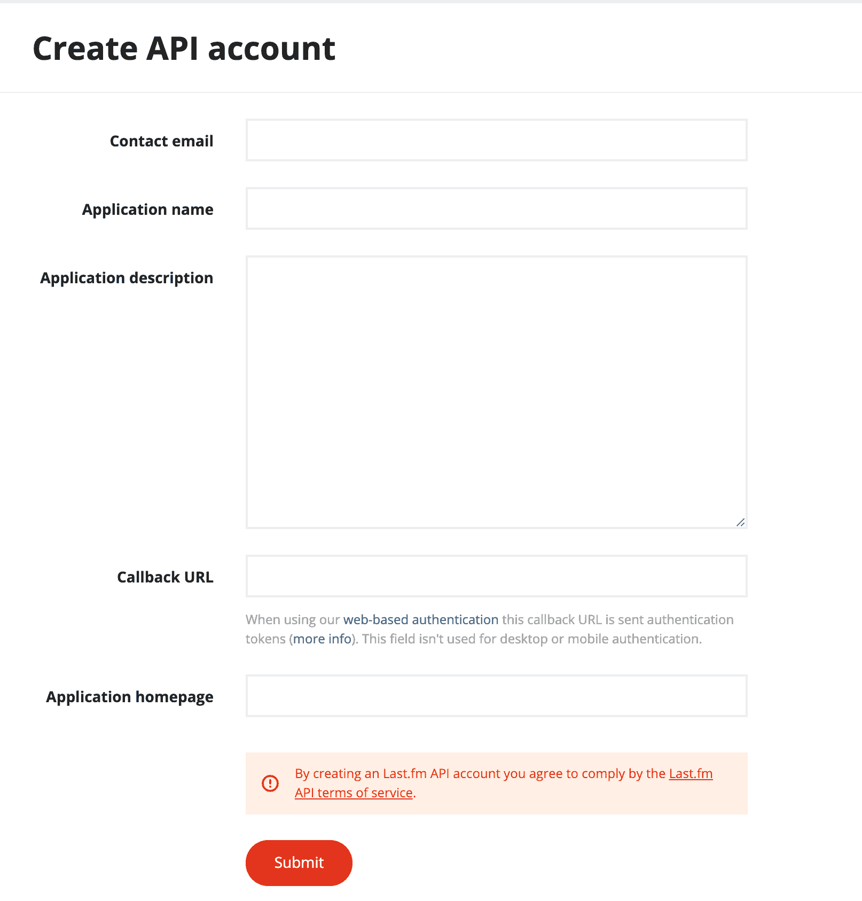
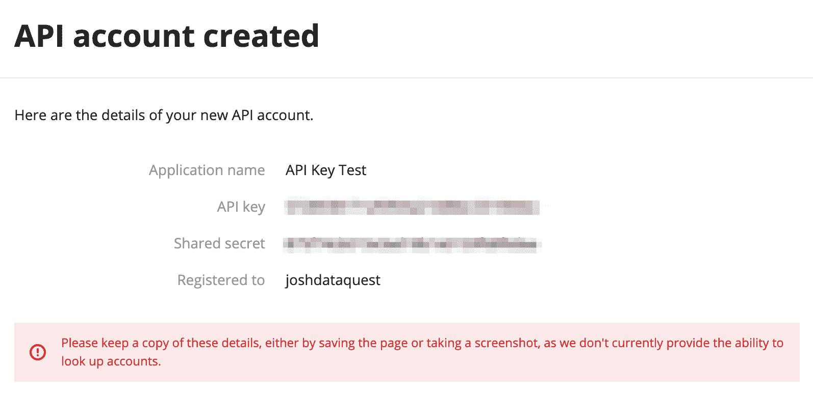

# 教程:使用 Python 通过 Last.fm API 获取音乐数据

> 原文：<https://www.dataquest.io/blog/last-fm-api-python/>

October 7, 2019

API 允许我们从服务器请求检索数据。API 在很多方面都很有用，但其中之一是能够为数据科学项目创建唯一的数据集。在本教程中，我们将学习一些使用 Last.fm API 的高级技术。

在我们的[初级 Python API 教程](https://www.dataquest.io/blog/python-api-tutorial/)中，我们使用了一个非常适合教授基础知识的简单 API:

*   它有几个容易理解的端点。
*   因为它不需要认证，所以我们不必担心如何告诉 API 我们有 perlesson 来使用它。
*   每个端点响应的数据都很小，并且具有易于理解的结构。

实际上，大多数 API 比这更复杂，所以要使用它们，您需要理解一些更高级的概念。具体来说，我们将学习:

*   如何用 API 密钥认证自己？
*   如何使用速率限制和其他技术在 API 的指导下工作。
*   如何使用分页处理大型响应？

本教程假设您了解 Python 中使用 API 的基础知识。如果没有，我们推荐我们的[初学者 API 教程](https://www.dataquest.io/blog/python-api-tutorial/)开始。我们还假设您对 Python 和熊猫有一定的了解。如果你没有，你可以开始免费学习我们的 [Python 基础课程](https://www.dataquest.io/course/python-for-data-science-fundamentals/)。

## 使用 Last.fm API

我们将使用 [Last.fm](https://www.last.fm) API。Last.fm 是一项音乐服务，它通过连接到 iTunes、Spotify 和其他类似的音乐流媒体应用程序来建立个人档案，并跟踪你所听的音乐。

他们提供对 API 的免费访问，以便音乐服务可以向他们发送数据，但也提供总结 Last.fm 关于各种艺术家、歌曲和流派的所有数据的端点。我们将使用他们的 API 建立一个流行艺术家的数据集。

## 遵循 API 指南

使用 API 时，遵循它们的指导方针很重要。如果您不这样做，您可能会被禁止使用该 API。除此之外，特别是当公司免费提供 API 时，尊重他们的局限性和指导方针是很好的，因为他们免费提供了一些东西。

查看 API 文档中的[介绍页面，我们可以注意到一些重要的指导原则:](https://www.last.fm/api/intro)

> 请在所有请求中使用可识别的用户代理标题。这有助于我们的记录，并减少你被禁止的风险。

当向 last.fm API 发出请求时，可以使用**头**来标识自己。Last.fm 希望我们在标题中指定一个**用户代理**，这样他们就知道我们是谁了。当我们一会儿提出第一个请求时，我们会学习如何去做。

> 在决定打多少个电话时，运用常识。例如，如果您正在开发一个 web 应用程序，尽量不要在页面加载时使用 API。如果您的应用程序每秒钟连续进行几次调用，您的帐户可能会被暂停。

为了构建数据集，我们需要向 Last.fm API 发出数千个请求。虽然他们没有在文档中提供具体的限制，但他们建议我们不应该每秒钟*连续*打很多电话。在本教程中，我们将学习一些限制**速率**的策略，或者确保我们不会过多地攻击他们的 API，这样我们就可以避免被禁止。

在我们发出第一个请求之前，我们需要学习如何使用 Last.fm API 进行认证

## 使用 API 密钥认证

大多数 API 都要求你验证自己，这样他们就知道你有足够的时间来使用它们。最常见的认证形式之一是使用一个 **API 密钥**，它就像是使用他们的 API 的密码。如果在发出请求时没有提供 API 键，将会得到一个错误。

使用 API 密钥的过程如下:

1.  您向 API 的提供商创建一个帐户。
2.  您请求一个 API 键，它通常是一个像`54686973206973206d7920415049204b6579`这样的长字符串。
3.  你把你的 API 密匙记录在某个安全的地方，就像一个密码保管员。如果有人得到了你的 API 密匙，他们就可以用 API 冒充你。
4.  每次发出请求时，您都需要提供 API 密钥来验证自己的身份。

要获得 Last.fm 的 API 密钥，首先需要[创建一个账户](https://secure.last.fm/login?next=/api/account/create)。创建帐户后，您应该看到以下表格:



在每个字段中填写您计划如何使用 API 的信息。您可以将“回调 URL”字段留空，因为这仅在您构建 web 应用程序以作为特定 Last.fm 用户进行身份验证时使用。

提交表单后，您将获得 API 密钥和共享密钥的详细信息:



请将它们记在安全的地方——在本教程中，我们不需要使用共享秘密，但最好将它记下来，以防您想要做一些需要您作为特定用户进行身份验证的事情。

## 制作我们的第一个 API 请求

为了创建一个流行艺术家的数据集，我们将使用 [`chart.getTopArtists`端点](https://www.last.fm/api/show/chart.getTopArtists)。

查看 Last.fm API 文档，我们可以观察到一些情况:

*   看起来只有一个真正的端点，每个“端点”实际上都是使用`method`参数指定的。
*   文档说*这个服务不需要认证*。虽然这乍一看可能有点令人困惑，但它告诉我们的是，我们不需要作为特定的 Last.fm 用户进行身份验证。如果你看上面，你会发现我们*确实*需要提供我们的 API 密匙。
*   API 可以以多种格式返回结果——我们将指定 JSON，这样我们就可以利用我们已经知道的使用 Python 中的 API 的知识

在我们开始之前，请记住，我们需要提供一个用户代理头，以便在发出请求时标识我们自己。对于 Python 请求库，我们使用 [`headers`参数](https://requests.readthedocs.io/en/master/user/quickstart/#custom-headers)和如下所示的头字典来指定头:

```py
headers = {
    'user-agent': 'Dataquest'
}

r = requests.get('https://my-api-url', headers=headers)

```

我们将从定义 API 键和用户代理开始(本教程中显示的 API 键不是真正的 API 键！)

```py
API_KEY = '54686973206973206d7920415049204b6579'
USER_AGENT = 'Dataquest'
```

接下来，我们将导入请求库，为我们的头和参数创建一个字典，并发出我们的第一个请求！

```py
import requests

headers = {
    'user-agent': USER_AGENT
}

payload = {
    'api_key': API_KEY,
    'method': 'chart.gettopartists',
    'format': 'json'
}

r = requests.get('https://ws.audioscrobbler.com/2.0/', headers=headers, params=payload)
r.status_code
```

```py
200
```

我们的请求返回了状态代码“200”，所以我们知道它是成功的。

在我们查看我们的请求返回的数据之前，让我们考虑一下在本教程中我们将发出许多请求的事实。在这些请求中，许多功能都是相同的:

*   我们将使用相同的 URL
*   我们将使用相同的 API 键
*   我们将指定 JSON 作为我们的格式。
*   我们将使用相同的标题。

为了节省时间，我们将创建一个函数来完成大量的工作。我们将为该函数提供一个有效载荷字典，然后我们将向该字典添加额外的键，并将其与我们的其他选项一起传递以发出请求。

让我们看看这个函数是什么样子的:

```py
def lastfm_get(payload):
    # define headers and URL
    headers = {'user-agent': USER_AGENT}
    url = 'https://ws.audioscrobbler.com/2.0/'

    # Add API key and format to the payload
    payload['api_key'] = API_KEY
    payload['format'] = 'json'

    response = requests.get(url, headers=headers, params=payload)
    return response
```

让我们看看它简化了我们之前的请求:

```py
r = lastfm_get({
    'method': 'chart.gettopartists'
})

r.status_code
```

```py
200
```

正如我们在[初级 Python API 教程](https://www.dataquest.io/blog/python-api-tutorial/)中了解到的，大多数 API 以 JSON 格式返回数据，我们可以使用 Python [`json`模块](https://docs.python.org/3/library/json.html)以更容易理解的格式打印 JSON 数据。

让我们重新使用我们在该教程中创建的`jprint()`函数，并从 API 中打印我们的响应:

```py
import json

def jprint(obj):
    # create a formatted string of the Python JSON object
    text = json.dumps(obj, sort_keys=True, indent=4)
    print(text)

jprint(r.json())
```

```py
{
    "artists": {
        "@attr": {
            "page": "1",
            "perPage": "50",
            "total": "2901036",
            "totalPages": "58021"
        },
        "artist": [
            {
                "image": [
                    {
                        "#text": "https://lastfm-img2.akamaized.net/i/u/34s/2a96cbd8b46e442fc41c2b86b821562f.png",
                        "size": "small"
                    },
                    {
                        "#text": "https://lastfm-img2.akamaized.net/i/u/64s/2a96cbd8b46e442fc41c2b86b821562f.png",
                        "size": "medium"
                    },
                    {
                        "#text": "https://lastfm-img2.akamaized.net/i/u/174s/2a96cbd8b46e442fc41c2b86b821562f.png",
                        "size": "large"
                    },
                    {
                        "#text": "https://lastfm-img2.akamaized.net/i/u/300x300/2a96cbd8b46e442fc41c2b86b821562f.png",
                        "size": "extralarge"
                    },
                    {
                        "#text": "https://lastfm-img2.akamaized.net/i/u/300x300/2a96cbd8b46e442fc41c2b86b821562f.png",
                        "size": "mega"
                    }
                ],
                "listeners": "1957174",
                "mbid": "b7539c32-53e7-4908-bda3-81449c367da6",
                "name": "Lana Del Rey",
                "playcount": "232808939",
                "streamable": "0",
                "url": "https://www.last.fm/music/Lana+Del+Rey"
            },
            {
                "image": [
                    {
                        "#text": "https://lastfm-img2.akamaized.net/i/u/34s/2a96cbd8b46e442fc41c2b86b821562f.png",
                        "size": "small"
                    },
                    {
                        "#text": "https://lastfm-img2.akamaized.net/i/u/64s/2a96cbd8b46e442fc41c2b86b821562f.png",
                        "size": "medium"
                    },
                    {
                        "#text": "https://lastfm-img2.akamaized.net/i/u/174s/2a96cbd8b46e442fc41c2b86b821562f.png",
                        "size": "large"
                    },
                    {
                        "#text": "https://lastfm-img2.akamaized.net/i/u/300x300/2a96cbd8b46e442fc41c2b86b821562f.png",
                        "size": "extralarge"
                    },
                    {
                        "#text": "https://lastfm-img2.akamaized.net/i/u/300x300/2a96cbd8b46e442fc41c2b86b821562f.png",
                        "size": "mega"
                    }
                ],
                "listeners": "588883",
                "mbid": "",
                "name": "Billie Eilish",
                "playcount": "35520548",
                "streamable": "0",
                "url": "https://www.last.fm/music/Billie+Eilish"
            },
            {
                "image": [
                    {
                        "#text": "https://lastfm-img2.akamaized.net/i/u/34s/2a96cbd8b46e442fc41c2b86b821562f.png",
                        "size": "small"
                    },
                    {
                        "#text": "https://lastfm-img2.akamaized.net/i/u/64s/2a96cbd8b46e442fc41c2b86b821562f.png",
                        "size": "medium"
                    },
                    {
                        "#text": "https://lastfm-img2.akamaized.net/i/u/174s/2a96cbd8b46e442fc41c2b86b821562f.png",
                        "size": "large"
                    },
                    {
                        "#text": "https://lastfm-img2.akamaized.net/i/u/300x300/2a96cbd8b46e442fc41c2b86b821562f.png",
                        "size": "extralarge"
                    },
                    {
                        "#text": "https://lastfm-img2.akamaized.net/i/u/300x300/2a96cbd8b46e442fc41c2b86b821562f.png",
                        "size": "mega"
                    }
                ],
                "listeners": "655052",
                "mbid": "",
                "name": "Post Malone",
                "playcount": "34942708",
                "streamable": "0",
                "url": "https://www.last.fm/music/Post+Malone"
            },
            {
                "image": [
                    {
                        "#text": "https://lastfm-img2.akamaized.net/i/u/34s/2a96cbd8b46e442fc41c2b86b821562f.png",
                        "size": "small"
                    },
                    {
                        "#text": "https://lastfm-img2.akamaized.net/i/u/64s/2a96cbd8b46e442fc41c2b86b821562f.png",
                        "size": "medium"
                    },
                    {
                        "#text": "https://lastfm-img2.akamaized.net/i/u/174s/2a96cbd8b46e442fc41c2b86b821562f.png",
                        "size": "large"
                    },
                    {
                        "#text": "https://lastfm-img2.akamaized.net/i/u/300x300/2a96cbd8b46e442fc41c2b86b821562f.png",
                        "size": "extralarge"
                    },
                    {
                        "#text": "https://lastfm-img2.akamaized.net/i/u/300x300/2a96cbd8b46e442fc41c2b86b821562f.png",
                        "size": "mega"
                    }
                ],
                "listeners": "2290993",
                "mbid": "20244d07-534f-4eff-b4d4-930878889970",
                "name": "Taylor Swift",
                "playcount": "196907702",
                "streamable": "0",
                "url": "https://www.last.fm/music/Taylor+Swift"
            },
            {
                "image": [
                    {
                        "#text": "https://lastfm-img2.akamaized.net/i/u/34s/2a96cbd8b46e442fc41c2b86b821562f.png",
                        "size": "small"
                    },
                    {
                        "#text": "https://lastfm-img2.akamaized.net/i/u/64s/2a96cbd8b46e442fc41c2b86b821562f.png",
                        "size": "medium"
                    },
                    {
                        "#text": "https://lastfm-img2.akamaized.net/i/u/174s/2a96cbd8b46e442fc41c2b86b821562f.png",
                        "size": "large"
                    },
                    {
                        "#text": "https://lastfm-img2.akamaized.net/i/u/300x300/2a96cbd8b46e442fc41c2b86b821562f.png",
                        "size": "extralarge"
                    },
                    {
                        "#text": "https://lastfm-img2.akamaized.net/i/u/300x300/2a96cbd8b46e442fc41c2b86b821562f.png",
                        "size": "mega"
                    }
                ],
                "listeners": "1166180",
                "mbid": "f4fdbb4c-e4b7-47a0-b83b-d91bbfcfa387",
                "name": "Ariana Grande",
                "playcount": "124251766",
                "streamable": "0",
                "url": "https://www.last.fm/music/Ariana+Grande"
            },
            {
                "image": [
                    {
                        "#text": "https://lastfm-img2.akamaized.net/i/u/34s/2a96cbd8b46e442fc41c2b86b821562f.png",
                        "size": "small"
                    },
                    {
                        "#text": "https://lastfm-img2.akamaized.net/i/u/64s/2a96cbd8b46e442fc41c2b86b821562f.png",
                        "size": "medium"
                    },
                    {
                        "#text": "https://lastfm-img2.akamaized.net/i/u/174s/2a96cbd8b46e442fc41c2b86b821562f.png",
                        "size": "large"
                    },
                    {
                        "#text": "https://lastfm-img2.akamaized.net/i/u/300x300/2a96cbd8b46e442fc41c2b86b821562f.png",
                        "size": "extralarge"
                    },
                    {
                        "#text": "https://lastfm-img2.akamaized.net/i/u/300x300/2a96cbd8b46e442fc41c2b86b821562f.png",
                        "size": "mega"
                    }
                ],
                "listeners": "1716587",
                "mbid": "b8a7c51f-362c-4dcb-a259-bc6e0095f0a6",
                "name": "Ed Sheeran",
                "playcount": "92646726",
                "streamable": "0",
                "url": "https://www.last.fm/music/Ed+Sheeran"
            },
            {
                "image": [
                    {
                        "#text": "https://lastfm-img2.akamaized.net/i/u/34s/2a96cbd8b46e442fc41c2b86b821562f.png",
                        "size": "small"
                    },
                    {
                        "#text": "https://lastfm-img2.akamaized.net/i/u/64s/2a96cbd8b46e442fc41c2b86b821562f.png",
                        "size": "medium"
                    },
                    {
                        "#text": "https://lastfm-img2.akamaized.net/i/u/174s/2a96cbd8b46e442fc41c2b86b821562f.png",
                        "size": "large"
                    },
                    {
                        "#text": "https://lastfm-img2.akamaized.net/i/u/300x300/2a96cbd8b46e442fc41c2b86b821562f.png",
                        "size": "extralarge"
                    },
                    {
                        "#text": "https://lastfm-img2.akamaized.net/i/u/300x300/2a96cbd8b46e442fc41c2b86b821562f.png",
                        "size": "mega"
                    }
                ],
                "listeners": "4084524",
                "mbid": "420ca290-76c5-41af-999e-564d7c71f1a7",
                "name": "Queen",
                "playcount": "197850122",
                "streamable": "0",
                "url": "https://www.last.fm/music/Queen"
            },
            {
                "image": [
                    {
                        "#text": "https://lastfm-img2.akamaized.net/i/u/34s/2a96cbd8b46e442fc41c2b86b821562f.png",
                        "size": "small"
                    },
                    {
                        "#text": "https://lastfm-img2.akamaized.net/i/u/64s/2a96cbd8b46e442fc41c2b86b821562f.png",
                        "size": "medium"
                    },
                    {
                        "#text": "https://lastfm-img2.akamaized.net/i/u/174s/2a96cbd8b46e442fc41c2b86b821562f.png",
                        "size": "large"
                    },
                    {
                        "#text": "https://lastfm-img2.akamaized.net/i/u/300x300/2a96cbd8b46e442fc41c2b86b821562f.png",
                        "size": "extralarge"
                    },
                    {
                        "#text": "https://lastfm-img2.akamaized.net/i/u/300x300/2a96cbd8b46e442fc41c2b86b821562f.png",
                        "size": "mega"
                    }
                ],
                "listeners": "4449534",
                "mbid": "164f0d73-1234-4e2c-8743-d77bf2191051",
                "name": "Kanye West",
                "playcount": "250533444",
                "streamable": "0",
                "url": "https://www.last.fm/music/Kanye+West"
            },
            {
                "image": [
                    {
                        "#text": "https://lastfm-img2.akamaized.net/i/u/34s/2a96cbd8b46e442fc41c2b86b821562f.png",
                        "size": "small"
                    },
                    {
                        "#text": "https://lastfm-img2.akamaized.net/i/u/64s/2a96cbd8b46e442fc41c2b86b821562f.png",
                        "size": "medium"
                    },
                    {
                        "#text": "https://lastfm-img2.akamaized.net/i/u/174s/2a96cbd8b46e442fc41c2b86b821562f.png",
                        "size": "large"
                    },
                    {
                        "#text": "https://lastfm-img2.akamaized.net/i/u/300x300/2a96cbd8b46e442fc41c2b86b821562f.png",
                        "size": "extralarge"
                    },
                    {
                        "#text": "https://lastfm-img2.akamaized.net/i/u/300x300/2a96cbd8b46e442fc41c2b86b821562f.png",
                        "size": "mega"
                    }
                ],
                "listeners": "3732023",
                "mbid": "b10bbbfc-cf9e-42e0-be17-e2c3e1d2600d",
                "name": "The Beatles",
                "playcount": "526866107",
                "streamable": "0",
                "url": "https://www.last.fm/music/The+Beatles"
            },
            {
                "image": [
                    {
                        "#text": "https://lastfm-img2.akamaized.net/i/u/34s/2a96cbd8b46e442fc41c2b86b821562f.png",
                        "size": "small"
                    },
                    {
                        "#text": "https://lastfm-img2.akamaized.net/i/u/64s/2a96cbd8b46e442fc41c2b86b821562f.png",
                        "size": "medium"
                    },
                    {
                        "#text": "https://lastfm-img2.akamaized.net/i/u/174s/2a96cbd8b46e442fc41c2b86b821562f.png",
                        "size": "large"
                    },
                    {
                        "#text": "https://lastfm-img2.akamaized.net/i/u/300x300/2a96cbd8b46e442fc41c2b86b821562f.png",
                        "size": "extralarge"
                    },
                    {
                        "#text": "https://lastfm-img2.akamaized.net/i/u/300x300/2a96cbd8b46e442fc41c2b86b821562f.png",
                        "size": "mega"
                    }
                ],
                "listeners": "3441963",
                "mbid": "b49b81cc-d5b7-4bdd-aadb-385df8de69a6",
                "name": "Drake",
                "playcount": "147881092",
                "streamable": "0",
                "url": "https://www.last.fm/music/Drake"
            },
            {
                "image": [
                    {
                        "#text": "https://lastfm-img2.akamaized.net/i/u/34s/2a96cbd8b46e442fc41c2b86b821562f.png",
                        "size": "small"
                    },
                    {
                        "#text": "https://lastfm-img2.akamaized.net/i/u/64s/2a96cbd8b46e442fc41c2b86b821562f.png",
                        "size": "medium"
                    },
                    {
                        "#text": "https://lastfm-img2.akamaized.net/i/u/174s/2a96cbd8b46e442fc41c2b86b821562f.png",
                        "size": "large"
                    },
                    {
                        "#text": "https://lastfm-img2.akamaized.net/i/u/300x300/2a96cbd8b46e442fc41c2b86b821562f.png",
                        "size": "extralarge"
                    },
                    {
                        "#text": "https://lastfm-img2.akamaized.net/i/u/300x300/2a96cbd8b46e442fc41c2b86b821562f.png",
                        "size": "mega"
                    }
                ],
                "listeners": "4778856",
                "mbid": "a74b1b7f-71a5-4011-9441-d0b5e4122711",
                "name": "Radiohead",
                "playcount": "507682999",
                "streamable": "0",
                "url": "https://www.last.fm/music/Radiohead"
            },
            {
                "image": [
                    {
                        "#text": "https://lastfm-img2.akamaized.net/i/u/34s/2a96cbd8b46e442fc41c2b86b821562f.png",
                        "size": "small"
                    },
                    {
                        "#text": "https://lastfm-img2.akamaized.net/i/u/64s/2a96cbd8b46e442fc41c2b86b821562f.png",
                        "size": "medium"
                    },
                    {
                        "#text": "https://lastfm-img2.akamaized.net/i/u/174s/2a96cbd8b46e442fc41c2b86b821562f.png",
                        "size": "large"
                    },
                    {
                        "#text": "https://lastfm-img2.akamaized.net/i/u/300x300/2a96cbd8b46e442fc41c2b86b821562f.png",
                        "size": "extralarge"
                    },
                    {
                        "#text": "https://lastfm-img2.akamaized.net/i/u/300x300/2a96cbd8b46e442fc41c2b86b821562f.png",
                        "size": "mega"
                    }
                ],
                "listeners": "1528378",
                "mbid": "381086ea-f511-4aba-bdf9-71c753dc5077",
                "name": "Kendrick Lamar",
                "playcount": "109541321",
                "streamable": "0",
                "url": "https://www.last.fm/music/Kendrick+Lamar"
            },
            {
                "image": [
                    {
                        "#text": "https://lastfm-img2.akamaized.net/i/u/34s/2a96cbd8b46e442fc41c2b86b821562f.png",
                        "size": "small"
                    },
                    {
                        "#text": "https://lastfm-img2.akamaized.net/i/u/64s/2a96cbd8b46e442fc41c2b86b821562f.png",
                        "size": "medium"
                    },
                    {
                        "#text": "https://lastfm-img2.akamaized.net/i/u/174s/2a96cbd8b46e442fc41c2b86b821562f.png",
                        "size": "large"
                    },
                    {
                        "#text": "https://lastfm-img2.akamaized.net/i/u/300x300/2a96cbd8b46e442fc41c2b86b821562f.png",
                        "size": "extralarge"
                    },
                    {
                        "#text": "https://lastfm-img2.akamaized.net/i/u/300x300/2a96cbd8b46e442fc41c2b86b821562f.png",
                        "size": "mega"
                    }
                ],
                "listeners": "4618838",
                "mbid": "db36a76f-4cdf-43ac-8cd0-5e48092d2bae",
                "name": "Rihanna",
                "playcount": "204114198",
                "streamable": "0",
                "url": "https://www.last.fm/music/Rihanna"
            },
            {
                "image": [
                    {
                        "#text": "https://lastfm-img2.akamaized.net/i/u/34s/2a96cbd8b46e442fc41c2b86b821562f.png",
                        "size": "small"
                    },
                    {
                        "#text": "https://lastfm-img2.akamaized.net/i/u/64s/2a96cbd8b46e442fc41c2b86b821562f.png",
                        "size": "medium"
                    },
                    {
                        "#text": "https://lastfm-img2.akamaized.net/i/u/174s/2a96cbd8b46e442fc41c2b86b821562f.png",
                        "size": "large"
                    },
                    {
                        "#text": "https://lastfm-img2.akamaized.net/i/u/300x300/2a96cbd8b46e442fc41c2b86b821562f.png",
                        "size": "extralarge"
                    },
                    {
                        "#text": "https://lastfm-img2.akamaized.net/i/u/300x300/2a96cbd8b46e442fc41c2b86b821562f.png",
                        "size": "mega"
                    }
                ],
                "listeners": "3550620",
                "mbid": "ada7a83c-e3e1-40f1-93f9-3e73dbc9298a",
                "name": "Arctic Monkeys",
                "playcount": "339370140",
                "streamable": "0",
                "url": "https://www.last.fm/music/Arctic+Monkeys"
            },
            {
                "image": [
                    {
                        "#text": "https://lastfm-img2.akamaized.net/i/u/34s/2a96cbd8b46e442fc41c2b86b821562f.png",
                        "size": "small"
                    },
                    {
                        "#text": "https://lastfm-img2.akamaized.net/i/u/64s/2a96cbd8b46e442fc41c2b86b821562f.png",
                        "size": "medium"
                    },
                    {
                        "#text": "https://lastfm-img2.akamaized.net/i/u/174s/2a96cbd8b46e442fc41c2b86b821562f.png",
                        "size": "large"
                    },
                    {
                        "#text": "https://lastfm-img2.akamaized.net/i/u/300x300/2a96cbd8b46e442fc41c2b86b821562f.png",
                        "size": "extralarge"
                    },
                    {
                        "#text": "https://lastfm-img2.akamaized.net/i/u/300x300/2a96cbd8b46e442fc41c2b86b821562f.png",
                        "size": "mega"
                    }
                ],
                "listeners": "3401872",
                "mbid": "5441c29d-3602-4898-b1a1-b77fa23b8e50",
                "name": "David Bowie",
                "playcount": "197606611",
                "streamable": "0",
                "url": "https://www.last.fm/music/David+Bowie"
            },
            {
                "image": [
                    {
                        "#text": "https://lastfm-img2.akamaized.net/i/u/34s/2a96cbd8b46e442fc41c2b86b821562f.png",
                        "size": "small"
                    },
                    {
                        "#text": "https://lastfm-img2.akamaized.net/i/u/64s/2a96cbd8b46e442fc41c2b86b821562f.png",
                        "size": "medium"
                    },
                    {
                        "#text": "https://lastfm-img2.akamaized.net/i/u/174s/2a96cbd8b46e442fc41c2b86b821562f.png",
                        "size": "large"
                    },
                    {
                        "#text": "https://lastfm-img2.akamaized.net/i/u/300x300/2a96cbd8b46e442fc41c2b86b821562f.png",
                        "size": "extralarge"
                    },
                    {
                        "#text": "https://lastfm-img2.akamaized.net/i/u/300x300/2a96cbd8b46e442fc41c2b86b821562f.png",
                        "size": "mega"
                    }
                ],
                "listeners": "680102",
                "mbid": "b7d92248-97e3-4450-8057-6fe06738f735",
                "name": "Shawn Mendes",
                "playcount": "28807659",
                "streamable": "0",
                "url": "https://www.last.fm/music/Shawn+Mendes"
            },
            {
                "image": [
                    {
                        "#text": "https://lastfm-img2.akamaized.net/i/u/34s/2a96cbd8b46e442fc41c2b86b821562f.png",
                        "size": "small"
                    },
                    {
                        "#text": "https://lastfm-img2.akamaized.net/i/u/64s/2a96cbd8b46e442fc41c2b86b821562f.png",
                        "size": "medium"
                    },
                    {
                        "#text": "https://lastfm-img2.akamaized.net/i/u/174s/2a96cbd8b46e442fc41c2b86b821562f.png",
                        "size": "large"
                    },
                    {
                        "#text": "https://lastfm-img2.akamaized.net/i/u/300x300/2a96cbd8b46e442fc41c2b86b821562f.png",
                        "size": "extralarge"
                    },
                    {
                        "#text": "https://lastfm-img2.akamaized.net/i/u/300x300/2a96cbd8b46e442fc41c2b86b821562f.png",
                        "size": "mega"
                    }
                ],
                "listeners": "2093863",
                "mbid": "7e9bd05a-117f-4cce-87bc-e011527a8b18",
                "name": "Miley Cyrus",
                "playcount": "70227591",
                "streamable": "0",
                "url": "https://www.last.fm/music/Miley+Cyrus"
            },
            {
                "image": [
                    {
                        "#text": "https://lastfm-img2.akamaized.net/i/u/34s/2a96cbd8b46e442fc41c2b86b821562f.png",
                        "size": "small"
                    },
                    {
                        "#text": "https://lastfm-img2.akamaized.net/i/u/64s/2a96cbd8b46e442fc41c2b86b821562f.png",
                        "size": "medium"
                    },
                    {
                        "#text": "https://lastfm-img2.akamaized.net/i/u/174s/2a96cbd8b46e442fc41c2b86b821562f.png",
                        "size": "large"
                    },
                    {
                        "#text": "https://lastfm-img2.akamaized.net/i/u/300x300/2a96cbd8b46e442fc41c2b86b821562f.png",
                        "size": "extralarge"
                    },
                    {
                        "#text": "https://lastfm-img2.akamaized.net/i/u/300x300/2a96cbd8b46e442fc41c2b86b821562f.png",
                        "size": "mega"
                    }
                ],
                "listeners": "3631084",
                "mbid": "859d0860-d480-4efd-970c-c05d5f1776b8",
                "name": "Beyonc\u00e9",
                "playcount": "165422358",
                "streamable": "0",
                "url": "https://www.last.fm/music/Beyonc%C3%A9"
            },
            {
                "image": [
                    {
                        "#text": "https://lastfm-img2.akamaized.net/i/u/34s/2a96cbd8b46e442fc41c2b86b821562f.png",
                        "size": "small"
                    },
                    {
                        "#text": "https://lastfm-img2.akamaized.net/i/u/64s/2a96cbd8b46e442fc41c2b86b821562f.png",
                        "size": "medium"
                    },
                    {
                        "#text": "https://lastfm-img2.akamaized.net/i/u/174s/2a96cbd8b46e442fc41c2b86b821562f.png",
                        "size": "large"
                    },
                    {
                        "#text": "https://lastfm-img2.akamaized.net/i/u/300x300/2a96cbd8b46e442fc41c2b86b821562f.png",
                        "size": "extralarge"
                    },
                    {
                        "#text": "https://lastfm-img2.akamaized.net/i/u/300x300/2a96cbd8b46e442fc41c2b86b821562f.png",
                        "size": "mega"
                    }
                ],
                "listeners": "314392",
                "mbid": "",
                "name": "Lil Nas X",
                "playcount": "6086745",
                "streamable": "0",
                "url": "https://www.last.fm/music/Lil+Nas+X"
            },
            {
                "image": [
                    {
                        "#text": "https://lastfm-img2.akamaized.net/i/u/34s/2a96cbd8b46e442fc41c2b86b821562f.png",
                        "size": "small"
                    },
                    {
                        "#text": "https://lastfm-img2.akamaized.net/i/u/64s/2a96cbd8b46e442fc41c2b86b821562f.png",
                        "size": "medium"
                    },
                    {
                        "#text": "https://lastfm-img2.akamaized.net/i/u/174s/2a96cbd8b46e442fc41c2b86b821562f.png",
                        "size": "large"
                    },
                    {
                        "#text": "https://lastfm-img2.akamaized.net/i/u/300x300/2a96cbd8b46e442fc41c2b86b821562f.png",
                        "size": "extralarge"
                    },
                    {
                        "#text": "https://lastfm-img2.akamaized.net/i/u/300x300/2a96cbd8b46e442fc41c2b86b821562f.png",
                        "size": "mega"
                    }
                ],
                "listeners": "3800669",
                "mbid": "122d63fc-8671-43e4-9752-34e846d62a9c",
                "name": "Katy Perry",
                "playcount": "151925781",
                "streamable": "0",
                "url": "https://www.last.fm/music/Katy+Perry"
            },
            {
                "image": [
                    {
                        "#text": "https://lastfm-img2.akamaized.net/i/u/34s/2a96cbd8b46e442fc41c2b86b821562f.png",
                        "size": "small"
                    },
                    {
                        "#text": "https://lastfm-img2.akamaized.net/i/u/64s/2a96cbd8b46e442fc41c2b86b821562f.png",
                        "size": "medium"
                    },
                    {
                        "#text": "https://lastfm-img2.akamaized.net/i/u/174s/2a96cbd8b46e442fc41c2b86b821562f.png",
                        "size": "large"
                    },
                    {
                        "#text": "https://lastfm-img2.akamaized.net/i/u/300x300/2a96cbd8b46e442fc41c2b86b821562f.png",
                        "size": "extralarge"
                    },
                    {
                        "#text": "https://lastfm-img2.akamaized.net/i/u/300x300/2a96cbd8b46e442fc41c2b86b821562f.png",
                        "size": "mega"
                    }
                ],
                "listeners": "1184440",
                "mbid": "63aa26c3-d59b-4da4-84ac-716b54f1ef4d",
                "name": "Tame Impala",
                "playcount": "78074910",
                "streamable": "0",
                "url": "https://www.last.fm/music/Tame+Impala"
            },
            {
                "image": [
                    {
                        "#text": "https://lastfm-img2.akamaized.net/i/u/34s/2a96cbd8b46e442fc41c2b86b821562f.png",
                        "size": "small"
                    },
                    {
                        "#text": "https://lastfm-img2.akamaized.net/i/u/64s/2a96cbd8b46e442fc41c2b86b821562f.png",
                        "size": "medium"
                    },
                    {
                        "#text": "https://lastfm-img2.akamaized.net/i/u/174s/2a96cbd8b46e442fc41c2b86b821562f.png",
                        "size": "large"
                    },
                    {
                        "#text": "https://lastfm-img2.akamaized.net/i/u/300x300/2a96cbd8b46e442fc41c2b86b821562f.png",
                        "size": "extralarge"
                    },
                    {
                        "#text": "https://lastfm-img2.akamaized.net/i/u/300x300/2a96cbd8b46e442fc41c2b86b821562f.png",
                        "size": "mega"
                    }
                ],
                "listeners": "3877144",
                "mbid": "650e7db6-b795-4eb5-a702-5ea2fc46c848",
                "name": "Lady Gaga",
                "playcount": "292105109",
                "streamable": "0",
                "url": "https://www.last.fm/music/Lady+Gaga"
            },
            {
                "image": [
                    {
                        "#text": "https://lastfm-img2.akamaized.net/i/u/34s/2a96cbd8b46e442fc41c2b86b821562f.png",
                        "size": "small"
                    },
                    {
                        "#text": "https://lastfm-img2.akamaized.net/i/u/64s/2a96cbd8b46e442fc41c2b86b821562f.png",
                        "size": "medium"
                    },
                    {
                        "#text": "https://lastfm-img2.akamaized.net/i/u/174s/2a96cbd8b46e442fc41c2b86b821562f.png",
                        "size": "large"
                    },
                    {
                        "#text": "https://lastfm-img2.akamaized.net/i/u/300x300/2a96cbd8b46e442fc41c2b86b821562f.png",
                        "size": "extralarge"
                    },
                    {
                        "#text": "https://lastfm-img2.akamaized.net/i/u/300x300/2a96cbd8b46e442fc41c2b86b821562f.png",
                        "size": "mega"
                    }
                ],
                "listeners": "840762",
                "mbid": "f6beac20-5dfe-4d1f-ae02-0b0a740aafd6",
                "name": "Tyler, the Creator",
                "playcount": "56318705",
                "streamable": "0",
                "url": "https://www.last.fm/music/Tyler,+the+Creator"
            },
            {
                "image": [
                    {
                        "#text": "https://lastfm-img2.akamaized.net/i/u/34s/2a96cbd8b46e442fc41c2b86b821562f.png",
                        "size": "small"
                    },
                    {
                        "#text": "https://lastfm-img2.akamaized.net/i/u/64s/2a96cbd8b46e442fc41c2b86b821562f.png",
                        "size": "medium"
                    },
                    {
                        "#text": "https://lastfm-img2.akamaized.net/i/u/174s/2a96cbd8b46e442fc41c2b86b821562f.png",
                        "size": "large"
                    },
                    {
                        "#text": "https://lastfm-img2.akamaized.net/i/u/300x300/2a96cbd8b46e442fc41c2b86b821562f.png",
                        "size": "extralarge"
                    },
                    {
                        "#text": "https://lastfm-img2.akamaized.net/i/u/300x300/2a96cbd8b46e442fc41c2b86b821562f.png",
                        "size": "mega"
                    }
                ],
                "listeners": "5429555",
                "mbid": "cc197bad-dc9c-440d-a5b5-d52ba2e14234",
                "name": "Coldplay",
                "playcount": "364107739",
                "streamable": "0",
                "url": "https://www.last.fm/music/Coldplay"
            },
            {
                "image": [
                    {
                        "#text": "https://lastfm-img2.akamaized.net/i/u/34s/2a96cbd8b46e442fc41c2b86b821562f.png",
                        "size": "small"
                    },
                    {
                        "#text": "https://lastfm-img2.akamaized.net/i/u/64s/2a96cbd8b46e442fc41c2b86b821562f.png",
                        "size": "medium"
                    },
                    {
                        "#text": "https://lastfm-img2.akamaized.net/i/u/174s/2a96cbd8b46e442fc41c2b86b821562f.png",
                        "size": "large"
                    },
                    {
                        "#text": "https://lastfm-img2.akamaized.net/i/u/300x300/2a96cbd8b46e442fc41c2b86b821562f.png",
                        "size": "extralarge"
                    },
                    {
                        "#text": "https://lastfm-img2.akamaized.net/i/u/300x300/2a96cbd8b46e442fc41c2b86b821562f.png",
                        "size": "mega"
                    }
                ],
                "listeners": "4665823",
                "mbid": "8bfac288-ccc5-448d-9573-c33ea2aa5c30",
                "name": "Red Hot Chili Peppers",
                "playcount": "298043491",
                "streamable": "0",
                "url": "https://www.last.fm/music/Red+Hot+Chili+Peppers"
            },
            {
                "image": [
                    {
                        "#text": "https://lastfm-img2.akamaized.net/i/u/34s/2a96cbd8b46e442fc41c2b86b821562f.png",
                        "size": "small"
                    },
                    {
                        "#text": "https://lastfm-img2.akamaized.net/i/u/64s/2a96cbd8b46e442fc41c2b86b821562f.png",
                        "size": "medium"
                    },
                    {
                        "#text": "https://lastfm-img2.akamaized.net/i/u/174s/2a96cbd8b46e442fc41c2b86b821562f.png",
                        "size": "large"
                    },
                    {
                        "#text": "https://lastfm-img2.akamaized.net/i/u/300x300/2a96cbd8b46e442fc41c2b86b821562f.png",
                        "size": "extralarge"
                    },
                    {
                        "#text": "https://lastfm-img2.akamaized.net/i/u/300x300/2a96cbd8b46e442fc41c2b86b821562f.png",
                        "size": "mega"
                    }
                ],
                "listeners": "269116",
                "mbid": "50d06c43-5392-4393-ba2d-f091d8167227",
                "name": "Lizzo",
                "playcount": "6953283",
                "streamable": "0",
                "url": "https://www.last.fm/music/Lizzo"
            },
            {
                "image": [
                    {
                        "#text": "https://lastfm-img2.akamaized.net/i/u/34s/2a96cbd8b46e442fc41c2b86b821562f.png",
                        "size": "small"
                    },
                    {
                        "#text": "https://lastfm-img2.akamaized.net/i/u/64s/2a96cbd8b46e442fc41c2b86b821562f.png",
                        "size": "medium"
                    },
                    {
                        "#text": "https://lastfm-img2.akamaized.net/i/u/174s/2a96cbd8b46e442fc41c2b86b821562f.png",
                        "size": "large"
                    },
                    {
                        "#text": "https://lastfm-img2.akamaized.net/i/u/300x300/2a96cbd8b46e442fc41c2b86b821562f.png",
                        "size": "extralarge"
                    },
                    {
                        "#text": "https://lastfm-img2.akamaized.net/i/u/300x300/2a96cbd8b46e442fc41c2b86b821562f.png",
                        "size": "mega"
                    }
                ],
                "listeners": "823024",
                "mbid": "260b6184-8828-48eb-945c-bc4cb6fc34ca",
                "name": "Charli XCX",
                "playcount": "34914186",
                "streamable": "0",
                "url": "https://www.last.fm/music/Charli+XCX"
            },
            {
                "image": [
                    {
                        "#text": "https://lastfm-img2.akamaized.net/i/u/34s/2a96cbd8b46e442fc41c2b86b821562f.png",
                        "size": "small"
                    },
                    {
                        "#text": "https://lastfm-img2.akamaized.net/i/u/64s/2a96cbd8b46e442fc41c2b86b821562f.png",
                        "size": "medium"
                    },
                    {
                        "#text": "https://lastfm-img2.akamaized.net/i/u/174s/2a96cbd8b46e442fc41c2b86b821562f.png",
                        "size": "large"
                    },
                    {
                        "#text": "https://lastfm-img2.akamaized.net/i/u/300x300/2a96cbd8b46e442fc41c2b86b821562f.png",
                        "size": "extralarge"
                    },
                    {
                        "#text": "https://lastfm-img2.akamaized.net/i/u/300x300/2a96cbd8b46e442fc41c2b86b821562f.png",
                        "size": "mega"
                    }
                ],
                "listeners": "2246723",
                "mbid": "8dd98bdc-80ec-4e93-8509-2f46bafc09a7",
                "name": "Calvin Harris",
                "playcount": "75778154",
                "streamable": "0",
                "url": "https://www.last.fm/music/Calvin+Harris"
            },
            {
                "image": [
                    {
                        "#text": "https://lastfm-img2.akamaized.net/i/u/34s/2a96cbd8b46e442fc41c2b86b821562f.png",
                        "size": "small"
                    },
                    {
                        "#text": "https://lastfm-img2.akamaized.net/i/u/64s/2a96cbd8b46e442fc41c2b86b821562f.png",
                        "size": "medium"
                    },
                    {
                        "#text": "https://lastfm-img2.akamaized.net/i/u/174s/2a96cbd8b46e442fc41c2b86b821562f.png",
                        "size": "large"
                    },
                    {
                        "#text": "https://lastfm-img2.akamaized.net/i/u/300x300/2a96cbd8b46e442fc41c2b86b821562f.png",
                        "size": "extralarge"
                    },
                    {
                        "#text": "https://lastfm-img2.akamaized.net/i/u/300x300/2a96cbd8b46e442fc41c2b86b821562f.png",
                        "size": "mega"
                    }
                ],
                "listeners": "4320593",
                "mbid": "9282c8b4-ca0b-4c6b-b7e3-4f7762dfc4d6",
                "name": "Nirvana",
                "playcount": "226060468",
                "streamable": "0",
                "url": "https://www.last.fm/music/Nirvana"
            },
            {
                "image": [
                    {
                        "#text": "https://lastfm-img2.akamaized.net/i/u/34s/2a96cbd8b46e442fc41c2b86b821562f.png",
                        "size": "small"
                    },
                    {
                        "#text": "https://lastfm-img2.akamaized.net/i/u/64s/2a96cbd8b46e442fc41c2b86b821562f.png",
                        "size": "medium"
                    },
                    {
                        "#text": "https://lastfm-img2.akamaized.net/i/u/174s/2a96cbd8b46e442fc41c2b86b821562f.png",
                        "size": "large"
                    },
                    {
                        "#text": "https://lastfm-img2.akamaized.net/i/u/300x300/2a96cbd8b46e442fc41c2b86b821562f.png",
                        "size": "extralarge"
                    },
                    {
                        "#text": "https://lastfm-img2.akamaized.net/i/u/300x300/2a96cbd8b46e442fc41c2b86b821562f.png",
                        "size": "mega"
                    }
                ],
                "listeners": "1646166",
                "mbid": "bbfa1e12-8b61-4ed8-bc6e-52d2298f41a2",
                "name": "Tool",
                "playcount": "122824468",
                "streamable": "0",
                "url": "https://www.last.fm/music/Tool"
            },
            {
                "image": [
                    {
                        "#text": "https://lastfm-img2.akamaized.net/i/u/34s/2a96cbd8b46e442fc41c2b86b821562f.png",
                        "size": "small"
                    },
                    {
                        "#text": "https://lastfm-img2.akamaized.net/i/u/64s/2a96cbd8b46e442fc41c2b86b821562f.png",
                        "size": "medium"
                    },
                    {
                        "#text": "https://lastfm-img2.akamaized.net/i/u/174s/2a96cbd8b46e442fc41c2b86b821562f.png",
                        "size": "large"
                    },
                    {
                        "#text": "https://lastfm-img2.akamaized.net/i/u/300x300/2a96cbd8b46e442fc41c2b86b821562f.png",
                        "size": "extralarge"
                    },
                    {
                        "#text": "https://lastfm-img2.akamaized.net/i/u/300x300/2a96cbd8b46e442fc41c2b86b821562f.png",
                        "size": "mega"
                    }
                ],
                "listeners": "1008791",
                "mbid": "5a85c140-dcf9-4dd2-b2c8-aff0471549f3",
                "name": "Sam Smith",
                "playcount": "30910342",
                "streamable": "0",
                "url": "https://www.last.fm/music/Sam+Smith"
            },
            {
                "image": [
                    {
                        "#text": "https://lastfm-img2.akamaized.net/i/u/34s/2a96cbd8b46e442fc41c2b86b821562f.png",
                        "size": "small"
                    },
                    {
                        "#text": "https://lastfm-img2.akamaized.net/i/u/64s/2a96cbd8b46e442fc41c2b86b821562f.png",
                        "size": "medium"
                    },
                    {
                        "#text": "https://lastfm-img2.akamaized.net/i/u/174s/2a96cbd8b46e442fc41c2b86b821562f.png",
                        "size": "large"
                    },
                    {
                        "#text": "https://lastfm-img2.akamaized.net/i/u/300x300/2a96cbd8b46e442fc41c2b86b821562f.png",
                        "size": "extralarge"
                    },
                    {
                        "#text": "https://lastfm-img2.akamaized.net/i/u/300x300/2a96cbd8b46e442fc41c2b86b821562f.png",
                        "size": "mega"
                    }
                ],
                "listeners": "2204118",
                "mbid": "bd13909f-1c29-4c27-a874-d4aaf27c5b1a",
                "name": "Fleetwood Mac",
                "playcount": "70574855",
                "streamable": "0",
                "url": "https://www.last.fm/music/Fleetwood+Mac"
            },
            {
                "image": [
                    {
                        "#text": "https://lastfm-img2.akamaized.net/i/u/34s/2a96cbd8b46e442fc41c2b86b821562f.png",
                        "size": "small"
                    },
                    {
                        "#text": "https://lastfm-img2.akamaized.net/i/u/64s/2a96cbd8b46e442fc41c2b86b821562f.png",
                        "size": "medium"
                    },
                    {
                        "#text": "https://lastfm-img2.akamaized.net/i/u/174s/2a96cbd8b46e442fc41c2b86b821562f.png",
                        "size": "large"
                    },
                    {
                        "#text": "https://lastfm-img2.akamaized.net/i/u/300x300/2a96cbd8b46e442fc41c2b86b821562f.png",
                        "size": "extralarge"
                    },
                    {
                        "#text": "https://lastfm-img2.akamaized.net/i/u/300x300/2a96cbd8b46e442fc41c2b86b821562f.png",
                        "size": "mega"
                    }
                ],
                "listeners": "3125893",
                "mbid": "83d91898-7763-47d7-b03b-b92132375c47",
                "name": "Pink Floyd",
                "playcount": "318740438",
                "streamable": "0",
                "url": "https://www.last.fm/music/Pink+Floyd"
            },
            {
                "image": [
                    {
                        "#text": "https://lastfm-img2.akamaized.net/i/u/34s/2a96cbd8b46e442fc41c2b86b821562f.png",
                        "size": "small"
                    },
                    {
                        "#text": "https://lastfm-img2.akamaized.net/i/u/64s/2a96cbd8b46e442fc41c2b86b821562f.png",
                        "size": "medium"
                    },
                    {
                        "#text": "https://lastfm-img2.akamaized.net/i/u/174s/2a96cbd8b46e442fc41c2b86b821562f.png",
                        "size": "large"
                    },
                    {
                        "#text": "https://lastfm-img2.akamaized.net/i/u/300x300/2a96cbd8b46e442fc41c2b86b821562f.png",
                        "size": "extralarge"
                    },
                    {
                        "#text": "https://lastfm-img2.akamaized.net/i/u/300x300/2a96cbd8b46e442fc41c2b86b821562f.png",
                        "size": "mega"
                    }
                ],
                "listeners": "273449",
                "mbid": "",
                "name": "BROCKHAMPTON",
                "playcount": "36180740",
                "streamable": "0",
                "url": "https://www.last.fm/music/BROCKHAMPTON"
            },
            {
                "image": [
                    {
                        "#text": "https://lastfm-img2.akamaized.net/i/u/34s/2a96cbd8b46e442fc41c2b86b821562f.png",
                        "size": "small"
                    },
                    {
                        "#text": "https://lastfm-img2.akamaized.net/i/u/64s/2a96cbd8b46e442fc41c2b86b821562f.png",
                        "size": "medium"
                    },
                    {
                        "#text": "https://lastfm-img2.akamaized.net/i/u/174s/2a96cbd8b46e442fc41c2b86b821562f.png",
                        "size": "large"
                    },
                    {
                        "#text": "https://lastfm-img2.akamaized.net/i/u/300x300/2a96cbd8b46e442fc41c2b86b821562f.png",
                        "size": "extralarge"
                    },
                    {
                        "#text": "https://lastfm-img2.akamaized.net/i/u/300x300/2a96cbd8b46e442fc41c2b86b821562f.png",
                        "size": "mega"
                    }
                ],
                "listeners": "1326470",
                "mbid": "c8b03190-306c-4120-bb0b-6f2ebfc06ea9",
                "name": "The Weeknd",
                "playcount": "81295303",
                "streamable": "0",
                "url": "https://www.last.fm/music/The+Weeknd"
            },
            {
                "image": [
                    {
                        "#text": "https://lastfm-img2.akamaized.net/i/u/34s/2a96cbd8b46e442fc41c2b86b821562f.png",
                        "size": "small"
                    },
                    {
                        "#text": "https://lastfm-img2.akamaized.net/i/u/64s/2a96cbd8b46e442fc41c2b86b821562f.png",
                        "size": "medium"
                    },
                    {
                        "#text": "https://lastfm-img2.akamaized.net/i/u/174s/2a96cbd8b46e442fc41c2b86b821562f.png",
                        "size": "large"
                    },
                    {
                        "#text": "https://lastfm-img2.akamaized.net/i/u/300x300/2a96cbd8b46e442fc41c2b86b821562f.png",
                        "size": "extralarge"
                    },
                    {
                        "#text": "https://lastfm-img2.akamaized.net/i/u/300x300/2a96cbd8b46e442fc41c2b86b821562f.png",
                        "size": "mega"
                    }
                ],
                "listeners": "4569194",
                "mbid": "b95ce3ff-3d05-4e87-9e01-c97b66af13d4",
                "name": "Eminem",
                "playcount": "204081058",
                "streamable": "0",
                "url": "https://www.last.fm/music/Eminem"
            },
            {
                "image": [
                    {
                        "#text": "https://lastfm-img2.akamaized.net/i/u/34s/2a96cbd8b46e442fc41c2b86b821562f.png",
                        "size": "small"
                    },
                    {
                        "#text": "https://lastfm-img2.akamaized.net/i/u/64s/2a96cbd8b46e442fc41c2b86b821562f.png",
                        "size": "medium"
                    },
                    {
                        "#text": "https://lastfm-img2.akamaized.net/i/u/174s/2a96cbd8b46e442fc41c2b86b821562f.png",
                        "size": "large"
                    },
                    {
                        "#text": "https://lastfm-img2.akamaized.net/i/u/300x300/2a96cbd8b46e442fc41c2b86b821562f.png",
                        "size": "extralarge"
                    },
                    {
                        "#text": "https://lastfm-img2.akamaized.net/i/u/300x300/2a96cbd8b46e442fc41c2b86b821562f.png",
                        "size": "mega"
                    }
                ],
                "listeners": "3842009",
                "mbid": "b071f9fa-14b0-4217-8e97-eb41da73f598",
                "name": "The Rolling Stones",
                "playcount": "157067654",
                "streamable": "0",
                "url": "https://www.last.fm/music/The+Rolling+Stones"
            },
            {
                "image": [
                    {
                        "#text": "https://lastfm-img2.akamaized.net/i/u/34s/2a96cbd8b46e442fc41c2b86b821562f.png",
                        "size": "small"
                    },
                    {
                        "#text": "https://lastfm-img2.akamaized.net/i/u/64s/2a96cbd8b46e442fc41c2b86b821562f.png",
                        "size": "medium"
                    },
                    {
                        "#text": "https://lastfm-img2.akamaized.net/i/u/174s/2a96cbd8b46e442fc41c2b86b821562f.png",
                        "size": "large"
                    },
                    {
                        "#text": "https://lastfm-img2.akamaized.net/i/u/300x300/2a96cbd8b46e442fc41c2b86b821562f.png",
                        "size": "extralarge"
                    },
                    {
                        "#text": "https://lastfm-img2.akamaized.net/i/u/300x300/2a96cbd8b46e442fc41c2b86b821562f.png",
                        "size": "mega"
                    }
                ],
                "listeners": "1257764",
                "mbid": "e520459c-dff4-491d-a6e4-c97be35e0044",
                "name": "Frank Ocean",
                "playcount": "87152244",
                "streamable": "0",
                "url": "https://www.last.fm/music/Frank+Ocean"
            },
            {
                "image": [
                    {
                        "#text": "https://lastfm-img2.akamaized.net/i/u/34s/2a96cbd8b46e442fc41c2b86b821562f.png",
                        "size": "small"
                    },
                    {
                        "#text": "https://lastfm-img2.akamaized.net/i/u/64s/2a96cbd8b46e442fc41c2b86b821562f.png",
                        "size": "medium"
                    },
                    {
                        "#text": "https://lastfm-img2.akamaized.net/i/u/174s/2a96cbd8b46e442fc41c2b86b821562f.png",
                        "size": "large"
                    },
                    {
                        "#text": "https://lastfm-img2.akamaized.net/i/u/300x300/2a96cbd8b46e442fc41c2b86b821562f.png",
                        "size": "extralarge"
                    },
                    {
                        "#text": "https://lastfm-img2.akamaized.net/i/u/300x300/2a96cbd8b46e442fc41c2b86b821562f.png",
                        "size": "mega"
                    }
                ],
                "listeners": "3622199",
                "mbid": "e21857d5-3256-4547-afb3-4b6ded592596",
                "name": "Gorillaz",
                "playcount": "173334985",
                "streamable": "0",
                "url": "https://www.last.fm/music/Gorillaz"
            },
            {
                "image": [
                    {
                        "#text": "https://lastfm-img2.akamaized.net/i/u/34s/2a96cbd8b46e442fc41c2b86b821562f.png",
                        "size": "small"
                    },
                    {
                        "#text": "https://lastfm-img2.akamaized.net/i/u/64s/2a96cbd8b46e442fc41c2b86b821562f.png",
                        "size": "medium"
                    },
                    {
                        "#text": "https://lastfm-img2.akamaized.net/i/u/174s/2a96cbd8b46e442fc41c2b86b821562f.png",
                        "size": "large"
                    },
                    {
                        "#text": "https://lastfm-img2.akamaized.net/i/u/300x300/2a96cbd8b46e442fc41c2b86b821562f.png",
                        "size": "extralarge"
                    },
                    {
                        "#text": "https://lastfm-img2.akamaized.net/i/u/300x300/2a96cbd8b46e442fc41c2b86b821562f.png",
                        "size": "mega"
                    }
                ],
                "listeners": "982956",
                "mbid": "7fb57fba-a6ef-44c2-abab-2fa3bdee607e",
                "name": "Childish Gambino",
                "playcount": "54111939",
                "streamable": "0",
                "url": "https://www.last.fm/music/Childish+Gambino"
            },
            {
                "image": [
                    {
                        "#text": "https://lastfm-img2.akamaized.net/i/u/34s/2a96cbd8b46e442fc41c2b86b821562f.png",
                        "size": "small"
                    },
                    {
                        "#text": "https://lastfm-img2.akamaized.net/i/u/64s/2a96cbd8b46e442fc41c2b86b821562f.png",
                        "size": "medium"
                    },
                    {
                        "#text": "https://lastfm-img2.akamaized.net/i/u/174s/2a96cbd8b46e442fc41c2b86b821562f.png",
                        "size": "large"
                    },
                    {
                        "#text": "https://lastfm-img2.akamaized.net/i/u/300x300/2a96cbd8b46e442fc41c2b86b821562f.png",
                        "size": "extralarge"
                    },
                    {
                        "#text": "https://lastfm-img2.akamaized.net/i/u/300x300/2a96cbd8b46e442fc41c2b86b821562f.png",
                        "size": "mega"
                    }
                ],
                "listeners": "3784477",
                "mbid": "084308bd-1654-436f-ba03-df6697104e19",
                "name": "Green Day",
                "playcount": "191486003",
                "streamable": "0",
                "url": "https://www.last.fm/music/Green+Day"
            },
            {
                "image": [
                    {
                        "#text": "https://lastfm-img2.akamaized.net/i/u/34s/2a96cbd8b46e442fc41c2b86b821562f.png",
                        "size": "small"
                    },
                    {
                        "#text": "https://lastfm-img2.akamaized.net/i/u/64s/2a96cbd8b46e442fc41c2b86b821562f.png",
                        "size": "medium"
                    },
                    {
                        "#text": "https://lastfm-img2.akamaized.net/i/u/174s/2a96cbd8b46e442fc41c2b86b821562f.png",
                        "size": "large"
                    },
                    {
                        "#text": "https://lastfm-img2.akamaized.net/i/u/300x300/2a96cbd8b46e442fc41c2b86b821562f.png",
                        "size": "extralarge"
                    },
                    {
                        "#text": "https://lastfm-img2.akamaized.net/i/u/300x300/2a96cbd8b46e442fc41c2b86b821562f.png",
                        "size": "mega"
                    }
                ],
                "listeners": "1710145",
                "mbid": "012151a8-0f9a-44c9-997f-ebd68b5389f9",
                "name": "Imagine Dragons",
                "playcount": "85440640",
                "streamable": "0",
                "url": "https://www.last.fm/music/Imagine+Dragons"
            },
            {
                "image": [
                    {
                        "#text": "https://lastfm-img2.akamaized.net/i/u/34s/2a96cbd8b46e442fc41c2b86b821562f.png",
                        "size": "small"
                    },
                    {
                        "#text": "https://lastfm-img2.akamaized.net/i/u/64s/2a96cbd8b46e442fc41c2b86b821562f.png",
                        "size": "medium"
                    },
                    {
                        "#text": "https://lastfm-img2.akamaized.net/i/u/174s/2a96cbd8b46e442fc41c2b86b821562f.png",
                        "size": "large"
                    },
                    {
                        "#text": "https://lastfm-img2.akamaized.net/i/u/300x300/2a96cbd8b46e442fc41c2b86b821562f.png",
                        "size": "extralarge"
                    },
                    {
                        "#text": "https://lastfm-img2.akamaized.net/i/u/300x300/2a96cbd8b46e442fc41c2b86b821562f.png",
                        "size": "mega"
                    }
                ],
                "listeners": "1297869",
                "mbid": "8e494408-8620-4c6a-82c2-c2ca4a1e4f12",
                "name": "Lorde",
                "playcount": "76314107",
                "streamable": "0",
                "url": "https://www.last.fm/music/Lorde"
            },
            {
                "image": [
                    {
                        "#text": "https://lastfm-img2.akamaized.net/i/u/34s/2a96cbd8b46e442fc41c2b86b821562f.png",
                        "size": "small"
                    },
                    {
                        "#text": "https://lastfm-img2.akamaized.net/i/u/64s/2a96cbd8b46e442fc41c2b86b821562f.png",
                        "size": "medium"
                    },
                    {
                        "#text": "https://lastfm-img2.akamaized.net/i/u/174s/2a96cbd8b46e442fc41c2b86b821562f.png",
                        "size": "large"
                    },
                    {
                        "#text": "https://lastfm-img2.akamaized.net/i/u/300x300/2a96cbd8b46e442fc41c2b86b821562f.png",
                        "size": "extralarge"
                    },
                    {
                        "#text": "https://lastfm-img2.akamaized.net/i/u/300x300/2a96cbd8b46e442fc41c2b86b821562f.png",
                        "size": "mega"
                    }
                ],
                "listeners": "997026",
                "mbid": "25b7b584-d952-4662-a8b9-dd8cdfbfeb64",
                "name": "A$AP Rocky",
                "playcount": "48732470",
                "streamable": "0",
                "url": "https://www.last.fm/music/A$AP+Rocky"
            },
            {
                "image": [
                    {
                        "#text": "https://lastfm-img2.akamaized.net/i/u/34s/2a96cbd8b46e442fc41c2b86b821562f.png",
                        "size": "small"
                    },
                    {
                        "#text": "https://lastfm-img2.akamaized.net/i/u/64s/2a96cbd8b46e442fc41c2b86b821562f.png",
                        "size": "medium"
                    },
                    {
                        "#text": "https://lastfm-img2.akamaized.net/i/u/174s/2a96cbd8b46e442fc41c2b86b821562f.png",
                        "size": "large"
                    },
                    {
                        "#text": "https://lastfm-img2.akamaized.net/i/u/300x300/2a96cbd8b46e442fc41c2b86b821562f.png",
                        "size": "extralarge"
                    },
                    {
                        "#text": "https://lastfm-img2.akamaized.net/i/u/300x300/2a96cbd8b46e442fc41c2b86b821562f.png",
                        "size": "mega"
                    }
                ],
                "listeners": "2976178",
                "mbid": "69ee3720-a7cb-4402-b48d-a02c366f2bcf",
                "name": "The Cure",
                "playcount": "160080692",
                "streamable": "0",
                "url": "https://www.last.fm/music/The+Cure"
            },
            {
                "image": [
                    {
                        "#text": "https://lastfm-img2.akamaized.net/i/u/34s/2a96cbd8b46e442fc41c2b86b821562f.png",
                        "size": "small"
                    },
                    {
                        "#text": "https://lastfm-img2.akamaized.net/i/u/64s/2a96cbd8b46e442fc41c2b86b821562f.png",
                        "size": "medium"
                    },
                    {
                        "#text": "https://lastfm-img2.akamaized.net/i/u/174s/2a96cbd8b46e442fc41c2b86b821562f.png",
                        "size": "large"
                    },
                    {
                        "#text": "https://lastfm-img2.akamaized.net/i/u/300x300/2a96cbd8b46e442fc41c2b86b821562f.png",
                        "size": "extralarge"
                    },
                    {
                        "#text": "https://lastfm-img2.akamaized.net/i/u/300x300/2a96cbd8b46e442fc41c2b86b821562f.png",
                        "size": "mega"
                    }
                ],
                "listeners": "4472323",
                "mbid": "95e1ead9-4d31-4808-a7ac-32c3614c116b",
                "name": "The Killers",
                "playcount": "211585596",
                "streamable": "0",
                "url": "https://www.last.fm/music/The+Killers"
            },
            {
                "image": [
                    {
                        "#text": "https://lastfm-img2.akamaized.net/i/u/34s/2a96cbd8b46e442fc41c2b86b821562f.png",
                        "size": "small"
                    },
                    {
                        "#text": "https://lastfm-img2.akamaized.net/i/u/64s/2a96cbd8b46e442fc41c2b86b821562f.png",
                        "size": "medium"
                    },
                    {
                        "#text": "https://lastfm-img2.akamaized.net/i/u/174s/2a96cbd8b46e442fc41c2b86b821562f.png",
                        "size": "large"
                    },
                    {
                        "#text": "https://lastfm-img2.akamaized.net/i/u/300x300/2a96cbd8b46e442fc41c2b86b821562f.png",
                        "size": "extralarge"
                    },
                    {
                        "#text": "https://lastfm-img2.akamaized.net/i/u/300x300/2a96cbd8b46e442fc41c2b86b821562f.png",
                        "size": "mega"
                    }
                ],
                "listeners": "2974470",
                "mbid": "d6e0e274-8e19-44ce-b5b2-52c12f8a674a",
                "name": "Led Zeppelin",
                "playcount": "191578475",
                "streamable": "0",
                "url": "https://www.last.fm/music/Led+Zeppelin"
            },
            {
                "image": [
                    {
                        "#text": "https://lastfm-img2.akamaized.net/i/u/34s/2a96cbd8b46e442fc41c2b86b821562f.png",
                        "size": "small"
                    },
                    {
                        "#text": "https://lastfm-img2.akamaized.net/i/u/64s/2a96cbd8b46e442fc41c2b86b821562f.png",
                        "size": "medium"
                    },
                    {
                        "#text": "https://lastfm-img2.akamaized.net/i/u/174s/2a96cbd8b46e442fc41c2b86b821562f.png",
                        "size": "large"
                    },
                    {
                        "#text": "https://lastfm-img2.akamaized.net/i/u/300x300/2a96cbd8b46e442fc41c2b86b821562f.png",
                        "size": "extralarge"
                    },
                    {
                        "#text": "https://lastfm-img2.akamaized.net/i/u/300x300/2a96cbd8b46e442fc41c2b86b821562f.png",
                        "size": "mega"
                    }
                ],
                "listeners": "3825396",
                "mbid": "056e4f3e-d505-4dad-8ec1-d04f521cbb56",
                "name": "Daft Punk",
                "playcount": "212334330",
                "streamable": "0",
                "url": "https://www.last.fm/music/Daft+Punk"
            },
            {
                "image": [
                    {
                        "#text": "https://lastfm-img2.akamaized.net/i/u/34s/2a96cbd8b46e442fc41c2b86b821562f.png",
                        "size": "small"
                    },
                    {
                        "#text": "https://lastfm-img2.akamaized.net/i/u/64s/2a96cbd8b46e442fc41c2b86b821562f.png",
                        "size": "medium"
                    },
                    {
                        "#text": "https://lastfm-img2.akamaized.net/i/u/174s/2a96cbd8b46e442fc41c2b86b821562f.png",
                        "size": "large"
                    },
                    {
                        "#text": "https://lastfm-img2.akamaized.net/i/u/300x300/2a96cbd8b46e442fc41c2b86b821562f.png",
                        "size": "extralarge"
                    },
                    {
                        "#text": "https://lastfm-img2.akamaized.net/i/u/300x300/2a96cbd8b46e442fc41c2b86b821562f.png",
                        "size": "mega"
                    }
                ],
                "listeners": "4019451",
                "mbid": "f59c5520-5f46-4d2c-b2c4-822eabf53419",
                "name": "Linkin Park",
                "playcount": "299550825",
                "streamable": "0",
                "url": "https://www.last.fm/music/Linkin+Park"
            },
            {
                "image": [
                    {
                        "#text": "https://lastfm-img2.akamaized.net/i/u/34s/2a96cbd8b46e442fc41c2b86b821562f.png",
                        "size": "small"
                    },
                    {
                        "#text": "https://lastfm-img2.akamaized.net/i/u/64s/2a96cbd8b46e442fc41c2b86b821562f.png",
                        "size": "medium"
                    },
                    {
                        "#text": "https://lastfm-img2.akamaized.net/i/u/174s/2a96cbd8b46e442fc41c2b86b821562f.png",
                        "size": "large"
                    },
                    {
                        "#text": "https://lastfm-img2.akamaized.net/i/u/300x300/2a96cbd8b46e442fc41c2b86b821562f.png",
                        "size": "extralarge"
                    },
                    {
                        "#text": "https://lastfm-img2.akamaized.net/i/u/300x300/2a96cbd8b46e442fc41c2b86b821562f.png",
                        "size": "mega"
                    }
                ],
                "listeners": "487567",
                "mbid": "c6bfb05d-f570-46c8-98e1-e25441189770",
                "name": "Khalid",
                "playcount": "15759258",
                "streamable": "0",
                "url": "https://www.last.fm/music/Khalid"
            }
        ]
    }
}

```

JSON 响应的结构是:

*   只有一个`artists`键的字典，包含:
    *   一个包含许多关于响应的属性的`@attr`键。
    *   包含艺术家对象列表的`artist`键。

让我们看一下`'@attr'`(属性)键本身:

```py
jprint(r.json()['artists']['@attr'])
```

```py
{
    "page": "1",
    "perPage": "50",
    "total": "2901036",
    "totalPages": "58021"
}

```

在这个 API 端点的结果中，总共有将近 300 万个艺术家，我们在一个“页面”中显示前 50 个艺术家。这种将结果分布在多个页面上的技术被称为**分页**。

## 使用分页数据

为了建立一个包含许多艺术家的数据集，我们需要为每个页面发出一个 API 请求，然后将它们放在一起。我们可以使用文档中指定的两个可选参数来控制结果的分页:

*   `limit`:每页提取的结果数(默认为 50)。
*   `page`:我们要取结果的哪一页。

因为`'@attrs'`键给出了总页数，所以我们可以使用一个`while`循环来遍历页面，直到页码等于最后一个页码。

我们还可以使用`limit`参数在每个页面获取更多的结果——我们将在每个页面获取 500 个结果，因此我们只需要进行大约 6000 次调用，而不是大约 60000 次。

让我们看一个如何构建代码的例子:

```py
# initialize list for results
results = []

# set initial page and a high total number
page = 1
total_pages = 99999

while page > total_pages:
    # simplified request code for this example
    r = request.get("endpoint_url", params={"page": page})

    # append results to list
    results.append(r.json())

    # increment page
    page += 1

```

正如我们刚才提到的，我们需要对这个端点进行近 6000 次调用，这意味着我们需要考虑速率限制，以符合 Last.fm API 的服务条款。让我们来看看几种方法。

## 速率限制

速率限制是使用代码来限制我们每秒钟访问特定 API 的次数。速率限制会让你的代码*变慢*，但这总比完全禁止使用 API 要好。

执行速率限制最简单的方法是使用 Python [`time.sleep()`函数](https://docs.python.org/3/library/time.html#time.sleep)。该函数接受一个浮点数，指定在继续之前等待的秒数。

例如，以下代码将在两个 print 语句之间等待四分之一秒:

```py
import time

print("one")
time.sleep(0.25)
print("two")

```

因为进行 API 调用本身需要一些时间，我们可能每秒进行两到三次调用，而不是睡眠 0.25 秒可能暗示的每秒四次调用。这应该足以让我们保持在 Last.fm 的阈值之下(如果我们要在几个小时内达到他们的 API，我们可能会选择更低的速率)。

另一种对速率限制有用的技术是使用本地数据库来缓存任何 API 调用的结果，这样，如果我们两次进行相同的调用，第二次它就从本地缓存中读取它。想象一下，当您正在编写代码时，您发现了语法错误，并且您的循环失败了，您必须重新开始。使用本地缓存有两个好处:

1.  不需要进行额外的 API 调用。
2.  当从缓存中读取重复调用时，您不需要等待额外的时间来限制速率。

我们可以用来将等待与缓存结合起来的逻辑如下所示:


为本地缓存创建逻辑是一项相当复杂的任务，但是有一个名为 [requests-cache](https://requests-cache.readthedocs.io/en/latest/) 的强大库，它只需要几行代码就可以为您完成所有的工作。

您可以使用 pip 安装请求缓存:

```py
pip install requests-cache

```

然后我们需要做的就是导入这个库，调用 [`requests_cache.install_cache()`函数](https://requests-cache.readthedocs.io/en/latest/api.html#requests_cache.core.install_cache)，这个库就会透明地缓存新的 API 请求，每当我们重复调用的时候就使用缓存。

```py
import requests_cache

requests_cache.install_cache()
```

我们应该考虑的最后一件事是，我们的 6，000 个请求可能需要大约 30 分钟才能完成，因此我们将在每个循环中打印一些输出，这样我们就可以看到所有内容的位置。我们将使用一个 [IPython 显示技巧](https://www.dataquest.io/blog/web-scraping-beautifulsoup/#monitoringtheloopasitsstillgoing)在每次运行后清除输出，这样我们的笔记本看起来更整洁。

我们开始吧！

```py
import time
from IPython.core.display import clear_output

responses = []

page = 1
total_pages = 99999 # this is just a dummy number so the loop starts

while page < = total_pages:
    payload = {
        'method': 'chart.gettopartists',
        'limit': 500,
        'page': page
    }

    # print some output so we can see the status
    print("Requesting page {}/{}".format(page, total_pages))
    # clear the output to make things neater
    clear_output(wait = True)

    # make the API call
    response = lastfm_get(payload)

    # if we get an error, print the response and halt the loop
    if response.status_code != 200:
        print(response.text)
        break

    # extract pagination info
    page = int(response.json()['artists']['@attr']['page'])
    total_pages = int(response.json()['artists']['@attr']['totalPages'])

    # append response
    responses.append(response)

    # if it's not a cached result, sleep
    if not getattr(response, 'from_cache', False):
        time.sleep(0.25)

    # increment the page number
    page += 1
```

```py
Requesting page 5803/5803

```

第一次运行该代码时，大约需要半个小时。因为有缓存，第二次会快很多(可能不到一分钟！)

## 处理数据

让我们用熊猫来看看我们的`responses`列表中第一个响应的数据:

```py
import pandas as pd

r0 = responses[0]
r0_json = r0.json()
r0_artists = r0_json['artists']['artist']
r0_df = pd.DataFrame(r0_artists)
r0_df.head()
```

|  | 名字 | 播放计数 | 听众 | mbid | 全球资源定位器(Uniform Resource Locator) | 可流式传输 | 图像 |
| --- | --- | --- | --- | --- | --- | --- | --- |
| Zero | 国王的羊毛 | Two hundred and thirty-two million eight hundred and eight thousand nine hundred and thirty-nine | One million nine hundred and fifty-seven thousand one hundred and seventy-four | b 7539 c 32-53e 7-4908-BD a3-81449 c 367 da 6 | https://www.last.fm/music/Lana+Del+Rey | Zero | [{ ' # text ':' https://last FM-img 2 . akamaized . net/… |
| one | 比莉·艾利什 | Thirty-five million five hundred and twenty thousand five hundred and forty-eight | Five hundred and eighty-eight thousand eight hundred and eighty-three |  | https://www.last.fm/music/Billie+Eilish | Zero | [{ ' # text ':' https://last FM-img 2 . akamaized . net/… |
| Two | 波兹·马龙 | Thirty-four million nine hundred and forty-two thousand seven hundred and eight | Six hundred and fifty-five thousand and fifty-two |  | https://www.last.fm/music/Post+Malone | Zero | [{ ' # text ':' https://last FM-img 2 . akamaized . net/… |
| three | 泰勒·斯威夫特 | One hundred and ninety-six million nine hundred and seven thousand seven hundred and two | Two million two hundred and ninety thousand nine hundred and ninety-three | 20244 d07-534 f-4 eff-b4d 4-930878889970 | https://www.last.fm/music/Taylor+Swift | Zero | [{ ' # text ':' https://last FM-img 2 . akamaized . net/… |
| four | 爱莉安娜·格兰德 | One hundred and twenty-four million two hundred and fifty-one thousand seven hundred and sixty-six | One million one hundred and sixty-six thousand one hundred and eighty | f 4 FD bb4c-e4b 7-47a 0-b83b-d 91 bbf CFA 387 | https://www.last.fm/music/Ariana+Grande | Zero | [{ ' # text ':' https://last FM-img 2 . akamaized . net/… |

我们可以使用 list comprehension 对来自`responses`的每个响应执行这个操作，给我们一个数据帧列表，然后使用 [`pandas.concat()`函数](https://pandas.pydata.org/pandas-docs/stable/reference/api/pandas.concat.html)将数据帧列表转换成一个数据帧。


```py
frames = [pd.DataFrame(r.json()['artists']['artist']) for r in responses]
artists = pd.concat(frames)
artists.head()
```

|  | 名字 | 播放计数 | 听众 | mbid | 全球资源定位器(Uniform Resource Locator) | 可流式传输 | 图像 |
| --- | --- | --- | --- | --- | --- | --- | --- |
| Zero | 国王的羊毛 | Two hundred and thirty-two million eight hundred and eight thousand nine hundred and thirty-nine | One million nine hundred and fifty-seven thousand one hundred and seventy-four | b 7539 c 32-53e 7-4908-BD a3-81449 c 367 da 6 | https://www.last.fm/music/Lana+Del+Rey | Zero | [{ ' # text ':' https://last FM-img 2 . akamaized . net/… |
| one | 比莉·艾利什 | Thirty-five million five hundred and twenty thousand five hundred and forty-eight | Five hundred and eighty-eight thousand eight hundred and eighty-three |  | https://www.last.fm/music/Billie+Eilish | Zero | [{ ' # text ':' https://last FM-img 2 . akamaized . net/… |
| Two | 波兹·马龙 | Thirty-four million nine hundred and forty-two thousand seven hundred and eight | Six hundred and fifty-five thousand and fifty-two |  | https://www.last.fm/music/Post+Malone | Zero | [{ ' # text ':' https://last FM-img 2 . akamaized . net/… |
| three | 泰勒·斯威夫特 | One hundred and ninety-six million nine hundred and seven thousand seven hundred and two | Two million two hundred and ninety thousand nine hundred and ninety-three | 20244 d07-534 f-4 eff-b4d 4-930878889970 | https://www.last.fm/music/Taylor+Swift | Zero | [{ ' # text ':' https://last FM-img 2 . akamaized . net/… |
| four | 爱莉安娜·格兰德 | One hundred and twenty-four million two hundred and fifty-one thousand seven hundred and sixty-six | One million one hundred and sixty-six thousand one hundred and eighty | f 4 FD bb4c-e4b 7-47a 0-b83b-d 91 bbf CFA 387 | https://www.last.fm/music/Ariana+Grande | Zero | [{ ' # text ':' https://last FM-img 2 . akamaized . net/… |

我们的下一步将是删除 image 列，它包含艺术家图像的 URL，从分析的角度来看，这些图像对我们并没有真正的帮助。

```py
artists = artists.drop('image', axis=1)
artists.head()
```

|  | 名字 | 播放计数 | 听众 | mbid | 全球资源定位器(Uniform Resource Locator) | 可流式传输 |
| --- | --- | --- | --- | --- | --- | --- |
| Zero | 国王的羊毛 | Two hundred and thirty-two million eight hundred and eight thousand nine hundred and thirty-nine | One million nine hundred and fifty-seven thousand one hundred and seventy-four | b 7539 c 32-53e 7-4908-BD a3-81449 c 367 da 6 | https://www.last.fm/music/Lana+Del+Rey | Zero |
| one | 比莉·艾利什 | Thirty-five million five hundred and twenty thousand five hundred and forty-eight | Five hundred and eighty-eight thousand eight hundred and eighty-three |  | https://www.last.fm/music/Billie+Eilish | Zero |
| Two | 波兹·马龙 | Thirty-four million nine hundred and forty-two thousand seven hundred and eight | Six hundred and fifty-five thousand and fifty-two |  | https://www.last.fm/music/Post+Malone | Zero |
| three | 泰勒·斯威夫特 | One hundred and ninety-six million nine hundred and seven thousand seven hundred and two | Two million two hundred and ninety thousand nine hundred and ninety-three | 20244 d07-534 f-4 eff-b4d 4-930878889970 | https://www.last.fm/music/Taylor+Swift | Zero |
| four | 爱莉安娜·格兰德 | One hundred and twenty-four million two hundred and fifty-one thousand seven hundred and sixty-six | One million one hundred and sixty-six thousand one hundred and eighty | f 4 FD bb4c-e4b 7-47a 0-b83b-d 91 bbf CFA 387 | https://www.last.fm/music/Ariana+Grande | Zero |

现在，让我们用  和  来稍微了解一下数据:

```py
artists.info()
artists.describe()
```

```py
<class 'pandas.core.frame.DataFrame'>
Int64Index: 10500 entries, 0 to 499
Data columns (total 6 columns):
name          10500 non-null object
playcount     10500 non-null object
listeners     10500 non-null object
mbid          10500 non-null object
url           10500 non-null object
streamable    10500 non-null object
dtypes: object(6)
memory usage: 574.2+ KB

```

|  | 名字 | 播放计数 | 听众 | mbid | 全球资源定位器(Uniform Resource Locator) | 可流式传输 |
| --- | --- | --- | --- | --- | --- | --- |
| 数数 | Ten thousand five hundred | Ten thousand five hundred | Ten thousand five hundred | Ten thousand five hundred | Ten thousand five hundred | Ten thousand five hundred |
| 独一无二的 | ten thousand | Nine thousand nine hundred and ninety | Nine thousand eight hundred and eighty-two | Seven thousand two hundred and twenty-three | ten thousand | one |
| 顶端 | 克莱尔罗 | Four million five hundred and ninety-one thousand seven hundred and eighty-nine | Two million ninety-six thousand nine hundred and eighty-five |  | https://www.last.fm/music/alt-J | Zero |
| 频率 | Two | Two | four | Two thousand eight hundred and thirteen | Two | Ten thousand five hundred |

我们预计大约有 300 万名艺术家，但我们只有 10500 名。其中，只有 10，000 个是唯一的(如有重复)。

让我们看看我们的响应对象列表中艺术家列表的长度，看看我们是否能更好地理解哪里出了问题。

```py
artist_counts = [len(r.json()['artists']['artist']) for r in responses]
pd.Series(artist_counts).value_counts()
```

```py
0       5783
500       19
1000       1
dtype: int64
```

看起来我们的请求中只有 20 个有回应列表——让我们按顺序看看前 50 个，看看是否有某种模式。

```py
print(artist_counts[:50])
```

```py
[500, 1000, 500, 500, 500, 500, 500, 500, 500, 500, 500, 500, 500, 500, 500, 500, 500, 500, 500, 500, 0, 0, 0, 0, 0, 0, 0, 0, 0, 0, 0, 0, 0, 0, 0, 0, 0, 0, 0, 0, 0, 0, 0, 0, 0, 0, 0, 0, 0, 0]

```

看起来在前二十次响应之后，这个 API 没有返回任何数据——这是一个未记录的限制。

这不是世界末日，因为 10，000 名艺术家仍然是一个很大的数据量。让我们去掉之前检测到的重复项。

```py
artists = artists.drop_duplicates().reset_index(drop=True)
artists.describe()
```

|  | 名字 | 播放计数 | 听众 | mbid | 全球资源定位器(Uniform Resource Locator) | 可流式传输 |
| --- | --- | --- | --- | --- | --- | --- |
| 数数 | ten thousand | ten thousand | ten thousand | ten thousand | ten thousand | ten thousand |
| 独一无二的 | ten thousand | Nine thousand nine hundred and ninety | Nine thousand eight hundred and eighty-two | Seven thousand two hundred and twenty-three | ten thousand | one |
| 顶端 | 你确定？ | Five hundred and eight thousand five hundred and sixty-six | Thirty thousand one hundred and seventy-six |  | https://www.last.fm/music/Heinz+Goldblatt | Zero |
| 频率 | one | Two | three | Two thousand seven hundred and fifty | one | ten thousand |

## 使用第二个 Last.fm API 端点扩充数据

为了让我们的数据更有趣，让我们使用另一个 last.fm API 端点来添加一些关于每个艺术家的额外数据。

Last.fm 允许其用户创建“标签”来对艺术家进行分类。通过使用 [`artist.getTopTags`](https://www.last.fm/api/show/artist.getTopTags) 端点，我们可以从单个艺术家那里获得顶级标签。

让我们以我们的一位艺术家为例，看看来自该端点的响应:

```py
r = lastfm_get({
    'method': 'artist.getTopTags',
    'artist':  'Lana Del Rey'
})

jprint(r.json())
```

```py
{
    "toptags": {
        "@attr": {
            "artist": "Lana Del Rey"
        },
        "tag": [
            {
                "count": 100,
                "name": "female vocalists",
                "url": "https://www.last.fm/tag/female+vocalists"
            },
            {
                "count": 93,
                "name": "indie",
                "url": "https://www.last.fm/tag/indie"
            },
            {
                "count": 88,
                "name": "indie pop",
                "url": "https://www.last.fm/tag/indie+pop"
            },
            {
                "count": 80,
                "name": "pop",
                "url": "https://www.last.fm/tag/pop"
            },
            {
                "count": 67,
                "name": "alternative",
                "url": "https://www.last.fm/tag/alternative"
            },
            {
                "count": 14,
                "name": "american",
                "url": "https://www.last.fm/tag/american"
            },
            {
                "count": 13,
                "name": "dream pop",
                "url": "https://www.last.fm/tag/dream+pop"
            },
            {
                "count": 12,
                "name": "seen live",
                "url": "https://www.last.fm/tag/seen+live"
            },
            {
                "count": 10,
                "name": "singer-songwriter",
                "url": "https://www.last.fm/tag/singer-songwriter"
            },
            {
                "count": 10,
                "name": "trip-hop",
                "url": "https://www.last.fm/tag/trip-hop"
            },
            {
                "count": 7,
                "name": "cult",
                "url": "https://www.last.fm/tag/cult"
            },
            {
                "count": 7,
                "name": "sadcore",
                "url": "https://www.last.fm/tag/sadcore"
            },
            {
                "count": 7,
                "name": "legend",
                "url": "https://www.last.fm/tag/legend"
            },
            {
                "count": 6,
                "name": "Lana Del Rey",
                "url": "https://www.last.fm/tag/Lana+Del+Rey"
            },
            {
                "count": 6,
                "name": "chamber pop",
                "url": "https://www.last.fm/tag/chamber+pop"
            },
            {
                "count": 5,
                "name": "baroque pop",
                "url": "https://www.last.fm/tag/baroque+pop"
            },
            {
                "count": 4,
                "name": "female vocalist",
                "url": "https://www.last.fm/tag/female+vocalist"
            },
            {
                "count": 4,
                "name": "alternative pop",
                "url": "https://www.last.fm/tag/alternative+pop"
            },
            {
                "count": 4,
                "name": "Retro",
                "url": "https://www.last.fm/tag/Retro"
            },
            {
                "count": 3,
                "name": "art pop",
                "url": "https://www.last.fm/tag/art+pop"
            },
            {
                "count": 3,
                "name": "chillout",
                "url": "https://www.last.fm/tag/chillout"
            },
            {
                "count": 3,
                "name": "soul",
                "url": "https://www.last.fm/tag/soul"
            },
            {
                "count": 3,
                "name": "USA",
                "url": "https://www.last.fm/tag/USA"
            },
            {
                "count": 3,
                "name": "sexy",
                "url": "https://www.last.fm/tag/sexy"
            },
            {
                "count": 2,
                "name": "new york",
                "url": "https://www.last.fm/tag/new+york"
            },
            {
                "count": 2,
                "name": "rock",
                "url": "https://www.last.fm/tag/rock"
            },
            {
                "count": 2,
                "name": "hollywood sadcore",
                "url": "https://www.last.fm/tag/hollywood+sadcore"
            },
            {
                "count": 2,
                "name": "indie rock",
                "url": "https://www.last.fm/tag/indie+rock"
            },
            {
                "count": 2,
                "name": "trip hop",
                "url": "https://www.last.fm/tag/trip+hop"
            },
            {
                "count": 2,
                "name": "female",
                "url": "https://www.last.fm/tag/female"
            },
            {
                "count": 2,
                "name": "jazz",
                "url": "https://www.last.fm/tag/jazz"
            },
            {
                "count": 2,
                "name": "10s",
                "url": "https://www.last.fm/tag/10s"
            },
            {
                "count": 2,
                "name": "folk",
                "url": "https://www.last.fm/tag/folk"
            },
            {
                "count": 2,
                "name": "lana",
                "url": "https://www.last.fm/tag/lana"
            },
            {
                "count": 2,
                "name": "electronic",
                "url": "https://www.last.fm/tag/electronic"
            },
            {
                "count": 2,
                "name": "blues",
                "url": "https://www.last.fm/tag/blues"
            },
            {
                "count": 2,
                "name": "2010s",
                "url": "https://www.last.fm/tag/2010s"
            },
            {
                "count": 2,
                "name": "vintage",
                "url": "https://www.last.fm/tag/vintage"
            },
            {
                "count": 2,
                "name": "alternative rock",
                "url": "https://www.last.fm/tag/alternative+rock"
            },
            {
                "count": 2,
                "name": "overrated",
                "url": "https://www.last.fm/tag/overrated"
            },
            {
                "count": 2,
                "name": "retro pop",
                "url": "https://www.last.fm/tag/retro+pop"
            },
            {
                "count": 2,
                "name": "beautiful",
                "url": "https://www.last.fm/tag/beautiful"
            },
            {
                "count": 2,
                "name": "melancholic",
                "url": "https://www.last.fm/tag/melancholic"
            },
            {
                "count": 2,
                "name": "dark pop",
                "url": "https://www.last.fm/tag/dark+pop"
            },
            {
                "count": 1,
                "name": "Hollywood Pop",
                "url": "https://www.last.fm/tag/Hollywood+Pop"
            },
            {
                "count": 1,
                "name": "chill",
                "url": "https://www.last.fm/tag/chill"
            },
            {
                "count": 1,
                "name": "americana",
                "url": "https://www.last.fm/tag/americana"
            },
            {
                "count": 1,
                "name": "diva",
                "url": "https://www.last.fm/tag/diva"
            },
            {
                "count": 1,
                "name": "sad",
                "url": "https://www.last.fm/tag/sad"
            }
        ]
    }
}

```

我们只对标签名感兴趣，而且只对最流行的标签感兴趣。让我们使用列表理解来创建前三个标签名的列表:

```py
tags = [t['name'] for t in r.json()['toptags']['tag'][:3]]
tags
```

```py
['female vocalists', 'indie', 'indie pop']
```

然后我们可以用 [`str.join()`方法](https://docs.python.org/3/library/stdtypes.html#str.join)把这个列表变成一个字符串:

```py
', '.join(tags)
```

```py
'female vocalists, indie, indie pop'
```

让我们创建一个函数，使用这个逻辑来返回任何艺术家的最流行标签的字符串，稍后我们将使用它来应用到我们的数据帧中的每一行。

请记住，这个函数会被连续使用很多次，所以我们将重用前面的`time.sleep()`逻辑。

```py
def lookup_tags(artist):
    response = lastfm_get({
        'method': 'artist.getTopTags',
        'artist':  artist
    })

    # if there's an error, just return nothing
    if response.status_code != 200:
        return None

    # extract the top three tags and turn them into a string
    tags = [t['name'] for t in response.json()['toptags']['tag'][:3]]
    tags_str = ', '.join(tags)

    # rate limiting
    if not getattr(response, 'from_cache', False):
        time.sleep(0.25)
    return tags_str
```

让我们在另一位艺术家身上测试我们的功能:

```py
lookup_tags("Billie Eilish")
```

```py
'pop, indie pop, indie'
```

将这个函数应用到我们的 10，000 行只需要不到一个小时。因此，我们知道事情实际上正在进展，我们将像以前一样用输出来监视操作。

不幸的是，当用熊猫 应用一个函数时，手动打印输出不是我们可以使用的方法。取而代之的是，我们将使用 [tqdm](https://tqdm.github.io/) 包来自动完成这项工作。

```py
from tqdm import tqdm
tqdm.pandas()

artists['tags'] = artists['name'].progress_apply(lookup_tags)
```

```py
100%|██████████| 10000/10000 [00:33<00:00, 295.25it/s]

```

让我们看看我们操作的结果:

```py
artists.head()
```

|  | 名字 | 播放计数 | 听众 | mbid | 全球资源定位器(Uniform Resource Locator) | 可流式传输 | 标签 |
| --- | --- | --- | --- | --- | --- | --- | --- |
| Zero | 国王的羊毛 | Two hundred and thirty-two million eight hundred and eight thousand nine hundred and thirty-nine | One million nine hundred and fifty-seven thousand one hundred and seventy-four | b 7539 c 32-53e 7-4908-BD a3-81449 c 367 da 6 | https://www.last.fm/music/Lana+Del+Rey | Zero | 女歌手、独立歌手、独立流行歌手 |
| one | 比莉·艾利什 | Thirty-five million five hundred and twenty thousand five hundred and forty-eight | Five hundred and eighty-eight thousand eight hundred and eighty-three |  | https://www.last.fm/music/Billie+Eilish | Zero | 流行，独立流行，独立 |
| Two | 波兹·马龙 | Thirty-four million nine hundred and forty-two thousand seven hundred and eight | Six hundred and fifty-five thousand and fifty-two |  | https://www.last.fm/music/Post+Malone | Zero | 嘻哈，说唱，陷阱 |
| three | 泰勒·斯威夫特 | One hundred and ninety-six million nine hundred and seven thousand seven hundred and two | Two million two hundred and ninety thousand nine hundred and ninety-three | 20244 d07-534 f-4 eff-b4d 4-930878889970 | https://www.last.fm/music/Taylor+Swift | Zero | 乡村、流行、女歌手 |
| four | 爱莉安娜·格兰德 | One hundred and twenty-four million two hundred and fifty-one thousand seven hundred and sixty-six | One million one hundred and sixty-six thousand one hundred and eighty | f 4 FD bb4c-e4b 7-47a 0-b83b-d 91 bbf CFA 387 | https://www.last.fm/music/Ariana+Grande | Zero | 流行音乐，女歌手，rnb |

## 最终确定并导出数据

在导出数据之前，我们可能希望对数据进行排序，使最受欢迎的艺术家位于顶部。到目前为止，我们只是将数据存储为文本，而没有转换任何类型:

```py
artists.info()
```

```py
<class 'pandas.core.frame.DataFrame'>
RangeIndex: 10000 entries, 0 to 9999
Data columns (total 7 columns):
name          10000 non-null object
playcount     10000 non-null object
listeners     10000 non-null object
mbid          10000 non-null object
url           10000 non-null object
streamable    10000 non-null object
tags          10000 non-null object
dtypes: object(7)
memory usage: 547.0+ KB

```

让我们从将 listeners 和 playcount 列转换成数字开始。

```py
artists[["playcount", "listeners"]] = artists[["playcount", "listeners"]].astype(int)
```

现在，让我们按听众人数排序

```py
artists = artists.sort_values("listeners", ascending=False)
artists.head(10)
```

|  | 名字 | 播放计数 | 听众 | mbid | 全球资源定位器(Uniform Resource Locator) | 可流式传输 | 标签 |
| --- | --- | --- | --- | --- | --- | --- | --- |
| Twenty-three | 酷玩乐队 | Three hundred and sixty-four million one hundred and seven thousand seven hundred and thirty-nine | Five million four hundred and twenty-nine thousand five hundred and fifty-five | cc 197 bad-dc9c-440d-a5 b5-d 52 ba 2e 14234 | https://www.last.fm/music/Coldplay | Zero | 摇滚，另类，英国流行 |
| Ten | 电台司令 | Five hundred and seven million six hundred and eighty-two thousand nine hundred and ninety-nine | Four million seven hundred and seventy-eight thousand eight hundred and fifty-six | a 74 B1 b 7 f-71 a5-4011-9441-d0b5 e 4122711 | https://www.last.fm/music/Radiohead | Zero | 另类，另类摇滚，摇滚 |
| Twenty-four | 红辣椒乐队 | Two hundred and ninety-eight million forty-three thousand four hundred and ninety-one | Four million six hundred and sixty-five thousand eight hundred and twenty-three | 8 bfac 288-cc C5-448d-9573-c 33 ea 2 aa 5c 30 | https://www.last.fm/music/Red+Hot+Chili+Peppers | Zero | 摇滚，另类摇滚，另类 |
| Twelve | 蕾哈娜 | Two hundred and four million one hundred and fourteen thousand one hundred and ninety-eight | Four million six hundred and eighteen thousand eight hundred and thirty-eight | db 36 a 76 f-4c df-43ac-8cd 0-5e 48092 D2 BAE | https://www.last.fm/music/Rihanna | Zero | 流行，rnb，女歌手 |
| Thirty-five | 埃米纳姆 | Two hundred and four million eighty-one thousand and fifty-eight | Four million five hundred and sixty-nine thousand one hundred and ninety-four | b 95 ce 3 ff-3d 05-4 e87-9e 01-c 97 b 66 af 13d 4 | https://www.last.fm/music/Eminem | Zero | 说唱，嘻哈，阿姆 |
| Forty-five | 杀手们 | Two hundred and eleven million five hundred and eighty-five thousand five hundred and ninety-six | Four million four hundred and seventy-two thousand three hundred and twenty-three | 95 E1 EAD 9-4d 31-4808-a7ac-32c 3614 c 116 b | https://www.last.fm/music/The+Killers | Zero | 独立，摇滚，独立摇滚 |
| seven | 坎耶·维斯特 | Two hundred and fifty million five hundred and thirty-three thousand four hundred and forty-four | Four million four hundred and forty-nine thousand five hundred and thirty-four | 164 f0d 73-1234-4e2c-8743-d77bf 2191051 | https://www.last.fm/music/Kanye+West | Zero | 嘻哈，说唱，嘻哈 |
| Twenty-eight | 天堂 | Two hundred and twenty-six million sixty thousand four hundred and sixty-eight | Four million three hundred and twenty thousand five hundred and ninety-three | 9282 c8 B4-ca0b-4c6b-b7e 3-4f 7762 DFC 4d 6 | https://www.last.fm/music/Nirvana | Zero | 垃圾，摇滚，另类 |
| Fifty-seven | 司文艺、音乐、美术的女神缪斯 | Three hundred and forty-nine million two hundred and sixty-four thousand one hundred and sixty-four | Four million one hundred and twenty-three thousand one hundred and forty-eight | FD 857293-5ab 8-40de-b29e-5a 69d 4 e 4d 0f | https://www.last.fm/music/Muse | Zero | 另类摇滚，摇滚，另类 |
| six | 女王 | One hundred and ninety-seven million eight hundred and fifty thousand one hundred and twenty-two | Four million eighty-four thousand five hundred and twenty-four | 420 ca 290-76 C5-41af-999 e-564 D7 c71 f1a 7 | https://www.last.fm/music/Queen | Zero | 经典摇滚，摇滚，80 年代 |

最后，我们可以将数据集导出为 CSV 文件。

```py
artists.to_csv('artists.csv', index=False)
```

## 接下来的步骤

在本教程中，我们使用 Last.fm API 构建了一个数据集，同时学习了如何使用 Python 来:

*   如何使用 API 密钥通过 API 进行身份验证
*   如何使用分页从 API 端点收集更大的响应
*   如何使用速率限制来遵守 API 的准则。

如果你想扩展你的学习范围，你可以:

*   完成我们的交互式 Dataquest APIs 和抓取课程，您可以[免费开始](https://www.dataquest.io/course/apis-and-scraping)。
*   探索 Lasts.fm API 中的其他 API 端点。
*   尝试使用来自这个[免费公共 API](https://github.com/public-apis/public-apis)列表的一些数据。

## 这个教程有帮助吗？

选择你的道路，不断学习有价值的数据技能。

[Python Tutorials](/python-tutorials-for-data-science/)

在我们的免费教程中练习 Python 编程技能。

[Data science courses](/data-science-courses/)

通过我们的交互式浏览器数据科学课程，投入到 Python、R、SQL 等语言的学习中。