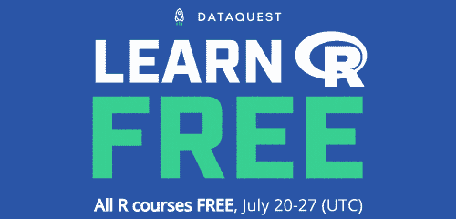

# 免费学习 R——我们的互动 R 课程本周全部免费！

> 原文：<https://www.dataquest.io/blog/learn-r-free/>

July 20, 2020

激动人心的消息:下周，我们所有的 R 编程课程都是免费的。事实上，从 7 月 20 日到 27 日，我们的[数据分析师职业道路](https://www.dataquest.io/path/data-analyst-r/)中的**每一门课程**都是免费的。

这个免费周包括**我们所有的 R 编程课程**和**R 路径中包含的所有 SQL 和统计课程**。

我们为什么要这么做？上周，[我们推出了四门新的 R 课程](https://www.dataquest.io/blog/learn-r-data-analysis-data-science/)，并彻底修改了我们的[数据分析师在 R 学习路径](https://www.dataquest.io/path/data-analyst-r/)的开头。这些课程从零开始教授数据科学的现代、生产就绪的 R(包括 tidyverse 包)——不需要任何先决条件。

现在，使用 Dataquest，从完全的初学者到合格的工作人员比以往任何时候都更容易。付费墙倒了！

[报名开始学习 R](https://app.dataquest.io/signup?course=intro-to-r-rewrite) 

**(无需信用卡。)**

## 我们的交互式 R 编程课程是如何工作的

在 Dataquest，我们的做法略有不同。你在这里找不到任何讲座视频。你也找不到任何选择题或填空题。

相反，我们要求你编写真正的 R 代码并使用真正的数据集。从第一课的第一课开始，你将使用我们的交互式代码运行平台编写和运行你自己的 R 代码。当您的代码正确时，您将获得实时反馈，提示和答案，并在您需要帮助时访问我们令人惊叹的学习者社区。

在课程结束时，您通常会面临通过构建一个真正的数据科学项目来整合新技能的挑战。即使你正在为 Github 构建一个很酷的项目组合，我们的指导项目也会帮助你建立使用 R 的技能和信心。

## 为什么要尝试 Dataquest 的 R 课程？学生们是这样说的:

> 课程中最精彩的部分是当他们接受一个看起来令人畏惧和抽象的概念，然后**让它变得相关和容易理解**。
> 
> *—新的 R 课程 beta 测试器*

> 这些课程以一种简单的方式向我介绍了 R，不需要任何语言知识。但它并不太简单，所以它让我保持了很高的兴趣。
> 
> *—新的 R 课程 beta 测试器*

> 现在的新课程对初学者非常友好。tidyverse 上的工作流程非常有用。
> 
> *—新 R 课程 beta 测试者*

[报名开始学习 R](https://app.dataquest.io/signup?course=intro-to-r-rewrite) 

## 常见问题解答

#### 要进入免费课程，我需要做些什么？

只需[注册一个免费的 Dataquest 帐户](https://app.dataquest.io/signup?target-url=%2Fpath%2Fdata-analyst-r%2F)(或[登录](https://app.dataquest.io/login?target-url=%2Fpath%2Fdata-analyst-r%2F)您现有的帐户)，您就可以访问 R 学习路径中的数据分析师的所有课程。

你可以从头开始，也可以从你喜欢的任何一点开始。如果您有一个现有帐户，并且已经在 Python 路径上取得了进展，请不要担心，您的 Python 进度已经保存，并且您可以随时从您的仪表盘来回切换路径。

从世界协调时 7 月 20 日 0:00**到世界协调时 7 月 28 日 0:00**R 路径的所有课程都将免费。

#### 我需要信用卡来注册吗？

**不！**您可以免费创建 Dataquest 账户，无需信用卡。即使在免费周结束后，您仍可以使用您的免费帐户访问我们数十门免费课程中的任何一门。

#### 在这一周里，我能学到多少东西有限制吗？

没有。我们的平台是自助式的，允许您按照自己的节奏工作。在免费的一周内，你可以完成你想完成的所有课程，并且**你将获得你完成的所有课程的证书**。

免费周结束后，没有付费订阅的用户将不再能够访问 R path 的付费部分，但您在免费周的进度将被保存，并且您仍可以访问每门课程的免费课程。

#### 免费周结束后，我如何访问完整的 R 路径？

一旦免费周结束，[将需要 Dataquest 订阅](https://www.dataquest.io/subscribe/)才能访问完整的 R 路径。

在 2020 年对 600 多名 Dataquest 学习者的调查中，91%的学生认为 Dataquest 订阅服务**是一项很好或很棒的投资**，97%的学生表示他们推荐 Dataquest 以促进职业发展。

### 准备好提升你的 R 技能了吗？

我们 R path 的[数据分析师涵盖了你找到工作所需的所有技能，包括:](/path/data-analyst-r/)

*   使用 **ggplot2** 进行数据可视化
*   使用 **tidyverse** 软件包的高级数据清理技能
*   R 用户的重要 SQL 技能
*   **统计**和概率的基础知识
*   ...还有**多得多的**

没有要安装的东西，**没有先决条件**，也没有时间表。

[Start learning for free!](https://app.dataquest.io/signup)