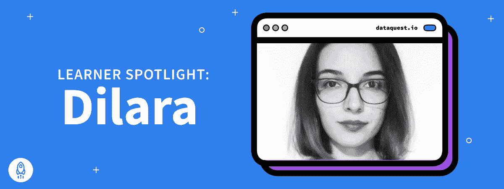

# 学员聚焦— Dilara Karabey

> 原文：<https://www.dataquest.io/blog/learner-spotlight-dilara-karabey/>

April 12, 2022

认识一下 Dilara，她只想通过学习[“Python 中的数据分析师”](https://www.dataquest.io/path/data-analyst/)职业道路来提高她的 Python 技能，但最终却在 Perfist 找到了一份数据科学家、Web & CRO 分析师的工作！对于一个在开始之前就焦虑并与冒名顶替综合征作斗争的人来说，事情变得相当好。

**1。第一，你首选的代词是什么？**
她/她

**2。你能告诉我们你住在哪里吗？**
土耳其伊斯坦布尔。

**3。告诉我们一些你的背景。**
我是学语言学出身的。我于 2017 年开始在博阿齐奇大学语言学系学习。我从高中开始就一直对编程感兴趣，也参加过黑客马拉松等。主要是做机器人，但我不能说这是我的激情。然后，在我搬到伊斯坦布尔学习后，我完全停止了编码，说我们会再见面的。

在疫情大受欢迎之后，我被一个冷酷的事实所震撼，那就是我还没有真正决定在语言学领域寻找什么样的未来。因此，我试着看看我是否有其他的兴趣，我想更深入地挖掘并在此基础上建立我的未来。然后我来到 Dataquest 的奖学金项目，决定尝试一下，并爱上了它。我可以说我个人与 Dataquest 关系密切。后来，事情像滚雪球一样越滚越大，现在我正在一家数字营销机构建立分析和 CRO 部门，处理大量的营销数据。

**4。你现在的职称是什么？**
我目前的职位是“数据科学家，Web & CRO 分析师”，在 Perfist 工作。

**5。请告诉我们更多关于获得当前工作的信息。完成 Dataquest 课程后，我决定开始找工作或实习。我在 10 天内被另一家数字营销机构聘为数据科学实习生，4 个月后获得晋升。晋升之后，我也进入了数字营销分析领域，并更好地了解了我一直在处理的数据。**

**6。你的工作让你兴奋的是什么？**
市场营销是一个充满有趣动态的非常有趣的领域。在一家机构工作实际上是真正驱动我的原因，因为当你在一家机构工作时，你有来自不同领域的广泛客户，他们中的每一个人都有自己的秘密需要探索和分析。

**7。这份工作有你非常擅长的地方吗？**

我很擅长发现问题并提供最佳解决方案。我也很擅长 Python 中的熊猫库。

**8。在开始旅程之前，你感觉如何？**

实际上，我感到非常焦虑，因为我因为冒名顶替综合症已经停止编程一段时间了。

**9。你喜欢 Dataquest 学习平台的哪些方面？**

我真的很喜欢。叙述的很干净，引导的项目都是*金*。在我看来，没有视频的概念实际上更好，因为我有时很容易分心，当视频中出现这种情况时，我必须倒带，这样我就不会错过主题。我也在社区里呆了一段时间，这真的很有帮助。我第一次面试时全副武装！

10。你和我们的旅行怎么样？
其实对我来说真的很简单。就像，自然的。我确实创造了很多很酷的项目；我喜欢指导项目部分。当我走完这条路的时候，我已经掌握了很多有用的数据技能。

**11。你学到了什么新技能？**
我已经学会了大部分关于处理数据的基础知识和一些其他有用的东西，比如 Git 或 Bash。

 ****12。你的学习过程是怎样的？**
我记得我几乎每天都在学习，已经完全走完了这条路！我花了大约三个月的时间才完成。

 **13。你对正在考虑进入 Dataquest 的人有什么建议？
我的建议是努力去做，真正进入社区部分。还有，引导式项目真的很有用，要好好利用。

**14。说说你用 Dataquest 学习后最自豪的是什么？**
我为编写指导项目的人感到骄傲！此外，社区经理真的很擅长保持社区的培育和安全。

 **15。最后，人们在网上哪里能找到你？
这是[链接](https://www.linkedin.com/in/dilara-karabey/)到我的 LinkedIn 个人资料；请随时发送连接请求！******