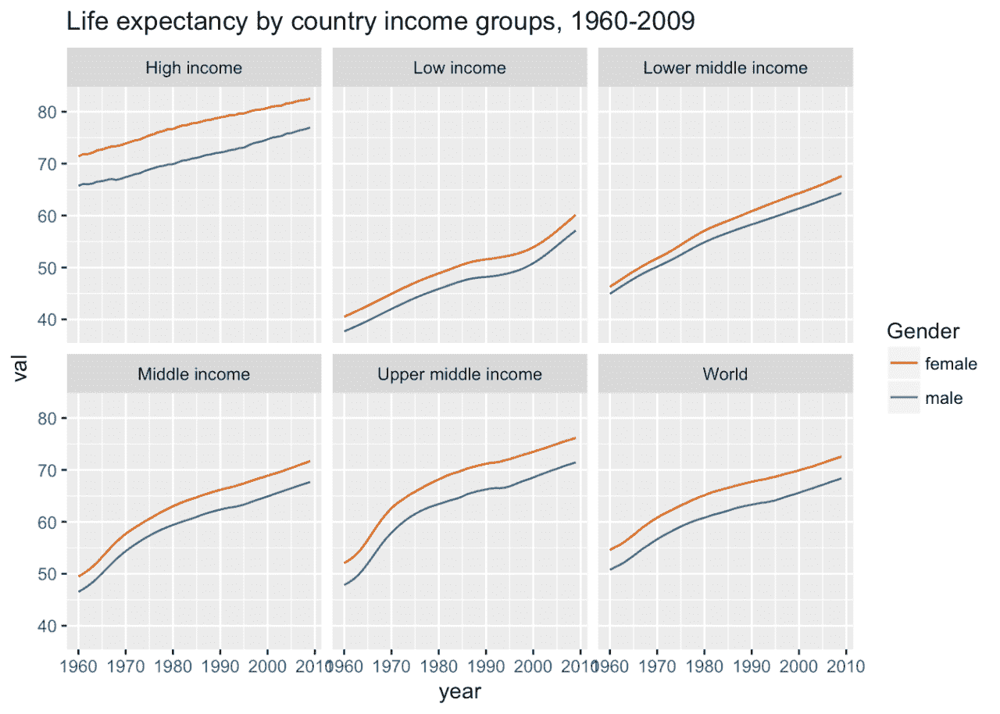
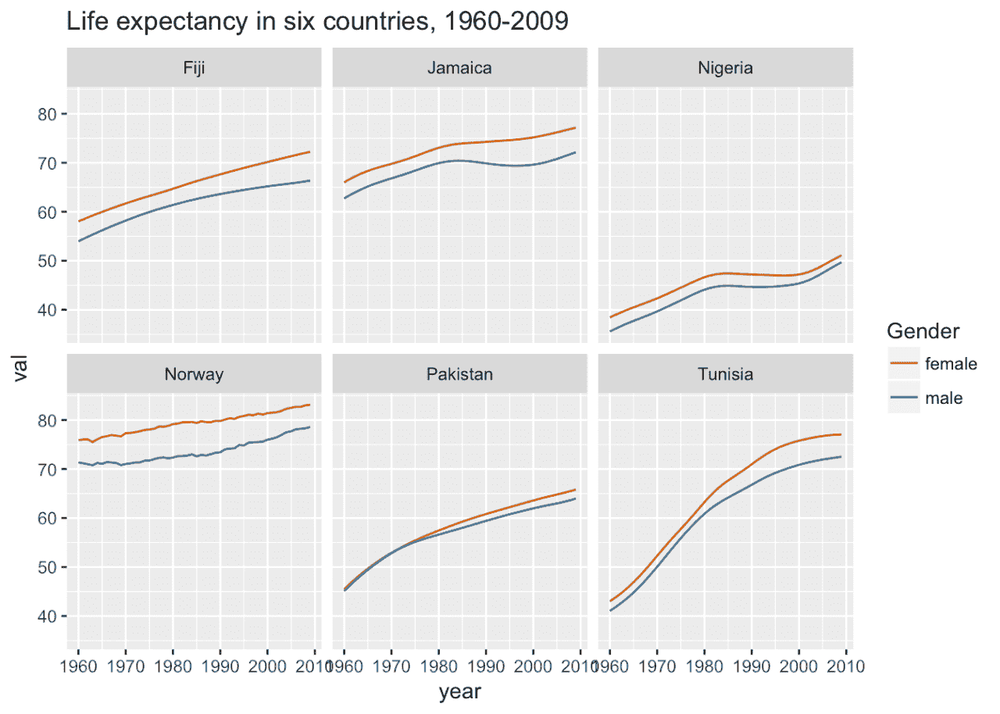
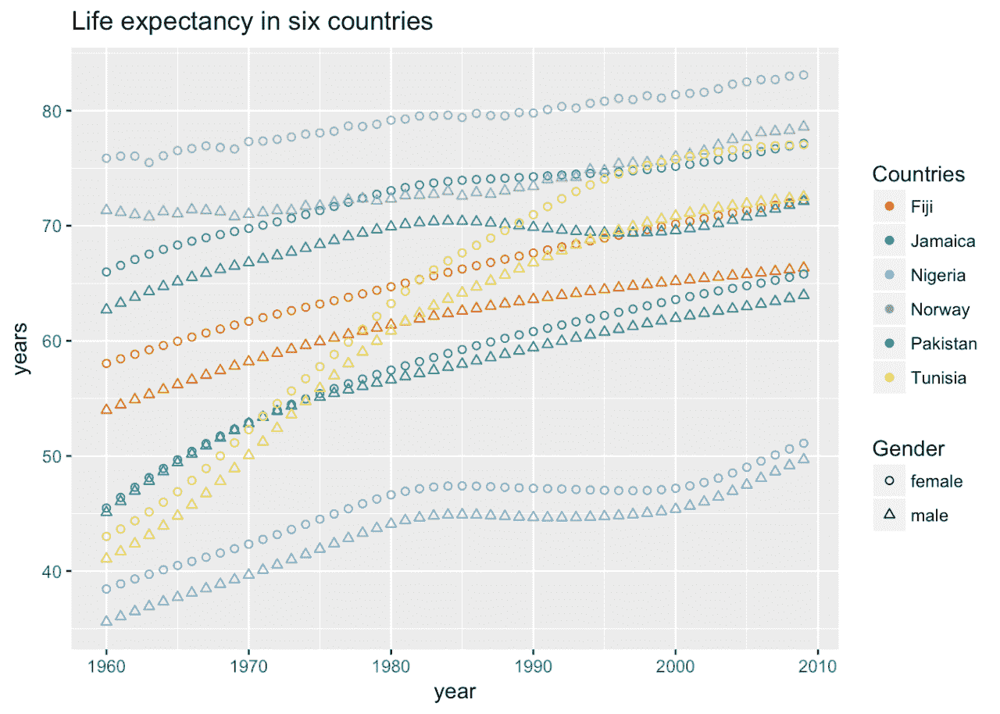
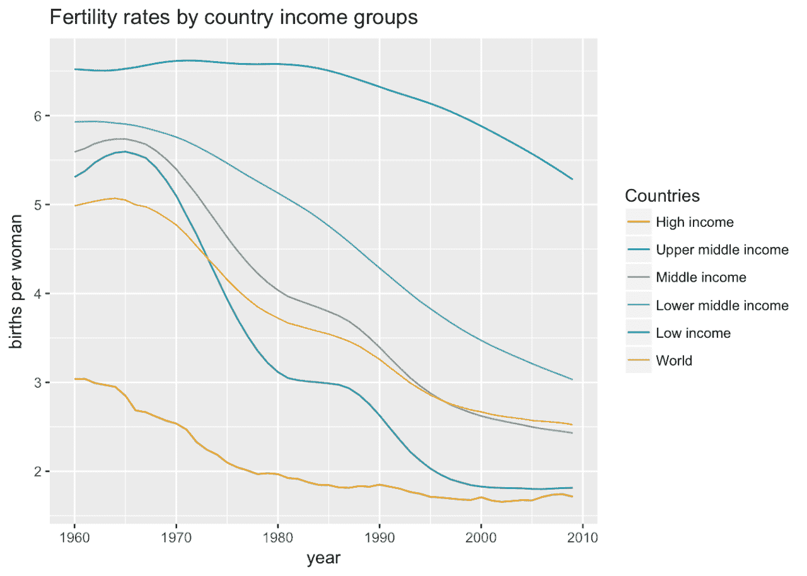
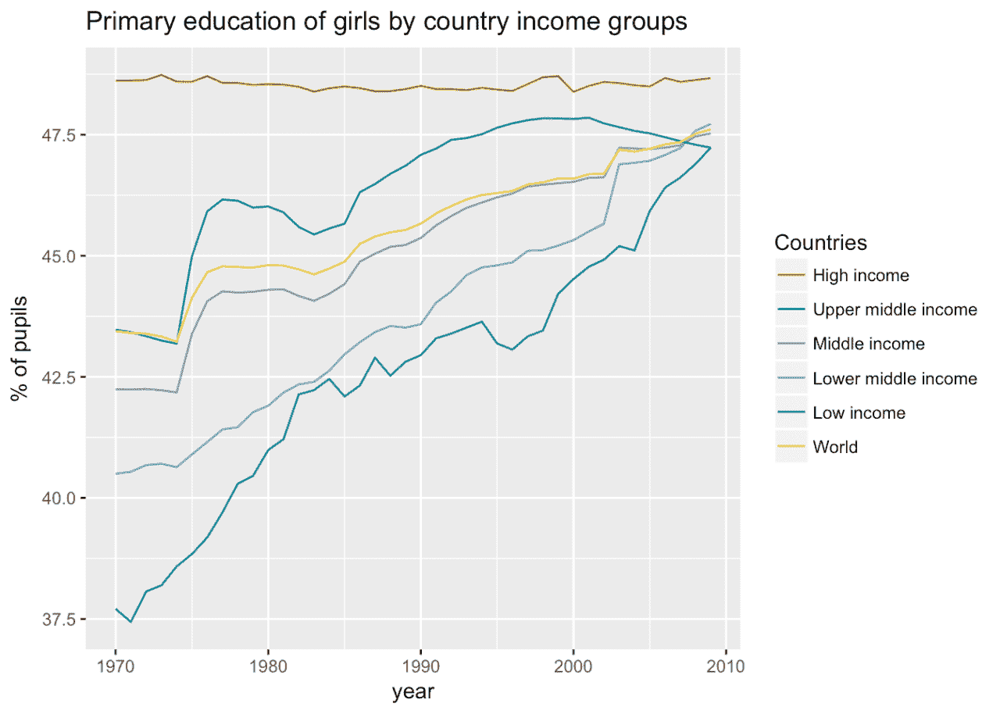
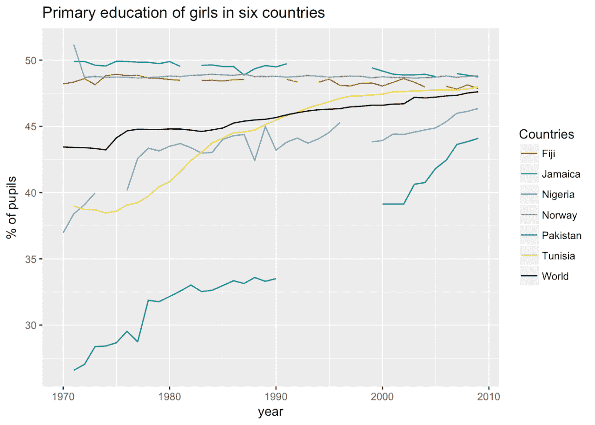
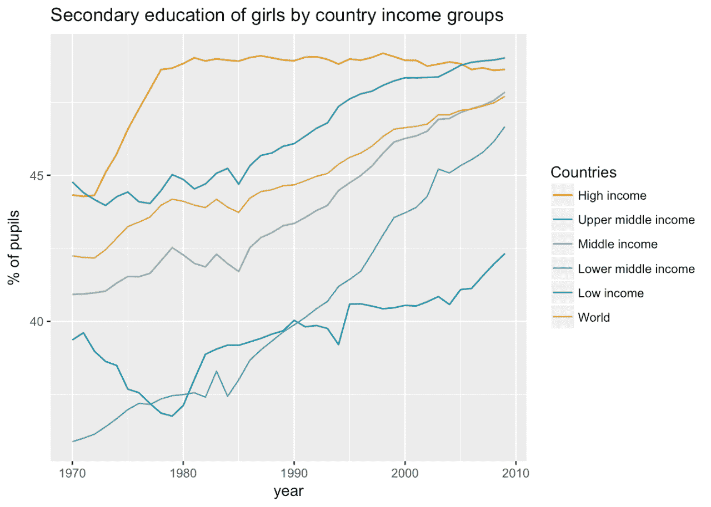
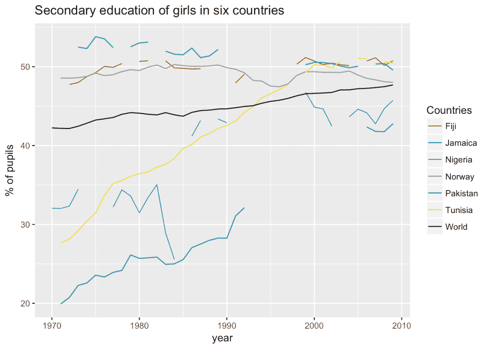
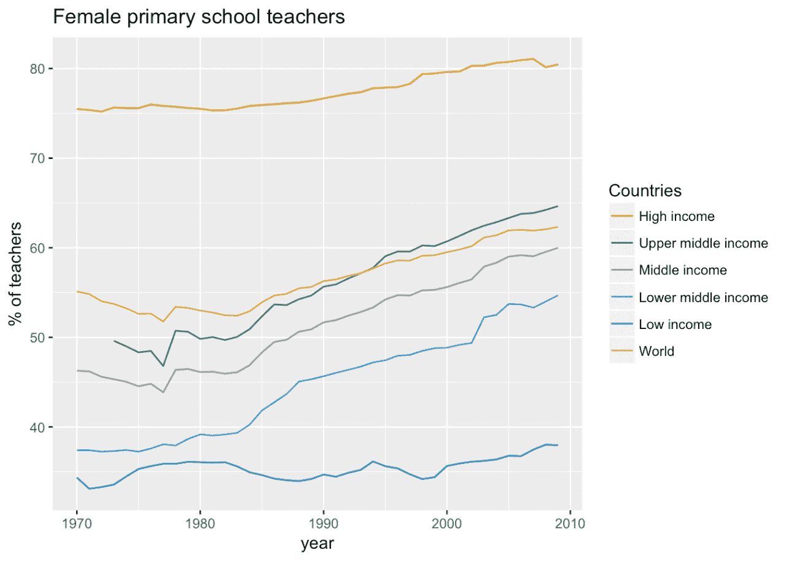
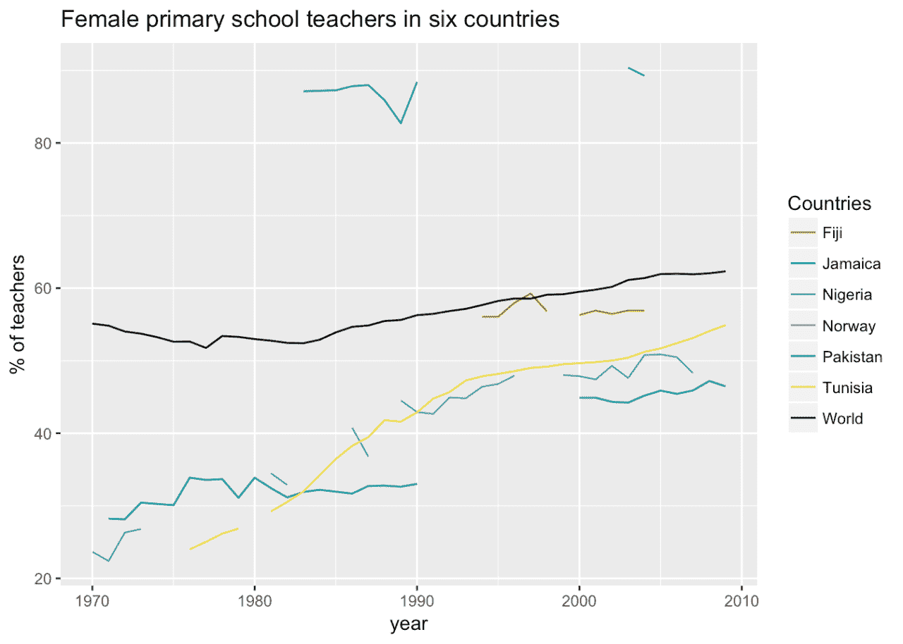

# 从银行数据中学习:世界各地的妇女

> 原文：<https://www.dataquest.io/blog/learning-from-bank-data/>

April 11, 2018This post looks at the [World Bank](https://en.wikipedia.org/wiki/World_Bank) [World Development Indicators](https://databank.worldbank.org/data/home.aspx) (WDI). This massive collection has data in several categories: demographic, education, work, poverty, health. It includes [both country-level data and various aggregates](https://datahelpdesk.worldbank.org/knowledgebase/articles/906519) by different criteria: geographical regions, income levels, etc. The UK Data Service has a useful [guide](https://www.ukdataservice.ac.uk/use-data/guides/dataset/development-indicators) as well as access to the data. You can also download it directly from the World Bank website (and it has an API which I haven’t tried), and there are tools like [R packages](https://www.r-bloggers.com/new-r-package-to-access-world-bank-data/).

许多数据与女性和性别历史相关，以至于[性别有了自己的数据门户](https://datatopics.worldbank.org/gender/)。我只选择了少数几个覆盖面最广的重要指标(预期寿命、生育率、教育)，并绘制了两个系列的图表:第一个使用了世界银行的收入水平分组，第二个选择了六个国家(选择这些国家是因为它们在地理、文化、收入和数据模式方面各不相同，还因为它们具有良好的数据覆盖面，而不是任何类型的代表性)。

我敢肯定，对于研究全球发展的人来说，这并不奇怪，但对我来说，这至少是一次教育经历。这个数据中似乎有相当多对女性有利的消息。坏消息是，在许多指标中，收入地区之间的不平等程度非常严重。

## 男性和女性的预期寿命

预期寿命是数据中运行时间最长的序列之一；大多数国家从 1960 年起就有了。这是一个“多面”图表，比较了五个收入群体(以及整个世界)中女性和男性的出生时预期寿命。众所周知，女性比男性长寿不仅仅是“西方”的现象，尽管国家越富裕，差距越大。最富裕国家和最贫穷国家之间持续存在的差距水平没有太大变化。

第二张图使用相同的格式来看这六个国家，在国家一级有更多的变化——甚至是与总体上升趋势相反的下降或停滞期。

(哎呀。我忘记给 y 轴做漂亮的标签了。那应该是“从出生开始的岁月”。)

这张图表以不同的方式显示了六个国家的数据。我认为它在某些方面不太清晰，但它有助于比较特定时期的国家，以及它们的轨迹如何变化。

## 生育率

自 1960 年以来，生育率也可以广泛获得。与 60 年前相比，世界各地的女性生育数量都在减少，但下降最快的是中等收入国家。这六个国家再次显示出更多的差异。

## 女孩的教育

世界银行最早的教育数据开始得比人口指标稍晚，从 1970 年开始。这方面最显著的特征是小学阶段各收入群体的趋同，除了最贫穷的国家，中等教育也没有落后太多。(注意两个图表的 y 轴刻度和透视的差异…)

在国家数据中，尤其是在中学数据中，出现了一些差距。当然，差距可能会令人沮丧，但它们对于突出我需要问的问题很重要，这些问题涉及数据是如何收集的，以及总量的计算。

### 初等教育

### 中等教育

## 教师

大多数情况下，WDI 的就业数据直到 20 世纪 90 年代才开始出现。但是教育数据确实包含了一些关于小学教师性别的信息。(国家数据中最奇怪的差距之一是，挪威没有这方面的记录。中学教师的数据甚至更少，我决定不包括在内。)

我已经知道，在英国，小学教师是一个以女性为主的职业，但我并不十分了解这种现象在高收入国家普遍存在的程度。全球趋势似乎是同一个方向，但在低收入国家群体中要慢得多。

[GitHub 上的代码和数据](https://github.com/sharonhoward/whm18)

*编者按:这最初是[发布在早期现代笔记](https://earlymodernnotes.wordpress.com/2018/03/08/international-womens-day-2018-women-in-the-world-bank-data/?utm_source=dataquest&utm_medium=blog)上，作为我们关注女性历史月的一部分，已经被 perlesson 转载。作者[莎伦·霍华德](https://sharonhoward.org/?utm_source=dataquest&utm_medium=blog)在谢菲尔德大学担任数字历史项目的项目经理。*