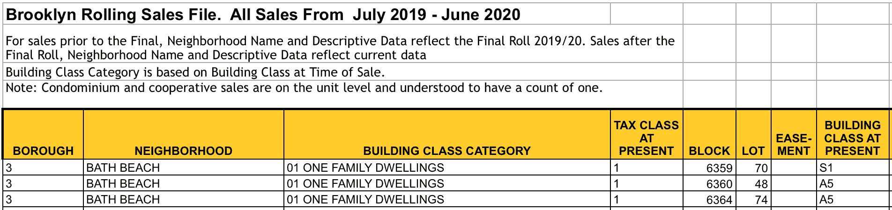
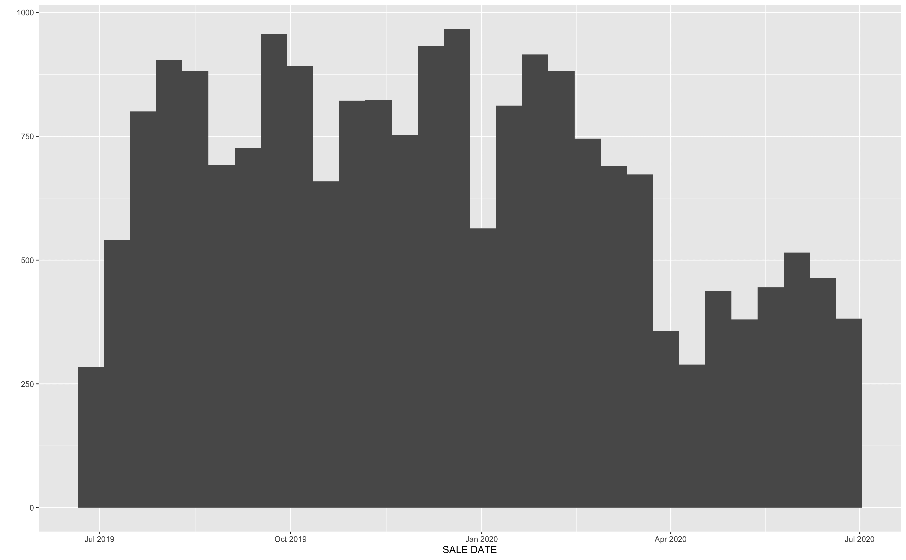

# Tidyverse 基础知识:使用 R tidyverse 工具加载和清理数据

> 原文：<https://www.dataquest.io/blog/load-clean-data-r-tidyverse/>

July 24, 2020

我们将使用 R 和 tidyverse 加载、清理和准备一些布鲁克林房地产数据以供分析！

杂乱的数据集无处不在。如果您想要分析数据，不可避免地需要清理数据。在本教程中，我们将看看如何使用 R 和一些漂亮的 tidyverse 工具来实现这一点。

 [tidyverse 工具](https://www.tidyverse.org)提供了强大的方法来诊断和清理 r 中杂乱的数据集。虽然我们可以使用 tidy verse 做更多的事情，但在本教程中，我们将重点学习如何:

*   将逗号分隔值(CSV)和 Microsoft Excel 平面文件导入 R
*   组合数据帧
*   清除列名
*   还有更多！

tidyverse 是为处理数据而设计的 R 包的[集合。tidyverse 包拥有共同的设计理念、语法和数据结构。Tidyverse 包“一起玩好”。tidyverse 使您能够花更少的时间清理数据，以便您可以将更多的精力放在数据的分析、可视化和建模上。](https://www.tidyverse.org/packages/)

> install.packages("Dataquest ")

从我们的[R 课程简介](/course/intro-to-r/)开始学习 R——不需要信用卡！

[SIGN UP](https://app.dataquest.io/signup)

## 1.干净数据和杂乱数据的特征

干净数据到底是什么？干净的数据是准确、完整的，并且其格式便于分析。干净数据的特征包括以下数据:

*   没有重复的行/值
*   无错误(例如，无拼写错误)
*   相关(例如没有特殊字符)
*   用于分析的适当数据类型
*   无异常值(或仅包含已识别/了解的异常值)，以及
*   遵循“整齐的数据”结构

杂乱数据的常见症状包括包含以下内容的数据:

*   特殊字符(如数值中的逗号)
*   存储为文本/字符数据类型的数值
*   重复行
*   拼写错误
*   不准确
*   空格
*   缺失数据
*   零而不是空值

## 2.动机

在这篇博文中，我们将使用纽约市财政局滚动销售数据网站上公开的五个房产销售数据集。我们鼓励您下载数据集并跟进！每个文件包含纽约市五个区之一的一年的房地产销售数据。我们将使用以下 Microsoft Excel 文件:

*   rollingsales_bronx.xls
*   rollingsales_brooklyn.xls
*   rollingsales_manhattan.xls
*   rollingsales_queens.xls
*   rollingalsales _ stationland . xls

当我们阅读这篇博文时，想象一下你正在帮助一个朋友在纽约市开展他们的房屋检查业务。你主动提出通过分析数据来帮助他们更好地了解房地产市场。但是您意识到，在您可以分析 R 中的数据之前，您需要首先诊断和清理它。在您可以诊断数据之前，您需要将它加载到 R！

## 3.用 readxl 将数据载入 R

在数据加载过程中，使用 tidyverse 工具的好处是显而易见的。在许多情况下，当 Microsoft Excel 数据被加载到 r 中时，tidyverse 包`readxl`将为您清理一些数据。如果您正在处理 CSV 数据，则 tidyverse `readr`包函数`read_csv()`是要使用的函数(我们将在后面介绍)。

让我们看一个例子。布鲁克林区的 Excel 文件如下所示:



*布鲁克林 Excel 文件*

现在让我们将布鲁克林数据集从一个 Excel 文件加载到 R 中。我们将使用`readxl`包。我们指定函数参数`skip = 4`,因为我们想要用作标题的行(即列名)实际上是第 5 行。我们可以完全忽略前四行，从第 5 行开始将数据加载到 R 中。代码如下:

```
library(readxl) # Load Excel files
brooklyn <- read_excel("rollingsales_brooklyn.xls", skip = 4)
```

注意我们用变量名`brooklyn`保存了这个数据集以备将来使用。

## 4.用 tidyr::glimpse()查看数据

tidyverse 提供了一种用户友好的方式，通过作为`tibble`包一部分的`glimpse()`函数来查看这些数据。要使用这个包，我们需要加载它以便在当前会话中使用。但是我们可以一次加载许多 tidyverse 包，而不是单独加载这个包。如果没有包的 tidyverse 集合，请在 R 或 R Studio 会话中使用以下命令将其安装到您的计算机上:

```
install.packages("tidyverse")
```

软件包安装完成后，将其加载到内存中:

```
library(tidyverse)
```

既然 `tidyverse` 已经加载到内存中，那么就来“一瞥”一下 Brooklyn 数据集:

```
glimpse(brooklyn)
```

```
## Observations: 20,185
## Variables: 21
## $ BOROUGH <chr> "3", "3", "3", "3", "3", "3", "…
## $ NEIGHBORHOOD <chr> "BATH BEACH", "BATH BEACH", "BA…
## $ `BUILDING CLASS CATEGORY` <chr> "01 ONE FAMILY DWELLINGS", "01 …
## $ `TAX CLASS AT PRESENT` <chr> "1", "1", "1", "1", "1", "1", "…
## $ BLOCK <dbl> 6359, 6360, 6364, 6367, 6371, 6…
## $ LOT <dbl> 70, 48, 74, 24, 19, 32, 65, 20,…
## $ `EASE-MENT` <lgl> NA, NA, NA, NA, NA, NA, NA, NA,…
## $ `BUILDING CLASS AT PRESENT` <chr> "S1", "A5", "A5", "A9", "A9", "…
## $ ADDRESS <chr> "8684 15TH AVENUE", "14 BAY 10T…
## $ `APARTMENT NUMBER` <chr> NA, NA, NA, NA, NA, NA, NA, NA,…
## $ `ZIP CODE` <dbl> 11228, 11228, 11214, 11214, 112…
## $ `RESIDENTIAL UNITS` <dbl> 1, 1, 1, 1, 1, 1, 1, 1, 2, 1, 1…
## $ `COMMERCIAL UNITS` <dbl> 1, 0, 0, 0, 0, 0, 0, 0, 0, 0, 0…
## $ `TOTAL UNITS` <dbl> 2, 1, 1, 1, 1, 1, 1, 1, 2, 1, 1…
## $ `LAND SQUARE FEET` <dbl> 1933, 2513, 2492, 1571, 2320, 3…
## $ `GROSS SQUARE FEET` <dbl> 4080, 1428, 972, 1456, 1566, 22…
## $ `YEAR BUILT` <dbl> 1930, 1930, 1950, 1935, 1930, 1…
## $ `TAX CLASS AT TIME OF SALE` <chr> "1", "1", "1", "1", "1", "1", "…
## $ `BUILDING CLASS AT TIME OF SALE` <chr> "S1", "A5", "A5", "A9", "A9", "…
## $ `SALE PRICE` <dbl> 1300000, 849000, 0, 830000, 0, …
## $ `SALE DATE` <dttm> 2020-04-28, 2020-03-18, 2019-0…
```

`glimpse()`函数提供了一种用户友好的方式来查看数据框中所有列或变量的列名和数据类型。使用此功能，我们还可以查看数据框中的前几个观察值。这个数据框有 20，185 个观察值，即房产销售记录。有 21 个变量或列。

## 5.数据类型

查看每一列的数据类型，我们会发现，一般来说，数据是以随时可用的格式存储的！例如:

*   `NEIGHBORHOOD`是“字符”型，也称为字符串。
*   `GROSS SQUARE FEET`(即属性的大小)属于“double”类型，属于 r 中“numeric”类的哪一部分。
*   `SALE PRICE`也是数字。
*   `SALE DATE`以表示日历日期和时间的格式存储。

那么，为什么这很重要呢？因为`GROSS SQUARE FEET`和`SALE PRICE`是数值，我们可以马上对数据进行算术运算。例如，我们可以计算所有房产的平均销售价格:

```
mean(brooklyn$`SALE PRICE`)
```

```
## [1] 1098644
```

## 6.准备剧情！

`SALE DATE`以表示日历日期和时间的格式存储是很有用的，因为这使我们能够使用一行代码按日期制作房地产销售直方图:

```
qplot(`SALE DATE`, data = brooklyn)
```



*2020 年 4 月房产销售大幅下滑*

请注意 2020 年 4 月房地产销售的急剧下降。这可能与新冠肺炎·疫情有关吗？如您所见，只需几行代码，我们就可以开始探索我们的数据并提出一些有趣的问题！

注意，用于制作直方图的 [`qplot()`函数](https://ggplot2.tidyverse.org/reference/qplot.html)来自 [ggplot2 包](https://ggplot2.tidyverse.org/index.html)，是一个核心`tidyverse`包。

## 7.与 read.csv()进行比较

`readxl()`功能帮了我们多大的忙？让我们将它与 r 内置的 [`read.csv()`函数](https://stat.ethz.ch/R-manual/R-devel/library/utils/html/read.table.html)进行比较。为此，我们下载了原始的 Excel 文件，在 Mac 上的 Numbers 程序中打开它，并将文件转换为 CSV 格式。当然，这种工作流程并不理想，但是分析师更喜欢以 CSV 格式读取表格数据的情况并不少见。

下面是我们用`read.csv()`加载 CSV 格式的相同数据时看到的情况:

```
brooklyn_csv <- read.csv("rollingsales_brooklyn.csv", skip = 4)
glimpse(brooklyn_csv)
```

```
## Observations: 20,185
## Variables: 21
## $ BOROUGH <int> 3, 3, 3, 3, 3, 3, 3, 3, 3, 3, 3, …
## $ NEIGHBORHOOD <fct> BATH BEACH, BATH BEACH, BATH BEAC…
## $ BUILDING.CLASS.CATEGORY <fct> 01 ONE FAMILY DWELLINGS, 01 ONE F…
## $ TAX.CLASS.AT.PRESENT <fct> 1, 1, 1, 1, 1, 1, 1, 1, 1, 1, 1, …
## $ BLOCK <int> 6359, 6360, 6364, 6367, 6371, 637…
## $ LOT <int> 70, 48, 74, 24, 19, 32, 65, 20, 1…
## $ EASE.MENT <lgl> NA, NA, NA, NA, NA, NA, NA, NA, N…
## $ BUILDING.CLASS.AT.PRESENT <fct> S1, A5, A5, A9, A9, A9, A2, A5, B…
## $ ADDRESS <fct> 8684 15TH AVENUE, 14 BAY 10TH STR…
## $ APARTMENT.NUMBER <fct> , , , , , , , , , , , , , , , , ,…
## $ ZIP.CODE <int> 11228, 11228, 11214, 11214, 11214…
## $ RESIDENTIAL.UNITS <int> 1, 1, 1, 1, 1, 1, 1, 1, 2, 1, 1, …
## $ COMMERCIAL.UNITS <int> 1, 0, 0, 0, 0, 0, 0, 0, 0, 0, 0, …
## $ TOTAL.UNITS <int> 2, 1, 1, 1, 1, 1, 1, 1, 2, 1, 1, …
## $ LAND.SQUARE.FEET <fct> "1,933", "2,513", "2,492", "1,571…
## $ GROSS.SQUARE.FEET <fct> "4,080", "1,428", "972", "1,456",…
## $ YEAR.BUILT <int> 1930, 1930, 1950, 1935, 1930, 189…
## $ TAX.CLASS.AT.TIME.OF.SALE <int> 1, 1, 1, 1, 1, 1, 1, 1, 1, 1, 1, …
## $ BUILDING.CLASS.AT.TIME.OF.SALE <fct> S1, A5, A5, A9, A9, A9, A2, A5, A…
## $ SALE.PRICE <fct> "1,300,000", "849,000", "0", "830…
## $ SALE.DATE <fct> 4/28/20, 3/18/20, 8/15/19, 6/26/2…
```

这个数据比较乱！以下是方法:

*   字符(字符串)数据，如`ADDRESS`，已被存储为类“因子”。将因素视为类别或桶。
*   `GROSS.SQUARE.FEET`和`SALE.PRICE`也被存储为因子。我们不能对一个因子执行算术运算，比如计算平均值！
*   `SALE.DATE`不是以表示日历日期和时间的格式存储的。所以我们无法构建上面看到的直方图。(我们可以做一个直方图，但是很乱，没有意义)。
*   `GROSS.SQUARE.FEET`和`SALE.PRICE`列包含一个特殊字符，逗号(，)。

但是如果我们用来自`readr`包的 [`read_csv()`函数](https://readr.tidyverse.org/reference/read_delim.html)加载同一个数据集，它是 tidyverse 的一部分，我们会看到类似于我们用`readxl()`的原始方法的结果:

```
brooklyn_csv <- read_csv("rollingsales_brooklyn.csv", skip = 4)
glimpse(brooklyn_csv)
```

```
## Observations: 20,185
## Variables: 21
## $ BOROUGH <dbl> 3, 3, 3, 3, 3, 3, 3, 3, 3, 3, 3…
## $ NEIGHBORHOOD <chr> "BATH BEACH", "BATH BEACH", "BA…
## $ `BUILDING CLASS CATEGORY` <chr> "01 ONE FAMILY DWELLINGS", "01 …
## $ `TAX CLASS AT PRESENT` <chr> "1", "1", "1", "1", "1", "1", "…
## $ BLOCK <dbl> 6359, 6360, 6364, 6367, 6371, 6…
## $ LOT <dbl> 70, 48, 74, 24, 19, 32, 65, 20,…
## $ `EASE-MENT` <lgl> NA, NA, NA, NA, NA, NA, NA, NA,…
## $ `BUILDING CLASS AT PRESENT` <chr> "S1", "A5", "A5", "A9", "A9", "…
## $ ADDRESS <chr> "8684 15TH AVENUE", "14 BAY 10T…
## $ `APARTMENT NUMBER` <chr> NA, NA, NA, NA, NA, NA, NA, NA,…
## $ `ZIP CODE` <dbl> 11228, 11228, 11214, 11214, 112…
## $ `RESIDENTIAL UNITS` <dbl> 1, 1, 1, 1, 1, 1, 1, 1, 2, 1, 1…
## $ `COMMERCIAL UNITS` <dbl> 1, 0, 0, 0, 0, 0, 0, 0, 0, 0, 0…
## $ `TOTAL UNITS` <dbl> 2, 1, 1, 1, 1, 1, 1, 1, 2, 1, 1…
## $ `LAND SQUARE FEET` <dbl> 1933, 2513, 2492, 1571, 2320, 3…
## $ `GROSS SQUARE FEET` <dbl> 4080, 1428, 972, 1456, 1566, 22…
## $ `YEAR BUILT` <dbl> 1930, 1930, 1950, 1935, 1930, 1…
## $ `TAX CLASS AT TIME OF SALE` <dbl> 1, 1, 1, 1, 1, 1, 1, 1, 1, 1, 1…
## $ `BUILDING CLASS AT TIME OF SALE` <chr> "S1", "A5", "A5", "A9", "A9", "…
## $ `SALE PRICE` <dbl> 1300000, 849000, 0, 830000, 0, …
## $ `SALE DATE` <chr> "4/28/20", "3/18/20", "8/15/19"…
```

总而言之，使用`readxl()`或`read_csv()`将数据加载到 R 中的关键区别在于，没有任何变量被强制转换为`factor`数据类型。相反。许多变量是作为字符或字符串数据类型加载的。

另外，请注意，`Sale Price`列中缺少特殊字符，该列已经作为`double`或数字数据类型加载。这意味着我们可以立即执行与销售价格相关的计算，而无需采取额外的步骤将列转换为数字！

## 8.组合数据集

如果我们想对纽约市的所有五个区进行数据分析，那么合并数据集将会很有帮助。此外，如果数据需要任何额外的清理，最好是只在一个地方清理数据，而不是在五个地方！我们已经验证了五个 Excel 文件中的列名是相同的。所以我们可以将数据帧与来自`dplyr`包(另一个 tidyverse 包)的 [`bind_rows()`函数](https://dplyr.tidyverse.org/reference/bind.html)组合起来。):

```
brooklyn <- read_excel("rollingsales_brooklyn.xls", skip = 4)
bronx <- read_excel("rollingsales_bronx.xls", skip = 4)
manhattan <- read_excel("rollingsales_manhattan.xls", skip = 4)
staten_island <- read_excel("rollingsales_statenisland.xls", skip = 4)
queens <- read_excel("rollingsales_queens.xls", skip = 4)

# Bind all dataframes into one, save as "NYC_property_sales"
NYC_property_sales <- bind_rows(brooklyn, bronx, manhattan, staten_island, queens)

glimpse(NYC_property_sales)
```

```
## Observations: 70,870
## Variables: 21
## $ BOROUGH <chr> "3", "3", "3", "3", "3", "3", "…
## $ NEIGHBORHOOD <chr> "BATH BEACH", "BATH BEACH", "BA…
## $ `BUILDING CLASS CATEGORY` <chr> "01 ONE FAMILY DWELLINGS", "01 …
## $ `TAX CLASS AT PRESENT` <chr> "1", "1", "1", "1", "1", "1", "…
## $ BLOCK <dbl> 6359, 6360, 6364, 6367, 6371, 6…
## $ LOT <dbl> 70, 48, 74, 24, 19, 32, 65, 20,…
## $ `EASE-MENT` <lgl> NA, NA, NA, NA, NA, NA, NA, NA,…
## $ `BUILDING CLASS AT PRESENT` <chr> "S1", "A5", "A5", "A9", "A9", "…
## $ ADDRESS <chr> "8684 15TH AVENUE", "14 BAY 10T…
## $ `APARTMENT NUMBER` <chr> NA, NA, NA, NA, NA, NA, NA, NA,…
## $ `ZIP CODE` <dbl> 11228, 11228, 11214, 11214, 112…
## $ `RESIDENTIAL UNITS` <dbl> 1, 1, 1, 1, 1, 1, 1, 1, 2, 1, 1…
## $ `COMMERCIAL UNITS` <dbl> 1, 0, 0, 0, 0, 0, 0, 0, 0, 0, 0…
## $ `TOTAL UNITS` <dbl> 2, 1, 1, 1, 1, 1, 1, 1, 2, 1, 1…
## $ `LAND SQUARE FEET` <dbl> 1933, 2513, 2492, 1571, 2320, 3…
## $ `GROSS SQUARE FEET` <dbl> 4080, 1428, 972, 1456, 1566, 22…
## $ `YEAR BUILT` <dbl> 1930, 1930, 1950, 1935, 1930, 1…
## $ `TAX CLASS AT TIME OF SALE` <chr> "1", "1", "1", "1", "1", "1", "…
## $ `BUILDING CLASS AT TIME OF SALE` <chr> "S1", "A5", "A5", "A9", "A9", "…
## $ `SALE PRICE` <dbl> 1300000, 849000, 0, 830000, 0, …
## $ `SALE DATE` <dttm> 2020-04-28, 2020-03-18, 2019-0…
```

这个`NYC_property_sales`数据帧也包含 21 个变量，就像`brooklyn`数据帧一样。这很好，因为它确认了所有五个数据集具有完全相同的列名，所以我们能够将它们组合在一起，而无需任何更正！bind_rows()函数实际上是将五个数据帧堆叠在一起，形成一个数据帧。

如果我们合并这些数据帧，最终得到的列数比`brooklyn`数据帧中的多，这可能表明存在问题，比如某个数据集中的列名错误。但是这里没有发生这种情况，所以我们可以继续清理列名。

## 9.用马格里特魔法清理列名！

现在是 Dataquest 中我们最喜欢的数据清理技巧之一的时候了！

列名包含空格，这在 tidyverse 中可能更难处理。此外，列名包含大写字母。在我们的分析过程中，我们不想担心空格或记住大写变量名！让我们使用 [`magrittr`包](https://cran.r-project.org/web/packages/magrittr/vignettes/magrittr.html)中的一种简便方法快速清理列名。首先将包加载到内存中。如果需要，安装软件包。tidyverse 中使用了“magrittr”包，但是我们需要显式地加载它来访问它的一个内置函数。

```
library(magrittr)
```

我们将使用`magrittr`包中的“赋值管道”函数来有效地更新所有变量名。管道是强大的工具，允许 R 用户一次链接多个操作。管道也使 R 代码更易读，更容易理解。在使用 tidyverse 工具时，管道被广泛使用。

让我们将赋值管道操作符与 tidyverse `stringr`包中的`str_replace_all()`函数结合起来，用下划线替换所有空格。`NYC_property_sales`数据帧的代码如下所示:

```
colnames(NYC_property_sales) %<>% str_replace_all("\\s", "_") %<>% tolower()
```

这是怎么回事？！把`%<>%`想成是“然后更新”的意思。让我们把这个放在上下文中。上面一行代码实际上意味着:

> 从`NYC_property_sales`数据框中取出列名，然后更新所有列名，将所有空格替换为下划线，然后将所有列名更新为小写。

好长的一句话！但是这展示了管道操作符将多个命令链接在一起的价值。让我们看看更新后的列名:

```
colnames(NYC_property_sales)
```

```
## [1] "borough" "neighborhood" 
## [3] "building_class_category" "tax_class_at_present" 
## [5] "block" "lot" 
## [7] "ease-ment" "building_class_at_present" 
## [9] "address" "apartment_number" 
## [11] "zip_code" "residential_units" 
## [13] "commercial_units" "total_units" 
## [15] "land_square_feet" "gross_square_feet" 
## [17] "year_built" "tax_class_at_time_of_sale" 
## [19] "building_class_at_time_of_sale" "sale_price" 
## [21] "sale_date"
```

这样看起来更好！

## 10.管道操作

通常，当使用 tidyverse 工具时，我们将使用来自`magrittr`的单管道(`%>%`)。管道是将多个命令链接在一起的一种方式。回想一下上面我们是如何把`%<>%`想成“然后更新”的？好吧，单管可以简单的认为是“然后”。下面是一个使用我们到目前为止所学命令的示例:

```
NYC_property_sales %>% glimpse()
```

这大致可以解释为:

> 让我们抓住 NYC_property_sales 数据框架，然后浏览一下数据。

## 概述

哇，看看我们在这篇博文中涵盖的所有内容:

*   用`readxl`包中的`read_excel()`函数将 Microsoft Excel 平面文件加载到 R 中
*   从`readr`包导入带有`read_csv()`功能的 CSV 文件
*   使用`tibble`包中的`glimpse()`功能查看数据帧特征
*   使用`ggplot2`包中的`qplot()`函数生成直方图
*   用`dplyr`包中的`bind_rows()`函数组合数据帧
*   使用`magrittr`包和`stringr`包中的函数清理列名
*   用来自`magrittr`的单管道(`%>%`)将命令连接在一起

正如您所看到的，tidyverse 包是加载、清理和检查数据的非常强大的工具，因此您可以立即开始分析您的数据！请记住，您可以使用`library(tidyverse)`一次性加载所有这些包。

## 额外资源

如果您是 R 和 tidyverse 的新手，我们建议您从 R 课程中的 Dataquest [数据分析介绍开始。这是 R](https://www.dataquest.io/course/introduction-to-data-analysis-in-r/) 路径中 Dataquest [数据分析师的第一门课程。](https://www.dataquest.io/path/data-analyst-r/)

Hadley Wickham 和 Garrett Grolemund 的《数据科学》的书 [R 涵盖了我们在这里讨论的很多内容(甚至更多！).我们向任何正在学习 r 的人推荐这本书。](https://r4ds.had.co.nz/)

## 奖励:备忘单

RStudio 已经发布了[许多关于使用 R 和 tidyverse 工具的备忘单](https://rstudio.com/resources/cheatsheets/)。与本文相关的备忘单包括:

*   [数据导入备忘单](https://raw.githubusercontent.com/rstudio/cheatsheets/master/data-import.pdf)
*   [数据转换 Cheetsheet](https://raw.githubusercontent.com/rstudio/cheatsheets/master/data-transformation.pdf)
*   [使用字符串 Cheatsheet](https://raw.githubusercontent.com/rstudio/cheatsheets/master/strings.pdf)
*   [数据可视化备忘单](https://raw.githubusercontent.com/rstudio/cheatsheets/master/data-visualization-2.1.pdf)

通过选择`Help > Cheatsheets`，可以从 RStudio 中访问选择备忘单。

### 准备好提升你的 R 技能了吗？

我们 R path 的[数据分析师涵盖了你找到工作所需的所有技能，包括:](/path/data-analyst-r/)

*   使用 **ggplot2** 进行数据可视化
*   使用 **tidyverse** 软件包的高级数据清理技能
*   R 用户的重要 SQL 技能
*   **统计**和概率的基础知识
*   ...还有**多得多的**

没有要安装的东西，**没有先决条件**，也没有时间表。

[Start learning for free!](https://app.dataquest.io/signup)