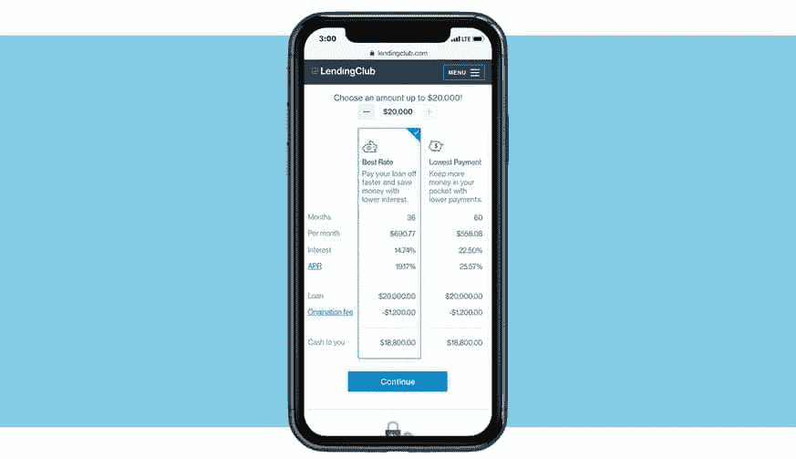
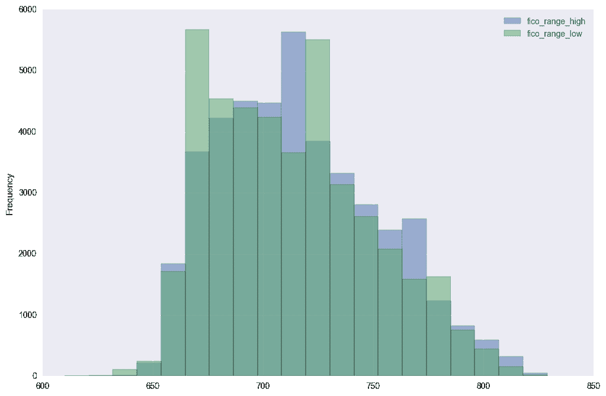
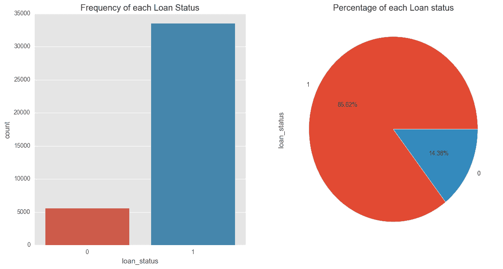

# 机器学习的数据清理和准备

> 原文：<https://www.dataquest.io/blog/machine-learning-preparing-data/>

June 19, 2019

数据清理和准备是任何机器学习项目中关键的第一步。虽然我们经常认为数据科学家花费大量时间修补算法和机器学习模型，但现实是大多数数据科学家花费大部分时间清理数据。

在这篇博客文章中(最初由 Dataquest 学生 [Daniel Osei](https://github.com/dosei1) 撰写，Dataquest 于 2019 年 6 月更新)，我们将浏览 Python 中的数据清理过程，检查数据集，选择要素列，可视化探索数据，然后为机器学习编码要素。

我们建议使用 Jupyter 笔记本来跟随本教程。

要了解有关数据清理的更多信息，请查看我们的交互式数据清理课程:

*   [数据清理与分析课程](https://www.dataquest.io/course/python-datacleaning/) (Python)
*   [高级数据清理课程](https://www.dataquest.io/course/python-data-cleaning-advanced/) (Python)
*   [数据清理](https://www.dataquest.io/course/r-data-cleaning/) (R)

## 理解数据

在我们开始为机器学习项目清理数据之前，了解数据是什么以及我们想要实现什么是至关重要的。不了解这一点，我们就没有基础来决定在清理和准备数据时哪些数据是相关的。

我们将使用来自 **Lending Club** 的一些数据，这是一个个人贷款市场，为寻求贷款的借款人和希望放贷并获得回报的投资者牵线搭桥。每个**借款人**都要填写一份全面的申请表，提供他们过去的财务历史、贷款原因等等。Lending Club 使用过去的历史数据(以及他们自己的数据科学流程)评估每个借款人的信用评分！)并为借款人指定一个利率。



批准的贷款列在 Lending Club 网站上，合格投资者可以在这里浏览最近批准的贷款、借款人的信用评分、贷款目的以及申请中的其他信息。

一旦投资者决定提供贷款，借款人每月向 Lending Club 还款。Lending Club 将这些款项重新分配给投资者。这意味着投资者不必等到全额付清才开始看到回报。如果贷款按时全部还清，投资者将获得回报，该回报相当于借款人在要求的金额之外必须支付的利率。

然而，许多贷款没有完全按时还清，一些借款人拖欠贷款。这是我们在从 Lending Club 清理一些数据以进行机器学习时将试图解决的问题。让我们想象一下，我们的任务是建立一个模型来预测借款人是否有可能偿还或拖欠贷款。

## 步骤 1:检查数据集

Lending Club 定期在其网站上发布其所有批准和拒绝的贷款申请[的数据。为了确保我们使用的是同一组数据，我们在](https://www.lendingclub.com/info/download-data.action) [data.world](https://data.world/jaypeedevlin/lending-club-loan-data-2007-11) 上镜像了我们将在本教程中使用的数据。

在 LendingClub 的网站上，您可以选择不同的年份范围来下载已批准和已拒绝贷款的数据集(CSV 格式)。你还可以在 LendingClub 页面的底部找到一个**数据字典**(XLS 格式)，其中包含了不同列名的信息。这个数据字典有助于理解数据集中每一列代表什么。数据字典包含两张表:

*   LoanStats 表:描述批准的贷款数据集
*   RejectStats 表:描述被拒绝的贷款数据集

我们将使用 LoanStats 表，因为我们对批准的贷款数据集感兴趣。

批准的贷款数据集包含当前贷款、已完成贷款和违约贷款的信息。在本教程中，我们将使用 2007 年到 2011 年的已批准贷款数据，但是发布到 LendingClub 网站的任何数据都需要类似的清理步骤。

首先，让我们导入一些我们将使用的库，并设置一些参数以使输出更容易阅读。出于本教程的目的，我们假设您已经牢固掌握了使用 Python 处理数据的基础知识，包括使用 pandas、numpy 等。因此，如果你需要温习这些技能，你可以浏览我们的课程列表。

```py
 import pandas as pd
import numpy as np
pd.set_option('max_columns', 120)
pd.set_option('max_colwidth', 5000)
import matplotlib.pyplot as plt
import seaborn as sns
*%matplotlib inline
plt.rcParams['figure.figsize'] = (12,8)* 
```

 *#### 将数据加载到 Pandas

我们已经下载了我们的数据集，并将其命名为`lending_club_loans.csv`，但是现在我们需要将它加载到一个 pandas 数据框架中来研究它。一旦它被加载，我们将需要做一些基本的清理工作来删除一些我们不需要的信息，这会使我们的数据处理速度变慢。

具体来说，我们将:

*   删除第一行:它包含无关的文本，而不是列标题。这个文本阻止数据集被 pandas 库正确解析。
*   删除“desc”列:它包含一个我们不需要的贷款的长文本解释。
*   删除“url”栏:它包含每个 on Lending Club 的链接，只有投资者帐户才能访问。
*   删除丢失值超过 50%的所有列:这将使我们工作得更快(并且我们的数据集足够大，即使没有它们也仍然有意义。

我们还将把过滤后的数据集命名为`loans_2007`，在这一节的最后，我们将把它保存为`loans_2007.csv`，以使它与原始数据分开。这是一种很好的做法，可以确保我们拥有原始数据，以防我们需要返回并检索任何要删除的内容。

现在，让我们继续执行这些步骤:

```py
 # skip row 1 so pandas can parse the data properly.
loans_2007 = pd.read_csv('data/lending_club_loans.csv', skiprows=1, low_memory=False)
half_count = len(loans_2007) / 2
loans_2007 = loans_2007.dropna(thresh=half_count,axis=1) # Drop any column with more than 50% missing values
loans_2007 = loans_2007.drop(['url','desc'],axis=1) # These columns are not useful for our purposes
```

让我们使用 pandas `head()`方法来显示 loans_2007 数据帧的前三行，以确保我们能够正确地加载数据集:

```py
loans_2007.head(3)
```

|  | 身份证明（identification） | 成员 id | 贷款金额 | 资助 _amnt | 资助 _amnt_inv | 学期 | 利息率 | 部分 | 等级 | 路基 | 员工 _ 职位 | 员工长度 | 房屋所有权 | 年度公司 | 验证 _ 状态 | 问题 _d | 贷款 _ 状态 | pymnt_plan | 目的 | 标题 | 邮政编码 | 地址 _ 状态 | 弥散张量成像 | delinq _ 年 | 最早 _cr_line | fico_range_low | fico _ range _ 高 | 最近 6 个月 | open_acc | 发布 _ 记录 | 革命 _ 平衡 | 革命报 | 总计 _acc | 初始列表状态 | out_prncp | out_prncp_inv | total_pymnt | total_pymnt_inv | total_rec_prncp | total_rec_int | total_rec_late_fee | 追回款 | 收款 _ 回收 _ 费用 | last_pymnt_d | last_pymnt_amnt | 最后一笔贷款 | last _ fico _ range _ 高 | last_fico_range_low | 收藏 _ 12 _ 月 _ 月 _ 日 _ 医学 | 策略代码 | 应用程序类型 | acc _ now _ delinq | 12 个月内收费 | delinq _ amnt | pub _ rec _ 破产 | tax _ links-税捐连结 |
| --- | --- | --- | --- | --- | --- | --- | --- | --- | --- | --- | --- | --- | --- | --- | --- | --- | --- | --- | --- | --- | --- | --- | --- | --- | --- | --- | --- | --- | --- | --- | --- | --- | --- | --- | --- | --- | --- | --- | --- | --- | --- | --- | --- | --- | --- | --- | --- | --- | --- | --- | --- | --- | --- | --- | --- | --- |
| Zero | One million seventy-seven thousand five hundred and one | One million two hundred and ninety-six thousand five hundred and ninety-nine | Five thousand | Five thousand | Four thousand nine hundred and seventy-five | 36 个月 | 10.65% | One hundred and sixty-two point eight seven | B | B2 | 圆盘烤饼 | 10 年以上 | 租金 | Twenty-four thousand | 已证实的 | 2011 年 12 月 | 全部付讫 | n | 信用卡 | 计算机 | 860xx | 阿塞拜疆（Azerbaijan 的缩写） | Twenty-seven point six five | Zero | 1985 年 1 月 | Seven hundred and thirty-five | Seven hundred and thirty-nine | One | Three | Zero | Thirteen thousand six hundred and forty-eight | 83.7% | Nine | f | Zero | Zero | 5863.155187 | Five thousand eight hundred and thirty-three point eight four | Five thousand | Eight hundred and sixty-three point one six | Zero | Zero | Zero | 2015 年 1 月 | One hundred and seventy-one point six two | 2016 年 9 月 | Seven hundred and forty-four | Seven hundred and forty | Zero | One | 个人 | Zero | Zero | Zero | Zero | Zero |
| one | One million seventy-seven thousand four hundred and thirty | One million three hundred and fourteen thousand one hundred and sixty-seven | Two thousand five hundred | Two thousand five hundred | Two thousand five hundred | 60 个月 | 15.27% | Fifty-nine point eight three | C | 补体第四成份缺乏 | 赖德 | 不到 1 年 | 租金 | Thirty thousand | 来源已核实 | 2011 年 12 月 | 注销 | n | 汽车 | 自行车 | 309xx | 通用航空 | One | Zero | 1999 年 4 月 | Seven hundred and forty | Seven hundred and forty-four | Five | Three | Zero | One thousand six hundred and eighty-seven | 9.4% | Four | f | Zero | Zero | 1008.710000 | One thousand and eight point seven one | Four hundred and fifty-six point four six | Four hundred and thirty-five point one seven | Zero | One hundred and seventeen point zero eight | One point one one | 2013 年 4 月 | One hundred and nineteen point six six | 2016 年 9 月 | Four hundred and ninety-nine | Zero | Zero | One | 个人 | Zero | Zero | Zero | Zero | Zero |
| Two | One million seventy-seven thousand one hundred and seventy-five | One million three hundred and thirteen thousand five hundred and twenty-four | Two thousand four hundred | Two thousand four hundred | Two thousand four hundred | 36 个月 | 15.96% | Eighty-four point three three | C | 溴化五烃季胺 | 圆盘烤饼 | 10 年以上 | 租金 | Twelve thousand two hundred and fifty-two | 未验证 | 2011 年 12 月 | 全部付讫 | n | 小企业 | 房地产业务 | 606xx | 伊利诺伊 | Eight point seven two | Zero | 2001 年 11 月 | Seven hundred and thirty-five | Seven hundred and thirty-nine | Two | Two | Zero | Two thousand nine hundred and fifty-six | 98.5% | Ten | f | Zero | Zero | 3005.666844 | Three thousand and five point six seven | Two thousand four hundred | Six hundred and five point six seven | Zero | Zero | Zero | 2014 年 6 月 | Six hundred and forty-nine point nine one | 2016 年 9 月 | Seven hundred and nineteen | Seven hundred and fifteen | Zero | One | 个人 | Zero | Zero | Zero | Zero | Zero |

让我们也使用 pandas `.shape`属性来查看我们在此阶段处理的样本和特性的数量:

```py
loans_2007.shape
```

```py
(42538, 56)
```

## 步骤 2:缩小要清理的列的范围

既然我们已经建立了数据，我们应该花一些时间来研究它，并理解每一列代表什么特性。这一点很重要，因为对特性的理解不足会导致我们在数据分析和建模过程中出错。

我们将使用 LendingClub 提供的数据字典来帮助我们熟悉数据集中的列以及每个列所代表的内容。为了简化这个过程，我们将创建一个 DataFrame 来包含列名、数据类型、第一行的值和数据字典中的描述。为了使这更容易，我们已经将数据字典从 Excel 格式[预先转换为 CSV 格式。](https://data.world/jaypeedevlin/lending-club-loan-data-2007-11)

让我们打开字典看一看。

```py
 data_dictionary = pd.read_csv('LCDataDictionary.csv') # Loading in the data dictionary
print(data_dictionary.shape[0])
print(data_dictionary.columns.tolist())
```

```py
 117
['LoanStatNew', 'Description']
```

```py
 data_dictionary.head()
data_dictionary = data_dictionary.rename(columns={'LoanStatNew': 'name', 'Description': 'description'})
```

|  | LoanStatNew | 描述 |
| --- | --- | --- |
| Zero | acc _ now _ delinq | 借款人现在拖欠的账户数量。 |
| one | acc _ open _ past _ 月 | 过去 24 个月中的开仓交易数量。 |
| Two | 地址状态 | 借款人在贷款申请中提供的状态 |
| three | all_util | 所有交易的信贷限额余额 |
| four | 年度公司 | 借款人在登记时提供的自报年收入。 |

现在我们已经加载了数据字典，让我们将第一行`loans_2007`连接到`data_dictionary`数据帧，以给出一个包含以下各列的预览数据帧:

*   `name` —包含`loans_2007`的列名。
*   `dtypes` —包含`loans_2007`列的数据类型。
*   `first value` —包含第一行`loans_2007`的值。
*   `description` —解释`loans_2007`中每一列的含义。

```py
 loans_2007_dtypes = pd.DataFrame(loans_2007.dtypes,columns=['dtypes'])
loans_2007_dtypes = loans_2007_dtypes.reset_index()
loans_2007_dtypes['name'] = loans_2007_dtypes['index']
loans_2007_dtypes = loans_2007_dtypes[['name','dtypes']]
loans_2007_dtypes['first value'] = loans_2007.loc[0].values
preview = loans_2007_dtypes.merge(data_dictionary, on='name',how='left') 
```

```py
preview.head()
```

|  | 名字 | dtypes(类型) | 第一个值 | 描述 |
| --- | --- | --- | --- | --- |
| Zero | 身份证明（identification） | 目标 | One million seventy-seven thousand five hundred and one | 贷款列表的唯一 LC 分配 ID。 |
| one | 成员 id | float64 | 1.2966e+06 | 借款人成员的唯一 LC 分配 Id。 |
| Two | 贷款金额 | float64 | Five thousand | 借款人申请的贷款金额。如果在某个时间点，信贷部门减少了贷款金额，那么它将反映在这个值中。 |
| three | 资助 _amnt | float64 | Five thousand | 当时承诺的贷款总额。 |
| four | 资助 _amnt_inv | float64 | Four thousand nine hundred and seventy-five | 投资者在该时间点承诺的贷款总额。 |

当我们之前打印`loans_2007`的形状时，我们注意到它有 56 列，所以我们知道这个预览数据帧有 56 行(一行解释`loans_2007`中的每一列)。

尝试一次浏览预览的所有行可能会很麻烦，因此我们将把它分成三个部分，每次查看较小的功能选择。当我们探索这些特性以更好地理解它们时，我们希望关注任何具有以下特征的专栏:

*   从未来泄露信息(在贷款已经被资助之后)，
*   不影响借款人偿还贷款的能力(如 Lending Club 随机生成的 ID 值)，
*   格式很差，
*   需要更多数据或大量预处理才能变成有用的功能，或者
*   包含冗余信息。

这些都是我们需要小心的事情，因为从长远来看，处理不当会损害我们的分析。

我们需要特别关注数据泄露，它会导致模型[过拟合](https://en.wikipedia.org/wiki/Overfitting)。这是因为该模型还会从我们使用它时无法获得的功能中学习，从而预测未来的贷款。我们需要确保我们的模型仅使用贷款申请时的数据进行训练。

#### 第一组列

让我们显示`preview`的前 19 行并进行分析:

```py
preview[:19]
```

|  | 名字 | dtypes(类型) | 第一个值 | 描述 |
| --- | --- | --- | --- | --- |
| Zero | 身份证明（identification） | 目标 | One million seventy-seven thousand five hundred and one | 贷款列表的唯一 LC 分配 ID。 |
| one | 成员 id | float64 | 1.2966e+06 | 借款人成员的唯一 LC 分配 Id。 |
| Two | 贷款金额 | float64 | Five thousand | 借款人申请的贷款金额。如果在某个时间点，信贷部门减少了贷款金额，那么它将反映在这个值中。 |
| three | 资助 _amnt | float64 | Five thousand | 当时承诺的贷款总额。 |
| four | 资助 _amnt_inv | float64 | Four thousand nine hundred and seventy-five | 投资者在该时间点承诺的贷款总额。 |
| five | 学期 | 目标 | 36 个月 | 贷款的付款次数。值以月为单位，可以是 36 或 60。 |
| six | 利息率 | 目标 | 10.65% | 贷款利率 |
| seven | 部分 | float64 | One hundred and sixty-two point eight seven | 如果贷款来源，借款人所欠的每月付款。 |
| eight | 等级 | 目标 | B | LC 分配的贷款等级 |
| nine | 路基 | 目标 | B2 | LC 指定贷款路基 |
| Ten | 员工 _ 职位 | 目标 | 圆盘烤饼 | 借款人在申请贷款时提供的职位名称。* |
| Eleven | 员工长度 | 目标 | 10 年以上 | 雇佣年限。可能的值介于 0 和 10 之间，其中 0 表示不到一年，10 表示十年或更长时间。 |
| Twelve | 房屋所有权 | 目标 | 租金 | 借款人在登记时提供的房屋所有权状况。我们的价值观是:租金、自有、抵押、其他。 |
| Thirteen | 年度公司 | float64 | Twenty-four thousand | 借款人在登记时提供的自报年收入。 |
| Fourteen | 验证 _ 状态 | 目标 | 已证实的 | 指示收入是否已由信用证核实、未核实或收入来源是否已核实 |
| Fifteen | 问题 _d | 目标 | 2011 年 12 月 | 为贷款提供资金的月份 |
| Sixteen | 贷款 _ 状态 | 目标 | 全部付讫 | 贷款的当前状态 |
| Seventeen | pymnt_plan | 目标 | n | 指明贷款的付款计划是否已经到位 |
| Eighteen | 目的 | 目标 | 信用卡 | 借款人为贷款请求提供的类别。 |

在分析了这些列并考虑了我们试图构建的模型之后，我们可以得出结论，可以删除以下特性:

*   `id` —由 LendingClub 随机生成的字段，仅用于唯一识别目的。
*   `member_id` —也是由 LendingClub 随机生成的字段，仅用于识别目的。
*   `funded_amnt` —从未来泄露信息(在贷款已经开始融资之后)。
*   `funded_amnt_inv` —也泄露未来的数据。
*   `sub_grade` —包含已经在`grade`列中的冗余信息(更多信息见下文)。
*   `int_rate` —也包括在`grade`列中。
*   `emp_title` —需要其他数据和大量处理才能变得潜在有用
*   `issued_d` —泄露未来的数据。

注意:Lending Club 使用借款人的等级和付款期限(30 或 30 个月)来分配利率(你可以阅读更多关于利率和费用)。这导致给定等级内的利率变化。

对我们的模型有用的是关注借款人群体而不是个人。这正是评级的作用——它根据借款人的信用评分和其他行为对借款人进行细分，这就是为什么我们将保留`grade`列，并降低利息`int_rate`和`sub_grade`。在移动到下一组列之前，让我们从数据框架中删除这些列。

```py
 drop_list = ['id','member_id','funded_amnt','funded_amnt_inv',
'int_rate','sub_grade','emp_title','issue_d']
loans_2007 = loans_2007.drop(drop_list,axis=1)
```

现在我们准备继续下一组专栏(特性)。

#### 第二组列

让我们继续下面的 19 个专栏:

```py
preview[19:38]
```

|  | 名字 | dtypes(类型) | 第一个值 | 描述 |
| --- | --- | --- | --- | --- |
| Nineteen | 标题 | 目标 | 计算机 | 借款人提供的贷款名称 |
| Twenty | 邮政编码 | 目标 | 860xx | 借款人在贷款申请中提供的邮政编码的前 3 个数字。 |
| Twenty-one | 地址状态 | 目标 | 阿塞拜疆（Azerbaijan 的缩写） | 借款人在贷款申请中提供的状态 |
| Twenty-two | 弥散张量成像 | float64 | Twenty-seven point six five | 使用借款人每月总债务付款对总债务(不包括抵押贷款和要求的 LC 贷款)除以借款人自我报告的月收入计算的比率。 |
| Twenty-three | delinq _ 年 | float64 | Zero | 在过去 2 年中，借款人信用档案中逾期 30 天以上的拖欠事件的数量 |
| Twenty-four | 最早 _cr_line | 目标 | 1985 年 1 月 | 借款人最早报告的信用额度开立的月份 |
| Twenty-five | fico_range_low | float64 | Seven hundred and thirty-five | 贷款发放时借款人 FICO 所属的下限范围。 |
| Twenty-six | fico _ range _ 高 | float64 | Seven hundred and thirty-nine | 贷款发放时借款人 FICO 所属的上限范围。 |
| Twenty-seven | 最近 6 个月 | float64 | one | 过去 6 个月的查询次数(不包括汽车和抵押贷款查询) |
| Twenty-eight | open_acc | float64 | three | 借款人信用档案中未结信用额度的数量。 |
| Twenty-nine | 发布 _ 记录 | float64 | Zero | 贬损公共记录的数量 |
| Thirty | 革命 _ 平衡 | float64 | Thirteen thousand six hundred and forty-eight | 贷方循环余额合计 |
| Thirty-one | 革命报 | 目标 | 83.7% | 循环额度利用率，或借款人相对于所有可用循环信贷使用的信贷金额。 |
| Thirty-two | 总计 _acc | float64 | nine | 借款人信用档案中当前的信用额度总数 |
| Thirty-three | 初始列表状态 | 目标 | f | 贷款的初始上市状态。可能的值为–W，F |
| Thirty-four | out_prncp | float64 | Zero | 资金总额的剩余未偿本金 |
| Thirty-five | out_prncp_inv | float64 | Zero | 投资者出资总额部分的剩余未偿本金 |
| Thirty-six | total_pymnt | float64 | Five thousand eight hundred and sixty-three point one six | 迄今收到的资金总额付款 |
| Thirty-seven | total_pymnt_inv | float64 | Five thousand eight hundred and thirty-three point eight four | 迄今收到的投资者出资总额部分的付款 |

在该组中，请注意`fico_range_low`和`fico_range_high`列。虽然两者都在上表中，但我们将在看完最后一组专栏后进一步讨论它们。另请注意，如果您正在处理较新的 LendingClub 数据，它可能不包括 FICO 分数的数据。

现在，查看我们的第二组列，我们可以通过删除以下列来进一步细化我们的数据集:

*   `zip_code`–addr _ state 列大部分是冗余的，因为只有 5 位邮政编码的前 3 位是可见的。
*   `out_prncp`–泄露未来的数据。
*   `out_prncp_inv`–也泄露未来的数据。
*   `total_pymnt`–也泄露未来的数据。
*   `total_pymnt_inv`–也泄露未来的数据。

让我们继续从数据框中删除这 5 列:

```py
 drop_cols = [ 'zip_code','out_prncp','out_prncp_inv',
'total_pymnt','total_pymnt_inv']
loans_2007 = loans_2007.drop(drop_cols, axis=1)
```

#### 第三组列

让我们来分析最后一组特性:

```py
preview[38:]
```

|  | 名字 | dtypes(类型) | 第一个值 | 描述 |
| --- | --- | --- | --- | --- |
| Thirty-eight | total_rec_prncp | float64 | Five thousand | 迄今收到的本金 |
| Thirty-nine | total_rec_int | float64 | Eight hundred and sixty-three point one six | 迄今收到的利息 |
| Forty | total_rec_late_fee | float64 | Zero | 迄今收到的滞纳金 |
| Forty-one | 追回款 | float64 | Zero | 冲销总回收 |
| forty-two | 收款 _ 回收 _ 费用 | float64 | Zero | 邮政冲减托收费用 |
| Forty-three | last_pymnt_d | 目标 | 2015 年 1 月 | 上个月的付款已经收到 |
| forty-four | last_pymnt_amnt | float64 | One hundred and seventy-one point six two | 上次收到的总付款金额 |
| Forty-five | 最后一笔贷款 | 目标 | 2016 年 9 月 | 最近一个月的信用证提取了这笔贷款的信用 |
| Forty-six | last _ fico _ range _ 高 | float64 | Seven hundred and forty-four | 借款人最后一笔 FICO 贷款所属的上限范围。 |
| Forty-seven | last_fico_range_low | float64 | Seven hundred and forty | 借款人最后一笔 FICO 贷款所属的下限范围。 |
| Forty-eight | 收藏 _ 12 _ 月 _ 月 _ 日 _ 医学 | float64 | Zero | 12 个月内的收集次数，不包括医疗收集 |
| forty-nine | 策略代码 | float64 | one | 公开提供的 policy _ code = 1 \新产品不公开提供的 policy_code=2 |
| Fifty | 应用程序类型 | 目标 | 个人 | 指明贷款是个人申请还是两个共同借款人的联合申请 |
| Fifty-one | acc _ now _ delinq | float64 | Zero | 借款人现在拖欠的账户数量。 |
| fifty-two | 12 个月内收费 | float64 | Zero | 12 个月内的销账次数 |
| Fifty-three | delinq _ amnt | float64 | Zero | 借款人现在拖欠的帐户的过期欠款。 |
| Fifty-four | pub _ rec _ 破产 | float64 | Zero | 公开记录的破产数量 |
| Fifty-five | tax _ links-税捐连结 | float64 | Zero | 税收留置权的数量 |

在最后一组列中，我们需要删除以下内容，*所有的*都泄露了未来的数据:

*   `total_rec_prncp`
*   `total_rec_int`
*   `total_rec_late_fee`
*   `recoveries`
*   `collection_recovery_fee`
*   `last_pymnt_d`
*   `last_pymnt_amnt`

让我们删除最后一组列:

```py
 drop_cols = ['total_rec_prncp','total_rec_int',
'total_rec_late_fee','recoveries',
'collection_recovery_fee', 'last_pymnt_d'
'last_pymnt_amnt']
loans_2007 = loans_2007.drop(drop_cols, axis=1)
```

太好了！我们现在有了一个数据集，它将对构建我们的模型更加有用，因为它不必浪费时间处理不相关的数据，也不会通过分析泄露贷款结果的未来信息来“欺骗”。

#### 调查 FICO 分数列

值得花点时间来讨论一下`fico_range_low`、`fico_range_high`、`last_fico_range_low`和`last_fico_range_high`列。

FICO 分数是一种信用分数:银行和信用卡用来表示一个人的信用程度的数字。虽然有几种类型的信用评分在美国使用，FICO 评分是最有名的和最广泛使用的。

当借款人申请贷款时，LendingClub 从 FICO 获得借款人的信用评分——他们获得借款人评分所属范围的下限和上限，并将这些值存储为`fico_range_low`、`fico_range_high`。在那之后，对借款者分数的任何更新都被记录为`last_fico_range_low`和`last_fico_range_high`。

任何数据科学项目的一个关键部分是尽一切努力理解数据。在研究这个特定的数据集时，我发现了斯坦福大学的一群学生在 2014 年做的一个项目。在[项目](http://cs229.stanford.edu/proj2014/Kevin%20Tsai,Sivagami%20Ramiah,Sudhanshu%20Singh,Peer%20Lending%20Risk%20Predictor.pdf)的报告中，该小组将滞纳金和恢复费中的当前信用评分(`last_fico_range`)列为他们错误添加到功能中的字段，但声明他们后来知道这些列都泄露了未来的信息。

然而，在这个小组的项目之后，来自斯坦福的另一个小组研究了这个相同的 Lending Club 数据集。他们在建模中使用了 FICO 分数栏，只去掉了`last_fico_range_low`。[第二组的报告](http://cs229.stanford.edu/proj2015/199_report.pdf)将`last_fico_range_high`描述为预测准确结果的更重要特征之一。

有了这些信息，我们必须回答的问题是:FICO 信用评分会泄露未来的信息吗？回想一下，当我们使用我们的模型进行预测时，如果列中包含的数据不可用，则该列被视为泄漏信息，在这种情况下，当我们在未来的贷款申请中使用我们的模型来预测借款人是否会违约时。

[这篇博客文章(不再提供)](#)深入研究了 LendingClub 贷款的 FICO 分数，并指出，虽然观察 FICO 分数的趋势可以很好地预测贷款是否会违约，但在贷款获得资金后，FICO 分数会继续由 LendingClub 更新。换句话说，虽然我们可以使用初始 FICO 分数(`fico_range_low`和`fico_range_high`)——这些分数将作为借款人申请的一部分提供——但我们*不能*使用`last_fico_range_low`和`last_fico_range_high`，因为 LendingClub 可能会在借款人申请后更新这些分数。

让我们看看我们可以使用的两列中的值:

```py
 print(loans_2007['fico_range_low'].unique())
print(loans_2007['fico_range_high'].unique())
```

```py
 [ 735\. 740\. 690\. 695\. 730\. 660\. 675\. 725\. 710\. 705\. 720\. 665\. 670\. 760\. 685\. 755\. 680\. 700\. 790\. 750\. 715\. 765\. 745\. 770\. 780\. 775\. 795\. 810\. 800\. 815\. 785\. 805\. 825\. 820\. 630\. 625\. nan 650\. 655\. 645\. 640\. 635\. 610\. 620\. 615.]
[ 739\. 744\. 694\. 699\. 734\. 664\. 679\. 729\. 714\. 709\. 724\. 669\. 674\. 764\. 689\. 759\. 684\. 704\. 794\. 754\. 719\. 769\. 749\. 774\. 784\. 779\. 799\. 814\. 804\. 819\. 789\. 809\. 829\. 824\. 634\. 629\. nan 654\. 659\. 649\. 644\. 639\. 614\. 624\. 619.]
```

让我们去掉缺失的值，然后绘制直方图来查看两列的范围:

```py
 fico_columns = ['fico_range_high','fico_range_low']
print(loans_2007.shape[0])
loans_2007.dropna(subset=fico_columns,inplace=True)
print(loans_2007.shape[0])
loans_2007[fico_columns].plot.hist(alpha=0.5,bins=20);
```

```py
 42538
42535
```



现在让我们继续为`fico_range_low`和`fico_range_high`列的平均值创建一个列，并将其命名为`fico_average`。请注意，这不是每个借款人的平均 FICO 分数，而是我们知道的借款人所处的最高和最低范围的平均值。

```py
loans_2007['fico_average'] = (loans_2007['fico_range_high'] + loans_2007['fico_range_low']) / 2
```

让我们检查一下我们刚才做了什么。

```py
 cols = ['fico_range_low','fico_range_high','fico_average']
loans_2007[cols].head()
```

|  | fico_range_low | fico _ range _ 高 | fico _ 平均 |
| --- | --- | --- | --- |
| Zero | Seven hundred and thirty-five | Seven hundred and thirty-nine | Seven hundred and thirty-seven |
| one | Seven hundred and forty | Seven hundred and forty-four | Seven hundred and forty-two |
| Two | Seven hundred and thirty-five | Seven hundred and thirty-nine | Seven hundred and thirty-seven |
| three | Six hundred and ninety | Six hundred and ninety-four | Six hundred and ninety-two |
| four | Six hundred and ninety-five | Six hundred and ninety-nine | Six hundred and ninety-seven |

很好！我们得到了平均计算和一切权利。现在，我们可以删除`fico_range_low`、`fico_range_high`、`last_fico_range_low`和`last_fico_range_high`列。

```py
 drop_cols = ['fico_range_low','fico_range_high','last_fico_range_low', 'last_fico_range_high']
loans_2007 = loans_2007.drop(drop_cols, axis=1)
loans_2007.shape
```

```py
(42535, 33)
```

请注意，通过熟悉数据集中的列，我们已经能够将列数从 56 减少到 33，而不会丢失任何对我们的模型有意义的数据。我们还通过删除泄露未来信息的数据来避免问题，这些数据会打乱我们模型的结果。这就是数据清理如此重要的原因！

#### 决定目标列

现在，我们将决定使用哪一列作为建模的目标列。

我们的主要目标是预测谁将偿还贷款，谁将违约，我们需要找到一个反映这一点的栏目。我们从预览数据帧中的列描述中了解到,`loan_status`是主数据集中描述贷款状态的唯一字段，因此让我们将该列用作目标列。

```py
preview[preview.name == 'loan_status']
```

|  | 名字 | dtypes(类型) | 第一个值 | 描述 |
| --- | --- | --- | --- | --- |
| Sixteen | 贷款 _ 状态 | 目标 | 全部付讫 | 贷款的当前状态 |

目前，此列包含需要转换为数值的文本值，以便能够用于训练模型。让我们在本专栏中探讨不同的价值观，并想出一个转换它们的策略。我们将使用 DataFrame 方法 [`value_counts()`](https://pandas.pydata.org/pandas-docs/stable/generated/pandas.Series.value_counts.html) 返回`loan_status`列中唯一值的频率。

```py
loans_2007["loan_status"].value_counts()
```

```py
 Fully Paid 33586
Charged Off 5653
Does not meet the credit policy. Status:Fully Paid 1988
Does not meet the credit policy. Status:Charged Off 761
Current 513
In Grace Period 16
Late (31-120 days) 12
Late (16-30 days) 5
Default 1
Name: loan_status, dtype: int64 
```

贷款状态有九种不同的可能值！让我们了解这些独特的值，以确定最能描述贷款最终结果的值，以及我们将要处理的分类问题。

我们可以在 LendingClub 网站上看到大多数不同的贷款状态[，也可以在](https://kb.lendingclub.com/investor/articles/Investor/What-do-the-different-Note-statuses-mean/) [Lend Academy](https://www.lendacademy.com/forum/index.php?topic=2427.msg20813#msg20813) 和 [Orchard](https://web.archive.org/web/20181124165127/https://www.orchardplatform.com/blog/2014520loans-issued-under-previous-credit-policies/) 论坛上看到这些帖子。

下面，我们将这些数据汇总到下表中，这样我们就可以看到唯一的值、它们在数据集中的出现频率，并更清楚地了解每个值的含义:

```py
meaning = [
"Loan has been fully paid off.",
"Loan for which there is no longer a reasonable expectation of further payments.",
"While the loan was paid off, the loan application today would no longer meet the credit policy and wouldn't be approved on to the marketplace.",
"While the loan was charged off, the loan application today would no longer meet the credit policy and wouldn't be approved on to the marketplace.",
"Loan is up to date on current payments.",
"The loan is past due but still in the grace period of 15 days.",
"Loan hasn't been paid in 31 to 120 days (late on the current payment).",
"Loan hasn't been paid in 16 to 30 days (late on the current payment).",
"Loan is defaulted on and no payment has been made for more than 121 days."]
status, count = loans_2007["loan_status"].value_counts().index, loans_2007["loan_status"].value_counts().values
loan_statuses_explanation = pd.DataFrame({'Loan Status': status,'Count': count,'Meaning': meaning})[['Loan Status','Count','Meaning']]
loan_statuses_explanation
```

|  | 贷款状态 | 数数 | 意义 |
| --- | --- | --- | --- |
| Zero | 全部付讫 | Thirty-three thousand five hundred and eighty-six | 贷款已全部还清。 |
| one | 注销 | Five thousand six hundred and fifty-three | 不再有进一步还款的合理预期的贷款。 |
| Two | 不符合信贷政策。状况:全额支付 | One thousand nine hundred and eighty-eight | 虽然贷款已经还清，但今天的贷款申请不再符合信贷政策，不会被批准上市。 |
| three | 不符合信贷政策。状态:已关闭 | Seven hundred and sixty-one | 当贷款被取消时，今天的贷款申请将不再符合信贷政策，不会被批准上市。 |
| four | 目前的 | Five hundred and thirteen | 当前付款的贷款是最新的。 |
| five | 在宽限期内 | Sixteen | 贷款已经过期，但仍在 15 天的宽限期内。 |
| six | 后期(31-120 天) | Twelve | 贷款在 31 到 120 天内没有支付(当前付款的延迟)。 |
| seven | 后期(16-30 天) | five | 贷款已有 16 到 30 天没有支付(当前付款的延迟)。 |
| eight | 默认 | one | 贷款违约，超过 121 天没有付款。 |

请记住，我们的目标是建立一个机器学习模型，它可以从过去的贷款中学习，试图预测哪些贷款将被还清，哪些不会。从上表中可以看出，只有完全支付和冲销的价值描述了贷款的最终结果。其他值描述的是仍在进行的贷款，即使有些贷款逾期未还，我们也不能过早将它们归类为已冲销贷款。

此外，虽然违约状态类似于已冲销状态，但在 LendingClub 看来，已冲销的贷款基本上没有偿还的机会，而违约贷款的机会很小。因此，我们应该只使用`loan_status`栏为`'Fully Paid'`或`'Charged Off'`的样本。

我们对任何表明贷款正在进行或正在进行的状态不感兴趣，因为预测某事正在进行并不能告诉我们任何事情。

我们感兴趣的是能够预测贷款将属于`'Fully Paid'`还是`'Charged Off'`中的哪一个，因此我们可以将问题视为**二元分类**。让我们删除所有不包含`'Fully Paid'`或`'Charged Off'`作为贷款状态的贷款，然后将`'Fully Paid'`值转换为`1`表示正例，将`'Charged Off'`值转换为`0`表示负例。

这意味着在我们拥有的大约 42，000 行中，我们将删除 3，000 多行。

有几种不同的方法来转换一列中的所有值，我们将使用 [DataFrame 方法`replace()`](https://pandas.pydata.org/pandas-docs/stable/generated/pandas.DataFrame.replace.html) 。

```py
 loans_2007 = loans_2007[(loans_2007["loan_status"] == "Fully Paid") |
(loans_2007["loan_status"] == "Charged Off")]
mapping_dictionary = {"loan_status":{ "Fully Paid": 1, "Charged Off": 0}}
loans_2007 = loans_2007.replace(mapping_dictionary)
```

#### 可视化目标列结果

```py
 fig, axs = plt.subplots(1,2,figsize=(14,7))
sns.countplot(x='loan_status',data=filtered_loans,ax=axs[0])
axs[0].set_title("Frequency of each Loan Status")
filtered_loans.loan_status.value_counts().plot(x=None,y=None, kind='pie', ax=axs[1],autopct='%1.2f%%')
axs[1].set_title("Percentage of each Loan status")
plt.show()
```



这些图表明，在我们的数据集中，相当数量的借款人还清了贷款——85.62%的借款人还清了借款金额，而 14.38%的借款人不幸违约。我们更感兴趣的是识别这些“违约者”,因为为了我们模型的目的，我们试图找到一种最大化投资回报的方法。

不向这些违约者贷款将有助于增加我们的回报，因此我们将继续清理我们的数据，着眼于建立一个可以在应用时识别可能违约者的模型。

#### 删除只有一个值的列

为了总结这一节，让我们查找只包含一个唯一值的任何列，并删除它们。这些列对模型没有用，因为它们没有向每个贷款申请添加任何信息。此外，删除这些列将减少我们在下一阶段需要进一步探索的列的数量。

熊猫[系列方法`nunique()`](https://pandas.pydata.org/pandas-docs/stable/generated/pandas.Series.nunique.html) 返回唯一值的个数，不包括任何空值。我们可以在数据集上应用这个方法，通过一个简单的步骤来删除这些列。

```py
loans_2007 = loans_2007.loc[:,loans_2007.apply(pd.Series.nunique) != 1]
```

同样，有些列可能有多个唯一值，但其中一个值在数据集中出现的频率很低。让我们查找并删除任何唯一值出现次数少于四次的列:

```py
 for col in loans_2007.columns:
    if (len(loans_2007[col].unique()) < 4):
    print(loans_2007[col].value_counts())
    print() 
```

```py
 36 months 29096
60 months 10143
Name: term, dtype: int64
Not Verified 16845
Verified 12526
Source Verified 9868
Name: verification_status, dtype: int64
1 33586
0 5653
Name: loan_status, dtype: int64
n 39238
y 1
Name: pymnt_plan, dtype: int64 
```

付款计划列(`pymnt_plan`)有两个唯一值，`'y'`和`'n'`，其中`'y'`只出现一次。让我们放弃这个专栏:

```py
 print(loans_2007.shape[1])
loans_2007 = loans_2007.drop('pymnt_plan', axis=1)
print("We've been able to reduce the features to => {}".format(loans_2007.shape[1]))
```

```py
 25
We've been able to reduce the features to => 24
```

最后，让我们使用 pandas 将我们新清理的数据帧保存为 CSV 文件:

```py
loans_2007.to_csv("processed_data/filtered_loans_2007.csv",index=False)
```

现在我们有了一个更好的数据集。但是我们仍然没有完成我们的数据清理工作，所以让我们继续努力吧！

## 步骤 3:为机器学习准备特征

在这一部分，我们将为机器学习准备`filtered_loans_2007.csv`数据。我们将着重于处理缺失值，将分类列转换为数字列，并删除任何其他无关的列。

在将数据输入机器学习算法之前，我们需要**处理缺失值和分类特征**，因为大多数机器学习模型的数学基础假设数据是数值型的，不包含缺失值。为了强化这一要求，如果您在处理线性回归和逻辑回归等模型时，试图使用包含缺失值或非数值的数据来训练模型，scikit-learn 将返回错误。

这是我们在这一阶段要做的事情的概要:

*   处理缺失值
*   调查分类列
    *   将分类列转换为数字特征
        *   将序数值映射到整数
        *   将标称值编码为虚拟变量

首先，让我们加载上一节最终输出的数据:

```py
 filtered_loans = pd.read_csv('processed_data/filtered_loans_2007.csv')
print(filtered_loans.shape)
filtered_loans.head() 
```

```py
(39239, 24)
```

|  | 贷款金额 | 学期 | 部分 | 等级 | 员工长度 | 房屋所有权 | 年度公司 | 验证 _ 状态 | 贷款 _ 状态 | 目的 | 标题 | 地址状态 | 弥散张量成像 | delinq _ 年 | 最早 _cr_line | 最近 6 个月 | open_acc | 发布 _ 记录 | 革命 _ 平衡 | 革命报 | 总计 _acc | 最后一笔贷款 | pub _ rec _ 破产 | fico _ 平均 |
| --- | --- | --- | --- | --- | --- | --- | --- | --- | --- | --- | --- | --- | --- | --- | --- | --- | --- | --- | --- | --- | --- | --- | --- | --- |
| Zero | Five thousand | 36 个月 | One hundred and sixty-two point eight seven | B | 10 年以上 | 租金 | Twenty-four thousand | 已证实的 | one | 信用卡 | 计算机 | 阿塞拜疆（Azerbaijan 的缩写） | Twenty-seven point six five | Zero | 1985 年 1 月 | One | Three | Zero | Thirteen thousand six hundred and forty-eight | 83.7% | Nine | 2016 年 9 月 | Zero | Seven hundred and thirty-seven |
| one | Two thousand five hundred | 60 个月 | Fifty-nine point eight three | C | 不到 1 年 | 租金 | Thirty thousand | 来源已核实 | Zero | 汽车 | 自行车 | 通用航空 | One | Zero | 1999 年 4 月 | Five | Three | Zero | One thousand six hundred and eighty-seven | 9.4% | Four | 2016 年 9 月 | Zero | Seven hundred and forty-two |
| Two | Two thousand four hundred | 36 个月 | Eighty-four point three three | C | 10 年以上 | 租金 | Twelve thousand two hundred and fifty-two | 未验证 | one | 小企业 | 房地产业务 | 伊利诺伊 | Eight point seven two | Zero | 2001 年 11 月 | Two | Two | Zero | Two thousand nine hundred and fifty-six | 98.5% | Ten | 2016 年 9 月 | Zero | Seven hundred and thirty-seven |
| three | Ten thousand | 36 个月 | Three hundred and thirty-nine point three one | C | 10 年以上 | 租金 | Forty-nine thousand two hundred | 来源已核实 | one | 其他的 | 个人的 | 加拿大 | Twenty | Zero | 1996 年 2 月 | One | Ten | Zero | Five thousand five hundred and ninety-eight | 21% | Thirty-seven | 2016 年 4 月 | Zero | Six hundred and ninety-two |
| four | Five thousand | 36 个月 | One hundred and fifty-six point four six | A | 3 年 | 租金 | Thirty-six thousand | 来源已核实 | one | 婚礼 | 我的结婚贷款我保证会还的 | 阿塞拜疆（Azerbaijan 的缩写） | Eleven point two | Zero | 2004 年 11 月 | Three | Nine | Zero | Seven thousand nine hundred and sixty-three | 28.3% | Twelve | 2016 年 1 月 | Zero | Seven hundred and thirty-two |

#### 处理缺失值

让我们计算缺失值的数量，并确定如何处理它们。我们可以返回数据帧中缺失值的数量，如下所示:

*   首先，使用 Pandas DataFrame 方法 [`isnull()`](https://pandas.pydata.org/pandas-docs/stable/generated/pandas.DataFrame.isnull.html) 返回一个包含布尔值的 DataFrame:
    *   `True`如果原始值为空
    *   `False`如果原始值不为空
*   然后，使用 Pandas DataFrame 方法 [`sum()`](https://pandas.pydata.org/pandas-docs/stable/generated/pandas.DataFrame.sum.html) 来计算每一列中空值的数量。

```py
 null_counts = filtered_loans.isnull().sum()
print("Number of null values in each column:\n{}".format(null_counts))
```

```py
 Number of null values in each column:
loan_amnt 0
term 0
installment 0
grade 0
emp_length  0
home_ownership 0
annual_inc 0
verification_status 0
loan_status 0
purpose 0
title 10
addr_state 0
dti 0
delinq_2yrs 0
earliest_cr_line 0
inq_last_6mths 0
open_acc 0
pub_rec 0
revol_bal 0
revol_util 50
total_acc 0
last_credit_pull_d 2
pub_rec_bankruptcies 697
fico_average 0
dtype: int64 
```

请注意，虽然大多数列有 0 个缺失值，`title`有 9 个缺失值，`revol_util`有 48 个，而`pub_rec_bankruptcies`包含 675 行缺失值。

让我们完全删除那些超过 1% (392)的行包含空值的列。此外，我们将删除剩余的包含空值的行。这意味着我们会丢失一些数据，但作为回报，我们会保留一些额外的特征用于预测(因为我们不必删除那些列)。

我们将保留`title`和`revol_util`列，只删除包含缺失值的行，但是完全删除`pub_rec_bankruptcies`列，因为超过 1%的行在该列中有缺失值。

具体来说，我们要做的是:

*   使用 [drop 方法](https://pandas.pydata.org/pandas-docs/stable/generated/pandas.DataFrame.drop.html)从 **filtered_loans** 中删除**pub _ rec _ banks**列。
*   使用 [dropna 方法](https://pandas.pydata.org/pandas-docs/stable/generated/pandas.DataFrame.dropna.html)从 **filtered_loans** 中删除包含任何**缺失值**的所有行。

这是它在代码中的样子。

```py
 filtered_loans = filtered_loans.drop("pub_rec_bankruptcies",axis=1)
filtered_loans = filtered_loans.dropna() 
```

请注意，有多种方法可以处理缺失值，这是机器学习数据清理中最重要的步骤之一。我们的[Python 数据清理高级课程](https://www.dataquest.io/course/python-data-cleaning-advanced/)更深入地探讨了在清理数据时处理缺失值的问题，这将是深入学习该主题的绝佳资源。

但是，对于我们的目的来说，我们已经完成了这一步，所以让我们继续处理分类列。

#### 调查分类列

我们在这里的目标是最终得到一个可用于机器学习的数据集，这意味着它不包含缺失值，并且列中的所有值都是数值(float 或 int 数据类型)。

我们已经处理了丢失的值，所以现在让我们找出属于**对象**数据类型的列的数量，并弄清楚如何将这些值变成数字。

```py
print("Data types and their frequency\n{}".format(filtered_loans.dtypes.value_counts()))
```

```py
Data types and their frequency
float64 11
object 11
int64 1
dtype: int64
```

我们有 11 个**对象**列，包含需要转换成数字特征的文本。让我们使用 DataFrame 方法 [select_dtype](https://pandas.pydata.org/pandas-docs/stable/generated/pandas.DataFrame.select_dtypes.html) 只选择对象列，然后显示一个示例行，以便更好地理解每列中的值是如何格式化的。

```py
 object_columns_df = filtered_loans.select_dtypes(include=['object'])
print(object_columns_df.iloc[0])
```

```py
term 36 months
grade B
emp_length  10+ years
home_ownership RENT
verification_status Verified
purpose credit_card
title Computer
addr_state AZ
earliest_cr_line Jan-1985
revol_util 83.7%
last_credit_pull_d Sep-2016
Name: 0, dtype: object 
```

注意`revol_util`列包含数值，但是被格式化为 object。我们从前面对`preview`数据框架中各列的描述中了解到，`revol_util`是一个“循环额度使用率或借款人相对于所有可用信贷的信贷额”([在此阅读更多信息](https://blog.credit.com/2013/04/what-is-revolving-utilization-65530/))。我们需要将`revol_util`格式化为一个数值。我们可以这样做:

*   使用`str.rstrip()`字符串方法去掉右边的尾随百分号(`%`)。
*   在生成的 Series 对象上，使用`astype()`方法转换为类型`float`。
*   将新的浮点值序列赋回`filtered_loans`中的`revol_util`列。

```py
filtered_loans['revol_util'] = filtered_loans['revol_util'].str.rstrip('%').astype('float')
```

继续，这些列似乎代表分类值:

*   `home_ownership` —根据数据字典，房屋所有权状态只能是 4 个分类值中的一个。
*   `verification_status` —表示收入是否被 LendingClub 核实。
*   `emp_length` —申请时借款人受雇的年数。
*   `term` —贷款的支付次数，36 或 60。
*   `addr_state` —借款人的居住国。
*   `grade` — LC 根据信用评分分配的贷款等级。
*   `purpose` —借款人为贷款申请提供的类别。
*   `title` —借款人提供的贷款名称。

为了确保万无一失，让我们通过检查每个字段中唯一值的数量来进行确认。

此外，基于第一行的`purpose`和`title`的值，这两列似乎反映了相同的信息。我们将分别探究它们的唯一值计数，以确认这是否属实。

最后，请注意第一行中的`earliest_cr_line`和`last_credit_pull_d`列的值都包含日期值，这些值需要大量的功能工程才能发挥作用:

*   `earliest_cr_line` —借款人最早报告的信用额度被开立的月份。
*   `last_credit_pull_d` —最近一个月 LendingClub 为此贷款提取信用。

对于某些分析，进行这种特性工程可能是值得的，但是出于本教程的目的，我们将只从数据帧中删除这些日期列。

首先，让我们研究一下六个列的唯一值计数，这些列似乎包含分类值:

```py
 cols = ['home_ownership', 'grade','verification_status', 'emp_length', 'term', 'addr_state']
for name in cols:
    print(name,':')
    print(object_columns_df[name].value_counts(),'\n') 
```

```py
 home_ownership :
RENT 18677
MORTGAGE 17381
OWN 3020
OTHER 96
NONE 3
Name: home_ownership, dtype: int64
grade :
B 11873
A 10062
C 7970
D 5194
E 2760
F 1009
G 309
Name: grade, dtype: int64
verification_status :
Not Verified 16809
Verified 12515
Source Verified 9853
Name: verification_status, dtype: int64
emp_length :
10+ years 8715
< 1 year 4542
2 years 4344
3 years 4050
4 years 3385
5 years 3243
1 year 3207
6 years 2198
7 years 1738
8 years 1457
9 years 1245
n/a 1053
Name: emp_length, dtype: int64
term :
36 months 29041
60 months 10136
Name: term, dtype: int64
addr_state :
CA 7019
NY 3757
FL 2831
TX 2693
NJ 1825
IL 1513
PA 1493
VA 1388
GA 1381
MA 1322
OH 1197
MD 1039
AZ 863
WA 830
CO 777
NC 772
CT 738
MI 718
MO 677
MN 608
NV 488
SC 469
WI 447
OR 441
AL 441
LA 432
KY 319
OK 294
KS 264
UT 255
AR 241
DC 211
RI 197
NM 187
WV 174
HI 170
NH 169
DE 113
MT 84
WY 83
AK 79
SD 61
VT 53
MS 19
TN 17
IN 9
ID 6
IA 5
NE 5
ME 3
Name: addr_state, dtype: int64 
```

这些列中的大多数包含离散的分类值，我们可以将其编码为虚拟变量并保留。然而,`addr_state`列包含太多的唯一值，所以最好删除它。

接下来，让我们看看`purpose`和`title`列的唯一值计数，以了解我们想要保留哪些列。

```py
 for name in ['purpose','title']:
print("Unique Values in column: {}\n".format(name))
print(filtered_loans[name].value_counts(),'\n')
```

```py
 Unique Values in column: purpose
debt_consolidation 18355
credit_card 5073
other 3921
home_improvement 2944
major_purchase 2178
small_business 1792
car 1534
wedding 940
medical 688
moving 580
vacation 377
house 372
educational 320
renewable_energy 103
Name: purpose, dtype: int64
Unique Values in column: title
Debt Consolidation 2142
Debt Consolidation Loan 1670
Personal Loan 650
Consolidation 501
debt consolidation 495
Credit Card Consolidation 354
Home Improvement 350
Debt consolidation 331
Small Business Loan 317
Credit Card Loan 310
Personal 306
Consolidation Loan 255
Home Improvement Loan 243
personal loan 231
personal 217
Loan 210
Wedding Loan 206
Car Loan 198
consolidation 197
Other Loan 187
Credit Card Payoff 153
Wedding 152
Major Purchase Loan 144
Credit Card Refinance 143
Consolidate 126
Medical 120
Credit Card  115
home improvement 109
My Loan 94
Credit Cards 92
...
toddandkim4ever 1
Remainder of down payment 1
Building a Financial Future 1
Higher interest payoff 1
Chase Home Improvement Loan 1
Sprinter Purchase 1
Refi credit card-great payment record 1
Karen's Freedom Loan 1
Business relocation and partner buyout 1
Update My New House 1
tito 1
florida vacation 1
Back to 0 1
Bye Bye credit card 1
britschool 1
Consolidation 16X60 1
Last Call 1
Want to be debt free in "3" 1
for excellent credit 1
loaney 1
jamal's loan 1
Refying Lending Club-I LOVE THIS PLACE! 1
Consoliation Loan 1
Personal/ Consolidation 1
Pauls Car 1
Road to freedom loan 1
Pay it off FINALLY! 1
MASH consolidation 1
Destination Wedding 1
Store Charge Card 1
Name: title, dtype: int64 
```

看来`purpose`和`title`列确实包含重叠的信息，但是`purpose`列包含的离散值更少，也更清晰，所以我们将保留它并删除`title`。

让我们删除到目前为止已经决定不保留的列:

```py
 drop_cols = ['last_credit_pull_d','addr_state','title','earliest_cr_line']
filtered_loans = filtered_loans.drop(drop_cols,axis=1)
```

### 将分类列转换为数字特征

首先，让我们了解数据集中的两种类型的分类特征，以及如何将它们转换为数值特征:

*   **序数值**:这些分类值按自然顺序排列。我们可以按升序或降序对它们进行排序。例如，我们之前了解到 LendingClub 将贷款申请人分为 A 到 G 级，并为每个申请人分配相应的利率——A 级风险最小，B 级风险大于 A 级，依此类推:

> A < B < C < D < E < F < G ; *其中<意味着比*风险小

*   **名义值**:这些是常规分类值。不能点名义值。例如，虽然我们可以根据工作年限对就业年限列(`emp_length`)中的贷款申请人进行排序:

> 第 1 年

我们不能对列`purpose`这样做。没有道理说:

> 汽车

这些是我们数据集中现有的列:

*   **序数值**
    *   `grade`
    *   `emp_length`
*   **标称值** _ `home_ownership`
    *   `verification_status`
    *   `purpose`
    *   `term`

有不同的方法来处理这两种类型。为了将顺序值映射到整数，我们可以使用 pandas DataFrame 方法`replace()`将`grade`和`emp_length`映射到适当的数值:

```py
 mapping_dict = {
"emp_length": {
"10+ years": 10,
"9 years": 9,
"8 years": 8,
"7 years": 7,
"6 years": 6,
"5 years": 5,
"4 years": 4,
"3 years": 3,
"2 years": 2,
"1 year": 1,
"< 1 year": 0,
"n/a": 0
},
"grade":{
"A": 1,
"B": 2,
"C": 3,
"D": 4,
"E": 5,
"F": 6,
"G": 7
}
}
filtered_loans = filtered_loans.replace(mapping_dict)
filtered_loans[['emp_length','grade']].head() 
```

|  | 员工长度 | 等级 |
| --- | --- | --- |
| Zero | Ten | Two |
| one | Zero | three |
| Two | Ten | three |
| three | Ten | three |
| four | three | one |

完美！让我们继续讨论名义价值。将名义特征转换为数字特征需要将它们编码为虚拟变量。这一过程将是:

*   使用 pandas 的 [`get_dummies()`](https://pandas.pydata.org/pandas-docs/stable/generated/pandas.get_dummies.html) 方法返回一个新的 DataFrame，其中包含每个虚拟变量的一个新列。
*   使用 [`concat()`](https://pandas.pydata.org/pandas-docs/stable/generated/pandas.concat.html) 方法将这些虚拟列添加回原始数据帧。
*   使用 Drop 方法完全删除原始列。

让我们继续对数据集中的名义列进行编码:

```py
 nominal_columns = ["home_ownership", "verification_status", "purpose", "term"]
dummy_df = pd.get_dummies(filtered_loans[nominal_columns])
filtered_loans = pd.concat([filtered_loans, dummy_df], axis=1)
filtered_loans = filtered_loans.drop(nominal_columns, axis=1)
```

```py
filtered_loans.head()
```

|  | 贷款金额 | 部分 | 等级 | 员工长度 | 年度公司 | 贷款 _ 状态 | 弥散张量成像 | delinq _ 年 | 最近 6 个月 | open_acc | 发布 _ 记录 | 革命 _ 平衡 | 革命报 | 总计 _acc | fico _ 平均 | 房屋所有权抵押贷款 | 首页 _ 所有权 _ 无 | 首页 _ 所有权 _ 其他 | 家 _ 所有权 _ 拥有 | 房屋 _ 所有权 _ 租金 | 验证 _ 状态 _ 未验证 | 验证 _ 状态 _ 来源已验证 | 验证 _ 状态 _ 已验证 | 目的 _ 汽车 | 目的 _ 信用卡 _ 信用卡 | 目的 _ 债务 _ 合并 | 目的 _ 教育 | 目的 _ 家居 _ 改善 | 目的 _ 房屋 | 目的 _ 专业 _ 购买 | 目的 _ 医疗 | 目的 _ 移动 | 目的 _ 其他 | 目的 _ 可再生能源 | 目的 _ 小型企业 | 目的 _ 假期 | 目的 _ 婚礼 | 期限 _ 36 个月 | 期限 _ 60 个月 |
| --- | --- | --- | --- | --- | --- | --- | --- | --- | --- | --- | --- | --- | --- | --- | --- | --- | --- | --- | --- | --- | --- | --- | --- | --- | --- | --- | --- | --- | --- | --- | --- | --- | --- | --- | --- | --- | --- | --- | --- |
| Zero | Five thousand | One hundred and sixty-two point eight seven | Two | Ten | Twenty-four thousand | one | Twenty-seven point six five | Zero | One | Three | Zero | Thirteen thousand six hundred and forty-eight | Eighty-three point seven | Nine | Seven hundred and thirty-seven | Zero | Zero | Zero | Zero | one | Zero | Zero | one | Zero | one | Zero | Zero | Zero | Zero | Zero | Zero | Zero | Zero | Zero | Zero | Zero | Zero | one | Zero |
| one | Two thousand five hundred | Fifty-nine point eight three | three | Zero | Thirty thousand | Zero | One | Zero | Five | Three | Zero | One thousand six hundred and eighty-seven | Nine point four | Four | Seven hundred and forty-two | Zero | Zero | Zero | Zero | one | Zero | one | Zero | one | Zero | Zero | Zero | Zero | Zero | Zero | Zero | Zero | Zero | Zero | Zero | Zero | Zero | Zero | one |
| Two | Two thousand four hundred | Eighty-four point three three | three | Ten | Twelve thousand two hundred and fifty-two | one | Eight point seven two | Zero | Two | Two | Zero | Two thousand nine hundred and fifty-six | Ninety-eight point five | Ten | Seven hundred and thirty-seven | Zero | Zero | Zero | Zero | one | one | Zero | Zero | Zero | Zero | Zero | Zero | Zero | Zero | Zero | Zero | Zero | Zero | Zero | one | Zero | Zero | one | Zero |
| three | Ten thousand | Three hundred and thirty-nine point three one | three | Ten | Forty-nine thousand two hundred | one | Twenty | Zero | One | Ten | Zero | Five thousand five hundred and ninety-eight | Twenty-one | Thirty-seven | Six hundred and ninety-two | Zero | Zero | Zero | Zero | one | Zero | one | Zero | Zero | Zero | Zero | Zero | Zero | Zero | Zero | Zero | Zero | one | Zero | Zero | Zero | Zero | one | Zero |
| four | Five thousand | One hundred and fifty-six point four six | one | three | Thirty-six thousand | one | Eleven point two | Zero | Three | Nine | Zero | Seven thousand nine hundred and sixty-three | Twenty-eight point three | Twelve | Seven hundred and thirty-two | Zero | Zero | Zero | Zero | one | Zero | one | Zero | Zero | Zero | Zero | Zero | Zero | Zero | Zero | Zero | Zero | Zero | Zero | Zero | Zero | one | one | Zero |

最后，让我们检查一下这个部分的最终输出，以确保所有的特征长度相同，不包含空值，并且是数字的。我们将使用 pandas 的信息方法来检查`filtered_loans`数据帧:

```py
filtered_loans.info()
```

```py
 <class 'pandas.core.frame.dataframe'="">
Int64Index: 39177 entries, 0 to 39238
Data columns (total 39 columns):
loan_amnt 39177 non-null float64
installment 39177 non-null float64
grade 39177 non-null int64
emp_length 39177 non-null int64
annual_inc 39177 non-null float64
loan_status 39177 non-null int64
dti 39177 non-null float64
delinq_2yrs 39177 non-null float64
inq_last_6mths 39177 non-null float64
open_acc 39177 non-null float64
pub_rec 39177 non-null float64
revol_bal 39177 non-null float64
revol_util 39177 non-null float64
total_acc 39177 non-null float64
fico_average 39177 non-null float64
home_ownership_MORTGAGE 39177 non-null uint8
home_ownership_NONE 39177 non-null uint8
home_ownership_OTHER 39177 non-null uint8
home_ownership_OWN 39177 non-null uint8
home_ownership_RENT 39177 non-null uint8
verification_status_Not Verified 39177 non-null uint8
verification_status_Source Verified 39177 non-null uint8
verification_status_Verified 39177 non-null uint8
purpose_car 39177 non-null uint8
purpose_credit_card 39177 non-null uint8
purpose_debt_consolidation 39177 non-null uint8
purpose_educational 39177 non-null uint8
purpose_home_improvement 39177 non-null uint8
purpose_house 39177 non-null uint8
purpose_major_purchase 39177 non-null uint8
purpose_medical 39177 non-null uint8
purpose_moving 39177 non-null uint8
purpose_other 39177 non-null uint8
purpose_renewable_energy 39177 non-null uint8
purpose_small_business 39177 non-null uint8
purpose_vacation 39177 non-null uint8
purpose_wedding 39177 non-null uint8
term_ 36 months 39177 non-null uint8
term_ 60 months 39177 non-null uint8
dtypes: float64(12), int64(3), uint8(24)
memory usage: 5.7 MB

```

这一切看起来很好！恭喜你，我们刚刚清理了一个用于机器学习的大型数据集，并在这个过程中向我们的剧目添加了一些有价值的数据清理技能。

不过，我们还有一项重要的最终任务需要完成！

#### 保存到 CSV

将工作流程中每个部分或阶段的最终输出存储在单独的 csv 文件中是一种很好的做法。这种做法的好处之一是，它帮助我们在数据处理流程中做出改变，而不必重新计算一切。

正如我们之前所做的，我们可以使用方便的 pandas `to_csv()`函数将数据帧存储为 CSV。

```py
filtered_loans.to_csv("processed_data/cleaned_loans_2007.csv",index=False)
```

## 后续步骤

在这篇文章中，我们已经介绍了处理大型数据集所需的基本步骤，为机器学习项目清理和准备数据。但是还有更多的东西要学，从这里你可以选择很多不同的方向。

如果您对自己的数据清理技能感到满意，并且希望更多地使用这个数据集，请查看我们的交互式[机器学习演练课程](https://www.dataquest.io/course/machine-learning-project)，它涵盖了使用这个 Lending Club 数据的后续步骤。

如果您想继续学习您的数据清理技能，请查看我们的一个(或多个)交互式数据清理课程，深入了解这一至关重要的数据科学技能:

*   [数据清理与分析课程](https://www.dataquest.io/course/python-datacleaning/) (Python)
*   [高级数据清理课程](https://www.dataquest.io/course/python-data-cleaning-advanced/) (Python)
*   [数据清理](https://www.dataquest.io/course/r-data-cleaning/) (R)

***关于原作者丹尼尔·奥塞***:2015 年在 Quora 上第一次读到关于机器学习的内容后，丹尼尔开始对一个可以将他对数学和编程的热爱结合起来的领域的前景感到兴奋。在阅读了[这篇关于如何学习数据科学的文章](https://www.dataquest.io/blog/learn-data-science/)后，Daniel 开始按照步骤学习，最终在 2016 年 4 月加入了 Dataquest，与我们一起学习数据科学。我们要感谢丹尼尔的辛勤工作，并慷慨地让我们发表这篇文章。这篇文章是由 Dataquest 编辑在 2019 年 6 月更新的。

## 获取免费的数据科学资源

免费注册获取我们的每周时事通讯，包括数据科学、 **Python** 、 **R** 和 **SQL** 资源链接。此外，您还可以访问我们免费的交互式[在线课程内容](/data-science-courses)！

[SIGN UP](https://app.dataquest.io/signup)*