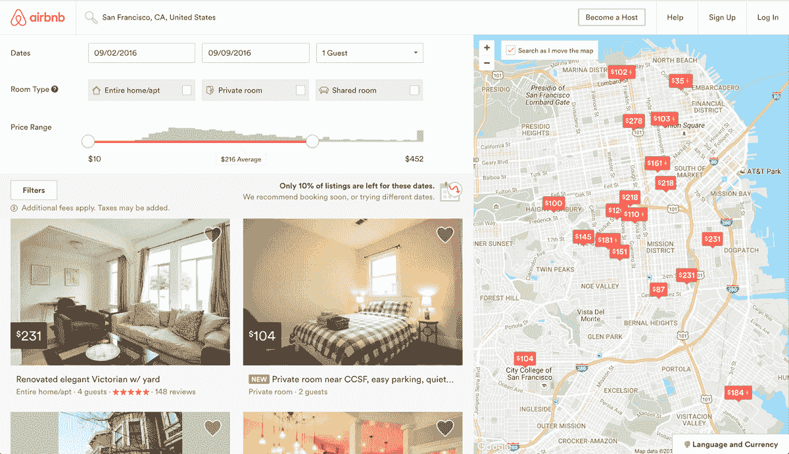
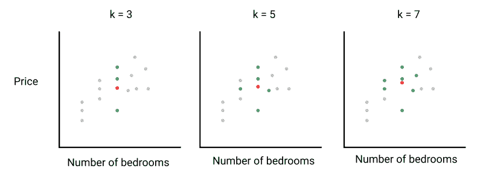
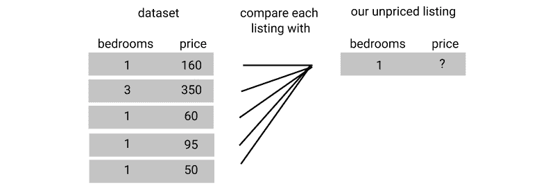
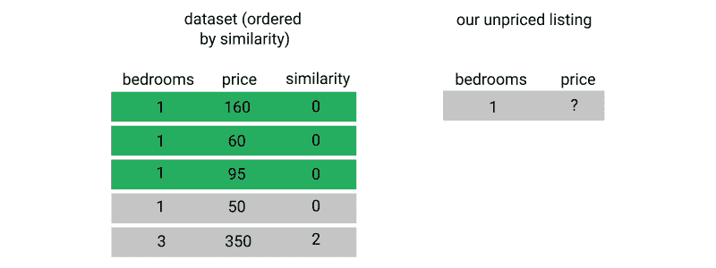
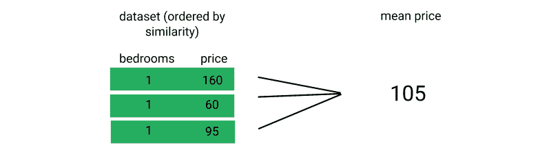
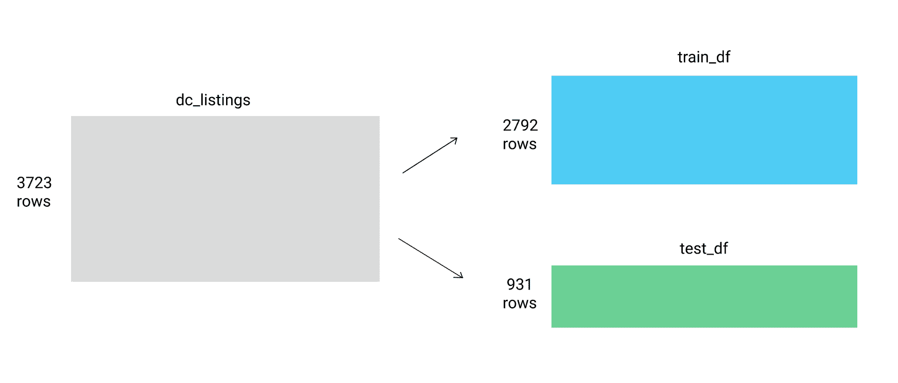
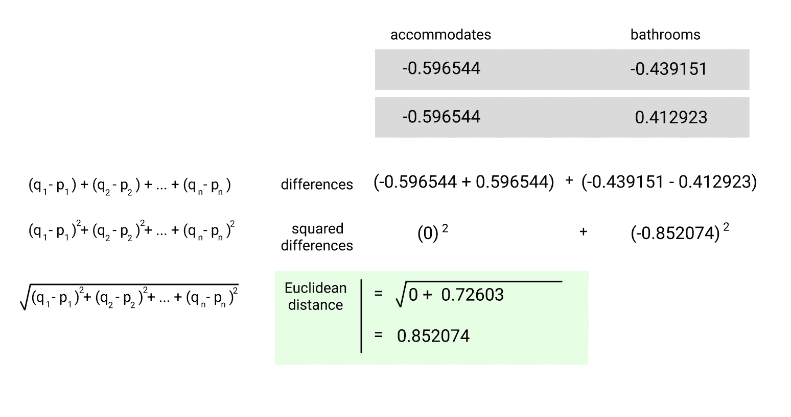

# Python 机器学习教程:预测 Airbnb 价格

> 原文：<https://www.dataquest.io/blog/machine-learning-tutorial/>

July 10, 2019

不可否认，机器学习是目前数据科学领域最热门的话题。这也是支撑一些最令人兴奋的技术领域的基本概念，如自动驾驶汽车和预测分析。2019 年 4 月，谷歌上机器学习的搜索量创下历史新高，此后人们的兴趣并没有下降多少。但实际上学习机器学习可能很难。你要么使用像“黑盒”一样的预建包，在那里你传递数据，魔法从另一端出来，要么你必须处理高级数学和线性代数。这两种方法都使机器学习变得具有挑战性和令人生畏。

本教程旨在向您介绍机器学习的基本概念。随着您的继续，您将从头开始构建您的第一个模型来进行预测，同时准确理解您的模型是如何工作的。

(本教程基于我们的[机器学习基础](https://www.dataquest.io/course/machine-learning-fundamentals)课程，该课程是我们[数据科学学习路径](https://www.dataquest.io/path/data-scientist)的一部分。本课程将深入介绍更多细节，并允许您以交互方式编写代码，这样您就可以边做边学。如果你对掌握机器学习非常感兴趣，我们建议你参加该课程以及我们的数据科学家之路中的其他机器学习课程。)

## 什么是机器学习？

简而言之，机器学习是建立系统的实践，称为**模型**，可以使用数据对其进行训练，以找到可以用于对新数据进行预测的模式。

与许多其他编程不同，机器学习模型是*而不是*一个基于规则的系统，其中一系列“if/then”语句用于确定结果(例如，“如果学生错过超过 50%的课程，则自动不及格”)。

相反，机器学习模型检查具有定义结果的数据集中的数据点之间的统计关系，然后应用它对这些关系的了解来分析和预测新数据集的结果。

#### 机器学习是如何工作的

为了更好地理解机器学习的基础知识，我们来看一个例子。假设我们要出售一栋房子，我们想确定一个合适的挂牌价格。我们可能做的——也是房地产经纪人实际做的——是查看我们地区已经售出的类似房屋。用机器学习的术语来说，我们观察的每栋房子都被称为一次**观察**。

对于每栋房子，我们都要考虑一些因素，比如房子的大小，有多少间卧室和浴室，离杂货店等便利设施有多远等等。在机器学习术语中，这些属性中的每一个都被称为**特征**。

一旦我们找到了一些相似的房子，我们就可以看看它们的售价，平均这些价格，并对我们自己的房子的价值做出一个相当合理的预测。


看看类似的房子可以帮你决定自己房子的价格。

在这个例子中，我们建立的“模型”是根据我们所在地区其他房屋的数据(观察数据)训练的，然后用来预测我们房子的价值。我们预测的价值，即价格，被称为**目标**变量。

当然，这个例子并不是真正的“机器学习”,因为我们根据自己房子的特点精心挑选了“观察”房屋进行研究。试图在更大范围内做这种事情——比如根据大量房地产数据预测城市中任何房屋的价格——对人类来说都是极其困难的。观察和特征越多，手动进行这种分析就越困难，也就越容易遗漏数据中重要但不明显的模式。

这就是机器学习的用武之地。一个真正的机器学习模型可以在更大的规模上做一些与我们的小房子预测模型非常相似的事情:

1.  检查过去房屋销售的大型数据集(观察)
2.  寻找房子的特征和价格(目标变量)之间的模式和统计关系，包括对查看数据的人来说可能不明显的模式
3.  使用这些统计关系和模式来预测我们提供数据的任何新房的价格。

我们将在本教程中建立的模型类似于我们上面概述的。我们将通过使用 Python 构建一个简单的模型来提供 Airbnb 公寓租赁价格建议。

(这篇文章假设你熟悉 Python 的`pandas`库——如果你需要温习熊猫，我们推荐我们的[两篇熊猫教程博文](https://www.dataquest.io/blog/pandas-python-tutorial/)或我们的互动 [Python 和熊猫课程](https://www.dataquest.io/course/pandas-fundamentals/)。)

## 预测 Airbnb 租赁价格

对于外行人来说，Airbnb 是一个短期房屋和公寓租赁的互联网市场。例如，它允许你在外出时将房子出租一周，或者将多余的卧室出租给旅行者。该公司自 2008 年成立以来发展迅速，估值接近 400 亿美元，目前市值超过世界上任何一家连锁酒店。

Airbnb 房东面临的一个挑战是确定最佳的每夜租金价格。在许多地区，潜在的租房者都有很好的房源可供选择，他们可以根据价格、卧室数量、房间类型等标准进行筛选。由于 Airbnb 是一个市场，房东每晚收取的费用与市场动态密切相关。以下是 Airbnb 上的搜索体验截图:



*Airbnb 搜索结果*

假设我们想在 Airbnb 上租一个房间。作为房东，如果我们试图收取高于市场价的价格，租房者会选择更实惠的替代品，我们就赚不到钱了。另一方面，如果我们把每晚的租金定得太低，我们就会错过潜在的收入。

如何才能击中中间的“甜蜜点”？我们可以使用的一个策略是:

*   找几个和我们相似的列表，
*   将与我们最相似的产品的标价平均一下，
*   并将我们的标价设置为这个计算出的平均价格。

但是一遍又一遍地手动操作会非常耗时，而我们是数据科学家！我们将建立一个机器学习模型来自动完成这一过程，而不是手动完成，该模型使用了一种叫做**k-最近邻**的技术。

我们首先来看看将要使用的数据集。

## 我们的 Airbnb 数据

Airbnb 不在其市场上发布任何房源数据，但 Airbnb 内部一个名为[的独立小组](http://insideairbnb.com/get-the-data.html)提取了该网站上许多主要城市的房源样本数据。在本帖中，我们将使用他们从 2015 年 10 月 3 日开始的数据集，处理来自美国首都华盛顿特区的房源。[这里有一个到数据集](http://data.insideairbnb.com/united-states/dc/washington-dc/2015-10-03/data/listings.csv.gz)的直接链接。

数据集中的每一行都是华盛顿特区 Airbnb 上可供租赁的特定房源。用机器学习的术语来说，每一行都是一个观察。这些列描述了每个列表的不同特征(机器学习术语中的特征)。

为了使数据集不那么麻烦，我们删除了原始数据集中的许多列，并将文件重命名为`dc_airbnb.csv`。

以下是我们希望使用的一些更重要的栏目(功能)，因为这些都是租赁者可能用来评估他们将选择哪个房源的特征:

*   租赁可以容纳的客人数量
*   `bedrooms`:租金中包含的卧室数量
*   `bathrooms`:租金中包含的浴室数量
*   `beds`:租金中包含的床位数
*   `price`:租金的夜间价格
*   `minimum_nights`:租赁期间客人可入住的最少天数
*   `maximum_nights`:租赁期间客人可入住的最大天数
*   `number_of_reviews`:之前客人留下的评论数量

我们首先将清理后的数据集读入 pandas，打印其大小并查看前几行。(如果你不确定如何自己从原始数据集中删除多余的列，[看看我们的一些熊猫和数据清理课程](https://www.dataquest.io/data-science-courses-directory/))。

```py
 import pandas as pd
dc_listings = pd.read_csv('dc_airbnb.csv')
print(dc_listings.shape)
dc_listings.head() 
```

```py
(3723, 19)
```

|  | 主机响应速率 | 主机接受率 | 主机列表计数 | 容纳 | 房间类型 | 卧室 | 浴室 | 床 | 价格 | 清洁 _ 费用 | 保证金 _ 押金 | 最少 _ 晚 | 最多 _ 晚 | 评论数量 | 纬度 | 经度 | 城市 | 邮政编码 | 状态 |
| --- | --- | --- | --- | --- | --- | --- | --- | --- | --- | --- | --- | --- | --- | --- | --- | --- | --- | --- | --- |
| Zero | 92% | 91% | Twenty-six | four | 整个住宅/公寓 | One | One | Two | $160.00 | $115.00 | $100.00 | one | One thousand one hundred and twenty-five | Zero | 38.890046 | -77.002808 | 华盛顿 | Twenty thousand and three | 直流电 |
| one | 90% | 100% | one | six | 整个住宅/公寓 | Three | Three | Three | $350.00 | $100.00 | 圆盘烤饼 | Two | Thirty | Sixty-five | 38.880413 | -76.990485 | 华盛顿 | Twenty thousand and three | 直流电 |
| Two | 90% | 100% | Two | one | 私室 | One | Two | One | $50.00 | 圆盘烤饼 | 圆盘烤饼 | Two | One thousand one hundred and twenty-five | one | 38.955291 | -76.986006 | 海兹维尔 | Twenty thousand seven hundred and eighty-two | 医学博士 |
| three | 100% | 圆盘烤饼 | one | Two | 私室 | One | One | One | $95.00 | 圆盘烤饼 | 圆盘烤饼 | one | One thousand one hundred and twenty-five | Zero | 38.872134 | -77.019639 | 华盛顿 | Twenty thousand and twenty-four | 直流电 |
| four | 92% | 67% | one | four | 整个住宅/公寓 | One | One | One | $50.00 | $15.00 | $450.00 | seven | One thousand one hundred and twenty-five | Zero | 38.996382 | -77.041541 | 银泉 | Twenty thousand nine hundred and ten | 医学博士 |

看起来不错！现在，让我们继续讨论我们将用于机器学习模型的算法。

## K-最近邻算法

K-最近邻(KNN)算法的工作方式类似于我们之前概述的三步过程，将我们的列表与类似的列表进行比较，并获取平均价格。让我们更详细地看一下:

**首先是**，我们选择想要比较的相似列表的数量`k`。

**其次**，我们需要使用相似性度量来计算每个列表与我们的列表有多相似。



**第三个**，我们使用相似性度量对每个列表进行排名，并选择第一个`k`列表。


**最后是**，我们计算了`k`个相似列表的平均价格，并将其作为我们的标价。

虽然为了简单起见，上面的图像只使用每个观察的两个特征(卧室和价格)来与我们的列表进行比较，但机器学习的妙处在于，我们可以通过评估每个观察的更多特征来进行更复杂的比较。

让我们通过定义将要使用的相似性度量来开始构建我们的真实模型。然后，我们将实现 k-nearest neighbors 算法，并使用它来建议新列表的价格。出于本教程的目的，我们将使用固定的`5`值`k`，但是一旦您熟悉了算法的工作流程，您就可以用这个值进行实验，看看是否使用更低或更高的`k`值可以获得更好的结果。

## 欧几里得距离

当试图预测像价格这样的连续值时，使用的主要相似性度量是**欧几里德距离**。欧几里德距离的一般公式是这样的:\(d = \sqrt{(q_1-p_1)^2+(q_2-p_2)^2+\ cdots+(q_n-p_n)^2}\)其中\(Q1 \)到\(qn \)表示一个观察值的特征值，而\(P1 \)到\(p n \)表示另一个观察值的特征值。

如果你的头爆炸了，不要担心！我们要把它分解成更小的部分。我们将从…开始

## 建立一个基本的 KNN 模型

让我们从分解事物开始，只看我们数据集中的一列。下面是一个特征的公式:\(d = \ sqrt {(Q1–p_1)^2} \)

平方根和平方幂抵消，公式简化为:\(d = | q _ 1–p _ 1 | \)

用文字来表达，我们希望找到观测值和数据点之间的差异的绝对值**来预测我们正在使用的特性。**

就我们目前的目的而言，假设我们想租的居住空间可以容纳三个人。

我们将首先使用`accommodates`特征计算数据集中第一个居住空间和我们自己居住空间之间的距离。我们可以使用 NumPy 函数`np.abs()`来获得绝对值。

```py
 import numpy as np
our_acc_value = 3
first_living_space_value = dc_listings.loc[0,'accommodates']
first_distance = np.abs(first_living_space_value - our_acc_value)
print(first_distance) 
```

```py
1
```

最小的欧几里德距离是零，这意味着我们要比较的观察结果和我们的是一样的，所以我们在这里得到的结果是有意义的。然而，孤立地看，这个值没有多大意义，除非我们知道它与其他值相比如何。让我们计算数据集中每个观察值的欧几里德距离，并使用`pd.value_counts()`查看我们拥有的值的范围。

```py
 dc_listings['distance'] = np.abs(dc_listings.accommodates - our_acc_value)
dc_listings.distance.value_counts().sort_index()
```

```py
 0     461
1     2294
2     503
3     279
4     35
5     73
6     17
7     22
8     7
9     12
10    2
11    4
12    6
13    8
Name: distance, dtype: int64
```

有 461 个列表的距离为`0`，因此容纳的人数与我们的列表相同。这些清单可能是一个很好的起点。

如果我们只使用距离为`0`的前五个值，我们的预测将偏向数据集的现有排序。相反，我们将随机排列观察值，然后选择距离为`0`的前五行。我们将使用`DataFrame.sample()`来随机化这些行。该方法通常用于选择数据帧的随机部分，但我们将告诉它随机选择 100%，这将为我们随机洗牌。

我们还将使用`random_state`参数，它只是给我们一个可重复的随机顺序，因此任何人都可以跟随并得到完全相同的结果。

```py
 dc_listings = dc_listings.sample(frac=1,random_state=0)
dc_listings = dc_listings.sort_values('distance')
dc_listings.price.head()
```

```py
 $75.002825    
$120.002145     
$90.002541     
$50.003349    
$105.00
Name: price, dtype: object
```

在我们计算价格的平均值之前，您会注意到我们的价格列具有`object`类型，因为价格有美元符号和逗号(我们上面的示例没有显示逗号，因为所有的值都小于 1000 美元)。

在计算前五个值的平均值之前，让我们通过删除这些字符并将其转换为`float`类型来清理该列。我们将使用熊猫的`Series.str.replace()`来删除杂散字符，并通过正则表达式`\$|,`来匹配`<center或`,`。

```py
 dc_listings['price'] = dc_listings.price.str.replace("\$|,",'').astype(float)
mean_price = dc_listings.price.iloc[:5].mean()
mean_price
```

```py
88.0
```

我们现在做出了第一个预测——我们的 KNN 模型告诉我们，当我们只使用`accommodates`功能为我们的三人列表找到一个合适的价格时，我们应该将我们的公寓列为 88.00 美元。

这是一个好的开始！问题是，我们没有任何办法知道这个模型有多精确，这就无法优化和改进。在没有评估其准确性的情况下，跟随任何机器学习模型的预测都不是一个好主意！

## 评估我们的模型

测试模型质量的一个简单方法是:

*   将数据集分成 2 个分区:
    *   一个**训练**集合:包含大多数行(75%)
    *   一个**测试**集合:包含剩余的少数行(25%)
*   使用训练集中的行来预测测试集中的行的`price`值
*   将预测值与测试集中的实际`price`值进行比较，看看预测值有多准确。

我们将遵循这种方法，将 3723 行数据集分成两部分:`train_df`和`test_df`，比例为 75%-25%。



*分割成训练和测试数据帧*

我们还将删除之前创建第一个模型时添加的列。

```py
 dc_listings.drop('distance',axis=1)
train_df = dc_listings.copy().iloc[:2792]
test_df = dc_listings.copy().iloc[2792:] 
```

为了在查看指标时让事情变得更简单，我们将把之前制作的模型合并到一个函数中。我们不需要担心随机化这些行，因为它们仍然是之前随机化的。

```py
 def predict_price(new_listing_value,feature_column):
    temp_df = train_df
    temp_df['distance'] = np.abs(dc_listings[feature_column] - new_listing_value)
    temp_df = temp_df.sort_values('distance')
    knn_5 = temp_df.price.iloc[:5]
    predicted_price = knn_5.mean()
    return(predicted_price)
```

我们现在可以使用这个函数来预测使用`accommodates`列的测试数据集的值。

```py
 test_df['predicted_price'] = test_df.accommodates.apply(predict_price,feature_column='accommodates') 
```

## 用 RMSE 来评估我们的模型

对于许多预测任务，我们希望更多地惩罚远离实际值的预测值，而不是更接近实际值的预测值。

为此，我们可以取平方误差值的平均值，这被称为**均方根误差** (RMSE)。下面是 RMSE 的公式:\(RMSE = \ sqrt { \ dfrac {(actual_1-predicted_1)^2+(actual_2-predicted_2)^2+\ cdots+(actual_n-predicted_n)^2 } { n } } \)其中`n`表示测试集中的行数。这个公式一开始可能看起来让人不知所措，但是我们所做的就是:

*   取每个预测值和实际值(或误差)之间的差，
*   将这个差值平方(平方)，
*   取所有平方差的平均值(平均值)，以及
*   取该平均值的平方根(根)。

因此，从下往上读:均方根误差。让我们计算我们在测试集上所做预测的 RMSE 值。

```py
 test_df['squared_error'] = (test_df['predicted_price'] - test_df['price'])**(2)
mse = test_df['squared_error'].mean()
rmse = mse ** (1/2)
rmse
```

```py
212.98927967051529
```

我们的 RMSE 大约是 213 美元。关于 RMSE 的一个方便的事情是，因为我们平方然后取平方根，RMSE 的单位与我们预测的值相同，这使得我们很容易理解我们的误差范围。

在这种情况下，规模相当大——我们离准确预测还相当远。

## 比较不同的模型

有了可以用来查看模型准确性的误差指标，让我们使用不同的列创建一些预测，并看看误差是如何变化的。

```py
 for feature in ['accommodates','bedrooms','bathrooms','number_of_reviews']:
    test_df['predicted_price'] = test_df.accommodates.apply(predict_price,feature_column=feature)
    test_df['squared_error'] = (test_df['predicted_price'] - test_df['price'])**(2)
    mse = test_df['squared_error'].mean()
    rmse = mse ** (1/2)
    print("RMSE for the {} column: {}".format(feature,rmse))
```

```py
 RMSE for the accommodates column: 212.9892796705153
RMSE for the bedrooms column: 216.49048609414766
RMSE for the bathrooms column: 216.89419042215704
RMSE for the number_of_reviews column: 240.2152831433485
```

我们可以看到，我们训练的四个模型中最好的模型是使用`accomodates`列的模型。

然而，相对于我们数据集中列表的价格范围，我们得到的错误率相当高。这种错误率的预测不会有很大帮助。

谢天谢地，我们还能做点什么！到目前为止，我们一直只用一个特征来训练我们的模型，这就是所谓的**单变量**模型。为了更准确，我们可以让它同时评估多个特征，这就是所谓的**多变量**模型。

我们将读入这个数据集的一个干净版本，以便我们可以专注于评估模型。在我们清理过的数据集中:

*   所有列都已转换为数值，因为我们无法计算带有非数字字符的值的欧几里德距离。
*   为简单起见，删除了非数字列。
*   任何缺少值的列表都已被删除。
*   我们已经对[列进行了规范化](https://en.wikipedia.org/wiki/Standard_score),这将为我们提供更准确的结果。

如果你想阅读更多关于数据清理和为机器学习准备数据的内容，你可以阅读优秀的帖子[为机器学习准备和清理数据](https://www.dataquest.io/blog/machine-learning-preparing-data/)。

让我们读入这个被清理的版本，它被称为`dc_airbnb.normalized.csv`，并预览前几行:

```py
 normalized_listings = pd.read_csv('dc_airbnb_normalized.csv')
print(normalized_listings.shape)
normalized_listings.head()
```

```py
(3671, 8)
```

|  | 容纳 | 卧室 | 浴室 | 床 | 价格 | 最少 _ 晚 | 最多 _ 晚 | 评论数量 |
| --- | --- | --- | --- | --- | --- | --- | --- | --- |
| Zero | -0.596544 | -0.249467 | -0.439151 | -0.546858 | One hundred and twenty-five | -0.341375 | -0.016604 | 4.579650 |
| one | -0.596544 | -0.249467 | 0.412923 | -0.546858 | Eighty-five | -0.341375 | -0.016603 | 1.159275 |
| Two | -1.095499 | -0.249467 | -1.291226 | -0.546858 | Fifty | -0.341375 | -0.016573 | -0.482505 |
| three | -0.596544 | -0.249467 | -0.439151 | -0.546858 | Two hundred and nine | 0.487635 | -0.016584 | -0.448301 |
| four | 4.393004 | 4.507903 | 1.264998 | 2.829956 | Two hundred and fifteen | -0.065038 | -0.016553 | 0.646219 |

然后，我们将随机化这些行，并将其分成训练和测试数据集。

```py
normalized_listings = normalized_listings.sample(frac=1,random_state=0)
norm_train_df = normalized_listings.copy().iloc[0:2792]
norm_test_df = normalized_listings.copy().iloc[2792:]
```

## 计算具有多个特征的欧氏距离

让我们再次提醒自己，最初的欧几里德距离方程是什么样子的:\(d = \sqrt{(q_1-p_1)^2+(q_2-p_2)^2+\ cdots+(q_n-p_n)^2}\)

我们将从构建一个使用`accommodates`和`bathrooms`特性的模型开始。在这种情况下，我们的欧几里得方程看起来像是:\(d = \sqrt{(accommodates_1-accommodates_2)^2+(bathrooms_1-bathrooms_2)^2 } \)

为了找到两个生活空间之间的距离，我们需要计算两个`accommodates`值之间的平方差，两个`bathrooms`值之间的平方差，将它们加在一起，然后取所得和的平方根。

下面是`normalized_listings`中前两行之间的欧几里德距离:



到目前为止，我们一直通过自己编写方程的逻辑来计算欧几里得距离。我们可以使用来自`scipy.spatial`的 [distance.euclidean()函数](https://docs.scipy.org/doc/scipy-0.14.0/reference/generated/scipy.spatial.distance.euclidean.html)，它接受两个向量作为参数，并计算它们之间的欧氏距离。`euclidean()`函数期望:

*   两个向量都使用类似于列表的对象来表示(Python 列表、NumPy 数组或 pandas 系列)
*   这两个向量必须是一维的，并且具有相同数量的元素

让我们使用`euclidean()`函数来计算我们要练习的数据集中第一行和第五行之间的欧几里德距离。

```py
 from scipy.spatial import distance
first_listing = normalized_listings.iloc[0][['accommodates', 'bathrooms']]
fifth_listing = normalized_listings.iloc[20][['accommodates', 'bathrooms']]
first_fifth_distance = distance.euclidean(first_listing, fifth_listing)
first_fifth_distance
```

```py
0.9979095531766813
```

## 创建多元 KNN 模型

我们可以扩展之前的函数，使用两个特征和整个数据集。我们将使用 [`distance.cdist()`](https://docs.scipy.org/doc/scipy/reference/generated/scipy.spatial.distance.cdist.html) 而不是`distance.euclidean()`，因为它允许我们一次传递多行。

(`cdist()`方法可用于使用多种方法计算距离，但它默认为欧几里得。)

```py
 def predict_price_multivariate(new_listing_value,feature_columns):
    temp_df = norm_train_df
    temp_df['distance'] = distance.cdist(temp_df[feature_columns],[new_listing_value[feature_columns]])
    temp_df = temp_df.sort_values('distance')
    knn_5 = temp_df.price.iloc[:5]
    predicted_price = knn_5.mean()
    return(predicted_price)cols = ['accommodates', 'bathrooms']

norm_test_df['predicted_price'] = norm_test_df[cols].apply(predict_price_multivariate,feature_columns=cols,axis=1)
norm_test_df['squared_error'] = (norm_test_df['predicted_price'] - norm_test_df['price'])**(2)
mse = norm_test_df['squared_error'].mean()
rmse = mse ** (1/2)
print(rmse)
```

```py
122.702007943
```

你可以看到，当使用两个特性而不是仅仅使用`accommodates`时，我们的 RMSE 从 212 提高到了 122。这是一个巨大的进步，尽管它仍然不像我们希望的那样准确。

## scikit 简介-了解

我们一直在从头开始编写函数来训练我们的 k 近邻模型。这有助于理解机制是如何工作的，但是现在我们理解了底层的基本原理，我们可以使用 Python 的`scikit-learn`库更快更有效地工作。

[Scikit-learn](https://scikit-learn.org/) 是 Python 中最流行的机器学习库。它内置了所有主要机器学习算法的功能和一个简单、统一的工作流程。这两个属性都允许数据科学家在新数据集上训练和测试不同模型时具有难以置信的生产力。

scikit-learn 工作流程包括四个主要步骤:

*   实例化您想要使用的特定机器学习模型。
*   使模型符合训练数据。
*   使用模型进行预测。
*   评估预测的准确性。

scikit-learn 中的每个模型都是作为一个单独的类实现的，第一步是确定我们想要创建的类的实例。

任何帮助我们预测数值的模型，比如我们模型中的标价，都被称为**回归**模型。机器学习模型的另一个主要类别叫做**分类**。当我们试图从一组固定的标签(例如，血型或性别)中预测一个标签时，会使用分类模型。

在我们的例子中，我们想要使用 [KNeighborsRegressor 类](https://scikit-learn.org/stable/modules/generated/sklearn.neighbors.KNeighborsRegressor.html#sklearn.neighbors.KNeighborsRegressor)。来自类名`KNeighborsRegressor`的单词 **regressor** 指的是我们刚刚讨论过的回归模型类，而“KNeighbors”来自我们正在构建的 k-nearest neighbors 模型。

Scikit-learn 使用类似于 Matplotlib 的面向对象风格。我们需要通过调用构造函数在做任何事情之前实例化一个空模型。

```py
 from sklearn.neighbors import KNeighborsRegressor
knn = KNeighborsRegressor() 
```

如果我们参考[文档](https://scikit-learn.org/stable/modules/generated/sklearn.neighbors.KNeighborsRegressor.html#sklearn.neighbors.KNeighborsRegressor)，我们会注意到默认情况下:

*   `n_neighbors`:邻居数量，设置为`5`
*   `algorithm`:计算最近邻，设为`auto`
*   `p`:设置为`2`，对应欧几里德距离

让我们将`algorithm`参数设置为`brute`，并将`n_neighbors`值保留为`5`，这与我们构建的手动实现相匹配。

```py
 from sklearn.neighbors import KNeighborsRegressor
knn = KNeighborsRegressor(algorithm='brute') 
```

## 拟合模型并进行预测

现在，我们可以使用[拟合方法](https://scikit-learn.org/stable/modules/generated/sklearn.neighbors.KNeighborsRegressor.html#sklearn.neighbors.KNeighborsRegressor.fit)来拟合模型和数据。对于所有模型，`fit`方法接受两个必需的参数:

*   一个类似矩阵的对象，包含我们要从训练集中使用的特征列。
*   一个类似列表的对象，包含正确的目标值。

“类矩阵对象”意味着该方法是灵活的，可以接受熊猫数据帧或 NumPy 2D 数组。这意味着我们可以从 DataFrame 中选择想要使用的列，并将其用作`fit`方法的第一个参数。

对于第二个参数，回想一下前面的内容，以下所有内容都是可接受的类似列表的对象:

*   数字阵列
*   Python 列表
*   熊猫系列对象(如圆柱)

让我们从数据帧中选择目标列，并将其用作`fit`方法的第二个参数:

```py
knn.fit(train_features, train_target)
```

当调用`fit()`方法时，scikit-learn 将我们指定的训练数据存储在 KNearestNeighbors 实例(`knn`)中。如果我们试图将包含缺失值或非数值的数据传入`fit`方法，scikit-learn 将返回一个错误。这是这个库的奇妙之处之一——它包含许多这样的功能来防止我们犯错误。

现在我们已经指定了我们想要用来进行预测的训练数据，我们可以使用[预测方法](https://scikit-learn.org/stable/modules/generated/sklearn.neighbors.KNeighborsRegressor.html#sklearn.neighbors.KNeighborsRegressor.predict)来对测试集进行预测。`predict`方法只有一个必需的参数:

*   一个类似矩阵的对象，包含我们要对其进行预测的数据集的特征列

我们在训练和测试期间使用的特性列数需要匹配，否则 scikit-learn 将返回错误。

```py
predictions = knn.predict(test_features)
```

`predict()`方法返回一个 NumPy 数组，包含测试集的预测值`price`。

我们现在拥有了练习整个 scikit-learn 工作流程所需的一切:

```py
 knn.fit(norm_train_df[cols], norm_train_df['price'])
two_features_predictions = knn.predict(norm_test_df[cols]) 
```

当然，仅仅因为我们使用 scikit-learn 而不是手动编写函数，并不意味着我们可以跳过评估步骤来看看我们的模型的预测实际上有多准确！

## 使用 Scikit-Learn 计算 MSE

到目前为止，我们一直使用 NumPy 和 SciPy 函数来帮助我们手动计算 RMSE 值。或者，我们可以使用[sk learn . metrics . mean _ squared _ error 函数()](https://scikit-learn.org/stable/modules/generated/sklearn.metrics.mean_squared_error.html#sklearn.metrics.mean_squared_error)。

`mean_squared_error()`函数接受两个输入:

*   一个类似列表的对象，代表测试集中的真实值。
*   第二个类似列表的对象，表示由模型生成的预测值。

```py
 from sklearn.metrics import mean_squared_error
two_features_mse = mean_squared_error(norm_test_df['price'], two_features_predictions)
two_features_rmse = two_features_mse ** (1/2)
print(two_features_rmse) 
```

```py
124.834722314
```

这不仅从语法角度来看要简单得多，而且由于 scikit-learn 已经针对速度进行了大量优化，因此模型运行所需的时间也更少。

请注意，我们的 RMSE 与我们手动实现的算法略有不同——这可能是由于我们的“手动”KNN 算法与 scikit-learn 版本在随机化方面的差异以及实现方面的细微差异。

请注意，对 scikit-learn 库本身的更改也会在一定程度上影响这些值。如果您按照本教程学习并得到了稍微不同的结果，很可能是因为您使用了 scikit-learn 的新版本。

## 使用更多功能

scikit-learn 最棒的一点是它允许我们更快地迭代。让我们通过创建一个使用四个特征而不是两个特征的模型来尝试一下，看看这是否会改善我们的结果。

```py
knn = KNeighborsRegressor(algorithm='brute')
cols = ['accommodates','bedrooms','bathrooms','beds']
knn.fit(norm_train_df[cols], norm_train_df['price'])
four_features_predictions = knn.predict(norm_test_df[cols])
four_features_mse = mean_squared_error(norm_test_df['price'], four_features_predictions)
four_features_rmse = four_features_mse ** (1/2)
four_features_rmse
```

```py
120.92729413345498
```

在这种情况下，我们的误差略有下降。不过，当你添加新功能时，可能并不总是这样。需要注意的一件重要事情是:添加更多的特性并不一定会产生更精确的模型。

这是因为添加一个不能准确预测目标变量的特征会给模型增加“噪音”。

## 摘要

让我们来看看我们学到了什么:

*   我们学习了什么是机器学习，并通过一个非常基本的手动“模型”来预测房屋的销售价格。
*   我们学习了 k-最近邻算法，在 Python 中从头开始构建了一个单变量模型(只有一个要素)，并使用它进行预测。
*   我们了解到，RMSE 可以用来计算我们模型的误差，然后我们可以用它来迭代并尝试改进我们的预测。
*   然后，我们从头开始创建了一个多变量(不止一个特征)模型，并使用它来进行更好的预测。
*   最后，我们学习了 scikit-learn 库，并使用了`KNeighborsRegressor`类来进行预测。

## 后续步骤

如果你想了解更多，本教程基于我们的 Dataquest [机器学习基础](https://www.dataquest.io/course/machine-learning-fundamentals)课程，这是我们[数据科学学习路径](https://www.dataquest.io/path/data-scientist)的一部分。该课程更为详细，并对本文中构建的模型进行了改进，同时允许您在浏览器中编写代码，每一步都由我们的答案检查系统进行检查，以确保您做的一切都是正确的。


如果您想自己继续研究这个模型，您可以做以下几件事来提高准确性:

*   尝试用不同的值代替`k`。
*   回到原始数据集，将我们移除的一些列转换为数字(我们的[准备和清理机器学习数据](https://www.dataquest.io/blog/machine-learning-preparing-data/)帖子将在这里帮助你)，并尝试添加不同的功能组合。
*   尝试一些**功能工程**，在那里你基于现有数据创建新的专栏:我们的[开始使用 Kaggle:房价竞争](https://www.dataquest.io/blog/kaggle-getting-started/)文章有一个简单的例子。

*本帖更新于 2019 年 7 月。*


## 获取免费的数据科学资源

免费注册获取我们的每周时事通讯，包括数据科学、 **Python** 、 **R** 和 **SQL** 资源链接。此外，您还可以访问我们免费的交互式[在线课程内容](/data-science-courses)！

[SIGN UP](https://app.dataquest.io/signup)