# 如何用 Python 生成 FiveThirtyEight 图

> 原文：<https://www.dataquest.io/blog/making-538-plots/>

September 5, 2017

如果你阅读数据科学的文章，你可能已经偶然发现了 [FiveThirtyEight 的](https://fivethirtyeight.com/)内容。自然，你会被他们[令人敬畏的可视化效果](https://fivethirtyeight.com/features/the-52-best-and-weirdest-charts-we-made-in-2016/)所打动。你想做出自己的令人敬畏的可视化效果，于是问 [Quora](https://www.quora.com/How-does-FiveThirtyEight-create-their-data-visualizations) 和 [Reddit](https://www.reddit.com/r/statistics/comments/2jon2b/anyone_knows_how_are_made_the_graphs_on/) 如何做到这一点。你收到了一些答案，但它们相当模糊。你还是不能自己完成图表。在这篇文章中，我们将帮助你。使用 Python 的 [matplotlib](https://matplotlib.org/index.html#) 和 [pandas](https://pandas.pydata.org/pandas-docs/stable/index.html) ，我们将看到复制任何 FiveThirtyEight (FTE)可视化的核心部分是相当容易的。我们将从这里开始: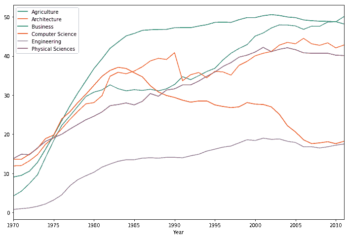，在本教程结束时，到达这里: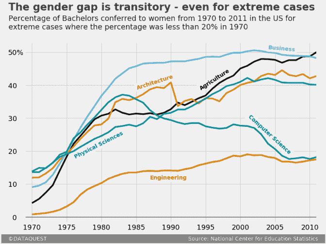要继续学习，您至少需要一些 Python 的基础知识。如果您知道方法和属性之间的区别，那么您就可以开始了。

## 数据集介绍

我们将使用描述 1970 年至 2011 年美国女性获得学士学位的比例的数据。我们将使用由数据科学家编辑的数据集

[兰德尔·奥尔森](https://www.randalolson.com/2014/06/14/percentage-of-bachelors-degrees-conferred-to-women-by-major-1970-2012/)，他从[国家教育统计中心](https://nces.ed.gov/about/)收集数据。如果你想继续自己写代码，你可以从 Randal 的博客下载数据。为了节省您的时间，您可以跳过下载文件，直接传递到 pandas 的`read_csv()` [函数](https://pandas.pydata.org/pandas-docs/stable/generated/pandas.read_csv.html?highlight=read_csv#pandas.read_csv)中。在下面的代码单元格中，我们:

*   导入熊猫模块。
*   将指向数据集的直接链接作为`string`分配给名为`direct_link`的变量。
*   使用`read_csv()`读入数据，并将内容分配给`women_majors`。
*   使用`info()` [方法](https://pandas.pydata.org/pandas-docs/stable/generated/pandas.DataFrame.info.html?highlight=dataframe%20info#pandas.DataFrame.info)打印关于数据集的信息。我们寻找行数和列数，同时检查空值。
*   通过使用`head()` [方法](https://pandas.pydata.org/pandas-docs/stable/generated/pandas.DataFrame.head.html?highlight=dataframe%20head#pandas.DataFrame.head)，显示前五行以更好地理解数据集的结构。

```py
 import pandas as pd
direct_link = 'https://www.randalolson.com/wp-content/uploads/percent-bachelors-degrees-women-usa.csv'
women_majors = pd.read_csv(direct_link)
print(women_majors.info())
women_majors.head() 
```

```py
 RangeIndex: 42 entries, 0 to 41
Data columns (total 18 columns):
Year                             42 non-null int64
Agriculture                      42 non-null float64
Architecture                     42 non-null float64
Art and Performance              42 non-null float64
Biology                          42 non-null float64
Business                         42 non-null float64
Communications and Journalism    42 non-null float64
Computer Science                 42 non-null float64
Education                        42 non-null float64
Engineering                      42 non-null float64
English                          42 non-null float64
Foreign Languages                42 non-null float64
Health Professions               42 non-null float64
Math and Statistics              42 non-null float64
Physical Sciences                42 non-null float64
Psychology                       42 non-null float64
Public Administration            42 non-null float64
Social Sciences and History      42 non-null float64
dtypes: float64(17), int64(1)
memory usage: 6.0 KB
None 
```

|  | 年 | 农业 | 体系结构 | 艺术和表演 | 生物 | 商业 | 通信和新闻 | 计算机科学 | 教育 | 工程 | 英语 | 外语 | 健康职业 | 数学和统计学 | 自然科学 | 心理学 | 公共行政 | 社会科学和历史 |
| --- | --- | --- | --- | --- | --- | --- | --- | --- | --- | --- | --- | --- | --- | --- | --- | --- | --- | --- |
| Zero | One thousand nine hundred and seventy | 4.229798 | 11.921005 | Fifty-nine point seven | 29.088363 | 9.064439 | Thirty-five point three | Thirteen point six | 74.535328 | Zero point eight | 65.570923 | Seventy-three point eight | Seventy-seven point one | Thirty-eight | Thirteen point eight | Forty-four point four | Sixty-eight point four | Thirty-six point eight |
| one | One thousand nine hundred and seventy-one | 5.452797 | 12.003106 | Fifty-nine point nine | 29.394403 | 9.503187 | Thirty-five point five | Thirteen point six | 74.149204 | One | 64.556485 | Seventy-three point nine | Seventy-five point five | Thirty-nine | Fourteen point nine | Forty-six point two | Sixty-five point five | Thirty-six point two |
| Two | One thousand nine hundred and seventy-two | 7.420710 | 13.214594 | Sixty point four | 29.810221 | 10.558962 | Thirty-six point six | Fourteen point nine | 73.554520 | One point two | 63.664263 | Seventy-four point six | Seventy-six point nine | Forty point two | Fourteen point eight | Forty-seven point six | Sixty-two point six | Thirty-six point one |
| three | One thousand nine hundred and seventy-three | 9.653602 | 14.791613 | Sixty point two | 31.147915 | 12.804602 | Thirty-eight point four | Sixteen point four | 73.501814 | one point six | 62.941502 | Seventy-four point nine | Seventy-seven point four | Forty point nine | Sixteen point five | Fifty point four | Sixty-four point three | Thirty-six point four |
| four | One thousand nine hundred and seventy-four | 14.074623 | 17.444688 | Sixty-one point nine | 32.996183 | 16.204850 | Forty point five | Eighteen point nine | 73.336811 | Two point two | 62.413412 | Seventy-five point three | Seventy-seven point nine | Forty-one point eight | Eighteen point two | Fifty-two point six | Sixty-six point one | Thirty-seven point three |

除了

`Year`栏，每隔一栏的名称表示该科目的学士学位。学士栏中的每个数据点代表授予女性学士学位的百分比。因此，每一行都描述了某一年授予妇女的各种学士的百分比。如前所述，我们有 1970 年至 2011 年的数据。为了确认后一个限制，让我们使用`tail()` [方法](https://pandas.pydata.org/pandas-docs/stable/generated/pandas.DataFrame.tail.html?highlight=tail#pandas.DataFrame.tail)打印数据集的最后五行:

```py
women_majors.tail()
```

|  | 年 | 农业 | 体系结构 | 艺术和表演 | 生物 | 商业 | 通信和新闻 | 计算机科学 | 教育 | 工程 | 英语 | 外语 | 健康职业 | 数学和统计学 | 自然科学 | 心理学 | 公共行政 | 社会科学和历史 |
| --- | --- | --- | --- | --- | --- | --- | --- | --- | --- | --- | --- | --- | --- | --- | --- | --- | --- | --- |
| Thirty-seven | Two thousand and seven | 47.605026 | 43.100459 | Sixty-one point four | 59.411993 | 49.000459 | Sixty-two point five | Seventeen point six | 78.721413 | Sixteen point eight | 67.874923 | Seventy point two | Eighty-five point four | Forty-four point one | Forty point seven | Seventy-seven point one | Eighty-two point one | Forty-nine point three |
| Thirty-eight | Two thousand and eight | 47.570834 | 42.711730 | Sixty point seven | 59.305765 | 48.888027 | Sixty-two point four | Seventeen point eight | 79.196327 | Sixteen point five | 67.594028 | Seventy point two | Eighty-five point two | Forty-three point three | Forty point seven | Seventy-seven point two | Eighty-one point seven | Forty-nine point four |
| Thirty-nine | Two thousand and nine | 48.667224 | 43.348921 | Sixty-one | 58.489583 | 48.840474 | Sixty-two point eight | Eighteen point one | 79.532909 | Sixteen point eight | 67.969792 | Sixty-nine point three | Eighty-five point one | Forty-three point three | Forty point seven | Seventy-seven point one | Eighty-two | Forty-nine point four |
| Forty | Two thousand and ten | 48.730042 | 42.066721 | Sixty-one point three | 59.010255 | 48.757988 | Sixty-two point five | Seventeen point six | 79.618625 | Seventeen point two | 67.928106 | Sixty-nine | Eighty-five | Forty-three point one | Forty point two | Seventy-seven | Eighty-one point seven | Forty-nine point three |
| Forty-one | Two thousand and eleven | 50.037182 | 42.773438 | Sixty-one point two | 58.742397 | 48.180418 | Sixty-two point two | Eighteen point two | 79.432812 | Seventeen point five | 68.426730 | Sixty-nine point five | Eighty-four point eight | Forty-three point one | Forty point one | Seventy-six point seven | Eighty-one point nine | Forty-nine point two |

## 我们的 538 图的上下文

几乎每个 FTE 图都是一篇文章的一部分。图表通过说明一个小故事或一个有趣的想法来补充正文。在复制我们的 FTE 图表时，我们需要注意这一点。为了避免偏离本教程的主要任务，让我们假设我们已经写了一篇关于美国教育中性别差异演变的文章的大部分。我们现在需要创建一个图表来帮助读者形象化单身汉性别差异的演变，在 1970 年，这种情况对女性来说非常糟糕。我们已经设定了 20%的门槛，现在我们想绘制出 1970 年女性毕业生比例低于 20%的每个单身汉的变化图。我们先来识别一下那些具体的光棍。在下面的代码单元格中，我们将:

*   使用`.loc`，一个[基于标签的索引器](https://pandas.pydata.org/pandas-docs/stable/generated/pandas.DataFrame.loc.html?highlight=loc#pandas.DataFrame.loc)，来:
    *   选择第一行(对应于 1970 年的那一行)；
    *   仅选择第一行中值小于 20 的项目；字段`Year`也将被检查，但显然不会被包括在内，因为 1970 年比 20 年大得多。
*   将结果内容分配给`under_20`。

```py
 under_20 = women_majors.loc[0, women_majors.loc[0] < 20]
under_20
```

```py
 Agriculture           4.229798
Architecture         11.921005
Business              9.064439
Computer Science     13.600000
Engineering           0.800000
Physical Sciences    13.800000
Name: 0, dtype: float64
```

## 使用 matplotlib 的默认样式

让我们开始制作图表。我们将首先看一下默认情况下我们可以构建什么。在下面的代码块中，我们将:

*   运行 Jupyter magic `%matplotlib`到[使 Jupyter 和 matplotlib 有效地协同工作](https://ipython.readthedocs.io/en/stable/interactive/plotting.html#id1)，并添加`inline`使我们的图形显示在笔记本内。
*   在`women_majors`上使用`plot()` [方法](https://pandas.pydata.org/pandas-docs/stable/generated/pandas.DataFrame.plot.html?highlight=plot#pandas.DataFrame.plot)绘制图形。我们向`plot()`传递以下参数:
    *   `x`–从`women_majors`中指定用于 x 轴的列；
    *   `y`–从`women_majors`中指定用于 y 轴的列；我们将使用存储在该对象的`.index`属性中的`under_20`的索引标签；
    *   `figsize`–将图形尺寸设置为`tuple`，格式为`(width, height)`，单位为英寸。
*   将 plot 对象分配给一个名为`under_20_graph`的变量，并打印其类型以显示 pandas 在遮光罩下使用了`matplotlib`对象。

```py
 under_20_graph = women_majors.plot(x = 'Year', y = under_20.index, figsize = (12,8))
print('Type:', type(under_20_graph)) 
```

```py
Type: <class 'matplotlib.axes._subplots.AxesSubplot'>
```

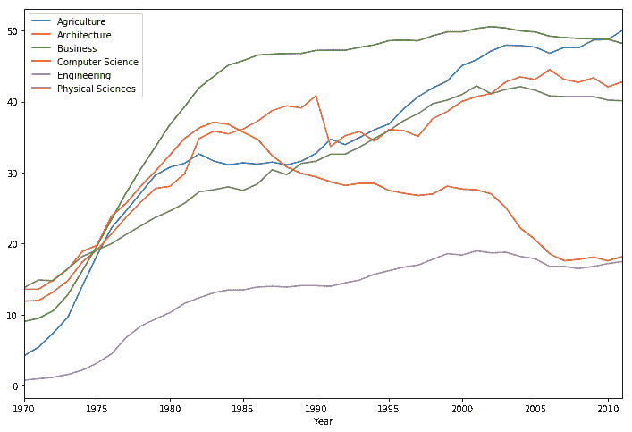

## 使用 matplotlib 的 fivethirtyeight 样式

上图有一些特定的特征，比如书脊的宽度和颜色，y 轴标签的字体大小，没有网格等等。所有这些特征构成了 matplotlib 的默认风格。作为一个简短的插入语，值得一提的是，在这篇文章中，我们将使用一些关于图形部分的技术术语。如果你在任何一点上感到迷茫，可以参考下面的图例。

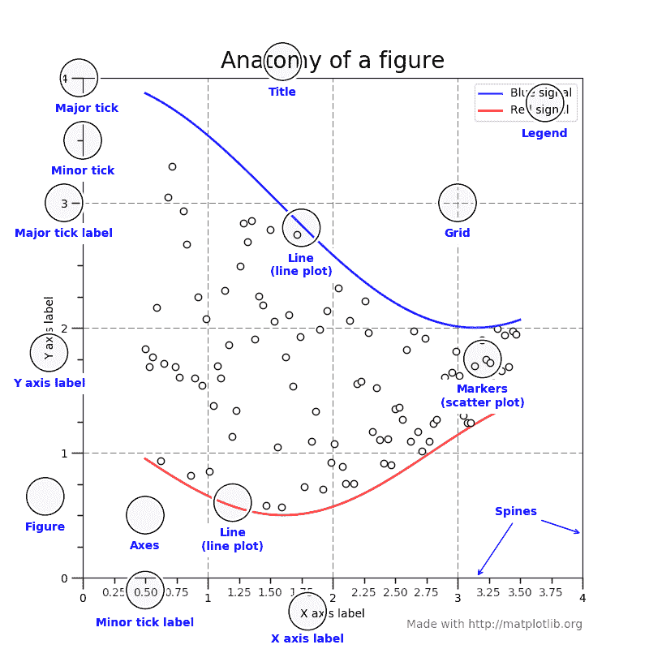

资料来源: [Matplotlib.org](https://matplotlib.org/faq/usage_faq.html#parts-of-a-figure)

除了默认样式之外，matplotlib 还附带了几个我们可以随时使用的内置样式。要查看可用样式的列表，我们将:

*   以`style`的名字导入`matplotlib.style` [模块](https://matplotlib.org/api/style_api.html?highlight=style%20available#module-matplotlib.style)。
*   探索`matplotlib.style.available`(该模块的预定义变量)的内容，它包含所有可用内置样式的列表。

```py
import matplotlib.style as style
style.available
```

```py
 ['seaborn-deep', 
'seaborn-muted', 
'bmh', 
'seaborn-white', 
'dark_background', 
'seaborn-notebook', 
'seaborn-darkgrid', 
'grayscale', 
'seaborn-paper', 
'seaborn-talk', 
'seaborn-bright',
'classic', 
'seaborn-colorblind', 
'seaborn-ticks', 
'ggplot', 
'seaborn', 
'_classic_test', 
'fivethirtyeight', 
'seaborn-dark-palette', 
'seaborn-dark', 
'seaborn-whitegrid', 
'seaborn-pastel', 
'seaborn-poster'] 
```

你可能已经注意到有一种内置的风格叫做

`fivethirtyeight`。让我们使用这种风格，看看会有什么结果。为此，我们将使用来自同一个`matplotlib.style`模块(我们以名称`style`导入该模块)的恰当命名的`use()` [函数](https://matplotlib.org/api/style_api.html?highlight=style%20available#matplotlib.style.use)。然后，我们将使用与前面相同的代码来生成我们的图表。

```py
 style.use('fivethirtyeight')
women_majors.plot(x = 'Year', y = under_20.index, figsize = (12,8))
```

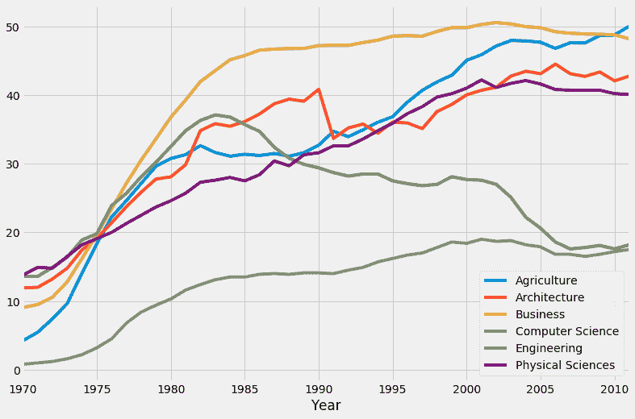哇，这是一个重大变化！关于我们的第一个图表，我们可以看到这个有不同的背景颜色，它有网格线，没有任何刺，主要刻度标签的粗细和字体大小不同，等等。你可以在这里阅读`fivethirtyeight`风格[的技术描述](https://github.com/matplotlib/matplotlib/blob/38be7aeaaac3691560aeadafe46722dda427ef47/lib/matplotlib/mpl-data/stylelib/fivethirtyeight.mplstyle)——它也应该让你很好地了解当我们使用这种风格时，什么代码在幕后运行。样式表的作者[卡梅隆大卫-皮隆](https://github.com/CamDavidsonPilon)，在这里讨论了一些特征[。](https://dataorigami.net/blogs/napkin-folding/17543615-replicating-538s-plot-styles-in-matplotlib)

## matplotlib 的 fivethirtyeight 风格的局限性

总而言之，使用

很明显，风格让我们离目标更近了。尽管如此，仍有许多工作要做。让我们检查一个简单的 FTE 图，看看我们还需要添加什么。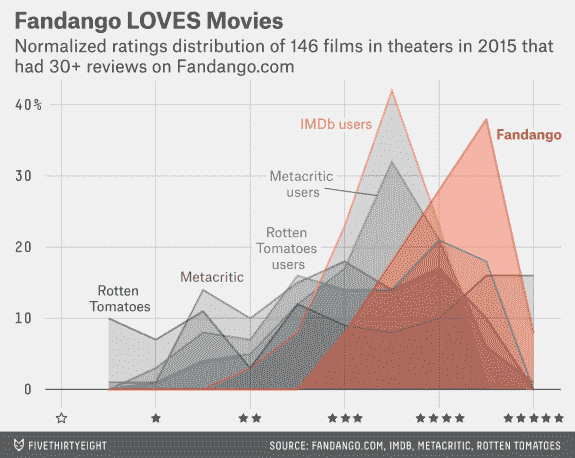

来源:[538](https://fivethirtyeight.com/features/fandango-movies-ratings/)

通过将上面的图表与我们到目前为止所做的比较，我们可以看到我们仍然需要:

*   添加标题和副标题。
*   删除块样式图例，并在相关地块线附近添加标签。我们还必须使这些标签周围的网格线透明。
*   添加一个签名栏，注明图表作者和数据来源。
*   添加一些其他的小调整:
    *   增加刻度标签的字体大小；
    *   将“%”符号添加到 y 轴的一个主要刻度标签上；
    *   移除 x 轴标签；
    *   在 y = 0 处加粗水平网格线；
    *   在 y 轴刻度标签旁边添加一条额外的网格线；
    *   增加图的横向边距。

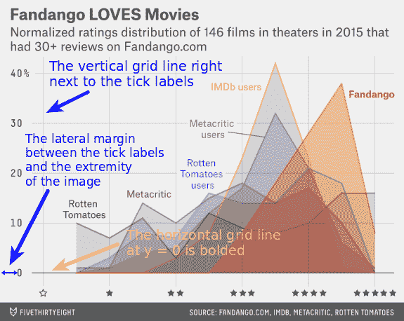

来源:[538](https://fivethirtyeight.com/features/fandango-movies-ratings/)

为了最大限度地减少生成图表所花费的时间，避免开始添加标题、副标题或任何其他文本片段是很重要的。在 matplotlib 中，通过指定 x 和 y 坐标来定位文本片段，我们将在下面的一些章节中看到。要详细复制上面的 FTE 图，请注意，我们必须将 y 轴的刻度标签与标题和副标题垂直对齐。我们希望避免这样的情况:我们得到了想要的垂直对齐方式，但由于增加了刻度标签的字体大小而丢失了它，然后不得不再次更改标题和副标题的位置。

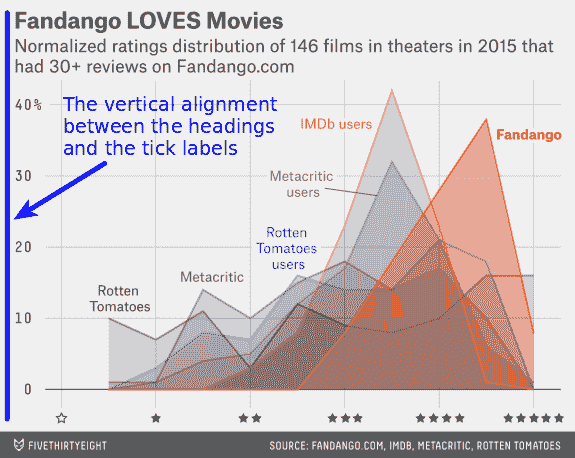

来源:[538](https://fivethirtyeight.com/features/fandango-movies-ratings/)

出于教学目的，我们现在将逐步调整我们的 FTE 图。因此，我们的代码将跨越多个代码单元。然而，在实践中，将需要不超过一个代码单元。

## 自定义刻度标签

我们将从增加刻度标签的字体大小开始。在下面的代码单元格中，我们:

*   使用与前面相同的代码绘制图形，并将结果对象分配给`fte_graph`。给一个变量赋值允许我们重复而容易地在对象上应用方法，或者访问它的属性。
*   使用带有以下参数的`tick_params()` [方法](https://matplotlib.org/api/_as_gen/matplotlib.axes.Axes.tick_params.html?highlight=tick_params#matplotlib.axes.Axes.tick_params)增加所有主要刻度标签的字体大小:
    *   `axis`–指定我们要修改的刻度标签所属的轴；这里我们要修改两个轴的*刻度标签；*
    *   `which`–指示受影响的刻度标签(主要标签或次要标签；不知道区别的见前面展示的图例)；
    *   `labelsize`–设置刻度标签的字体大小。

```py
 fte_graph = women_majors.plot(x = 'Year', y = under_20.index, figsize = (12,8))
fte_graph.tick_params(axis = 'both', which = 'major', labelsize = 18)
```

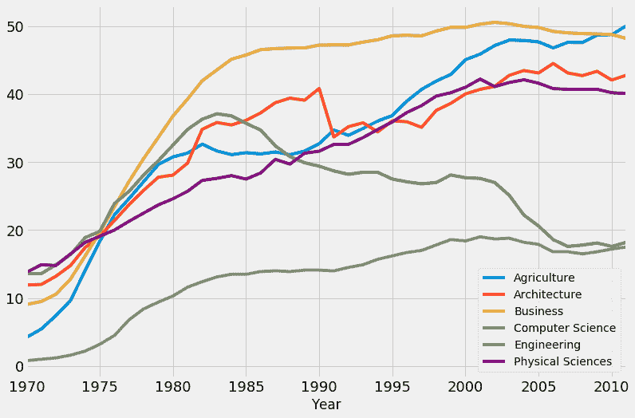你可能注意到了，这次我们没有用`style.use('fivethirtyeight')`。这是因为对任何 matplotlib 样式的偏好一旦在我们的代码中第一次声明就会变成全局的。我们之前已经将样式设置为`fivethirtyeight`，从那以后所有的图形都继承了这个样式。如果出于某种原因你想回到默认状态，只需运行`style.use('default')`。现在，我们将在前面更改的基础上，对 y 轴的刻度标签进行一些调整:

*   我们在 y 轴的最高可见刻度标签 50 上添加一个“%”符号。
*   我们还在其他可见标签后添加了一些空白字符，以使它们与新的“50%”标签优雅地对齐。

为了对 y 轴的刻度标签进行这些更改，我们将使用

`set_yticklabels()` [方法](https://matplotlib.org/api/_as_gen/matplotlib.axes.Axes.set_yticklabels.html?highlight=set_yticklabels#matplotlib.axes.Axes.set_yticklabels)连同`label`参数。从下面的代码可以推断，这个参数可以接受一个混合数据类型的列表，并且不需要传递任何固定数量的标签。

```py
 # The previous code
fte_graph = women_majors.plot(x = 'Year', y = under_20.index, figsize = (12,8))
fte_graph.tick_params(axis = 'both', which = 'major', labelsize = 18)

# Customizing the tick labels of the y-axis fte_graph.set_yticklabels(labels = [-10, '0   ', '10   ', '20   ', '30   ', '40   ', '50%'])
print('The tick labels of the y-axis:', fte_graph.get_yticks()) # -10 and 60 are not visible on the graph
```

```py
The tick labels of the y-axis: [-10\.   0\.  10\.  20\.  30\.  40\.  50\.  60.]
```

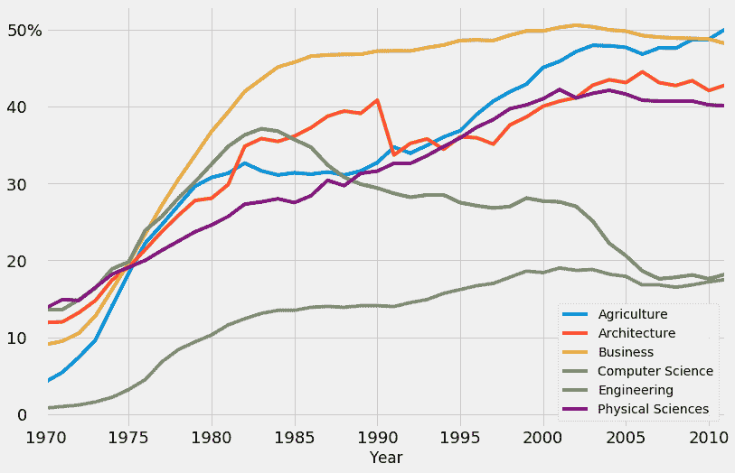

## 将 y = 0 处的水平线加粗

我们现在将 y 坐标为 0 的水平线加粗。为此，我们将使用

`axhline()` [方法](https://matplotlib.org/api/_as_gen/matplotlib.axes.Axes.axhline.html?highlight=axhline#matplotlib.axes.Axes.axhline)添加一条新的水平网格线，并覆盖现有的一条。我们用于`axhline()`的参数是:

*   `y`–指定水平线的 y 坐标；
*   `color`–表示线条的颜色；
*   `linewidth`–设置线条的宽度；
*   `alpha`–调节线条的透明度，但我们在这里用它来调节黑色的强度；`alpha`的值范围从 0(完全透明)到 1(完全不透明)。

```py
#
# The previous code
fte_graph = women_majors.plot(x = 'Year', y = under_20.index, figsize = (12,8))
fte_graph.tick_params(axis = 'both', which = 'major', labelsize = 18)
fte_graph.set_yticklabels(labels = [-10, '0   ', '10   ', '20   ', '30   ', '40   ', '50%'])

# Generate a bolded horizontal line at y = 0 
fte_graph.axhline(y = 0, color = 'black', linewidth = 1.3, alpha = .7) 
```

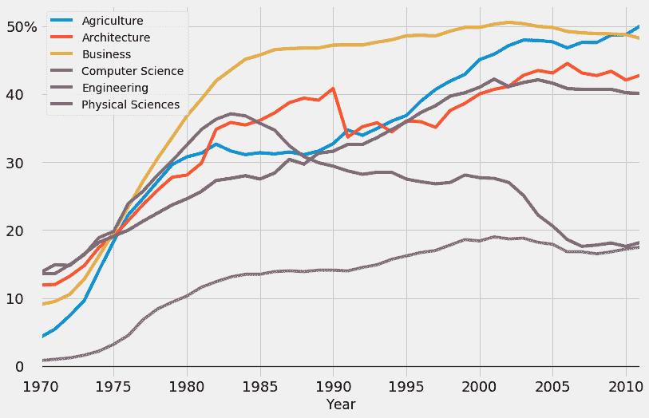

## 添加额外的垂直线

正如我们前面提到的，我们必须在 y 轴的刻度标签附近添加另一条垂直网格线。为此，我们只需调整 x 轴值的范围。增加范围的左边界限将会产生我们想要的额外的垂直网格线。下面，我们使用

`set_xlim()` [方法](https://matplotlib.org/api/_as_gen/matplotlib.axes.Axes.set_xlim.html?highlight=set_xlim#matplotlib.axes.Axes.set_xlim)带有自明参数`left`和`right`。

```py
 # The previous code
fte_graph = women_majors.plot(x = 'Year', y = under_20.index, figsize = (12,8))
fte_graph.tick_params(axis = 'both', which = 'major', labelsize = 18)
fte_graph.set_yticklabels(labels = [-10, '0   ', '10   ', '20   ', '30   ', '40   ', '50%'])
fte_graph.axhline(y = 0, color = 'black', linewidth = 1.3, alpha = .7)

# Add an extra vertical line by tweaking the range of the x-axis
fte_graph.set_xlim(left = 1969, right = 2011) 
```

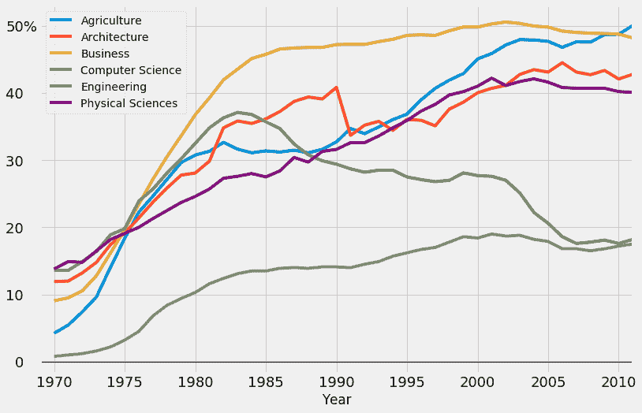

## 生成签名栏

上面给出的示例 FTE 图的特征条具有几个明显的特征:

*   它位于图表的底部。
*   作者的名字位于签名栏的左侧。
*   签名栏的右侧提到了数据的来源。
*   文本具有浅灰色(与图形的背景颜色相同)和深灰色背景。
*   作者姓名和来源名称之间的区域也有深灰色背景。


该图像会再次发布，因此您不必向后滚动。来源:[538](https://fivethirtyeight.com/features/fandango-movies-ratings/)

添加这样一个签名栏似乎很难，但是只要有一点点独创性，我们就可以很容易地完成。我们将添加一个文本片段，给它一个浅灰色，背景色为深灰色。我们将在一个文本片段中写下作者的名字和来源，但是我们将这两个分开，这样一个在最左边，另一个在最右边。好的方面是空白字符也将得到深灰色的背景，这将产生一个签名栏的效果。我们还将使用一些空白字符来对齐作者的姓名和来源的名称，您将在下一个代码块中看到这一点。这也是去掉 x 轴标签的好时机。通过这种方式，我们可以更好地了解签名栏在整个图表中的位置。在下一个代码单元中，我们将在目前所做的基础上进行构建，我们将:

*   通过向我们应用于对象`fte_graph.xaxis.label`的`set_visible()`方法传递一个`False`值来移除 x 轴的标签。可以这样想:我们访问`fte_graph`的`xaxis`属性，然后我们访问`fte_graph.xaxis`的`label`属性。然后我们最后把`set_visible()`应用到`fte_graph.xaxis.label`。
*   按照上面讨论的方式在图上添加一段文本。我们将使用带有以下参数的`text()` [方法](https://matplotlib.org/api/figure_api.html?highlight=figure%20text#matplotlib.figure.Figure.text):
    *   `x`–指定文本的 x 坐标；
    *   `y`–指定文本的 y 坐标；
    *   `s`–表示要添加的文本；
    *   `fontsize`–设置文本的大小；
    *   `color`–指定文本的颜色；下面我们用的值的格式是[十六进制](https://en.wikipedia.org/wiki/Hexadecimal)；我们使用这种格式来精确匹配整个图形的背景颜色(如[中指定的`fivethirtyeight`样式的代码](https://github.com/matplotlib/matplotlib/blob/38be7aeaaac3691560aeadafe46722dda427ef47/lib/matplotlib/mpl-data/stylelib/fivethirtyeight.mplstyle))；
    *   `backgroundcolor`–设置文本片段的背景颜色。

```py
 # The previous code
fte_graph = women_majors.plot(x = 'Year', y = under_20.index, figsize = (12,8))
fte_graph.tick_params(axis = 'both', which = 'major', labelsize = 18)
fte_graph.set_yticklabels(labels = [-10, '0   ', '10   ', '20   ', '30   ', '40   ', '50%'])
fte_graph.axhline(y = 0, color = 'black', linewidth = 1.3, alpha = .7)
fte_graph.set_xlim(left = 1969, right = 2011)

# Remove the label of the x-axis
fte_graph.xaxis.label.set_visible(False)

# The signature bar
fte_graph.text(x = 1965.8, y = -7,
    s = ' ©DATAQUEST Source: National Center for Education Statistics',fontsize = 14, color = '#f0f0f0', backgroundcolor = 'grey') 
```

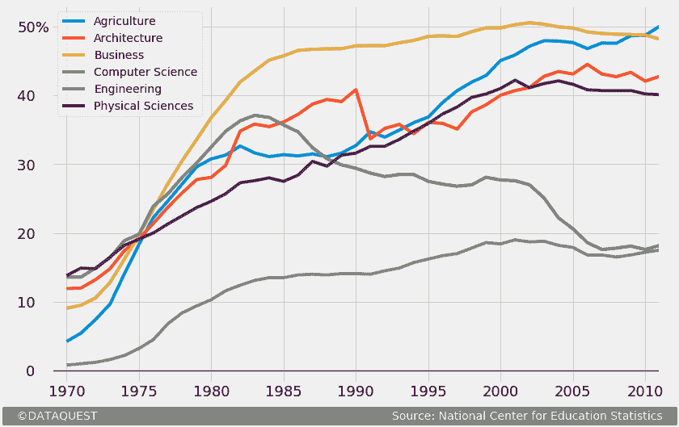添加的文本片段的 x 和 y 坐标是通过反复试验的过程找到的。您可以将`floats`传递给`x`和`y`参数，这样您就能够高精度地控制文本的位置。同样值得一提的是，我们调整了签名栏的位置，添加了一些视觉上令人耳目一新的侧边空白(我们之前讨论过这种调整)。为了增加左边距，我们简单地降低了 x 坐标的值。为了增加右边的空格，我们在作者的名字和来源的名字之间添加了更多的空白字符——这将来源的名字推到右边，从而导致添加所需的边距。

## 另一种签名酒吧

您还会遇到一种略有不同的签名栏:

来源: [FiveThirtyEight](https://fivethirtyeight.com/features/old-olympians-ride-horses-young-ones-do-flips/) 这种签名酒吧也很容易复制。我们只是添加一些灰色的文本，并在它的正上方加一条线。我们将通过添加多个下划线字符(“_”)的文本片段来创建一行的视觉效果。你可能想知道为什么我们不使用`axhline()`简单地在我们想要的 y 坐标上画一条水平线。我们没有这样做，因为新的线条会拖下整个图表的网格，这不会产生预期的效果。我们也可以尝试添加一个箭头，然后移除指针，这样我们就得到一条线。然而，“下划线”解决方案要简单得多。在下一个代码块中，我们实现了我们刚刚讨论过的内容。我们在这里使用的方法和参数应该已经在前面的章节中熟悉了。

```py
 # The previous code
fte_graph = women_majors.plot(x = 'Year', y = under_20.index, figsize = (12,8))
fte_graph.tick_params(axis = 'both', which = 'major', labelsize = 18)
fte_graph.set_yticklabels(labels = [-10, '0   ', '10   ', '20   ', '30   ', '40   ', '50%'])
fte_graph.axhline(y = 0, color = 'black', linewidth = 1.3, alpha = .7)
fte_graph.xaxis.label.set_visible(False)
fte_graph.set_xlim(left = 1969, right = 2011)

# The other signature bar
fte_graph.text(x = 1967.1, y = -6.5,
    s = '________________________________________________________________________________________________________________',
    color = 'grey', alpha = .7)

fte_graph.text(x = 1966.1, y = -9,
    s = '   ©DATAQUEST                                                                               Source: National Center for Education Statistics   ',
    fontsize = 14, color = 'grey', alpha = .7) 
```

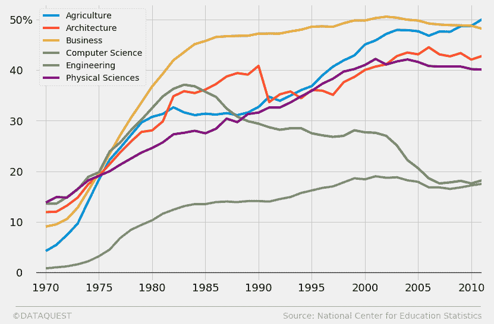

## 添加标题和副标题

如果你检查

[几张 FTE 图表](https://fivethirtyeight.com/features/the-52-best-and-weirdest-charts-we-made-in-2016/)，你可能会注意到标题和副标题的这些模式:

*   标题几乎总是有副标题作为补充。
*   标题给出了一个上下文角度来看一个特定的图表。标题几乎从来都不是技术性的，它通常表达一个简单的想法。它也几乎从来不是情感中立的。在上面的 Fandango 图中，我们可以看到一个简单的，“情感活跃”的标题(“Fandango 爱电影”)，而不是平淡无奇的“各种电影评级类型的分布”。
*   副标题提供了有关图表的技术信息。这些信息使得轴标签经常变得多余。因为我们已经去掉了 x 轴标签，所以我们应该小心地相应定制我们的副标题。
*   从视觉上看，标题和副标题的字体粗细不同，它们是左对齐的(不像大多数标题那样居中)。此外，它们与 y 轴的主要刻度标签垂直对齐，如我们前面所示。

现在让我们在注意上述观察的同时，给我们的图表添加一个标题和副标题。在下面的代码块中，我们将基于我们目前已经编写的代码，我们将:

*   使用与我们在签名栏中添加文本相同的`text()`方法添加标题和副标题。如果你已经有了一些使用 matplotlib 的经验，你可能会想为什么我们不使用`title()`和`suptitle()`方法。这是因为这两种方法在精确移动文本方面有着可怕的功能。`text()`的唯一新参数是`weight`。我们用它来加粗标题。

```py
 # The previous code
fte_graph = women_majors.plot(x = 'Year', y = under_20.index, figsize = (12,8))
fte_graph.tick_params(axis = 'both', which = 'major', labelsize = 18)
fte_graph.set_yticklabels(labels = [-10, '0   ', '10   ', '20   ', '30   ', '40   ', '50%'])
fte_graph.axhline(y = 0, color = 'black', linewidth = 1.3, alpha = .7)
fte_graph.xaxis.label.set_visible(False)
fte_graph.set_xlim(left = 1969, right = 2011)
fte_graph.text(x = 1965.8, y = -7,
    s = '   ©DATAQUEST                                                                                 Source: National Center for Education Statistics   ',
    fontsize = 14, color = '#f0f0f0', backgroundcolor = 'grey')

# Adding a title and a subtitle
fte_graph.text(x = 1966.65, y = 62.7, s = "The gender gap is transitory - even for extreme cases",
               fontsize = 26, weight = 'bold', alpha = .75)
fte_graph.text(x = 1966.65, y = 57, 
               s = 'Percentage of Bachelors conferred to women from 1970 to 2011 in the US for\nextreme cases where the percentage was less than 20% in 1970',
              fontsize = 19, alpha = .85) 
```

如果你想知道，最初 FTE 图表中使用的字体是 Decima Mono，一种付费字体。出于这个原因，我们将坚持使用 Matplotlib 的默认字体，它看起来非常相似。

## 添加色盲友好的颜色

现在，我们有那个笨重的矩形图例。我们将去掉它，并在每条情节线附近添加彩色标签。每条线都有一种特定的颜色，一个相同颜色的单词将命名该线对应的单身汉。但是，首先，我们将修改地块线的默认颜色，并添加

[色盲友好](https://en.wikipedia.org/wiki/Color_blindness)颜色: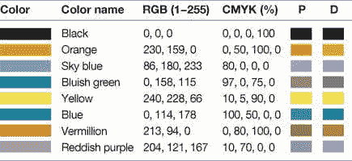来源:[观点:Bang Wong 的色盲](https://www.nature.com/nmeth/journal/v8/n6/full/nmeth.1618.html#ref1)我们将使用上图中的值来编辑色盲友好颜色的 [RGB](https://en.wikipedia.org/wiki/RGB_color_model) 参数列表。顺便提一句，我们避免使用黄色，因为用这种颜色的文本片段在图形的深灰色背景上不容易阅读。编译完这个 RGB 参数列表后，我们将把它传递给我们在前面的代码中使用的`plot()`方法的`color`参数。请注意，matplotlib 将要求 RGB 参数在 0-1 的范围内，因此我们将每个值除以 255，这是最大的 RGB 值。因为 0/255 = 0，所以我们不会费心去划分 0。

```py
 # Colorblind-friendly colors
colors = [[0,0,0], [230/255,159/255,0], [86/255,180/255,233/255], [0,158/255,115/255], 
          [213/255,94/255,0], [0,114/255,178/255]]

# The previous code we modify
fte_graph = women_majors.plot(x = 'Year', y = under_20.index, figsize = (12,8), color = colors)

# The previous code that remains the same
fte_graph.tick_params(axis = 'both', which = 'major', labelsize = 18)
fte_graph.set_yticklabels(labels = [-10, '0   ', '10   ', '20   ', '30   ', '40   ', '50%'])
fte_graph.axhline(y = 0, color = 'black', linewidth = 1.3, alpha = .7)
fte_graph.xaxis.label.set_visible(False)
fte_graph.set_xlim(left = 1969, right = 2011)
fte_graph.text(x = 1965.8, y = -7,
    s = '   ©DATAQUEST                                                                                 Source: National Center for Education Statistics   ',
    fontsize = 14, color = '#f0f0f0', backgroundcolor = 'grey')
fte_graph.text(x = 1966.65, y = 62.7, s = "The gender gap is transitory - even for extreme cases",
               fontsize = 26, weight = 'bold', alpha = .75)
fte_graph.text(x = 1966.65, y = 57, 
               s = 'Percentage of Bachelors conferred to women from 1970 to 2011 in the US for\nextreme cases where the percentage was less than 20% in 1970',
              fontsize = 19, alpha = .85) 
```

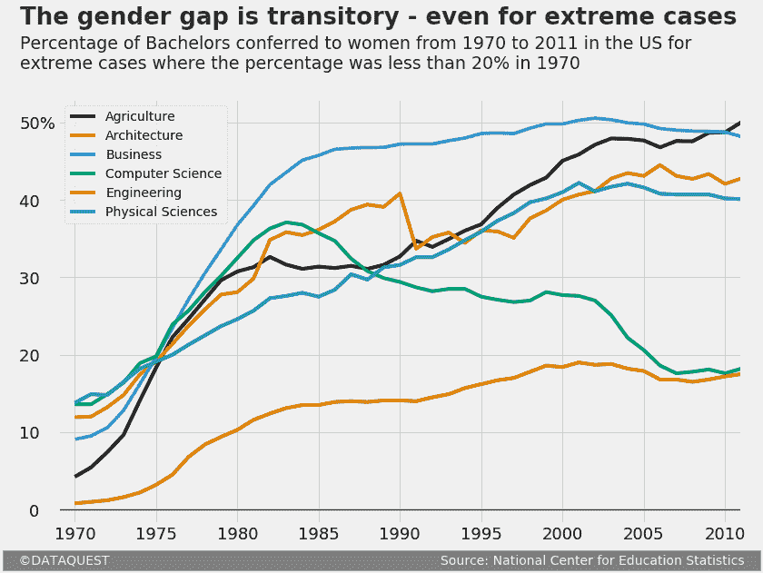

## 通过添加彩色标签来更改图例样式

最后，我们通过使用

`text()`早期使用的方法。唯一的新参数是`rotation`，我们用它来旋转每个标签，使其优雅地适合图表。我们还将在这里做一点小技巧，通过简单地修改标签的背景颜色来匹配图表的颜色，使标签周围的网格线变得透明。在我们之前的代码中，我们只通过将`legend`参数设置为`False`来修改`plot()`方法。这将使我们摆脱默认的图例。我们也跳过了重新声明`colors`列表，因为它已经存储在前一个单元格的内存中。

```py
 # The previous code we modify
fte_graph = women_majors.plot(x = 'Year', y = under_20.index, figsize = (12,8), color = colors, legend = False)

# The previous code that remains unchanged
fte_graph.tick_params(axis = 'both', which = 'major', labelsize = 18)
fte_graph.set_yticklabels(labels = [-10, '0   ', '10   ', '20   ', '30   ', '40   ', '50%'])
fte_graph.axhline(y = 0, color = 'black', linewidth = 1.3, alpha = .7)
fte_graph.xaxis.label.set_visible(False)
fte_graph.set_xlim(left = 1969, right = 2011)
fte_graph.text(x = 1965.8, y = -7,
    s = '   ©DATAQUEST                                                                                 Source: National Center for Education Statistics   ',
    fontsize = 14, color = '#f0f0f0', backgroundcolor = 'grey')
fte_graph.text(x = 1966.65, y = 62.7, s = "The gender gap is transitory - even for extreme cases",
               fontsize = 26, weight = 'bold', alpha = .75)
fte_graph.text(x = 1966.65, y = 57, 
               s = 'Percentage of Bachelors conferred to women from 1970 to 2011 in the US for\nextreme cases where the percentage was less than 20% in 1970',
              fontsize = 19, alpha = .85)

# Add colored labels
fte_graph.text(x = 1994, y = 44, s = 'Agriculture', color = colors[0], weight = 'bold', rotation = 33,
              backgroundcolor = '#f0f0f0')
fte_graph.text(x = 1985, y = 42.2, s = 'Architecture', color = colors[1], weight = 'bold', rotation = 18,
              backgroundcolor = '#f0f0f0')
fte_graph.text(x = 2004, y = 51, s = 'Business', color = colors[2], weight = 'bold', rotation = -5, 
               backgroundcolor = '#f0f0f0')
fte_graph.text(x = 2001, y = 30, s = 'Computer Science', color = colors[3], weight = 'bold', rotation = -42.5,
              backgroundcolor = '#f0f0f0')
fte_graph.text(x = 1987, y = 11.5, s = 'Engineering', color = colors[4], weight = 'bold',
              backgroundcolor = '#f0f0f0')
fte_graph.text(x = 1976, y = 25, s = 'Physical Sciences', color = colors[5], weight = 'bold', rotation = 27,
              backgroundcolor = '#f0f0f0') 
```

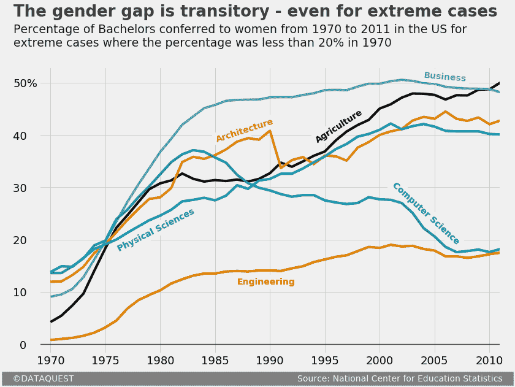

## 后续步骤

就这样，我们的图表现在可以发布了！简单回顾一下，我们已经开始用 matplotlib 的默认样式生成一个图表。然后，我们通过一系列步骤将该图提升到“FTE 水平”:

*   我们使用了 matplotlib 的内置`fivethirtyeight`样式。
*   我们添加了一个标题和一个副标题，并分别进行了定制。
*   我们增加了一个签名栏。
*   我们移除了默认图例，并添加了彩色标签。
*   我们做了一系列其他的小调整:定制记号标签，在 y = 0 处加粗水平线，在记号标签附近添加垂直网格线，移除 x 轴的标签，增加 y 轴的横向边距。

为了建立在你所学的基础上，下面是几个可以考虑的后续步骤:

*   为其他单身汉生成一个类似的图表。
*   生成不同种类的 FTE 图:直方图，散点图等。
*   探索 matplotlib 的图库,寻找潜在的元素来丰富你的 FTE 图(如插入图片，或添加箭头等)。).添加图像可以将您的 FTE 图表提升到一个全新的水平:

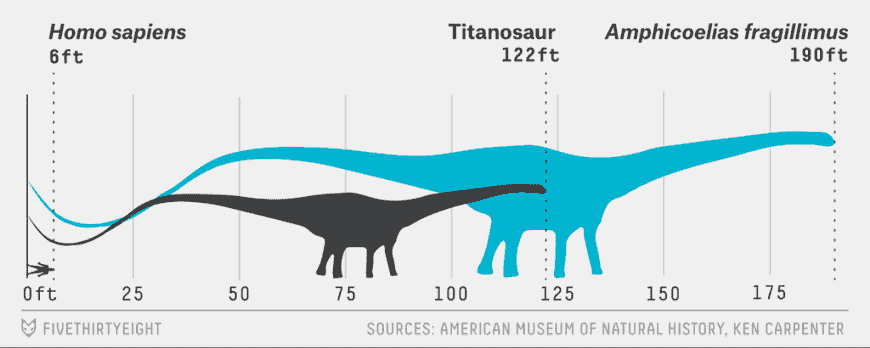

来源:[538](https://fivethirtyeight.com/features/the-biggest-dinosaur-in-history-may-never-have-existed/)

## 用正确的方法学习 Python。

从第一天开始，就在你的浏览器窗口中通过编写 Python 代码来学习 Python。这是学习 Python 的最佳方式——亲自看看我们 60 多门免费课程中的一门。


[尝试 Dataquest](https://app.dataquest.io/signup)