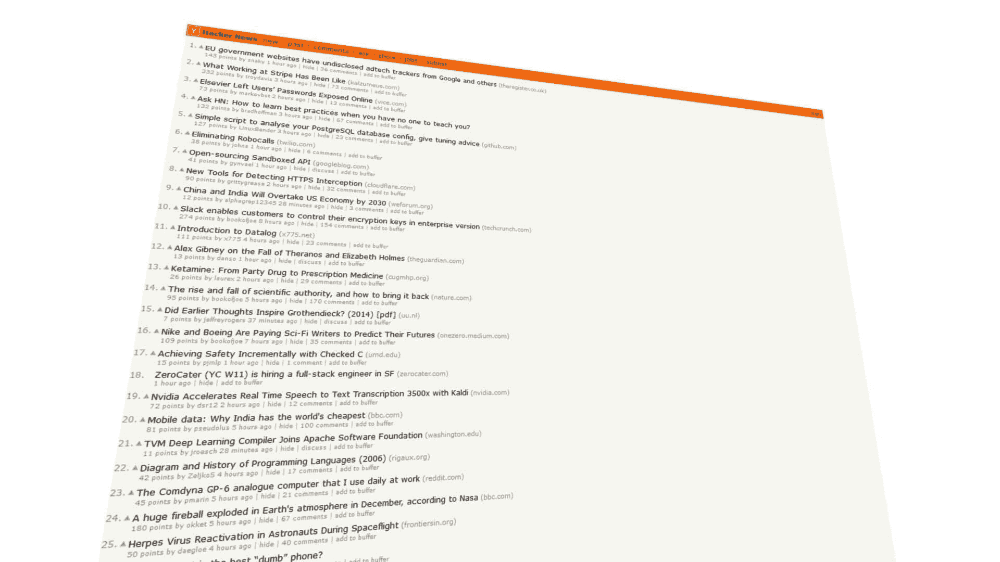

# 教程:使用 Python 进行自然语言处理

> 原文：<https://www.dataquest.io/blog/natural-language-processing-with-python/>

June 9, 2015

Python 有一些强大的工具，可以让你做[自然语言处理](https://en.wikipedia.org/wiki/Natural_language_processing) (NLP)。在本教程中，我们将学习如何用 Python 做一些基本的自然语言处理。

## 看着数据

我们将看到一个由 2006 年至 2015 年《黑客新闻》的子新闻组成的数据集。数据取自[这里的](https://github.com/arnauddri/hn)。Arnaud Drizard 用黑客新闻 API 刮出来的。我们从数据中随机抽取了`10000`行，并删除了所有无关的列。我们的数据只有四列:

*   `sublesson_time` —故事提交的时间。
*   `url` —子订阅的基本 url。
*   `upvotes` —分包商获得的支持票数。
*   `headline` —分包合同的标题。

我们将利用头条来预测投票数。数据存储在`sublessons`变量中。

## 自然语言处理—第一步

我们希望最终训练一个机器学习算法来接受一个标题，并告诉我们它将获得多少赞成票。但是，机器学习算法只理解数字，不理解文字。我们如何将我们的标题翻译成算法可以理解的东西？

第一步是创建一个叫做单词包矩阵的东西。一包单词矩阵给了我们哪个单词在哪个标题中的数字表示。为了构建一个单词包矩阵，我们首先在整个标题集中找到唯一的单词。然后，我们建立一个矩阵，其中每行是一个标题，每列是一个独特的单词。然后，我们在每个单元格中填入该词在标题中出现的次数。这将产生一个矩阵，其中许多单元格的值为零，除非词汇表主要在标题之间共享。

```py
 from collections import Counter

headlines = [
    "PretzelBros, airbnb for people who like pretzels, raises $2 million",
    "Top 10 reasons why Go is better than whatever language you use.",
    "Why working at apple stole my soul (I still love it though)",
    "80 things I think you should do immediately if you use python.",
    "Show HN: carjack.me -- Uber meets GTA"
]

# Find all the unique words in the headlines.
unique_words = list(set(" ".join(headlines).split(" ")))
def make_matrix(headlines, vocab):
    matrix = []
    for headline in headlines:
        # Count each word in the headline, and make a dictionary.
        counter = Counter(headline)
        # Turn the dictionary into a matrix row using the vocab.
        row = [counter.get(w, 0) for w in vocab]
        matrix.append(row)
    df = pandas.DataFrame(matrix)
    df.columns = unique_words
    return df

print(make_matrix(headlines, unique_words))
```

```py
 why  HN:  for  people  immediately  like  I  Go  80  meets  ...   my  who  
0    0    0    0       0            0     0  0   0   0      0  ...    0    0   
1    0    0    0       0            0     0  0   0   0      0  ...    0    0   
2    0    0    0       0            0     0  1   0   0      0  ...    0    0   
3    0    0    0       0            0     0  1   0   0      0  ...    0    0   
4    0    0    0       0            0     0  0   0   0      0  ...    0    0   

   PretzelBros,  whatever  language  do  $2  still  than  soul  
0             0         0         0   0   0      0     0     0  
1             0         0         0   0   0      0     0     0  
2             0         0         0   0   0      0     0     0  
3             0         0         0   0   0      0     0     0  
4             0         0         0   0   0      0     0     0  

[5 rows x 51 columns] 
```

## 删除标点符号

我们刚刚制作的矩阵非常稀疏，这意味着许多值为零。这在某种程度上是不可避免的，因为标题没有太多的共享词汇。不过，我们可以采取一些措施来改善这个问题。现在`Why`和`why`，以及`use`和`use.`被视为不同的实体，但是我们知道它们指的是同一个词。我们可以通过降低每个单词的大小写并删除所有标点符号来帮助解析器识别出这些事实上是相同的。

```py
 import re

# Lowercase, then replace any non-letter, space, or digit character in the headlines.
new_headlines = [re.sub(r'[^wsd]','',h.lower()) for h in headlines]
# Replace sequences of whitespace with a space character.
new_headlines = [re.sub("s+", " ", h) for h in new_headlines]

unique_words = list(set(" ".join(new_headlines).split(" ")))
# We've reduced the number of columns in the matrix a bit.
print(make_matrix(new_headlines, unique_words)) 
```

```py
 2  why  top  hn  for  people  immediately  like  python  80  ...   should  
0  1    0    0   0    0       0            0     0       0   0  ...        0   
1  0    0    0   0    0       0            0     0       0   0  ...        0   
2  0    0    0   0    0       0            0     0       0   0  ...        0   
3  0    0    0   0    0       0            0     0       0   0  ...        0   
4  0    0    0   0    0       0            0     0       0   0  ...        0   

   my  who  go  whatever  language  do  still  than  soul  
0   0    0   0         0         0   0      0     0     0  
1   0    0   0         0         0   0      0     0     0  
2   0    0   0         0         0   0      0     0     0  
3   0    0   0         0         0   0      0     0     0  
4   0    0   0         0         0   0      0     0     0  

[5 rows x 47 columns] 
```

## 移除停用字词

某些词不能帮助你区分好的和坏的标题。像`the`、`a`和`also`这样的词在所有的上下文中出现得足够频繁，以至于它们并不能真正告诉我们什么东西是好是坏。它们通常同样可能出现在好的和坏的标题中。通过删除这些，我们可以减少矩阵的大小，并使训练算法更快。

```py
 # Read in and split the stopwords file.
with open("stop_words.txt", 'r') as f:
    stopwords = f.read().split("n")

# Do the same punctuation replacement that we did for the headlines, # so we're comparing the right things.
stopwords = [re.sub(r'[^wsd]','',s.lower()) for s in stopwords]

unique_words = list(set(" ".join(new_headlines).split(" ")))

# Remove stopwords from the vocabulary.unique_words = [w for w in unique_words if w not in stopwords]

# We're down to 34 columns, which is way better!
print(make_matrix(new_headlines, unique_words)) 
```

```py
 2  top  hn  people  immediately  like  python  80  meets  pretzels  ...   \
0  1    0   0       0            0     0       0   0      0         0  ...    
1  0    0   0       0            0     0       0   0      0         0  ...    
2  0    0   0       0            0     0       0   0      0         0  ...    
3  0    0   0       0            0     0       0   0      0         0  ...    
4  0    0   0       0            0     0       0   0      0         0  ...    

   gta  10  uber  raises  pretzelbros  go  whatever  language  still  soul  
0    0   0     0       0            0   0         0         0      0     0  
1    0   0     0       0            0   0         0         0      0     0  
2    0   0     0       0            0   0         0         0      0     0  
3    0   0     0       0            0   0         0         0      0     0  
4    0   0     0       0            0   0         0         0      0     0  

[5 rows x 34 columns] 
```

## 为所有标题生成矩阵

现在我们知道了基础知识，我们可以为整套标题制作一个单词包矩阵。我们不希望每次都必须手工编写代码，所以我们将使用来自 [scikit-learn](https://scikit-learn.org/stable/) 的一个类来自动完成。使用 scikit-learn 的*矢量器*来构建你的单词矩阵包将会使这个过程变得更加容易和快速。

```py
 from sklearn.feature_extraction.text import CountVectorizer

# Construct a bag of words matrix.
# This will lowercase everything, and ignore all punctuation by default.
# It will also remove stop words.
vectorizer = CountVectorizer(lowercase=True, stop_words="english")

matrix = vectorizer.fit_transform(headlines)
# We created our bag of words matrix with far fewer commands.
print(matrix.todense())

# Let's apply the same method to all the headlines in all 100000 sublessons.
# We'll also add the url of the sublesson to the end of the headline so we can take it into account.
sublessons['full_test'] = sublessons["headline"] + " " + sublessons["url"]
full_matrix = vectorizer.fit_transform(sublessons["headline"])
print(full_matrix.shape)
```

```py
 [[0 0 1 0 0 0 0 0 0 0 1 0 0 1 1 1 1 0 1 0 0 0 0 0 0 0 0]
 [1 0 0 0 1 0 0 0 0 1 0 0 0 0 0 0 0 0 0 1 0 0 0 0 0 1 0]
 [0 0 0 1 0 0 0 0 0 0 0 1 0 0 0 0 0 0 0 0 1 1 0 0 0 0 1]
 [0 1 0 0 0 0 0 0 1 0 0 0 0 0 0 0 0 1 0 0 0 0 1 1 0 1 0]
 [0 0 0 0 0 1 1 1 0 0 0 0 1 0 0 0 0 0 0 0 0 0 0 0 1 0 0]]
(9356, 13631) 
```

## 降维

我们已经构建了一个矩阵，但是它现在有`13631`个唯一的单词，或者列。这将需要很长时间来进行预测。我们想加快速度，所以我们需要以某种方式减少列数。一种方法是选择信息最丰富的列的子集，即最能区分好标题和坏标题的列。

找出信息量最大的列的一个好方法是使用一种叫做[卡方](https://en.wikipedia.org/wiki/Chi-squared_test)测试的东西。卡方检验发现，在高投票率的帖子和没有高投票率的帖子之间，区别最大的词。这可以是在高投票的帖子中出现很多的词，而在没有投票的帖子中根本不会出现，或者是在没有投票的帖子中出现很多的词，但在投票的帖子中不会出现。卡方检验只对二进制值起作用，因此我们将通过将任何比平均值多的投票数设置为`1`并将任何比平均值少的投票数设置为`0`来使我们的 upvotes 列为二进制。这样做的一个缺点是，我们使用来自数据集的知识来选择特征，因此引入了一些过度拟合。我们可以通过使用数据的子集进行特征选择，并使用不同的子集来训练算法，来避免“现实世界”中的过度拟合。我们现在让事情简单一点，跳过这一步。

```py
 from sklearn.feature_selection import SelectKBest
from sklearn.feature_selection import chi2

# Convert the upvotes variable to binary so it works with a chi-squared test.
col = sublessons["upvotes"].copy(deep=True)
col_mean = col.mean()
col[col < col_mean] = 0
col[(col > 0) & (col > col_mean)] = 1

# Find the 1000 most informative columns
selector = SelectKBest(chi2, k=1000)
selector.fit(full_matrix, col)
top_words = selector.get_support().nonzero()

# Pick only the most informative columns in the data.
chi_matrix = full_matrix[:,top_words[0]] 
```

## 添加元特征

如果我们忽略了标题的“元”特征，我们就会错过很多好的信息。这些特征包括长度、标点符号数量、平均单词长度和其他句子特定的特征。添加这些可以大大提高预测的准确性。为了添加它们，我们将遍历标题，并对每个标题应用一个函数。一些函数将计算标题的字符长度，其他函数将做更高级的事情，比如计算数字的个数。

```py
 # Our list of functions to apply.
transform_functions = [
    lambda x: len(x),
    lambda x: x.count(" "),
    lambda x: x.count("."),
    lambda x: x.count("!"),
    lambda x: x.count("?"),
    lambda x: len(x) / (x.count(" ") + 1),
    lambda x: x.count(" ") / (x.count(".") + 1),
    lambda x: len(re.findall("d", x)),
    lambda x: len(re.findall("[A-Z]", x)),
]

# Apply each function and put the results into a list.
columns = []
for func in transform_functions:
    columns.append(sublessons["headline"].apply(func))
    # Convert the meta features to a numpy array.
meta = numpy.asarray(columns).T
```

## 添加更多功能

我们可以使用的功能不仅仅是文本功能。我们有一个名为`sublesson_time`的专栏，告诉我们一个故事是何时提交的，并且可以添加更多信息。通常，在进行 NLP 工作时，您可以添加外部特征，使您的预测更好。一些机器学习算法可以计算出这些特征如何与你的文本特征进行交互(即“在午夜发布标题中带有‘tacos’一词的帖子会导致高分帖子”)。

```py
 columns = []

# Convert the sublesson dates column to datetime.

sublesson_dates = pandas.to_datetime(sublessons["sublesson_time"])

# Transform functions for the datetime column.
transform_functions = [
    lambda x: x.year,
    lambda x: x.month,
    lambda x: x.day,
    lambda x: x.hour,
    lambda x: x.minute
]

# Apply all functions to the datetime column.
for func in transform_functions:
    columns.append(sublesson_dates.apply(func))

# Convert the meta features to a numpy array.
non_nlp = numpy.asarray(columns).T

# Concatenate the features together.
features = numpy.hstack([non_nlp, meta, chi_matrix.todense()])
```

## 做出预测

既然我们可以将单词翻译成数字，我们就可以使用算法进行预测。我们将随机选取`7500`个标题作为训练集，然后在`2500`个标题的测试集上评估算法的性能。在我们训练的同一个集合上预测结果将导致[过度拟合](https://en.wikipedia.org/wiki/Overfitting)，此时你的算法对训练集过度优化——我们会认为错误率很好，但实际上在新数据上它可能会高得多。对于算法，我们将使用[岭回归](https://en.wikipedia.org/wiki/Tikhonov_regularization)。与普通的线性回归相比，岭回归引入了对系数的惩罚，防止它们变得太大。这可以帮助它处理大量相互关联的预测值(列)，就像我们所做的那样。

```py
 from sklearn.linear_model 
import Ridge
import numpy
import random

train_rows = 7500
# Set a seed to get the same "random" shuffle every time.
random.seed(1)

# Shuffle the indices for the matrix.
indices = list(range(features.shape[0]))
random.shuffle(indices)

# Create train and test sets.
train = features[indices[:train_rows], :]
test = features[indices[train_rows:], :]
train_upvotes = sublessons["upvotes"].iloc[indices[:train_rows]]
test_upvotes = sublessons["upvotes"].iloc[indices[train_rows:]]
train = numpy.nan_to_num(train)

# Run the regression and generate predictions for the test set.
reg = Ridge(alpha=.1)
reg.fit(train, train_upvotes)
predictions = reg.predict(test)
```

## 评估错误

我们现在有预测，但我们如何确定它们有多好？一种方法是计算测试集上的预测和测试集的实际向上投票计数之间的错误率。我们还需要一个巴塞尔协议来比较误差，看看结果是否好。我们可以通过使用一个简单的方法来对测试集进行基线估计，并将我们预测的错误率与基线估计的错误率进行比较。

一个非常简单的基线是获取训练集中每个子成员的平均投票数，并将其用作每个子成员的预测。我们将使用[平均绝对误差](https://en.wikipedia.org/wiki/Mean_absolute_error)作为误差度量。非常简单——只需从预测值中减去实际值，取差值的绝对值，然后求所有差值的平均值。

```py
 # We're going to use mean absolute error as an error metric.
# Our error is about 13.6 upvotes, which means that, on average, 
# our prediction is 13.6 upvotes away from the actual number of upvotes.
print(sum(abs(predictions - test_upvotes)) / len(predictions))

# As a baseline, we'll use the average number of upvotes# across all sublessons.
# The error here is 17.2 -- our estimate is better, but not hugely so.
# There either isn't a ton of predictive value encoded in the 
# data we have, or we aren't extracting it well.
average_upvotes = sum(test_upvotes)/len(test_upvotes)
print(sum(abs(average_upvotes - test_upvotes)) / len(predictions))
```

```py
 13.6606593988
17.2759421912
```

## 接下来的步骤

这种方法在这个数据集上工作得相当好，但不是非常好。我们发现标题和其他栏目有一定的预测价值。我们可以通过使用不同的预测算法来改进这种方法，比如随机森林或神经网络。当我们生成单词包矩阵时，我们也可以使用 ngrams，比如二元模型和三元模型。

在矩阵上尝试一个 [tf-idf](https://en.wikipedia.org/wiki/Tf%E2%80%93idf) 变换也会有所帮助——sci kit-learn 有一个类可以自动完成这项工作。我们还可以考虑其他数据，如提交文章的用户，并生成指示用户因果报应和用户最近活动的特征。提交的 url 上的其他统计数据，如收到的来自该 url 的平均 upvotes sublessons 数也可能是有用的。

在执行这些操作时要小心，只考虑在您预测的分包完成之前就存在的信息。所有这些添加将比我们目前所做的花费更长的时间，但是会减少错误。希望你有时间尝试一下！如果你想更多地使用 NLP，你可以看看我们的交互式自然语言编程课程。