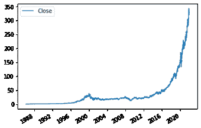
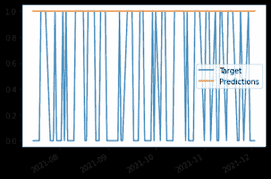

# 投资组合项目:使用熊猫和 Scikit-learn 预测股票价格

> 原文：<https://www.dataquest.io/blog/portfolio-project-predicting-stock-prices-using-pandas-and-scikit-learn/>

December 16, 2021

在这个项目中，我们将学习如何使用 python、pandas 和 scikit-learn 预测股票价格。在这个过程中，我们将下载股票价格，创建一个机器学习模型，并开发一个回溯测试引擎。在此过程中，我们将讨论什么是数据科学投资组合的好项目，以及如何在您的投资组合中展示该项目。供您参考，您可以在这里看到已完成的项目[。](https://github.com/dataquestio/project-walkthroughs/blob/master/stock/StockProject.ipynb)

首先，让我们把我们在这个项目中要做的事情和现实世界联系起来。当做一个项目时，即使是为了你的作品集，重要的是要考虑它在现实世界中会如何被使用。这是因为招聘经理希望你的项目尽可能接近实际的数据科学工作。所以花大量的时间考虑你想要什么样的误差指标，以及你的算法将如何被使用。

在这种情况下，假设我们在炒股。我们感兴趣的是以最小的风险进行有利可图的股票交易。因此，当我们购买一只股票时，我们希望相当确定价格会上涨。我们将在开市时买进股票，闭市时卖出。

## 机器学习设置

为了告诉我们何时交易，我们希望训练一个机器学习模型。这个模型需要使用今天的数据来预测明天的收盘价。如果模型预测价格会上涨，我们就买股票。如果模型说价格会下降，我们什么都不会做。

我们希望最大化我们的`true positives`——模型预测价格会上涨，而实际上价格会上涨的日子。因此，我们将使用 precision 作为模型的误差度量，即`true positives / (false positives + true positives)`。这将确保我们最大限度地减少误报(我们买入股票，但价格实际下跌)造成的损失。

这意味着我们将不得不接受许多`false negatives`天，当我们预测价格会下降，但它实际上是上升的。这没什么，因为我们宁愿最小化我们的潜在损失，而不是最大化我们的潜在收益。

所以我们的模型会有低的`recall`，但是高的`precision`。[这里的](https://scikit-learn.org/stable/modules/model_evaluation.html#precision-recall-f-measure-metrics)更多的是在精度和召回上。

## 方法

我们将关注微软股票，其股票代码为`MSFT`。下面是我们预测`MSFT`股票价格的步骤:

*   从雅虎财经下载 MSFT 股票价格
*   探索数据
*   设置数据集以使用历史价格预测未来价格
*   测试机器学习模型
*   设置回溯测试引擎
*   提高模型的准确性

最后，我们将记录一些潜在的未来发展方向，以改进这项技术。

## 下载数据

首先，我们将从雅虎财经下载数据。为此，我们将使用`yfinance` python 包。我们可以通过在命令行中键入`pip install yfinance`来安装它(或者在 Jupyter 笔记本中键入`!pip install yfinance`)。

我们将使用一只股票(微软)从开始交易到现在的数据。

```py
import yfinance as yf

msft = yf.Ticker("MSFT")
msft_hist = msft.history(period="max")
```

我们现在已经下载了数据！在现实世界中，我们希望将数据保存到磁盘，以便在需要时可以再次访问它，而无需反复调用 API。我们可以通过检查以前是否保存过数据来做到这一点。如果有的话，我们只需加载数据。否则，我们下载数据。

我们需要安装`pandas`来做到这一点。

```py
import os
import pandas as pd

DATA_PATH = "msft_data.json"

if os.path.exists(DATA_PATH):
    # Read from file if we've already downloaded the data.
    with open(DATA_PATH) as f:
        msft_hist = pd.read_json(DATA_PATH)
else:
    msft = yf.Ticker("MSFT")
    msft_hist = msft.history(period="max")

    # Save file to json in case we need it later.  This prevents us from having to re-download it every time.
    msft_hist.to_json(DATA_PATH)
```

### 探索数据

接下来我们可以看一看`msft_hist`来看数据的结构。我们将在[数据帧](https://pandas.pydata.org/docs/reference/api/pandas.DataFrame.html)上使用`.head`方法来检查前 5 行数据。

正如我们在下面看到的，微软股票交易的每一天都有一行数据。以下是各列:

*   开盘——股票的开盘价
*   高–一天中的最高价格
*   低–一天中的最低价格
*   收盘——交易日的收盘价
*   成交量——交易了多少股票

数据帧的行索引是股票交易的日期。股票不是每天都交易(周末和节假日不交易)，所以漏了一些日期。

```py
msft_hist.head(5)
```

|  | 打开 | 高的 | 低的 | 关闭 | 卷 | 红利 | 股票分拆 |
| --- | --- | --- | --- | --- | --- | --- | --- |
| 1986-03-13 | 0.055898 | 0.064119 | 0.055898 | 0.061378 | One billion thirty-one million seven hundred and eighty-eight thousand eight hundred | Zero | Zero |
| 1986-03-14 | 0.061378 | 0.064667 | 0.061378 | 0.063570 | Three hundred and eight million one hundred and sixty thousand | Zero | Zero |
| 1986-03-17 | 0.063570 | 0.065215 | 0.063570 | 0.064667 | One hundred and thirty-three million one hundred and seventy-one thousand two hundred | Zero | Zero |
| 1986-03-18 | 0.064667 | 0.065215 | 0.062474 | 0.063022 | Sixty-seven million seven hundred and sixty-six thousand four hundred | Zero | Zero |
| 1986-03-19 | 0.063022 | 0.063570 | 0.061378 | 0.061926 | Forty-seven million eight hundred and ninety-four thousand four hundred | Zero | Zero |

接下来，让我们绘制数据，这样我们就可以看到股票价格如何随着时间的推移而变化。这为我们提供了数据结构的另一个概览。我们可以在 DataFrames 上使用内置的 plot 方法来做到这一点。我们使用`use_index`参数，因为我们想要使用索引作为 x 轴值。

在我们可以绘图之前，请确保安装了`matplotlib`。

```py
# Visualize microsoft stock prices
msft_hist.plot.line(y="Close", use_index=True)
```

[](https://www.dataquest.io/wp-content/uploads/2021/12/stock-prices-plot.webp)

## 准备数据

好吧，希望你已经不再因为在过去的 30 年里没有买微软的股票而自责。

现在，让我们准备数据，这样我们就可以做预测。正如我们在引言中提到的，我们将根据今天的数据预测明天的价格是涨还是跌。

首先，我们将确定一个我们试图预测的目标。我们的目标是明天价格是涨是跌。如果价格上涨，目标是`1`，如果价格下跌，目标是`0`。

接下来，我们将把前几天的数据“前移”一天，这样我们就可以用它来预测目标价格。这确保了我们不会意外地使用同一天的数据进行预测！(很常见的错误)

然后，我们将两者结合起来，这样我们就有了我们的训练数据。

### 设定目标

首先，我们设置目标。

我们首先将`Close`列复制到一个名为`data`的新数据帧中，并将其重命名为`actual_close`。这确保了我们可以继续看到股票每天的实际收盘价。(我们稍后会改变一些东西，所以保留这一点很重要)。

然后，我们通过执行以下操作来设置我们的目标:

*   使用 pandas [滚动](https://pandas.pydata.org/docs/reference/api/pandas.DataFrame.rolling.html?highlight=rolling#pandas.DataFrame.rolling)的方法，每隔 2 行数据帧。这将首先查看(' 1986-03-13 '，' 1986-03-14 ')，然后(' 1986-03-14 '，' 1986-03-17 ')，以此类推。
*   我们将比较第二行和第一行，看它是否更大。如果是，返回 1，否则返回 0。
*   然后，我们只需查看`Close`列。

正如你在上面看到的，`Target`列现在显示价格在给定的一天是上涨还是下跌。如果`Target`是`1`，价格就上去了。如果`Target`是`0`，价格就下降了。

这是我们希望我们的机器学习模型预测的！

```py
# Ensure we know the actual closing price
data = msft_hist[["Close"]]
data = data.rename(columns = {'Close':'Actual_Close'})

# Setup our target.  This identifies if the price went up or down
data["Target"] = msft_hist.rolling(2).apply(lambda x: x.iloc[1] > x.iloc[0])["Close"]
```

```py
data.head()
```

|  | 实际 _ 关闭 | 目标 |
| --- | --- | --- |
| 1986-03-13 | 0.061378 | 圆盘烤饼 |
| 1986-03-14 | 0.063570 | One |
| 1986-03-17 | 0.064667 | One |
| 1986-03-18 | 0.063022 | Zero |
| 1986-03-19 | 0.061926 | Zero |

### 将数据“前移”

接下来，我们将使用 DataFrame [shift](https://pandas.pydata.org/docs/reference/api/pandas.DataFrame.shift.html?highlight=shift#pandas.DataFrame.shift) 方法将所有行“向前”移动一个交易日。

如您所见，`1986-03-13`的价格现在与`1986-03-14`相关联，其他价格上移一行。这是为了确保我们使用过去的数据预测未来的价格。

如果我们不这样做，我们将使用来自`03-14`的数据来预测`03-14`的价格。相反，我们需要使用来自`03-13`的数据来预测`03-14`的价格。如果我们不这样做，我们的模型在测试时会看起来很神奇，但在现实世界中根本不会工作。在现实世界中，我们实际上不知道明天的价格，所以我们不能用它来做预测。

```py
# Shift stock prices forward one day, so we're predicting tomorrow's stock prices from today's prices.
msft_prev = msft_hist.copy()
msft_prev = msft_prev.shift(1)
```

```py
msft_prev.head()
```

|  | 打开 | 高的 | 低的 | 关闭 | 卷 | 红利 | 股票分拆 |
| --- | --- | --- | --- | --- | --- | --- | --- |
| 1986-03-13 | 圆盘烤饼 | 圆盘烤饼 | 圆盘烤饼 | 圆盘烤饼 | 圆盘烤饼 | 圆盘烤饼 | 圆盘烤饼 |
| 1986-03-14 | 0.055898 | 0.064119 | 0.055898 | 0.061378 | 1.031789e+09 | Zero | Zero |
| 1986-03-17 | 0.061378 | 0.064667 | 0.061378 | 0.063570 | 3.081600e+08 | Zero | Zero |
| 1986-03-18 | 0.063570 | 0.065215 | 0.063570 | 0.064667 | 1.331712e+08 | Zero | Zero |
| 1986-03-19 | 0.064667 | 0.065215 | 0.062474 | 0.063022 | 6.776640e+07 | Zero | Zero |

### 结合我们的数据

接下来，我们需要将我们的`Target`与我们想要用来预测目标的列结合起来。我们将在数据帧上使用这个方法和[连接](https://pandas.pydata.org/docs/reference/api/pandas.DataFrame.join.html?highlight=join#pandas.DataFrame.join)方法。

在我们加入数据后，我们看到我们将使用前一天的数据来预测目标。我们将用来预测目标的列是`["Close", "Volume", "Open", "High", "Low"]`。

最好明确地使用`predictors`来避免意外地使用你的目标来预测它自己。这将使你的模型在训练中看起来非常好，但在现实世界中根本行不通。

```py
# Create our training data
predictors = ["Close", "Volume", "Open", "High", "Low"]
data = data.join(msft_prev[predictors]).iloc[1:]
```

```py
data.head()
```

|  | 实际 _ 关闭 | 目标 | 关闭 | 卷 | 打开 | 高的 | 低的 |
| --- | --- | --- | --- | --- | --- | --- | --- |
| 1986-03-14 | 0.063570 | One | 0.061378 | 1.031789e+09 | 0.055898 | 0.064119 | 0.055898 |
| 1986-03-17 | 0.064667 | One | 0.063570 | 3.081600e+08 | 0.061378 | 0.064667 | 0.061378 |
| 1986-03-18 | 0.063022 | Zero | 0.064667 | 1.331712e+08 | 0.063570 | 0.065215 | 0.063570 |
| 1986-03-19 | 0.061926 | Zero | 0.063022 | 6.776640e+07 | 0.064667 | 0.065215 | 0.062474 |
| 1986-03-20 | 0.060282 | Zero | 0.061926 | 4.789440e+07 | 0.063022 | 0.063570 | 0.061378 |

## 创建机器学习模型

接下来，我们将创建一个机器学习模型，看看我们预测股票价格的准确性如何。

因为我们处理的是时间序列数据，所以我们不能只使用交叉验证来为整个数据集创建预测。这将导致未来数据被用来预测过去价格的泄漏。这与现实世界不符，会让我们认为我们的算法比实际好得多。

相反，我们将按顺序拆分数据。我们将从使用其他行预测最后 100 行开始。

我们将使用随机森林分类器来生成我们的预测。对于许多应用程序来说，这是一个很好的“默认”模型，因为它可以提取数据中的非线性关系，并且对于使用正确的参数进行过度拟合具有一定的鲁棒性。

这只是为了设置我们的模型，并确保一切正常工作。为了获得准确的误差指标，我们需要对整个价格历史进行回溯测试。一旦我们建立了模型，这将是我们的下一步。

### 建立模型

首先，我们将从`scikit-learn`导入一个 [RandomForestClassifier](https://scikit-learn.org/stable/modules/generated/sklearn.ensemble.RandomForestClassifier.html) 。我们可以用`pip install scikit-learn`安装`scikit-learn`。

我们使用分类算法，因为我们的目标是二进制(0/1)。A `1`表示价格上涨，a `0`表示价格下跌。如果我们有不同类型的目标(如实际价格)，我们可能会使用回归算法。

当我们初始化模型时，我们传递几个参数:

*   n _ estimators–这是算法应该创建的独立决策树的数量。随机森林是决策树的[集合](https://scikit-learn.org/stable/modules/ensemble.html#ensemble),比单个树更能抵抗过度拟合。树越多，算法越健壮，但树越少意味着运行越快。
*   min _ samples _ split–这是任何决策树应该分割的最小样本数。这个值越低，树木就越容易过度生长。将它设置得更高也会使它运行得更快。
*   random _ state–这是一个很好的设置，这样对相同的数据运行两次算法会返回相同的结果。

```py
from sklearn.ensemble import RandomForestClassifier
import numpy as np

# Create a random forest classification model.  Set min_samples_split high to ensure we don't overfit.
model = RandomForestClassifier(n_estimators=100, min_samples_split=200, random_state=1)
```

### 训练模型

一旦我们建立了模型，我们就可以在数据集的最后`100`行上训练它。我们使用除最后的`100`行之外的所有数据来预测最后的`100`行。当您处理时间序列数据时，千万不要用未来的数据来预测过去，这一点很重要。

拟合方法将使用我们的预测器来训练模型，以预测`Target`。

```py
# Create a train and test set
train = data.iloc[:-100]
test = data.iloc[-100:]

model.fit(train[predictors], train["Target"])
```

RandomForestClassifier(最小样本分割=200，随机状态=1)

### 测量误差

接下来，我们需要检查模型的准确性。前面，我们提到了使用`precision`来测量误差。我们可以通过使用 scikit-learn 中的`precision_score`函数来实现这一点。

Precision 将告诉我们算法预测价格会上涨的天数百分比，它实际上上涨了。因为我们想最小化风险，我们想有一个高精度。这意味着当我们购买股票时，我们对赚钱有很高的信心。

下面，我们做以下工作来计算精度:

*   导入 scikit-learn `precision_score`功能
*   使用[预测](https://scikit-learn.org/stable/modules/generated/sklearn.ensemble.RandomForestClassifier.html#sklearn.ensemble.RandomForestClassifier.predict)函数从我们的模型生成预测。这将为每行提供一个`0`或一个`1`。
*   `predict`方法返回一个 numpy 数组。为了使它更容易使用，我们将把它变成一个熊猫系列。
*   最后，我们执行`precision_score`函数，传入预测和目标。

下面可以看到，我们的精度只有`.51`，不算很大。这意味着当模型预测价格会上涨时，它们只上涨了`51%`的时间。

```py
from sklearn.metrics import precision_score

# Evaluate error of predictions
preds = model.predict(test[predictors])
preds = pd.Series(preds, index=test.index)
precision_score(test["Target"], preds)
```

Zero point five one

我们的模型有 51%的时间是方向准确的。这只比抛硬币好一点点！我们可以更深入地观察单个预测和实际情况，看看我们的差距在哪里。

我们可以通过对照预测标绘目标来做到这一点。我们首先使用 [concat](https://pandas.pydata.org/docs/reference/api/pandas.concat.html?highlight=concat#pandas.concat) 函数将`Target`列和`Predictions`列组合成一个数据帧。这个函数连接两个熊猫对象。在这种情况下，每个对象都是一个系列，所以我们想在`axis=1`上将它们连接起来，这样每个对象都成为一列。

然后，我们可以绘制数据帧来可视化这两列。

正如我们所见，模型预测价格每天都会上涨。这并不理想，但是我们已经建立了模型，现在可以继续回溯测试了。

```py
combined = pd.concat({"Target": test["Target"],"Predictions": preds}, axis=1)
combined.plot()
```

[](https://www.dataquest.io/wp-content/uploads/2021/12/stock-prices-plot-concat.webp)

## 回溯测试

我们的模型不是很好，但幸运的是我们仍然可以改进它。在此之前，让我们弄清楚如何对整个数据集进行预测，而不仅仅是最后 100 行。这将为我们提供更可靠的误差估计。过去 100 天可能有非典型的市场条件或其他问题，使得这些天的误差指标对未来的预测不切实际(这是我们真正关心的)。

如果你只有 100 天的数据来测试，你不会想在现实世界中使用一个算法。

为了在更多的日子里进行测试，我们需要进行回溯测试。回溯测试确保我们只使用我们预测的那一天之前的数据。如果我们使用我们预测的那天之后的数据，这个算法是不现实的(在现实世界中，你不能用未来的数据来预测过去！).

我们的回溯测试方法将在数据集上循环，并且每`750`行训练一个模型。我们将使它成为一个函数，这样，如果我们想再次进行回溯测试，就可以避免重写代码。理想情况下，我们应该比每一个`750`行更频繁地训练一个模型，但是为了提高速度，我们将把这个数字设得更高。

在我们编写完整的回溯测试循环之前，让我们编写一次迭代的代码。在下面的代码中:

*   我们将把前 1000 行数据作为我们的训练集
*   我们将接下来的 750 行作为我们的测试集
*   我们将使我们的机器学习模型适合训练集
*   我们将在测试集上做预测

这与我们之前所做的类似，但是我们改变了我们正在查看的行:

```py
i = 1000
step = 750

train = data.iloc[0:i].copy()
test = data.iloc[i:(i+step)].copy()
model.fit(train[predictors], train["Target"])
preds = model.predict(test[predictors])
```

### 预测概率

接下来，让我们增加一点精度。我们使用[预测](https://scikit-learn.org/stable/modules/generated/sklearn.ensemble.RandomForestClassifier.html#sklearn.ensemble.RandomForestClassifier.predict)方法来生成预测。但是，这个方法并没有针对`precision`进行优化，这才是我们关心的。

默认情况下，如果模型认为价格有 50%或更高的可能性上涨，它会预测价格会上涨。我们来调整一下这个门槛，让模型只在更有把握的时候预测价格会涨。我们将这个阈值设置为`.6`。

为此，我们需要使用 [predict_proba](https://scikit-learn.org/stable/modules/generated/sklearn.ensemble.RandomForestClassifier.html#sklearn.ensemble.RandomForestClassifier.predict_proba) 方法。这种方法使我们能够得到原始概率，而不仅仅是 0/1。

在下面的代码中，我们:

*   使用`predict_proba`方法获得价格上涨的概率，而不仅仅是`0/1`。
*   取结果的第二列，确保我们只得到价格上涨的概率。
*   将 numpy 数组的结果转换为 pandas 系列，以便于使用。
*   如果价格上涨的可能性大于 60%,那么就说价格会上涨。

如您所见，`preds`给出了模型每天的预测。

```py
preds = model.predict_proba(test[predictors])[:,1]
preds = pd.Series(preds, index=test.index)
preds[preds > .6] = 1
preds[preds<=.6] = 0
```

```py
preds.head()
```

1990-02-27 1.0
1990-02-28 1.0
1990-03-01 1.0
1990-03-02 1.0
1990-03-05 1.0
dtype:float 64

### 把它拉成一个圈

接下来，我们可以将我们所做的一切整合成一个循环。这个循环将使我们能够遍历整个数据集，生成预测，并将它们添加到`predictions`列表中。

除了数据集的前 1000 行，我们将获得所有行的预测。这是因为没有以前的数据可以用来预测这些行。

在这个循环中，我们:

*   在我们的训练和测试集上生成预测
*   将这些预测与实际目标结合起来
*   将所有预测添加到一个列表中

如您所见，查看`predictions`列表的第一个元素向我们展示了实际的`Target`和我们的模型制作的`Predictions`。

```py
predictions = []
# Loop over the dataset in increments
for i in range(1000, data.shape[0], step):
    # Split into train and test sets
    train = data.iloc[0:i].copy()
    test = data.iloc[i:(i+step)].copy()

    # Fit the random forest model
    model.fit(train[predictors], train["Target"])

    # Make predictions
    preds = model.predict_proba(test[predictors])[:,1]
    preds = pd.Series(preds, index=test.index)
    preds[preds > .6] = 1
    preds[preds<=.6] = 0

    # Combine predictions and test values
    combined = pd.concat({"Target": test["Target"],"Predictions": preds}, axis=1)

    predictions.append(combined)
```

```py
predictions[0].head()
```

|  | 目标 | 预言 |
| --- | --- | --- |
| 1990-02-27 | Zero | One |
| 1990-02-28 | One | One |
| 1990-03-01 | One | One |
| 1990-03-02 | One | One |
| 1990-03-05 | One | One |

### 创建回溯测试函数

最后，我们将把循环封装在一个函数中，以便于使用。函数意味着我们以后可以很容易地调用它。该函数将数据、机器学习模型和预测器作为输入。我们还将 start 和 step 设置为可选参数。

在回溯测试功能中，我们将:

*   拆分训练和测试数据
*   训练模特
*   使用 predict_proba 对测试数据进行预测
*   将我们的预测与实际目标结合起来，这样我们就可以很容易地计算出误差
*   返回所有预测

该函数将使我们能够随时在整个数据集上创建预测。

```py
def backtest(data, model, predictors, start=1000, step=750):
    predictions = []
    # Loop over the dataset in increments
    for i in range(start, data.shape[0], step):
        # Split into train and test sets
        train = data.iloc[0:i].copy()
        test = data.iloc[i:(i+step)].copy()

        # Fit the random forest model
        model.fit(train[predictors], train["Target"])

        # Make predictions
        preds = model.predict_proba(test[predictors])[:,1]
        preds = pd.Series(preds, index=test.index)
        preds[preds > .6] = 1
        preds[preds<=.6] = 0

        # Combine predictions and test values
        combined = pd.concat({"Target": test["Target"],"Predictions": preds}, axis=1)

        predictions.append(combined)

    return pd.concat(predictions)
```

### 运行功能

既然我们已经创建了回溯测试函数，我们可以调用它来生成整个数据集的预测。

```py
predictions = backtest(data, model, predictors)
```

接下来，让我们使用 [value_counts](https://pandas.pydata.org/docs/reference/api/pandas.Series.value_counts.html?highlight=value_counts#pandas.Series.value_counts) 方法来确定算法预测价格上涨与下跌的次数。

如你所见，算法只预测价格会上涨`739`倍。在 `Target`中，你可以看到价格实际上涨了`3945`倍。因此，算法预测价格上涨的次数比实际上涨的次数要少得多。这意味着该算法的召回率较低，即找到价格上涨的所有日期的概率百分比。

这是因为我们使用`.6`作为价格是否上涨的阈值。如果我们使用较低的阈值，我们会增加`recall`，但精度会降低。因为我们想要最小化我们的风险，我们想要最大化精确度。所以如果算法只预测价格会在很少的几天内上涨也没关系。

```py
predictions["Predictions"].value_counts()
```

0.0 7267
1.0 739
名称:预测，数据类型:int64

```py
predictions["Target"].value_counts()
```

1.0 4061
0.0 3945
名称:目标，数据类型:int64

最后，再来看精度。我们可以用之前的同一个函数来计算。

看起来我们的精度也很低。这是因为算法限制了`predictors`来帮助它确定价格是上涨还是下跌。接下来，我们将添加更多的预测器，以帮助算法做出更好的决策。

```py
precision_score(predictions["Target"], predictions["Predictions"])
```

0.503382949932341

### 提高准确性

这个模型不是很准确，但至少现在我们可以预测股票的整个历史。为了让这个模型有用，我们必须让它预测得更准确。

让我们再增加一些预测器，看看我们是否能提高准确性。

我们将添加一些滚动方法，因此模型可以根据最近的价格来评估当前价格。我们还会看看不同指标之间的比率。

### 滚动方式

滚动平均值非常有用，因为它们可以帮助算法根据本周、季度或年度的平均价格来评估当前价格。例如，如果现在的价格高于年度价格，这可能意味着股票处于上升趋势。

为了计算[滚动](https://pandas.pydata.org/docs/reference/api/pandas.DataFrame.rolling.html?highlight=rolling#pandas.DataFrame.rolling)平均值，我们将再次使用 pandas 滚动方法来寻找不同时间范围的`Close`列的滚动平均值。

```py
weekly_mean = data.rolling(7).mean()["Close"]
quarterly_mean = data.rolling(90).mean()["Close"]
annual_mean = data.rolling(365).mean()["Close"]
```

我们还可以告诉算法上周价格上涨了多少天。我们可以通过使用 pandas `shift`和`rolling`方法来做到这一点:

我们将向前移动数据，所以我们不会将当天的信息合并到我们的预测中。如果我们不使用 shift，那么算法将知道实际的目标。
求目标的 7 天滚动总和。如果价格连续 7 天上涨，这将是 `7`。如果涨了 0 天，这就是`0`。

```py
weekly_trend = data.shift(1).rolling(7).sum()["Target"]
```

现在，我们准备将我们的比率添加到预测数据框架中。

首先，我们将把周、季度和年平均值之间的比率加到收盘价上:

```py
data["weekly_mean"] = weekly_mean / data["Close"]
data["quarterly_mean"] = quarterly_mean / data["Close"]
data["annual_mean"] = annual_mean / data["Close"]
```

接下来，我们将添加不同滚动方式之间的比率。这有助于算法理解相对于年度趋势的周趋势。

```py
data["annual_weekly_mean"] = data["annual_mean"] / data["weekly_mean"]
data["annual_quarterly_mean"] = data["annual_mean"] / data["quarterly_mean"]
```

接下来，我们将把我们的周趋势添加到预测数据框架中。

```py
data["weekly_trend"] = weekly_trend
```

然后，我们将添加一些日内开盘价、最低价和最高价与收盘价之间的比率。这有助于算法理解前一天的价格趋势。例如，如果高点比收盘价高得多，这可能意味着股票在一天结束时处于下降趋势。

```py
data["open_close_ratio"] = data["Open"] / data["Close"]
data["high_close_ratio"] = data["High"] / data["Close"]
data["low_close_ratio"] = data["Low"] / data["Close"]
```

最后，我们将使用添加的所有新预测值来更新预测值列表。这确保我们在训练模型时使用所有新的预测器。

```py
full_predictors = predictors + ["weekly_mean", "quarterly_mean", "annual_mean", "annual_weekly_mean", "annual_quarterly_mean", "open_close_ratio", "hig
```

### 更新我们的预测

我们现在可以用新的预测器更新我们的预测。我们必须截掉前 365 行，因为我们的滚动平均值将具有前 365 行的 NaN 值。我们希望确保我们预测的每一行都有一致的数据。

可以看到，我们的预测比以前准确多了！

```py
predictions = backtest(data.iloc[365:], model, full_predictors)
```

```py
precision_score(predictions["Target"], predictions["Predictions"])
```

0.5979381443298969

### 评估我们的预测

现在，我们可以看看我们已经做了多少交易。我们可以用`value_counts.`再做一次

如你所见，我们已经使用这个算法进行了`194`交易。当我们的算法认为价格上涨时，我们有接近于 T1 的机会。这是一个不错的开始，但是我们可以采取很多后续步骤来进一步改进算法！

```py
# Show how many trades we would make

predictions["Predictions"].value_counts()
```

 `0.0 7447
1.0 194
名称:预测，数据类型:int64

```py
# Look at trades we would have made in the last 100 days

predictions.iloc[-100:].plot()
```

[](https://www.dataquest.io/wp-content/uploads/2021/12/descarga-min.webp)

## 后续步骤

我们在这个项目上已经取得了很大进展！到目前为止，我们已经:

*   股票的下载数据
*   清理和探索数据
*   创造了一个机器学习模型
*   创建了回溯测试函数
*   改进了我们的预测

我们现在有一个模型，我们可以继续建立和调整。我们可以调整的最大领域是继续提高我们预测的准确性。

我们可以采取很多后续措施:

**改进技术**

*   计算如果你用这个算法交易，你会赚多少钱

**改进算法**

*   以较小的步长跑步！这将花费更长的时间，但提高准确性
*   尝试丢弃旧数据(仅保留特定窗口中的数据)
*   尝试不同的机器学习算法
*   调整随机森林参数或预测阈值

**添加更多预测器**

*   在当天交易日添加
    *   看看你能否加入前一天的每小时趋势
*   交易结束后和交易开始前的活动账户
    *   早期交易
    *   在纽约证券交易所开盘前在其他交易所交易(观察全球情绪)
*   经济指标
    *   利率
    *   其他重要的经济新闻
*   关键日期
    *   红利
    *   选举等外部因素
*   公司里程碑
    *   盈利电话
    *   分析师评级
    *   主要公告
*   相关股票的价格
    *   同一行业的其他公司
    *   主要合作伙伴、客户等。

希望这个项目是有帮助的，你现在有一些东西可以添加到你的投资组合。当你构建你的项目时，我建议你确保记录下你的关键选择，并向读者解释你为什么做出这些选择。你可以看到这个已完成项目的[例子](https://github.com/dataquestio/project-walkthroughs/blob/master/stock/StockProject.ipynb)来获得灵感。

请继续关注更多的项目演练帖子！`