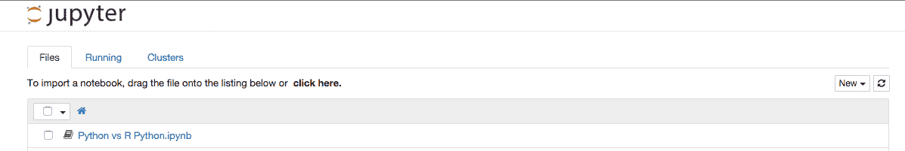
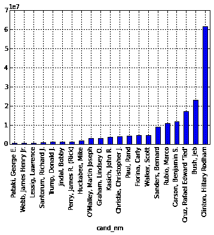
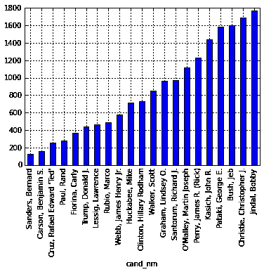

# 用于数据科学的 Python:入门

> 原文：<https://www.dataquest.io/blog/python-data-science/>

January 11, 2016Python is becoming an increasingly popular language for data science, and with good reason. It’s easy to learn, has powerful data science libraries, and integrates well with databases and tools like Hadoop and Spark. With Python, we can perform the full lifecycle of data science projects, including reading data in, analyzing data, visualizing data, and making predictions with machine learning. In this post, we’ll walk through getting started with Python for data science. If you want to dive more deeply into the topics we cover, visit [Dataquest](https://www.dataquest.io), where we teach every component of the Python data science lifecycle in depth. We’ll be working with a dataset of political contributions to candidates in the 2016 US presidential elections, which can be found [here](https://www.fec.gov/data/browse-data/?tab=bulk-data). The file is in *csv* format, and each row in the dataset represents a single donation to the campaign of a single candidate. The dataset has several interesting columns, including:

*   `cand_nm` —接受捐赠的候选人姓名。
*   `contbr_nm` —投稿人姓名。
*   `contbr_state` —说明贡献者的居住地。
*   `contbr_employer` —投稿人工作的地方。
*   `contbr_occupation` —投稿人的职业。
*   `contb_receipt_amount` —贡献的大小，以美元为单位。
*   `contb_receipt_dt` —收到捐款的日期。

## 安装 Python

分析这些数据的第一步是安装

[Python](https://www.python.org/) 。使用 [Anaconda](https://www.anaconda.com/why-anaconda/) 安装 Python 是一个简单的过程，Anaconda 是一个安装 Python 和几个流行的数据分析库的工具。你可以在这里下载蟒蛇。建议安装 *Python 3.5* ，这是 Python 的最新版本。你可以在这里阅读更多关于 Python 2 vs Python 3 [的内容。Anaconda 自动安装了我们将在本文中使用的几个库，包括](https://wiki.python.org/moin/Python2orPython3) [Jupyter](https://jupyter.org/) 、 [Pandas](https://pandas.pydata.org/) 、 [scikit-learn](https://scikit-learn.org/) 和 [matplotlib](https://matplotlib.org/) 。

## Jupyter 入门

现在我们已经安装了所有的东西，我们可以推出 Jupyter notebook(以前称为 IPython notebook)。Jupyter notebook 是一个强大的数据分析工具，使您能够快速浏览数据，可视化您的发现，并分享您的结果。它被 Google、IBM 和 Microsoft 等组织的数据科学家用来分析数据和进行协作。通过运行启动 Jupyter

`ipython notebook`在终端。如果你有困难，检查这里的。您应该会看到一个允许您创建新笔记本的文件浏览器界面。创建一个 *Python 3* 笔记本，我们将在我们的分析中使用它。如果你需要更多的安装帮助，请点击这里查看我们的指南。

### 笔记本电池

每个木星笔记本由多个

*单元格*，可以在其中运行代码或编写解释。您的笔记本最初只有一个*单元*，但是您可以添加更多:

```py
 # This is a code cell.
Any output we generate here will show up below.
print(10)
b = 10 
```

```py
 # You can have multiple cells, and re-run each cell as many times as you want to refine your analysis.
# The power of Jupyter notebook is that the results of each cell you run are cached.
# So you can run code in cells that depends on other cells.
print(b * 10)
```

如果你想了解更多关于 Jupyter 的知识，请查看我们的深入教程

[此处](https://www.dataquest.io/course/python-for-data-science-fundamentals/)。

## 熊猫入门

[Pandas](https://pandas.pydata.org/) 是 Python 的数据分析库。它使我们能够读入各种格式的数据，包括 csv，然后高效地分析这些数据。我们可以使用以下代码读入数据:

```py
 import pandas as pd
donations = pd.read_csv("political_donations.csv")
```

```py
donations.shape
```

```py
(384885, 18)
```

```py
donations.head(2)
```

|  | cmte_id | 坎德 _id | cand_nm | contbr_nm | 控制城市 | 对比 | contbr_zip | contbr _ 雇主 | contbr _ 职业 | contb_receipt_amt | contb_receipt_dt | 收据 _desc | 备忘录 _ 光盘 | 备忘录 _ 文本 | 格式 | file_num | 交易标识 | 选举 _tp |
| --- | --- | --- | --- | --- | --- | --- | --- | --- | --- | --- | --- | --- | --- | --- | --- | --- | --- | --- |
| C00458844 | P60006723 | 红宝石马可 | 库马尔·基布尔 | DPO | 自动曝光装置 | 092131903 | 美国国土安全部 | 法律的实施 | Five hundred | 2015 年 8 月 27 日 | 圆盘烤饼 | 圆盘烤饼 | 圆盘烤饼 | SA17A | One million twenty-nine thousand four hundred and fifty-seven | SA17.813360 | P2016 | 圆盘烤饼 |
| C00458844 | P60006723 | 红宝石马可 | 迈克尔·赫弗南 | 陆军军邮局(Army Post Office) | 自动曝光装置 | 090960009 | 尽最大努力请求的信息 | 尽最大努力请求的信息 | Two hundred and ten | 2015 年 6 月 27 日 | 圆盘烤饼 | 圆盘烤饼 | 圆盘烤饼 | SA17A | One million twenty-nine thousand four hundred and thirty-six | SA17.796904 | P2016 | 圆盘烤饼 |

在上面的单元格中，我们使用

`import pandas as pd`，然后使用 [read_csv()](https://pandas.pydata.org/pandas-docs/stable/generated/pandas.read_csv.html) 方法将`political_donations.csv`读入`donations`变量。`donations`变量是一个 Pandas [DataFrame](https://pandas.pydata.org/pandas-docs/stable/generated/pandas.DataFrame.html) ，它是一个矩阵的增强版本，具有内置的数据分析方法，并允许每列中有不同的数据类型。我们访问`donations`变量的`shape`属性来打印出它有多少行和多少列。当一个语句或变量放在笔记本单元格的最后一行时，它的值或输出会自动呈现！然后我们在数据帧上使用 [head()](https://pandas.pydata.org/pandas-docs/stable/generated/pandas.DataFrame.html) 方法打印出前两行`donations`，这样我们就可以检查它们了。如果你想更深入地了解熊猫，请看我们的课程[这里](https://www.dataquest.io/course/python-for-data-science-intermediate/)。

## 候选人捐款总额

我们可以使用熊猫来计算每个候选人的汇总统计数据

[groupby()](https://pandas.pydata.org/pandas-docs/stable/groupby.html) 法。我们可以首先使用 groupby 方法根据`cand_nm`将`donations`分割成子集。然后，我们可以分别计算每个候选人的统计数据。我们计算的第一个汇总统计数据是捐款总额。为了得到这个，我们只需要对每个候选人的`contb_receipt_amount`列求和。

```py
 donations.groupby("cand_nm").sum().sort("contb_receipt_amt") 
```

|  | contb_receipt_amt | file_num |
| --- | --- | --- |
| cand_nm |  |  |
| --- | --- | --- |
| 乔治·帕塔基 | Three hundred and sixty-five thousand and ninety point nine eight | Two hundred and thirty-four million six hundred and ninety-five thousand four hundred and thirty |
| 小詹姆斯·亨利·韦伯 | Three hundred and ninety-eight thousand seven hundred and seventeen point two five | Seven hundred and nine million four hundred and nineteen thousand eight hundred and ninety-three |
| 劳伦斯·莱西格 | Six hundred and twenty-one thousand four hundred and ninety-four point five | One billion three hundred and seventy-eight million four hundred and eighty-eight thousand four hundred and forty-nine |
| 理查德·桑托勒姆 | Seven hundred and eighty-one thousand four hundred and one point zero three | Eight hundred and twenty-two million eighty-six thousand six hundred and thirty-eight |
| 唐纳德·特朗普 | One million nine thousand seven hundred and thirty point nine seven | Two billion three hundred and fifty-seven million three hundred and forty-seven thousand five hundred and seventy |
| 鲍比·金达尔 | One million thirteen thousand nine hundred and eighteen point one two | Five hundred and eighty-four million eight hundred and ninety-six thousand seven hundred and seventy-six |
| 詹姆斯·佩里(里克) | One million one hundred and twenty thousand three hundred and sixty-two point five nine | Nine hundred and twenty-five million seven hundred and thirty-two thousand one hundred and twenty-five |
| 迈克·哈克比 | One million eight hundred and ninety-five thousand five hundred and forty-nine point one five | Two billion seven hundred million eight hundred and ten thousand two hundred and fifty-five |
| 马丁·约瑟夫·欧玛利 | Two million nine hundred and twenty-one thousand nine hundred and ninety-one point six five | Two billion six hundred and sixty-four million one hundred and forty-eight thousand eight hundred and fifty |
| 林赛·格雷厄姆。 | Two million nine hundred and thirty-two thousand four hundred and two point six three | Three billion one hundred and thirty-one million one hundred and eighty thousand five hundred and thirty-three |
| 约翰·卡西奇 | Three million seven hundred and thirty-four thousand two hundred and forty-two point one two | Two billion six hundred and sixty-nine million nine hundred and forty-four thousand six hundred and eighty-two |
| 克里斯托弗·克里斯蒂 | Three million nine hundred and seventy-six thousand three hundred and twenty-nine point one three | Two billion four hundred and twenty-one million four hundred and seventy-three thousand three hundred and seventy-six |
| 保罗·兰德 | Four million three hundred and seventy-six thousand eight hundred and twenty-eight point one four | Sixteen billion fifty-six million six hundred and four thousand five hundred and seventy-seven |
| 卡莉·菲奥莉娜 | Four million five hundred and five thousand seven hundred and seven point zero six | Twelve billion five hundred and ninety-nine million six hundred and thirty-seven thousand seven hundred and seventy-seven |
| 斯科特·沃克 | Four million six hundred and fifty-four thousand eight hundred and ten point three | Five billion six hundred and thirty-six million seven hundred and forty-six thousand nine hundred and sixty-two |
| 伯纳德·桑德斯 | Nine million eighteen thousand five hundred and twenty-six | Seventy-one billion one hundred and thirty-nine million eight hundred and sixty-four thousand seven hundred and fourteen |
| 红宝石马可 | Ten million seven hundred and forty-six thousand two hundred and eighty-three point two four | Twenty-two billion seven hundred and thirty million one hundred and thirty-nine thousand five hundred and fifty-five |
| 本杰明·卡森 | Eleven million seven hundred and forty-six thousand three hundred and fifty-nine point seven four | Seventy-five billion six hundred and thirteen million six hundred and twenty-four thousand three hundred and sixty |
| 拉斐尔·爱德华·特德·克鲁兹 | Seventeen million eight thousand six hundred and twenty-two point one seven | Sixty-nine billion three hundred and seventy-five million six hundred and sixteen thousand five hundred and ninety-one |
| 布什，杰布 | Twenty-three million two hundred and forty-three thousand four hundred and seventy-two point eight five | Fourteen billion nine hundred and forty-six million ninety-seven thousand six hundred and seventy-three |
| 希拉里·罗德汉姆·克林顿 | Sixty-one million seven hundred and twenty-six thousand three hundred and seventy-four point zero nine | Eighty-six billion five hundred and sixty million two hundred and two thousand two hundred and ninety |

在上面的代码中，我们首先拆分

使用代码`donations.groupby("cand_nm")`根据`cand_nm`将`donations`分组。这将返回一个 [GroupBy](https://pandas.pydata.org/pandas-docs/stable/groupby.html) 对象，它有一些聚合数据的特殊方法。其中一个方法是`sum()`，我们用它来计算每组中每列的总和。当数据被读入时，Pandas 自动识别列的数据类型，并且只对数字列执行 sum 操作。我们最终得到一个数据帧，显示每个候选人的`contb_receipt_amt`和`file_num`列的总和。在最后一步中，我们对数据帧使用 [sort()](https://pandas.pydata.org/pandas-docs/version/0.18.1/generated/pandas.DataFrame.sort.html) 方法，以升序对`contb_receipt_amt`进行排序。这向我们展示了每个候选人收集了多少捐款。

## 可视化捐赠总额

我们可以使用

[matplotlib](https://matplotlib.org/) ，主要的 Python 数据可视化库，进行绘图。Jupyter notebook 甚至支持内联渲染 matplotlib 图。为此，我们需要激活 matplotlib 的*内联*模式。我们可以使用 [Jupyter magics](https://ipython.org/ipython-doc/dev/interactive/tutorial.html#magics-explained) 让 matplotlib 数字显示在笔记本上。魔术是以`%`或`%%`开头的命令，影响 Jupyter notebook 的行为。它们是用来改变 Jupyter 配置的一种方式，不会将命令与 Python 代码混淆。为了使 matplotlib 的数字能够内联显示，我们需要在单元格中运行`%matplotlib inline`。点击阅读更多关于 Jupyter [绘图的信息。这里我们导入`matplotlib`库并激活内联模式:](https://ipython.org/ipython-doc/3/notebook/notebook.html#plotting)

```py
 import matplotlib.pyplot as plt 
```

Pandas 数据框架有内置的可视化支持，您可以调用

[plot()](https://pandas.pydata.org/pandas-docs/stable/generated/pandas.DataFrame.plot.html) 方法从数据帧生成`matplotlib`图。这通常比直接使用`matplotlib`要快得多。首先，我们将前面的数据帧赋给一个变量`total_donations`。然后，我们使用[索引](https://pandas.pydata.org/pandas-docs/stable/indexing.html)来选择数据帧的单个列`contb_receipt_amt`。这就产生了熊猫系列。Pandas 系列的大多数方法与 DataFrames 相同，但它们存储一维数据，就像单行或单列一样。然后，我们可以调用序列上的 [plot()](https://pandas.pydata.org/pandas-docs/version/0.17.1/generated/pandas.Series.plot.html) 方法来生成每个候选人捐款总额的条形图。

```py
total_donations = donations.groupby("cand_nm").sum().sort("contb_receipt_amt") 
```

```py
 total_donations["contb_receipt_amt"].plot(kind="bar") 
```

```py
<matplotlib.axes._subplots.AxesSubplot at 0x108892208>
```



如果您想深入了解 matplotlib，请查看我们的课程

[此处](https://www.dataquest.io/data-science-courses-directory/)。

## 寻找平均捐赠规模

找到平均捐款额而不是总捐款额非常简单。我们只是交换了

`sum()`法为[手段()](https://pandas.pydata.org/pandas-docs/version/0.17.1/generated/pandas.DataFrame.mean.html)法。

```py
 avg_donations = donations.groupby("cand_nm").mean().sort("contb_receipt_amt")
avg_donations["contb_receipt_amt"].plot(kind="bar") 
```

```py
<matplotlib.axes._subplots.AxesSubplot at 0x108d82c50>
```



## 预测捐赠规模

我们来做一个简单的算法，可以根据某人的状态计算出他会捐多少钱(

`contbr_st`)、职业(`contbr_occupation`)和首选候选人(`cand_nm`)。第一步是用这些列和我们想要预测的`contb_receipt_amt`列制作一个单独的数据框架。

```py
pdonations = donations[["contbr_st", "contbr_occupation", "cand_nm", "contb_receipt_amt"]] 
```

现在我们将检查

`pdonations`。当 Pandas 读入一个 csv 文件时，它会自动为每一列分配一个数据类型。我们只能使用数据类型为*数字*的列进行预测。

```py
 pdonations.dtypes 
```

```py
 contbr_st             object
contbr_occupation     object
cand_nm               object
contb_receipt_amt    float64
dtype: object 
```

不幸的是，我们想要用来预测的所有列都是

*对象*数据类型(字符串)。这是因为它们是分类数据。每列都有几个选项，但它们显示为文本，而不是使用数字代码。我们可以将每一列转换成数字数据，方法是先转换成*分类*数据类型，然后再转换成数字。[下面是关于分类数据类型的更多内容。本质上，分类数据类型在后台为列中的每个唯一值分配一个*数字*代码。我们可以用这些代码替换列，完全转换成数字。](https://pandas-docs.github.io/pandas-docs-travis/categorical.html)

```py
 pdonations["contbr_st"] = pdonations["contbr_st"].astype('category')
pdonations["contbr_st"] = pdonations["contbr_st"].cat.codes 
```

```py
 pdonations["contbr_st"] 
```

```py
 0     1
1     1
2     1
3     2
4     2
5     2
6     2
7     2
8     2
9     2
10    2
11    2
12    2
13    2
14    2
...
384870    75
384871    75
384872    75
384873    75
384874    75
384875    75
384876    75
384877    75
384878    75
384879    75
384880    75
384881    75
384882    75
384883    77
384884    77
Name: contbr_st, Length: 384885, dtype: int8 
```

如您所见，我们已经将

`contbr_st`列为数值。我们需要对`contbr_occupation`和`cand_nm`列重复相同的过程。

```py
 for column in ["contbr_st", "contbr_occupation", "cand_nm"]:
    pdonations `= pdonations``.astype('category')
    pdonations` `= pdonations``.cat.codes` 

## 分成训练集和测试集

我们现在可以开始利用

 [scikit-learn](https://scikit-learn.org/) ，主要的 Python 机器学习库，帮助我们完成剩余的预测工作流程。首先，我们将数据分成两组，一组用于训练我们的算法，称为训练集，另一组用于评估模型的性能，称为测试集。我们这样做是为了避免[过度拟合](https://en.wikipedia.org/wiki/Overfitting)，从而得到一个误导性的误差值。我们可以使用 [train_test_split()](https://scikit-learn.org/stable/modules/generated/sklearn.model_selection.train_test_split.html) 函数将`pdonations`拆分成一个训练集和一个测试集。

```
 from sklearn.cross_validation import train_test_split

train, test, y_train, y_test = train_test_split(pdonations[["contbr_st", "contbr_occupation", "cand_nm"]], pdonations["contb_receipt_amt"], test_size=0.33, random_state=1) 
```py

上面的代码拆分了我们要用来为算法定型的列，以及我们要对其进行预测的列(

`contb_receipt_amt`)训练集和测试集各一套。我们获取测试集的数据的`33%`。这些行被随机分配给集合。

## 拟合模型

我们将使用

[随机森林](https://en.wikipedia.org/wiki/Random_forest)算法做出我们的预测。这是一个精确且通用的算法，由 scikit-learn 通过 [RandomForestRegressor](https://scikit-learn.org/stable/modules/generated/sklearn.ensemble.RandomForestRegressor.html) 类实现。这个类使训练模型变得简单，然后用它进行预测。首先，我们将使用`train`和`y_train`来训练模型:

```
 from sklearn.ensemble import RandomForestRegressor
model = RandomForestRegressor(n_estimators=100, min_samples_leaf=10)

model.fit(train, y_train) 
```py

```
RandomForestRegressor(bootstrap=True, compute_importances=None, criterion='mse', max_depth=None, max_features='auto', max_leaf_nodes=None, min_density=None, min_samples_leaf=10, min_samples_split=2, n_estimators=100, n_jobs=1, oob_score=False, random_state=None, verbose=0) 
```py

scikit-learn 的一个伟大之处在于，它对它实现的所有算法都有一个一致的 API。您可以像训练随机森林一样训练线性回归。我们现在有一个合适的模型，所以我们可以用它来做预测。

## 进行预测并发现错误

用 scikit-learn 进行预测非常容易。我们只是将测试数据传递给合适的模型。

```
 predictions = model.predict(test) 
```py

现在我们有了预测，我们可以计算误差。我们的错误将让我们知道我们的模型执行得有多好，并在我们进行调整时给我们一个评估它的方法。我们将使用

[均方误差](https://en.wikipedia.org/wiki/Mean_squared_error)，常见的误差度量。

```
 from sklearn.metrics import mean_squared_error
import math

mean_squared_error(predictions, y_test) 
```py

```
 756188.21680533944 
```py

如果你想了解更多关于 scikit-learn 的知识，请查看我们的教程

[此处](https://www.dataquest.io/course/python-for-data-science-fundamentals)。

## 接下来的步骤

取你得到的误差的平方根，会得到一个误差值，这个误差值更容易考虑捐赠的大小。如果你不求平方根，你会得到平均平方误差，这对我们的数据没有直接意义。无论哪种方式，误差都很大，你可以做很多事情来降低它。

*   添加更多列中的数据。

*   看看每个候选人的模型是否更准确。

*   试试其他算法。

以下是您可以进行的其他一些有趣的数据探索:

*   标出每个州哪个候选人得到的捐款最多。

*   画出每个候选人最喜欢的职业。

*   将候选人按共和党/民主党进行分类，看看是否有什么有趣的模式出现。

*   根据姓名分配性别，看看按性别划分数据是否能揭示出任何有趣的模式。

*   制作美国各地区捐款总额的热图。

如果您想更深入地了解这里提到的概念，请查看我们在

[用于数据科学的 Python](https://www.dataquest.io)。

```