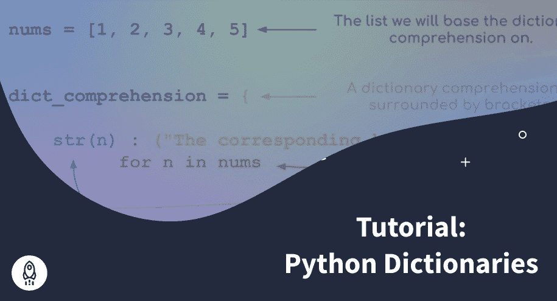

# Python 字典:综合教程(包含 52 个代码示例)

> 原文：<https://www.dataquest.io/blog/python-dictionaries/>

April 1, 2022

## Python 中的字典是什么？

Python 字典是一种数据结构，它允许我们轻松地编写非常高效的代码。在许多其他语言中，这种数据结构被称为**哈希表**，因为它的键是可哈希的。我们很快就会明白这意味着什么。

Python 字典是`key:value`对的集合。你可以把它们想象成单词，以及它们在普通字典中的意思。据说值被*映射*到键。例如，在一本物理词典中，使用计算机方法在复杂数据中搜索模式的定义*科学*被映射到关键字*数据科学*。

在这个 Python 教程中，你将学习如何创建一个 Python 字典，如何使用它的方法，以及*字典理解*，以及哪个更好:字典还是列表。为了充分利用本教程，您应该已经熟悉 Python 列表、for 循环、条件语句以及使用`reader()`方法读取数据集。如果你不是，你可以在 [Dataquest](https://www.dataquest.io/data-science-courses/) 了解更多。

## Python 字典是用来做什么的？

Python 字典允许我们将一个值与一个**惟一的**键相关联，然后通过**快速访问这个值**。每当我们想要找到(查找)某个 Python 对象时，使用它们是一个好主意。我们也可以在这个范围内使用列表，但是它们比字典慢得多。

这个速度是由于字典键是**可散列的**。Python 中的每个*不可变的*对象都是可散列的，所以我们可以将其传递给`hash()`函数，该函数将返回该对象的**哈希值**。然后，这些值用于查找与其唯一键相关联的值。参见下面的`hash()`功能使用示例:

```py
print(hash("b"))
```

```py
2132352943288137677
```

字符串`b`的哈希值为`2132352943288137677`。在您的情况下，该值可能有所不同。

## 如何创建字典？

但是，让我们停止理论，直接进入词典创作。我们有两种主要的方法来定义字典:用花括号`{}`或者使用`dict()`方法。我们将创建两个空字典:

```py
# Create a dictionary
dictionary = {} # Curly braces method
another_dictionary = dict() # Dict method

# Are the above dictionaries equivalent?
print(type(dictionary))
print(type(another_dictionary))
print(dictionary == another_dictionary)
```

```py
 <class><class>True
```

我们可以看到，这两个字典具有相同的数据类型，并且是等效的。现在让我们用键和值填充一个字典。我们可以用方括号来做，就像这个`dictionary[key] = value`。然后，我们可以通过使用*括号符号*来访问该值，我们想要的值在括号之间:`dictionary[key]`。

```py
# Populate the dictionary 
dictionary["key1"] = "value1"

# Access key1
print(dictionary["key1"])
```

```py
value1
```

返回`key1`的值。我们还可以使用下面的语法创建一个预填充的字典:

```py
# Create a dictionary with preinserted keys/values
dictionary = {"key1": "value1"}

# Access key1
print(dictionary["key1"])
```

```py
value1
```

最后，另一种方法是使用`dict()`，其中我们将键和值作为关键字参数列表或元组列表提供:

```py
# Keyword argument list
dictionary = dict(key1="value1", key2="value2")

# Display the dictionary
print(dictionary)
```

```py
{'key1': 'value1', 'key2': 'value2'}
```

```py
# List of tuples
dictionary = dict([("key1", "value1"), ("key2", "value2")])

# Display the dictionary
print(dictionary)
```

```py
{'key1': 'value1', 'key2': 'value2'}
```

我们对键和值使用了字符串数据类型，但是其他允许的数据类型是什么呢？在 Python 字典中，键应该是*可散列的*对象(即使技术上不正确，我们也可以说对象应该是*不可变的*)。因此，像列表这样的可变数据类型是不允许的。让我们尝试不同的数据类型，看看会发生什么:

```py
# Hashing various data types
print(hash(1)) # Integer
print(hash(1.2)) # Float
print(hash("dataquest")) # String
print(hash((1, 2))) # Tuple
print(hash([1, 2, 3]))
```

```py
1
461168601842738689
-3975257749889514375
-3550055125485641917

---------------------------------------------------------------------------

TypeError                                 Traceback (most recent call last)

~\AppData\Local\Temp/ipykernel_10024/758405818.py in <module>
      4 print(hash("dataquest")) # String
      5 print(hash((1, 2))) # Tuple
----> 6 print(hash([1, 2, 3]))

TypeError: unhashable type: 'list'
```

**整数、浮点、字符串和元组是可散列的数据类型**(它们也是*不可变的*)而**列表是不可散列的数据类型**(它们是*可变的*)。Python 使用*哈希值*来快速访问字典的值。

另一方面，值可以是任何类型。让我们使用不同的数据类型向字典添加更多的元素:

```py
# Add more elements to the dictionary
dictionary[42] = "the answer to the ultimate question of life, the universe, and everything."
dictionary[1.2] = ["one point two"]
dictionary["list"] = ["just", "a", "list", "with", "an", "integer", 3]

# Display the dictionary
print(dictionary)
```

```py
{'key1': 'value1', 'key2': 'value2', 42: 'the answer to the ultimate question of life, the universe, and everything.', 1.2: ['one point two'], 'list': ['just', 'a', 'list', 'with', 'an', 'integer', 3]}
```

此外，我们可以用我们用来填充字典的括号符号来修改一个键的值:

```py
# Modify a value
dictionary["list"] = ["it's another", "list"]

# Display the dictionary
print(dictionary)
print()

# Access the value of "list"
print(dictionary["list"])
```

```py
{'key1': 'value1', 'key2': 'value2', 42: 'the answer to the ultimate question of life, the universe, and everything.', 1.2: ['one point two'], 'list': ["it's another", 'list']}

["it's another", 'list']
```

最后，**字典键应该是唯一的**。让我们尝试创建一个具有重复键的字典:

```py
# Dictionary with duplicate keys
duplicated_keys = {"key1": "value1", "key1": "value2", "key1": "value3"}

# Access key1
print(duplicated_keys["key1"])
```

```py
value3
```

只返回最后一个键的值，所以技术上我们可以使用重复的键，但不建议这样做，因为字典的一个优点是快速检索与某个键相关联的值。如果有重复的，我们可能会返回一个我们不想要的值。想象一下，我们查找单词“data”的含义，并在字典中找到这个单词的 10 个不同的条目；可能会比较混乱。

## Python 字典方法

现在让我们看看我们可以用什么方法来使用字典。

### *T2`update()`*

每当我们想要合并字典或使用可迭代对象(例如，可迭代对象是列表或元组)添加新的`key:value`对时， [`update()`方法](https://docs.python.org/3/library/stdtypes.html?highlight=update#dict.update)就很有用。让我们用哈利波特世界中的人物和他们所属的房子来做个例子(**剧透**:我们稍后会用到哈利波特数据集！):

```py
# Create a Harry Potter dictionary
harry_potter_dict = {    
    "Harry Potter": "Gryffindor",
    "Ron Weasley": "Gryffindor",
    "Hermione Granger": "Gryffindor"
}

# Display the dictionary
print(harry_potter_dict)
```

```py
{'Harry Potter': 'Gryffindor', 'Ron Weasley': 'Gryffindor', 'Hermione Granger': 'Gryffindor'}
```

现在让我们使用`update()`方法的不同选项添加其他角色和他们的房子:

```py
# Characters to add to the Harry Potter dictionary
add_characters_1 = {
    "Albus Dumbledore": "Gryffindor",
    "Luna Lovegood": "Ravenclaw"
}

# Merge dictionaries
harry_potter_dict.update(add_characters_1)

# Display the dictionary
print(harry_potter_dict)
```

```py
{'Harry Potter': 'Gryffindor', 'Ron Weasley': 'Gryffindor', 'Hermione Granger': 'Gryffindor', 'Albus Dumbledore': 'Gryffindor', 'Luna Lovegood': 'Ravenclaw'}
```

我们可以看到字典现在包含了阿不思·邓布利多和卢娜。我们还可以使用 iterable 向字典中添加新元素:

```py
# Use iterables to update a dictionary
add_characters_2 = [
    ["Draco Malfoy", "Slytherin"], 
    ["Cedric Diggory", "Hufflepuff"]
]
harry_potter_dict.update(add_characters_2)

print(harry_potter_dict)
```

```py
{'Harry Potter': 'Gryffindor', 'Ron Weasley': 'Gryffindor', 'Hermione Granger': 'Gryffindor', 'Albus Dumbledore': 'Gryffindor', 'Luna Lovegood': 'Ravenclaw', 'Draco Malfoy': 'Slytherin', 'Cedric Diggory': 'Hufflepuff'}
```

我们使用了一个列表列表，其中每个列表的第一个元素是角色的名字，第二个元素是他们的房子。然后,`update()`方法会自动将第一个元素(键)与第二个元素(值)关联起来。出于实验的考虑，尝试用一个列表更新字典，但是每个嵌套列表中有三个元素。

我们也可以使用元组列表:

```py
# Use iterables to update a dictionary
add_characters_3 = [
    ("Rubeus Hagrid", "Gryffindor"), 
    ("Minerva McGonagall", "Gryffindor")
]
harry_potter_dict.update(add_characters_3)

print(harry_potter_dict)
```

```py
{'Harry Potter': 'Gryffindor', 'Ron Weasley': 'Gryffindor', 'Hermione Granger': 'Gryffindor', 'Albus Dumbledore': 'Gryffindor', 'Luna Lovegood': 'Ravenclaw', 'Draco Malfoy': 'Slytherin', 'Cedric Diggory': 'Hufflepuff', 'Rubeus Hagrid': 'Gryffindor', 'Minerva McGonagall': 'Gryffindor'}
```

### *T2`del`*

如果我们想从字典中删除一个`key:value`对呢？我们可以用 [`del`陈述](https://docs.python.org/3/tutorial/datastructures.html#dictionaries)。必须说明的是，`del`不是一个专有的字典方法，而是一个 Python 关键字，我们可以在多种情况下使用它来删除任何 Python 对象(如变量、函数、类、列表元素等)。).

```py
# Delete a key:value pair
del harry_potter_dict["Minerva McGonagall"]

print(harry_potter_dict)
```

```py
{'Harry Potter': 'Gryffindor', 'Ron Weasley': 'Gryffindor', 'Hermione Granger': 'Gryffindor', 'Albus Dumbledore': 'Gryffindor', 'Luna Lovegood': 'Ravenclaw', 'Draco Malfoy': 'Slytherin', 'Cedric Diggory': 'Hufflepuff', 'Rubeus Hagrid': 'Gryffindor'}
```

如果我们试图删除字典中不存在的一对，我们将得到一个`KeyError`:

```py
# Delete a key:value pair that doesn't exist in the dictionary
del harry_potter_dict["Voldemort"]
```

```py
---------------------------------------------------------------------------

KeyError                                  Traceback (most recent call last)

~\AppData\Local\Temp/ipykernel_10024/3860415884.py in <module>
      1 # Delete a key:value pair that doesn't exist in the dictionary
----> 2 del harry_potter_dict["Voldemort"]

KeyError: 'Voldemort'
```

### *`popitem()`* 和 *`pop()`*

有时，我们需要删除词典中插入的最后一个条目。 [`popitem()`方法](https://docs.python.org/3/library/stdtypes.html#dict.popitem)就是方法！注意在 Python 3.7 之前的**，这个方法从字典中移除了一个随机元素:**

```py
# Insert Voldemort
harry_potter_dict["Voldemort"] = "Slytherin"

print("Dictionary with Voldemort:")
print(harry_potter_dict)
print()

# Remove the last inserted item (Voldemort)
harry_potter_dict.popitem()

print("Dictionary after popping the last inserted item (Voldemort):")
print(harry_potter_dict)
```

```py
Dictionary with Voldemort:
{'Harry Potter': 'Gryffindor', 'Ron Weasley': 'Gryffindor', 'Hermione Granger': 'Gryffindor', 'Albus Dumbledore': 'Gryffindor', 'Luna Lovegood': 'Ravenclaw', 'Draco Malfoy': 'Slytherin', 'Cedric Diggory': 'Hufflepuff', 'Rubeus Hagrid': 'Gryffindor', 'Voldemort': 'Slytherin'}

Dictionary after popping the last inserted item (Voldemort):
{'Harry Potter': 'Gryffindor', 'Ron Weasley': 'Gryffindor', 'Hermione Granger': 'Gryffindor', 'Albus Dumbledore': 'Gryffindor', 'Luna Lovegood': 'Ravenclaw', 'Draco Malfoy': 'Slytherin', 'Cedric Diggory': 'Hufflepuff', 'Rubeus Hagrid': 'Gryffindor'}
```

我们还可以删除一个特定的`key:value`对，并使用 [`pop()`方法](https://docs.python.org/3/library/stdtypes.html#dict.pop)返回值:

```py
# Insert Voldemort
harry_potter_dict["Voldemort"] = "Slytherin"

print("Dictionary with Voldemort:")
print(harry_potter_dict)
print()

# Remove the last inserted item (Voldemort)
print("Remove Voldemort and return his house:")
print(harry_potter_dict.pop("Voldemort"))
print()

print("Dictionary after popping the last inserted item (Voldemort):")
print(harry_potter_dict)
```

```py
Dictionary with Voldemort:
{'Harry Potter': 'Gryffindor', 'Ron Weasley': 'Gryffindor', 'Hermione Granger': 'Gryffindor', 'Albus Dumbledore': 'Gryffindor', 'Luna Lovegood': 'Ravenclaw', 'Draco Malfoy': 'Slytherin', 'Cedric Diggory': 'Hufflepuff', 'Rubeus Hagrid': 'Gryffindor', 'Voldemort': 'Slytherin'}

Remove Voldemort and return his house:
Slytherin

Dictionary after popping the last inserted item (Voldemort):
{'Harry Potter': 'Gryffindor', 'Ron Weasley': 'Gryffindor', 'Hermione Granger': 'Gryffindor', 'Albus Dumbledore': 'Gryffindor', 'Luna Lovegood': 'Ravenclaw', 'Draco Malfoy': 'Slytherin', 'Cedric Diggory': 'Hufflepuff', 'Rubeus Hagrid': 'Gryffindor'}
```

### *T2`get()`*

如果我们试图访问字典中不存在的键值，Python 将返回一个`KeyError`。为了解决这个问题，我们可以使用 [`get()`方法](https://docs.python.org/3/library/stdtypes.html#dict.get)，如果它的键在字典中，它将返回值，或者它将返回我们设置的一些默认值:

```py
# Return an existing value
print(harry_potter_dict.get("Harry Potter", "Key not found"))

# Return a default value if no key found in the dictionary
print(harry_potter_dict.get("Voldemort", "Key not found"))

# Try to retrieve a value of a non-existing key without get
print(harry_potter_dict["Voldemort"])
```

```py
Gryffindor
Key not found

---------------------------------------------------------------------------

KeyError                                  Traceback (most recent call last)

~\AppData\Local\Temp/ipykernel_10024/3808675782.py in <module>
      6 
      7 # Try to retrieve a value of a non-existing key without get
----> 8 print(harry_potter_dict["Voldemort"])

KeyError: 'Voldemort'
```

### *T2`setdefault()`*

[`setdefault()`法](https://docs.python.org/3/library/stdtypes.html#dict.setdefault)经常与`get()`法混淆。他们执行或多或少相同的任务。事实上，如果我们怀疑字典中有一个不存在的键，我们可以使用这个方法返回一个默认值。然而，与`get()`不同的是，这个方法**在字典中插入**这个键的默认值:

```py
print("Dictionary without Voldemort.")
print(harry_potter_dict)
print()

print("Return the default value of Voldemort.")
print(harry_potter_dict.setdefault("Voldemort", "Slytherin"))
print()

print("Voldemort is now in the dictionary!")
print(harry_potter_dict)
```

```py
Dictionary without Voldemort.
{'Harry Potter': 'Gryffindor', 'Ron Weasley': 'Gryffindor', 'Hermione Granger': 'Gryffindor', 'Albus Dumbledore': 'Gryffindor', 'Luna Lovegood': 'Ravenclaw', 'Draco Malfoy': 'Slytherin', 'Cedric Diggory': 'Hufflepuff', 'Rubeus Hagrid': 'Gryffindor'}

Return the default value of Voldemort.
Slytherin

Voldemort is now in the dictionary!
{'Harry Potter': 'Gryffindor', 'Ron Weasley': 'Gryffindor', 'Hermione Granger': 'Gryffindor', 'Albus Dumbledore': 'Gryffindor', 'Luna Lovegood': 'Ravenclaw', 'Draco Malfoy': 'Slytherin', 'Cedric Diggory': 'Hufflepuff', 'Rubeus Hagrid': 'Gryffindor', 'Voldemort': 'Slytherin'}
```

### *`items()`**`keys()`**`values()`*

如果我们想返回所有的`key:value`对呢？还是只有钥匙？价值观呢？

第一个问题的答案是 [`items()`法](https://docs.python.org/3/library/stdtypes.html#dict.items)。当在字典上使用时，它将返回一个`dict_items`对象，该对象本质上是一个元组列表，每个元组包含一个键和值。当我们遍历字典时，这个方法可能是有用的，我们将在后面看到。

```py
print(harry_potter_dict.items())
```

```py
dict_items([('Harry Potter', 'Gryffindor'), ('Ron Weasley', 'Gryffindor'), ('Hermione Granger', 'Gryffindor'), ('Albus Dumbledore', 'Gryffindor'), ('Luna Lovegood', 'Ravenclaw'), ('Draco Malfoy', 'Slytherin'), ('Cedric Diggory', 'Hufflepuff'), ('Rubeus Hagrid', 'Gryffindor'), ('Voldemort', 'Slytherin')])
```

如果我们只想得到密钥，我们应该使用 [`keys()`方法](https://docs.python.org/3/library/stdtypes.html#dict.keys)。它将返回一个`dict_keys`对象:

```py
print(harry_potter_dict.keys())
```

```py
dict_keys(['Harry Potter', 'Ron Weasley', 'Hermione Granger', 'Albus Dumbledore', 'Luna Lovegood', 'Draco Malfoy', 'Cedric Diggory', 'Rubeus Hagrid', 'Voldemort'])
```

最后，我们有将值作为一个`dict_values`对象返回的`values()`方法:

```py
print(harry_potter_dict.values())
```

```py
dict_values(['Gryffindor', 'Gryffindor', 'Gryffindor', 'Gryffindor', 'Ravenclaw', 'Slytherin', 'Hufflepuff', 'Gryffindor', 'Slytherin'])
```

## 我什么时候使用所有这些方法？

在这个概述之后，你可能会被大量的信息淹没。确定何时应该使用 Python 字典方法也不容易。别担心——这完全没问题。你不应该试图记住每一个方法及其用例。当你面临一个现实世界的问题时(Dataquest 指导的项目可能是一个好的开始)，你必须使用字典，只要回到这个 Python 教程，看看你能否用这些方法中的一个来解决你的问题。这是您获得宝贵经验并在未来项目中更快使用字典方法的唯一方法！

## 在字典中循环

正如我们能够遍历列表一样，我们也能够遍历字典。它们包含两种不同类型的元素，键和值，所以我们可以同时遍历这两种类型的元素，也可以只遍历其中一种。

首先，我们将使用`items()`方法，它产生键和值:

```py
for key, value in harry_potter_dict.items():
    print((key, value))
```

```py
('Harry Potter', 'Gryffindor')
('Ron Weasley', 'Gryffindor')
('Hermione Granger', 'Gryffindor')
('Albus Dumbledore', 'Gryffindor')
('Luna Lovegood', 'Ravenclaw')
('Draco Malfoy', 'Slytherin')
('Cedric Diggory', 'Hufflepuff')
('Rubeus Hagrid', 'Gryffindor')
('Voldemort', 'Slytherin')
```

```py
# Alternatively
for key_value in harry_potter_dict.items():
    print(key_value)
```

```py
('Harry Potter', 'Gryffindor')
('Ron Weasley', 'Gryffindor')
('Hermione Granger', 'Gryffindor')
('Albus Dumbledore', 'Gryffindor')
('Luna Lovegood', 'Ravenclaw')
('Draco Malfoy', 'Slytherin')
('Cedric Diggory', 'Hufflepuff')
('Rubeus Hagrid', 'Gryffindor')
('Voldemort', 'Slytherin')
```

```py
for key, value in harry_potter_dict.items():
    print(f"The current key is {key} and its value is {value}.")
```

```py
The current key is Harry Potter and its value is Gryffindor.
The current key is Ron Weasley and its value is Gryffindor.
The current key is Hermione Granger and its value is Gryffindor.
The current key is Albus Dumbledore and its value is Gryffindor.
The current key is Luna Lovegood and its value is Ravenclaw.
The current key is Draco Malfoy and its value is Slytherin.
The current key is Cedric Diggory and its value is Hufflepuff.
The current key is Rubeus Hagrid and its value is Gryffindor.
The current key is Voldemort and its value is Slytherin.
```

我们可以看到，这个方法允许我们访问键和值。如果我们只对钥匙感兴趣呢？还是只在价值观上？

```py
# Loop only through the keys
for key in harry_potter_dict.keys():
    print(key)
```

```py
Harry Potter
Ron Weasley
Hermione Granger
Albus Dumbledore
Luna Lovegood
Draco Malfoy
Cedric Diggory
Rubeus Hagrid
Voldemort
```

```py
# Loop only through the values
for value in harry_potter_dict.values():
    print(value)
```

```py
Gryffindor
Gryffindor
Gryffindor
Gryffindor
Ravenclaw
Slytherin
Hufflepuff
Gryffindor
Slytherin
```

让我们更实际一点，也学一个稍微高级一点的方法。有时，我们需要计算字典中每个值的出现频率。我们可以使用来自`collections`的 [`Counter()`方法](https://docs.python.org/3/library/collections.html#counter-objects)，这是一个很棒的 Python 模块，它有很多有用的容器，使我们的编码工作变得更容易。

```py
from collections import Counter

# Frequency of values
counter = Counter(harry_potter_dict.values())
print(counter)
```

```py
Counter({'Gryffindor': 5, 'Slytherin': 2, 'Ravenclaw': 1, 'Hufflepuff': 1})
```

返回的对象`Counter`实际上非常类似于一个字典。我们可以在上面使用`keys()`、`values()`和`items()`方法！

```py
# Items of Counter
for k, v in counter.items():
    print((k, v))
```

```py
('Gryffindor', 5)
('Ravenclaw', 1)
('Slytherin', 2)
('Hufflepuff', 1)
```

```py
# Keys of Counter
for k in counter.keys():
    print(k)
```

```py
Gryffindor
Ravenclaw
Slytherin
Hufflepuff
```

```py
# Values of Counter
for f in counter.values():
    print(f)
```

```py
5
1
2
1
```

## 频率表

当我们必须创建所谓的*频率表*时，Python 字典非常方便。简单来说，键就是我们要统计频率的对象，值就是频率。作为一个例子，我们将使用来自 Kaggle 的[哈利波特电影数据集](https://www.kaggle.com/maricinnamon/harry-potter-movies-dataset)(`Character.csv`数据集)。假设我们想统计数据集中每栋房子出现的频率。为此，我们首先必须创建一个包含频率表的空字典。然后，我们必须遍历房屋列表，如果房屋的关键字已经出现在频率表中，我们就在它的值上加 1。否则，我们为当前的房子创建一个键，并将其映射到值 1(它是 *one* ，因为我们第一次遇到这个元素)。我们还必须考虑数据集中缺失的数据。

```py
from csv import reader

# Open and read the dataset
opened_file_char = open("Characters.csv", encoding="utf-8-sig")
read_file_char = reader(opened_file_char)
hp_characters = list(read_file_char)

# Initialize an empty dictionary that will hold a frequency table
houses = {}

# Create a frequency table
for character in hp_characters[1:]: # Note that we should not include the header in the looping; therefore, we start from index 1
    house = character[4]
    if house in houses:
        houses[house] += 1
    elif house == "":
        continue
    else:
        houses[house] = 1

print(houses)
```

```py
{'Gryffindor': 31, 'Slytherin': 20, 'Ravenclaw': 12, 'Hufflepuff': 8, 'Beauxbatons Academy of Magic': 2, 'Durmstrang Institute': 2}
```

数据集中的大部分角色都来自格兰芬多。为了练习，尝试创建其他列的频率表。

## 嵌套词典

与列表类似，还有**嵌套字典**。换句话说，一个字典可以包含另一个字典！让我们使用同一套哈利波特数据集中的`Movies.csv`数据集。在您的职业生涯中，可能会同时处理多个数据集。组织它们的一种方法是使用字典:

```py
opened_file_movies = open("Movies.csv", encoding="utf-8-sig")
read_file_movies = reader(opened_file_movies)
movies = list(read_file_movies)

# characters key contains Harry Potter characters dataset
# movies key contains movies dataset
hp_datasets = dict(characters=hp_characters, movies=movies)
```

现在，我们可以轻松地访问每个数据集或特定条目。为了说明这一点，让我们访问`characters`数据集的列:

```py
# Columns of the characters dataset
print(hp_datasets["characters"][0])
```

```py
['Character ID', 'Character Name', 'Species', 'Gender', 'House', 'Patronus', 'Wand (Wood)', 'Wand (Core)']
```

我们还可以用 for 循环访问两个数据集的列:

```py
# Columns of both datasets
for v in hp_datasets.values():
    print(v[0])
```

```py
['Character ID', 'Character Name', 'Species', 'Gender', 'House', 'Patronus', 'Wand (Wood)', 'Wand (Core)']
['Movie ID', 'Movie Title', 'Release Year', 'Runtime', 'Budget', 'Box Office']
```

这种方法的替代方法(尤其是当我们没有几十个数据集时)是在字典中重新组织每个数据集。当我们必须访问不同的条目时，这将简化我们的工作:

```py
# Create a dictionary from the characters dataset
characters_dict = dict(
    columns = hp_characters[0],
    data = hp_characters[1:]
)

# Create a dictionary from the movies dataset
movies_dict = dict(
    columns = movies[0],
    data = movies[1:]
)

# Access movies columns and their first entry
print("Movies columns:")
print(movies_dict["columns"])
print()
print("The first entry of movies:")
print(movies_dict["data"][0])
```

```py
Movies columns:
['Movie ID', 'Movie Title', 'Release Year', 'Runtime', 'Budget', 'Box Office']

The first entry of movies:
['1', "Harry Potter and the Philosopher's Stone", '2001', '152', '$125,000,000 ', '$1,002,000,000 ']
```

## 词典理解

Python 中的是一种创建新字典的优雅而高效的方法。你可能已经学习了一些关于列表理解的知识。简单提醒一下:Python 中的理解意味着对 iterable 的每个元素(比如 list)应用相同的操作。让我们来说明这种技术是如何工作的。例如，我们想要一本保存每部哈利波特电影运行时间的字典。让我们从数据集的字典`movies_dict`中创建它:

```py
# Dictionary of movies' runtimes
runtimes = {}
for movie in movies_dict["data"]:
    name = movie[1]
    runtime = int(movie[3])
    runtimes[name] = runtime

# Display the runtimes
print(runtimes)
```

```py
{"Harry Potter and the Philosopher's Stone": 152, 'Harry Potter and the Chamber of Secrets': 161, 'Harry Potter and the Prisoner of Azkaban': 142, 'Harry Potter and the Goblet of Fire': 157, 'Harry Potter and the Order of the Phoenix': 138, 'Harry Potter and the Half-Blood Prince': 153, 'Harry Potter and the Deathly Hallows Part 1': 146, 'Harry Potter and the Deathly Hallows Part 2': 130}
```

现在我们想将每次运行时间从几分钟转换成几小时。首先，我们可以用一个常规的 for 循环来实现:

```py
# Dictionary to hold the runtimes in hours
runtimes_hours = {}

# Transform the runtimes into hours
for k, v in runtimes.items():
    runtimes_hours[k] = round(v / 60, 2)

# Display the runtimes in hours
print(runtimes_hours)
```

```py
{"Harry Potter and the Philosopher's Stone": 2.53, 'Harry Potter and the Chamber of Secrets': 2.68, 'Harry Potter and the Prisoner of Azkaban': 2.37, 'Harry Potter and the Goblet of Fire': 2.62, 'Harry Potter and the Order of the Phoenix': 2.3, 'Harry Potter and the Half-Blood Prince': 2.55, 'Harry Potter and the Deathly Hallows Part 1': 2.43, 'Harry Potter and the Deathly Hallows Part 2': 2.17}
```

但是，我们可以通过在一行代码中创建运行时字典来简化上面的代码:

```py
print({k:round(v / 60, 2) for k, v in runtimes.items()})
```

```py
{"Harry Potter and the Philosopher's Stone": 2.53, 'Harry Potter and the Chamber of Secrets': 2.68, 'Harry Potter and the Prisoner of Azkaban': 2.37, 'Harry Potter and the Goblet of Fire': 2.62, 'Harry Potter and the Order of the Phoenix': 2.3, 'Harry Potter and the Half-Blood Prince': 2.55, 'Harry Potter and the Deathly Hallows Part 1': 2.43, 'Harry Potter and the Deathly Hallows Part 2': 2.17}
```

我们来剖析一下上面的代码。首先，看看 for 循环现在在哪里:我们仍然在循环遍历`runtimes`字典的条目。现在注意花括号:我们在字典里写代码！`k`是我们 for 循环的当前键，冒号(`:`)后我们在`v`上直接执行四舍五入除以 60 *的运算，这是 for 循环的值。*

这段代码执行与前面完全相同的操作，但是它只用了一行而不是三行。

此外，我们还可以添加条件语句。假设我们要排除短于 2.5 小时的电影:

```py
print({k:round(v / 60, 2) for k, v in runtimes.items() if (v / 60) >= 2.5})
```

```py
{"Harry Potter and the Philosopher's Stone": 2.53, 'Harry Potter and the Chamber of Secrets': 2.68, 'Harry Potter and the Goblet of Fire': 2.62, 'Harry Potter and the Half-Blood Prince': 2.55}
```

我们只需要添加一个 if 语句，就可以了。

字典理解也以类似的方式与按键一起工作。你自己试试！

请注意，如果我们有多个条件语句或复杂的操作，最好使用常规的 for 循环，因为字典理解可能会成为一个难以理解的编码丛林，这会破坏 [Python 可读性](https://www.python.org/dev/peps/pep-0020/)的好处。

## Python 字典 vs List:哪个更好？

现在我们对 Python 字典有了更多的了解，是时候比较字典和列表了。哪个更好？两者都不比另一个好，但它们在不同的编码任务中有帮助。

选择这些数据结构之一的规则实际上非常简单:

1.  当您只需要可以通过索引访问的一系列元素时，请选择列表。
2.  如果您需要*快速*访问映射到特定*唯一*键的元素，请选择字典。

不止这些。如果我们想要访问一个特定的元素，字典会快得多，因为它们有一个[常量运行时间](https://www.netguru.com/blog/runtime-of-algorithms-based-on-the-input-size)，这意味着运行时间不依赖于输入对象的大小。相反，当我们想要查看一个元素是否存在于一个列表中时，运行时将取决于这个列表的大小(Python 遍历整个列表)。请看例子:

```py
import time

# Create a list
lst = [ele for ele in range(10**7)]

now = time.time()

if 3 in lst:
    print(True)

list_runtime = time.time() - now

print(f"\nList runtime: {list_runtime} seconds.")
```

```py
True

List runtime: 0.00010442733764648438 seconds.
```

```py
# Create a dictionary
d = {i:i*2 for i in range(10**7)}

now = time.time()

if 3 in d.keys():
    print(True)

dict_runtime = time.time() - now

print(f"\nDictionary runtime: {dict_runtime} seconds.")
```

```py
True

Dictionary runtime: 9.512901306152344e-05 seconds.
```

```py
print(f"Runtime difference between dictionary and list: {list_runtime - dict_runtime} seconds.")
```

```py
Runtime difference between dictionary and list: 9.298324584960938e-06 seconds.
```

这种差异看起来可以忽略不计，但是随着输入量的增加，这种差异会急剧增加。

我们来举一个更具体的例子。通常，我们想要访问列表或字典中的某个元素。为了在列表中找到这个元素，我们首先必须遍历整个列表，而在字典中，我们可以通过使用它的惟一键来快速访问同一个元素。让我们在列表和上面定义的字典中找到 9000000。

```py
# Find 90000000 in the list
now = time.time()

for i in lst:
    if i ==  90000000:
        break

list_runtime = time.time() - now

print(f"\nList runtime: {list_runtime} seconds.")
```

```py
List runtime: 0.27323484420776367 seconds.
```

```py
# Find the value of 90000000 in the dictionary
now = time.time()

num = d[9000000]

dict_runtime = time.time() - now

print(f"\nDictionary runtime: {dict_runtime} seconds.")
```

```py
Dictionary runtime: 3.62396240234375e-05 seconds.
```

```py
print(f"Runtime difference between dictionary and list: {list_runtime - dict_runtime} seconds.")
print(f"\nDictionary is faster by {(list_runtime / dict_runtime) * 100} times!")
```

```py
Runtime difference between dictionary and list: 0.27319860458374023 seconds.

Dictionary is faster by 753967.1052631579 times!
```

字典几乎不用花多少时间就能找到这个号码，而列表执行同样的操作只需要 1 秒钟左右。这部字典几乎快了一百万倍！

## 奖励:使用 *`defaultdict()`* 处理丢失的按键

回想一下，我们使用了`setdefault()`方法在字典中插入一个默认键及其值。我们还使用了`get()`方法来返回一个不存在的键的默认值。执行类似操作的另一种方式是使用`collections`模块()中的 [`defaultdict()`。我们可以用默认值数据类型初始化一个字典，方法是调用它并将我们想要的数据类型传递给方法。现在，如果我们试图访问一个丢失的键，字典将创建这个键并为它映射一个默认值:](https://docs.python.org/3/library/collections.html#defaultdict-objects)

```py
# Import defaultdict
from collections import defaultdict

# Initialize a default dictionary with the list data type
default_d = defaultdict(list)

# Call a missing key
print(default_d["missing_key"])
```

```py
[]
```

这里，该方法创建了一个键`missing_key`并为其分配了一个空列表，因为这是我们的字典的默认值。我们现在可以将一些值追加到这个列表中:

```py
# Append values to missing_key
for i in range(1, 6):
    default_d["missing_key"].append(f"value{i}")

# Call "missing_key"
print(default_d["missing_key"])
print()

# Display default_d
print(default_d)
```

```py
['value1', 'value2', 'value3', 'value4', 'value5']

defaultdict(<class>, {'missing_key': ['value1', 'value2', 'value3', 'value4', 'value5']})
```

我们传递给`defaultdict()`的参数必须是 [**可调用**](https://pythonsimplified.com/what-is-a-callable-in-python/) 。如果我们传递一个不可调用的对象给`defaultdict()`，我们将得到一个`TypeError`:

```py
default_d = defaultdict(0)
```

```py
---------------------------------------------------------------------------

TypeError                                 Traceback (most recent call last)

~\AppData\Local\Temp/ipykernel_10024/3911435701.py in <module>
----> 1 default_d = defaultdict(0)

TypeError: first argument must be callable or None
```

相反，我们可以将任何对象传递给`setdefault()`方法:

```py
d = {}
d.setdefault(0, 0)
print(d)
```

```py
{0: 0}
```

我们再来看看`get()`方法。当我们想要返回一个我们怀疑不存在的键值时，我们使用它。该方法将只返回值，但不会以任何方式更改字典:

```py
# Return the default value of a missing key
print(d.get(3, "three"))
print()

# Display d
print(d)
```

```py
three

{0: 0}
```

现在我们应该能够理解这三种方法的区别了。

## 结论

以下是我们在本教程中介绍的内容:

*   Python 中的字典
*   字典如何让我们快速访问某个 Python 对象
*   用`dict()`方法或花括号创建字典
*   Python 字典方法
*   在字典中循环
*   创建频率表
*   嵌套词典
*   词典理解
*   何时使用列表或字典
*   使用`defaultdict()`处理丢失的按键

请随时在 LinkedIn 或 T2 GitHub 上与我联系。编码快乐！