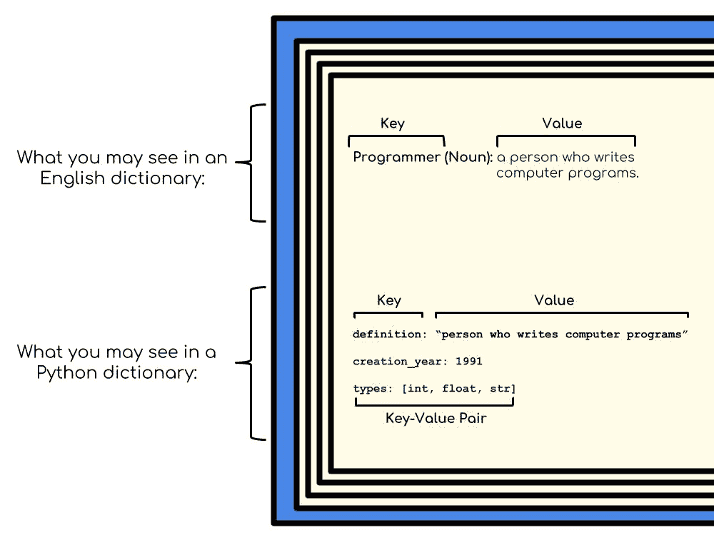
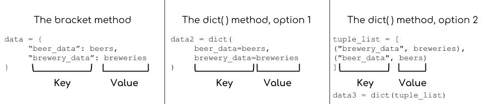
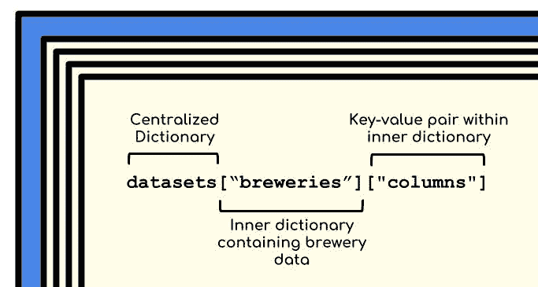
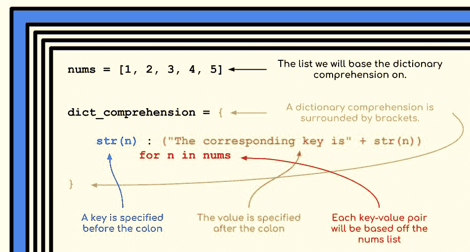
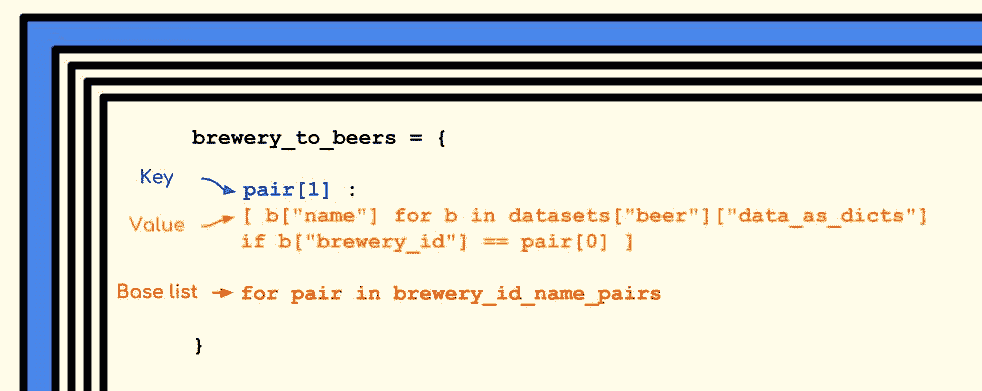
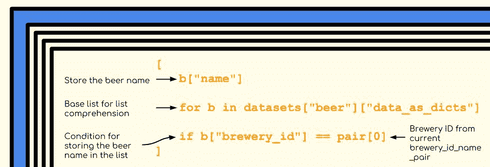

# Python 字典教程:用字典分析精酿啤酒

> 原文：<https://www.dataquest.io/blog/python-dictionary-tutorial/>

October 3, 2018

Python 提供了多种数据结构来保存我们的信息——Python 字典是最有用的数据结构之一，因为它们快速、易用且灵活。

作为一名初级程序员，您可以使用本 Python 教程来熟悉字典及其常见用法，这样您就可以立即开始将它们合并到您自己的代码中。

在执行数据分析时，我们经常会遇到无法使用或难以使用的数据。Python 字典可以帮助我们更容易地阅读和修改数据。

在本教程中，我们将使用 Kaggle 的[精酿啤酒数据集](https://www.kaggle.com/nickhould/craft-cans)。一个数据集描述啤酒的特性，另一个数据集存储啤酒厂的地理信息。出于本文的目的，我们的数据将存储在 beers 和 breweries 变量中，每个变量都是一个列表的列表。

下表给出了数据的大概情况。该表包含 beers 数据集中的第一行。

|  | 酒精度 | 国际冬季两项联盟 | 身份证明（identification） | 名字 | 风格 | 啤酒厂 _id | 盎司 |
| --- | --- | --- | --- | --- | --- | --- | --- |
| Zero | Zero point zero five |  | One thousand four hundred and thirty-six | 酒吧啤酒 | 美国淡啤酒 | Four hundred and eight | Twelve |

该表包含啤酒厂数据集的第一行。

|  | 名字 | 城市 | 状态 |
| --- | --- | --- | --- |
| Zero | 诺斯盖特酿酒公司 | 明尼阿波利斯 | 全部商船 |

### 必备知识

本文假设您对 Python 有基本的了解。要完全理解这篇文章，你应该熟悉列表和`for`循环。如果你还没有，看看[我们的互动 Python 基础课程](https://www.dataquest.io/course/python-for-data-science-fundamentals/)，它涵盖了这些不需要经验的主题。

在本教程中，我们将涵盖:

*   与 Python 字典相关的关键术语和概念
    *   词典规则
*   基本字典操作
    *   创建和删除
    *   访问和插入
    *   成员资格检查
*   循环技术
*   词典释义
*   字典的优点和缺点

### 进入我们的角色

假设我们是一本啤酒爱好者杂志的评论员。我们希望在到达目的地进行评估之前，提前了解每家啤酒厂的产品，以便收集有用的背景信息。我们的数据集包含啤酒和啤酒厂的信息，但数据本身并不能立即访问。

数据目前以列表的*列表的形式存在。若要访问单个数据行，必须使用编号索引。要获得`breweries`的第一个*数据行*，您需要查看第二个项目(列名在前)。*

啤酒厂[1]

`breweries[1]`是一个列表，所以你也可以从它开始索引。获得该列表中的第三项看起来像:

啤酒厂[1][2]

如果你不知道`breweries`是关于啤酒厂的数据，你将很难理解索引试图做什么。想象一下，写下这段代码，6 个月后再看一遍。你很可能会忘记，所以以一种更易读的方式重新格式化数据对我们来说是有好处的。

## 关键术语和概念

Python 字典由**键值对**组成。在 Python 字典中查找*键*类似于在物理字典中查找特定的单词。*值*是与关键字相关联的相应数据，相当于物理词典中的单词定义。关键是我们查找什么，这是我们真正感兴趣的值。当我们谈论 Python 字典时，我们说值被*映射*到键。在上面的例子中，如果我们在英语词典中查找“程序员”这个词，我们会看到:“编写计算机程序的人。”单词“程序员”是映射到该单词定义的关键。

## 键和值的 Python 字典规则

Python 字典非常灵活，因为它们允许将任何东西存储为值，从字符串和浮点等基本类型到对象等更复杂的类型，甚至其他字典(稍后将详细介绍)。

相比之下，什么可以被用作键是有限制的。在 Python 中，一个键必须是一个不可变的对象，这意味着它是不可变的。这个规则允许字符串、整数和元组作为键，但是排除了列表和字典，因为它们是**可变的**，或者能够被改变。基本原理很简单:如果一个键在您不知道的情况下发生了任何变化，您将无法再访问该值，从而使字典变得无用。因此，只允许不可变的对象作为键。

一个键在字典中也必须是唯一的。字典的键值结构使得它如此强大，在这篇文章中，我们将深入研究它的基本操作、用例以及它们的优缺点。

## 基本字典操作

#### 创建和删除

先说如何创建词典。首先，我们将学习如何创建一个空字典，因为您经常会发现您希望从一个空字典开始，并根据需要填充数据。

要创建一个空字典，我们可以使用没有输入的`dict()`函数，或者给一个变量分配一对中间没有任何内容的花括号。我们可以确认这两种方法会产生相同的结果。

```py
empty = {}
also_empty = dict()
empty == also_empty
>>> True
```

现在，一个空字典对任何人都没有多大用处，所以我们必须添加自己的键值对。我们将在本文的后面讨论这个问题，但是我们可以从空字典开始，在它们被创建后填充它们。这将允许我们在需要时添加更多的信息。

```py
empty["First key"] = "First value"
empty["First key"]
>>> "First value"
```

或者，您也可以创建一个字典，并用键值对预先填充它。有两种方法可以做到这一点。第一种是使用包含键值对的括号。每个键和值由一个`:`分隔，而单独的键和值由逗号分隔。

虽然您可以将所有内容放在一行中，但是最好将键值对拆分到不同的行中，以提高可读性。

```py
data = {
"beer_data": beers,
"brewery_data": breweries
}
```

上面的代码创建了一个字典`data`，其中我们的键是描述性的字符串，值是我们的数据集。这个字典允许我们通过名字访问两个数据集。

创建 Python 字典的第二种方法是通过`dict()`方法。您可以将键和值作为关键字参数或元组列表提供。我们将使用`dict()`方法重新创建`data`字典，并适当地提供键值对。

```py
# Using keyword arguments
data2 = dict(beer_data=beers, brewery_data=breweries)
# Using a list of tuples
tuple_list = [("brewery_data", breweries), ("beer_data", beers)]
data3 = dict(tuple_list)
```

我们可以确认每一个`data`字典在 Python 的眼里都是等价的。

```py
data == data2 == data3
>>> True
```

对于每个选项，键和值对必须以特定的方式格式化，因此很容易混淆。下图有助于理清键和值在每个中的位置。



我们现在有三本字典存储完全相同的信息，所以我们最好只保留一本。字典本身没有删除的方法，但是 Python 为此提供了`del`语句。

```py
del data2
del data3
```

创建词典后，您几乎肯定需要添加和删除词典中的条目。Python 为这些操作提供了简单易读的语法。

#### 数据访问和插入

我们的 beers and breweries 字典的当前状态仍然很糟糕——每个数据集最初都是列表的列表，这使得很难访问特定的数据行。

通过将每个数据集重新组织到它自己的字典中，并创建一些有用的键-值对来描述字典中的数据，我们可以实现更好的结构。原始数据本身是混杂的。每个列表中的第一行是包含列名的字符串列表，但其余部分包含实际数据。最好将列从数据中分离出来，这样我们可以更清楚。

因此，对于每个数据集，我们将创建一个字典，其中三个键映射到以下值:

1.  原始数据本身
2.  包含列名的列表
3.  包含其余数据的列表列表

```py
beer_details = {
"raw_data": beers,
"columns": beers[0],
"data": beers[1:]
}
brewery_details = {
"raw_data": breweries,
"columns": breweries[0],
"data": breweries[1:]
}
```

现在，我们可以显式引用`columns`键来列出数据的列名，而不是索引`raw_data`中的第一项。

类似地，我们现在能够明确地从`data`键请求*只是*数据。到目前为止，我们已经学会了如何创建空的和预填充的字典，但是我们不知道一旦它们被创建，如何从它们读取信息。

为了访问 Python 字典中的条目，我们需要**括号符号**。我们引用字典本身，后跟一对括号，括号中有我们要查找的关键字。例如下面，我们从`brewery_details`中读取列名。

```py
brewery_details["columns"]
>>> ['', 'name', 'city', 'state']
```

这个动作感觉应该和我们在英语词典里查单词差不多。我们“查找”了一个键，并在映射值中获得了我们想要的信息。

除了查找键-值对，有时我们实际上想要*改变*与字典中的键相关的值。该操作也使用括号符号。要改变一个字典值，我们首先访问这个键，然后使用一个`=`表达式重新分配它。我们在上面的代码中看到，其中一个 brewery 列是一个空字符串，但是第一列实际上包含了每个 brewery 的惟一 ID！我们将把第一个列名重新分配给一个信息更丰富的名称。

```py
# reassigning the first column of the breweries data set
brewery_details["columns"][0] = 'brewery_id'
# confirming that our reassignment worked
brewery_details["columns"][0]
>>> "brewery_id"
```

如果括号系列看起来令人困惑，不要烦恼。我们利用了筑巢的优势。我们知道`brewery_details`中的`columns`键被映射到一个列表，所以我们可以将`brewery_details["columns"]`视为一个列表(即我们可以使用列表索引)。

如果我们不知道每一层代表什么，嵌套会变得混乱，但是我们在下面可视化这个嵌套来澄清。在字典中嵌套字典也是一种常见的做法，因为这样会产生**自文档化的**代码。也就是说，仅仅通过阅读代码就可以清楚地知道代码在做什么，而不需要任何注释来帮助。

自文档化代码*非常*有用，因为在通读时理解起来更容易、更快。我们希望保持这种自我记录的品质，所以我们将把`beer_details`和`brewery_details`字典嵌套到一个集中的字典中。最终结果将是嵌套的 Python 字典，比原始数据本身更容易读取。

```py
# datasets is now a dictionary whose values are other dictionaries
datasets = {
"beer": beer_details,
"breweries": brewery_details
}
# This structure allows us to make self-documenting inquiries to both data sets
datasets["beer"]["columns"]
>>> ['', 'abv', 'ibu', 'id', 'name', 'style', 'brewery_id', 'ounces']
# Compare the above to how our older data dictionary would have been written
data["beer_data"][0]
>>> ['', 'abv', 'ibu', 'id', 'name', 'style', 'brewery_id', 'ounces']
```

如果我们将字典嵌套在字典中，嵌入在代码中的信息就很清楚了。我们已经创建了一个容易描述程序员意图的结构。下图分解了字典嵌套。



从现在开始，我们将使用`datasets`来管理我们的数据集并执行更多的数据重组。我们制作的啤酒和啤酒厂词典是一个良好的开端，但我们可以做得更多。我们希望创建一个新的键-值对来包含每个数据集所包含内容的字符串描述，以防我们忘记。

我们可以创建字典，读取和更改现有键-值对的值，但是我们不知道如何插入新的键-值对。幸运的是，插入对类似于重新分配字典值。如果我们给一个字典中不存在的键赋值，Python 将获取新的键和值，并在字典中创建一对。

```py
# The description key currently does not exist in either the inner dictionary
datasets["beer"]["description"] = "Contains data on beers and their qualities"
datasets["breweries"]["description"] = "Contains data on breweries and their locations"
```

虽然 Python 使得向字典中插入新的键对变得很容易，但是如果用户试图访问不存在的键，它就会阻止用户。如果你试图访问一个不存在的键，Python 将抛出一个错误并停止你的代码运行。

```py
# The key best_beer doesn't currently exist, so we cannot access it
datasets["beer"]["best_beer"]
>>> KeyError: 'best_beer'
```

随着 Python 字典变得越来越复杂，越来越容易忘记存在哪些键。如果你把代码放了一个星期，却忘记了字典里有什么，你会不断地碰到`KeyErrors`。

谢天谢地，Python 为我们提供了一种简单的方法来检查字典中的当前键。这个过程被称为*成员资格检查*。

#### 成员资格检查

如果我们想检查一个键是否存在于字典中，我们可以使用`in`操作符。您还可以使用`not in`来检查一个键是否不存在。生成的代码读起来几乎像自然英语，这也意味着乍看起来更容易理解。

```py
"beer" in datasets
>>> True
"wine" in datasets
>>> False
"wine" not in datasets
>>> True
```

将 in 用于成员检查与`if-else`语句结合使用非常有用。这种组合允许您设置条件逻辑，这将阻止您获得`KeyErrors`，并使您能够编写更复杂的代码。我们不会深究这个概念，但结尾部分有一些资料可供好奇者参考。

#### 章节摘要

至此，我们知道了如何创建、读取、更新和删除 Python 字典中的数据。我们将两个原始数据集转换成了具有更好可读性和易用性的字典。有了这些基本的字典操作，我们可以开始执行更复杂的操作。例如，想要循环访问键值对并在每一对上执行一些操作是非常常见的。

## 循环技术

当我们为每个数据集创建`description`键时，我们创建了两个单独的语句来创建每个键-值对。因为我们执行了相同的操作，所以使用循环会更有效。Python 提供了三种在循环中使用字典的主要方法:`keys()`、`values()`和`items()`。使用`keys()`和`values()`可以让我们遍历字典中的这些部分。

```py
for key in datasets.keys():
    print(key)
>>> beer
>>> breweries
for val in datasets.values():
    print(type(val))
>>> <class 'dict'
>>>> <class 'dict'>
```

`items()`方法将两者合二为一。在循环中使用时，`items()`以元组的形式返回键值对。这个元组的第一个元素是键，第二个元素是值。我们可以使用*析构*将这些元素转化为适当的信息变量名称。第一个变量`key`将获取元组中的键，而`val`将获取映射的值。

```py
for key, val in datasets.items():
    print(f'The {key} data set has {len(val["data"])} rows.')
>>> The beer data set has 2410 rows.
>>> The breweries data set has 558 rows.
```

上面的循环告诉我们，啤酒数据集比啤酒厂数据集大得多。我们预计啤酒厂会出售多种类型的啤酒，所以啤酒的数量应该比啤酒厂的总体数量多。我们的循环证实了这个想法。

目前，每个数据行都是一个列表，因此不希望通过编号来引用这些元素。相反，我们将把每个数据行转换成它自己的字典，并将列名映射到它的实际值。从长远来看，这将使数据分析更加容易。我们应该在两个数据集上执行这个操作，所以我们将利用我们的循环技术。

```py
# Perform this operation for both beers and breweries data setsfor k, v in datasets.items():
# Initialize a key-value pair to hold our reformatted data
v["data_as_dicts"] = []
# For every data row, create a new dictionary based on column names
for row in v["data"]:
    data_row_dict = dict(zip(v["columns"], row))
    v["data_as_dicts"].append(data_row_dict)
```

上面有很多，我们慢慢分解。

1.  我们遍历`datasets`以确保我们转换了啤酒和啤酒厂的数据。
2.  然后，我们创建一个名为`data_as_dicts`的新键，映射到一个空数组，该数组将保存我们的新字典。
3.  然后我们开始迭代包含在`data`键中的所有数据。`zip()`是一个函数，它接受两个或多个列表，并根据这些列表生成元组。
4.  我们利用`zip()`输出并使用`dict()`以我们喜欢的形式创建新数据:列名映射到它们的实际值。
5.  最后，我们将它添加到`data_as_dicts`列表中。最终结果是更好的格式化数据，更容易阅读和重复使用。

我们可以看看下面的最终结果。

```py
# The first data row in the beers data set
datasets["beer"]["data_as_dicts"][0]
>>> {'': '0',
'abv': '0.05',
'brewery_id': '408',
'ibu': '',
'id': '1436',
'name': 'Pub Beer',
'ounces': '12.0',
'style': 'American Pale Lager'}
# The first data row in its original form
datasets["beer"]["raw_data"][0]
>>> ['0', '0.05', '408', '', '1436', 'Pub Beer', '12.0', 'American Pale Lager']
```

#### 章节摘要

在本节中，我们学习了如何通过`for`循环使用字典。使用循环，我们将每个数据行重新格式化为字典，以增强可读性。当我们回头看自己写的代码时，未来的自己会感谢我们。

我们现在开始执行最后的操作:将所有的啤酒匹配到各自的酿酒厂。每种啤酒都有一个啤酒厂，由两个数据集中的`brewery_id`键给出。我们将创建一个全新的数据集，将所有啤酒与它们的酿酒厂匹配起来。

我们*可以*使用循环来实现这一点，但是我们可以使用高级的 Python 字典操作，将这种数据转换从多行循环变成单行代码。

## 词典释义

`beers`数据集中的每种啤酒都与一个`brewery_id`相关联，后者与`breweries`的一家啤酒厂相关联。使用这个 ID，我们可以将所有的啤酒与它们的酿酒厂配对。

通常，转换原始数据并将其放入一个新变量中比改变原始数据本身更好。因此，我们将在`datasets`中创建另一个字典来保存我们的配对。在这个新字典中，啤酒厂名称本身是关键，映射的值将是一个包含啤酒厂提供的所有啤酒名称的列表，我们将基于`brewery_id`数据元素匹配它们。

我们可以用之前学过的循环技术很好地执行这种匹配，但是还有最后一个字典方面要教。代替循环，我们可以使用**字典理解**简洁地执行匹配。

在计算机科学术语中,“理解”意味着对集合(如列表)中的所有项目执行一些任务或功能。就语法而言，字典理解类似于列表理解，但它是从基本列表创建字典的。

如果你需要复习单词理解，你可以在这里查看这个教程。举个简单的例子，我们将使用字典理解从数字列表中创建一个字典。

```py
nums = [1, 2, 3, 4, 5]
dict_comprehension = {
str(n) : "The corresponding key is" + str(n) for n in nums}
for val in dict_comprehension.values():
    print(val)
>>> The corresponding key is 1
The corresponding key is 2
The corresponding key is 3
The corresponding key is 4
The corresponding key is 5
```

我们将在下面剖析字典理解代码:



为了创建字典理解，我们将 3 个元素放在左右括号中:

1.  基本列表
2.  基本列表中每个项目的键应该是什么
3.  基本列表中每个项目的值应该是多少

`nums`构成了`dict_comprehension`的键值对所基于的基本列表。键是每个数字的字符串版本(以区别于列表索引)，而值是描述键是什么的字符串。

这个特别的例子本身是没有用的，但是用来说明理解字典的复杂语法。现在我们知道了字典理解是如何组成的，当我们将它应用到我们的啤酒和酿酒厂数据集时，我们将看到它的真正效用。我们只需要啤酒厂数据集的两个方面来执行匹配:

1.  啤酒厂名称
2.  啤酒厂 ID

首先，我们将创建一个元组列表，其中包含每个啤酒厂的名称和 ID。由于在`data_as_dicts`键中重新格式化的数据，这段代码很容易写成列表理解。

```py
# This list comprehension captures all of the brewery IDs and names from store
brewery_id_name_pairs = [
(row["brewery_id"], row["name"]) for row in datasets["breweries"]["data_as_dicts"]]
```

`brewery_id_name_pairs`现在是元组列表，并将形成字典理解的基本列表。有了这个基本列表，我们将使用啤酒厂的名称作为我们的键，使用 list comprehension 作为值。

```py
brewery_to_beers = {
pair[1] : [b["name"] for b in datasets["beer"]["data_as_dicts"] if b["brewery_id"] == pair[0]] for pair in brewery_id_name_pairs
}
```

在我们讨论这个怪物是如何工作的之前，有必要花一些时间来看看实际的结果是什么。

```py
# Confirming that a dictionary comprehension creates a dictionary
type(brewery_to_beers)
>>> <class 'dict'>
# Let's see what the Angry Orchard Cider Company (a personal favorite) makes
brewery_to_beers["Angry Orchard Cider Company"]
>>> ["Angry Orchard Apple Ginger", "Angry Orchard Crisp Apple", "Angry Orchard Crisp Apple"]
```

正如我们对这个简单的例子所做的那样，我们将强调这个笨拙(尽管有趣)的字典理解的关键部分。



如果我们把代码拆开，突出特定的部分，代码背后的结构就会变得更加清晰。钥匙取自`brewery_id_name_pair`的适当部位。映射值占据了这里的大部分逻辑。值是用条件逻辑的列表理解。

简单地说，当啤酒的关联`brewery_id`与迭代中的当前啤酒厂匹配时，list comprehension 将存储啤酒数据中的任何啤酒。下面的另一幅插图展示了根据目的理解列表的代码。

因为我们的字典理解是基于所有 T2 啤酒厂的列表，所以最终结果是我们想要的:一个新的字典，它将啤酒厂的名称映射到它销售的所有啤酒！现在，当我们到达一家酿酒厂时，我们只需查阅`brewery_to_beers`就能立即了解他们有什么！

这一部分有一些复杂的代码，但它完全在你的掌握之中。如果您仍然有困难，请继续复习语法，并尝试创建您自己的 Python 字典理解。不久，您的编码库中就会有它们了。

在本教程中，我们已经讨论了很多关于如何使用词典的内容，但是重要的是后退一步，看看*为什么*我们可能想要使用(或不使用)它们。

## Python 字典的优点和缺点

我们已经提到*很多次*字典增加了我们代码的可读性。能够写出我们自己的密钥给了我们灵活性，并增加了一层自我文档。理解代码所做的事情花费的时间越少，理解和调试就越容易，实现分析就越快。

除了以人为中心的优势，还有速度优势。在 Python 字典中查找关键字很快。计算机科学家可以通过查看完成一项计算机任务(即查找一个键或运行一个算法)需要多少操作来衡量它需要多长时间。他们用*大 O 符号*来描述这些时间。一些任务很快，在*常数时间*内完成，而更大的任务可能需要指数数量的运算，在*多项式时间*内完成。

在这种情况下，在*恒定时间*内完成查找键。将这与在大列表中搜索相同的项目进行比较。计算机必须检查列表中的每一项，所以所花的时间将与列表的长度成比例。我们称之为*线性时间*。如果你的列表特别大，那么寻找*一个*条目将花费**比仅仅在字典中将它分配给一个键-值对并寻找键更长的时间。**

在更深的层次上，字典是一个**散列表**的实现，对它的解释超出了本文的范围。重要的是要知道，我们字典的好处本质上是散列表本身的好处:快速的键查找和成员检查。

我们前面提到过，字典是无序的，这使得它们不适合于有序的数据结构，相对于其他 python 结构，占用了更多的空间，尤其是当你有大量的键时。考虑到内存非常便宜，这种缺点通常不会很明显，但是了解一下字典产生的开销是有好处的。

我们只讨论了普通的 Python 字典，但是 Python 中还有其他的实现来增加额外的功能。我在最后加入了进一步阅读的链接。我希望在读完这篇文章之后，你会更加自如地使用字典，并在你自己的编程中找到它们的用处。也许你已经找到了一种啤酒，你可能想在未来尝试！

## 进一步阅读

我们已经介绍了字典的基础知识，但是没有介绍所有可用的方法。

*   [Python 的字典文档](https://docs.python.org/3/tutorial/datastructures.html#dictionaries)
*   [Python 字典是哈希表的实现](https://en.wikipedia.org/wiki/Hash_table)
*   [Python 中的增强词典](https://docs.python.org/2/library/collections.html#collections.OrderedDict)
*   [Python 中的错误处理](https://docs.python.org/3/tutorial/errors.html#handling-exceptions)
*   [Python 教程](https://www.dataquest.io/python-tutorials-for-data-science/) —我们不断扩充的数据科学 Python 教程列表。
*   [数据科学课程](https://www.dataquest.io/data-science-courses) —通过完全交互式的编程、数据科学和统计课程，让您的学习更上一层楼，就在您的浏览器中。

## 这个教程有帮助吗？

选择你的道路，不断学习有价值的数据技能。

[Python Tutorials](/python-tutorials-for-data-science/)

在我们的免费教程中练习 Python 编程技能。

[Data science courses](/data-science-courses/)

通过我们的交互式浏览器数据科学课程，投入到 Python、R、SQL 等语言的学习中。