# xlwings 教程:使用 Python 让 Excel 更快

> 原文：<https://www.dataquest.io/blog/python-excel-xlwings-tutorial/>

September 24, 2019

Excel 在当今企业中非常普遍。在 Dataquest，出于多种原因，我们通常建议使用代码[，我们的许多](https://www.dataquest.io/blog/9-reasons-excel-users-should-consider-learning-programming/)[数据科学课程](https://www.dataquest.io/path/data-scientist/)旨在教授数据分析和数据科学的高效编码。但是，无论您多么喜欢使用 Python，在一天结束时，有时还是需要使用 Excel 展示您的发现或共享您的数据。

但这并不意味着不能享受 Python 的一些高效性！事实上，使用一个名为`xlwings`的库，您可以使用 Python 使在 Excel 中工作更快。

在本 xlwings 教程中，我们将介绍如何在 Excel 中使用 Python 来执行和使用一些常见操作，如基于特定标准删除行、使用 Excel 函数和公式、自动填充、创建表格、图表等。为了阅读这篇文章，你应该熟悉 Python 的基本概念(对象、方法、属性、函数)和 Python 的语法，并具备 Excel 和 [VBA](https://en.wikipedia.org/wiki/Visual_Basic_for_Applications) 的中级知识。

我们将使用一个数据集，该数据集包含一个名为 [EuroMillions](https://en.wikipedia.org/wiki/EuroMillions) 的欧洲彩票的抽奖信息。这个数据集是从[这个](http://lottery.merseyworld.com/cgi-bin/lottery?days=20&Machine=Z&Ballset=0&order=0&show=1&year=0&display=CSV)链接下载的，它包含了截至 9 月 20 日(含 9 月 20 日)的所有 EuroMillions 汇票。该链接上的可用数据应该会随着你阅读这篇文章时的最新信息而更新，但如果它不可用，[这里有一个 CSV 文件](https://www.dataquest.io/wp-content/uploads/2019/09/euromillions.csv)，其中包含该链接截至 9 月 20 日的数据。

Euromillions 是一种在一些欧洲国家发行的跨国彩票，特别是在安道尔、奥地利、比利时、法国(包括海外地区和集体)、爱尔兰、马恩岛、列支敦士登、卢森堡、摩纳哥、葡萄牙、西班牙、瑞士和英国( [source](https://en.wikipedia.org/wiki/EuroMillions#Eligibility) )。

截至本文撰写之时，抽奖由 50 个号码(编号为 1 至 50)中的 5 个号码和 12 个号码中的 2 个号码`lucky stars`组成。为了赢得头奖，参与者必须正确选择所有抽取的数字和幸运星。有史以来最大的累积奖金是 1.9 亿欧元。(不过，请注意，我们的数据集以英镑而不是欧元来命名奖金)。

在本教程中，我们将使用 Python 和 xlwings 以及 Excel 来清理数据集，然后生成一些图表来直观显示哪些号码最常赢得欧洲百万大奖。

```py
 import pandas as pd
import xlwings as xw
df = pd.read_csv('euromillions.csv')
df.sample(5) 
```

|  | 号码 | 一天 | 直接伤害 | 嗯 | YYYY | N1 | N2 | N3 | N4 | N5 | 腰神经 2 | L2 | 头奖 | 视窗网际网路名称服务 |
| --- | --- | --- | --- | --- | --- | --- | --- | --- | --- | --- | --- | --- | --- | --- |
| Six hundred and twenty-seven | Five hundred and fourteen | Fri | Twenty-four | 八月 | Two thousand and twelve | six | five | Nineteen | Thirty-seven | Twelve | seven | three | Thirty-seven million seven hundred and nine thousand and forty-seven | one |
| Two hundred and thirty | Nine hundred and eleven | 周二 | Fourteen | 六月 | Two thousand and sixteen | Thirteen | Fifty | forty-two | Thirty-nine | Thirty-four | Eleven | nine | Eleven million nine hundred and twenty-eight thousand | Zero |
| Nine hundred and ninety-eight | One hundred and forty-three | Fri | three | 十一月 | Two thousand and six | Thirteen | Eleven | forty-four | Twenty-four | forty-nine | nine | three | Eighty-eight million three hundred and forty-four thousand and ninety-nine | Zero |
| One thousand and seventy-one | Seventy | Fri | Ten | 六月 | Two thousand and five | Thirty-seven | Thirty-two | Forty-seven | seven | six | seven | one | Twenty-one million seven hundred and thirty-four thousand six hundred and ninety-nine | Zero |
| Five hundred and twenty-two | Six hundred and nineteen | 周二 | Twenty-seven | 八月 | Two thousand and thirteen | seven | Forty | Thirty-eight | Forty-three | Thirty | six | Two | Twelve million nine hundred and thirty-one thousand five hundred | Zero |

第一列是开奖号码，`N1-L2`列是开奖号码和幸运星(按照开奖的顺序)，`Jackpot`列是以欧元为单位的头奖，`Wins`列告诉我们有多少赌注中了头奖。

## 见面`xlwings`

`xlwings`是一个 Python 库，它使得 Python 的一些数据分析特性在 Excel 实例中可用，包括对`numpy`数组和`pandas`系列和数据帧的支持。像任何其他 Python 库一样，它可以使用常见的方法安装，如`pip`或`conda`，但是如果您需要更多的细节，您可以[在这里](https://docs.xlwings.org/en/stable/installation.html)访问`xlwings`的文档。

请注意，您需要在用于学习 xlwings 教程的计算机上安装一个版本的 Microsoft Excel。

#### `xlwings`物体

在`xlwings`中，有四种主要的对象类型，按照层级递减的顺序依次为:`App`(代表一个 Excel 实例)、`Book`、`Sheet`和`Range`。除此之外，我们还将处理`Chart`和`Shape`对象。你可以在[官方文档](https://docs.xlwings.org/en/stable/api.html#object-model)中找到关于这些和其他对象的有用信息，但是我们将一次一个地查看这些对象。

让我们首先创建一个`Book`实例，并将其命名为`wb`(工作簿)。

```py
 wb = xw.Book() # wb = xw.Book(filename) would open an existing file 
```

当您运行该代码时，它应该看起来像这样。

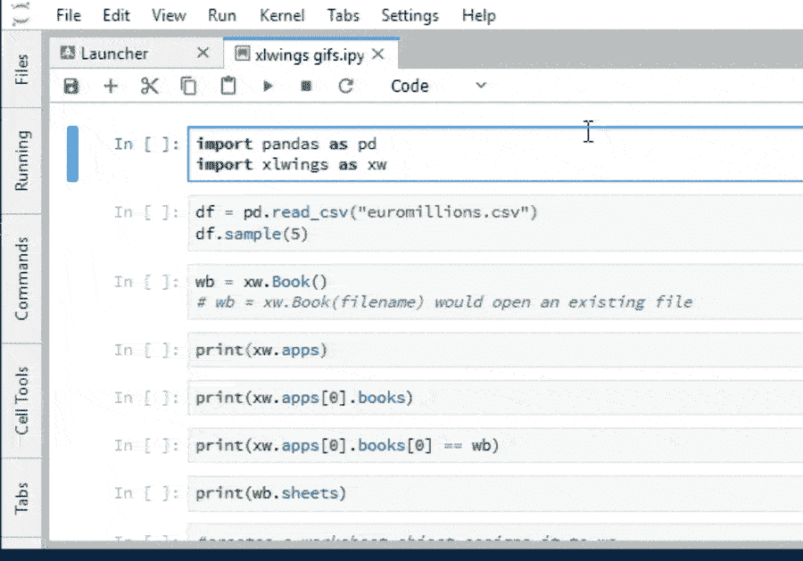

请注意，当在 Jupyter 笔记本中运行代码单元格时，Excel 会自动启动。

通过实例化一个`Book`对象，一个属于我们的 book 对象的`App`对象被自动创建。下面是我们如何检查所有打开的 Excel 实例。

注意:我们不打算在本教程的每一步都包含 gif，因为我们不希望这个页面对于网速慢或者网络连接有限的人来说是一个加载的麻烦。然而，随后的代码运行步骤应该与我们上面看到的类似:当我们在 Juypter 中运行一个单元格时，Excel 电子表格会根据我们运行的代码进行更新。

```py
 print(xw.apps) 
```

```py
 Apps([<Excel App 9536>]) 
```

对象`xw.apps`是可迭代的。要检查哪些工作簿属于这个 iterable 中的唯一实例，我们可以像这样调用它的`books`方法。

```py
 print(xw.apps[0].books) 
```

```py
 Books([<Book [Book1]>]) 
```

正如所料，这个 iterable 的唯一实例是工作簿`wb`。我们在下面检查这个事实。

```py
 print(xw.apps[0].books[0] == wb) 
```

```py
 True 
```

同样，我们可以检查哪些工作表属于该工作簿:

```py
 print(wb.sheets) 
```

```py
 Sheets([<Sheet [Book1]Sheet1>]) 
```

我们也可以通过名称来引用工作表:

```py
 #creates a worksheet object assigns it to ws
ws = wb.sheets["Sheet1"]
#checks that wb.sheets[0] equals ws
print(ws == wb.sheets[0]) 
```

```py
 True 
```

`Sheet`对象有一个按预期工作的`name`属性。让我们更改我们唯一的工作表的名称。

```py
 ws.name = "EuroMillions" 
```

我们可以将数据从某些 Python 对象(例如列表和元组)转移到 Excel 中。让我们将数据框中的数据移入工作表 *EuroMillions* 。为此，我们将利用`range`创建一个 range 对象，将数据框中的数据存储在 Excel 的一系列单元格中，在本例中从单元格 A1:

```py
#ws.range("A1") is a Range object
ws.range("A1").value = df 
```

这就是它的样子:

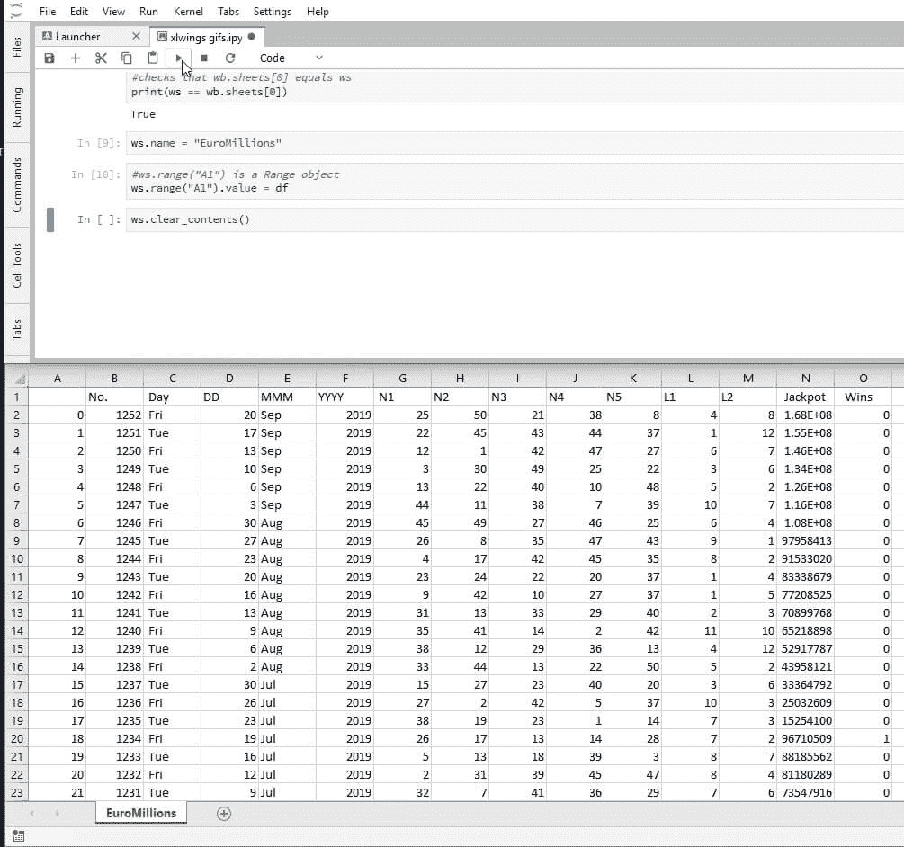

我们可以看到，`df`的索引列也被移到了 Excel 中。让我们清除此表的内容，复制不带索引的数据。

```py
 ws.clear_contents()
ws.range("A1").options(index=False).value = df 
```

这将是有用的，能够告诉我们的表结束。更具体地说，我们需要最后一行数据。为此，我们可以使用`end`方法和`Range`对象的`row`属性。

毫不奇怪，`row`方法返回了`Range`对象的`row`。

方法`end`接受一个方向(`"up"`(或`1`)、`"right"`(或`2`)、`"left"`(或`3`、`"down"`(或`4`))作为参数，并返回另一个 range 对象。它模仿了 Excel `CTRL+Shift+Arrow`中非常常见的动作。

```py
 last_row = ws.range(1,1).end('down').row
print("The last row is {row}.".format(row=last_row))
print("The DataFrame df has {rows} rows.".format(rows=df.shape[0])) 
```

```py
 The last row is 1142.
The DataFrame df has 1141 rows. 
```

核实过了。

#### API 属性

并非所有 Excel 功能都可以作为原生`xlwings`特性使用。有时我们不得不寻找变通方法来做我们想做的事情。幸运的是`xlwings`让我们很容易做到这一点。来自官方文档中的[缺失功能](https://docs.xlwings.org/en/stable/missing_features.html)部分:

> 变通方法:本质上，xlwings 只是 Windows 上的 [pywin32](https://github.com/mhammond/pywin32) 和 Mac 上的 [appscript](http://appscript.sourceforge.net/) 的智能包装器。您可以通过调用 api 属性来访问基础对象。底层对象将为您提供几乎所有您可以用 VBA 做的事情，使用 pywin32(感觉很像 VBA)和 appscript(感觉不像 VBA)的语法。但是除了看起来难看之外，请记住**它使您的代码平台特定(！)**。[Excel Visual Basic for Applications](https://docs.microsoft.com/en-us/office/vba/api/overview/excel)是各种现有 Excel 对象的丰富解释来源。

排序是`xlwings`中缺少的功能之一。您可能已经注意到，记录是按照从最近到最早的抽签顺序排列的。在接下来的几个步骤中，我们将颠倒顺序。

对象`ws.range("A2:N{row}".format(row=last_row))`是一个`Range`对象。将`api`属性附加到它会产生一个 [VBA 范围](https://docs.microsoft.com/en-us/office/vba/api/excel.range(object))对象，该对象反过来提供对其 VBA 特性的访问。

我们将使用这个 VBA 对象的[排序](https://docs.microsoft.com/en-us/office/vba/api/excel.range.sort)属性。在其最简单的应用中，`Sort`接受两个参数:我们希望对表格进行排序所依据的列(作为一个 VBA 范围对象)，以及排序类型(我们希望按升序还是降序排序)。第二个参数的文档可以在这里看到[。我们将按升序排序。](https://docs.microsoft.com/en-us/dotnet/api/microsoft.office.interop.excel.xlsortorder?redirectedfrom=MSDN&view=excel-pia)

将所有这些放在一起看起来像这样:

```py
ws.range(
"A2:N{row}".format(row=last_row)
).api.Sort(Key1=ws.range("A:A").api, Order1=1) 
```

```py
True 
```

下面是运行后它在屏幕上的样子(注意，第一列已经改变，现在它是按升序而不是降序排序的。

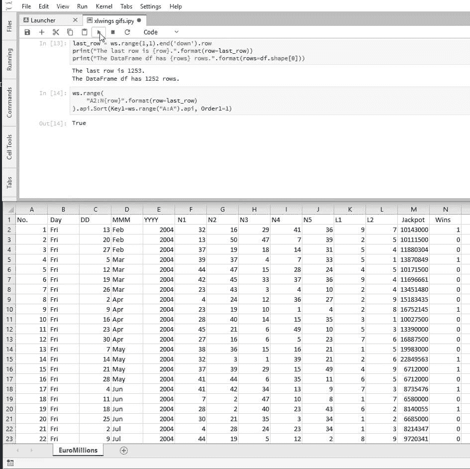

#### 分析我们的数据

我们在试图分析这个数据集时会遇到的一个问题是，日期分散在三个不同的列中。我们需要把它压缩成一列。为此，我们将使用 Python 在 Excel 中适当地连接列。我们首先在相邻的空列中插入一个标题。

```py
ws.range("O1").value = "Date" 
```

接下来，我们可以插入想要用作字符串的 Excel 公式。注意:您应该使用什么参数分隔符取决于您的计算机的本地区域设置。在我的示例中，参数分隔符是逗号，这是我在本教程中使用的，但在你的示例中，它可能是分号。

```py
ws.range("O2").value = "=C2&D2&RIGHT(E2, 2)" 
```

在第一个单元格中插入公式后，在常规 Excel 工作流程中，自动填充表格末尾的其余单元格是第二天性。[自动填充](https://docs.microsoft.com/en-us/office/vba/api/excel.range.autofill)是`VBA Range`对象的一种方法。它将目标单元格作为一个`VBA Range`对象和[填充类型](https://docs.microsoft.com/en-us/dotnet/api/microsoft.office.interop.excel.xlautofilltype?redirectedfrom=MSDN&view=excel-pia)作为参数。我们感兴趣的是枚举为`0`的缺省值。

```py
ws.range("O2").api.AutoFill(
ws.range("O2:O{row}".format(row=last_row)).api,
0
) 
```

```py
 True 
```

这是完成这一步后屏幕的大致样子；注意最右边新的“日期”列。

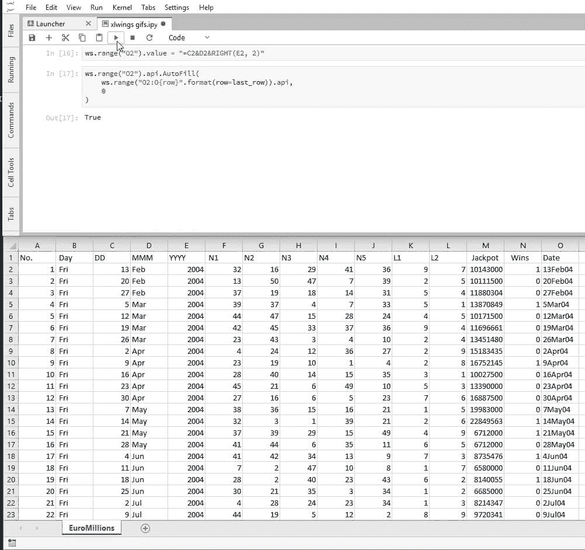

我们也可以使用我们想要的填充类型的命名形式。为此，我们需要从模块`xlwings.constants`中检索它，该模块包含大多数 [VBA 属性](https://docs.microsoft.com/en-us/dotnet/api/microsoft.office.interop.excel?view=excel-pia#enums)的枚举参数的命名版本。回想一下，您总是可以通过打印`dir(xlwings.constants)`来检查可用的属性。

(如果您不熟悉，`dir`是一个原生 Python 函数，可以接受多种参数(模块、类和常规对象(如列表和字符串))。例如，如果您打印`dir(some_list)`,它将为您提供可以用于列表的所有方法和属性。)

我们上面所做的也可以通过下面的代码片段来实现。

```py
from xlwings.constants import AutoFillType
ws.range("O2").api.AutoFill(
ws.range("O2:O{row}".format(row=last_row)).api,
    AutoFillType.xlFillDefault
) 
```

由于我们会经常使用这个函数，我们将创建一个应用默认填充的函数，给定:

*   工作表
*   表示工作表中单元格的字符串
*   要填充的最后一行。

为此，我们将引入一种新的`Range`方法，称为 [`get_address`](https://docs.xlwings.org/en/stable/api.html?highlight=get_address) 。它接受四个布尔参数并返回一个字符串，该字符串标识具有不同细节级别的范围。下面是这种方法的一个很有启发性的例子。

```py
for arg4 in (0, 1):
for arg3 in (0,1):
for arg2 in (0,1):
for arg1 in (0,1):
print(ws.range("O2").get_address(arg1, arg2, arg3, arg4)) 
```

```py
 O2
O$2
$O2
$O$2
EuroMillions!O2
EuroMillions!O$2
EuroMillions!$O2
EuroMillions!$O$2
[Book1]EuroMillions!O2
[Book1]EuroMillions!O$2
[Book1]EuroMillions!$O2
[Book1]EuroMillions!$O$2
[Book1]EuroMillions!O2
[Book1]EuroMillions!O$2
[Book1]EuroMillions!$O2
[Book1]EuroMillions!$O$2 
```

现在我们定义我们的函数。

```py
def autofill(worksheet, cell, last_row):
   rg_cell = worksheet.range(cell)
   to_fill = "{col}{top_row}:{col}{last_row}".format(
      col=rg_cell.get_address(0,0)[0],
      top_row=rg_cell.row,
      last_row=last_row
   )
   rg_cell.api.Autofill(worksheet.range(to_fill).api, 0) 
```

为了避免 Excel 进行不必要的计算，我们将用硬编码值替换刚刚插入到列`O`中的公式。在我们这样做之前，让我们花点时间想想当`Range`是一个数组时`Range.value`是什么类型的 Python 对象。

```py
print(type(ws.range("O2:O{row}".format(row=last_row)).value)) 
```

```py
 <class 'list'> 
```

这是一个列表！让我们看看它的前十个元素。

```py
 print(ws.range('O2:O{row}'.format(row=last_row)).value[:10]) 
```

```py
['13Feb04', '20Feb04', '27Feb04', '5Mar04', '12Mar04', '19Mar04', '26Mar04', '2Apr04', '9Apr04', '16Apr04'] 
```

如果我们将这个列表插入任何区域，它将水平放置值，这不是我们想要的。为了垂直放置它们，我们需要使用带有选项`transpose=True`作为参数的`Range`对象的 [`options`](https://docs.xlwings.org/en/stable/api.html?highlight=get_address#xlwings.Range.options) 方法，如下所示:

```py
ws.range('O2').options(transpose=True).value\
= ws.range('O2:O{row}'.format(row=last_row)).value 
```

我们现在可以[删除](https://docs.microsoft.com/en-us/office/vba/api/excel.range.delete)列`C`到`E`。

```py
ws.range('C:E').api.Delete() 
```

```py
True 
```

EuroMillions 格式多年来经历了一些轻微的修改，最近一次发生在 2016 年 9 月 24 日。

从 2016 年 9 月 24 日起，幸运星的数量从 11 个变为 12 个。为了进行有意义的分析，我们将只考虑最后一次修改后发生的抽签。下一个代码片段找到修改前的最后一个游戏，并将其命名为`to_delete`。

```py
import datetime

for day in ws.range('L2:L{}'.format(last_row)):
# checks if day is not prior to the change of the rules
    if day.value <= datetime.datetime(2016, 9, 24, 0, 0):
        # since day is past the modification date,
        # the row we want is the previous one, hence minus 1
        to_delete = int(day.get_address(0, 0)[1:])-1
        # leave the for cycle
        break 
```

而且我们现在可以删除从第一场到`to_delete`的每一行。

```py
ws.range('2:{}'.format(to_delete)).api.Delete() 
```

```py
True 
```

在这一点上，我们的情况是这样的:

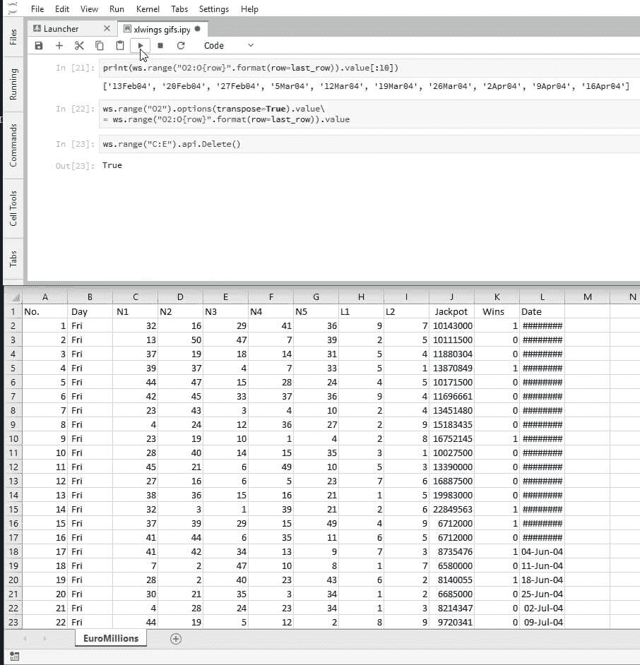

完成数据准备后，我们现在将格式化该表。我们首先将第一行的[字体](https://docs.microsoft.com/en-us/office/vba/api/excel.range.font)设置为**粗体**。

```py
ws.range('1:1').api.Font.Bold = True 
```

我们可以通过将`Jackpot`列格式化为百万来遵循这一点。请注意，下面的字符串格式取决于您的计算机的本地区域设置。如果你的格式看起来很奇怪，试着用点替换逗号。更多关于 Excel 自定义格式的信息请点击。

```py
ws.range('J:J').number_format = "£##.##0,,' M'" 
```

作为后续工作的辅助步骤，我们将找到对应于最后一列有数据的字母。

```py
last_column = ws.range(1,1).end('right').get_address(0,0)[0] 
```

现在让我们在标题单元格的底部添加一个边框。类似于我们一直在做的，我们将使用`api`属性。此外，我们还需要`Range`对象的 [`Border`](https://docs.microsoft.com/en-us/office/vba/api/excel.range.borders) 属性、[边框方向枚举](https://docs.microsoft.com/en-us/office/vba/api/excel.xlbordersindex)和边框的[样式。我们将只在标题单元格的底部设置一个双边边界(线条样式`-4119`)(方向`9`)。](https://docs.microsoft.com/en-US/dotnet/api/microsoft.office.interop.excel.xllinestyle?view=excel-pia)

```py
ws.range('A1:{}1'.format(last_column)).api.Borders(9).LineStyle = -4119 
```

现在让我们按行和列自动调整。

```py
ws.autofit() 
```

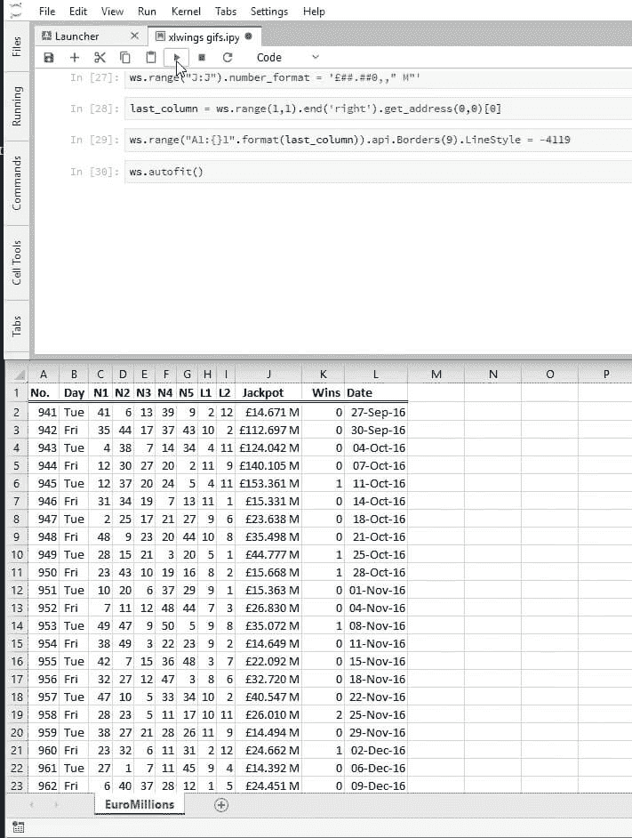

哎呀！这看起来有点挤，让我们将所有列的宽度设置为似乎最大的列`J`的宽度。[这里](https://docs.microsoft.com/en-us/office/vba/api/excel.range.columnwidth)是我们在下面使用的 [`ColumnWidth`](https://docs.microsoft.com/en-us/office/vba/api/excel.range.columnwidth) 文档。

```py
ws.range('A:L').api.ColumnWidth = ws.range('J:J').api.ColumnWidth 
```

那应该看起来更好。我们完成了这张床单！

让我们 [`add`](https://docs.xlwings.org/en/stable/api.html?highlight=get_address#xlwings.main.Sheets.add) 一个名为`Frequencies`的新的空白表格，让我们将它分配给 Python 名称`frequencies`。

```py
wb.sheets.add('Frequencies')
frequencies = wb.sheets['Frequencies'] 
```

我们将用我们刚刚在表`EuroMillions`中组织的数据集中每个数字和每个幸运星的绝对频率填充该表。

```py
# add a header for the numbers
frequencies.range('A1').value = 'Number'
# populate the fifty cells immediately below with the numbers 1 through 50
# since we're starting from the second row, we'll want to substract 1 from the row
frequencies.range('A2:A51').value = '=ROW()-1' 
```

下面我们将在单元格`B1`中插入一个频率标题，在单元格`B2`中我们将输入一个公式来计算`A2`中的值在范围`C2:G201`中出现的次数。换句话说，我们将计算`N1-N5`列中出现了多少次`1`。在此之后，我们将自动填充列`B`上的其余单元格，对它们各自的行进行同样的操作。

```py
# add a header for the frequencies
frequencies.range('B1').value = 'Frequency'
# insert on B2 the result of a standard Excel formula
frequencies.range('B2').value = '=COUNTIF(Euromillions!$C$2:$G$201,Frequencies!A2)'
autofill(frequencies, 'B2', 51) 
```

我们也为幸运星做同样的事情:

```py
frequencies.range('D1').value = 'Lucky Star'
frequencies.range('E1').value = 'Frequency'
frequencies.range('D2:D13').value = '=ROW()-1'
frequencies.range('E2').value =\
'=COUNTIF(EuroMillions!$H$2:$I$201,Frequencies!D2)'
autofill(frequencies, 'E2', 13)
frequencies.autofit() 
```

在这一点上，我们的新工作表应该是这样的:

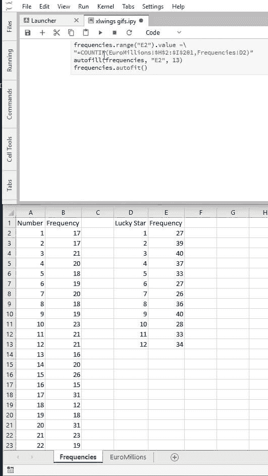

我们正在接近我们的目标。让我们创建一个名为`Graphs`的工作表。

```py
wb.sheets.add('Graphs')
graphs = wb.sheets['Graphs'] 
```

现在我们将创建一个 [`Chart`](https://docs.xlwings.org/en/stable/api.html?highlight=get_address#chart) 对象。这只会产生一个空白的白盒，但是不用担心！我们一会儿将使用那个盒子来绘制我们的数据。

```py
nr_freq = xw.Chart() 
```

我们可以 [`name`](https://docs.xlwings.org/en/stable/api.html?highlight=get_address#xlwings.Chart.name) 我们的图表类似于我们对工作表所做的。方法 [`set_source_data`](https://docs.xlwings.org/en/stable/api.html?highlight=get_address#xlwings.Chart.set_source_data) 允许我们通过传入一个 range 对象来定义图表的数据源。

```py
nr_freq.name = 'Number Frequencies'
nr_freq.set_source_data(frequencies.range('Frequencies!B1:B51')) 
```

Excel 会尝试猜测 x 轴应该是什么，但是我们可以通过使用`VBA Chart`方法 [`FullSeriesCollection`](https://docs.microsoft.com/en-us/office/vba/api/excel.chart.fullseriescollection) 强制它是我们在`Frequencies`上创建的数字。我们可以使用`nr_freq.api`的索引 1 处的对象来编辑图表:

```py
nr_freq.api[1].FullSeriesCollection(1).XValues = '=Frequencies!A2:A51' 
```

Excel 很擅长猜测用户想要什么样的图表，但为了以防猜错，我们会强制它是柱形图。这里的[列出了各种类型的图表](https://docs.microsoft.com/en-us/dotnet/api/microsoft.office.interop.excel.xlcharttype?view=excel-pia)。唉，将这些与 [`chart_type`](https://docs.xlwings.org/en/stable/api.html?highlight=get_address#xlwings.Chart.chart_type) 属性的可能值联系起来的唯一文档是[源代码](https://github.com/ZoomerAnalytics/xlwings/blob/master/xlwings/_xlmac.py)本身。

```py
nr_freq.chart_type = 'column_clustered' 
```

我们现在将定义图表的高度和宽度。测量单位将是[点](https://en.wikipedia.org/wiki/Point_(typography))。

```py
nr_freq.height = 250
nr_freq.width = 750 
```

在这一点上，我们应该看到以下内容:

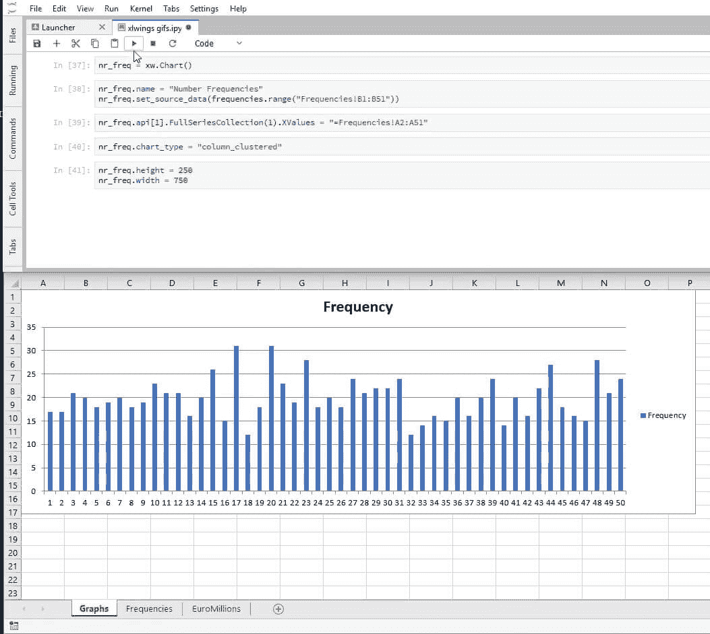

`SetElement`方法和参数`2`一起设置图表上方的标题。其他论点见[此处](https://docs.microsoft.com/en-us/dotnet/api/microsoft.office.core.msochartelementtype?view=office-pia)。

```py
nr_freq.api[1].SetElement(2)  # Place chart title at the top
nr_freq.api[1].ChartTitle.Text = 'Number Frequencies' 
```

我们加上最后的润色。我们使用 [`HasLegend`](https://docs.microsoft.com/en-us/office/vba/api/excel.chart.haslegend) 属性移除图例。

```py
nr_freq.api[1].HasLegend = 0 
```

作为参数 1 传递给`Axes`方法的 [`xlCategory`](https://docs.microsoft.com/en-us/office/vba/api/excel.xlaxistype) 类别，以及设置为`1`的属性 [TickLabelSpacing](https://docs.microsoft.com/en-us/office/vba/api/Excel.Axis.TickLabelSpacing) ，确保轴的每个元素都被显示。

```py
nr_freq.api[1].Axes(1).TickLabelSpacing = 1 
```

为了完成该图表的格式化，我们通过将 [`Line`](https://docs.microsoft.com/en-us/office/vba/api/access.line) 对象的属性 [`Visible`](https://docs.microsoft.com/en-us/office/vba/api/access.line.isvisible) 设置为`0`来移除轮廓。

```py
graphs.shapes.api('Number Frequencies').Line.Visible = 0 
```

这是我们将会看到的:

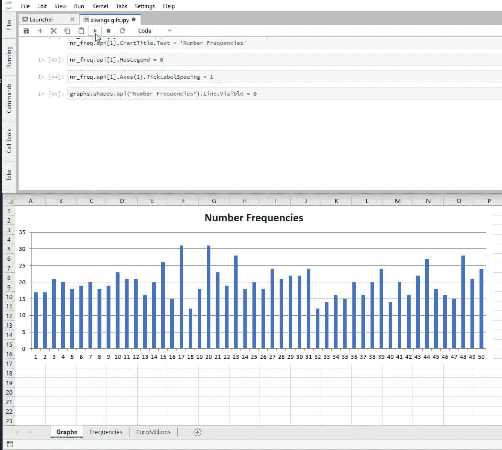

下面我们对幸运星做几乎同样的事情。

```py
ls_freq = xw.Chart()
ls_freq.top = 250
ls_freq.name = 'Lucky Star Frequencies'
ls_freq.set_source_data(frequencies.range('Frequencies!E1:E13'))
ls_freq.api[1].FullSeriesCollection(1).XValues = '=Frequencies!D2:D13'
ls_freq.chart_type = 'column_clustered'
ls_freq.height = 250
ls_freq.width = 750
ls_freq.api[1].SetElement(2)
ls_freq.api[1].ChartTitle.Text = 'Lucky Star Frequencies'
ls_freq.api[1].HasLegend = 0
ls_freq.api[1].Axes(1).TickLabelSpacing = 1
graphs.shapes.api('Lucky Star Frequencies').Line.Visible = 0 
```

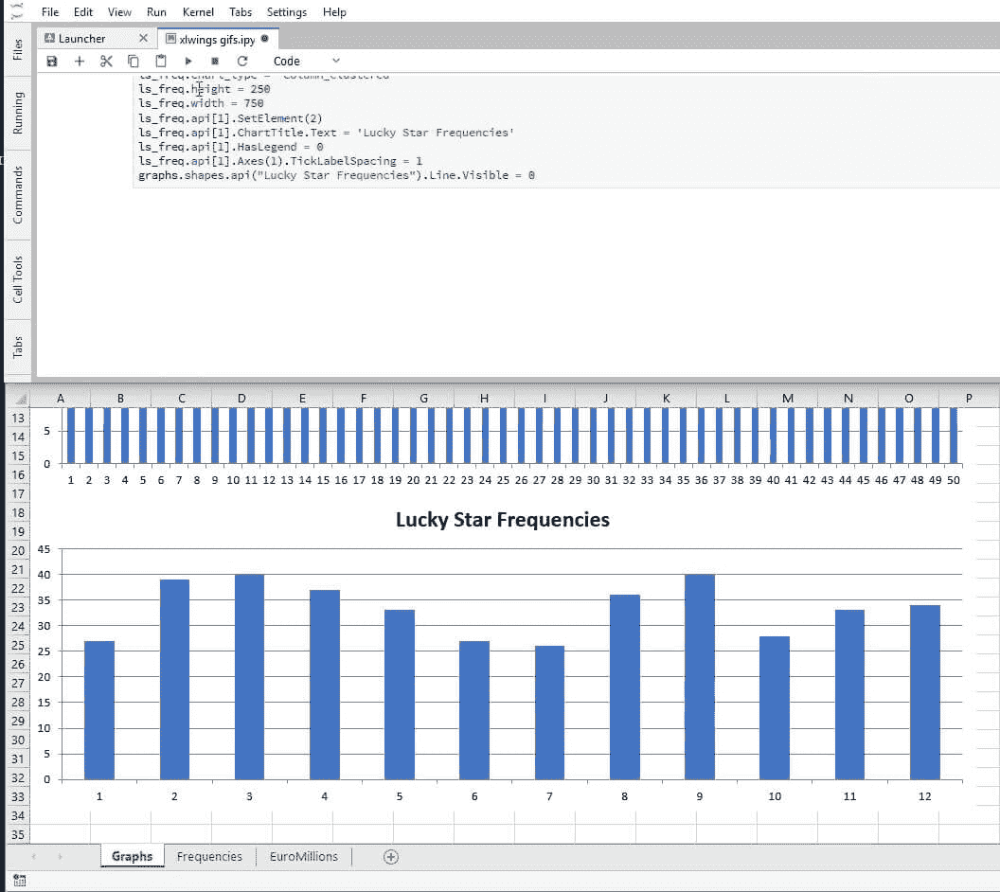

最后，我们创建一个时间序列图来显示累积奖金的变化。

```py
jackpot = xw.Chart()
jackpot.top = 500
jackpot.name = 'Jackpot'
last_row = ws.range(1,1).end('down').row
jackpot.set_source_data(ws.range('Euromillions!J2:J{}'.format(last_row)))
jackpot.api[1].FullSeriesCollection(1).XValues\
= 'Euromillions!L2:L{}'.format(last_row)
jackpot.chart_type = 'line'
jackpot.height = 250
jackpot.width = 750
jackpot.api[1].SetElement(2)
jackpot.api[1].ChartTitle.Text = 'Jackpot'
jackpot.api[1].HasLegend = 0
graphs.shapes.api('Jackpot').Line.Visible = 0 
```

我们通过将 [TickLabels](https://docs.microsoft.com/en-us/office/vba/api/excel.axis.ticklabels) 属性 [`NumberFormat`](https://docs.microsoft.com/en-us/office/vba/api/excel.ticklabels.numberformat) 设置为所需的外观来固定纵轴“标签”格式。

```py
jackpot.api[1].Axes(2).TickLabels.NumberFormat = "£0,,' M'" 
```

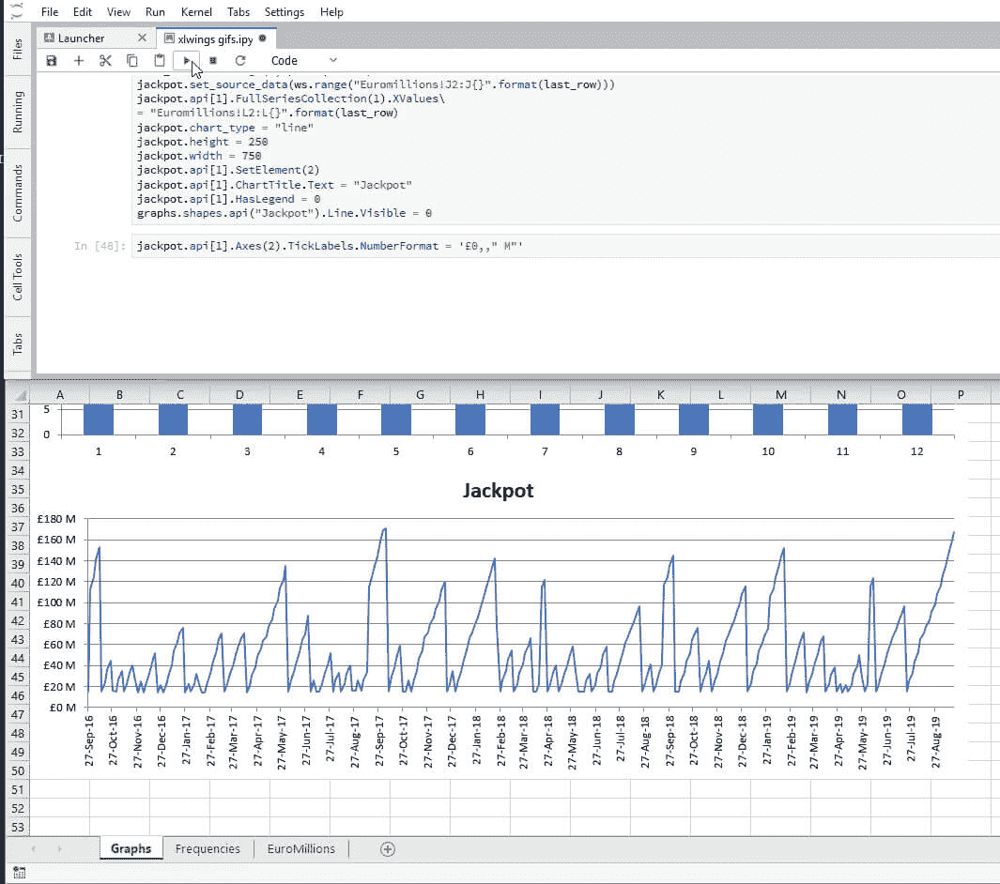

我们完事了。现在，我们保存文件并退出 Excel 实例。

```py
wb.save('EuroMillions.xlsx')
xw.apps[0].quit() 
```

希望这篇 xlwings 教程有所帮助！

学习`xlwings`的一些有用资源是[官方文档](https://docs.xlwings.org/en/stable/index.html)、[这](https://nbviewer.jupyter.org/github/pybokeh/jupyter_notebooks/blob/master/xlwings/Excel_Formatting.ipynb)格式化备忘单、[VBA Excel 文档](https://docs.microsoft.com/en-us/office/vba/api/overview/excel)和 [xlwings: Python for Excel](https://training.zoomeranalytics.com/p/xlwings) 由 [Felix Zumstein](https://github.com/fzumstein) 自己设计，他是`xlwings`的开发者。

## 这个教程有帮助吗？

选择你的道路，不断学习有价值的数据技能。

[Python Tutorials](/python-tutorials-for-data-science/)

在我们的免费教程中练习 Python 编程技能。

[Data science courses](/data-science-courses/)

通过我们的交互式浏览器数据科学课程，投入到 Python、R、SQL 等语言的学习中。