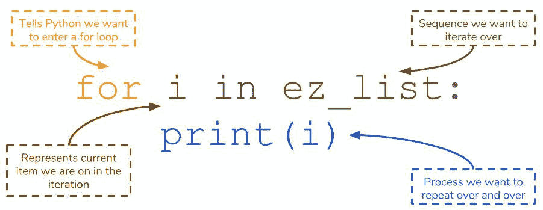
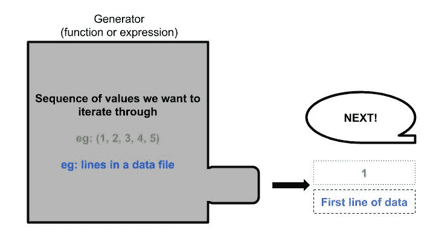
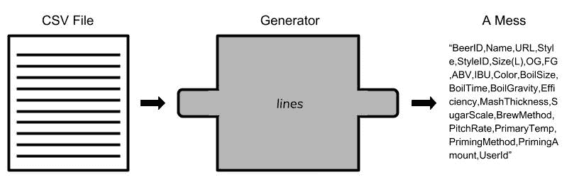
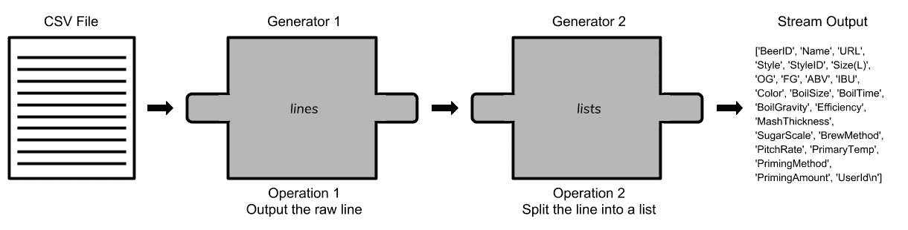
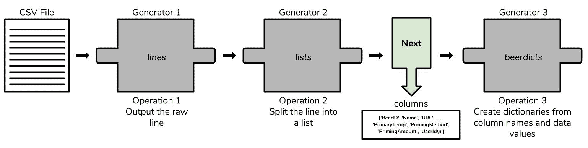
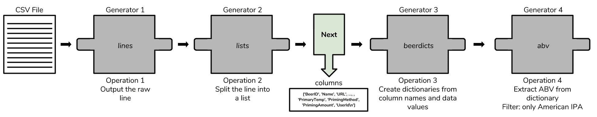
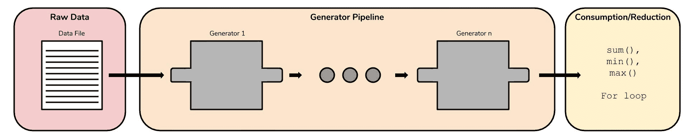

# Python 生成器

> 原文：<https://www.dataquest.io/blog/python-generators-tutorial/>

June 13, 2018Python generators are a powerful, but misunderstood tool. They’re often treated as too difficult a concept for beginning programmers to learn — creating the illusion that beginners should hold off on learning generators until they are *ready*. I think this assessment is unfair, and that you can use generators sooner than you think. In this tutorial, we’ll cover:

*   理解发电机所需的基本术语
*   什么是发电机
*   如何创建自己的发电机
*   如何使用生成器和生成器方法
*   何时使用发电机

## 先决条件

为了充分利用本教程，您应该熟悉以下概念:

*   基本 Python 数据结构
    *   什么是列表
    *   什么是字典
*   功能
    *   什么是函数
    *   如何创建和使用函数
*   列出理解
    *   什么是列表理解
    *   如何创建一个简单的列表理解

## 需要了解的基本术语

### 迭代和可迭代

迭代是某种过程一遍又一遍的重复。Python 的

`for`循环给了我们一个简单的方法来对不同的对象进行*迭代*。通常，您会迭代一个列表，但是我们也可以迭代其他 Python 对象，比如字符串和字典。

```
 # Iterating over a list
ez_list = [1, 2, 3]
for i in ez_list:
    print(i)
>>> 1
>>> 2
>>> 3

# Iterating over a string
ez_string = "Generators"
for s in ez_string:
    print(s)
>>> "G"
>>> "e"
...
>>> "r"
>>> "s"

# Iterating over a dictionary
ez_dict = {1 : "First, 2 : "Second"}
for key, value in ez_dict.items():
    print(k, v)
>>> 1 "First"
>>> 2 "Second" 
```

在上面的每个示例中

循环在我们给定的序列上迭代。上面的代码使用了列表、字符串和字典，但是您也可以迭代元组和集合。在上面的每个循环中，我们按照出现的顺序对序列中的每个项目进行`print`。例如，您可以确认`ez_list`的顺序是按照其项目的打印顺序复制的。我们将任何支持迭代的对象称为**可迭代**。

## 什么定义了一个 iterable？

Iterables 支持一种叫做

**迭代器协议**迭代器协议的技术定义超出了本文的范围，但是它可以被认为是一组用于`for`循环的*需求*。也就是说:列表、字符串和字典都遵循迭代器协议，因此我们可以在 for 循环中使用它们。相反，不遵循协议的对象不能在`for`循环中使用。不遵循协议的对象的一个例子是整数。如果我们试图给一个`for`循环一个整数，Python 会抛出一个错误。

```
 number = 12345
for n in number:
    print(n)
>>> TypeError: 'int' object is not iterable
```

整数只是单数，不是序列。你可能会认为第一个数字

`number`为 1，但它不同于*序列*中的第一项。问“1 后面是什么”没有意义。因为 Python 只把整数理解为一个单独的实体。因此，成为可迭代的一个要求是能够向`for`循环描述下一个项要执行的操作是什么。例如，列表告诉`for`循环，下一个要迭代的条目在当前条目的索引+1 处(1 在 0 之后)。因此，当*停止*迭代时，iterable 也必须向`for`循环发出信号。这个信号通常在我们到达一个序列的末尾(即一个列表或字符串的末尾)时出现。我们将在本文的后面探索使某些东西可迭代的特定函数，重要的是要知道可迭代描述了*一个*循环应该如何遍历它的内容。生成器本身是可迭代的。稍后你会看到，`for`循环是我们使用生成器的主要方式之一，所以它们必须能够支持迭代。在下一节中，我们将深入研究如何创建我们自己的生成器。

## 要点:需要了解的基本术语

*   迭代是在一系列项目上重复一些过程的想法。在 Python 中，迭代通常与`for`循环相关。
*   iterable 是支持迭代的对象。
*   要成为可迭代的，它必须向一个`for`循环描述两件事:
    1.  迭代中的下一项是什么。
    2.  循环何时应该停止迭代。
*   发电机是可迭代的。

## 基于数据的方法

为了真正探索生成器，我们将使用

*酿酒师的朋友啤酒食谱*数据集来自 Kaggle。你可以在这里找到数据集，如果你想在你自己的电脑上跟随。该数据包含来自世界各地啤酒酿造商的重要啤酒特征，包括啤酒风格、酒精体积(ABV)和啤酒产量。就本文而言，假设我们对酿造自己的啤酒感兴趣。也许我们想卖我们的啤酒，所以我们想看看别人做了什么来通知我们的酿造选择和生产更受欢迎的啤酒风格。*作者注*:原始数据集中的“名称”列包含一些杂乱的值，干扰了我们的分析。你可以在这里找到一个符合我们目的的干净版本[。](https://github.com/thecbp/blog_data/blob/master/recipeData.csv)

## 发电机和你

如果你以前从未遇到过发电机，那么现实生活中最常见的发电机例子就是备用发电机，它会产生—

*产生*——为你的房子或办公室供电。从概念上讲，Python 生成器从给定的序列中一次生成一个值*，而不是一次给出整个序列。这种一次一个发生器的方式使得它们与`for`循环如此兼容。如果这听起来令人困惑，不要太担心。随着我们解释如何创建生成器，它将变得更加清晰。创建生成器有两种方法。它们的语法不同，但最终结果仍然是一个生成器。我们将通过介绍它们的语法并将其与一个类似的、但非生成器的等价概念进行比较来教授这些概念。*

 *1.  一个生成器*函数*对一个常规函数
2.  生成器*表达式*对列表理解

## 发电机功能

生成器函数就像一个常规函数，但是有一个关键的区别

`yield`关键字替换`return`。

```
 # Regular function
def function_a():
    return "a"

# Generator function
def generator_a():
    yield "a" 
```

上面的两个函数执行完全相同的操作(返回/产生相同的字符串)。但是，如果您尝试检查生成器函数，它不会与常规函数显示的内容相匹配。

```
 function_a()
>>> "a"

generator_a()

>>> <generator object a at 0x000001565469DA98>
```

调用一个常规函数告诉 Python 返回函数在代码中的位置，执行代码块中的代码，并返回结果。为了让生成器函数产生它的值，您需要将它传递到

`next()`功能。`next()`是一个特殊的函数，它询问“迭代中的下一项是什么？”事实上，`next()`就是运行`for`循环时调用的精确函数！列表、字典、字符串等等都实现了`next()`，所以这就是为什么你可以首先将它们合并到循环中。

```
 # Asking the generator what the next item is
next(a())
>>> "a"

# Do not do this
next(a)
```

注意，我们必须传入带括号的生成器函数，因为函数本身就是生成器。只提供函数名会抛出一个错误，因为你试图给出

`next()`一个功能*名*。正如所料，一旦我们调用`next()`函数，生成器函数将`yield`“a”。这个例子不能完全代表生成器的用途。请记住，生成器生成一个值流，所以使用单个值并不真正符合流的条件。为此，我们实际上可以将多个`yield`语句放入一个生成器函数中。这些`yield`语句构成了发生器将输出的序列。我们将创建一个生成器，并将其绑定到一个变量`mg`。然后，如果我们继续将`mg`传递到`next()`，我们将到达下一个`yield`。如果我们继续走过去，我们将得到一个`StopIteration`错误，告诉我们生成器没有更多的值可以给出。`StopIteration`错误实际上是`for`循环如何知道何时停止迭代。

```
 def multi_generate():
    yield "a"
    yield "b"
    yield "c"

mg = multi_generate()
next(mg)
>>> "a"

next(mg)
>>> "b"

next(mg)
>>> "c"

next(mg)
>>> StopIteration: 
```

分配

`multi_generate`到`mg`是使用发生器功能的关键步骤。将生成器绑定到`mg`允许我们创建一个可以引用的生成器的单个实例。我们可以继续将`mg`传递给`next()`，并获得其他的`yield`语句。观察如果我们一直试图传入`multi_generate`本身会发生什么。

```
 next(multi_generate())
>>> "a"
next(multi_generate())
>>> "a"
```

很容易把发生器想象成一台只等待一个命令的机器:

`next()`。一旦你在生成器上调用`next()`，它将按顺序分配下一个值。否则，你不能用发电机做更多的事情。下图将我们的生成器表示为一台简单的机器。我们继续得到第一个`yield`语句的结果。这背后的原因很微妙。当我们将生成器函数本身传递给`next()`时，Python 假设你正在传递一个`multi_generate`的*新*实例给它，所以它总是给你第一个`yield`结果。通过将生成器绑定到一个变量，Python 知道当您将它传递给`next()`时，您正试图对同一事物进行操作。我们已经注意到，随着我们不断将`mg`传递给 next，我们会得到其他`yield`结果。只有当发电机以某种方式*记得它最后做了什么，这才有可能。这个内存就是生成器函数区别于常规函数的地方！一旦你使用了一个函数，它就一劳永逸了。一旦你从函数中得到这个值。发电机将保持`yield` ing 值，直到它退出。这给我们带来了发电机的另一个重要性质。一旦我们完成了对它们的迭代，我们就不能再使用它们了。一旦我们通过了`mg`中的所有三个`yield`值，它就不能再为我们提供任何东西了。我们必须存储另一个`multi_generate`生成器的实例，以便再次开始查询它的`next()`语句。我们的数据还没有被读入，所以让我们用一个生成器函数来完成。该数据称为`recipeData.csv`，包含在一个 CSV 文件中。我们将使用`open()`函数来读取它，并且我们将开始使用`next()`函数来读取 CSV 的前几行。*

```
 # Creating a generator that will generate the data row by row
def beerDataGenerator():
    file = "recipeData.csv"
    for row in open(file, encoding="ISO-8859-1"):
        yield row
```

我们将慢慢剖析上面的代码:

*   我们将`dataGenerator`指定为生成器函数，它将逐行分发我们的 CSV 文件。该函数在`file`中包含文件名，这使我们能够使用`open()`函数来读取它。
*   虽然我们已经讨论了像列表和字典这样的 Python 对象可以被迭代，但是我们也可以迭代我们已经`open()`过的文件。
*   `encoding`告诉 Python 它应该期望看到什么类型的字符；ISO-8859-1 特指拉丁语-1。
*   `for`循环将从 CSV 文件中的第一行开始，`yield`该行，然后保存它在读取文件中的当前位置，直到再次调用生成器函数。

如果你在自己的电脑上跟踪数据，你需要替换

`file`用您电脑上文件所在的确切路径。这将使 Python 能够在您想要`open()`它时找到它。

```
 # Remember to store an instance of the generator so we can refer back to it
beer = beerDataGenerator()
next(beer)
>>> 'BeerID,Name,URL,Style,StyleID,Size(L),OG,FG,ABV,IBU,Color,BoilSize,BoilTime,BoilGravity,Efficiency,MashThickness,SugarScale,BrewMethod,PitchRate,PrimaryTemp,PrimingMethod,PrimingAmount,UserId\n'next(beer
)

>>> '1,Vanilla Cream Ale,/homebrew/recipe/view/1633/vanilla-cream-ale,Cream Ale,45,21.77,1.055,1.013,5.48,17.65,4.83,28.39,75,1.038,70,N/A,Specific Gravity,All Grain,N/A,17.78,corn sugar,4.5 oz,116\n'
```

一旦我们创建了一个

`beerDataGenerator`在`beer`中，我们可以开始把它传入`next()`来查看数据本身。正如 CSV 文件所示，各列用逗号分隔。此外，每一行都以一个`\n`结尾，表示换行。我们发现`recipeData.csv` to 中的第一项是一个列名列表，第一行描述了一种美味的香草奶油麦酒。

### 自我施加的限制

你可能会问，“我们可以将数据存储在一个列表中理解！为什么要跳过一个额外的铁环，还要用发电机呢？”作为一名程序员，您可能会遇到

**大数据**。这是一个有点模糊的术语，因此我们不会在这里深入研究各种大数据定义。可以这么说，任何大数据文件都是**太大**而无法赋给变量。我们的数据文件不符合大数据的标准，但我们仍然可以通过限制自己重现这个难题来学习很多东西。我们现在假设我们的啤酒数据非常大，以至于我们无法将所有数据存储在一个列表列表中。由于读取数据的正常途径被阻断，我们被迫重新考虑我们的选择。这就是发电机的用武之地。稍后我们将解释为什么生成器在这里工作，但在此之前，我们可以放心，我们的生成器函数将使我们能够首先读取数据，尽管不是一次全部读取。除了生成器函数，我们还可以使用生成器表达式创建生成器。

## 发电机表达式

之前，我们将生成器函数与常规函数进行了比较，因为它们有许多相似之处。对于世代表达式，我们将使用

**列举理解**。

```
 lc_example = [n**2 for n in [1, 2, 3, 4, 5]]

genex_example = (n**2 for n in [1, 2, 3, 4, 5])
```

`lc_example`是我们的列表理解，而`genex_example`是我们执行*几乎*相同任务的生成器表达式。请注意，两者之间的唯一区别是生成器表达式是用圆括号括起来的，而不是方括号。如果我们在一个`for`循环中使用这些迭代器中的任何一个，它们将产生相同的结果，并且无法区分。然而，如果我们试图在我们的解释器中检查这些变量，它们会产生不同的结果。

```
 lc_example
>>> [1, 4, 9, 16, 25]

genex_example
>>> <generator object <genexpr> at 0x00000156547B4FC0>
```

这个结果类似于我们在研究一个常规函数和一个生成函数时看到的结果。Python 也认识到了这一点

`genex_example`是生成器表达式形式中的一个生成器(`<genexpr>`)。由于`lc_example`是一个列表，我们可以执行它们支持的所有操作:索引、切片、变异等。我们不能用生成器表达式做到这一点。生成器被专门化为一次容易产生一个输出，所以它们不支持这些操作。然而，像列表理解一样，如果需要的话，我们可以在生成器表达式中实现逻辑来形成过滤器。

```
 genex_example2 = (n**2 for n in [1, 2, 3, 4, 5] if n >= 3)
next(genex_example2)
>>> 9
```

实际上，我们使用生成器函数或生成器表达式的方式没有区别。一旦我们有了生成器表达式，我们就可以调用

开始获取它将产生的价值。一旦我们遍历了生成器表达式可以生成的所有值，我们就不能再使用它了。这与列表理解形成了对比，我们可以尽可能多地重复使用列表理解。

```
 next(genex_example)
>>> 1

# Repeat until we reach the end...

next(genex_example)
>>> 25
next(genex_example)
>>> StopIteration:
```

我们只能使用发电机的想法

*一旦*被捆绑到自己*消费的想法。回想一下，当我们迭代一些迭代器时，我们对其中的每个值执行一些操作。然后我们使用这些处理过的值继续我们的分析，这意味着通常我们可能不需要原始的迭代器。生成器非常适合这种需求，它允许我们构造一个迭代器，我们可以使用一次，然后不用担心它在使用后会占用空间(例如，在一个`for`循环中)。我们谈到了用`next()`从生成器中获取值的方法，但是在`for`循环中使用生成器通常更好。使用`next()`迫使我们必须自己处理`StopIteration`，但是`for`循环使用这个来知道什么时候停止！*

```
 # Using a for loop to consume a generator is better than using next()
for ge in genex_example:
    print(ge)
>>> 1
>>> 4
>>> 9
>>> 16
>>> 25
```

生成器表达式与函数的一个区别是它们的简洁。生成器函数占用多行，而我们可以将生成器表达式放在一行中。多行本身并不坏，但是它使函数变得更加复杂，可能会在以后引入错误。我们将把生成器函数重写为一个单行表达式，读入啤酒数据。这种简洁性在本文后面会派上用场。

```
 beer_data = "recipeData.csv"

# This one line perfoms the same action as beerDataGenerator()!

lines =  (line for line in open(beer_data, encoding="ISO-8859-1"))
```

## 关键要点:发电机和你

*   生成器一次产生一个值**而不是一次给出所有值**。
*   创建生成器有两种方法:生成器函数和生成器表达式。
*   发电机功能`yield`，常规功能`return`。
*   生成器表达式需要`()`，列表理解使用`[]`。
*   发电机**只能用一次**。
*   从生成器中获取值有两种方法:函数`next()`和循环`for`。`for`循环通常是首选方法。
*   我们可以用生成器读取文件，一次给我们一行。

## 发电机:动机和用途

前面，我们讨论了对自己施加限制，迫使我们使用生成器来读取数据，而不是将数据读入一个列表的列表中。我们提到了大数据的问题，以及我们无法将其全部存储在一个变量中。虽然称之为大数据问题仍然是正确的，但您也可以称之为

**记忆力问题。**假设您有一台较旧的笔记本电脑，内存约为 4GB，随机存取存储器。我们的啤酒数据集的真实大小只与 3MB 有关，但是假设我们要求全球每个人给我们他们的食谱，结果数据集大约为 3GB。如果我们将整个数据集读入一个变量，它将占用 3GB 多一点的 RAM！这将使我们几乎没有空间进行其他操作，更不用说其他类似大小的变量了。将我们的数据存储在一个列表中会占用太多的内存，以至于我们所做的任何分析都要花费非常长的时间。

## 懒惰和发电机

我们现在知道生成器从一个定义的序列中产生一个单一的值，但是

*只有当我们询问`next()`时才*或者在`for`循环内。我们称之为*懒评*。生成器很懒，因为它们只在我们需要的时候才给我们一个值。另一方面，只有这个值占用内存。最终的结果是，生成器具有令人难以置信的**内存效率**，这使得它成为读取和使用大数据文件的完美候选。一旦我们请求一个生成器的下一个值，旧的值就被丢弃了。一旦我们遍历了整个生成器，它也会从内存中被丢弃。

## 给发电机供电的发电机

我们目前还没有从啤酒数据中学到任何东西。到目前为止，我们所做的就是获取原始的 CSV 文件，并创建一个生成器来生成 CSV 文件中的每一行，一次生成一个字符串。除非我们想做一些疯狂的字符串操作，否则我们需要想办法将数据转换成可读、可用的形式。下面是我们的代码当前所做的事情的表示:简单地从文件中读取并输出文件中的一行内容。

发电机又来救援了！到目前为止，在本文中，我们已经向生成器传递了其他结构，特别是迭代器，以指示我们希望从哪个序列生成。然而，生成器本身也是迭代器——为什么我们不创建另一个生成器，将另一个生成器的输出？我们的`lines`生成器输出完整的行，所以我们将制作第二个生成器来为我们做一些格式化。

```
beer_data = "recipeData.csv"
lines = (line for line in open(beer_data, encoding="ISO-8859-1"))
lists = (l.split(",") for l in lines) 
```

我们的生成器的最终结果是一个列表流，每个列表包含 CSV 的一行中的数据。如果我们迭代通过

我们将能够轻松访问其中的数据元素，并执行我们需要的分析！我们已经有效地为我们的数据集制作了一个**管道**，从原始数据集开始，通过 2 个生成器将其发送到熟悉的形式。请记住，生成器本身并不是列表，它们只是生成序列中的一个元素，并且只占用该元素所需的数量。通过将生成器连接在一起，我们创建了一种快速、易读的方式来读取通过正常方式无法访问的数据。这种方法有一些真正的力量，它的重要性不可低估。在处理中间值时，我们不需要创建任何临时列表来保存它们。有了管道中的额外生成器，我们的代码可能看起来像这样:在这个管道中，每个生成器负责一个操作，该操作最终将应用于数据集的所有*行。虽然拥有每个列表是好的，但在我们进行任何有意义的分析之前，仍然有一些小问题需要解决。首先，我们希望获取列名，因为它们不是数据，然后将它们转换成一个字典，使任何进一步的代码更容易阅读。*注意*:如果你在自己的机器上运行这段代码，你必须记住你只能使用一次生成器。如果您在一个`for`循环中使用生成器来查看输出，您将需要再次运行数据和整个管道。谢天谢地，这里的发电机运转很快。*

```
 beer_data = "recipeData.csv"
lines = (line for line in open(beer_data, encoding="ISO-8859-1"))
lists = (l.split(",") for l in lines)

# Take the column names out of the generator and store them, leaving only data
columns = next(lists)

# Take these columns and use them to create an informative dictionary
beerdicts = (dict(zip(columns, data)) for data in lists) 
```

这

做一些简单的格式化，这让我们的管道更加强大！这是一个开始查询我们未来啤酒酿造选择数据的好地方。现在我们已经有了生成器管道，我们可以开始*消费*由生成器生成的数据并创建一些洞察。我们通常使用`for`循环消耗发电机，所以我们将使用一个来计算最受欢迎的自制啤酒类型。

```
 beer_counts = {}
for bd in beerdicts:
    if bd["Style"] not in beer_counts:
        beer_counts[bd["Style"]] = 1
    else:
        beer_counts[bd["Style"]] += 1

most_popular = 0
most_popular_type = None
for beer, count in beer_counts.items():
    if count > most_popular:
        most_popular = count
        most_popular_type = beer

most_popular_type
>>> "American IPA" 
```

这种操作在数据争论和处理中无处不在，您可能以前见过。这里唯一的新东西是，我们依赖于由生成器生成的字典，而不是引用包含我们数据的列表。有了生成器，我们能够从任何大数据集进行与常规大小数据集相同的查询。我们现在知道美国 IPA 是数据集中最受欢迎的自制啤酒，我们也知道它们在数据中有多少条目。我们可以试着算出我们的啤酒应该有多烈。这些数据包含在“ABV”(

*酒精按体积*键。既然我们使用字典作为生成器流的输出，我们为什么不添加另一个生成器来研究我们想要输出的确切值。

```
 abv = (float(bd["ABV"]) for bd in beerdicts if bd["Style"] == "American IPA")

# Get the average ABV for an American IPAsum(abv)/most_popular
>>> 6.44429396984925
```

这最后一个生成器构成了我们的最后一个管道，如下图所示:

我们应该特别注意将`sum()`与`abv`发生器一起使用。不太直观的是，`sum()`会对它收到的所有 ABV 值求和。你可能会认为`sum()`是*将*发电机的全部输出减少到一个值。用这个总数除以美国的 IPA 总数，我们得到了平均值。我们的数据表明，你的平均美国 IPA 约为 6.4%的酒精体积！我们的最后一个生成器`abv`获取`beerdicts`输出的字典，并输出`ABV`键，但是*只输出*如果啤酒是美国的 IPA。生成器表达式上的过滤器在我们的管道中形成了一个强大的工具。如果我们把每一个连续的发生器看作一个模块组件，那么我们就可以用其他可能有更好功能的发生器来替换它们。如果我们想改变我们想要研究的啤酒类型或查看另一种啤酒特性，我们唯一需要改变的是发电机的操作。下图展示了生成器管道方法的不同部分。它由您想要处理的一些原始数据、执行实际处理的管道以及该管道输出的最终消耗组成。遵循这种模式将使您能够重现我们对啤酒数据所做的工作。如果您习惯于使用列表列表并利用所有列表方法进行分析的工作流，这种处理数据争论的新方法可能会很奇怪。然而，数据管道是一个强大的概念，可以立即集成到您的代码中，您应该尝试一下。

## 无限代

假设您第一次对啤酒数据集进行分析已经有几年了。你用你的分析创造了一个成功的美国投资促进机构，你只能感谢发电机。您每天生产数千瓶啤酒，您需要一种方法来分析每批啤酒的质量。你回到你的旧笔记本电脑启动 Python 解释器。你开始编写一个函数来计算和检查你生产的啤酒批次的各种质量，但是你停下来了。你事先不知道你要做多少啤酒。按天分析批次可以为我们提供离散的点，但是如果我们想要连续的数据呢？常规函数在这里不起作用！它们需要一些参数，并且总是返回一个离散的对象。你不可能给一个常规函数一个数据流，然后返回一个连续的值流。但是你可以用发电机！发电机非常适合这种类型的任务。我们已经讨论了生成器如何一次产生一个值，直到它被告知停止。如果我们不给一个发生器一个停止信号，它将愉快地无限地产生这些值。以下面的例子为例。

```
 function alwaysBeer():
    while True:
        yield "Beer"
```

这

`while`循环将始终为真，因此生成器函数将始终产生啤酒。我们没有做错任何事情，这是完全有效的代码(虽然不是你真正想要实现的代码)！这个“无限”的啤酒流如何符合我们的时间线？在我们最初查看啤酒数据集时，CSV 最初是一组行。如果您可以自动化酿造过程，将数据输出到类似的 CSV 并不断更新，那么您只需再次通过发生器运行数据即可进行分析！您可以在管道中创建一个生成器来捕捉任何不符合您期望的批处理，并实时标记它们！不幸的是，我们没有上述数据，但是这个思想实验应该为 Python 生成器提供另一个令人信服的用例。有了发电机，你甚至可以处理无穷大(在某些情况下)。

## 要点:发电机背后的动机和用途

*   生成器是内存高效的，因为它们只需要内存来存储它们产生的一个值。
*   生成器很懒:它们只有在被明确询问时才会产生值。
*   您可以将一个生成器的输出提供给另一个生成器的输入，以形成数据管道。
*   数据管道可以根据您的需求进行模块化和定制。
*   生成器对于无限地生成值非常有用。

## 结论

生成器不一定是复杂的主题，如果有足够的时间去理解，它们在任何 Python 程序员的全部技能中都有一席之地。即使在简单方法达不到要求的大数据情况下，基于生成器的分析仍然站得住脚。有很多关于生成器的内容我们没有在这里讨论，但是它仍然会给你一个很好的基础，让你在自己的分析生活中开始使用它们。

## 更多资源:

*   [Python 教程](https://www.dataquest.io/python-tutorials-for-data-science/) —我们不断扩充的数据科学 Python 教程列表。
*   [数据科学课程](https://www.dataquest.io/path/data-scientist/) —通过完全交互式的编程、数据科学和统计课程，让您的学习更上一层楼，就在您的浏览器中。
*   迭代器协议
*   [Python 的生成器文档](https://docs.python.org/3/howto/functional.html#generator-expressions-and-list-comprehensions)
*   [PEP 289:生成器表达式](https://www.python.org/dev/peps/pep-0289/)
*   [PEP 342:高级发电机](https://www.python.org/dev/peps/pep-0342/)*  *## 这个教程有帮助吗？

选择你的道路，不断学习有价值的数据技能。

[Python Tutorials](/python-tutorials-for-data-science/)

在我们的免费教程中练习 Python 编程技能。

[Data science courses](/data-science-courses/)

通过我们的交互式浏览器数据科学课程，投入到 Python、R、SQL 等语言的学习中。*