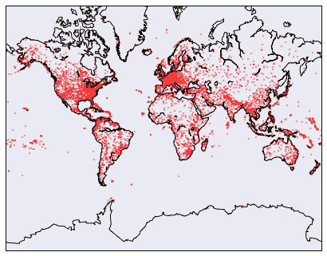
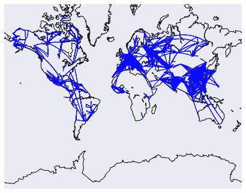

# 使用 Python 和 Pandas 处理 SQLite 数据库

> 原文：<https://www.dataquest.io/blog/python-pandas-databases/>

October 3, 2016

[SQLite](https://www.sqlite.org) 是一个数据库引擎，可以简化关系数据的存储和处理。与 *csv* 格式非常相似，SQLite 将数据存储在一个文件中，可以很容易地与他人共享。大多数编程语言和环境都很好地支持使用 SQLite 数据库。Python 也不例外，从版本`2.5`开始，Python 中就包含了一个用于访问 SQLite 数据库的库`sqlite3`。

在这篇文章中，我们将介绍如何使用`sqlite3`来创建、查询和更新数据库。我们还将介绍如何使用 [pandas](https://pandas.pydata.org/) 包简化 SQLite 数据库的工作。我们将使用 Python `3.5`，但是同样的方法也应该适用于 Python `2`。

如果你想学习 SQL 的基础知识，你可能想先看看我们的 [SQL 基础博客](https://www.dataquest.io/blog/sql-basics/)。

在我们开始之前，让我们快速浏览一下我们将要处理的数据。我们将查看航空公司的航班数据，其中包含有关航空公司、机场和机场间航线的信息。每条航线代表一家航空公司在出发地和目的地机场之间的重复飞行。

所有数据都在一个名为`flights.db`的 SQLite 数据库中，该数据库包含三个表— `airports`、`airlines`和`routes`。你可以在这里下载数据。

下面是来自`airlines`表的两行:

|  | 身份证明（identification） | 名字 | 别名 | international air transport association 国际航空运输协会 | 国际民航组织 | callsign | 国家 | 活跃的 |
| --- | --- | --- | --- | --- | --- | --- | --- | --- |
| Ten | Eleven | 4D 航空公司 | \N | 圆盘烤饼 | QRT | 四重奏 | 泰国 | 普通 |
| Eleven | Twelve | 611897 艾伯塔有限公司 | \N | 圆盘烤饼 | 带螺纹的（threaded 的简写） | 甜甜圈 | 加拿大 | 普通 |

正如您在上面看到的，每一行都是不同的航空公司，每一列都是该航空公司的属性，例如`name`和`country`。每个航空公司也有一个独特的`id`，所以当我们需要的时候，我们可以很容易地找到它。

下面是来自`airports`表的两行:

|  | 身份证明（identification） | 名字 | 城市 | 国家 | 密码 | 国际民航组织 | 纬度 | 经度 | 海拔 | 抵消 | 夏令时 | 时区 |
| --- | --- | --- | --- | --- | --- | --- | --- | --- | --- | --- | --- | --- |
| Zero | one | Goroka | Goroka | 巴布亚新几内亚 | GKA | AYGA | -6.081689 | 145.391881 | Five thousand two hundred and eighty-two | Ten | U | 太平洋/莫尔兹比港 |
| one | Two | 马当 | 马当 | 巴布亚新几内亚 | 杂志 | 月，月 | -5.207083 | 145.7887 | Twenty | Ten | U | 太平洋/莫尔兹比港 |

如您所见，每一行都对应一个机场，并且包含机场位置的信息。每个机场也有一个独特的`id`，所以我们可以很容易地找到它。

下面是来自`routes`表的两行:

|  | 航空公司 | 航空公司 id | 来源 | 来源标识 | 建筑环境及 HVAC 系统模拟的软件平台 | 目的地标识 | 代码共享 | 停止 | 装备 |
| --- | --- | --- | --- | --- | --- | --- | --- | --- | --- |
| Zero | 2B | Four hundred and ten | 年度等价利率 | Two thousand nine hundred and sixty-five | KZN | Two thousand nine hundred and ninety | 圆盘烤饼 | Zero | CR2 |
| one | 2B | Four hundred and ten | ASF | Two thousand nine hundred and sixty-six | KZN | Two thousand nine hundred and ninety | 圆盘烤饼 | Zero | CR2 |

每条航线都包含一个`airline_id`，即飞行该航线的航空公司的`id`，以及`source_id`，即该航线始发机场的 id，以及`dest_id`，即该航班的目的地机场的 id。

现在我们知道了我们正在处理哪种数据，让我们从连接到数据库并运行查询开始。

## 在 Python 中查询数据库行

为了使用 Python 中的 SQLite 数据库，我们首先必须连接到它。我们可以使用 [connect](https://docs.python.org/3/library/sqlite3.html?highlight=connect#sqlite3.connect) 函数来实现，该函数返回一个[连接](https://docs.python.org/3/library/sqlite3.html?highlight=connect#sqlite3.Connection)对象:

```py
import sqlite3
conn = sqlite3.connect("flights.db")
```

一旦我们有了一个连接对象，我们就可以创建一个[光标](https://docs.python.org/3/library/sqlite3.html#cursor-objects)对象。游标允许我们对数据库执行 SQL 查询:

```py
cur = conn.cursor()
```

一旦我们有了一个游标对象，我们就可以用它来执行一个针对数据库的查询，这个查询有一个恰当的名字 [execute](https://docs.python.org/3/library/sqlite3.html?highlight=connect#sqlite3.Cursor.execute) 方法。以下代码将从`airlines`表中获取前`5`行:

```py
cur.execute("select * from airlines limit 5;")
```

您可能已经注意到，我们没有将上述查询的结果赋给一个变量。这是因为我们需要运行另一个命令来实际获取结果。我们可以使用 [fetchall](https://docs.python.org/3/library/sqlite3.html?highlight=connect#sqlite3.Cursor.fetchall) 方法获取一个查询的所有结果:

```py
results = cur.fetchall()
print(results)
```

```py
[(0, '1', 'Private flight', '\\N', '-', None, None, None, 'Y'), (1, '2', '135 Airways', '\\N', None, 'GNL', 'GENERAL', 'United States', 'N'), (2, '3', '1Time Airline', '\\N', '1T', 'RNX', 'NEXTIME', 'South Africa', 'Y'), (3, '4', '2 Sqn No 1 Elementary Flying Training School', '\\N', None, 'WYT', None, 'United Kingdom', 'N'), (4, '5', '213 Flight Unit', '\\N', None, 'TFU', None, 'Russia', 'N')]
```

如您所见，结果被格式化为一个由[元组](https://docs.python.org/3.5/tutorial/datastructures.html#tuples-and-sequences)组成的列表。每个元组对应于我们访问的数据库中的一行。用这种方式处理数据是相当痛苦的。我们需要手动添加列标题，并手动解析数据。幸运的是，熊猫图书馆有一个更简单的方法，我们将在下一节看到。

在我们继续之前，最好关闭打开的连接对象和光标对象。这可以防止 SQLite 数据库被锁定。当 SQLite 数据库被锁定时，您可能无法更新该数据库，并且可能会出现错误。我们可以像这样关闭光标和连接:

```py
cur.close()
conn.close()
```

### 绘制机场地图

使用我们新发现的查询知识，我们可以创建一个图表，显示世界上所有机场的位置。首先，我们查询纬度和经度:

```py
import sqlite3
conn = sqlite3.connect("flights.db")
cur = conn.cursor()
coords = cur.execute("""
select cast(longitude as float),
cast(latitude as float)
from airports;""").fetchall()
```

上面的查询将从`airports`中检索`latitude`和`longitude`列，并将它们都转换成浮点数。然后我们调用`fetchall`方法来检索它们。

然后我们需要通过导入 Python 的主要绘图库 [matplotlib](https://matplotlib.org/) 来设置我们的绘图。结合[底图](https://matplotlib.org/basemap/)包，这允许我们仅使用 Python 创建地图。

我们首先需要导入库:

```py
from mpl_toolkits.basemap import Basemap
import matplotlib.pyplot as plt
```

然后，我们设置我们的地图，并绘制将形成地图背景的大陆和海岸线:

```py
m = Basemap(
projection='merc',
llcrnrlat=-80,
urcrnrlat=80,
llcrnrlon=-180,
urcrnrlon=180,
lat_ts=20,
resolution='c')
m.drawcoastlines()
m.drawmapboundary()
```

最后，我们在地图上标出每个机场的坐标。我们从 SQLite 数据库中检索了一个元组列表。每个元组中的第一个元素是机场的经度，第二个元素是纬度。我们将把经度和纬度转换成它们自己的列表，然后把它们标在地图上:

```py
x, y = m(
[l[0] for l in coords],
[l[1] for l in coords])
m.scatter(
x,
y,
1, marker='o',
color='red')
```

我们最终得到了一张显示世界上每个机场的地图:



您可能已经注意到，处理数据库中的数据有点痛苦。我们需要记住每个元组中的哪个位置对应于哪个数据库列，并手动解析出每个列的单独列表。幸运的是，pandas 库为我们提供了一种更简单的方法来处理 SQL 查询的结果。

### 将结果读入熊猫数据帧

我们可以使用 pandas [read_sql_query](https://pandas.pydata.org/pandas-docs/stable/generated/pandas.read_sql_query.html) 函数将 sql 查询的结果直接读入 pandas 数据帧。下面的代码将执行我们刚才执行的相同查询，但是它将返回一个 DataFrame。与我们上面的查询相比，它有几个优点:

*   它不需要我们创建一个光标对象或者在最后调用`fetchall`。
*   它会自动从表格中读入标题的名称。
*   它创建了一个数据框架，因此我们可以快速浏览数据。

```py
import pandas as pd
import sqlite3
conn = sqlite3.connect("flights.db")
df = pd.read_sql_query("select * from airlines limit 5;", conn)
df
```

|  | 指数 | 身份证明（identification） | 名字 | 别名 | international air transport association 国际航空运输协会 | 国际民航组织 | callsign | 国家 | 活跃的 |
| --- | --- | --- | --- | --- | --- | --- | --- | --- | --- |
| Zero | Zero | one | 私人航班 | \N | – | 没有人 | 没有人 | 没有人 | Y |
| one | one | Two | 135 航空公司 | \N | 没有人 | GNL | 一般 | 美国 | 普通 |
| Two | Two | three | 1 时代航空公司 | \N | 1T | RNX | 下次 | 南非 | Y |
| three | three | four | 2 Sqn 第一初级飞行训练学校 | \N | 没有人 | WYT | 没有人 | 联合王国 | 普通 |
| four | four | five | 213 飞行单位 | \N | 没有人 | TFU | 没有人 | 俄罗斯 | 普通 |

如您所见，我们得到了一个格式良好的数据帧。我们可以很容易地操纵柱子:

```py
df["country"]
```

```py
0 None
1 United States
2 South Africa
3 United Kingdom
4 Russia
Name: country, dtype: object
```

强烈建议尽可能使用`read_sql_query`功能。

### 映射路线

既然我们知道如何将查询读入熊猫数据帧，我们就可以创建世界上每条航线的地图。我们首先从查询数据开始。以下查询将:

*   获取每条路线的源机场的纬度和经度。
*   获取每条路线的目的地机场的纬度和经度。
*   将所有坐标值转换为浮点数。
*   将结果读入数据帧，并存储到变量`routes`。

```py
routes = pd.read_sql_query("""
select cast(sa.longitude as float) as source_lon,
cast(sa.latitude as float) as source_lat,
cast(da.longitude as float) as dest_lon,
cast(da.latitude as float) as dest_lat
from routes
inner join airports sa on sa.id = routes.source_id
inner join airports da on da.id = routes.dest_id;
""",
conn)
```

然后我们设置我们的地图:

```py
m = Basemap(
projection='merc',
llcrnrlat=-80,
urcrnrlat=80,
llcrnrlon=-180,
urcrnrlon=180,
lat_ts=20,
resolution='c'
)
m.drawcoastlines()
```

我们遍历第一个`3000`行，并绘制它们。以下代码将:

*   循环通过`routes`中的前`3000`行。
*   弄清楚路线是否过长。
*   如果路线不太长:
    *   在起点和终点之间画一个圆。

```py
for name, row in routes[:3000].iterrows():
if abs(row["source_lon"] - row["dest_lon"]) < 90:
# Draw a great circle between source and dest airports.
m.drawgreatcircle(
row["source_lon"],
row["source_lat"],
row["dest_lon"],
row["dest_lat"],
linewidth=1,
color='b'
)
```

我们最终得到了下面的地图:



当我们使用 pandas 将 SQL 查询的结果转换成 DataFrame，而不是处理来自`sqlite3`的原始结果时，上面的效率要高得多。

现在我们知道了如何查询数据库行，让我们继续修改它们。

## 修改数据库行

我们可以使用`sqlite3`包通过插入、更新或删除行来修改 SQLite 数据库。创建连接与查询表是一样的，所以我们将跳过这一部分。

### 使用 Python 插入行

要插入一行，我们需要编写一个`INSERT`查询。下面的代码将向`airlines`表中添加一个新行。我们指定要插入的`9`值，在`airlines`中每列一个。这将向表中添加一个新行。

```py
cur = conn.cursor()
cur.execute("insert into airlines values (6048, 19846, 'Test flight', '', '', null, null, null, 'Y')")
```

如果现在尝试查询该表，实际上还看不到新行。相反，您会看到创建了一个名为`flights.db-journal`的文件。`flights.db-journal`存储新行，直到您准备好将它`commit`到主数据库，`flights.db`。

SQLite 不会写入数据库，直到您提交一个[事务](https://www.sqlite.org/lang_transaction.html)。一个事务由一个或多个查询组成，这些查询同时对数据库进行更改。这是为了更容易从意外更改或错误中恢复。事务允许您运行几个查询，然后最终用所有查询的结果修改数据库。这确保了如果其中一个查询失败，数据库不会被部分更新。

一个很好的例子是，如果您有两个表，其中一个包含对人们的银行账户的收费(`charges`)，另一个包含银行账户中的美元金额(`balances`)。假设银行客户 Roberto 想给他的妹妹 Luisa 汇去 50 美元。为了做到这一点，世行需要:

*   在`charges`中创建一行，说明从 Roberto 的账户中取出 50 美元并发送给 Luisa。
*   更新`balances`表中 Roberto 的行并删除$50。
*   更新 Luisa 在`balances`表中的行，并添加$50。

这将需要三个单独的 SQL 查询来更新所有的表。如果一个查询失败了，我们将被数据库中的坏数据困住。例如，如果前两个查询成功，那么第三个查询失败，Roberto 将失去他的钱，但 Luisa 不会得到它。事务意味着除非所有查询都成功，否则主数据库不会更新。这可以防止系统进入不良状态，导致客户损失金钱。

默认情况下，当您执行任何修改数据库的查询时，`sqlite3`会打开一个事务。你可以在这里了解更多关于[的信息。我们可以提交事务，并使用](https://docs.python.org/3/library/sqlite3.html#sqlite3-controlling-transactions)[提交](https://docs.python.org/3/library/sqlite3.html#sqlite3.Connection.commit)方法将我们的新行添加到`airlines`表中:

```py
conn.commit()
```

现在，当我们查询`flights.db`时，我们将看到包含我们测试飞行的额外行:

```py
pd.read_sql_query("select * from airlines where id=19846;", conn)
```

|  | 指数 | 身份证明（identification） | 名字 | 别名 | international air transport association 国际航空运输协会 | 国际民航组织 | callsign | 国家 | 活跃的 |
| --- | --- | --- | --- | --- | --- | --- | --- | --- | --- |
| Zero | one | Nineteen thousand eight hundred and forty-six | 试飞 |  |  | 没有人 | 没有人 | 没有人 | Y |

### 向查询传递参数

在上一个查询中，我们硬编码了想要插入到数据库中的值。大多数情况下，当您将数据插入数据库时，它不会被硬编码，而是您希望传入的动态值。这些动态值可能来自下载的数据，也可能来自用户输入。

处理动态数据时，使用 Python 字符串格式插入值可能很有诱惑力:

```py
cur = conn.cursor()
name = "Test Flight"
cur.execute("insert into airlines values (6049, 19847, {0}, '', '', null, null, null, 'Y')".format(name))
conn.commit()
```

你想避免这样做！使用 Python 字符串格式插入值会使您的程序容易受到 [SQL 注入](https://en.wikipedia.org/wiki/SQL_injection)攻击。幸运的是，`sqlite3`有一种直接的方法来注入动态值，而不依赖于字符串格式:

```py
cur = conn.cursor()
values = ('Test Flight', 'Y')
cur.execute("insert into airlines values (6049, 19847, ?, '', '', null, null, null, ?)", values)
conn.commit()
```

查询中的任何`?`值都将被`values`中的值替换。第一个`?`会被`values`中的第一个项目替换，第二个会被第二个替换，以此类推。这适用于任何类型的查询。这创建了一个 SQLite [参数化查询](https://www.sqlite.org/lang_expr.html)，避免了 SQL 注入问题。

### 更新行

我们可以使用`execute`方法修改 SQLite 表中的行:

```py
cur = conn.cursor()
values = ('USA', 19847)
cur.execute("update airlines set country=? where id=?", values)
conn.commit()
```

然后，我们可以验证更新发生了:

```py
pd.read_sql_query("select * from airlines where id=19847;", conn)
```

|  | 指数 | 身份证明（identification） | 名字 | 别名 | international air transport association 国际航空运输协会 | 国际民航组织 | callsign | 国家 | 活跃的 |
| --- | --- | --- | --- | --- | --- | --- | --- | --- | --- |
| Zero | Six thousand and forty-nine | Nineteen thousand eight hundred and forty-seven | 试飞 |  |  | 没有人 | 没有人 | 美利坚合众国 | Y |

### 删除行

最后，我们可以使用`execute`方法删除数据库中的行:

```py
cur = conn.cursor()values = (19847, )
cur.execute("delete from airlines where id=?", values)conn.commit()
```

然后，我们可以通过确保没有行与我们的查询相匹配来验证是否发生了删除:

```py
pd.read_sql_query("select * from airlines where id=19847;", conn)
```

|  | 指数 | 身份证明（identification） | 名字 | 别名 | international air transport association 国际航空运输协会 | 国际民航组织 | callsign | 国家 | 活跃的 |
| --- | --- | --- | --- | --- | --- | --- | --- | --- | --- |

## 创建表格

我们可以通过执行 SQL 查询来创建表。我们可以创建一个表来表示某条路线上的每个每日航班，该表包含以下各列:

*   `id` —整数
*   `departure` —航班离开机场的日期
*   `arrival` —航班到达目的地的日期
*   `number` —文本，航班号
*   `route_id` —整数，航班飞行路线的 id

```py
cur = conn.cursor()
cur.execute("create table daily_flights (id integer, departure date, arrival date, number text, route_id integer)")conn.commit()
```

一旦我们创建了一个表，我们就可以正常地向其中插入数据:

```py
cur.execute("insert into daily_flights values (1, '2016-09-28 0:00', '2016-09-28 12:00', 'T1', 1)")
conn.commit()
```

当我们查询该表时，我们现在将看到该行:

```py
pd.read_sql_query("select * from daily_flights;", conn)
```

|  | 身份证明（identification） | 离开 | 到达 | 数字 | 路线标识 |
| --- | --- | --- | --- | --- | --- |
| Zero | one | 2016-09-28 0:00 | 2016-09-28 12:00 | 一种网络的名称(传输率可达 1.54mbps) | one |

### 用熊猫制作桌子

pandas 包为我们提供了一种更快的创建表格的方法。我们只需首先创建一个数据帧，然后将其导出到 SQL 表中。首先，我们将创建一个数据帧:

```py
from datetime import datetime
df = pd.DataFrame(
[[1, datetime(2016, 9, 29, 0, 0) ,
datetime(2016, 9, 29, 12, 0), 'T1', 1]],
columns=["id", "departure", "arrival", "number", "route_id"])
```

然后，我们将能够调用 [to_sql](https://pandas.pydata.org/pandas-docs/stable/generated/pandas.DataFrame.to_sql.html) 方法将`df`转换成数据库中的一个表。我们将`keep_exists`参数设置为`replace`，以删除和替换任何名为`daily_flights`的现有表:

```py
df.to_sql("daily_flights", conn, if_exists="replace")
```

然后，我们可以通过查询数据库来验证一切正常:

```py
pd.read_sql_query("select * from daily_flights;", conn)
```

|  | 指数 | 身份证明（identification） | 离开 | 到达 | 数字 | 路线标识 |
| --- | --- | --- | --- | --- | --- | --- |
| Zero | Zero | one | 2016-09-29 00:00:00 | 2016-09-29 12:00:00 | 一种网络的名称(传输率可达 1.54mbps) | one |

## 用熊猫改变桌子

使用真实世界的数据科学最困难的部分之一是每条记录中的数据经常变化。以我们的航空公司为例，我们可以决定在`airlines`表中添加一个`airplanes`字段，指示每家航空公司拥有多少架飞机。幸运的是，有一种方法可以在 SQLite 中修改表来添加列:

```py
cur.execute("alter table airlines add column airplanes integer;")
```

注意，我们不需要调用 commit — `alter table`查询会被立即执行，并且不会被放入事务中。我们现在可以查询并查看额外的列:

```py
pd.read_sql_query("select * from airlines limit 1;", conn)
```

|  | 指数 | 身份证明（identification） | 名字 | 别名 | international air transport association 国际航空运输协会 | 国际民航组织 | callsign | 国家 | 活跃的 | 飞机 |
| --- | --- | --- | --- | --- | --- | --- | --- | --- | --- | --- |
| Zero | Zero | one | 私人航班 | \N | – | 没有人 | 没有人 | 没有人 | Y | 没有人 |

注意，在 SQLite 中所有的列都被设置为`null`(在 Python 中转换为`None`)，因为该列还没有任何值。

### 用熊猫改变桌子

还可以使用 Pandas 修改表格，方法是将表格导出到数据帧，对数据帧进行修改，然后将数据帧导出到表格:

```py
df = pd.read_sql("select * from daily_flights", conn)
df["delay_minutes"] = None
df.to_sql("daily_flights", conn, if_exists="replace")
```

上面的代码将向`daily_flights`表中添加一个名为`delay_minutes`的列。

## 后续步骤

现在，您应该已经很好地掌握了如何使用 Python 和 pandas 处理 SQLite 数据库中的数据。我们讨论了查询数据库、更新行、插入行、删除行、创建表和修改表。这涵盖了所有主要的 SQL 操作，以及几乎所有您日常使用的东西。

如果你有兴趣了解更多关于如何使用 Python 和 SQL 的知识，你可以在 Dataquest 查看我们的 [interactive SQL 课程](https://www.dataquest.io/course/sql-fundamentals)。

如果您想深入了解，这里有一些补充资源:

*   [sqlite3 文档](https://docs.python.org/3/library/sqlite3.html)
*   [比较熊猫和 SQL](https://pandas.pydata.org/pandas-docs/stable/comparison_with_sql.html)
*   [sqlite3 操作指南](https://sebastianraschka.com/Articles/2014_sqlite_in_python_tutorial.html)

最后，如果你想继续练习，你可以在这里下载我们在这篇博文中使用的文件`flights.db`、[。](https://www.dropbox.com/s/a2wax843eniq12g/flights.db?dl=0)

## 这个教程有帮助吗？

选择你的道路，不断学习有价值的数据技能。

[Python Tutorials](/python-tutorials-for-data-science/)

在我们的免费教程中练习 Python 编程技能。

[Data science courses](/data-science-courses/)

通过我们的交互式浏览器数据科学课程，投入到 Python、R、SQL 等语言的学习中。