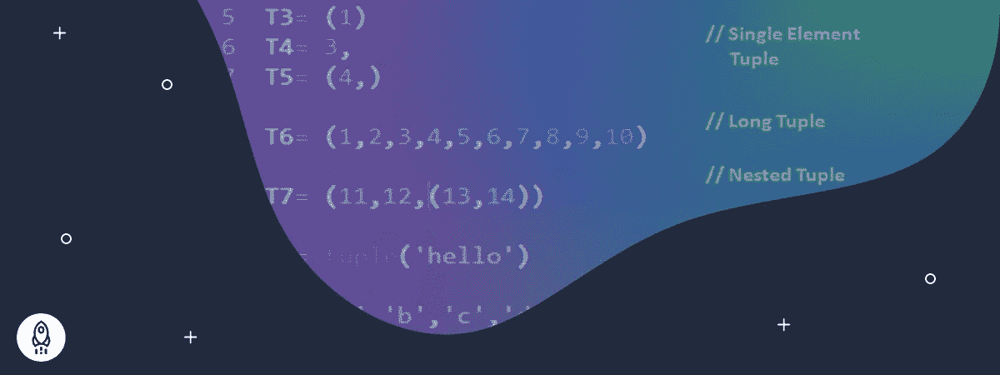

# Python 元组:一步一步的教程(包含 14 个代码示例)

> 原文：<https://www.dataquest.io/blog/python-tuples/>

March 28, 2022

在处理数据集合时，我们偶尔会遇到这样的情况，我们希望确保在创建后无法更改对象的顺序。

例如，当用 Python 从数据库中读取数据时，我们可以将每个表记录表示为有序且不可改变的对象序列，因为我们不需要在以后改变该序列。Python 有一个内置的序列数据类型来将数据存储在一个不可改变的对象中，称为**元组**。

完成本 Python 教程后，您将了解以下内容:

*   如何在 Python 中使用元组
*   Python 中元组和列表的区别
*   元组的基本用途

在本教程中，我们假设您了解 Python 的基础知识，包括变量、数据类型和基本结构。如果你不熟悉这些或者想复习一下，你可能想试试我们的 [Python 数据分析基础——Data quest](https://www.dataquest.io/path/python-basics-for-data-analysis/)。

让我们开始吧。

## 什么是 Python 元组？

元组表示由逗号分隔并括在括号中的任何对象的序列。tuple 是一个**不可变的**对象，这意味着它不能被改变，我们用它来表示项目的固定集合。

让我们来看一些 Python 元组的例子:

*   `()` —空元组
*   `(1.0, 9.9, 10)` —包含三个数字对象的元组
*   `('Casey', 'Darin', 'Bella', 'Mehdi')` —包含四个字符串对象的元组
*   `('10', 101, True)` —包含字符串、整数和布尔对象的元组

此外，列表和元组等其他对象可以组成一个元组，如下所示:

```py
a_tuple = (0, [1, 2, 3], (4, 5, 6), 7.0)
```

上面的代码创建了一个包含整数、列表、元组和浮点数的元组。下面的代码返回整个元组及其数据类型。

```py
print(a_tuple)
print(type(a_tuple))
```

```py
(0, [1, 2, 3], (4, 5, 6), 7.0)
<class>
```

但是，`('A')`不是元组。让我们看看它的数据类型:

```py
print(type(('A')))
```

```py
<class>
```

那么，怎样才能声明一个单值元组呢？答案很简单。我们需要在右括号前加一个额外的逗号，就像这样:
`('A',)`
后面的逗号是指括号中保存的是一个单值元组，不是为了增加一个数学运算的优先级。

## 对元组进行索引和切片

如前所述，因为元组是一个对象序列，所以我们可以通过索引来访问这些对象。与字符串一样，第一个元素的索引是 0，第二个元素的索引是 1，依此类推。让我们尝试索引一个元组:

```py
print('The first element:', a_tuple[0])
print('The last element:', a_tuple[-1])
print('The data type of the second element:', type(a_tuple[1]))
```

```py
The first element: 0
The last element: 7.0
The data type of the second element: <class>
```

在上面的代码中，第一个和第二个语句返回元组的第一个和最后一个元素的值。最后一条语句打印出元组的第二个元素的数据类型，它是一个列表对象。

此外，下面这段代码显示了如何在索引 2 处检索内部元组的第二个元素。

```py
print(a_tuple[2][1])
```

```py
5
```

这意味着我们可以通过一系列索引操作来访问存储在内部元组(存储在另一个元组中的元组)中的元素。

对元组进行切片就像用相同的规则对 Python 字符串或列表进行切片一样简单。为了获得元组中的元素范围，我们可以通过选择范围的开始(包含)和结束(不包含)来指定要检索的索引范围。

让我们来看一些例子:

```py
num_tuple = 2, 4, 5, 7, 8, 10
print(num_tuple[:3])
print(num_tuple[4:])
print(num_tuple[-3:])
print(num_tuple[2:5])
```

```py
(2, 4, 5)
(8, 10)
(7, 8, 10)
(5, 7, 8)
```

代码的第一行声明了一个整数值元组。虽然这不常见，但这是声明元组的另一种方式，即提供一系列用逗号分隔的对象，而不用圆括号将它们括起来。后续语句打印出元组的不同部分，如图所示。

* * *

**注**

如果你不熟悉用 Python 对序列对象进行索引和切片，或者想复习一下，Dataquest 博客上有一个很好的教程:[教程:揭开 Python 列表的神秘面纱](https://www.dataquest.io/blog/tutorial-demystifying-python-lists/)。

* * *

要连接两个或更多元组，我们可以像字符串一样使用`+`符号。例如，以下代码连接两个元组:

```py
tuple_1 = (1, 2)
tuple_2 = (3, 4)
print(tuple_1 + tuple_2)
```

```py
(1, 2, 3, 4)
```

此外，将一个元组乘以一个整数会产生一个包含重复多次的原始元组的元组。让我们来试试:

```py
my_tuple = (1, 7, 9, 8)
print(my_tuple * 2)
```

```py
(1, 7, 9, 8, 1, 7, 9, 8)
```

## 压缩元组

`zip()`方法接受多个序列对象，并通过匹配它们的元素返回一个 iterable 对象。要了解关于压缩元组的更多信息，请考虑以下示例。

假设我们有三个不同的元组，包含四个客户的个人详细信息。我们希望创建一个元组，以单独元组的形式保存每个客户的相应数据，包括他们的名字、姓氏和年龄:

```py
first_names = ('Simon', 'Sarah', 'Mehdi', 'Fatime')
last_names = ('Sinek', 'Smith', 'Lotfinejad', 'Lopes')
ages = (49, 55, 39, 33)
zipped = zip(first_names, last_names,ages)
print(zipped)
```

我们在上面的代码中声明了`first_name`、`last_name`和`ages`元组。`zip()`方法接受三元组并返回一个 zip 对象，这是一个迭代器。要使用迭代器对象，我们需要将它转换为列表或元组，如下所示:

```py
customers = tuple(zipped)
print(customers)
```

```py
(('Simon', 'Sinek', 49), ('Sarah', 'Smith', 55), ('Mehdi', 'Lotfinejad', 39), ('Fatime', 'Lopes', 33))
```

`customers` tuple 由四个 tuple 对象组成，每个对象属于一个客户。

## 解包元组

解包元组允许我们提取元组元素并将它们分配给命名变量。让我们来试试:

```py
first_name, last_name, age = customers[2]
print(first_name, last_name, ',', age, 'years old')
```

```py
Mehdi Lotfinejad , 39 years old
```

上面的代码检索存储在`customers`元组的索引 2 处的元组元素，并将它们分配给`first_name`、`last_name`和`age`变量。

## Python 中元组和列表的区别

除了元组和列表之间的直观差异，如前所述，元组是不可变的，因此与列表不同，元组不能被修改。然而，一些技术差异使得元组成为 Python 编程中不可否认的资产。

列表比元组更适合作为可迭代对象的第一个区别是列表对象提供了更多的方法。但是额外的功能是有代价的。让我们先看看下面代码中每个对象占用内存的大小，然后讨论为什么元组在某些情况下是更好的选择。

```py
import sys
a_list = ['abc', 'xyz', 123, 231, 13.31, 0.1312]
a_tuple = ('abc', 'xyz', 123, 231, 13.31, 0.1312)
print('The list size:', sys.getsizeof(a_list), 'bytes')
print('The tuple size:', sys.getsizeof(a_tuple), 'bytes')
```

```py
The list size: 104 Bytes
The tuple size: 88 Bytes
```

我们可以看到列表对象比元组对象占用更多的内存。当我们处理大数据时，占用更少内存的重要性变得更加明显，这意味着在处理大量数据时，不变性会带来显著的优化。除了占用更少的内存之外，处理元组对象比列表要快得多，尤其是在处理数以百万计的序列对象时。

## Python 元组的使用

本节将讨论在实践中使用元组的两种令人兴奋的方式。让我们来探索它们。

### 元组元素交换

只有当变量是元组元素时，我们才能使用元组来交换与变量相关联的值。让我们试一试:

```py
x = 19
y = 91
print('Before swapping:')
print(f'x = {x}, y = {y}')
(x, y) = (y, x)
print('After swapping:')
print(f'x = {x}, y = {y}')
```

```py
Before swapping:
x = 19, y = 91
After swapping:
x = 91, y = 19
```

`y`的值赋给`x`变量，`x`的值同时赋给`y`。这是一种更为 Pythonic 式的交换值的方式。

### 从函数中返回多个值

函数只能返回一个值。然而，我们可以使用一个 tuple，并在其中放入我们需要的任意多的值，然后返回 tuple 对象作为函数的返回值。让我们看看如何使用元组从下面的代码中的函数返回多个值:

```py
def sum_and_avg(x, y, z):
    s = x + y + z
    a = s/3
    return(s, a) 
(S, A) = sum_and_avg(3, 8, 5)
print('Sum =', S)
print('Avg =', A)
```

```py
Sum = 16
Avg = 5.333333333333333
```

`sum_and_avg()`函数计算三个数值的和与平均值。该函数返回`s`和`a`，这是它在元组对象的上下文中计算的两个值。实际上，函数只返回单个值，这是一个包含多个值的元组对象。我们还使用了元组解包技术来提取返回的元组对象中的值，然后将它们打印出来。

## 结论

本教程讲述了如何创建元组对象，以及 Python 元组的许多方面，如索引、切片、压缩、解包等。我们还讨论了元组和列表之间的区别。正确使用 Python 元组肯定会使我们的代码更加高效和健壮。