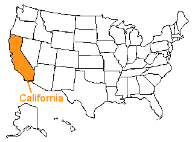

# 历史野火数据:R 中的探索性可视化

> 原文：<https://www.dataquest.io/blog/r-data-viz-tutorial/>

December 11, 2018

最近几周，席卷美国加利福尼亚州部分地区的毁灭性野火的消息在[新闻](https://www.bbc.com/news/av/world-us-canada-41141001/wildfires-sweep-areas-of-california)中占据显著位置。虽然大多数野火是由人类意外引发的，但风和干旱等天气条件会加剧火灾的蔓延和强度。加深对历史野火趋势和原因的了解可以为火灾管理提供信息，并拯救生命和财产。在本练习中，我们将使用 R 来执行**探索性数据可视化**，因为我们了解了加利福尼亚州的历史野火数据。在决定对新数据集进行进一步分析时，探索性数据可视化是重要的第一步。如果您愿意，如果您安装了 R 或 RStudio，也可以在自己的机器上跟随。关于使用 R 和设置 RStudio 的初级读本，请查看我们的[R](https://www.dataquest.io/course/introduction-to-data-analysis-in-r/)课程简介。为了学习执行我们将在本练习中使用的一些更高级的数据争论技术，我们推荐[中级 R 编程](https://www.dataquest.io/course/control-flow-iteration-and-functions-in-r/)。



### 识别数据源

首先，我们需要找到要处理的数据。加州林业和消防部门(Cal Fire)提供了大量包含历史火灾数据的资源，包括 2000 年以来大规模野火(超过 300 英亩)的规模、持续时间和原因。

我们很高兴地发现[拉扎罗·加米奥](https://www.axios.com/authors/Lazaro_Gamio)和[吉尔·胡布里](https://www.jillhubley.com/)已经从 CAL FIRE 搜集了数据，并在[这里](https://gist.github.com/lazarogamio/d64e0d04b1ce1f2a3bd08db7526fa632)发布。数据集包含以下变量:

*   **id** :事件编号，用于唯一识别火灾的 id。
*   **单位**:Ranger 单位，Cal Fire 用来标识管理区域。* **名称**:用来指代火的名称。
*   **开始**:火灾开始的日期。
*   **结束**:火势被控制的日期。
*   机构:提供数据的联邦机构。
*   **英亩**:大火烧毁的英亩数。该数据集包含大于 300 英亩的火灾的信息。
*   **原因**:火灾是什么引起的(如果知道的话)。

我们首先将数据作为名为`ca_fires`的数据帧导入 R:

```py
library(readr)
ca_fires <- read_csv("axios-calfire-wildfire-data.csv")
```

让我们看看数据的前几行:

```py
head(ca_fires)
```

       
| 身份证明（identification） | 单位 | 名字 | 开始 | 结束 | 代理 | 英亩 | 原因 |
| TGU-803 | 门多西诺 nfm nf–154 | 城镇 | 03-31-2000 | 04-05-2000 | 美国联邦调查局 | One thousand five hundred | 逃逸控制 |
| MNF-177 | 门多西诺 NF | 卷心菜 | 04-01-2000 | 04-01-2000 | 美国联邦调查局 | One thousand five hundred and forty | ？ |
| TGU-851 | 门多西诺 NF MNF_178 | 富兰克林 | 04-02-2000 | 04-03-2000 | 美国联邦调查局 | four hundred | 钠 |
| LMU-630 | 拉森 NF | PNF 151(罗宾逊) | 04-04-2000 | 04-05-2000 | 美国联邦调查局 | Five hundred | 钠 |
| BDU-4016 | 莫诺县 | 协助(梓) | 05-29-2000 | 06-01-2000 | 美国联邦调查局 | Seven hundred and forty | 营火 |
| TUU-4863 | 图莱雷 | 大象 | 06-01-2000 | 06-01-2000 | 累积分布函数（Cumulative Distribution Function 的缩写） | Four hundred and ninety-seven | 控制烧伤 |

我们可以使用这些数据来回答各种问题，以帮助我们更好地了解过去 18 年来加州的野火:

*   它们有多大？
*   它们持续多长时间？
*   它们最有可能发生在什么时候？
*   随着时间的推移，它们的严重程度有变化吗？

## 准备用于分析的数据

我们将创建可视化来回答这些问题。数据相当干净，但是在我们开始探索性的可视化之前，我们需要执行一些操作:

*   `start`和`end`变量目前是字符数据，但是我们需要将它们改为日期。
*   从`start`和`end`中，我们可以计算出一个新的变量`duration`，来告诉我们每场火灾持续了多长时间。

为了将`start`和`end`变量日期从字符数据更改为日期数据，我们将使用包 [lubridate](https://lubridate.tidyverse.org/) 。我们还将使用来自`dplyr`包的数据争论工具。

```py
library(lubridate)
library(dplyr)
```

使用`dplyr`函数`mutate()`和`lubridate`函数`as.Date()`，我们可以将`start`和`end`日期从字符改为数字:

```py
ca_fires <- ca_fires %>%  mutate(start = as.Date(start, "%m-%d-%Y"), end = as.Date(end, "%m-%d-%Y"))
```

由于按月或按年计算汇总统计数据可能很有用，所以让我们从`start`列中提取信息来创建新的`month`和`year`变量。我们可以使用`lubridate`功能`month()`和`year()`来完成这项工作:

```py
ca_fires <- ca_fires %>%  mutate(Month = month(start, label = TRUE),
         Year = year(start)) 
```

从`start`和`end`日期，我们还可以计算出火灾发生的时间长度。我们将使用`mutate()`创建一个新变量`duration`:

```py
ca_fires <- ca_fires %>%  mutate(duration = end - start)
```

为了让我们能够直观地看到一段时间内被野火烧毁的英亩数的趋势，我们将使用`mutate()`和基数 R 函数`cumsum()`创建一个新变量`acres_cumulative`，包含被烧毁的英亩数的累积总和:

```py
ca_fires <- ca_fires %>%  mutate(acres_cumulative = cumsum(acres))
```

我们现在准备好开始通过创建可视化来探索数据。我们将使用 [`ggplot2`](https://ggplot2.tidyverse.org/) 包，这是 r 中非常流行的数据可视化包

## 可视化数据分布

让我们首先考虑我们就 wildfire 数据提出的前两个问题:

*   CA 野火的规模有多大？
*   它们持续多长时间？

当我们探索数据以试图理解我们对这个问题的答案时，一个好的第一步是创建[](https://en.wikipedia.org/wiki/Histogram)**直方图，以理解数据是如何[](https://en.wikipedia.org/wiki/Probability_distribution)**分布的，或者大部分数据落在值范围的哪个位置。我们将使用 ggplot()函数创建直方图来可视化变量`area`和`duration`的分布:****

```py
## area
ggplot(data = ca_fires) +
  aes(x = acres) +
  geom_histogram(bins  = 30) +
  theme_classic() +
  scale_x_continuous(labels = scales::comma)  
## duration
ggplot(data = ca_fires) +
  aes(x = duration) +
  geom_histogram(bins  = 30) +
  theme_classic() +
  scale_x_continuous(labels = scales::comma)
```

让我们先来看看`acres`的直方图:


在直方图中，条形的高度对应于落入某个变量值范围(在 x 轴上)的观察值数量(在 y 轴上显示)。从这个直方图中可以清楚地看到，数据是高度倾斜的:也就是说，绝大多数火灾都小于几千英亩，但对于`area`，有一些非常大的值，接近 30 万英亩。直方图能告诉我们火灾持续了多长时间？

让我们看看`duration` : 的直方图，看看这个图上的 x 轴刻度。`duration`的所有值都应该是正数，但是直方图显示存在一些大的负值。让我们使用`dplyr`函数`filter()`来看看`duration`的值为负的观察值:

```py
ca_fires %>%  filter(duration < 0)
```

如果我们查看这些观察的`start`和`end`日期，我们可以看到它们似乎不正确，可能是由于数据输入错误:

```py
 id         unit     name            start      end       <chr>      <chr>    <chr>           <date>     <date>    
TUU-007233 Tulare   Frazier         2003-07-08 2003-07-07
TCU-006534 TUOLUMNE EARLY           2004-08-11 2004-08-09
BTU-9805   BUTTE    EMPIRE          2008-08-13 2008-08-03
BTU-7042   PLUMAS   BOULDER COMPLEX 2016-06-25 2006-07-05
```

让我们从数据集中删除这些明显不准确的观察结果:

```py
ca_fires <- ca_fires %>%
    filter(duration >0)
```

如果我们重新运行创建直方图`duration`的代码，现在我们已经忽略了日期数据不准确的行，我们可以看到绝大多数火灾持续时间不到 100 天。

## 可视化年度模式

现在，我们已经使用直方图了解了野火最常见的规模和持续时间，让我们可视化数据来回答另一个问题:

*   什么时候最有可能发生火灾？

野火在一年中的特定时间更常见吗？因为我们有一个`month`变量，我们可以可视化野火发生的趋势和每月烧毁的英亩数。首先，让我们使用`dplyr`函数`group_by()`和`summarize()`来计算每个月发生的火灾数量:

```py
month_summary <- ca_fires %>%
  group_by(month) %>%
  summarize(fires = n())
```

然后，我们将创建一个条形图来显示每月的火灾数量:

```py
 ggplot(data = month_summary) +
 aes(x = month, y = fires) +
  geom_bar(stat = "identity") +
 theme_classic() +
 scale_y_continuous(labels = scales::comma)
```

这个条形图让我们清楚地看到，大多数火灾发生在春、夏、秋三季，这些季节的特点是炎热、干燥，有利于火势蔓延。然而，它并没有让我们看到不同年份中每月发生的火灾数量的变化。相反，让我们在`ca_fires`数据框中按月和按年总结火灾发生次数，并创建一个[箱线图](https://en.wikipedia.org/wiki/Box_plot)，它将让我们直观地看到不同年份每月火灾次数的变化:

```py
 month_year_summary <- ca_fires %>% 
 group_by(month, year) %>%
  summarize(fires = n())
ggplot(data = month_year_summary) +
  aes(x = month, y = fires) +
   geom_boxplot() +
  theme_classic() +
  scale_y_continuous(labels = scales::comma)
```

箱线图以图形方式描绘了数据的最小值、最大值和中值，因此是比较数据组而不模糊可变性的极佳可视化工具。让我们来看看每月野火数量的箱线图:

正如我们之前创建的条形图所表明的，野火在夏季最常见，在冬季通常很少发生。代表异常值的点的存在表明，虽然不常见，但野火全年都可能发生。

## 可视化随时间的变化

让我们继续讨论另一个我们可以利用这些数据回答的问题:

*   野火的严重程度是否随着时间的推移而改变？

为了回答这个问题，我们将创建一个随时间推移的累计燃烧英亩数的折线图:

```py
 ca_fires %>%
  ggplot() +
  aes(x = start, y = acres_cumulative) +
  geom_line() + 
 theme_classic() +
  scale_y_continuous(labels = scales::comma) + 
 ylab("Acres Burned (cumulative)") + 
 xlab("date") + 
 ggtitle("Cumulative Acres Burned Since 2000")
```

一条平滑的、向上的线将指示被野火烧毁的英亩数在一段时间内保持一致，而被烧毁的英亩数的任何增加或减少都将作为线斜率的变化而被注意到。

当我们看着累计烧毁的英亩数的线图时，我们可以看到一个看起来有点像楼梯的模式:烧毁的英亩数迅速增加，然后又趋于平稳。根据早期的探索，我们可以推断这种模式很可能是由于季节差异。在夏季的几个月里，更多的英亩被烧毁，而在较冷的几个月里，增加的面积较小。我们还可以看到一些“台阶”比其他的要高，这表明一次烧毁了大量的土地。

## 结论和后续步骤

在本练习中，我们的探索性数据可视化为我们提供了有关加州 300 英亩以上野火的信息:

*   虽然有一些大的异常值，但大多数野火都小于几百英亩，持续时间不到 50 天。
*   大多数野火发生在夏季，尽管它们可能在一年中的任何时候发生。
*   有些年份的特点是更具破坏性的野火。

探索性数据可视化的目的是让自己熟悉新的数据集，了解趋势，并计划未来的分析。一个有趣的下一步可能是探索气候和天气条件对森林火灾频率和严重程度的影响。此类数据有许多来源:

*   你可以从美国国家海洋和大气管理局(NOAA)的国家综合干旱信息系统(NIDIS)项目中获取加利福尼亚州的干旱数据。
*   历史[天气和气候](https://www.ncdc.noaa.gov/)数据，如温度和降雨量可从 NOAA 获得。
*   NIDIS 提供了土壤湿度的数据，这是干旱的一个指标，也是加剧野火的一个因素。


如果您有兴趣了解有关使用 R 进行探索性数据可视化的更多信息，包括调查环境变量和 wildfire 数据之间关系的方法，请务必查看我们在 R 课程中的[数据可视化。](https://www.dataquest.io/course/r-data-viz/)

> install.packages("Dataquest ")

从我们的[R 课程简介](/course/intro-to-r/)开始学习 R——不需要信用卡！

[SIGN UP](https://app.dataquest.io/signup)****