# R Markdown 入门指南和备忘单

> 原文：<https://www.dataquest.io/blog/r-markdown-guide-cheatsheet/>

July 9, 2020

使用 R Markdown 将您的数据分析转化为漂亮的文档。

在这篇博文中，我们将看看如何使用 R Markdown。最后，你将拥有使用 R Markdown 从头开始制作文档或演示文稿所需的技能！

我们将向您展示如何将默认的 R Markdown 文档转换成您自己的有用参考指南。我们鼓励你建立你自己的 R Markdown 指南，但是如果你喜欢只是跟着读，那也是可行的！

R Markdown 是一个开源工具，用于在 r 中生成可重复的报告。它使您能够将所有的代码、结果、图表和文字保存在一个地方。当您为那些对您的分析结果感兴趣，而不是对您的代码感兴趣的读者制作文档时，R Markdown 特别有用。

R Markdown 功能强大，因为它可以用于数据分析和数据科学，与他人合作，并将结果传达给决策者。使用 R Markdown，您可以选择将您的作品导出为多种格式，包括 PDF、Microsoft Word、幻灯片或 HTML 文档，以便在网站中使用。

我们将使用 RStudio 集成开发环境(IDE)来制作我们的 R Markdown 参考指南。如果你想了解更多关于 RStudio 的信息，请查看我们的列表 [23 个令人敬畏的 RStudio 提示和技巧](https://www.dataquest.io/blog/rstudio-tips-tricks-shortcuts/)！

在 Dataquest，我们喜欢使用 R Markdown 来编写 R 代码和创作内容。事实上，我们在 R Markdown 写了这篇博文！此外，Dataquest 平台上的学习者使用 R Markdown 来完成他们的 [R 项目](https://www.dataquest.io/data-science-projects/)。

我们在这篇博文中包含了完全可复制的代码示例。当你掌握了这篇文章的内容后，看看我们的另一篇关于 [R 降价技巧、诀窍和捷径](https://www.dataquest.io/blog/r-markdown-tips-tricks-and-shortcuts/)的博客文章。

好了，让我们开始构建我们自己的 R Markdown 参考文档吧！

> install.packages("Dataquest ")

从我们的[R 课程简介](/course/intro-to-r/)开始学习 R——不需要信用卡！

[SIGN UP](https://app.dataquest.io/signup)

## r 降价指南和备忘单:快速导航

*   [1。安装 R 降价](#tve-jump-17333d4d6ac)
*   [2。默认输出格式](#tve-jump-17333d68a3d)
*   [3。r 减价文件格式](#tve-jump-17333d6b6ef)
*   [4。章节标题](#tve-jump-17333d6e462)
*   [5。项目符号和编号列表](#tve-jump-17333d714ef)
*   [6。文本格式](#tve-jump-17333d75ada)
*   [7。链接](#tve-jump-17333d79609)
*   [8。代码块](#tve-jump-17333d7c8de)
*   [9。运行代码](#tve-jump-17333d7fbd1)
*   10。用代码块选项控制行为
*   [11。内嵌代码](#tve-jump-17333d85bad)
*   [12。导航部分和代码块](#tve-jump-17333d895e6)
*   13。表格格式
*   [14。输出格式选项](#tve-jump-17333d90b3a)
*   15。演示文稿
*   16。添加目录
*   [17。使用 RStudio 云生成可再现的报告](#tve-jump-17333d9b58d)
*   [更多降价技巧、窍门和快捷方式](https://www.dataquest.io/blog/r-markdown-tips-tricks-and-shortcuts/)
*   [奖励:R 降价备忘单](#tve-jump-17333da0719)
*   [附加资源](#tve-jump-17333da4293)

## 1.安装 R 降价

R Markdown 是一个免费的开源工具，像其他 R 包一样安装。使用以下命令安装 R Markdown:

```py
install.packages("rmarkdown")
```

既然已经安装了 R Markdown，导航到`File > New File > R Markdown….`R Markdown files have the file extension”，在 RStudio 中打开一个新的 R Markdown 文件。Rmd”。

## 2.默认输出格式

当您在 RStudio 中打开一个新的 R Markdown 文件时，会出现一个弹出窗口，提示您选择用于文档的输出格式。


默认的输出格式是 HTML。有了 HTML，你可以很容易地在网络浏览器中查看它。

我们建议现在选择默认的 HTML 设置——它可以节省您的时间！为什么？因为编译 HTML 文档通常比生成 PDF 或其他格式要快。当你接近一个成品时，你把输出转换成你选择的格式，然后进行最后的润色。

最后要注意的是，您在上面的弹出窗口中为文档指定的标题不是文件名！导航至`File > Save As`..命名并保存文档。

## 3.r 减价文件格式

一旦选择了所需的输出格式，R Markdown 文档就会出现在 RStudio 窗格中。但与空白的 R 脚本不同的是。Rmd 文档包括一些乍一看可能很奇怪的格式。我们来分解一下。

我们突出显示了 R Markdown 文档的六个不同部分，以了解正在发生的事情:

1.  YAML 页眉:控制应用于整个文档的某些输出设置。
2.  代码块:包括要运行的代码，以及与代码相关的选项。
3.  正文:用于向目标受众传达结果和发现。
4.  生成一个表的代码:输出一个具有最小格式的表，就像您在控制台中看到的一样。
5.  节头:用##指定。
6.  生成图的代码:输出图。这里，不包括用于生成绘图的代码，因为指定了参数 echo=FALSE。这是一个块选项。我们将很快介绍大块选项！

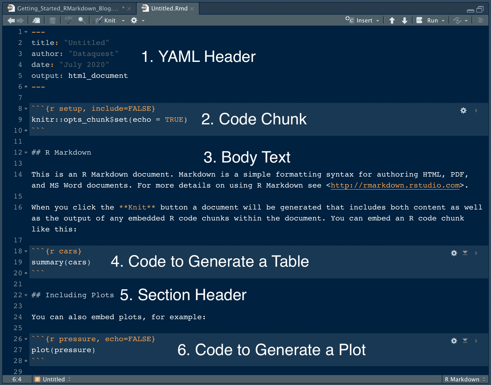

此文档可以按原样输出。让我们“编织”或输出文档，看看这些格式规范在呈现的文档中是什么样子。在 RStudio 中，我们通过单击“针织”按钮来实现这一点。编织文档会生成一个 HTML 文档，因为这是我们指定的输出格式。

编织文档的快捷方式在 Mac 上是`Command + Shift + K`，在 Linux 和 Windows 上是`Ctrl + Shift + K`。“k”是“针织”的缩写！

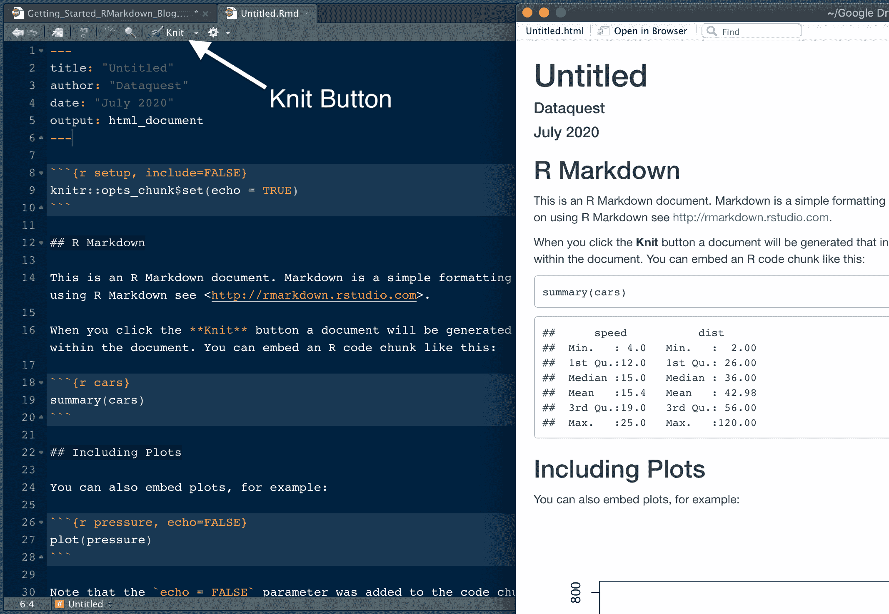

上图展示了左边的 R Markdown 文档输出到右边的 HTML 时的样子。

注意默认的。RStudio 中的 Rmd 文件包括格式化 R Markdown 文档的有用指导。我们将把这个文档保存为`RMarkdown_Guide.Rmd`，这样我们就可以在本教程的过程中添加它。我们在 YAML 的标题中将该文档命名为“R Markdown Guide”。我们鼓励你也这样做，这样你就可以建立你自己的 R Markdown 参考指南！

**注意:**如果您在 RStudio 之外的 R Markdown 中工作，请使用函数`rmarkdown::render()`来编译您的文档。提供带引号的文档名作为函数参数。例如:

```py
`rmarkdown::render("RMarkdown_Guide.Rmd")`
```

## 4.部分标题

接下来，我们将介绍。Rmd 文件。R Markdown 文件是用 Markdown 编写的纯文本文件，Markdown 是一种格式化语法。我们从章节标题开始。

注意在默认情况下。Rmd 文件，文件中有两个部分， **R Markdown** 和**包括地块**。这些是二级头，因为有双散列标记(##)。让我们在指南“文本格式基础”中创建新的二级标题，输入:

```py
## Text Formatting Basics
```

接下来是第三级标题，称为标题，如下所示:

```py
## Text Formatting Basics
### Headers
```

我们将用第一、第二和第三级标题的语法要求来构建我们的指南。我们希望我们的指南显示生成标题的*代码*。

因此，为了将标题的格式要求添加到我们的指南中，我们添加了以下内容:

`# First Level Header`

`## Second Level Header`

`### Third Level Header`

**提示:**在每行代码之间插入一个空行，以便在输出时将它们分开。并且在相邻但互不相同的格式元素(如节标题和正文)之间始终至少有一个空行。

的。Rmd 文档，输出如下所示:

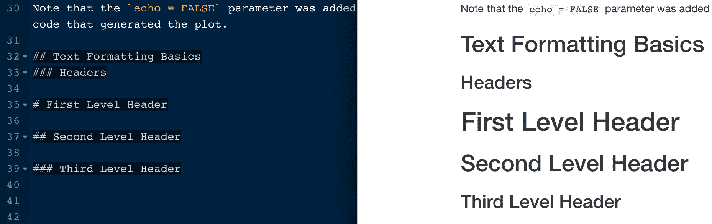

在上图中，我们看到了第二层和第三层标题呈现时的样子。我们还指定了用`#`、`##`或`###`创建标题的语法。这是一个很好的例子，说明 R Markdown 中的格式化是多么简单而强大。

如果您不希望标题在最终输出中呈现为标题，请将代码用反斜杠括起来，如下所示，将文本格式化为代码:

```py
`# First Level Header`
```

## 5.项目符号和编号列表

现在，我们将创建一个名为**项目符号和编号列表**的新的第三级标题，并在指南中键入以下内容以生成无序列表:

```py
* List element 1
* List element 2
* List element 3
 * List item 3a
 * List item 3b
```

事实上，字符`*`、`-`和`+`都是为生成无序列表项而工作的。

以下是编号列表所需的语法:

```py
1\. Numbered list 1
1\. Numbered list 2
1\. Numbered list 3.
```

数字会自动递增，所以我们只需输入“1”。如果我们添加或删除项目，这很好，因为我们不必担心重新编号！

也可以将有序列表和有序列表结合起来。按两次`tab`来缩进未排序的项目符号:

```py
1\. Numbered list 1
1\. Numbered list 2
 * Item 1
 * Item 2
```

下面是这种格式在我们的指南和输出中的并排视图:

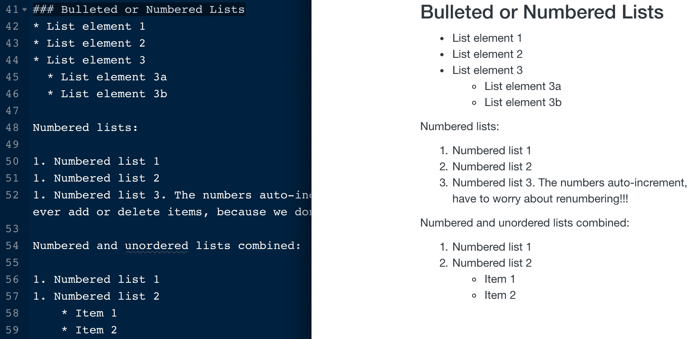

## 6.文本格式

我们将继续通过添加基本的文本格式来构建我们的 R Markdown 指南。创建一个名为**文本格式**的新的第三级标题，并复制或键入以下内容:

```py
* Make text italic like *this* or _this_. 
* Make text bold like **this** or __this__.
* Use `backticks` for code.
* Wrap a character to subscript in tildes (`~`). For example, `H~2~O` renders as H~2~O.
* Wrap a character to superscript in carets (`^`), like this: `R^2^` renders as R^2^.
```

这是渲染时的样子:

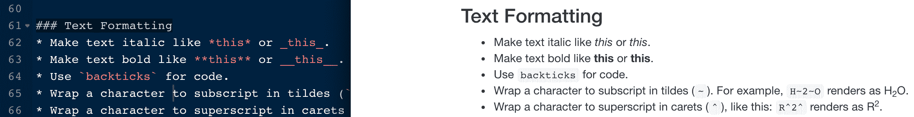

## 7.链接

R Markdown 使链接网站和图片变得容易。在我们指南中称为**链接的这一部分，**我们记录了以下内容:

```py
Direct in-line links: <https://rmarkdown.rstudio.com/>.

Phrase links: RStudio's [R Markdown page](https://rmarkdown.rstudio.com/).


```

这是 HTML 输出:

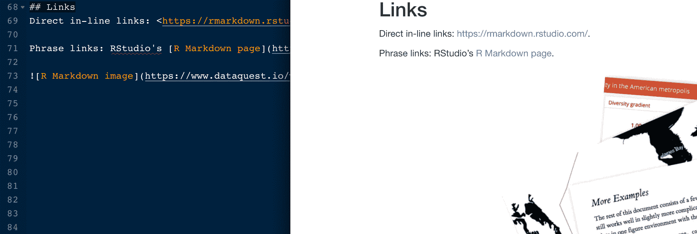

## 8.代码块

要在 R Markdown 中运行代码块，请使用代码块。使用以下内容插入新代码块:

1.  `Command + Option + I`在 Mac 上，或者`Ctrl + Alt + I`在 Linux 和 Windows 上。
2.  另一个选项是工具栏中的“插入”下拉图标并选择 r。

我们建议学习节省时间的捷径！我们将在 R Markdown 指南中插入一个新的代码块。

## 9.运行代码

RStudio 在工具栏的“运行”下拉选项卡中提供了许多运行代码块的选项:

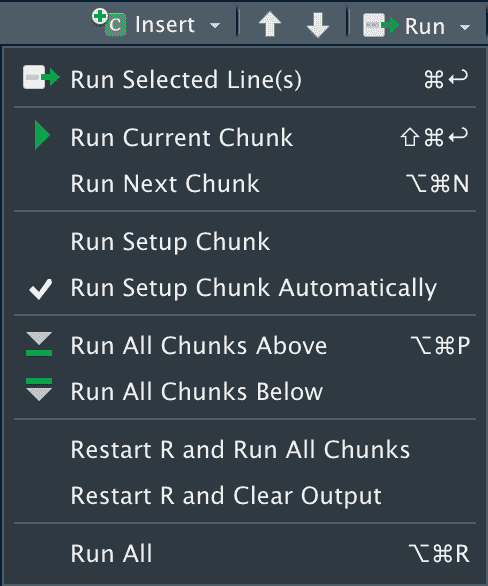

在运行代码块之前，重启 R 会话并从一个干净的环境开始通常是一个好主意。在 Mac 上使用`Command + Shift + F10`或在 Linux 和 Windows 上使用`Control + Shift + F10`来完成此操作。

为了节省时间，有必要学习这些运行代码的快捷方式:

*   在 Mac 上使用`Command + Option + P`运行当前块之上的所有块，或者在 Linux 和 Windows 上使用`Ctrl + Alt + P`。
*   在 Mac 上使用`Command + Option + C`或`Command + Shift + Enter`运行当前块。在 Linux 和 Windows 上，使用`Ctrl + Alt + C`或`Ctrl + Shift + Enter`来运行当前块。
*   在 Mac 上使用`Command + Option + N`运行下一个块，或者在 Linux 和 Windows 上使用`Ctrl + Alt + N`。
*   在 Mac 上使用`Command + Option + R`或`Command + A + Enter`运行所有块。在 Linux 和 Windows 上，使用`Ctrl + Alt + R`或`Ctrl + A + Enter`来运行所有的块。

> install.packages("Dataquest ")

从我们的[R 课程简介](/course/intro-to-r/)开始学习 R——不需要信用卡！

[SIGN UP](https://app.dataquest.io/signup)

## 10.用代码块选项控制行为

R Markdown 的一个优点是，您有许多选项来控制如何评估和呈现每一段代码。这使您可以从头开始构建演示文稿和报告，包括代码、图表、表格和图像，同时只向目标受众展示必要的信息。例如，您可以包含一个结果图，而不显示用于生成它的代码。

掌握代码块选项是成为一个熟练的 R Markdown 用户的必要条件。学习组块选项的最好方法是在你的报告中需要时尝试它们，所以现在不要担心记住所有这些。以下是需要学习的关键块选项:

*   `echo = FALSE`:不在输出中显示代码，但运行代码并产生所有输出、绘图、警告和消息。下图中用于生成绘图的代码块就是一个例子。
*   显示代码，但不评估它。
*   `fig.show = "hide"`:隐藏情节。
*   `include = FALSE`:运行代码，但抑制所有输出。这对设置代码很有帮助。你可以在下图的顶部代码块中看到这样的例子。
*   `message = FALSE`:防止包加载时打印消息。这也抑制了函数生成的消息。
*   `results = "hide"`:隐藏打印输出。
*   `warning = FALSE`:防止软件包和功能显示警告。


## 11.内嵌代码

用内联代码直接将 R 代码嵌入到 R Markdown 文档中。当您想要在书面摘要中包含有关数据的信息时，这很有用。我们将在 R Markdown 指南中添加几个内联代码的例子来说明它是如何工作的。

使用带`r`的内联代码，并在反勾号内添加要评估的代码。例如，下面是我们如何总结内置于 R 中的`cars`数据集中的行数和列数:

```py
## Inline Code

The `cars` dataset contains `r nrow(cars)` rows and `r ncol(cars)` columns.
```

下面是比较 R Markdown 和 HTML 输出的并排视图:

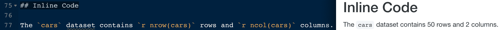

上面的例子强调了如何通过有计划地总结信息来减少报告中的错误。如果我们改变数据集并改变行数和列数，我们只需要重新运行代码就能得到准确的结果。这比试图记住我们需要在文档中的什么地方更新结果、确定新的数字以及手动更改结果要好得多。R Markdown 功能强大，因为它可以节省时间，提高报告的质量和准确性。

## 12.导航部分和代码块

命名代码块对于包含许多代码块的长文档很有用。对于 R 代码块，这样命名块:`{r my_boring_chunk_name}`。

使用命名代码块，您可以在 R Markdown 窗口窗格底部包含的导航器中的代码块之间导航。这也可以使绘图易于按名称识别，以便在文档的其他部分使用。此导航器对于快速跳转到文档的另一部分也很有用。

以下是我们在 R Markdown 指南的导航器中看到的内容:

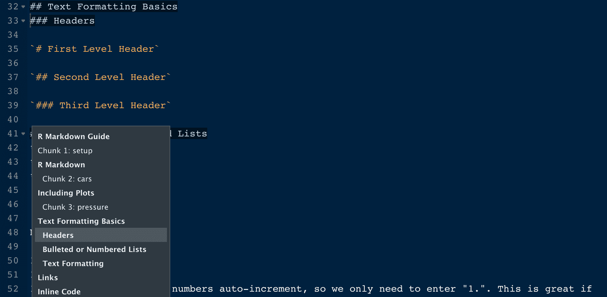

## 13.表格格式

正如本文前面提到的，默认情况下，R Markdown 中的表显示为您在 R 控制台中看到的样子。为了改善 R Markdown 文档中表格的美观，使用函数`knitr::kable()`。这里有一个例子:

```py
knitr::kable(head(cars), caption = "The First Few Rows of the Cars Dataset")
```

这是我们指南中的样子，渲染时:

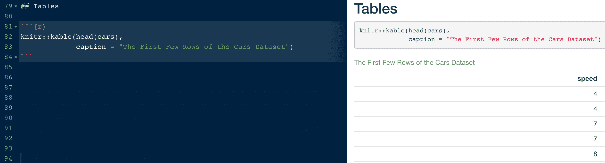

在 R Markdown 中有许多其他的用于创建表格的包。

**提醒一句:**格式化表格可能非常耗时。我们建议在学习 R Markdown 时首先坚持基础。随着技能的提高，表格格式的需求变得明显，如果需要，可以参考其他软件包。

## 14.输出格式选项

既然我们已经对如何格式化 R Markdown 文档有了很好的理解，那么让我们来讨论一下格式化选项。适用于整个文档的格式选项在 YAML 标题中指定。R Markdown 支持[多种输出格式](https://rmarkdown.rstudio.com/authoring_quick_tour.html#Output_Formats)。

YAML 报头中指定的元数据控制输出。一个 R Markdown 文档可以支持多种输出格式。回想一下，呈现为 HTML 通常比 PDF 更快。如果您想以 HTML 格式预览文档，但最终会将文档输出为 PDF 格式，请注释掉 PDF 规范，直到需要为止，如下所示:

```py
---
title: "R Markdown Guide"
author: "Dataquest"
date: "7/8/2020"
output: html_document
# output: pdf_document
# output: ioslides_presentation
---
```

正如您在这里看到的，我们还包含了将 R Markdown 指南作为演示文稿输出所需的元数据。

## 15.报告

`rmarkdown`包支持四种类型的演示。其他 R 包也是可用的，比如 [revealjs、](https://bookdown.org/yihui/rmarkdown/revealjs.html)扩展了 R Markdown 的功能。我们将简要概述内置于 R Markdown 中的表示格式，然后我们将看一个例子。

四个演示选项及其输出格式如下:

*   [beamer_presentation](https://bookdown.org/yihui/rmarkdown/beamer-presentation.html) : PDF
*   [io slides _ presentation](https://bookdown.org/yihui/rmarkdown/ioslides-presentation.html):HTML
*   [powerpoint_presentation](https://bookdown.org/yihui/rmarkdown/powerpoint-presentation.html) :微软 powerpoint
*   [slidy_presentation](https://bookdown.org/yihui/rmarkdown/slidy-presentation.html) : HTML

让我们将 R Markdown 指南转换为一个幻灯片演示。ioslides 选项编译成 HTML，这对于在屏幕共享的远程会议中进行演示非常有用。我们用`output: ioslides_presentation`将指南转换成幻灯片演示。

```py
---
title: "R Markdown Guide"
author: "Dataquest"
date: "7/8/2020"
# output: html_document
# output: pdf_document
output: ioslides_presentation
---
```

请注意，我们“注释掉”了 HTML 和 PDF 格式选项，以便在编译文档时忽略它们。这是一种保持其他输出选项可用的简便技术。

当我们编织时，R Markdown 指南和 HTML 演示出现，每个二级标题标记一个新幻灯片的开始。除了我们的“文本格式基础”部分有几个第三级标题部分之外，这一部分工作得很好:

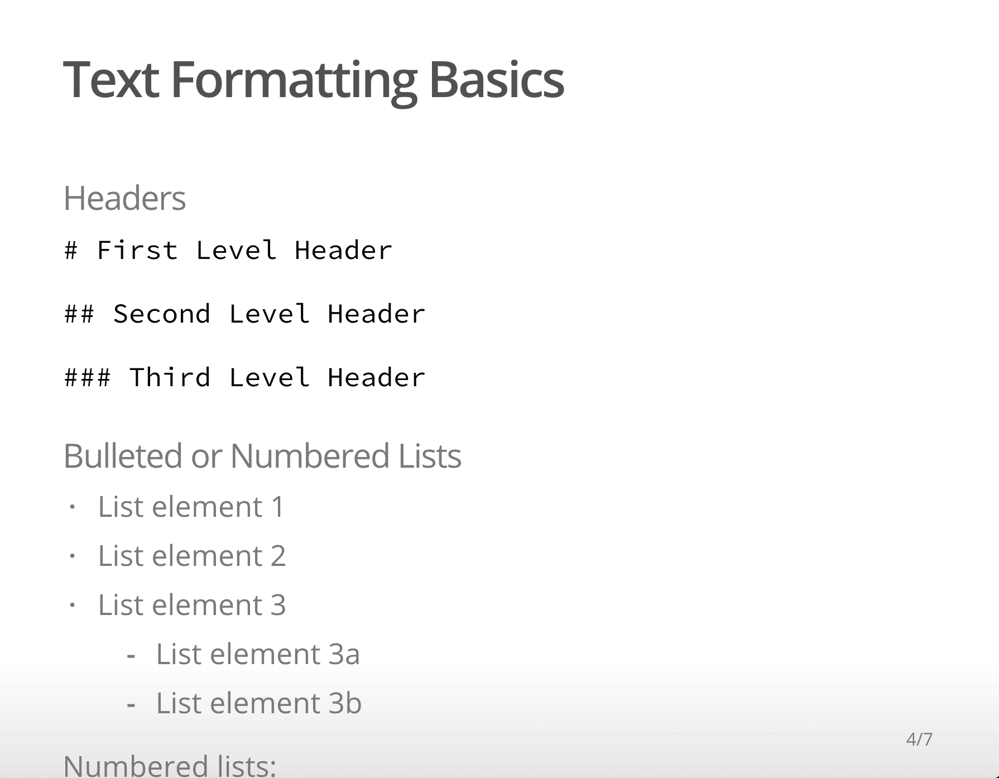

为了通过手动换行符解决这种情况，我们根据需要在每个第三级标题前插入`***`，如下所示:

```py
## Text Formatting Basics
### Headers`# First Level Header``## Second Level Header``### Third Level Header`***
### Bulleted or Numbered Lists
* List element 1
* List element 2
* List element 3
 * List element 3a
 * List element 3b
```

这将把“项目符号或编号列表”移到它自己的幻灯片中:

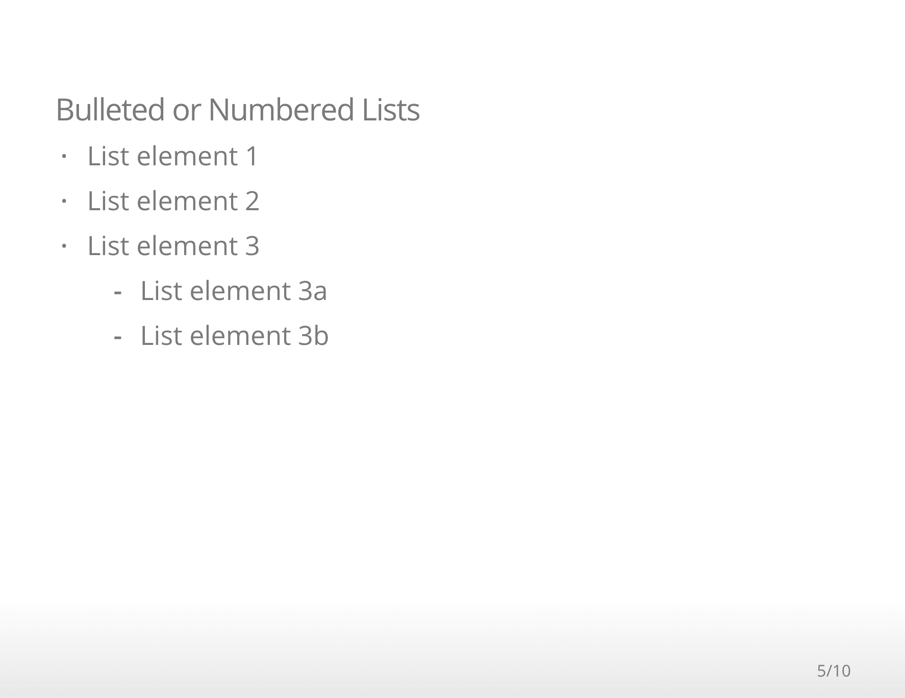

请参考以上每种演示文稿格式的链接，查看可用于自定义演示文稿外观的选项。

## 16.添加目录

你会注意到这篇博文包括一个目录。你可能记得我们在 R Markdown 写了这篇博客。我们在这篇博文中添加了目录，并在 YAML 标题中添加了一行代码`toc: true`。看起来是这样的:

```py
output: 
 html_document:
    toc: true
```

注意每一层使用的缩进，不要忘记在`html_document`后面加上`:`！

## 17.利用 RStudio 云生成可再现的报告

你在这里学到的一切都可以应用到名为 [RStudio Cloud](https://rstudio.cloud/) 的基于云的 RStudio 桌面版本上。RStudio Cloud 让您无需安装软件就能制作报告和演示 R Markdown，您只需要一个 web 浏览器。

RStudio Cloud 中的工作被组织到类似于桌面版本的项目中，但是 RStudio Cloud 使您能够指定您希望用于每个项目的 R 版本。

RStudio Cloud 还可以轻松安全地与同事共享项目，并确保每次访问项目时工作环境完全可再现。这对于在 R Markdown 中编写可重复的报告特别有用！

如您所见，RStudio Cloud 的布局非常类似于在 RStudio Desktop 中创作 R Markdown 文档:


在 RStudio Cloud 中使用 R Markdown 需要某些包。当您第一次在 RStudio Cloud 中打开一个新的 R Markdown 文档时，该程序会提示您是否要安装所需的软件包:

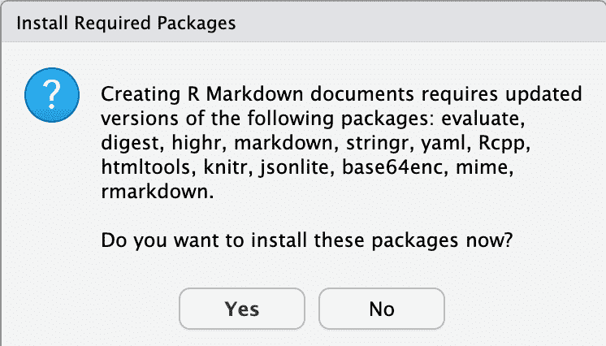

一旦软件包安装完毕，您就可以立即创建和编织 R Markdown 文档了！

## 奖金:R 降价备忘单

RStudio 发布了[许多与 R 合作的备忘单](https://rstudio.com/resources/cheatsheets/)，包括一份关于使用 R Markdown 的详细备忘单！通过选择`Help > Cheatsheets > R Markdown Cheat Sheet`，可以从 RStudio 中访问 R Markdown cheatsheet。

## 额外资源

RStudio 已经发表了几篇关于使用 R Markdown 的深入的 how to 文章。找到他们[在这里](https://support.rstudio.com/hc/en-us/sections/200149716-R-Markdown)。

R Markdown 食谱是一本全面的免费在线书籍，几乎包含了你需要知道的关于 R Markdown 的一切。

Hadley Wickham 在《数据科学的 R》一书中对 R Markdown 的创作做了很好的概述。

看看这个 R Markdown [创作快速导览](https://rmarkdown.rstudio.com/authoring_quick_tour.html)，以及 RStudio 的这个[综合在线课程](https://rmarkdown.rstudio.com/lesson-1.html)。

RStudio 还出版了这本有用的 [R Markdown 参考指南](https://rstudio.com/wp-content/uploads/2015/03/rmarkdown-reference.pdf?_ga=2.135548086.688985490.1593521771-610318113.1566927154)。

R Markdown 理解 Pandoc 的 Markdown，是 Markdown 的一个版本，有更多的功能。[本 Pandoc 指南](https://pandoc.org/MANUAL.html#pandocs-markdown)为格式化选项提供了丰富的资源。

### 准备好提升你的 R 技能了吗？

我们 R path 的[数据分析师涵盖了你找到工作所需的所有技能，包括:](/path/data-analyst-r/)

*   使用 **ggplot2** 进行数据可视化
*   使用 **tidyverse** 软件包的高级数据清理技能
*   R 用户的重要 SQL 技能
*   **统计**和概率的基础知识
*   ...还有**多得多的**

没有要安装的东西，**没有先决条件**，也没有时间表。

[Start learning for free!](https://app.dataquest.io/signup)