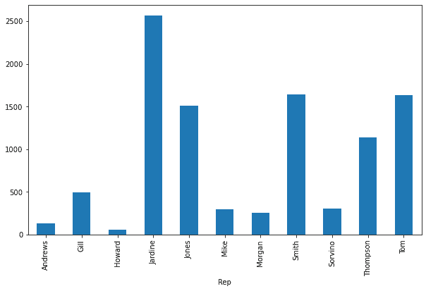
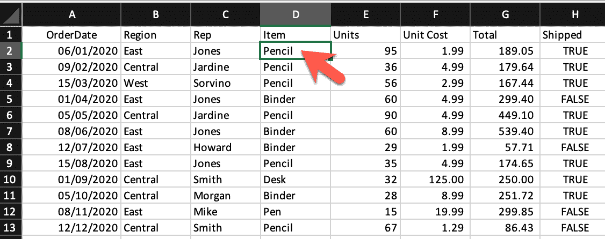

# 如何在 Python 中读取 Excel 文件(带有 21 个代码示例)

> 原文：<https://www.dataquest.io/blog/reading-excel-file-python/>

August 9, 2022

Microsoft Excel 是世界上最强大的电子表格软件应用程序之一，它已经成为所有业务流程中的关键。世界各地的公司，无论大小，都在使用 Microsoft Excel 来存储、组织、分析和可视化数据。

作为一名数据专业人员，当您将 Python 与 Excel 相结合时，您创建了一个独特的数据分析包，释放了企业数据的价值。

在本教程中，我们将学习如何在 Python 中读取和处理 Excel 文件。

完成本教程后，您将理解以下内容:

*   将 Excel 电子表格加载到 pandas 数据框架中
*   使用包含多个电子表格的 Excel 工作簿
*   组合多个电子表格
*   使用`xlrd`包读取 Excel 文件

在本教程中，我们假设你知道熊猫数据框架的基本原理。如果你不熟悉熊猫图书馆，你可能想试试我们的[熊猫和 NumPy 基础——data quest](https://www.dataquest.io/course/pandas-fundamentals/)。

让我们开始吧。

## 和熊猫一起阅读电子表格

从技术上讲，多个包允许我们在 Python 中处理 Excel 文件。然而，在本教程中，我们将使用 pandas 和`xlrd`库与 Excel 工作簿进行交互。本质上，您可以将 pandas 数据帧视为一个电子表格，其中的行和列存储在 Series 对象中。作为可迭代对象的系列的可遍历性允许我们容易地获取特定的数据。一旦我们将 Excel 工作簿加载到 pandas 数据框架中，我们就可以对数据执行任何类型的数据分析。

在我们进行下一步之前，让我们先下载下面的电子表格:

[销售数据 Excel 工作簿–xlsx 版本。](https://github.com/m-mehdi/tutorials/blob/3e0e61a477fc86ec6b742f3cfc1eb3ba205d62be/sales_data.xlsx)

Excel 工作簿由两张包含 2020 年和 2021 年文具销售数据的工作表组成。

* * *

**注**

虽然 Excel 电子表格可以包含公式，也支持格式，但 pandas 只将 Excel 电子表格作为平面文件导入，它不支持电子表格格式。

* * *

要将 Excel 电子表格导入 pandas 数据框架，首先，我们需要导入 pandas 包，然后使用`read_excel()`方法:

```
import pandas as pd
df = pd.read_excel('sales_data.xlsx')

display(df)
```

|  | 订单日期 | 地区 | 代表 | 项目 | 单位 | 单位成本 | 总数 | 装船 |
| --- | --- | --- | --- | --- | --- | --- | --- | --- |
| Zero | 2020-01-06 | 东方 | 琼斯 | 铅笔 | Ninety-five | One point nine nine | One hundred and eighty-nine point zero five | 真实的 |
| one | 2020-02-09 | 中心的 | 怡和 | 铅笔 | Thirty-six | Four point nine nine | One hundred and seventy-nine point six four | 真实的 |
| Two | 2020-03-15 | 西 | 索尔维诺 | 铅笔 | fifty-six | Two point nine nine | One hundred and sixty-seven point four four | 真实的 |
| three | 2020-04-01 | 东方 | 琼斯 | 粘合剂 | Sixty | Four point nine nine | Two hundred and ninety-nine point four | 错误的 |
| four | 2020-05-05 | 中心的 | 怡和 | 铅笔 | Ninety | Four point nine nine | Four hundred and forty-nine point one | 真实的 |
| five | 2020-06-08 | 东方 | 琼斯 | 粘合剂 | Sixty | Eight point nine nine | Five hundred and thirty-nine point four | 真实的 |
| six | 2020-07-12 | 东方 | 霍华德 | 粘合剂 | Twenty-nine | One point nine nine | Fifty-seven point seven one | 错误的 |
| seven | 2020-08-15 | 东方 | 琼斯 | 铅笔 | Thirty-five | Four point nine nine | One hundred and seventy-four point six five | 真实的 |
| eight | 2020-09-01 | 中心的 | 史密斯（姓氏） | 书桌 | Thirty-two | One hundred and twenty-five | Two hundred and fifty | 真实的 |
| nine | 2020-10-05 | 中心的 | 摩根 | 粘合剂 | Twenty-eight | Eight point nine nine | Two hundred and fifty-one point seven two | 真实的 |
| Ten | 2020-11-08 | 东方 | 迈克 | 笔 | Fifteen | Nineteen point nine nine | Two hundred and ninety-nine point eight five | 错误的 |
| Eleven | 2020-12-12 | 中心的 | 史密斯（姓氏） | 铅笔 | Sixty-seven | One point two nine | Eighty-six point four three | 错误的 |

如果只想将有限数量的行加载到 DataFrame 中，可以使用`nrows`参数指定行数:

```
df = pd.read_excel('sales_data.xlsx', nrows=5)
display(df)
```

|  | 订单日期 | 地区 | 代表 | 项目 | 单位 | 单位成本 | 总数 | 装船 |
| --- | --- | --- | --- | --- | --- | --- | --- | --- |
| Zero | 2020-01-06 | 东方 | 琼斯 | 铅笔 | Ninety-five | One point nine nine | One hundred and eighty-nine point zero five | 真实的 |
| one | 2020-02-09 | 中心的 | 怡和 | 铅笔 | Thirty-six | Four point nine nine | One hundred and seventy-nine point six four | 真实的 |
| Two | 2020-03-15 | 西 | 索尔维诺 | 铅笔 | fifty-six | Two point nine nine | One hundred and sixty-seven point four four | 真实的 |
| three | 2020-04-01 | 东方 | 琼斯 | 粘合剂 | Sixty | Four point nine nine | Two hundred and ninety-nine point four | 错误的 |
| four | 2020-05-05 | 中心的 | 怡和 | 铅笔 | Ninety | Four point nine nine | Four hundred and forty-nine point one | 真实的 |

通过`skiprows`参数可以从电子表格的开头跳过特定数量的行或跳过特定行的列表，如下所示:

```
df = pd.read_excel('sales_data.xlsx', skiprows=range(5))
display(df)
```

|  | 2020-05-05 00:00:00 | 中心的 | 怡和 | 铅笔 | Ninety | Four point nine nine | Four hundred and forty-nine point one | 真实的 |
| --- | --- | --- | --- | --- | --- | --- | --- | --- |
| Zero | 2020-06-08 | 东方 | 琼斯 | 粘合剂 | Sixty | Eight point nine nine | Five hundred and thirty-nine point four | 真实的 |
| one | 2020-07-12 | 东方 | 霍华德 | 粘合剂 | Twenty-nine | One point nine nine | Fifty-seven point seven one | 错误的 |
| Two | 2020-08-15 | 东方 | 琼斯 | 铅笔 | Thirty-five | Four point nine nine | One hundred and seventy-four point six five | 真实的 |
| three | 2020-09-01 | 中心的 | 史密斯（姓氏） | 书桌 | Thirty-two | One hundred and twenty-five | Two hundred and fifty | 真实的 |
| four | 2020-10-05 | 中心的 | 摩根 | 粘合剂 | Twenty-eight | Eight point nine nine | Two hundred and fifty-one point seven two | 真实的 |
| five | 2020-11-08 | 东方 | 迈克 | 笔 | Fifteen | Nineteen point nine nine | Two hundred and ninety-nine point eight five | 错误的 |
| six | 2020-12-12 | 中心的 | 史密斯（姓氏） | 铅笔 | Sixty-seven | One point two nine | Eighty-six point four three | 错误的 |

上面的代码跳过前五行，返回其余的数据。相反，下面的代码返回除具有上述索引的行之外的所有行:

```
df = pd.read_excel('sales_data.xlsx', skiprows=[1, 4,7,10])
display(df)
```

|  | 订单日期 | 地区 | 代表 | 项目 | 单位 | 单位成本 | 总数 | 装船 |
| --- | --- | --- | --- | --- | --- | --- | --- | --- |
| Zero | 2020-02-09 | 中心的 | 怡和 | 铅笔 | Thirty-six | Four point nine nine | One hundred and seventy-nine point six four | 真实的 |
| one | 2020-03-15 | 西 | 索尔维诺 | 铅笔 | fifty-six | Two point nine nine | One hundred and sixty-seven point four four | 真实的 |
| Two | 2020-05-05 | 中心的 | 怡和 | 铅笔 | Ninety | Four point nine nine | Four hundred and forty-nine point one | 真实的 |
| three | 2020-06-08 | 东方 | 琼斯 | 粘合剂 | Sixty | Eight point nine nine | Five hundred and thirty-nine point four | 真实的 |
| four | 2020-08-15 | 东方 | 琼斯 | 铅笔 | Thirty-five | Four point nine nine | One hundred and seventy-four point six five | 真实的 |
| five | 2020-09-01 | 中心的 | 史密斯（姓氏） | 书桌 | Thirty-two | One hundred and twenty-five | Two hundred and fifty | 真实的 |
| six | 2020-11-08 | 东方 | 迈克 | 笔 | Fifteen | Nineteen point nine nine | Two hundred and ninety-nine point eight five | 错误的 |
| seven | 2020-12-12 | 中心的 | 史密斯（姓氏） | 铅笔 | Sixty-seven | One point two nine | Eighty-six point four three | 错误的 |

另一个有用的参数是`usecols`，它允许我们选择带有字母、名称或位置数字的电子表格列。让我们看看它是如何工作的:

```
df = pd.read_excel('sales_data.xlsx', usecols='A:C,G')
display(df)
```

|  | 订单日期 | 地区 | 代表 | 总数 |
| --- | --- | --- | --- | --- |
| Zero | 2020-01-06 | 东方 | 琼斯 | One hundred and eighty-nine point zero five |
| one | 2020-02-09 | 中心的 | 怡和 | One hundred and seventy-nine point six four |
| Two | 2020-03-15 | 西 | 索尔维诺 | One hundred and sixty-seven point four four |
| three | 2020-04-01 | 东方 | 琼斯 | Two hundred and ninety-nine point four |
| four | 2020-05-05 | 中心的 | 怡和 | Four hundred and forty-nine point one |
| five | 2020-06-08 | 东方 | 琼斯 | Five hundred and thirty-nine point four |
| six | 2020-07-12 | 东方 | 霍华德 | Fifty-seven point seven one |
| seven | 2020-08-15 | 东方 | 琼斯 | One hundred and seventy-four point six five |
| eight | 2020-09-01 | 中心的 | 史密斯（姓氏） | Two hundred and fifty |
| nine | 2020-10-05 | 中心的 | 摩根 | Two hundred and fifty-one point seven two |
| Ten | 2020-11-08 | 东方 | 迈克 | Two hundred and ninety-nine point eight five |
| Eleven | 2020-12-12 | 中心的 | 史密斯（姓氏） | Eighty-six point four three |

在上面的代码中，分配给参数`usecols`的字符串包含一系列列，其中`:`加上由逗号分隔的列 G。此外，我们能够提供一个列名列表，并将其分配给`usecols`参数，如下所示:

```
df = pd.read_excel('sales_data.xlsx', usecols=['OrderDate', 'Region', 'Rep', 'Total'])
display(df)
```

|  | 订单日期 | 地区 | 代表 | 总数 |
| --- | --- | --- | --- | --- |
| Zero | 2020-01-06 | 东方 | 琼斯 | One hundred and eighty-nine point zero five |
| one | 2020-02-09 | 中心的 | 怡和 | One hundred and seventy-nine point six four |
| Two | 2020-03-15 | 西 | 索尔维诺 | One hundred and sixty-seven point four four |
| three | 2020-04-01 | 东方 | 琼斯 | Two hundred and ninety-nine point four |
| four | 2020-05-05 | 中心的 | 怡和 | Four hundred and forty-nine point one |
| five | 2020-06-08 | 东方 | 琼斯 | Five hundred and thirty-nine point four |
| six | 2020-07-12 | 东方 | 霍华德 | Fifty-seven point seven one |
| seven | 2020-08-15 | 东方 | 琼斯 | One hundred and seventy-four point six five |
| eight | 2020-09-01 | 中心的 | 史密斯（姓氏） | Two hundred and fifty |
| nine | 2020-10-05 | 中心的 | 摩根 | Two hundred and fifty-one point seven two |
| Ten | 2020-11-08 | 东方 | 迈克 | Two hundred and ninety-nine point eight five |
| Eleven | 2020-12-12 | 中心的 | 史密斯（姓氏） | Eighty-six point four three |

`usecols`参数也接受列号列表。以下代码显示了我们如何使用特定列的索引来选取它们:

```
df = pd.read_excel('sales_data.xlsx', usecols=[0, 1, 2, 6])
display(df)
```

|  | 订单日期 | 地区 | 代表 | 总数 |
| --- | --- | --- | --- | --- |
| Zero | 2020-01-06 | 东方 | 琼斯 | One hundred and eighty-nine point zero five |
| one | 2020-02-09 | 中心的 | 怡和 | One hundred and seventy-nine point six four |
| Two | 2020-03-15 | 西 | 索尔维诺 | One hundred and sixty-seven point four four |
| three | 2020-04-01 | 东方 | 琼斯 | Two hundred and ninety-nine point four |
| four | 2020-05-05 | 中心的 | 怡和 | Four hundred and forty-nine point one |
| five | 2020-06-08 | 东方 | 琼斯 | Five hundred and thirty-nine point four |
| six | 2020-07-12 | 东方 | 霍华德 | Fifty-seven point seven one |
| seven | 2020-08-15 | 东方 | 琼斯 | One hundred and seventy-four point six five |
| eight | 2020-09-01 | 中心的 | 史密斯（姓氏） | Two hundred and fifty |
| nine | 2020-10-05 | 中心的 | 摩根 | Two hundred and fifty-one point seven two |
| Ten | 2020-11-08 | 东方 | 迈克 | Two hundred and ninety-nine point eight five |
| Eleven | 2020-12-12 | 中心的 | 史密斯（姓氏） | Eighty-six point four three |

### 使用多个电子表格

Excel 文件或工作簿通常包含多个电子表格。pandas 库允许我们从特定的工作表中加载数据，或者将多个电子表格合并成一个数据帧。在本节中，我们将探索如何使用这些有价值的功能。

默认情况下，`read_excel()`方法读取索引为`0`的第一个 Excel 工作表。然而，我们可以通过给`sheet_name`参数指定一个特定的工作表名称、工作表索引，甚至是工作表名称或索引的列表来选择其他工作表。让我们来试试:

```
df = pd.read_excel('sales_data.xlsx', sheet_name='2021')
display(df)
```

|  | 订单日期 | 地区 | 代表 | 项目 | 单位 | 单位成本 | 总数 | 装船 |
| --- | --- | --- | --- | --- | --- | --- | --- | --- |
| Zero | 2021-01-15 | 中心的 | 吉尔 | 粘合剂 | Forty-six | Eight point nine nine | Four hundred and thirteen point five four | 真实的 |
| one | 2021-02-01 | 中心的 | 史密斯（姓氏） | 粘合剂 | Eighty-seven | Fifteen | One thousand three hundred and five | 真实的 |
| Two | 2021-03-07 | 西 | 索尔维诺 | 粘合剂 | Twenty-seven | Nineteen point nine nine | One hundred and thirty-nine point nine three | 真实的 |
| three | 2021-04-10 | 中心的 | 安德鲁斯 | 铅笔 | Sixty-six | One point nine nine | One hundred and thirty-one point three four | 错误的 |
| four | 2021-05-14 | 中心的 | 吉尔 | 铅笔 | Fifty-three | One point two nine | Sixty-eight point three seven | 错误的 |
| five | 2021-06-17 | 中心的 | 汤姆(男子名) | 书桌 | Fifteen | One hundred and twenty-five | Six hundred and twenty-five | 真实的 |
| six | 2021-07-04 | 东方 | 琼斯 | 钢笔套装 | Sixty-two | Four point nine nine | Three hundred and nine point three eight | 真实的 |
| seven | 2021-08-07 | 中心的 | 汤姆(男子名) | 钢笔套装 | forty-two | Twenty-three point nine five | One thousand and five point nine | 真实的 |
| eight | 2021-09-10 | 中心的 | 吉尔 | 铅笔 | Forty-seven | One point two nine | Nine point zero three | 真实的 |
| nine | 2021-10-14 | 西 | 汤普森 | 粘合剂 | Fifty-seven | Nineteen point nine nine | One thousand one hundred and thirty-nine point four three | 错误的 |
| Ten | 2021-11-17 | 中心的 | 怡和 | 粘合剂 | Eleven | Four point nine nine | Fifty-four point eight nine | 错误的 |
| Eleven | 2021-12-04 | 中心的 | 怡和 | 粘合剂 | Ninety-four | Nineteen point nine nine | One thousand eight hundred and seventy-nine point zero six | 错误的 |

上面的代码读取工作簿中的第二个电子表格，其名称是`2021`。如前所述，我们还可以给`sheet_name`参数分配一个工作表位置号(零索引)。让我们看看它是如何工作的:

```
df = pd.read_excel('sales_data.xlsx', sheet_name=1)
display(df)
```

|  | 订单日期 | 地区 | 代表 | 项目 | 单位 | 单位成本 | 总数 | 装船 |
| --- | --- | --- | --- | --- | --- | --- | --- | --- |
| Zero | 2021-01-15 | 中心的 | 吉尔 | 粘合剂 | Forty-six | Eight point nine nine | Four hundred and thirteen point five four | 真实的 |
| one | 2021-02-01 | 中心的 | 史密斯（姓氏） | 粘合剂 | Eighty-seven | Fifteen | One thousand three hundred and five | 真实的 |
| Two | 2021-03-07 | 西 | 索尔维诺 | 粘合剂 | Twenty-seven | Nineteen point nine nine | One hundred and thirty-nine point nine three | 真实的 |
| three | 2021-04-10 | 中心的 | 安德鲁斯 | 铅笔 | Sixty-six | One point nine nine | One hundred and thirty-one point three four | 错误的 |
| four | 2021-05-14 | 中心的 | 吉尔 | 铅笔 | Fifty-three | One point two nine | Sixty-eight point three seven | 错误的 |
| five | 2021-06-17 | 中心的 | 汤姆(男子名) | 书桌 | Fifteen | One hundred and twenty-five | Six hundred and twenty-five | 真实的 |
| six | 2021-07-04 | 东方 | 琼斯 | 钢笔套装 | Sixty-two | Four point nine nine | Three hundred and nine point three eight | 真实的 |
| seven | 2021-08-07 | 中心的 | 汤姆(男子名) | 钢笔套装 | forty-two | Twenty-three point nine five | One thousand and five point nine | 真实的 |
| eight | 2021-09-10 | 中心的 | 吉尔 | 铅笔 | Forty-seven | One point two nine | Nine point zero three | 真实的 |
| nine | 2021-10-14 | 西 | 汤普森 | 粘合剂 | Fifty-seven | Nineteen point nine nine | One thousand one hundred and thirty-nine point four three | 错误的 |
| Ten | 2021-11-17 | 中心的 | 怡和 | 粘合剂 | Eleven | Four point nine nine | Fifty-four point eight nine | 错误的 |
| Eleven | 2021-12-04 | 中心的 | 怡和 | 粘合剂 | Ninety-four | Nineteen point nine nine | One thousand eight hundred and seventy-nine point zero six | 错误的 |

如您所见，这两条语句要么接受实际的工作表名称，要么接受工作表索引，以返回相同的结果。

有时，我们希望将存储在 Excel 文件中的所有电子表格同时导入到 pandas 数据框架中。好消息是`read_excel()`方法为我们提供了这个特性。为了做到这一点，我们可以给参数`sheet_name`分配一个工作表名称列表或它们的索引。但是有一个简单得多的方法可以做到这一点:将`None`赋给`sheet_name`参数。让我们来试试:

```
all_sheets = pd.read_excel('sales_data.xlsx', sheet_name=None)
```

在探索存储在`all_sheets`变量中的数据之前，让我们检查一下它的数据类型:

```
type(all_sheets)
```

```
dict
```

如您所见，该变量是一个字典。现在，让我们来揭示这本字典里储存了什么:

```
for key, value in all_sheets.items():
    print(key, type(value))
```

```
2020 <class 'pandas.core.frame.DataFrame'>
2021 <class 'pandas.core.frame.DataFrame'>
```

上面的代码显示字典的键是 Excel 工作簿的工作表名称，它的值是每个电子表格的 pandas DataFrames。要打印出字典的内容，我们可以使用下面的代码:

```
for key, value in all_sheets.items():
    print(key)
    display(value)
```

```
2020
```

|  | 订单日期 | 地区 | 代表 | 项目 | 单位 | 单位成本 | 总数 | 装船 |
| --- | --- | --- | --- | --- | --- | --- | --- | --- |
| Zero | 2020-01-06 | 东方 | 琼斯 | 铅笔 | Ninety-five | One point nine nine | One hundred and eighty-nine point zero five | 真实的 |
| one | 2020-02-09 | 中心的 | 怡和 | 铅笔 | Thirty-six | Four point nine nine | One hundred and seventy-nine point six four | 真实的 |
| Two | 2020-03-15 | 西 | 索尔维诺 | 铅笔 | fifty-six | Two point nine nine | One hundred and sixty-seven point four four | 真实的 |
| three | 2020-04-01 | 东方 | 琼斯 | 粘合剂 | Sixty | Four point nine nine | Two hundred and ninety-nine point four | 错误的 |
| four | 2020-05-05 | 中心的 | 怡和 | 铅笔 | Ninety | Four point nine nine | Four hundred and forty-nine point one | 真实的 |
| five | 2020-06-08 | 东方 | 琼斯 | 粘合剂 | Sixty | Eight point nine nine | Five hundred and thirty-nine point four | 真实的 |
| six | 2020-07-12 | 东方 | 霍华德 | 粘合剂 | Twenty-nine | One point nine nine | Fifty-seven point seven one | 错误的 |
| seven | 2020-08-15 | 东方 | 琼斯 | 铅笔 | Thirty-five | Four point nine nine | One hundred and seventy-four point six five | 真实的 |
| eight | 2020-09-01 | 中心的 | 史密斯（姓氏） | 书桌 | Thirty-two | One hundred and twenty-five | Two hundred and fifty | 真实的 |
| nine | 2020-10-05 | 中心的 | 摩根 | 粘合剂 | Twenty-eight | Eight point nine nine | Two hundred and fifty-one point seven two | 真实的 |
| Ten | 2020-11-08 | 东方 | 迈克 | 笔 | Fifteen | Nineteen point nine nine | Two hundred and ninety-nine point eight five | 错误的 |
| Eleven | 2020-12-12 | 中心的 | 史密斯（姓氏） | 铅笔 | Sixty-seven | One point two nine | Eighty-six point four three | 错误的 |

```
2021
```

|  | 订单日期 | 地区 | 代表 | 项目 | 单位 | 单位成本 | 总数 | 装船 |
| --- | --- | --- | --- | --- | --- | --- | --- | --- |
| Zero | 2021-01-15 | 中心的 | 吉尔 | 粘合剂 | Forty-six | Eight point nine nine | Four hundred and thirteen point five four | 真实的 |
| one | 2021-02-01 | 中心的 | 史密斯（姓氏） | 粘合剂 | Eighty-seven | Fifteen | One thousand three hundred and five | 真实的 |
| Two | 2021-03-07 | 西 | 索尔维诺 | 粘合剂 | Twenty-seven | Nineteen point nine nine | One hundred and thirty-nine point nine three | 真实的 |
| three | 2021-04-10 | 中心的 | 安德鲁斯 | 铅笔 | Sixty-six | One point nine nine | One hundred and thirty-one point three four | 错误的 |
| four | 2021-05-14 | 中心的 | 吉尔 | 铅笔 | Fifty-three | One point two nine | Sixty-eight point three seven | 错误的 |
| five | 2021-06-17 | 中心的 | 汤姆(男子名) | 书桌 | Fifteen | One hundred and twenty-five | Six hundred and twenty-five | 真实的 |
| six | 2021-07-04 | 东方 | 琼斯 | 钢笔套装 | Sixty-two | Four point nine nine | Three hundred and nine point three eight | 真实的 |
| seven | 2021-08-07 | 中心的 | 汤姆(男子名) | 钢笔套装 | forty-two | Twenty-three point nine five | One thousand and five point nine | 真实的 |
| eight | 2021-09-10 | 中心的 | 吉尔 | 铅笔 | Forty-seven | One point two nine | Nine point zero three | 真实的 |
| nine | 2021-10-14 | 西 | 汤普森 | 粘合剂 | Fifty-seven | Nineteen point nine nine | One thousand one hundred and thirty-nine point four three | 错误的 |
| Ten | 2021-11-17 | 中心的 | 怡和 | 粘合剂 | Eleven | Four point nine nine | Fifty-four point eight nine | 错误的 |
| Eleven | 2021-12-04 | 中心的 | 怡和 | 粘合剂 | Ninety-four | Nineteen point nine nine | One thousand eight hundred and seventy-nine point zero six | 错误的 |

### 将多个 Excel 电子表格合并成一个 Pandas 数据框架

每张表有一个数据帧，允许我们在不同的表中有不同的列或内容。

但是，如果我们更喜欢将所有电子表格的数据存储在一个数据帧中呢？在本教程中，工作簿电子表格具有相同的列，因此我们可以将它们与 pandas 的`concat()`方法结合起来。

如果运行下面的代码，您会看到存储在字典中的两个数据帧被连接起来:

```
combined_df = pd.concat(all_sheets.values(), ignore_index=True)
display(combined_df)
```

|  | 订单日期 | 地区 | 代表 | 项目 | 单位 | 单位成本 | 总数 | 装船 |
| --- | --- | --- | --- | --- | --- | --- | --- | --- |
| Zero | 2020-01-06 | 东方 | 琼斯 | 铅笔 | Ninety-five | One point nine nine | One hundred and eighty-nine point zero five | 真实的 |
| one | 2020-02-09 | 中心的 | 怡和 | 铅笔 | Thirty-six | Four point nine nine | One hundred and seventy-nine point six four | 真实的 |
| Two | 2020-03-15 | 西 | 索尔维诺 | 铅笔 | fifty-six | Two point nine nine | One hundred and sixty-seven point four four | 真实的 |
| three | 2020-04-01 | 东方 | 琼斯 | 粘合剂 | Sixty | Four point nine nine | Two hundred and ninety-nine point four | 错误的 |
| four | 2020-05-05 | 中心的 | 怡和 | 铅笔 | Ninety | Four point nine nine | Four hundred and forty-nine point one | 真实的 |
| five | 2020-06-08 | 东方 | 琼斯 | 粘合剂 | Sixty | Eight point nine nine | Five hundred and thirty-nine point four | 真实的 |
| six | 2020-07-12 | 东方 | 霍华德 | 粘合剂 | Twenty-nine | One point nine nine | Fifty-seven point seven one | 错误的 |
| seven | 2020-08-15 | 东方 | 琼斯 | 铅笔 | Thirty-five | Four point nine nine | One hundred and seventy-four point six five | 真实的 |
| eight | 2020-09-01 | 中心的 | 史密斯（姓氏） | 书桌 | Thirty-two | One hundred and twenty-five | Two hundred and fifty | 真实的 |
| nine | 2020-10-05 | 中心的 | 摩根 | 粘合剂 | Twenty-eight | Eight point nine nine | Two hundred and fifty-one point seven two | 真实的 |
| Ten | 2020-11-08 | 东方 | 迈克 | 笔 | Fifteen | Nineteen point nine nine | Two hundred and ninety-nine point eight five | 错误的 |
| Eleven | 2020-12-12 | 中心的 | 史密斯（姓氏） | 铅笔 | Sixty-seven | One point two nine | Eighty-six point four three | 错误的 |
| Twelve | 2021-01-15 | 中心的 | 吉尔 | 粘合剂 | Forty-six | Eight point nine nine | Four hundred and thirteen point five four | 真实的 |
| Thirteen | 2021-02-01 | 中心的 | 史密斯（姓氏） | 粘合剂 | Eighty-seven | Fifteen | One thousand three hundred and five | 真实的 |
| Fourteen | 2021-03-07 | 西 | 索尔维诺 | 粘合剂 | Twenty-seven | Nineteen point nine nine | One hundred and thirty-nine point nine three | 真实的 |
| Fifteen | 2021-04-10 | 中心的 | 安德鲁斯 | 铅笔 | Sixty-six | One point nine nine | One hundred and thirty-one point three four | 错误的 |
| Sixteen | 2021-05-14 | 中心的 | 吉尔 | 铅笔 | Fifty-three | One point two nine | Sixty-eight point three seven | 错误的 |
| Seventeen | 2021-06-17 | 中心的 | 汤姆(男子名) | 书桌 | Fifteen | One hundred and twenty-five | Six hundred and twenty-five | 真实的 |
| Eighteen | 2021-07-04 | 东方 | 琼斯 | 钢笔套装 | Sixty-two | Four point nine nine | Three hundred and nine point three eight | 真实的 |
| Nineteen | 2021-08-07 | 中心的 | 汤姆(男子名) | 钢笔套装 | forty-two | Twenty-three point nine five | One thousand and five point nine | 真实的 |
| Twenty | 2021-09-10 | 中心的 | 吉尔 | 铅笔 | Forty-seven | One point two nine | Nine point zero three | 真实的 |
| Twenty-one | 2021-10-14 | 西 | 汤普森 | 粘合剂 | Fifty-seven | Nineteen point nine nine | One thousand one hundred and thirty-nine point four three | 错误的 |
| Twenty-two | 2021-11-17 | 中心的 | 怡和 | 粘合剂 | Eleven | Four point nine nine | Fifty-four point eight nine | 错误的 |
| Twenty-three | 2021-12-04 | 中心的 | 怡和 | 粘合剂 | Ninety-four | Nineteen point nine nine | One thousand eight hundred and seventy-nine point zero six | 错误的 |

现在存储在`combined_df`数据帧中的数据已准备好进一步处理或可视化。在下面这段代码中，我们将创建一个简单的条形图，显示每个代表的总销售额。让我们运行它，看看输出图:

```
total_sales_amount = combined_df.groupby('Rep').Total.sum()
total_sales_amount.plot.bar(figsize=(10, 6))
```

```
<xlabel>
```



## 使用`xlrd`读取 Excel 文件

尽管将数据导入 pandas DataFrame 要常见得多，但另一个用 Python 读取 Excel 文件的有用包是`xlrd`。在这一节中，我们将简单介绍如何使用这个包读取 Excel 电子表格。

* * *

**注**

由于潜在的安全漏洞，xlrd 包不支持 xlsx 文件。所以，我们使用`xls`版本的销售数据。您可以从下面的链接下载`xls`版本:
[销售数据 Excel 工作簿–xls ver。](https://github.com/m-mehdi/tutorials/blob/3e0e61a477fc86ec6b742f3cfc1eb3ba205d62be/sales_data.xls)

* * *

让我们看看它是如何工作的:

```
import xlrd
excel_workbook = xlrd.open_workbook('sales_data.xls')
```

上面，第一行导入了`xlrd`包，然后`open_workbook`方法读取了`sales_data.xls`文件。

我们也可以打开包含实际数据的单个工作表。有两种方法可以做到这一点:按索引或按名称打开工作表。让我们按索引打开第一个工作表，按名称打开第二个工作表:

```
excel_worksheet_2020 = excel_workbook.sheet_by_index(0)
excel_worksheet_2021 = excel_workbook.sheet_by_name('2021')
```

现在，让我们看看如何打印一个单元格的值。`xlrd`包提供了一个名为`cell_value()`的方法，它接受两个参数:单元格的行索引和列索引。让我们来探索一下:

```
print(excel_worksheet_2020.cell_value(1, 3))
```

```
Pencil
```

我们可以看到,`cell_value`函数返回了位于行索引 1(第 2 行)和列索引 3(第 4 列)的单元格的值。


`xlrd`包提供了两个有用的属性:`nrows`和`ncols`，分别返回非空电子表格的行数和列数:

```
print('Columns#:', excel_worksheet_2020.ncols)
print('Rows#:', excel_worksheet_2020.nrows)
```

```
Columns#: 8
Rows#: 13
```

知道电子表格中非空行和列的数量有助于我们使用嵌套的`for`循环来迭代数据。这使得所有的 Excel 表格数据都可以通过`cell_value()`方法访问。

## 结论

本教程讨论了如何将 Excel 电子表格加载到 pandas 数据框架中，如何处理多个 Excel 表格，以及如何将它们合并到一个 pandas 数据框架中。我们还探索了作为访问 Excel 电子表格数据的最简单工具之一的`xlrd`包的主要方面。