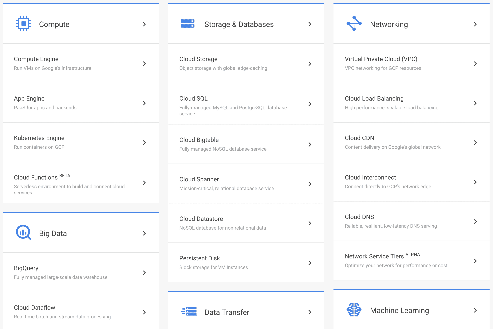
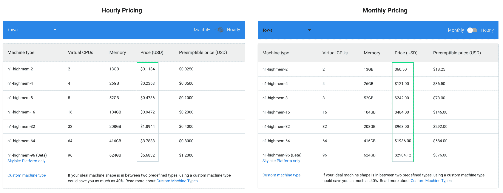
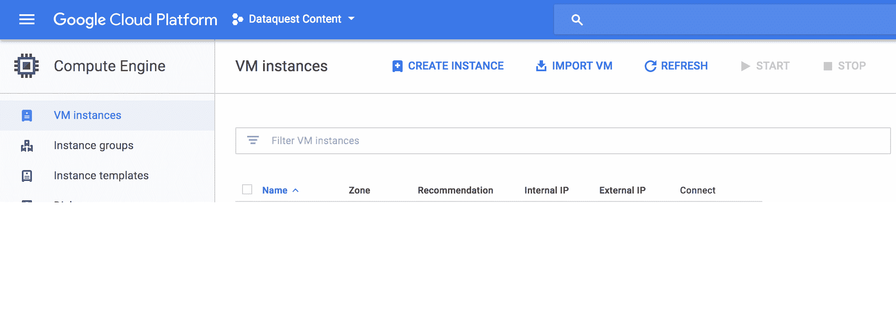
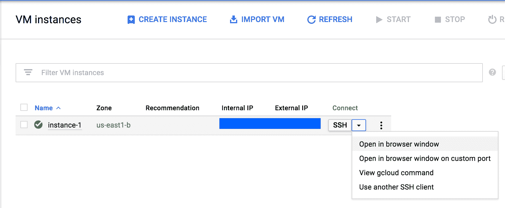
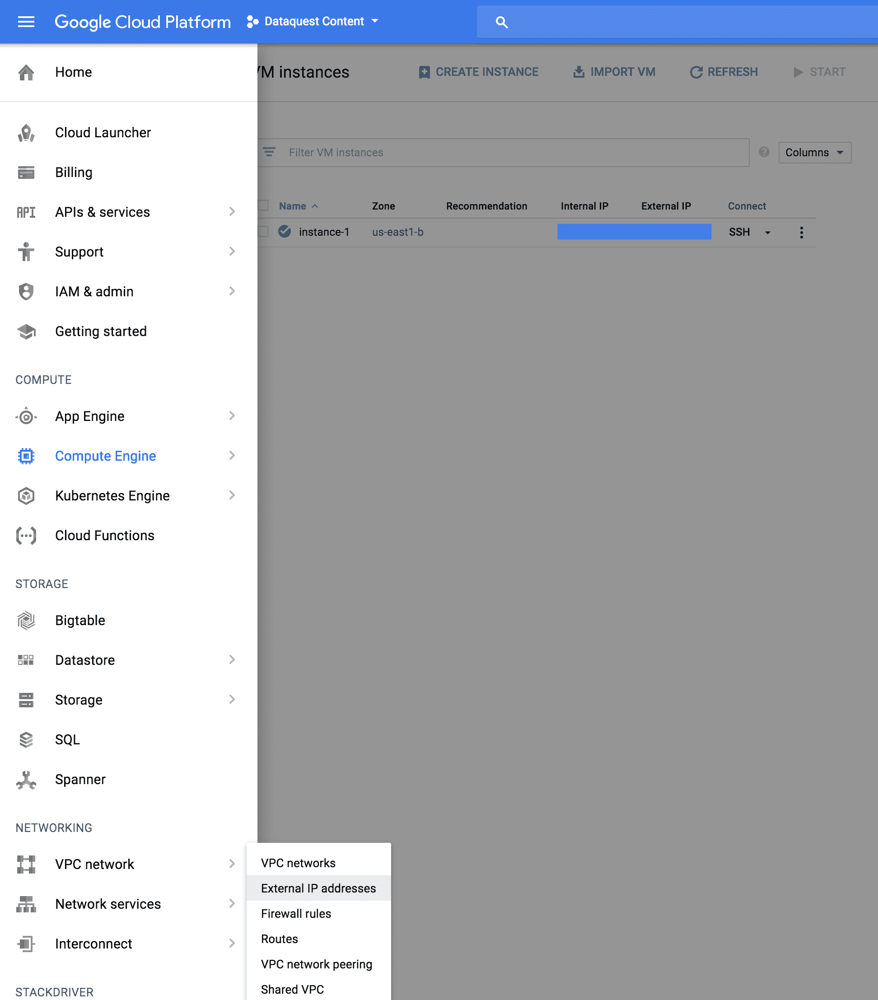
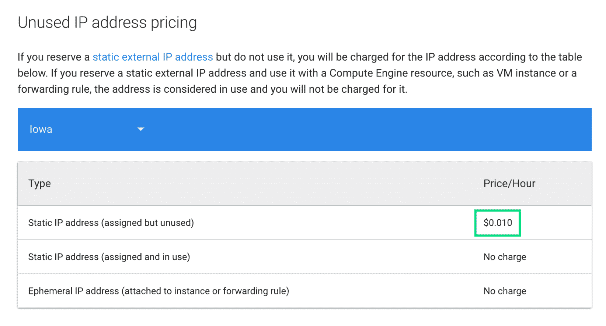
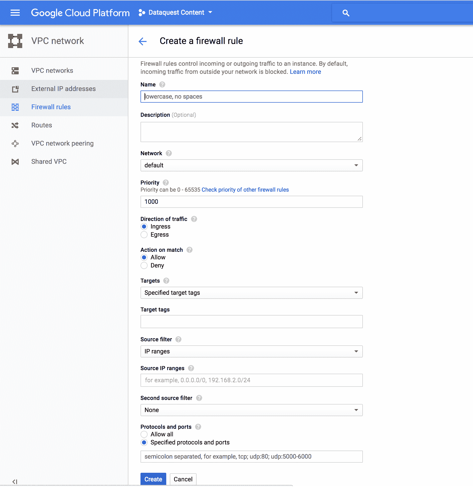
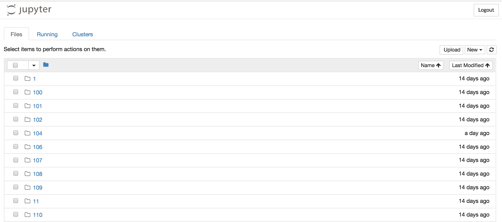

# 如何在谷歌云上建立一个免费的数据科学环境

> 原文：<https://www.dataquest.io/blog/setting-up-a-free-data-science-environment-on-google-cloud/>

January 4, 2018Whether you’re running out of memory on your local machine or simply want your code to run faster on a more powerful machine, there are many benefits to doing data science on a cloud server. A cloud server is really just a computer, like the one you’re using now, that’s located elsewhere.

在本帖中，我们将介绍如何在[谷歌云平台](https://cloud.google.com/) (GCP)上建立数据科学环境。谷歌购买数十万台个人电脑，使用定制软件在位于世界各地的数据中心管理它们，并提供这些电脑供出租。由于云托管公司提供的规模经济，个人或团队可以负担得起按需访问具有大量 CPU 和内存的强大计算机。

### 为什么用 GCP？

当从笔记本电脑/台式机环境迁移到云数据科学环境时，重要的是要考虑什么标准对您最重要。例如，为了在熊猫身上处理更大的数据集，拥有大量的内存是很重要的。为了使用 Spark 处理大型数据集，我们需要租用一个由许多计算机组成的池，这些计算机具有大量的总内存来分担负载。

像[其他](https://aws.amazon.com/products/) [云](https://azure.microsoft.com/en-us/services/) [提供商](https://www.digitalocean.com/products/)一样，GCP 包含许多不同的[产品和服务](https://cloud.google.com/products/)。



为了能够自由地安装我们想要的任何库或工具，我们需要访问 GCP 上的一台虚拟计算机。这被称为虚拟机**实例**。租用虚拟机实例并不能让我们获得自己的专用计算机(云提供商对租用专用计算机收取更高的费用)，而是只能获得我们想要的 CPU 和内存:


谷歌计算引擎(GCE)为高内存实例提供了合理的价格。下面是 2017 年 12 月定价的截图:



虽然这个价格乍一看似乎很高，但 GCP 有 12 个月的试用期，每个月可以用 300 美元的信用购买 GCP 的产品和服务。你可以在这里了解更多并报名[。](https://cloud.google.com/free/)

这意味着你可以租一台 52g 内存的服务器，并持续运行一整月。因为租赁费用是按每分钟计算的，所以您可以在短时间内(几个小时)为特定任务租赁一台更强大的服务器(内存为 256)。

这种灵活性非常强大，使您能够执行大型计算工作流，而无需自己购买和管理硬件。

### 启动 GCE 实例

导航到[虚拟机实例页面](https://console.cloud.google.com/projectselector/compute/instances)。您将被要求使用您的 Google 凭据登录并创建一个项目。完成后，您将进入虚拟机实例页面:



要创建新的虚拟实例，请单击**创建实例**。您将进入一个页面，在该页面中您可以自定义要租赁的实例的不同属性:

*   命名你的实例。我们只是使用了默认名称。
*   `Zone`:您的服务器位于哪个[地理区域](https://cloud.google.com/compute/docs/regions-zones/)。我们使用了`us-east1-b`,但是您可以自由选择一个离您居住或工作的地方更近的实例。
*   你想租一台多强大的机器。回想一下，你可以从[本页](https://cloud.google.com/compute/pricing)中了解不同的机器类型。在你每月的预算内选择一个！
*   `Boot Disk`:您希望虚拟实例引导时使用的操作系统。我们用的是`Ubuntu 16.04 LTS`，这是一个流行的 Linux 版本。
*   `Firewall`:应该允许哪些互联网流量进入。保留默认设置。

准备好之后，点击**创建**。

### 设置数据科学环境

在您启动了 Google 计算引擎实例之后，您实际上可以从 Google 计算引擎页面启动控制台*:*



我们将使用该控制台来设置数据科学环境的其余部分。如果你不熟悉命令行，我鼓励你去看看我们的[命令行:初级](https://www.dataquest.io/course/command-line-beginner)和[命令行:中级](https://www.dataquest.io/course/command-line-intermediate)课程。

首先，让我们安装[蟒蛇](https://conda.io/projects/conda/en/latest/user-guide/tasks/manage-pkgs.html)。从命令行，使用`curl`下载二进制安装文件的最简单方法。unix 工具 [curl](https://curl.haxx.se/docs/manpage.html#URL) 从指定的 url 下载文件，并使用`-O`标志写入文件(而不是立即显示下载的内容):

```py
curl -O https://repo.continuum.io/archive/Anaconda3-5.0.1-Linux-x86_64.sh
```

下载完成后，您可以使用`bash`开始设置过程:

```py
bash Anaconda3-5.0.1-Linux-x86_64.sh
```

有些时候你需要输入`yes`来接受许可。一旦安装完成，您需要将`conda`程序添加到您的[路径](https://kb.iu.edu/d/acar)中。该路径允许您指定希望操作系统在哪些目录中搜索程序。

现在我们已经安装了 anaconda，我们可以创建一个新的 [anaconda 环境](https://conda.io/docs/user-guide/tasks/manage-environments.html)。我们在 Dataquest 教授使用 Python 3.5，所以我们在这里也将使用该版本:

```py
conda create --name ds python=3.5
```

当您创建一个环境时，Anaconda 会为您安装许多流行的数据科学库(如`numpy`和`jupyter notebook`)。安装过程完成后，您可以像这样激活您的环境:

```py
source activate ds
```

### 暴露朱庇特笔记本

现在，我们在这个实例中运行的 Jupyter 笔记本服务器不能从本地计算机通过 web 浏览器访问。为了理解为什么，让我们想想当我们在自己的计算机上本地运行 Jupyter Notebook 时会发生什么——只有我们的本地计算机才能通过 web 浏览器访问 Jupyter Notebook 服务器(通常在`localhost:8888`)。

然而，如果我们的 wifi(或以太网)网络上的其他人知道我们的 IP 地址*和*我们正在哪个端口运行 Jupyter Notebook(同样，通常在`8888`)，他们可以通过导航到`https://OUR_IP_ADDRESS:8888`通过网络浏览器访问它。

通过做两个主要的调整，我们也可以为我们的云实例复制这种访问能力。默认情况下，我们的云实例的防火墙设置为阻止网络访问。此外，大多数云提供商经常更改我们实例的 IP 地址(真的，只要他们愿意！).这意味着如果我们实例的当前 IP 地址是`35.227.18.17`，我们不能指望它在几分钟内保持不变。

但是，我们可以将动态 IP 地址更改为静态 IP 地址。

### 设置静态 IP 地址

要将我们实例的 IP 地址更改为静态地址，请导航到左侧 Google 云平台菜单中的`Networking > VPC network > External IP addresses`。



也可以在[这个网址](https://console.cloud.google.com/networking/addresses)直接跳转到页面。

请注意，如果您申请了一个静态 IP 地址，但没有与该静态 IP 地址相关联的正在运行的机器，Google 会收取少量费用。在爱荷华州地区，2017 年 12 月，这一成本为每小时 1 美分，如下图所示:



您可以通过导航到 [GCE 定价页面](https://cloud.google.com/compute/pricing)并向下滚动到**未使用 IP 地址定价**来了解更多关于未使用静态 IP 定价的信息。

### 添加防火墙例外

现在我们有了一个静态 IP 地址，我们的本地计算机可以与我们的云实例对话。不幸的是，大多数云提供商都有防火墙来禁止对大多数端口的接入。幸运的是，我们可以为 Jupyter 笔记本服务器用来接受传入请求的端口`8000`手动添加一个例外。

现在，让我们自定义防火墙规则，以便传入的网络数据包可以通过特定端口访问我们的服务器。导航到[防火墙规则](https://console.cloud.google.com/networking/firewalls)页面，点击**创建防火墙规则**:



在出现的页面上，填写以下字段:

*   `Name`:为此防火墙规则添加一个名称
*   `Source IP ranges`:0 . 0 . 0 . 0/0
*   `Allowed protocols and ports` : **tcp:8000**

最后，我们需要配置 Jupyter Notebook 来使用我们之前为防火墙指定的 TCP 端口。

### 配置 jupiter 笔记本监听的端口

运行此命令以生成配置文件。

```py
jupyter notebook --generate-config
```

现在我们已经设置好了一切，让我们使用以下标志启动 Jupyter 笔记本:

```py
jupyter notebook --no-browser --port=8000
```

在您的本地计算机上，导航到 URL `https://YOUR_STATIC_IP_ADDRESS:8000`，您将看到欢迎 Jupyter 笔记本登录页面！



您甚至可以使用**上传**按钮将文件直接上传到您的 cloud Jupyter 笔记本中。

### 后续步骤

恭喜你！您刚刚在 Google Cloud 上设置了您的第一个环境！以下是您可能需要考虑的一些后续步骤:

*   [设置从本地计算机到云实例的 SSH 访问](https://cloud.google.com/compute/docs/instances/adding-removing-ssh-keys)
*   [设置远程桌面](https://www.youtube.com/watch?v=sT9JUL7q2uM)以便您可以使用图形用户界面(GUI)与实例的操作系统进行交互
*   阅读更多关于 GCP 提供的其他数据科学产品的信息