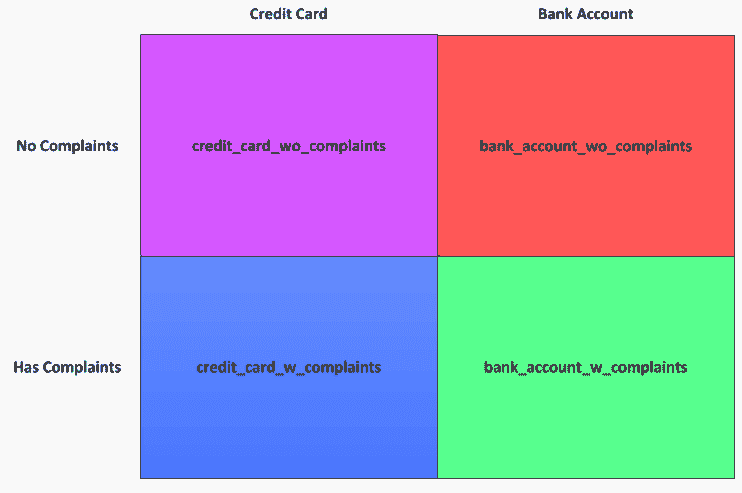

# SQL Intermediate: PostgreSQL、子查询等等！

> 原文：<https://www.dataquest.io/blog/sql-intermediate/>

August 10, 2017

如果您正处于学习 SQL 的初级阶段，并且已经完成了一门或多门初级课程，那么您可能已经学习了大部分基础知识，甚至可能还学习了一些高级数据库概念。当您准备开始学习 SQL 的下一阶段时，重要的是不仅要理解 SQL 本身，还要理解使这一切成为可能的引擎:数据库。


在大多数入门课程中，您通常会使用某种嵌入式数据库(例如 SQLite)。

嵌入式数据库对于初学者来说是一个很好的选择，这样他们就可以专注于学习 SQL，而没有分配额外计算资源和减少安装配置软件时间的负担。但是，随着您的应用程序和/或数据的需求开始扩大，您可能需要更强大的解决方案。

概括地说，有两种主要类型的数据库:基于服务器的和基于文件的(也称为嵌入式)。

最流行的基于文件的数据库之一是 SQLite。它非常适合小规模的应用程序，但是随着您的需求变得越来越复杂，它会有很多限制。例如，它基于一个限制在 140 兆字节的大型二进制文件。

如果你认为这比你需要的任何东西都大(至少在不久的将来)，你可能是对的。然而，许多文件系统将文件的最大大小限制为远远小于这个值。因此，如果你想开发一个大规模的 web 应用程序，这是不可行的。

此外，除其他外，还有安全问题。基于服务器的数据库为更大、更健壮的应用程序提供了关键功能，如高可用性/故障转移、更高且更灵活的安全性、可伸缩性、更高的性能等等。

今天，我们将使用 PostgreSQL (postgres)对来自消费者金融保护局(CFPB)的两个数据集进行数据发现和分析。这些数据包括消费者对两种金融服务的投诉:银行账户和信用卡。

### 通过*做*来学习 SQL

使用我们的交互式学习平台，立即动手操作 SQL。

*   编写真正的查询
*   使用真实数据
*   就在你的浏览器里！

[Sign up go!](https://app.dataquest.io/signup)

*(开始免费)*

首先，我们将通过创建表、创建用户和从 CSV 文件加载数据来设置您的数据库。接下来，我们将深入探讨更高级的 SQL 概念，同时分析数据并发现有价值的见解！下面是我们今天要讲的一些 SQL 概念。

*   创建用户、数据库和表，
*   `IS NULL` / `IS NOT NULL`子句，
*   观点，
*   子查询，
*   Union/union all，
*   相交/例外，
*   字符串串联，和
*   转换数据类型。

如果您需要复习 SQL 基础知识，我们推荐您阅读我们的博客文章

[SQL 基础:使用数据库](https://www.dataquest.io/blog/sql-basics/)。

## 我们的数据

我们将处理来自 CFPB 的两份不同的消费者投诉数据 CSV 文件:

*   `Bank_Account_or_Service_Complaints.csv`
*   `Credit_Card_Complaints.csv`

这些文件最初是从 [CFPB 网站](https://www.consumerfinance.gov/data-research/consumer-complaints/#download-the-data)下载的，但是我们已经上传了在本帖中用作[的版本，你可以在这里下载](https://data.world/dataquest/bank-and-credit-card-complaints)，这样你就可以使用我们使用的确切文件版本，因为 CFPB 定期更新他们的数据。两个 CSV 文件具有相同的字段。下面是每个字段和数据类型下表包含数据集的字段和我们打算为它们使用的数据类型:

| 字段名 | 数据类型 |
| --- | --- |
| `complaint_id` | 文本 |
| `date_received` | 日期 |
| `product` | 文本 |
| `sub_product` | 文本 |
| `issue` | 文本 |
| `sub_issue` | 文本 |
| `consumer_complaint_narrative` | 文本 |
| `company_public_response` | 文本 |
| `company` | 文本 |
| `state` | 文本 |
| `zip_code` | 文本 |
| `tags` | 文本 |
| `consumer_consent_provided` | 文本 |
| `submitted_via` | 文本 |
| `date_sent` | 日期 |
| `company_response_to_consumer` | 文本 |
| `timely_response` | 文本 |
| `consumer_disputed` | 文本 |

您可能想知道为什么像`zip_code`和`complaint_id`这样的数字字段被存储为文本。一般的经验法则是始终将数字字符存储为文本，除非您计划对值本身进行某种类型的数学计算。下面是一个包含数字的字段示例，您希望将其存储为数字类型，但不希望存储为数字类型:

*   存储为数字类型——年龄字段存储人们的年龄，他们想做的事情包括查找居住在特定邮政编码的人的平均值。
*   存储为文本——某种不能进行任何数学运算的 ID 字段。一般来说，你不能对一个邮政编码进行加法、乘法或其他任何有意义的运算。

## 下载和安装 PostgreSQL

如果您还没有设置 PostgreSQL，那么您需要做的第一件事就是设置它。以下是主要操作系统的下载链接。

*   [Mac OS](https://www.postgresql.org/download/macosx/) ，
*   [窗户](https://www.postgresql.org/download/windows/)，
*   [Linux](https://www.postgresql.org/download/linux/) 。

## 创建新的用户、数据库和表

我们需要创建两个新表来存储我们之前下载的文件中的数据。您可以通过几种不同的方式来实现这一点，但是在本教程中，我们将使用 psql shell。要打开 psql shell，可以通过打开命令提示符(Windows)或终端(Mac)窗口，键入`psql`并按 enter 键来实现。

这将启动 psql shell。如果这是您第一次使用 psql shell，您的用户可能没有必要的经验来启动该实用程序。首先，您需要使用一个具有管理员权限的帐户，然后使用`psql -U postgres`以`postgres`用户(在安装过程中自动创建)登录

```py
~$ psql
sql (9.5.3)
ype "help" for help.postgres=#
```

您看到的`postgres=#`是 psql 提示符，而`postgres`将被您所连接的数据库所替换。我们将为我们的数据库创建一个新用户。

在本教程中，我们将称我们的用户为`oracle`，但是您可以使用任何名称，使用与您的操作系统相同的用户名也很方便，因为您不必担心密码或指定用户。要创建新用户，我们使用以下语法:

```py
CREATE ROLE name WITH options_go_here;
```

点击

[此处](https://www.postgresql.org/docs/8.4/static/sql-createrole.html)为关于`CREATE ROLE`声明的文档。在这里，您可以找到所有可用的选项和相关描述。我们将为这位新用户提供以下课程

*   用户将成为超级用户。
*   `CREATEDB`:用户将被允许创建数据库。
*   `CREATEROLE`:用户将被允许创建新角色。
*   `LOGIN`:用户将能够登录。
*   `INHERIT`:用户将继承其所属角色的所有权限。

让我们创建新用户，

`oracle`，密码`welcome1`。

```py
CREATE ROLE oracle password 'welcome1' SUPERUSER CREATEDB CREATEROLE INHERIT LOGIN;
```

我们的新用户现在应该已经创建好了。让我们检查一下，确保我们的新用户有足够的权限。输入命令

并按回车键。您的用户应该有以下经验。

```py
postgres=# du
           List of roles
ole name | Attributes | Member of
span class="token operator">----------+------------+-----------
racle   | Superuser  | {}
          : Create role
          : Create DB
ostgres | Superuser  | {}
          : Create role
          : Create DB
```

这将允许您从现在开始使用 oracle 用户进行连接。现在，我们可以使用命令切换到 oracle 用户

```py
SET ROLE oracle;
```

如果我们退出了 psql shell(使用`q`),我们可以在启动 psql shell 时连接:

```py
~$ psql -U oracle postgres
sql (9.5.3)
ype "help" for help.

ostgres=#
```

`-U`标志允许我们指定用户，`postgres`指定 postgres 帐户数据库(如果我们不在这里指定数据库，我们将得到一个错误)。现在我们以 oracle 用户的身份登录，我们将创建一个新的数据库。要创建新的数据库，我们使用以下语法:

```py
CREATE DATABASE database_name;
```

`CREATE DATABASE`语句有很多我们现在不需要的选项——如果你愿意，你可以在[文档](https://www.postgresql.org/docs/8.4/static/sql-createdatabase.html)中读到它们。现在，让我们创建新的数据库`consumer_complaints`。

```py
CREATE database consumer_complaints;
```

为了确认我们的数据库已经创建，使用

`l`(列表)命令。您应该会看到新的数据库，如下所示。

```py
postgres=# l
                                      List of databases
ame         |  Owner   | Encoding |  Collation  |    Ctype    |   Access privileges
span class="token operator">---------------------+----------+----------+-------------+-------------+-----------------------
onsumer_complaints | oracle   | UTF8     | en_US.UTF-8 | en_US.UTF-8 |
```

让我们通过使用

`connect`命令:

```py
oracle=# connect consumer_complaints
ou are now connected to database "consumer_complaints" as user "oracle".
onsumer_complaints=#
```

您也可以从命令行启动直接连接到您的数据库的 psql。

```py
~$ psql -U oracle consumer_complaints
sql (9.5.3)
ype "help" for help.

onsumer_complaints=#
```

## 为数据创建表格

接下来，我们可以创建表来存储 CSV 数据。表格名称如下:

*   `credit_card_complaints`
*   `bank_account_complaints`

两个表中的字段及其各自的数据类型将是相同的。要创建新表，我们使用以下语法:

```py
CREATE TABLE name_of_table (
   name_of_column data_type [PRIMARY KEY],
   name_of_column data_type,
   name_of_column data_type,
   name_of_column data_type,
   name_of_column data_type);
```

像`CREATE DATABASE`语句一样，`CREATE TABLE`有更多的选项，你可以在[文档](https://www.postgresql.org/docs/8.4/static/sql-createtable.html)中找到。要创建我们的两个数据库，您需要在 psql shell 中运行以下两条语句。

```py
CREATE TABLE bank_account_complaints (
complaint_id text PRIMARY KEY,
date_received date,
product text,
sub_product text,
issue text,
sub_issue text,
consumer_complaint_narrative text,
company_public_response text,
company text,
state text,
zip_code text,
tags text,
consumer_consent_provided text,
submitted_via text,
date_sent date,
company_response_to_consumer text,
timely_response text,
consumer_disputed text);;
```

```py
CREATE TABLE credit_card_complaints (
complaint_id text PRIMARY KEY,
date_received date,
product text,
sub_product text,
issue text,
sub_issue text,
consumer_complaint_narrative text,
company_public_response text,
company text,
state text,
zip_code text,
tags text,
consumer_consent_provided text,
submitted_via text,
date_sent date,
company_response_to_consumer text,
timely_response text,
consumer_disputed text);;
```

您应该得到输出

`'CREATE TABLE'`让你知道它们是正确创建的。

## 将数据加载到数据库

有几种方法可以将外部数据加载到 postgres 表中。以下是加载 CSV 文件中现有数据的几种常用方法:

*   [在 pgAdmin 客户端应用程序中导入实用程序](https://www.pgadmin.org/docs/pgadmin4/dev/import_export_data.html)。
*   通过 [Python](https://www.postgresqltutorial.com/postgresql-python/insert/) 、 [Java](https://www.tutorialspoint.com/postgresql/postgresql_java.htm) 或其他编程语言读取文件、实例化数据库连接、加载数据。
*   [Postgres 复制实用程序](https://www.postgresql.org/docs/9.2/static/sql-copy.html)。

今天，我们将通过 psql shell 使用 Postgres Copy 实用程序将两个 CSV 文件中的数据加载到两个新表中。Copy 允许您从 Postgres 数据库中导出数据或向其中导入数据。它支持以下格式:

*   二进制。
*   制表符分隔。
*   逗号分隔。

要使用 copy 语句将数据从文件复制到数据库表，我们使用以下语法:

```py
COPY name_of_table (<name_of_column, name_of_column, name_of_column)
   FROM 'filename'
   WITH options_go_here
```

我们将使用

`WITH CSV HEADER`选项，但是和之前一样[文档](https://www.postgresql.org/docs/8.4/static/sql-copy.html)有完整的语法和解释。我们假设 CSV 文件与您启动 psql 会话的文件夹在同一个文件夹中。我们首先将数据从`Credit_Card_Complaints.csv`文件导入到`credit_card_complaints` postgres 表中。

```py
consumer_complaints=# COPY credit_card_complaints (date_received, product, sub_product, issue, sub_issue, consumer_complaint_narrative, company_public_response, company, state, zip_code, tags, consumer_consent_provided, submitted_via, date_sent, company_response_to_consumer, timely_response, consumer_disputed, complaint_id)
   FROM './Credit_Card_Complaints.csv'
   WITH CSV HEADER
```

现在让我们对

`Bank_Account_or_Service_Complaints.csv`文件和`bank_account_complaints` postgres 表。

```py
consumer_complaints=# COPY bank_account_complaints (date_received, product, sub_product, issue, sub_issue, consumer_complaint_narrative, company_public_response, company, state, zip_code, tags, consumer_consent_provided, submitted_via, date_sent, company_response_to_consumer, timely_response, consumer_disputed, complaint_id)
   FROM './Bank_Account_or_Service_Complaints.csv'
   WITH CSV HEADER
```

## 查询我们的 Postgres 数据库

我们可以直接从 psql shell 中运行查询，但是可能很难理解结果，尤其是有很多行和列的时候。在本教程中，我们将使用 Python 查询数据库。如果我们想返回查询结果，我们将使用 Pandas 模块，它允许我们将结果存储到 Dataframe 对象中。这将使可视化和分析结果变得更加容易。为此，我们必须首先导入 pandas、SQLAlchemy 和 psycopg2 模块。如果您没有这些软件，您可以使用

`pip`:

```py
~$
ip install pandas sqlalchemy pscopg2
```

或者 conda(虽然都带有标准的 anaconda 包):

```py
~$
onda install pandas sqlalchemy pscopg2
```

我们还需要创建两个助手函数——一个运行我们的查询，一个运行我们的命令(即创建/删除视图、表、序列等)。).如果您不理解这些函数是如何工作的，请不要担心，只要知道它们将帮助我们使用 Python 与数据库进行交互，并给我们更容易阅读的结果。

```py
import pandas as pd

span class="token comment" spellcheck="true"># psycopg2 lets us easily run commands against our db

span class="token keyword">import psycopg2
onn = psycopg2.connect("dbname=consumer_complaints user=oracle")
onn.autocommit = True
ur = conn.cursor()

span class="token keyword">def run_command(command):
   cur.execute(command)
   return cur.statusmessage

span class="token comment" spellcheck="true"># sqlalchemy is needed to allow pandas to seemlessly connect to run queries

span class="token keyword">from sqlalchemy import create_engine
ngine = create_engine('postgresql://[[email protected]](/cdn-cgi/l/email-protection)/consumer_complaints')

span class="token keyword">def run_query(query):
   return pd.read_sql_query(query,con=engine)
```

作为展示这些函数如何工作的测试查询，我们将验证表中的数据，以确保 CSV 文件中的所有数据都已加载。一种快速的方法是使用

`count`功能。

```py
query = 'SELECT count(*) FROM credit_card_complaints;'
un_query(query)
```

|  | 数数 |
| --- | --- |
| Zero | Eighty-seven thousand seven hundred and eighteen |

```py
query = 'SELECT count(*) FROM bank_account_complaints;'
un_query(query)
```

|  | 数数 |
| --- | --- |
| Zero | Eighty-four thousand eight hundred and eleven |

## 用条件句计数

将列与进行比较时

`null`(无值)，不能使用`=`运算符。`null`表示未定义的值。由于未定义的值不能等于未定义的值，`null`不能等于`null`。

*   我们用`IS NULL`代替`= NULL`。
*   我们用`IS NOT NULL`代替`<> NULL`。

如果我们查看每个文件中的数据，我们可以看到有几个字段有大量的空值。该数据集最大的价值主张之一是消费者投诉叙述。这使我们能够了解和分析消费者投诉的情绪。让我们看看每个表中有多少记录的消费者投诉叙述字段为空值，从

`credit_card_complaints`表。

```py
query = '''
ELECT count(*) FROM credit_card_complaints
HERE consumer_complaint_narrative IS NOT NULL;
''
un_query(query)
```

|  | 数数 |
| --- | --- |
| Zero | Seventeen thousand four hundred and thirty-three |

中有 17，433 条消费者投诉记录

`credit_card_complaints`表。由于表 total 中有 87，718 条记录，因此肯定有 70，285 (87，718–17，433)条记录没有消费者投诉叙述(或者是`null`)。让我们手动检查一下:

```py
query =
span class="token triple-quoted-string string">'''
ELECT count(*) FROM credit_card_complaints
HERE consumer_complaint_narrative IS NULL;
''
un_query(query)
```

|  | 数数 |
| --- | --- |
| Zero | Seventy thousand two hundred and eighty-five |

看起来我们的人数排好队了！接下来，我们将看看

`bank_account_complaints`表的`consumer_complaint_narrative`列的`null`值。

```py
query = '''
ELECT count(*) FROM bank_account_complaints
HERE consumer_complaint_narrative IS NOT NULL;
''
un_query(query)
```

|  | 数数 |
| --- | --- |
| Zero | Thirteen thousand eight hundred and sixty |

在 credit_card_complaints 表中有 13，860 条消费者投诉叙述的记录。由于表 total 中有 84，811 条记录，因此肯定有 70，951 (84，811–13，860)条记录没有消费者投诉叙述。让我们看看:

```py
query = '''
ELECT count(*) FROM bank_account_complaints
HERE consumer_complaint_narrative IS NULL;
''
un_query(query)
```

|  | 数数 |
| --- | --- |
| Zero | Seventy thousand nine hundred and fifty-one |

再一次，数字排成一行。

## 使用视图

A

**视图**本质上是查询结果的逻辑表示。它的行为类似于传统的表，您可以在其中选择值，但不能插入、更新或删除值。以下是使用视图的一些好处:

*   可重用性——视图可以用来重用经常使用的复杂查询。
*   安全性——某些用户通常可以访问视图，这样他们就不能查看底层表，只能查看相关数据。
*   查询性能——有时，编写由几个子查询和聚合组成的复杂查询会占用大量资源。

更详细地考虑最后一点，即使我们有足够的资源，我们也可能降低机器上运行的进程的性能，或者这可能需要非常长的时间。我们可以使用视图提前过滤数据集，从而极大地降低复杂性和总的执行时间。临时视图(

`TEMPORARY`或`TEMP`)在当前会话结束时自动删除。根据使用情况，您可能希望使用临时视图，也可能不希望使用临时视图。例如，在验证或测试通过多个连接、表和计算创建的某些数据点时，使用临时视图非常有用。执行复杂的数据验证通常需要大量复杂的查询，这些查询不仅难以阅读和理解，而且执行起来也很糟糕。由多个子查询/内联视图组成的大型查询会利用大量的假脱机空间和计算资源，从而导致查询性能不佳和应用程序性能下降。在这些情况下，创建一个或多个视图通常是一个更好的主意。在上一节中，我们确定大量记录的消费者投诉叙述字段为空值。我们将创建视图供以后使用，而不是在以后过滤这个字段。我们将基于两个维度创建四个视图:按产品(例如信用卡与银行账户)，以及它们是否包含消费者投诉叙述的空值。我们的四个观点将被称为

*   `credit_card_w_complaints`
*   `credit_card_wo_complaints`
*   `bank_account_w_complaints`
*   `bank_account_wo_complaints`

创建视图的语法非常简单:

```py
CREATE VIEW view_name AS
   [query_to_generate_view_goes_here];
```

让我们创建我们的四个视图。

```py
command =
span class="token triple-quoted-string string">'''
REATE VIEW credit_card_w_complaints AS
   SELECT * FROM credit_card_complaints
   WHERE consumer_complaint_narrative IS NOT NULL;
''
un_command(command)
```

```py
'CREATE VIEW'
```

```py
command = '''
REATE VIEW credit_card_wo_complaints as
   SELECT * FROM credit_card_complaints
   WHERE consumer_complaint_narrative IS NULL;
''
un_command(command)
```

```py
'CREATE VIEW'
```

```py
command = '''
REATE VIEW bank_account_w_complaints AS
   SELECT * FROM bank_account_complaints
   WHERE consumer_complaint_narrative IS NOT
NULL;
''
un_command(command)
```

```py
'CREATE VIEW'
```

```py
command = '''
REATE VIEW bank_account_wo_complaints AS
   SELECT * FROM bank_account_complaints
   WHERE consumer_complaint_narrative IS
NULL;
''
un_command(command)
```

```py
'CREATE VIEW'
```

让我们快速地看一下我们新创建的视图，这样我们可以看到它就像一个表一样工作。

```py
query =
span class="token triple-quoted-string string">'''
ELECT * FROM credit_card_w_complaints LIMIT 5;
''
un_query(query)
```

|  | 投诉 _id | 接收日期 | 产品 | 求和乘积 | 问题 | 子问题 | 消费者 _ 投诉 _ 叙述 | 公司 _ 公共 _ 响应 | 公司 | 状态 | 邮政编码 | 标签 | 消费者同意提供 | 提交 _ 通过 | 发送日期 | 公司回应消费者 | 及时 _ 响应 | 消费者 _ 有争议 |
| --- | --- | --- | --- | --- | --- | --- | --- | --- | --- | --- | --- | --- | --- | --- | --- | --- | --- | --- |
| Zero | One million two hundred and ninety-seven thousand nine hundred and thirty-nine | 2015-03-24 | 信用卡 | 没有人 | 其他的 | 没有人 | 收到 XXXX 首都一号签帐卡报价。一个… | 没有人 | 大写一 | 俄亥俄州 | 440XX | 没有人 | 提供同意 | 网 | 2015-03-30 | 以解释结束 | 是 | 不 |
| one | One million two hundred and ninety-six thousand six hundred and ninety-three | 2015-03-23 | 信用卡 | 没有人 | 奖励 | 没有人 | 我是 Charter One Bank/RBS 的长期会员… | 没有人 | 公民金融集团。 | 大调音阶的第三音 | 482XX | 没有人 | 提供同意 | 网 | 2015-03-23 | 以解释结束 | 是 | 是 |
| Two | One million two hundred and ninety-five thousand and fifty-six | 2015-03-23 | 信用卡 | 没有人 | 其他的 | 没有人 | 我尝试在网上申请探索卡… | 没有人 | 发现 | 医学博士 | 217XX | 没有人 | 提供同意 | 网 | 2015-03-23 | 以非货币救济结束 | 是 | 不 |
| three | One million two hundred and ninety-six thousand eight hundred and eighty | 2015-03-23 | 信用卡 | 没有人 | 滞纳金 | 没有人 | XXXX 信用卡服务公司被资本 O… | 没有人 | 大写一 | 大调音阶的第三音 | 488XX | 没有人 | 提供同意 | 网 | 2015-03-23 | 以货币救济结束 | 是 | 不 |
| four | One million two hundred and ninety-six thousand eight hundred and ninety | 2015-03-23 | 信用卡 | 没有人 | 账单纠纷 | 没有人 | 我被发现卡举报迟到了… | 没有人 | 发现 | 好 | 741XX | 服务成员 | 提供同意 | 网 | 2015-03-23 | 以解释结束 | 是 | 不 |

## 联合/联合所有

这

`UNION`运算符组合两个或多个查询的结果集。想象两块尺寸完全相同的乐高积木。由于它们具有相同的尺寸，因此可以完美地堆叠在一起。工会也以类似的方式行事。如果 select 语句具有相同的列数、数据类型，并且处于相同的顺序(根据数据类型)，那么它们将“堆叠”在彼此之上，类似于我前面使用的乐高积木类比。联合有两种变体:

*   `UNION ALL`选择不同的(唯一的)值。
*   `UNION`选择所有值(包括重复值)。

如果您还记得上一节，我们有四个视图。如果我们想一起查看这两种产品的数据，并且只通过它们的记录是否包含消费者投诉叙述的空值来区分，会怎么样？因为所有四个视图都有相同的列数和数据类型，这使它们成为 union 的完美候选。我们将创建两个新视图，通过对每个产品的视图执行联合，将当前的四个视图合并为两个。

```py
command = '''
REATE VIEW with_complaints AS
   SELECT * from credit_card_w_complaints
   UNION ALL
   SELECT * from bank_account_w_complaints;
''
un_command(command)
```

```py
'CREATE VIEW'
```

```py
command = '''
REATE VIEW without_complaints AS
   SELECT * FROM credit_card_wo_complaints
   UNION ALL
   SELECT * FROM bank_account_wo_complaints;
''
un_command(command)
```

```py
'CREATE VIEW'
```

## 相交/例外

这

`INTERSECT`操作符返回两个查询结果集中的所有记录，而`EXCEPT`操作符返回第一个查询结果集中的所有记录，但不返回第二个查询结果集中的所有记录。`INTERSECT`/`EXCEPT`的语法很简单，我们只是使用命令连接两个 select 语句:

```py
(SELECT * FROM name_of_table_one
span class="token keyword">INTERSECT [or EXCEPT]
span class="token keyword">SELECT * FROM name_of_table_two);
```

在上一节中，我们通过执行 union 将四个视图合并为两个新视图。如果我们想要验证以确保我们的新视图是正确创建的，我们可以通过使用这两者来实现

`INTERSECT`和`EXCEPT`运算符。首先，让我们检索`credit_card_wo_complaints`视图的记录数。

```py
query = 'SELECT count(*) FROM credit_card_wo_complaints;'
un_query(query)
```

|  | 数数 |
| --- | --- |
| Zero | Seventy thousand two hundred and eighty-five |

如果我们的逻辑在我们的联盟中是正确的，我们应该能够相交

`without_complaints`用`credit_card_wo_complaints`视图查看并返回相同数量的记录。

```py
query = '''
ELECT count(*)FROM (SELECT * FROM without_complaints
     INTERSECT
     SELECT * FROM credit_card_wo_complaints)
ppg;
''
un_query(query)
```

|  | 数数 |
| --- | --- |
| Zero | Seventy thousand two hundred and eighty-five |

相反，如果我们用 except 操作符替换 intersect 操作符，我们应该得到

`without_complaints view`以及先前返回的 70，285 条记录计数。差额应为 70，951 (141，236–70，285)。

```py
query =
span class="token triple-quoted-string string">'''
ELECT count(*)FROM (SELECT * FROM without_complaints
     EXCEPT
ELECT * FROM credit_card_wo_complaints) ppg;'''
un_query(query)
```

|  | 数数 |
| --- | --- |
| Zero | Seventy thousand nine hundred and fifty-one |

## 串并置

字符串连接就是将两个或多个字符串(文本值)组合成一个字符串。在某些情况下，这是一个非常有用的工具。假设我们有一个“年”字段和一个“月”字段，但我们想将其显示为一个字段(即“2017-3 月”)。我们可以通过使用

`||`操作员。语法如下:

```py
SELECT <string_1> || <string_2> FROM name_of_table;
```

让我们通过选择来尝试一下

`complaint_id`、`product`、`company`、`zip_code`，并连接所有这些字段，用连字符(`-`)从`credit_card_complaints`隔开。

```py
query = '''
ELECT complaint_id, product, company, zip_code,
      complaint_id || '-' || product || '-' || company || '-' ||
zip_code AS concat
ROM credit_card_complaints
IMIT 10
''
un_query(query)
```

|  | 投诉 _id | 产品 | 公司 | 邮政编码 | 串联 |
| --- | --- | --- | --- | --- | --- |
| Zero | Four hundred and sixty-nine thousand and twenty-six | 信用卡 | 花旗银行 | Forty-five thousand two hundred and forty-seven | 469026-信用卡-花旗银行-45247 |
| one | Four hundred and sixty-nine thousand one hundred and thirty-one | 信用卡 | 同步金融 | Ninety-eight thousand five hundred and forty-eight | 469131-信用卡-同步金融-98548 |
| Two | Four hundred and seventy-nine thousand nine hundred and ninety | 信用卡 | 美国证券交易所 | Seventy-eight thousand two hundred and thirty-two | 479990-信用卡-美国运通-78232 |
| three | Four hundred and seventy-five thousand seven hundred and seventy-seven | 信用卡 | 大写一 | Thirty-two thousand two hundred and twenty-six | 475777-信用卡-资本一号-32226 |
| four | Four hundred and sixty-nine thousand four hundred and seventy-three | 信用卡 | 花旗银行 | Fifty-three thousand and sixty-six | 469473-信用卡-花旗银行-53066 |
| five | Four hundred and seventy thousand eight hundred and twenty-eight | 信用卡 | 富国银行公司 | Eighty-nine thousand one hundred and eight | 470828-信用卡-富国银行公司-89108 |
| six | Four hundred and seventy thousand eight hundred and fifty-two | 信用卡 | 花旗银行 | Seventy-eight thousand two hundred and forty-nine | 470852-信用卡-花旗银行-78249 |
| seven | Four hundred and seventy-nine thousand three hundred and thirty-eight | 信用卡 | 摩根大通公司。 | Nineteen thousand eight hundred and nine | 479338-信用卡-摩根大通公司-19809 |
| eight | Four hundred and eighty thousand nine hundred and thirty-five | 信用卡 | 花旗银行 | 07018 | 480935-信用卡-花旗银行-07018 |
| nine | Four hundred and sixty-nine thousand seven hundred and thirty-eight | 信用卡 | 富国银行公司 | Ninety-five thousand four hundred and nine | 469738-信用卡-富国银行公司-95409 |

## 子查询

子查询(技术上称为内嵌视图，也称为子选择语句、派生表)是

另一个 select 语句中的子句。它们在许多不同的场景中都非常有用。当我们在`INTERSECT`和`EXCEPT`的例子中使用`COUNT(*)`时，我们实际上已经看到了这样的例子。子查询有助于简化复杂的查询，并提供更大的灵活性，正如其专有名称(内嵌视图)所示，就像在单个查询中创建一个迷你视图一样。语法是:

```py
SELECT [column_names_here]
   FROM ( [subquery_goes_here] );
```

最初，子查询的概念可能有点困难，所以我们将向您展示一个实际的子查询，然后对它进行分解。

```py
query = '''
ELECT ccd.complaint_id, ccd.product, ccd.company, ccd.zip_code
ROM (SELECT complaint_id, product, company, zip_code
     FROM credit_card_complaints
     WHERE zip_code = '91701') ccd LIMIT 10;
''
un_query(query)
```

|  | 投诉 _id | 产品 | 公司 | 邮政编码 |
| --- | --- | --- | --- | --- |
| Zero | Twenty-four thousand eight hundred and fifty-seven | 信用卡 | 巴克莱银行 | Ninety-one thousand seven hundred and one |
| one | Thirty-three thousand one hundred and fifty-seven | 信用卡 | 花旗银行 | Ninety-one thousand seven hundred and one |
| Two | Twelve thousand two hundred and forty-five | 信用卡 | 美洲银行 | Ninety-one thousand seven hundred and one |
| three | Three thousand one hundred and fifty-one | 信用卡 | 巴克莱银行 | Ninety-one thousand seven hundred and one |
| four | Three hundred and fifty-two thousand five hundred and thirty-four | 信用卡 | 花旗银行 | Ninety-one thousand seven hundred and one |
| five | One million nine hundred and sixty-three thousand eight hundred and thirty-six | 信用卡 | 摩根大通公司。 | Ninety-one thousand seven hundred and one |
| six | Two million one hundred and seventy-eight thousand and fifteen | 信用卡 | 发现 | Ninety-one thousand seven hundred and one |
| seven | Two million two hundred and thirty-four thousand seven hundred and fifty-four | 信用卡 | 发现 | Ninety-one thousand seven hundred and one |
| eight | Two million two hundred and thirty-five thousand nine hundred and fifteen | 信用卡 | 发现 | Ninety-one thousand seven hundred and one |

对于子查询，要认识到的最重要的事情是，您需要从里到外读取它们。

首先执行最内层的查询(紫色部分),它根据特定的邮政编码过滤结果集。然后，最外层的查询对从最内层查询得到的结果集执行 select 语句。您会注意到，我们给子查询起了一个名字——`ccd`——然后我们用它来引用外部`SELECT`语句中的列。这是 PostgreSQL 所要求的，但除此之外，它还使查询更容易阅读，并确保 SQL 引擎准确理解您的意图(这可以避免错误或意外的结果)。如果您认为上面的查询可以简化，并且在没有子查询的情况下也可以获得相同的结果，那么您是正确的。您实际上不需要使用内嵌视图。这仅仅是一个简单的例子，展示了内联视图是如何构造的。一种更有效、更简单的构造查询的方法如下。

```py
query = '''
elect complaint_id, product, company, zip_codefrom credit_card_complaints
here zip_code = '91701'
imit 10
''
un_query(query)
```

|  | 投诉 _id | 产品 | 公司 | 邮政编码 |
| --- | --- | --- | --- | --- |
| Zero | Twenty-four thousand eight hundred and fifty-seven | 信用卡 | 巴克莱银行 | Ninety-one thousand seven hundred and one |
| one | Thirty-three thousand one hundred and fifty-seven | 信用卡 | 花旗银行 | Ninety-one thousand seven hundred and one |
| Two | Twelve thousand two hundred and forty-five | 信用卡 | 美洲银行 | Ninety-one thousand seven hundred and one |
| three | Three thousand one hundred and fifty-one | 信用卡 | 巴克莱银行 | Ninety-one thousand seven hundred and one |
| four | Three hundred and fifty-two thousand five hundred and thirty-four | 信用卡 | 花旗银行 | Ninety-one thousand seven hundred and one |
| five | One million nine hundred and sixty-three thousand eight hundred and thirty-six | 信用卡 | 摩根大通公司。 | Ninety-one thousand seven hundred and one |
| six | Two million one hundred and seventy-eight thousand and fifteen | 信用卡 | 发现 | Ninety-one thousand seven hundred and one |
| seven | Two million two hundred and thirty-four thousand seven hundred and fifty-four | 信用卡 | 发现 | Ninety-one thousand seven hundred and one |
| eight | Two million two hundred and thirty-five thousand nine hundred and fifteen | 信用卡 | 发现 | Ninety-one thousand seven hundred and one |

那么为什么内联视图/子查询有用呢？让我们看一个更复杂的例子。

## 正在运行的子查询

如果我们是一家金融服务公司，我们可能希望从这些数据中获得的一个见解是，最多的投诉来自哪里。此外，从我们的竞争对手那里看到相同的指标也可能是有用的。为了实现这一点，我们需要返回所有公司的不同列表，然后根据每个州找到与最高投诉数量相关的邮政编码。因此，对于每家公司，都应该有一个不同的州列表，以及该州投诉数量最多的邮政编码。让我们首先查询与投诉数量相关联的公司名称、州和邮政编码。让我们继续过滤州名为空的记录。现在，让我们从一家公司开始，花旗银行。

```py
query = '''
ELECT company, state, zip_code, count(complaint_id) AS complaint_count
ROM credit_card_complaints
HERE company = 'Citibank' AND state IS NOT NULL
ROUP BY company, state, zip_code
RDER BY 4 DESC
IMIT 10;
''
un_query(query)
```

|  | 公司 | 状态 | 邮政编码 | 投诉 _ 计数 |
| --- | --- | --- | --- | --- |
| Zero | 花旗银行 | 纽约州 | 100XX | Eighty |
| one | 花旗银行 | 谢谢 | 750XX | Sixty-seven |
| Two | 花旗银行 | 加拿大 | 945XX | Fifty-eight |
| three | 花旗银行 | 纽约州 | 112XX | fifty-two |
| four | 花旗银行 | 加拿大 | 900XX | Fifty |
| five | 花旗银行 | 通用航空 | 300XX | Forty-six |
| six | 花旗银行 | 伊利诺伊 | 606XX | forty-four |
| seven | 花旗银行 | 新泽西州 | 070XX | forty-four |
| eight | 花旗银行 | 佛罗里达州 | 331XX | Thirty-nine |
| nine | 花旗银行 | 加拿大 | 926XX | Thirty-eight |

现在，我们已经有了一个按公司列出的州、邮政编码和投诉量的列表，并按投诉数量进行了排序，我们可以更进一步了。接下来，使用上面的查询作为子查询，我们可以返回每个州投诉数量最多的记录。目前，我们仍将使用花旗银行。

我们的第一个查询变成了子查询，用紫色突出显示，首先执行。然后，对我们的子查询的结果运行外部查询。让我们来看看结果。

```py
query = '''
ELECT ppt.company, ppt.state, max(ppt.complaint_count) AS complaint_count
ROM (SELECT company, state, zip_code, count(complaint_id) AS complaint_count
     FROM credit_card_complaints
     WHERE company = 'Citibank'
      AND state IS NOT NULL
     GROUP BY company, state, zip_code
     ORDER BY 4 DESC) ppt
ROUP BY ppt.company, ppt.state
RDER BY 3 DESC
IMIT 10;
''
un_query(query)
```

|  | 公司 | 状态 | 投诉 _ 计数 |
| --- | --- | --- | --- |
| Zero | 花旗银行 | 纽约州 | Eighty |
| one | 花旗银行 | 谢谢 | Sixty-seven |
| Two | 花旗银行 | 加拿大 | Fifty-eight |
| three | 花旗银行 | 通用航空 | Forty-six |
| four | 花旗银行 | 伊利诺伊 | forty-four |
| five | 花旗银行 | 新泽西州 | forty-four |
| six | 花旗银行 | 佛罗里达州 | Thirty-nine |
| seven | 花旗银行 | 弗吉尼亚烟草 | Thirty-two |
| eight | 花旗银行 | 医学博士 | Thirty-two |
| nine | 花旗银行 | 直流电 | Thirty-one |

接下来，让我们继续扩展我们的查询，返回投诉数量最多的州和邮政编码。

这是一个复杂的查询，所以让我们一次看一个子查询。

*   我们从**紫色**中的第一个子查询开始，它统计按`company`、`state`和`zip_code`分组的投诉数量。
*   接下来，我们将结果连接到包含另外两个子查询的子查询。记住我们需要从内向外读取子查询，让我们一次看一个:
    *   我们之前见过的 **orange** 中最里面的子查询。这是该部分的第一个查询，它选择了花旗银行的投诉号码，并按`state`和`zip_code`分组。
    *   我们的下一个子查询在**蓝色**中，我们以前也见过，它是我们上一个例子中的外部查询，减去了`LIMIT`语句。
    *   我们最外层的红色子查询找到了所有州/邮政编码的最大投诉数量。

```py
query = '''
ELECT ens.company, ens.state, ens.zip_code, ens.complaint_count
ROM (select company, state, zip_code, count(complaint_id) AS complaint_count
     FROM credit_card_complaints
     WHERE state IS NOT NULL
     GROUP BY company, state, zip_code) ens
NNER JOIN
  (SELECT ppx.company, max(ppx.complaint_count) AS complaint_count
   FROM (SELECT ppt.company, ppt.state, max(ppt.complaint_count) AS complaint_count
         FROM (SELECT company, state, zip_code, count(complaint_id) AS complaint_count
               FROM credit_card_complaints
               WHERE company = 'Citibank'
                AND state IS NOT NULL
               GROUP BY company, state, zip_code
               ORDER BY 4 DESC) ppt
         GROUP BY ppt.company, ppt.state
         ORDER BY 3 DESC) ppx
   GROUP BY ppx.company) apx
N apx.company = ens.company
AND apx.complaint_count = ens.complaint_count
RDER BY 4 DESC;
''
un_query(query)
```

|  | 公司 | 状态 | 邮政编码 | 投诉 _ 计数 |
| --- | --- | --- | --- | --- |
| Zero | 花旗银行 | 纽约州 | 100XX | Eighty |

最后，我们可以从最里面的(橙色)子查询中删除公司过滤器，这样我们就可以看到每个公司收到最多投诉的州和邮政编码，以及他们收到了多少投诉。

```py
query = '''
ELECT ens.company, ens.state, ens.zip_code, ens.complaint_count
ROM (select company, state, zip_code, count(complaint_id) AS complaint_count
     FROM credit_card_complaints
     WHERE state IS NOT NULL
     GROUP BY company, state, zip_code) ens
NNER JOIN
  (SELECT ppx.company, max(ppx.complaint_count) AS complaint_count
   FROM (SELECT ppt.company, ppt.state, max(ppt.complaint_count) AS complaint_count
         FROM (SELECT company, state, zip_code, count(complaint_id) AS complaint_count
               FROM credit_card_complaints
               WHERE company = 'Citibank'
                AND state IS NOT NULL
               GROUP BY company, state, zip_code
               ORDER BY 4 DESC) ppt
         GROUP BY ppt.company, ppt.state
         ORDER BY 3 DESC) ppx
   GROUP BY ppx.company) apx
N apx.company = ens.company
AND apx.complaint_count = ens.complaint_count
RDER BY 4 DESC;
''
un_query(query)
```

|  | 公司 | 状态 | 邮政编码 | 投诉 _ 计数 |
| --- | --- | --- | --- | --- |
| Zero | 花旗银行 | 纽约州 | 100XX | Eighty |
| one | 摩根大通公司。 | 纽约州 | 100XX | forty-four |
| Two | 美国证券交易所 | 纽约州 | 100XX | Forty-three |
| three | 美洲银行 | 纽约州 | Ten thousand and twenty-four | Thirty-four |
| four | 大写一 | 纽约州 | 112XX | Thirty |
| five | 大写一 | 通用航空 | 300XX | Thirty |
| six | 同步金融 | 纽约州 | 112XX | Twenty-nine |
| seven | 巴克莱银行 | 佛罗里达州 | 337XX | Twenty-eight |
| eight | 发现 | 全部商船 | 551XX | Nineteen |
| nine | 美国银行公司 | 直流电 | 200XX | Nineteen |

现在我们可以看到哪些公司收到的投诉最多，以及最多的投诉是从哪里产生的！

## 转换数据类型

有时，您需要动态更改字段的数据类型。例如，如果字段

`Age`是一个文本数据类型，但是你需要它是一个数字数据类型，这样你就可以对该数据执行计算，你可以简单地使用`CAST()`函数来临时适应你正在尝试执行的计算。要将字段转换为新的数据类型，我们使用以下语法:

```py
CAST(source_column AS type);
```

每个数据类型可能有也可能没有额外的必需参数，所以请检查

为了确保您的 PostgreSQL 当前版本的文档。当我们之前创建表时，我们将`complaint_id`字段声明为主键。然而，我们将数据类型声明为`text`。让我们假设我们想要通过查询这个表来创建一个视图，但是想要在`complaint_id`上添加一个索引来提高性能。数字数据类型的索引比字符串(文本)数据类型更快，因为它们占用的空间更少。因此，让我们首先在`bank_account_complaints`表上运行一个简单的查询，将`complaint_id`作为`float`数据类型返回。

```py
query = '''
ELECT CAST(complaint_id AS float) AS complaint_id
ROM bank_account_complaints LIMIT 10;
''
un_query(query)
```

|  | 投诉 _id |
| --- | --- |
| Zero | Four hundred and sixty-eight thousand eight hundred and eighty-nine |
| one | Four hundred and sixty-eight thousand eight hundred and seventy-nine |
| Two | Four hundred and sixty-eight thousand nine hundred and forty-nine |
| three | Four hundred and sixty-eight thousand nine hundred and eighty-one |
| four | Four hundred and sixty-nine thousand one hundred and eighty-five |
| five | Four hundred and seventy-five thousand two hundred and seventy-three |
| six | Four hundred and sixty-nine thousand three hundred and nine |
| seven | Four hundred and sixty-nine thousand four hundred and fourteen |
| eight | Four hundred and sixty-nine thousand four hundred and forty-six |
| nine | Four hundred and sixty-nine thousand four hundred and forty-seven |

接下来，让我们测试我们将用来定义新视图的查询。我们的查询应该提取加利福尼亚州(state = 'CA ')的 Wells Fargo(Company = ' Wells Fargo & Company ')的所有字段值，其中消费者没有对公司的响应(consumer _ contracted = ' No ')提出异议。

```py
query = '''
ELECT CAST(complaint_id AS int) AS complaint_id,
      date_received, product, sub_product, issue, company,
      state, zip_code, submitted_via, date_sent, company_response_to_consumer,
      timely_response, consumer_disputed
ROM bank_account_complaints
HERE state = 'CA'
   AND consumer_disputed = 'No'
   AND company = 'Wells Fargo & Company'
IMIT 5;
''
un_query(query)
```

|  | 投诉 _id | 数据接收 | 产品 | 求和乘积 | 问题 | 公司 | 状态 | 邮政编码 | 提交 _ 通过 | 发送日期 | 公司回应消费者 | 及时 _ 响应 | 消费者 _ 有争议 |
| --- | --- | --- | --- | --- | --- | --- | --- | --- | --- | --- | --- | --- | --- |
| Zero | Four hundred and sixty-eight thousand eight hundred and eighty-nine | 2013-07-29 | 银行账户或服务 | 往来账户 | 使用借记卡或 ATM 卡 | 富国银行公司 | 加拿大 | Ninety-five thousand nine hundred and ninety-two | 网 | 2013-07-31 | 以解释结束 | 是 | 不 |
| one | Four hundred and sixty-nine thousand one hundred and eighty-five | 2013-07-29 | 银行账户或服务 | 其他银行产品/服务 | 存款和取款 | 富国银行公司 | 加拿大 | Ninety-six thousand and eighty-eight | 网 | 2013-08-01 | 以解释结束 | 是 | 不 |
| Two | Four hundred and sixty-nine thousand four hundred and forty-six | 2013-07-29 | 银行账户或服务 | 往来账户 | 存款和取款 | 富国银行公司 | 加拿大 | Ninety-two thousand two hundred and seventy-seven | 网 | 2013-08-05 | 以解释结束 | 是 | 不 |
| three | Four hundred and seventy-one thousand and seventy-five | 2013-07-31 | 银行账户或服务 | 储蓄账户 | 开户、销户或管理 | 富国银行公司 | 加拿大 | Ninety-one thousand two hundred and fourteen | 网 | 2013-08-02 | 以解释结束 | 是 | 不 |
| four | Four hundred and sixty-three thousand five hundred and twenty-five | 2013-07-22 | 银行账户或服务 | 其他银行产品/服务 | 开户、销户或管理 | 富国银行公司 | 加拿大 | Ninety-five thousand three hundred and seventy-six | 电话 | 2013-07-30 | 以解释结束 | 是 | 不 |

现在让我们创建名为

`wells_complaints_v`。

```py
command = '''
REATE VIEW wells_complaints_v AS (
   SELECT CAST(complaint_id AS int) AS complaint_id,
          date_received, product, sub_product, issue, company,
          state, zip_code, submitted_via, date_sent,
          company_response_to_consumer,
          timely_response, consumer_disputed
   FROM bank_account_complaints
    WHERE state = 'CA'
          AND consumer_disputed = 'No'
         AND company = 'Wells Fargo & Company')'''
un_command(command)
```

```py
'CREATE VIEW'
```

## SQL 挑战

学习 SQL 的基础知识相对简单。然而，学习语法和记忆 SQL 教程或数据库课程中教授的所有概念只是冰山一角。您应用到目前为止所学概念的能力，以及通过利用您的批判性思维和解决问题的技能来翻译一组需求的能力是拼图中最重要的一块。也就是说，随后的部分将由不同的场景组成，这些场景将包括一个简短的需求列表。所有场景都使用在本教程中创建的相同数据库表/视图。所有场景的解决方案都发布在本部分的末尾。

### 挑战 1

*   从`credit_card_complaints`表中返回公司(`company`)的唯一列表，以及与不同公司名称(`company_amt`)相关的记录总数。
*   按`company_amt`字段从大到小排序。
*   输出样本:

| 公司 | 公司 _ 金额 |
| --- | --- |
| 花旗银行 | Sixteen thousand five hundred and sixty-one |
| 大写一 | Twelve thousand seven hundred and forty |
| 摩根大通公司。 | Ten thousand two hundred and three |
| 美洲银行 | Eight thousand nine hundred and ninety-five |
| 同步金融 | Eight thousand six hundred and thirty-seven |

### 挑战 2

*   以挑战 1 中创建的查询为基础，添加第三列(`total`)来反映`credit_card_complaints`表中的记录总数。每一行应该包含相同的数字。
*   输出样本:

| 公司 | 公司 _ 金额 | 总数 |
| --- | --- | --- |
| 花旗银行 | Sixteen thousand five hundred and sixty-one | Eighty-seven thousand seven hundred and eighteen |
| 大写一 | Twelve thousand seven hundred and forty | Eighty-seven thousand seven hundred and eighteen |
| 摩根大通公司 | Ten thousand two hundred and three | Eighty-seven thousand seven hundred and eighteen |
| 美洲银行 | Eight thousand nine hundred and ninety-five | Eighty-seven thousand seven hundred and eighteen |
| 同步金融 | Eight thousand six hundred and thirty-seven | Eighty-seven thousand seven hundred and eighteen |

### 挑战 3

*   以挑战 2 中创建的查询为基础，添加第四列(`percent`)，反映与`credit_card_complaints`表中每个公司相关的记录的百分比。
*   输出样本:

| 公司 | 公司 _ 金额 | 总数 | 百分比 |
| --- | --- | --- | --- |
| 花旗银行 | Sixteen thousand five hundred and sixty-one | Eighty-seven thousand seven hundred and eighteen | 18.879819 |
| 大写一 | Twelve thousand seven hundred and forty | Eighty-seven thousand seven hundred and eighteen | 14.523815 |
| 摩根大通公司。 | Ten thousand two hundred and three | Eighty-seven thousand seven hundred and eighteen | 11.631592 |
| 美洲银行 | Eight thousand nine hundred and ninety-five | Eighty-seven thousand seven hundred and eighteen | 10.254452 |
| 同步金融 | Eight thousand six hundred and thirty-seven | Eighty-seven thousand seven hundred and eighteen | 9.846326 |

## 解决方案–SQL 挑战

以下是每个挑战的解决方案。

### 解决方案 1

```py
SELECT company, COUNT(company) AS company_amt
span class="token keyword">FROM credit_card_complaints
span class="token keyword">GROUP BY company
span class="token keyword">ORDER BY 2 DESC;
```

### 解决方案 2

```py
SELECT company, COUNT(company) as company_amt,
   (SELECT COUNT(*) FROM credit_card_complaints) AS total
span class="token keyword">FROM credit_card_complaints
span class="token keyword">GROUP BY company
span class="token keyword">ORDER BY 2 DESC;
```

### 解决方案 3

```py
SELECT ppg.company, ppg.company_amt, ppg.total,
      ((CAST(ppg.company_amt AS double precision) / CAST(ppg.total as double precision)) * 100) AS percent
span class="token keyword">FROM (SELECT company, COUNT(company) as company_amt, (SELECT COUNT(*) FROM credit_card_complaints) AS total
     FROM credit_card_complaints
     GROUP BY company
     ORDER BY 2 DESC) ppg;
```

## 后续步骤

在本教程中，我们分析了金融服务消费者投诉数据，同时学习了 SQL 的中间概念，包括:

*   创建用户、数据库和表，
*   `IS NULL` / `IS NOT NULL`子句，
*   观点，
*   子查询，
*   Union/union all，
*   相交/例外，
*   字符串串联，和
*   转换数据类型。

尽管我们非常详细地介绍了每个概念，甚至用 SQL 场景问题测试了我们的知识，但是您自己实践每个概念是很重要的。为此，您可以使用这些数据提出自己的方案，然后编写查询来返回这些数据。如果你想更详细地研究 SQL，你可以免费注册，看看我们的互动课程 [SQL &数据库:中级](https://app.dataquest.io/signup?course=sql-joins-relations&source=https://www.dataquest.io/blog/sql-intermediate/)，它涵盖了本教程中教授的许多内容等等。

### 通过*做*来学习 SQL

使用我们的交互式学习平台，立即动手操作 SQL。

*   编写真正的查询
*   使用真实数据
*   就在你的浏览器里！

[Sign up go!](https://app.dataquest.io/signup)

*(开始免费)*