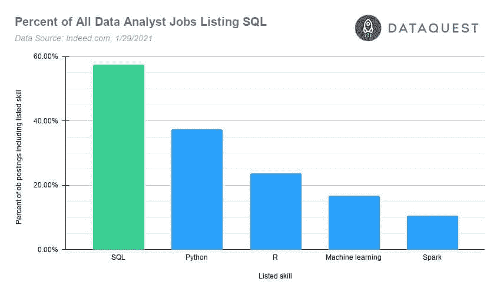

# SQL 面试问题——为工作面试做准备的真实问题

> 原文：<https://www.dataquest.io/blog/sql-interview-questions/>

February 1, 2021

如果你想找一份数据方面的工作，很有可能你必须回答一些 SQL 面试问题，或者完成某种 SQL 测试。

这是因为大多数数据工作都需要 SQL 技能。我们在这篇文章中深入挖掘了关于[为什么你应该学习 SQL](https://www.dataquest.io/blog/why-sql-is-the-most-important-language-to-learn/) 的数据，但简短的版本是这样的:2021 年超过一半的数据分析师、数据科学家和数据工程师工作将 SQL 列为一项要求。

SQL 对于数据分析师角色的重要性尤为突出:


[](https://www.dataquest.io/wp-content/uploads/2021/01/Data-analyst-job-skills-chart.jpg)

SQL 无疑是数据分析师最需要的技能。数据来源:Indeed.com，2021 年 1 月 29 日。

## 准备工作面试中的 SQL 问题

我们已经写了一份关于数据科学领域[工作面试的详尽指南。你应该意识到，SQL 几乎肯定会在你的面试过程中发挥作用，特别是如果你正在寻找数据分析师的角色。](https://www.dataquest.io/blog/career-guide-data-science-job-interview/)

每个公司都有不同的做法，但这里有一些公司测试 SQL 技能的更常见的方法:

*   面对面(或视频)面试，会问你一些 SQL 问题或给你一些要解决的 SQL 问题。
*   带回家的 SQL 任务。
*   现场(或视频)编码会议，要求您使用 SQL 技能实时回答问题。
*   白板编码会议，要求您通过在白板上勾画查询来展示您的 SQL 技能。

如果您还不习惯编写 SQL 查询，现在是最好的时机[注册一个免费帐户，开始学习我们的交互式 SQL 课程](https://app.dataquest.io/signup?course=funds-sql-i&source=https://www.dataquest.io/blog/sql-interview-questions/)。但是假设你已经是一个 SQL 高手了。你仍然需要一些练习！

这就是你可能会遇到问题的地方。

### 在线练习问题列表(大部分)很糟糕

如果你在谷歌上搜索“SQL 面试问题”，你会找到一堆列出类似问题的文章(这些都是从排名靠前的文章中提取的真实问题)

*   什么是 SQL？
*   什么是数据库？
*   什么是桌子？
*   什么是联接？

你明白了。我们认为在工作面试中你可能会被问到“什么是 SQL”。但绝对不可能是*可能是*。

更有可能的是:你将面临的 SQL 面试问题会要求你用 SQL 解决实际问题，或者要求你回答更棘手的问题来测试你的工作知识。

我们收集了下面的一些问题，并提供了可扩展的答案，这样你可以测试自己，然后检查以确保你是正确的。

## 用*真实的* SQL 面试问题测试自己:

### 问题 1

根据下表，编写一个 SQL 查询来检索微积分考试中得分超过 16 分的校友的个人数据。

**校友**

| 学生 id | 名字 | 姓 | 出生日期 | 能力 |
| --- | --- | --- | --- | --- |
| Three hundred and forty-seven | 丹妮拉（亦作 Danielle）（f.） | 洛佩斯 | 1991-04-26 | 医学院 |
| Three hundred and forty-eight | 罗伯特 | 费希尔 | 1991-03-09 | 数学 |

**评估**

| 学生 id | class_id | 考试日期 | 等级 |
| --- | --- | --- | --- |
| Three hundred and forty-seven | Seventy-four | 2015-06-19 | Sixteen |
| Three hundred and forty-seven | Eighty-seven | 2015-06-06 | Twenty |
| Three hundred and forty-eight | Seventy-four | 2015-06-19 | Thirteen |

**课程设置**

| class_id | 类别名称 | 教授 _id | 学期 |
| --- | --- | --- | --- |
| Seventy-four | 代数学 | Four hundred and thirty-five | 2015 _ 夏天 |
| Eighty-seven | 结石 | Five hundred and thirty-two | 2015 _ 夏天 |
| Forty-six | 统计数字 | Six hundred and twenty-five | 2015 _ 冬天 |

Click to reveal answer

有几种可能的答案。这里有一个:

```
SELECT a.name, a.surname, a.birth_date, a.faculty
  FROM alumni AS a
 INNER JOIN evaluation AS e
       ON a.student_id=e.student_id
 INNER JOIN curricula AS c
       ON e.class_id = c.class_id
 WHERE c.class_name = 'calculus' AND e.grade>16;
```

### 问题 2

我们将使用`beverages`表。下面给出了它的前几行。

| 身份证明（identification） | 名字 | 发布年份 | 水果 _ 百分比 | 供稿 _ 作者 |
| --- | --- | --- | --- | --- |
| one | 嗡嗡声 | Two thousand and seven | Forty-five | 山姆·马龙 |
| Two | 令人愉快的 | Two thousand and eight | Forty-one | 山姆·马龙 |
| three | 尼斯（法国城市名） | Two thousand and fifteen | forty-two | 山姆·马龙 |

编写一个查询，只提取`fruit_pct`在`35`和`40`之间的饮料(包括两端)。

Click to reveal answer

有几种可能的答案。这里有一个:

```
SELECT *
  FROM beverages
 WHERE fruit_pct BETWEEN 35 AND 40;
```

### 问题 3

我们将再次使用饮料桌。下面给出了它的前几行。

| 身份证明（identification） | 名字 | 发布年份 | 水果 _ 百分比 | 供稿 _ 作者 |
| --- | --- | --- | --- | --- |
| one | 嗡嗡声 | Two thousand and seven | Forty-five | 山姆·马龙 |
| Two | 令人愉快的 | Two thousand and eight | Forty-one | 山姆·马龙 |
| three | 尼斯（法国城市名） | Two thousand and fifteen | forty-two | 山姆·马龙 |

编写一个查询，只提取贡献者只有一个名字的饮料

Click to reveal answer

有几种可能的答案。这里有一个:

```
SELECT *
  FROM beverages
 WHERE contributed_by NOT LIKE '% %';
```

### 问题 4

我们将再次使用`beverages`表。下面给出了它的前几行。

| 身份证明（identification） | 名字 | 发布年份 | 水果 _ 百分比 | 供稿 _ 作者 |
| --- | --- | --- | --- | --- |
| one | 嗡嗡声 | Two thousand and seven | Forty-five | 山姆·马龙 |
| Two | 令人愉快的 | Two thousand and eight | Forty-one | 山姆·马龙 |
| three | 尼斯（法国城市名） | Two thousand and fifteen | forty-two | 山姆·马龙 |

编写一个查询，按贡献者查找平均值`fruit_pct`，并按升序显示。

Click to reveal answer

有几种可能的答案。这里有一个:

```
SELECT contributed_by, AVG(fruit_pct) AS mean_fruit
  FROM beverages
 GROUP BY contributed_by
 ORDER BY mean_fruit;
```

### 问题 5

看看下面给出的查询:

```
SELECT column, AGG_FUNC(column_or_expression), …
  FROM a_table
 INNER JOIN some_table
       ON a_table.column = some_table.column
 WHERE a_condition
 GROUP BY column
HAVING some_condition
 ORDER BY column
 LIMIT 5;
```

SQL 以什么顺序运行子句？从下面的选项列表中选择正确的选项:

1.  `SELECT`、`FROM`、`WHERE`、`GROUP BY`
2.  `FROM`、`WHERE`、`HAVING`、`SELECT`、`LIMIT`
3.  `SELECT`、`FROM`、`INNER JOIN`，分组依据
4.  `FROM`、`SELECT`、`LIMIT`、`WHERE`

Click to reveal answer

正确选项是`2`。事情是这样的:

1.  SQL 引擎从表中获取数据(`FROM`和`INNER JOIN`)
2.  过滤它(`WHERE`)
3.  汇总数据(`GROUP BY`)
4.  过滤汇总数据(`HAVING`)
5.  选择要显示的列和表达式(`SELECT`)
6.  订单剩余数据(`ORDER BY`)
7.  限制结果(`LIMIT`)

### 问题 6

数据库表中索引的用途是什么？

Click to reveal answer

数据库表中索引的目的是提高查看该表数据的速度。标准的类比是，通过查看索引在书中查找某样东西(通常)比翻阅每一页直到找到我们想要的东西要快得多。

### 问题 7

以下查询产生了`my_table`的哪些行？给个描述性的回答。

```
SELECT *
  FROM my_table
 WHERE 1 = 1.0;
```

Click to reveal answer

它返回整个表，因为`1=1.0`总是计算为真。

### 问题 8

以下查询产生了`my_table`的哪些行？给个描述性的回答。

```
SELECT *
  FROM my_table
 WHERE NULL = NULL;
```

Click to reveal answer

它不返回任何行，因为根据定义，`NULL`不等于自身。

## SQL 面试准备的更多资源

随着时间的推移，我们会在列表中添加新的问题，但在此期间，这里有一些更有帮助的资源，供您在准备 SQL 面试问题时参考:

*   [我们可下载的 SQL 备忘单](https://www.dataquest.io/blog/sql-cheat-sheet/)
*   我们的 [SQL 课程](https://www.dataquest.io/path/sql-skills/)。我们的应用程序中还有交互式 SQL 练习题，可以让您进行更多的 SQL 练习。
*   [破解 SQL 面试](https://github.com/xoraus/CrackingTheSQLInterview)——Github 上一个很好的 SQL 面试问题和主题集合，比大多数列表有用得多。
*   另一个 Github repo 的面试问题表面上是从真实的 SQL 工作面试中提取的。

当然，不要忘了将这篇文章加入书签，因为我们会添加更多的 SQL 面试问题，供您随时测试自己！

### 用正确的方法学习 SQL！

*   编写真正的查询
*   使用真实数据
*   就在你的浏览器里！

当你可以 ***边做边学*** 的时候，为什么要被动的看视频讲座？

[Sign up & start learning!](https://app.dataquest.io/signup)

*布鲁诺·库尼亚写的 SQL 问题。*