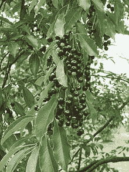
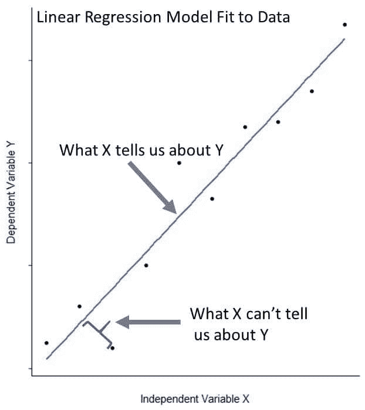
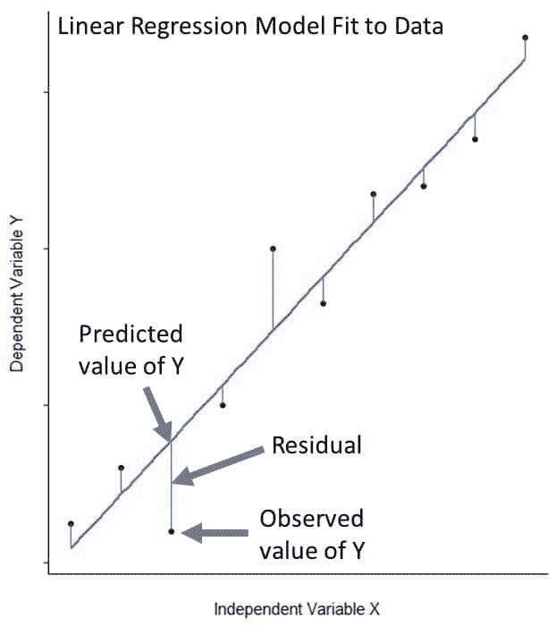
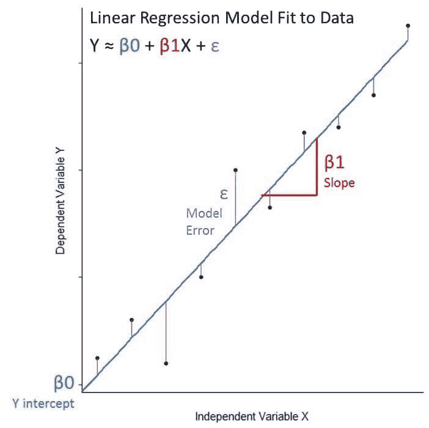
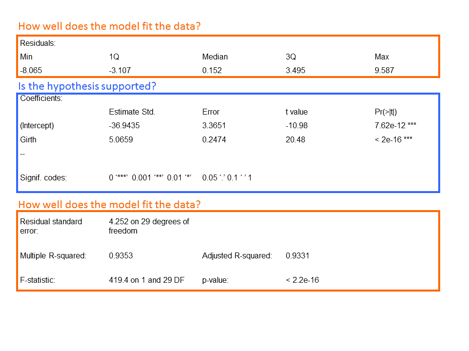
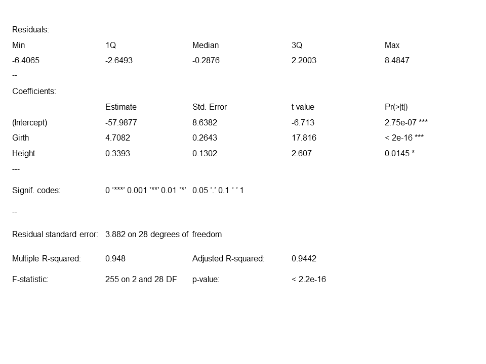
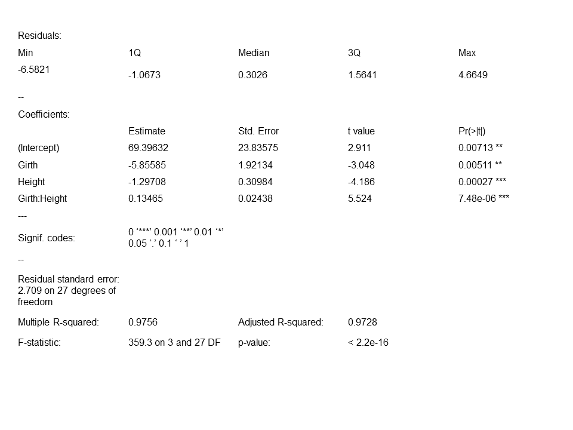

# 在 R 中使用线性回归进行预测建模

> 原文：<https://www.dataquest.io/blog/statistical-learning-for-predictive-modeling-r/>

May 16, 2018

在 R 编程中，预测模型对于预测未来的结果和估计那些不切实际的度量是非常有用的。例如，数据科学家可以使用预测模型根据降雨量和温度预测作物产量，或者确定具有某些特征的患者是否更有可能对新药产生不良反应。

在我们具体讨论线性回归之前，让我们提醒自己典型的数据科学工作流可能是什么样子。很多时候，我们会从一个我们想回答的问题开始，然后做如下的事情:

1.  收集一些与问题相关的数据(越多越好)。
2.  如果需要，将数据清理、扩充和预处理成方便的形式。
3.  对数据进行探索性分析，以便更好地理解数据。
4.  以你的发现为指导，构建数据的某个方面的模型。
5.  使用该模型来回答您开始提出的问题，并验证您的结果。

[线性回归](https://en.wikipedia.org/wiki/Linear_regression)是数据科学家用于预测建模的最简单、最常用的监督机器学习算法之一。在本帖中，我们将使用线性回归来构建一个模型，该模型可以根据研究树木的人更容易测量的指标来预测樱桃树的体积。

在这篇博文中，我们将使用 [R](https://www.r-project.org/) 来探索这个数据集，并学习线性回归的基础知识。如果你是学习 R 语言的新手，我们推荐我们的 [R 基础](https://www.dataquest.io/course/r-fundamentals)和 [R 编程:中级](https://www.dataquest.io/course/r-programming-intermediate)课程，它们来自我们的 [R 数据分析师](https://www.dataquest.io/path/data-analyst-r)路径。掌握一些非常基本的统计学知识也会有所帮助，但是如果你知道什么是均值和标准差，你就能理解了。如果您想自己练习构建模型和可视化，我们将使用下面的 R 包:

*   [`data sets`](https://stat.ethz.ch/R-manual/R-devel/library/datasets/html/00Index.html) 这个包包含了各种各样的练习数据集。我们将使用其中的一个“树”来学习构建线性回归模型。
*   [`ggplot2`](https://cran.r-project.org/web/packages/ggplot2/index.html) 我们将使用这个流行的数据可视化包来构建我们的模型图。
*   [`GGally`](https://cran.r-project.org/web/packages/GGally/index.html) 这个包扩展了`ggplot2`的功能。我们将使用它来创建一个绘图矩阵，作为我们初始探索性数据可视化的一部分。
*   [`scatterplot3d`](https://cran.r-project.org/web/packages/scatterplot3d/index.html) 我们将使用这个软件包来可视化更复杂的具有多个预测因子的线性回归模型。

## 他们是如何测量树木体积的？

[树](https://stat.ethz.ch/R-manual/R-devel/library/datasets/html/trees.html)数据集包含在 base R 的`datasets`包中，它将帮助我们回答这个问题。由于我们正在使用一个现有的(干净的)数据集，上面的步骤 1 和 2 已经完成，所以我们可以直接跳到步骤 3 中的一些初步探索性分析。这个数据集是什么样子的？

```
data(trees) ## access the data from R’s datasets package
head(trees) ## look at the first several rows of the data
```

| 肚带 | 高度 | 卷 |
| Eight point three | Seventy | Ten point three |
| Eight point six | Sixty-five | Ten point three |
| Eight point eight | Sixty-three | Ten point two |
| Ten point five | seventy-two | Sixteen point four |
| Ten point seven | Eighty-one | Eighteen point eight |
| Ten point eight | Eighty-three | Nineteen point seven |

```
str(trees) ## look at the structure of the variables
```

| $围长:数量 | 8.3 8.6 8.8 10.5 10.7 10.8 11 11 11.1 11.2 … |
| $高度:数字 | 70 65 63 72 81 83 66 75 80 75 … |
| $ Volume:一个 | 10.3 10.3 10.2 16.4 18.8 19.7 15.6 18.2 22.6 19.9 … |

该数据集由描述黑樱桃树的 3 个数值变量的 31 个观察值组成:

*   树干周长(英寸)
*   高度(英尺)
*   体积(英尺 ³

这些指标对于研究树木生态的森林学家和科学家来说是有用的信息。使用基本的林业工具来测量树的高度和周长是相当简单的，但是测量树的体积要困难得多。如果你不想真的砍倒和拆除这棵树，你不得不求助于一些技术上具有挑战性和耗时的活动，如爬树和进行精确测量。能够从高度和/或围长准确预测树木体积将是有用的。



为了决定我们是否可以建立一个预测模型，第一步是看看我们的预测变量和反应变量(在这种情况下是周长、高度和体积)之间是否存在关系。让我们做一些探索性的数据可视化。我们将使用`GGally`包中的 [`ggpairs()`](https://cran.r-project.org/web/packages/GGally/GGally.pdf) 函数来创建一个绘图矩阵，以查看变量之间的关系。

```
ggpairs(data=trees, columns=1:3, title="trees data")
```

`ggpairs()`函数为我们提供了每个变量组合的散点图，以及每个变量的[密度图](https://en.wikipedia.org/wiki/Probability_density_function)和变量之间的[相关性强度](https://en.wikipedia.org/wiki/Correlation_and_dependence)。

如果你以前用过`ggplot2`，这个符号可能看起来很熟悉:`GGally`是`ggplot2`的扩展，它提供了一个简单的接口来创建一些复杂的图形，就像这个一样。当我们看这些图时，我们可以开始了解数据并提出问题。相关系数提供了关于变量有多接近某种关系的信息；相关系数越接近 1，关系越强。散点图让我们可以看到变量对之间的关系。散点图中的点具有清晰的视觉模式(与看起来像不成形的云相反),表明关系更强。

我们的问题:**哪些预测变量似乎与响应变量相关？**从查看`ggpairs()`输出来看，周长肯定似乎与体积相关:相关系数接近 1，并且点似乎具有线性模式。高度和体积之间可能存在关系，但似乎是一种较弱的关系:相关系数较小，散点图中的点更分散。**变量之间的关系是什么形状？**

这种关系似乎是线性的；从散点图中，我们可以看到，随着树围的增加，树的体积不断增加。**是相关性强，还是数据中的噪音淹没了信号？**身高和体积之间的关系不太清楚，但腰围和体积之间的关系似乎很强。现在，我们已经对数据有了相当全面的了解，我们可以进入第 4 步，进行一些预测建模。

## 形成一个假设

假设是关于我们认为数据发生了什么的有根据的猜测。在这种情况下，我们假设樱桃树的周长和体积是相关的。我们形成的每个假设都有一个对立面:“零假设”( *H [0]* )。这里，我们的无效假设是周长和体积不相关。在统计学中，零假设是我们用数据来支持或拒绝的假设；我们永远不能说我们“证明”了一个假设。我们称周长和体积相关的假设为“另类”假设( *H [a]* )。总结一下: *H [0]* :围长和体积没有关系 *H [a]* :围长和体积有一定的关系我们用线性回归模型来检验我们的假设。如果我们找到足够有力的证据来拒绝*H[0]，那么我们就可以用这个模型从围长来预测樱桃树的体积。*

## 线性回归模型的构建模块

线性回归描述了感兴趣的响应变量(或因变量)和一个或多个预测变量(或自变量)之间的关系。它有助于我们将信号(我们可以从预测变量中了解到的响应变量)与噪声(我们无法从预测变量中了解到的响应变量)分开。随着我们的进展，我们将更深入地研究这个模型是如何做到这一点的。



让我们深入研究，建立一个树木体积和周长的线性模型。r 用基本函数`lm()`使这变得简单明了。

```
fit_1 <- lm(Volume ~ Girth, data = trees)
```

`lm()`函数为我们的数据拟合一条线，这条线尽可能接近我们的所有 31 个观察值。更具体地说，它以这样一种方式拟合直线，使得点和直线之间的平方差之和最小化；这种方法被称为[“最小化最小二乘法”](https://en.wikipedia.org/wiki/Least_squares)即使线性回归模型很好地拟合了数据，拟合也不是完美的。我们的观测值和它们的模型预测值之间的距离称为 [*残差*](https://en.wikipedia.org/wiki/Errors_and_residuals) 。



数学上，我们可以把线性回归的方程写成:**Y≈β0+β1X+ε**

*   [**Y** 和 **X** 变量](https://en.wikipedia.org/wiki/Dependent_and_independent_variables)是我们相互关联的数据中的响应和预测变量
*   **β0** 是模型系数，代表模型截距，或与 y 轴相交的位置
*   **β1** 是代表模型[斜率](https://en.wikipedia.org/wiki/Slope)的模型系数，该数字给出了关于直线的陡度及其方向(正或负)的信息
*   **ε** 是[误差](https://en.wikipedia.org/wiki/Errors_and_residuals)项，包含了我们在模型中无法捕捉的可变性(X 无法告诉我们关于 Y 的事情)

以我们的例子为例:**树量≈ 截距 + 斜率(树围)+ 误差** 

`lm()`函数估计它拟合到我们的数据的线性模型的截距和斜率系数。有了模型，我们可以继续第 5 步，记住我们还有一些工作要做，以验证这个模型实际上是适合数据的。

## 我们可以用这个模型来做预测吗？

我们能否使用我们的模型进行预测将取决于:

1.  我们是否可以拒绝变量之间没有关系的零假设。
2.  模型是否适合我们的数据。

让我们使用`summary()`调用我们模型的输出。模型输出将为我们提供所需的信息，以测试我们的假设并评估模型与数据的吻合程度。

```
summary(fit_1)
```

让我们浏览一下输出，回答每个问题。

### 假设得到支持了吗？

系数:估计值和标准值。错误:

*   如果围长值为零，我们示例中的截距就是期望的树木体积。当然，我们不能有一棵负体积的树，但以后会有更多。
*   我们例子中的斜率是树围对树体积的影响。我们看到树围每增加一英寸，树的体积就增加 5.0659 英尺。
*   系数[标准误差](https://en.wikipedia.org/wiki/Standard_error)告诉我们估计系数与我们响应变量的实际平均值的平均偏差。

*t 值*:

*   这是一个[检验统计量](https://en.wikipedia.org/wiki/Student%27s_t-test)，它测量估计系数从零开始有多少[标准差](https://en.wikipedia.org/wiki/Standard_deviation)。

*Pr( > |t|)* :

*   这个数字就是 [p 值](https://en.wikipedia.org/wiki/P-value)，定义为如果*H[0]为真，观察到任何值等于或大于 t 的概率。t 统计值越大，p 值越小。通常，我们使用 0.05 作为显著性的临界值；当 p 值小于 0.05 时，我们拒绝 *H [0]* 。*

我们可以拒绝零假设，而相信树的宽度和体积之间有关系。

### 模型与数据的吻合程度如何？

*残差*:

*   输出的这一部分为我们提供了残差的摘要(回想一下，这些是我们的观察值和模型之间的距离)，它告诉我们一些关于我们的模型与我们的数据的拟合程度。残差应该在零附近有一个非常对称的分布。一般来说，我们希望残差在零附近呈正态分布(即钟形曲线分布)，但重要的是，它们没有明显的视觉模式，这表明线性模型不适合数据。

我们可以使用`ggplot2`制作一个直方图来直观显示这一点。

```
ggplot(data=trees, aes(fit_1$residuals)) +
geom_histogram(binwidth = 1, color = "black", fill = "purple4") +
theme(panel.background = element_rect(fill = "white"),
axis.line.x=element_line(),
axis.line.y=element_line()) +
ggtitle("Histogram for Model Residuals")
```


我们的残差在 0 附近看起来非常对称，表明我们的模型很好地符合数据。*残差标准误差*:

*   这一项表示我们的响应变量测量值偏离拟合线性模型的平均量(模型误差项)。

*自由度*:

*   对[自由度](https://en.wikipedia.org/wiki/Degrees_of_freedom_(statistics))的讨论可能变得相当专业。就本文的目的而言，将它们视为用于计算估计值的独立信息片段的数量就足够了。自由度与测量次数有关，但并不相同。

*多个 R 平方*:

*   [*R²*](https://en.wikipedia.org/wiki/Coefficient_of_determination) 值是我们的数据与线性回归模型接近程度的度量。*R²值始终在 0 和 1 之间；接近 1 的数字表示模型非常合适。 *R²**

*F 统计*:

*   这个[测试统计量](https://en.wikipedia.org/wiki/F-test)告诉我们在我们测试的因变量和自变量之间是否有关系。一般来说，一个大的 F 表示更强的关系。

*p 值*:

*   该 p 值与 *F* 统计相关，用于解释整个模型与我们的数据拟合的显著性。

让我们来看看适合我们的宽度和体积数据的模型。我们可以通过使用`ggplot()`将线性模型拟合到我们数据的散点图来做到这一点:

```
ggplot(data = trees, aes(x = Girth, y = Volume)) +
geom_point() +
stat_smooth(method = "lm", col = "dodgerblue3") +
theme(panel.background = element_rect(fill = "white"),
axis.line.x=element_line(),
axis.line.y=element_line()) +
ggtitle("Linear Model Fitted to Data")
```


线周围的灰色阴影表示置信区间为 0.95，这是 [`stat_smooth()`](https://cran.r-project.org/web/packages/ggplot2/index.html) 函数的默认值，它平滑数据以使模式更容易可视化。这个 0.95 的置信区间是所有黑樱桃树围长和体积的真实线性模型位于拟合我们数据的回归模型的置信区间内的概率。尽管这个模型非常符合我们的数据，但在我们的观察中仍然存在可变性。

这是因为这个世界普遍不整洁。在我们的模型中，树木体积不仅仅是树围的函数，也是我们不一定有数据可以量化的事物的函数(树干形状之间的个体差异，林业工作者树干围长测量技术的微小差异)。有时，这种可变性掩盖了反应变量和预测变量之间可能存在的任何关系。但在这里，我们的数据中的信号足够强，让我们开发出一个有用的模型来进行预测。

## 使用我们简单的线性模型进行预测

我们的模型适合做预测！各地的树木科学家欢欣鼓舞。假设我们有一棵树的围长、高度和体积数据，但这些数据被排除在数据集之外。我们可以用这棵树来测试我们的模型。

| 肚带 | 高度 | 卷 |
| --- | --- | --- |
| 18.2 英寸 | 72 英尺 | 46.2 英尺 ³ |

我们的模型从树的周长预测树的体积会有多好？我们将使用`predict()`函数，这是一个通用的 R 函数，用于从模型拟合函数的模块中进行预测。`predict()`将我们的线性回归模型和我们需要响应变量值的预测变量的值作为参数。

```
predict(fit_1, data.frame(Girth = 18.2))
```

我们的体积预测是 **55.2 英尺³。这接近我们的实际值，但有可能将我们的另一个预测变量高度添加到我们的模型中，可能会让我们做出更好的预测。**

## 添加更多预测因子:多元线性回归

如果我们使用所有可用的信息(宽度和高度)来预测树木体积，也许我们可以提高模型的预测能力。重要的是，从帖子开始的五步过程实际上是一个迭代过程——在现实世界中，你会获得一些数据，建立一个模型，根据需要调整模型以改进它，然后可能会添加更多的数据并建立一个新的模型，等等，直到你对结果满意和/或确信你不能做得更好。我们可以建立两个独立的回归模型并对它们进行评估，但是这种方法存在一些问题。首先，想象一下，如果我们有 5 个、10 个甚至 50 个预测变量，那会有多麻烦。第二，两个预测模型将为我们提供两个独立的预测量，而不是我们追求的单一预测量。也许最重要的是，建立两个独立的模型并不能让我们在估计模型系数时考虑预测因子之间的关系。在我们的数据集中，基于我们最初的数据探索，我们怀疑树的高度和围长是相关的。正如我们将在本文中更清楚地看到的，忽略预测变量之间的这种相关性会导致关于它们与树木体积关系的误导性结论。更好的解决方案是建立一个包含多个预测变量的线性模型。我们可以通过为我们的模型中感兴趣的每个额外独立变量添加一个斜率系数来做到这一点。

**树体≈ 截距 + 斜率 1 (树围)+ 斜率 2 (树高)+ 误差**

使用`lm()`函数很容易做到这一点:我们只需要添加另一个预测变量。

```
fit_2 <- lm(Volume ~ Girth + Height, data = trees)
summary(fit_2)
```

我们可以从模型输出中看到，围长和高与体积显著相关，并且模型很好地符合我们的数据。我们调整后的 *R²* 值也比我们调整后的 *R²* 型号`fit_1`高一点。因为我们在这个模型中有两个预测变量，我们需要一个第三维度来可视化它。我们可以使用包`scatterplot3d`创建一个漂亮的 3d 散点图:首先，我们为预测变量(在我们的数据范围内)制作一个网格。`expand.grid()`函数根据因子变量的所有组合创建一个数据框。

```
Girth <- seq(9,21, by=0.5) ## make a girth vector
Height <- seq(60,90, by=0.5) ## make a height vector
pred_grid <- expand.grid(Girth = Girth, Height = Height)
## make a grid using the vectors
```

接下来，我们基于预测变量网格对体积进行预测:

```
pred_grid$Volume2 <-predict(fit_2, new = pred_grid)
```

现在，我们可以根据预测网格和预测体积制作 3d 散点图:

```
fit_2_sp <- scatterplot3d(pred_grid$Girth, pred_grid$Height, pred_grid$Volume2, angle = 60, color = "dodgerblue", pch = 1, ylab = "Hight (ft)", xlab = "Girth (in)", zlab = "Volume (ft3)" )
```

最后叠加我们的实际观察结果，看看它们有多吻合:

```
fit_2_sp$points3d(trees$Girth, trees$Height, trees$Volume, pch=16)
```

让我们看看这个模型如何预测我们的树的体积。这一次，我们包括树的高度，因为我们的模型使用高度作为预测变量:

```
predict(fit_2, data.frame(Girth = 18.2, Height = 72))
```

这一次，我们得到的预测体积为 **52.13 英尺 ³** 。这个预测比我们用简单的模型得到的预测更接近真实的树木体积，这个模型只用围长作为预测因子，但是，正如我们将要看到的，我们也许可以改进。

## 互动会计

虽然我们已经做出了改进，但我们刚刚构建的模型仍然不能说明全部情况。它假设树围对材积的影响独立于树高对材积的影响。这显然不是事实，因为树的高度和周长是相关的；更高的树往往更宽，我们的探索性数据可视化表明了这一点。换句话说，腰围的斜率应该随着身高斜率的增加而增加。为了说明我们模型中预测变量的这种非独立性，我们可以指定一个交互项，它被计算为预测变量的乘积。

**树体≈ 截距 + 坡度 1 (树围)+ 坡度 2 (树高)+ 坡度 3 (树围 x 树高)+ 误差**

同样，使用`lm()`很容易构建这个模型:

```
fit_3 <- lm(Volume ~ Girth * Height, data = trees)
summary(fit_3)
```

注意，在我们的模型中，**“周长*高度”**术语是**“周长+高度+周长*高度”**的简写。正如我们所猜测的，树高和树围的交互作用是显著的，这表明我们应该在我们用来预测树木体积的模型中包括交互作用项。调整后的*R²值接近 1，f *的大值*和 p*的小值*也支持这一决定，表明我们的模型非常适合该数据。让我们来看一个散点图，用这个模型来直观地显示树木体积的预测值。我们可以使用为`fit_2`可视化生成的预测值的相同网格:*

```
Girth <- seq(9,21, by=0.5)
Height <- seq(60,90, by=0.5)
pred_grid <- expand.grid(Girth = Girth, Height = Height)
```

类似于我们如何可视化`fit_2`模型，我们将使用带有交互项的`fit_3`模型来预测预测变量网格中的体积值:

```
pred_grid$Volume3 <-predict(fit_3, new = pred_grid)
```

现在我们制作预测网格和预测体积的散点图:

```
fit_3_sp <- scatterplot3d(pred_grid$Girth, pred_grid$Height, pred_grid$Volume3, angle = 60, color = "dodgerblue", pch = 1, ylab = "Hight (ft)", xlab = "Girth (in)", zlab = "Volume (ft3)")
```

最后，我们叠加我们观察到的数据:

```
fit_3_sp$points3d(trees$Girth, trees$Height, trees$Volume, pch=16)
```


在这幅图中有点难以看出，但这次我们的预测位于某个曲面上，而不是平面上。现在是关键时刻:让我们用这个模型来预测我们的树的体积。

```
predict(fit_3, data.frame(Girth = 18.2, Height = 72))
```

我们使用第三个模型的预测值是 **45.89** ，最接近我们的真实值 **46.2 英尺³。**

## 关于预测模型的一些注意事项

#### 请记住您的数据范围

使用模型进行预测时，最好避免试图外推至远远超出用于构建模型的值的范围。为了说明这一点，让我们试着估算一棵小树苗(幼树)的体积:

```
predict(fit_3, data.frame(Girth = 0.25, Height = 4))
```

我们得到的预测体积为 62.88 英尺(T1 3 T2 T3)，比我们数据集中的大树还要大。这当然说不通。请记住，我们做出准确预测的能力受到我们用来构建模型的数据范围的限制。

#### 避免制作过于特定于数据集的模型

在本帖中我们研究的简单示例数据集中，向我们的模型添加第二个变量似乎提高了我们的预测能力。然而，当尝试具有许多差异变量的多种多元线性回归模型时，选择最佳模型变得更具挑战性。如果添加了太多不能提高模型预测能力的项，我们就有可能使我们的模型“过度适应”我们的特定数据集。

过度适应特定数据集的模型会失去预测未来事件或适应不同数据集的功能，因此不是非常有用。虽然我们在本文中用于评估模型有效性的方法(调整后的 *R²* ，残差分布)有助于了解您的模型与您的数据的拟合程度，但将您的模型应用于数据集的不同子集可以提供有关您的模型在实践中表现如何的信息。

这种方法被称为[“交叉验证”](https://en.wikipedia.org/wiki/Cross-validation_(statistics))，通常用于测试预测模型。在我们的例子中，我们使用三个模型中的每一个来预测一棵树的体积。然而，如果我们在构建更复杂的模型，我们会希望保留一部分数据用于交叉验证。

## 后续步骤

我们使用线性回归来建立从两个连续预测变量预测连续响应变量的模型，但线性回归对于许多其他常见场景来说是一种有用的预测建模工具。

下一步，尝试建立线性回归模型，从两个以上的预测变量预测反应变量。考虑如何决定回归模型中包含哪些变量；你如何判断哪些是重要的预测因素？预测变量之间的关系如何影响这个决定？

R 中对处理多元线性回归问题有用的数据集包括:`airquality`、`iris`和`mtcars`。从数据中构建模型的另一个重要概念是用从现有数据中计算出的新预测值来扩充数据。这就是所谓的特征工程，在这里你可以运用你自己的专业知识来解决问题。

例如，如果您正在查看一个将时间戳作为变量之一的银行交易数据库，那么星期几可能与您想要回答的问题相关，因此您可以根据时间戳计算出该日期，并将其作为一个新变量添加到数据库中。这是一个复杂的主题，添加更多的预测变量并不总是一个好主意，但随着您对建模了解的深入，您应该记住这一点。在这篇文章使用的树木数据集中，你能想出任何额外的数量来计算周长和高度，这将有助于你预测体积吗？(提示:回想一下你学习各种几何形状体积公式的时候，想想一棵树是什么样子的。)

最后，虽然我们关注的是连续数据，但是线性回归也可以扩展到从分类变量进行预测。尝试使用线性回归模型从分类变量和连续预测变量中预测反应变量。R 中有几个数据集特别适合这个练习:`ToothGrowth`、`PlantGrowth`和`npk`。

### 准备好提升你的 R 技能了吗？

我们 R path 的[数据分析师涵盖了你找到工作所需的所有技能，包括:](/path/data-analyst-r/)

*   使用 **ggplot2** 进行数据可视化
*   使用 **tidyverse** 软件包的高级数据清理技能
*   R 用户的重要 SQL 技能
*   **统计**和概率的基础知识
*   ...还有**多得多的**

没有要安装的东西，**没有先决条件**，也没有时间表。

[Start learning for free!](https://app.dataquest.io/signup)