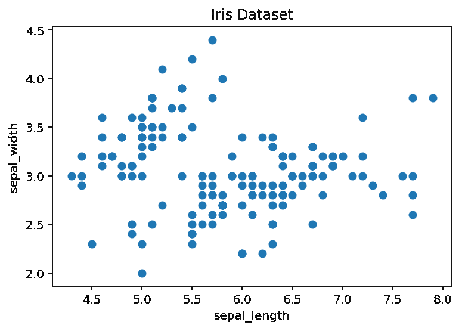
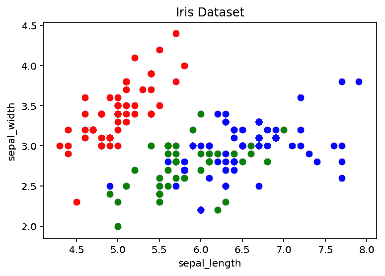
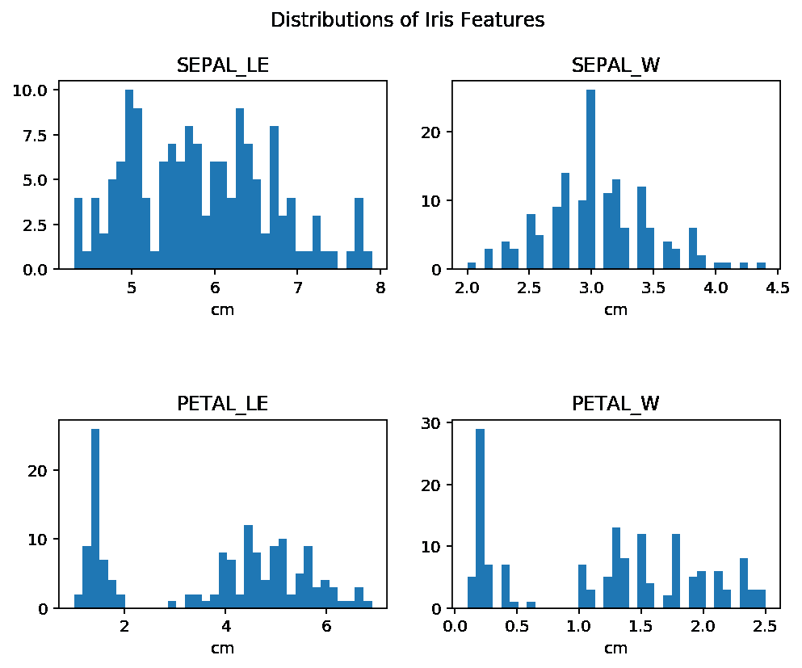

# 教程:Python 中的高级 For 循环

> 原文：<https://www.dataquest.io/blog/tutorial-advanced-for-loops-python-pandas/>

July 16, 2019

在之前的教程中，我们介绍了 Python for loops 的基础知识，看看如何遍历列表和列表列表。但是除了遍历列表之外，for 循环还有更多的内容，在现实世界的数据科学工作中，您可能希望对其他数据结构使用 for 循环，包括 numpy 数组和 pandas 数据帧。

本教程从如何使用 for 循环遍历除列表之外的常见 Python 数据结构(如元组和字典)开始。然后，我们将深入探讨与常见的 Python 数据科学库如`numpy`、`pandas`和`matplotlib`一起使用 for 循环。我们还将仔细看看`range()`函数，以及它在编写循环时是如何有用的。

## 快速回顾:Python For 循环

for 循环是一个编程语句，它告诉 Python 遍历一个对象集合，依次对每个对象执行相同的操作。基本语法是:

```py
for object in collection_of_objects:
    # code you want to execute on each object 
```

每次 Python 遍历循环，变量`object`取我们序列中下一个对象`collection_of_objects`的值，Python 将按顺序执行我们在来自`collection_of_objects`的每个对象上编写的代码。

现在，让我们深入了解如何使用不同类型数据结构的 for 循环。我们将跳过列表，因为那些已经在前面的教程中讨论过了；如果你需要进一步的复习，请查看[入门教程](https://www.dataquest.io/blog/python-for-loop-tutorial/)或 Dataquest 的[关于列表和 for 循环的互动课程](https://app.dataquest.io/m/312)。

## 数据结构

#### 元组

元组是序列，就像列表一样。元组和列表的区别在于元组是不可变的；也就是说，它们不能被改变([了解 Python 中可变和不可变对象的更多信息](https://www.dataquest.io/blog/tutorial-functions-modify-lists-dictionaries-python/))。元组也使用圆括号代替方括号。

不考虑这些差异，遍历元组非常类似于列表。

```py
x = (10,20,30,40,50)
for var in x:
    print("index "+ str(x.index(var)) + ":",var) 
```

```py
index 0: 10
index 1: 20
index 2: 30
index 3: 40
index 4: 50 
```

如果我们有一个元组列表，我们可以访问列表中每个元组的单个元素，方法是将它们作为变量包含在 for 循环中，如下所示:

```py
x = [(1,2), (3,4), (5,6)]

for a, b in x:
    print(a, "plus", b, "equals", a+b) 
```

```py
1 plus 2 equals 3
3 plus 4 equals 7
5 plus 6 equals 11 
```

#### 字典

除了列表和元组，字典是在处理数据时可能遇到的另一种常见的 Python 数据类型，for 循环也可以遍历字典。

Python 字典由键值对组成，因此在每个循环中，我们需要访问两个元素(键和值)。我们需要调用`.items()`方法，而不是像对待列表那样使用`enumerate()`来循环遍历每个键-值对的键和相应的值。

例如，假设我们有一个名为`stocks`的字典，其中包含股票代码和相应的股票价格。我们将使用字典上的`.items()`方法为每次迭代生成一个键和值:

```py
stocks = {
        'AAPL': 187.31,
        'MSFT': 124.06,
        'FB': 183.50
    }

for key, value in stocks.items() :
    print(key + " : " + str(value)) 
```

```py
AAPL : 187.31
MSFT : 124.06
FB : 183.5 
```

注意，名称、键和值是完全任意的；我们也可以把它们标为 k 和 v 或者 x 和 y。

#### 字符串

正如介绍性教程中提到的，for 循环还可以遍历字符串中的每个字符。快速回顾一下，这是如何工作的:

```py
print("data science")  
for c in "data science":
    print(c) 
```

```py
data science
d
a
t
a

s
c
i
e
n
c
e 
```

#### Numpy 数组

现在，让我们看看如何将 for 循环用于常见的 Python 数据科学包及其数据类型。

我们将从如何使用带有`numpy`数组的 for 循环开始，所以让我们从创建一些随机数数组开始。

```py
import numpy as np
np.random.seed(0)  # seed for reproducibility
x = np.random.randint(10, size=6)
y = np.random.randint(10, size=6) 
```

迭代一维 numpy 数组与迭代列表非常相似:

```py
for val in x:
    print(val) 
```

```py
5
0
3
3
7
9 
```

现在，如果我们想遍历一个二维数组呢？如果我们像上面一样使用相同的语法来迭代二维数组，那么每次迭代只能迭代整个数组。

```py
# creating our 2-dimensional array
z = np.array([x, y])

for val in z:
    print(val) 
```

```py
[5 0 3 3 7 9]
[3 5 2 4 7 6] 
```

二维数组是由一对一维数组构建而成的。为了访问每个元素而不是每个数组，我们可以使用 numpy 函数`nditer()`，这是一个多维迭代器对象，它将一个数组作为其参数。

在下面的代码中，我们将编写一个 for 循环，通过传递二维数组`z`作为`nditer()`的参数来遍历每个元素:

```py
for val in np.nditer(z):
    print(val) 
```

```py
5
0
3
3
7
9
3
5
2
4
7
6 
```

正如我们所看到的，这首先列出了 x 中的所有元素，然后是 y 中的所有元素。

记住！当遍历这些不同的数据结构时，字典需要一个**方法**，numpy 数组需要一个**函数**。

#### 熊猫数据帧

当我们在 Python 中处理数据时，我们经常使用`pandas`数据帧。幸运的是，我们也可以使用 for 循环来遍历它们。

让我们在使用[一个小 CSV 文件](https://www.dataquest.io/wp-content/uploads/2019/07/gdp.csv)时练习这样做，该文件记录了六个不同国家的 GDP、首都和人口。我们将在下面的熊猫数据框中读到这一点。

Pandas 的工作方式与 numpy 有点不同，所以我们不能简单地重复我们已经学过的 numpy 过程。如果我们像对 numpy 数组那样迭代 pandas DataFrame，这只会打印出列名:

```py
import pandas as pd
df = pd.read_csv('gdp.csv', index_col=0)

for val in df:
    print(val) 
```

```py
Capital
GDP ($US Trillion)
Population 
```

相反，我们需要明确指出我们想要迭代数据帧的行。我们通过调用 DataFrame 上的`iterrows()`方法来实现这一点，并打印行标签和行数据，其中一行是整个 pandas 系列。

```py
for label, row in df.iterrows():
    print(label)
    print(row) 
```

```py
Ireland
Capital                Dublin
GDP ($US Trillion)     0.3337
Population            4784000
Name: Ireland, dtype: object
United Kingdom
Capital                 London
GDP ($US Trillion)       2.622
Population            66040000
Name: United Kingdom, dtype: object
United States
Capital               Washington, D.C.
GDP ($US Trillion)               19.39
Population                   327200000
Name: United States, dtype: object
China
Capital                  Beijing
GDP ($US Trillion)         12.24
Population            1386000000
Name: China, dtype: object
India
Capital                New Delhi
GDP ($US Trillion)         2.597
Population            1339000000
Name: India, dtype: object
Germany
Capital                 Berlin
GDP ($US Trillion)       3.677
Population            82790000
Name: Germany, dtype: object 
```

我们还可以访问熊猫系列中的特定值。假设我们只想打印出每个国家的首都。我们可以指定只需要“Capital”列的输出，如下所示:

```py
for label, row in df.iterrows():
    print(label + " : " + row["Capital"]) 
```

```py
Ireland : Dublin
United Kingdom : London
United States : Washington, D.C.
China : Beijing
India : New Delhi
Germany : Berlin 
```

为了比简单的打印输出更进一步，让我们使用 for 循环添加一列。我们再加一个人均 GDP 一栏。记住`.loc[]`是基于标签的。在下面的代码中，我们将添加列，并通过将每个国家的总 GDP 除以其人口，然后将结果乘以一万亿来计算其内容(因为 GDP 数字是以万亿为单位列出的)。

```py
for label, row in df.iterrows():
    df.loc[label,'gdp_per_cap'] = row['GDP ($US Trillion)']/row['Population '] * 1000000000000
print(df) 
```

```py
 Capital  GDP ($US Trillion)  Population   \
Country                                                             
Ireland                   Dublin              0.3337      4784000   
United Kingdom            London              2.6220     66040000   
United States   Washington, D.C.             19.3900    327200000   
China                    Beijing             12.2400   1386000000   
India                  New Delhi              2.5970   1339000000   
Germany                   Berlin              3.6770     82790000   

                 gdp_per_cap  
Country                       
Ireland         69753.344482  
United Kingdom  39703.210176  
United States   59260.391198  
China            8831.168831  
India            1939.507095  
Germany         44413.576519 
```

对于我们的数据框架中的每一行，我们都创建了一个新标签，并将行数据设置为等于总 GDP 除以该国人口，再乘以 1T 美元(千美元)。

## `range()`功能

我们已经看到了如何使用 for 循环来迭代任何序列或数据结构。但是，如果我们想以特定的顺序或者特定的次数来迭代这些序列呢？

这可以通过 Python 内置的`range()`函数来完成。根据传递给函数的参数数量，您可以决定一系列数字的开始和结束位置，以及一个数字和下一个数字之间的差异有多大。注意，与列表类似，`range()`函数的计数从 0 开始，而不是从 1 开始。

我们有三种方法可以调用`range()`:

1.  范围(停止)
2.  范围(开始、停止)
3.  范围(开始、停止、步进)

#### `range(stop)`

range(stop)有一个参数，当我们想要迭代一系列数字时使用，这些数字从 0 开始，包括所有数字，但*不包括*我们设置为停止的数字。

```py
for i in range(3):
    print(i) 
```

```py
0
1
2 
```

#### `range(start, stop)`

range(start，stop)有两个参数，我们不仅可以设置系列的结束，还可以设置开始。您可以使用 range()生成从 A 到 B 的一系列数字，使用范围为(A，B)。

```py
for i in range(1, 8):
    print(i) 
```

```py
1
2
3
4
5
6
7 
```

#### `range(start, stop, step)`

range(开始、停止、步进)有三个参数。除了最小值和最大值，我们还可以设置序列中一个数字与下一个数字之间的差值。如果没有提供步长值，则默认步长值为 1。

```py
for i in range(3, 16, 3):
    print(i) 
```

```py
3
6
9
12
15 
```

注意，这对于非数字序列也是一样的。

我们也可以使用序列中元素的索引进行迭代。关键思想是首先计算列表的长度，然后在这个长度的范围内对序列进行迭代。让我们来看一个例子:

```py
languages = ['Spanish', 'English',  'French', 'German', 'Irish', 'Chinese']

for index in range(len(languages)):
   print('Language:', languages[index]) 
```

```py
Language: Spanish
Language: English
Language: French
Language: German
Language: Irish
Language: Chinese 
```

在上面的 for 循环中，我们看到了一个变量的索引和语言、关键字中的*以及创建一个数字序列的`range()`函数。注意，我们在这种情况下也使用了`len()`函数，因为列表不是数字的。*

对于每次迭代，我们都执行我们的 print 语句。因此，对于 len(languages)范围内的每个索引，我们希望打印一种语言。因为我们的*语言*序列的长度是 6(这是`len(langauges)`评估的值)，我们可以将语句重写如下:

```py
for index in range(6):
    print('Language:', languages[index]) 
```

```py
Language: Spanish
Language: English
Language: French
Language: German
Language: Irish
Language: Chinese 
```

## 用 For 循环绘图

假设我们想要遍历一个集合，并使用每个元素来生成一个子情节，或者甚至是单个情节中的每个轨迹。例如，让我们以流行的[虹膜数据集](https://www.dataquest.io/wp-content/uploads/2019/07/iris.csv) ( [了解更多关于这个数据](https://en.wikipedia.org/wiki/Iris_flower_data_set))为例，用 For 循环做一些绘图。考虑下图。

(如果你对 Matplotlib 或 Seaborn 不熟悉，可以查看一下 Kyso 的这些初学者指南: [Matplotlib](https://kyso.io/KyleOS/matplotlib-intro) ， [Seaborn](https://kyso.io/KyleOS/seaborn-intro) 。Dataquest 还提供关于 [Python 数据可视化](https://www.dataquest.io/course/exploratory-data-visualization/)的互动课程。

```py
import pandas as pd
import matplotlib.pyplot as plt

df = pd.read_csv('iris.csv') 
```

```py
# create a figure and axis
fig, ax = plt.subplots()

# scatter the sepal_length against the sepal_width
ax.scatter(df['sepal_length'], df['sepal_width'])
# set a title and labels
ax.set_title('Iris Dataset')
ax.set_xlabel('sepal_length')
ax.set_ylabel('sepal_width') 
```

```py
Text(0,0.5,'sepal_width') 
```



上面，我们已经绘制了每个萼片的长度和宽度，但是我们可以通过每个花的种类在每个数据点上着色来赋予图表更多的意义。一种方法是使用 for 循环分散每个点，并传入各自的颜色。

```py
# create color dictionary
colors = {'setosa':'r', 'versicolor':'g', 'virginica':'b'}

# create a figure and axis
fig, ax = plt.subplots()

# plot each data-point
for i in range(len(df['sepal_length'])):
    ax.scatter(df['sepal_length'][i], df['sepal_width'][i], color=colors[df['species'][i]])

# set a title and labels
ax.set_title('Iris Dataset')
ax.set_xlabel('sepal_length')
ax.set_ylabel('sepal_width') 
```

```py
Text(0,0.5,'sepal_width') 
```



如果我们想要可视化我们的虹膜数据集的某些特征的单变量分布呢？我们可以用`plt.subplot()`来做这件事，它在一个网格中创建一个单独的子情节，我们可以设置它的行数和列数。

```py
fig, axes = plt.subplots(nrows=2, ncols=2, figsize=(8, 6))
fig.subplots_adjust(hspace=0.8)
fig.suptitle('Distributions of Iris Features')

for ax, feature, name in zip(axes.flatten(), df.drop('species',axis=1).values.T, df.columns.values):
    ax.hist(feature, bins=len(np.unique(df.drop('species',axis=1).values.T[0])//2))
    ax.set(title=name[:-4].upper(), xlabel='cm') 
```



暂时不要深入 matplotlib 语法，下面是我们图表的每个主要组成部分的简要描述:

*   PLT . subplot()–用于创建 2 乘 2 的网格并设置整体大小。
*   zip()–这是一个内置的 python 函数，它使得同时遍历多个相同长度的可迭代对象变得非常简单。
*   axes.flatten()，其中 flatten()是一个 numpy 数组方法——这将返回数组(列)的展平版本。
*   ax . set()–允许我们用一个方法设置我们的`axes`对象的所有属性。

## 附加操作

#### 嵌套循环

Python 允许我们在一个循环中使用另一个循环。这涉及到一个外部循环，在其命令内部有一个内部循环。

考虑以下结构:

```py
for iterator_var in sequence: 
    for iterator_var in sequence: 
        # statements(s) 
        # statements(s) 
```

嵌套的 for 循环对于遍历由列表组成的列表中的项非常有用。在由列表组成的列表中，如果我们只使用一个 for 循环，程序会将每个内部列表作为一个项目输出:

```py
languages = [['Spanish', 'English',  'French', 'German'], ['Python', 'Java', 'Javascript', 'C++']]

for lang in languages:
    print(lang) 
```

```py
['Spanish', 'English', 'French', 'German']
['Python', 'Java', 'Javascript', 'C++'] 
```

为了访问内部列表的每一项，我们定义了一个嵌套的 for 循环:

```py
for x in languages:
    print("------")
    for lang in x:
        print(lang) 
```

```py
------
Spanish
English
French
German
------
Python
Java
Javascript
C++ 
```

上面，外部的 for 循环遍历主列表列表(本例中包含两个列表),内部的 for 循环遍历单个列表本身。外部循环执行 2 次迭代(针对每个子列表)，在每次迭代中，我们执行内部循环，打印各个子列表的所有元素。

这告诉我们，控件从最外面的循环开始，遍历内部循环，然后再次返回到外部 for 循环，直到控件覆盖了整个范围，在本例中是 2 次。

#### 循环的继续和中断

循环控制语句改变了 for 循环的正常执行顺序。

如果我们想在我们的内部循环中过滤掉一种特定的语言呢？我们可以使用一个 *continue 语句*来做到这一点，这允许我们在外部条件被触发时跳过循环的特定部分。

```py
for x in languages:
    print("------")
    for lang in x:
        if lang == "German":
            continue
        print(lang) 
```

```py
------
Spanish
English
French
------
Python
Java
Javascript
C++ 
```

在上面的循环中，在内循环中，如果 langauge 等于“German ”,我们只跳过该迭代，继续循环的其余部分。循环没有终止。

让我们看看下面的一个数值例子:

```py
from math import sqrt
number = 0

for i in range(10):
   number = i ** 2

   if i % 2 == 0:
      continue    # continue here

   print(str(round(sqrt(number))) + ' squared is equal to ' + str(number)) 
```

```py
1 squared is equal to 1
3 squared is equal to 9
5 squared is equal to 25
7 squared is equal to 49
9 squared is equal to 81 
```

所以在这里，我们定义了一个循环，它遍历从 0 到 9 的所有数字，并对每个数字求平方。在我们的循环中，在每一次迭代中，我们都在检查这个数是否能被 2 整除，此时循环将继续执行，当 *i* 的计算结果为偶数时跳过迭代。

那么一个 *break 语句*呢？这允许我们在满足外部条件时完全退出循环。让我们使用与上面相同的示例来看看这是如何工作的简单演示:

```py
number = 0

for i in range(10):
   number = i ** 2

   if i == 7:
      break

   print(str(round(sqrt(number))) + ' squared is equal to ' + str(number)) 
```

```py
0 squared is equal to 0
1 squared is equal to 1
2 squared is equal to 4
3 squared is equal to 9
4 squared is equal to 16
5 squared is equal to 25
6 squared is equal to 36 
```

在上面的例子中，我们的 if 语句给出了这样一个条件:如果我们的变量 *i* 的值为 7，我们的循环将会中断，所以我们的循环在完全退出循环之前会遍历整数 0 到 6。

想要更多吗？以下是一些可能有用的附加资源:

*   [Python 教程](https://www.dataquest.io/python-tutorials-for-data-science/) —我们不断扩充的数据科学 Python 教程列表。
*   [数据科学课程](https://www.dataquest.io/path/data-scientist/) —通过完全交互式的编程、数据科学和统计课程，让您的学习更上一层楼，就在您的浏览器中。

## 结论

在本教程中，我们了解了循环的*的一些更高级的应用，以及如何在典型的 Python 数据科学工作流中使用它们。*

我们学习了如何迭代不同类型的数据结构，以及如何使用循环和 pandas DataFrames 和 matplotlib 以编程方式创建多个轨迹或子图。

最后，我们研究了一些更高级的技术，这些技术使我们能够更好地控制 for 循环的操作和执行。

如果你想了解关于这个话题的更多信息，请查看 Dataquest 的 Python 路径中的[数据科学家，它将帮助你在大约 6 个月内做好工作准备。](https://www.dataquest.io/path/data-scientist)

## 这个教程有帮助吗？

选择你的道路，不断学习有价值的数据技能。

[Python Tutorials](/python-tutorials-for-data-science/)

在我们的免费教程中练习 Python 编程技能。

[Data science courses](/data-science-courses/)

通过我们的交互式浏览器数据科学课程，投入到 Python、R、SQL 等语言的学习中。