# 机器学习中的决策树(从头开始构建)

> 原文：<https://www.dataquest.io/blog/tutorial-decision-trees-in-machine-learning/>

December 5, 2022

### 决策树代表了最流行的机器学习算法之一。在这里，我们将简要探讨它们的逻辑、内部结构，甚至如何用几行代码创建一个。

在本文中，我们将了解决策树的关键特征。有不同的算法生成它们，比如 ID3，C4.5，CART。在我们的例子中，我们将使用 CART，这是 Python 中最流行的机器学习库之一使用的算法:`scikit-learn`。

我们还将使用这个库来构建和可视化决策树。本文假设您至少具备使用 Python 语言的基本或中级[编码知识。](https://www.dataquest.io/blog/learn-python-the-right-way/)


## 决策树的结构和组件

在开始之前，让我们多了解您一点，看看 Dataquest 是否能提供您想要的。请用“是”或“否”回答下列问题:

*   *你对学习数据科学感兴趣吗？*
*   你更喜欢在线学习吗？
*   你更喜欢边做边学吗？
*   *您对[建立数据科学项目组合](https://www.dataquest.io/blog/how-to-build-a-killer-data-science-portfolio/)感兴趣吗？*

如果你对所有这些问题的回答都是肯定的，那么这是一个极好的消息，因为在 Dataquest，[我们有着相同的理念](https://www.dataquest.io/blog/how-to-use-dataquest-to-achieve-your-learning-goals/)！但是，即使你回答“不”，仍然有一些好消息，因为你无意中使用了逻辑来构建决策树！

如果我们把这个过程翻译成 Python 代码，这样的逻辑可以理解为不同的 [*if/else* 语句](https://www.dataquest.io/blog/tutorial-using-if-statements-in-python/)的总和，可以这样表示:

```
print("Are you interested in learning Data Science?")
    if True:
        print("Do you prefer to learn online?")
            if True:
                print("Do you prefer to learn by doing?")
                    if True:
                        print("Are you interested in building a portfolio with Data Science projects?")
                            if True:
                                print("Dataquest can give you what you want!")
                            if False:
                                print("Would you give it a chance?")
                    if False:
                        print("Would you give it a chance?")
            if False:
                print("Would you give it a chance?")
    if False:
        print("Would you give it a chance?")` 
```

然而，虽然至少对 Python(以及一般的编码)有一些基本了解的人会熟悉这种逻辑，但对完全没有编码经验的人来说就不一样了，这是决策树的最大优势之一:在给他们一些关于如何解释它们的具体说明后，我们可以用一种普通观众可以理解的方式图形化地展示它们。

让我们用一个合适的决策树图形来展示前面的逻辑，然后我们将解释它的组件和一般结构。它看起来是这样的:

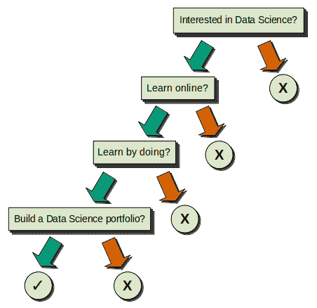

现在树已经被恰当地呈现了，我们可以继续探索它的结构。让我们关注我们看到的组件:

1)我们有四个正方形和五个圆圈，其中四个是负的(X)，一个是正的(1000)。所有这些都被称为**节点**。


*   顶部的方形节点被称为**根节点**，因为它不源自任何其他节点，也因为它是最重要的节点。当我们构建决策树时，这是预测能力最强的节点。注意，它被称为**根**，指的是一棵树的根，这就是为什么我们在本文的开头使用了一个倒置的树图像:这意味着决策树被解释为倒置的树！

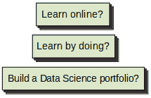

*   其余的方形节点被称为**内部节点**，它们的关键特征是它们总是源自前一个节点(它们是前一个节点的**子节点**)。同时，它们还生成后续节点(它们是那些后续节点的**父节点**)。


*   按照倒树的逻辑，我们将*始终*在圆形节点处结束，这些圆形节点被称为**终端节点**，或者最常见的是**叶节点**。因为它们是最终的，所以它们也总是子节点，因为它们不能生成更多的节点。这些叶子是至关重要的，因为它们告诉我们在这个过程中所做选择的结果。

2)对于每一个根节点和内部节点，都有两个箭头从其中出现，一个绿色，一个红色。除了根节点，我们在这个例子中有三个内部节点，所以我们总共得到八个箭头。这些箭头称为**分支**。


*   如果条件/问题的答案等于真，绿色箭头表示我们遵循的路径。例如，如果我们有一个问题“*你喜欢边做边学吗？*”而我们回答“是”，那么是真的，我们继续下面的左节点。

*   红色箭头代表相反的情况；所有等同于错误的条件/问题的答案继续到下面的正确节点。

记住这一点很重要，因为这对决策树来说是通用的: **Left == True** 。**对==错**。

现在我们已经描述了决策树的每个组成部分，我们可以再次回答这四个问题，看看我们的决策如何在图中流动。

其中一个问题是“*你喜欢边做边学吗？*“很明显，正如我们之前所表达的，我们[遵循那个原则](https://www.dataquest.io/blog/dataquest-active-curriculum-how-we-teach-data-science/)，所以在下一节中，我们将探索如何通过使用特定的数据集和强大的库`scikit-learn`，从头开始创建决策树！

## 数据集介绍

我们在这种情况下将使用的数据集是“*基于饮食习惯和身体状况的肥胖水平估计*”，可以在 [UCI 机器学习库](https://archive.ics.uci.edu/ml/datasets/Estimation+of+obesity+levels+based+on+eating+habits+and+physical+condition+)网站上找到，其中包括墨西哥、秘鲁和哥伦比亚的肥胖病例信息。

让我们加载它并检查第一个观察结果，以获得信息的一般概念:

```
import pandas as pd

df = pd.read_csv("ObesityDataSet_raw_and_data_sinthetic.csv")
df.iloc[:10, :11]
```

|  | 性别 | 年龄 | 高度 | 重量 | 超重的家庭历史 | FAVC | FCVC 的作用 | 新型冠状病毒肺炎（Novel coronavirus pneumonia） | CAEC | 烟 | CH2O | 单路调节器(single-channel controller) | FAF | TUE |
| --- | --- | --- | --- | --- | --- | --- | --- | --- | --- | --- | --- | --- | --- | --- |
| Zero | 女性的 | Twenty-one | One point six two | Sixty-four | 是 | 不 | Two | Three | 有时 | 不 | Two | 不 | Zero | One |
| one | 女性的 | Twenty-one | One point five two | Fifty-six | 是 | 不 | Three | Three | 有时 | 是 | Three | 是 | Three | Zero |
| Two | 男性的 | Twenty-three | One point eight | Seventy-seven | 是 | 不 | Two | Three | 有时 | 不 | Two | 不 | Two | One |
| three | 男性的 | Twenty-seven | One point eight | Eighty-seven | 不 | 不 | Three | Three | 有时 | 不 | Two | 不 | Two | Zero |
| four | 男性的 | Twenty-two | One point seven eight | Eighty-nine point eight | 不 | 不 | Two | One | 有时 | 不 | Two | 不 | Zero | Zero |
| five | 男性的 | Twenty-nine | One point six two | Fifty-three | 不 | 是 | Two | Three | 有时 | 不 | Two | 不 | Zero | Zero |
| six | 女性的 | Twenty-three | One point five | Fifty-five | 是 | 是 | Three | Three | 有时 | 不 | Two | 不 | One | Zero |
| seven | 男性的 | Twenty-two | One point six four | Fifty-three | 不 | 不 | Two | Three | 有时 | 不 | Two | 不 | Three | Zero |
| eight | 男性的 | Twenty-four | One point seven eight | Sixty-four | 是 | 是 | Three | Three | 有时 | 不 | Two | 不 | One | One |
| nine | 男性的 | Twenty-two | One point seven two | Sixty-eight | 是 | 是 | Two | Three | 有时 | 不 | Two | 不 | One | One |

```
df.iloc[:10, 11:]
```

|  | 计算(calculation) | MTRANS | NObeyesdad |
| --- | --- | --- | --- |
| Zero | 不 | 公共交通 | 正常体重 |
| one | 有时 | 公共交通 | 正常体重 |
| Two | 频繁地 | 公共交通 | 正常体重 |
| three | 频繁地 | 步行 | 超重 _ 一级 |
| four | 有时 | 公共交通 | 超重 _ 二级 |
| five | 有时 | 汽车 | 正常体重 |
| six | 有时 | 摩托车 | 正常体重 |
| seven | 有时 | 公共交通 | 正常体重 |
| eight | 频繁地 | 公共交通 | 正常体重 |
| nine | 不 | 公共交通 | 正常体重 |

我们还可以探索不同的栏目:

```
df.info()
```

```
 <class>RangeIndex: 2111 entries, 0 to 2110
Data columns (total 17 columns):
 #   Column                          Non-Null Count  Dtype  
---  ------                          --------------  -----  
 0   Gender                          2111 non-null   object 
 1   Age                             2111 non-null   float64
 2   Height                          2111 non-null   float64
 3   Weight                          2111 non-null   float64
 4   family_history_with_overweight  2111 non-null   object 
 5   FAVC                            2111 non-null   object 
 6   FCVC                            2111 non-null   float64
 7   NCP                             2111 non-null   float64
 8   CAEC                            2111 non-null   object 
 9   SMOKE                           2111 non-null   object 
 10  CH2O                            2111 non-null   float64
 11  SCC                             2111 non-null   object 
 12  FAF                             2111 non-null   float64
 13  TUE                             2111 non-null   float64
 14  CALC                            2111 non-null   object 
 15  MTRANS                          2111 non-null   object 
 16  NObeyesdad                      2111 non-null   object 
dtypes: float64(8), object(9)
memory usage: 280.5+ KB
```

我们可以看到数据集包含 17 列和 2111 个观察值。虽然有些列名是不言自明的，如**性别**、**年龄**、**身高**、**体重**、**家庭 _ 历史 _ 体重 _ 超重**(二进制:是/否)和**吸烟**(二进制:是/否)，但还有其他列名是缩写，因此我们需要澄清它们包含的信息:

*   *FAVC* :经常食用高热量食物(二元:是/否)。

*   *FCVC* :蔬菜消费频率(数字)

*   *NCP* :主餐数量(数字)

*   *CAEC* :两餐之间的食物消耗(序数:没有/有时/经常/总是)

*   *CH20* :日用水量(数字)

*   *CALC* :饮酒量(序数:没有/有时/经常/总是)

*   *SCC* :卡路里消耗监测(二进制:是/否)

*   *FAF* :身体活动频率(数字)

*   *TUE* :使用科技设备的时间(数字)

*   *MTRANS* :使用的交通工具(分类:公共交通、汽车、步行、摩托车、自行车)

至于目标列，它是**nobeeysdad**(肥胖级别)，以下是可能的类值，以及每个类的观察计数:

```
df["NObeyesdad"].value_counts()
```

```
Obesity_Type_I         351
Obesity_Type_III       324
Obesity_Type_II        297
Overweight_Level_I     290
Overweight_Level_II    290
Normal_Weight          287
Insufficient_Weight    272
Name: NObeyesdad, dtype: int64
```

由于`scikit-learn`要求我们只使用数字数据，我们需要预处理数据集，将特性列转换成数字。

## 准备数据集

如前所述，在本节中，我们将对数据集执行数据清理，为下一节构建机器学习模型做准备。

我们会经常用到**。value_counts()** 来自 pandas 库中的每个列，它返回每个特定列中所有不同值的计数。

在这种情况下，从我们的 2111 个总观察值中，我们看到对于“性别”列，我们有 1068 个男性和 1043 个女性。

```
# "GENDER" COLUMN

df["Gender"].value_counts()
```

```
Male      1068
Female    1043
Name: Gender, dtype: int64
```

由于该列是二进制的(它只包含两个可能的值)，我们可以通过使它成为*布尔值*来将其转换为数值。

我们这样做是通过选择我们想要的任何性别(在这个例子中，我们选择了*女性*)并且如果它等于假(也就是说，如果它是男性)，用 0 代替每个观察，如果观察等于真(观察是关于女性)，用 1 代替。

最后，我们将重命名列 *female* 以反映这一变化并避免将来的混淆:

```
df["Gender"].replace({"Male": 0, "Female": 1}, inplace = True)

df.rename(columns = {"Gender": "female"}, inplace = True)
```

为了谨慎起见，我们将使用**仔细检查数据转换是如何进行的。value_counts()** 再次出现。请注意我们现在如何使用新的列名:

```
# Double Check

df["female"].value_counts()
```

```
0    1068
1    1043
Name: female, dtype: int64
```

我们可以确认转化是成功的。我们有 1068 个代表男性的假/0 观察值和 1043 个代表女性的真/1 观察值。这与转换前的原始值计数相匹配。

让我们将相同的步骤应用于下一列:

```
# "FAMILY HISTORY WITH OVERWEIGHT" COLUMN

df["family_history_with_overweight"].value_counts()
```

```
yes    1726
no      385
Name: family_history_with_overweight, dtype: int64
```

```
df["family_history_with_overweight"].replace({"no": 0, "yes": 1}, inplace = True)

df.rename(columns = {"family_history_with_overweight": "family_history_overweight"}, inplace = True)
```

```
# Double Check

df["family_history_overweight"].value_counts()
```

```
1    1726
0     385
Name: family_history_overweight, dtype: int64
```

我们将继续执行相同的步骤，但是在这种情况下，我们不需要重命名该列:

```
# "FREQUENT CONSUMPTION OF HIGH CALORIC FOOD" COLUMN

df["FAVC"].value_counts()
```

```
yes    1866
no      245
Name: FAVC, dtype: int64
```

```
df["FAVC"].replace({"no": 0, "yes": 1}, inplace = True)
```

```
# Double Check

df["FAVC"].value_counts()
```

```
1    1866
0     245
Name: FAVC, dtype: int64
```

下面的列是一个更复杂的情况，因为我们不仅有两个以上的唯一值(换句话说，它不再是二进制的)，而且不同的值通过一个层次结构(在本例中是频率)相互关联:

*不>有时>频繁>总是*

这是一个*序数列*的明显例子。

```
# "CONSUMPTION OF FOOD BETWEEN MEALS" COLUMN

df["CAEC"].value_counts()
```

```
Sometimes     1765
Frequently     242
Always          53
no              51
Name: CAEC, dtype: int64
```

在这种情况下，当将数据转换为数值时，我们可以通过使用连续的数字来反映这种层次结构，从最低值 0 开始，以最高值的最高数字结束。

*否== 0*

*有时== 1*

*频繁== 2*

*总是== 3*

这是一个非常简单的解释，我们将在[决策树课程](https://app.dataquest.io/course/random-forest-modeling-in-python)中更详细地介绍这个主题。

```
from sklearn.preprocessing import OrdinalEncoder

ordinal_caec = [["no", "Sometimes", "Frequently", "Always"]]

df["CAEC"] = OrdinalEncoder(categories = ordinal_caec).fit_transform(df[["CAEC"]])
```

我们可以确认在转换为数值的过程中保留了层次结构:

```
# Double Check

df["CAEC"].value_counts()
```

```
1.0    1765
2.0     242
3.0      53
0.0      51
Name: CAEC, dtype: int64
```

下面的专栏是二进制的，所以暂时没有太多讨论。我们将简单地应用与上面相同的步骤:

```
# "SMOKE" COLUMN

df["SMOKE"].value_counts()
```

```
no     2067
yes      44
Name: SMOKE, dtype: int64
```

```
df["SMOKE"].replace({"no": 0, "yes": 1}, inplace = True)
```

```
# Double Check

df["SMOKE"].value_counts()
```

```
0    2067
1      44
Name: SMOKE, dtype: int64
```

* * *

```
# "CALORIES CONSUMPTION MONITORING" COLUMN

df["SCC"].value_counts()
```

```
no     2015
yes      96
Name: SCC, dtype: int64
```

```
df["SCC"].replace({"no": 0, "yes": 1}, inplace = True)
```

```
# Double Check

df["SCC"].value_counts()
```

```
0    2015
1      96
Name: SCC, dtype: int64
```

下一列也是有序的，因为它与前一列共享完全相同的层次结构(频率)，所以我们将执行与前一列相同的步骤:

```
# "CONSUMPTION OF ALCOHOL" COLUMN

df["CALC"].value_counts()
```

```
Sometimes     1401
no             639
Frequently      70
Always           1
Name: CALC, dtype: int64
```

```
from sklearn.preprocessing import OrdinalEncoder

ordinal_calc = [["no", "Sometimes", "Frequently", "Always"]]

df["CALC"] = OrdinalEncoder(categories = ordinal_calc).fit_transform(df[["CALC"]])
```

```
# Double Check

df["CALC"].value_counts()
```

```
1.0    1401
0.0     639
2.0      70
3.0       1
Name: CALC, dtype: int64
```

在最后一篇专栏文章中，我们有另一个特例:虽然我们有两个以上不同的值，但是这里没有层次结构。不同的值代表不同的选项，这些选项通过层次结构彼此不相关。他们在这个意义上是独立的。因此，列是*分类的*。

```
# "TRANSPORTATION USED" COLUMN

df["MTRANS"].value_counts()
```

```
Public_Transportation    1580
Automobile                457
Walking                    56
Motorbike                  11
Bike                        7
Name: MTRANS, dtype: int64
```

因为我们不能给每个值分配不同的数字，因为这将创建一个无意的层次结构，在这种情况下，我们必须为每个值创建一个新列；然后，我们将使用*布尔*方法:如果观察提到了某个交通工具，那么引用该交通工具类型的相应列将具有“1”，而其余的列将具有“0”。当我们*再次检查*时，我们将会看到这看起来如何。

这是执行操作的必要代码，由于其复杂性，将在[决策树课程](https://app.dataquest.io/course/random-forest-modeling-in-python)中详细分析。

```
from sklearn.preprocessing import OneHotEncoder
from sklearn.compose import make_column_transformer

col_trans = make_column_transformer((OneHotEncoder(), ["MTRANS"]), 
                                    remainder = "passthrough", 
                                    verbose_feature_names_out = False)

onehot_df = col_trans.fit_transform(df)

df = pd.DataFrame(onehot_df, columns = col_trans.get_feature_names_out())
```

值得注意的是，在这个转换过程中，包含所有不同值的列(“MTRANS”)将被删除，因为不再需要它了。

让我们检查转换。我们现在有五个不同的列，而不是“MTRANS”，每一列代表“MTRANS”的一个可能值: *MTRANS_Automobile* 、 *MTRANS_Bike* 、*m trans _ 摩托车*、*m trans _ 公共交通*和*m trans _ 步行*。

```
# Double Check

df.iloc[:10, :9]
```

|  | 汽车运输 | 自行车运输 | 摩托车运输 | MTRANS _ 公共交通 | MTRANS _ 步行 | 女性的 | 年龄 | 高度 | 重量 |
| --- | --- | --- | --- | --- | --- | --- | --- | --- | --- |
| Zero | Zero | Zero | Zero | One | Zero | one | Twenty-one | One point six two | Sixty-four |
| one | Zero | Zero | Zero | One | Zero | one | Twenty-one | One point five two | Fifty-six |
| Two | Zero | Zero | Zero | One | Zero | Zero | Twenty-three | One point eight | Seventy-seven |
| three | Zero | Zero | Zero | Zero | One | Zero | Twenty-seven | One point eight | Eighty-seven |
| four | Zero | Zero | Zero | One | Zero | Zero | Twenty-two | One point seven eight | Eighty-nine point eight |
| five | One | Zero | Zero | Zero | Zero | Zero | Twenty-nine | One point six two | Fifty-three |
| six | Zero | Zero | One | Zero | Zero | one | Twenty-three | One point five | Fifty-five |
| seven | Zero | Zero | Zero | One | Zero | Zero | Twenty-two | One point six four | Fifty-three |
| eight | Zero | Zero | Zero | One | Zero | Zero | Twenty-four | One point seven eight | Sixty-four |
| nine | Zero | Zero | Zero | One | Zero | Zero | Twenty-two | One point seven two | Sixty-eight |

例如，对于第一次观察，由于那个人使用公共交通，相应的*MTRANS _ Public _ Transportation*列被标记为 1(“真”)，其他四列被标记为 0(“假”)。

```
df.iloc[:10, 9:]
```

|  | 家族史超重 | FAVC | FCVC 的作用 | 新型冠状病毒肺炎（Novel coronavirus pneumonia） | CAEC | 烟 | CH2O | 单路调节器(single-channel controller) | FAF | TUE | 计算(calculation) | NObeyesdad |
| --- | --- | --- | --- | --- | --- | --- | --- | --- | --- | --- | --- | --- |
| Zero | one | Zero | Two | Three | One | Zero | Two | Zero | Zero | One | Zero | 正常体重 |
| one | one | Zero | Three | Three | One | one | Three | one | Three | Zero | One | 正常体重 |
| Two | one | Zero | Two | Three | One | Zero | Two | Zero | Two | One | Two | 正常体重 |
| three | Zero | Zero | Three | Three | One | Zero | Two | Zero | Two | Zero | Two | 超重 _ 一级 |
| four | Zero | Zero | Two | One | One | Zero | Two | Zero | Zero | Zero | One | 超重 _ 二级 |
| five | Zero | one | Two | Three | One | Zero | Two | Zero | Zero | Zero | One | 正常体重 |
| six | one | one | Three | Three | One | Zero | Two | Zero | One | Zero | One | 正常体重 |
| seven | Zero | Zero | Two | Three | One | Zero | Two | Zero | Three | Zero | One | 正常体重 |
| eight | one | one | Three | Three | One | Zero | Two | Zero | One | One | Two | 正常体重 |
| nine | one | one | Two | Three | One | Zero | Two | Zero | One | One | Zero | 正常体重 |

最后，我们不需要将目标列“NObeyesdad”转换为 numeric，因为它显示了决策树试图预测的可能的类。

## 构建我们自己的决策树

是一个非常标准化的库，这意味着它允许我们用几行代码实例化和训练我们的机器学习模型。这也适用于决策树。

提醒一下，`scikit-learn`使用 **CART** 算法，代表**分类和回归树**；因此，我们可以建立决策树来预测分类和回归问题！

简单回顾一下，当我们说分类时，我们指的是预测分类标签，它可以是二元的(例如，正/负、开/关、真/假等。)或有限数量的类别(例如，颜色、季节、月份等。)，而回归指的是预测数字量(例如，价格、年龄、距离等)。).

在这种情况下，我们将坚持使用分类树，因为数据集在其目标列中包含类/类别。

```
df["NObeyesdad"].unique()
```

```
array(['Normal_Weight', 'Overweight_Level_I', 'Overweight_Level_II',
       'Obesity_Type_I', 'Insufficient_Weight', 'Obesity_Type_II',
       'Obesity_Type_III'], dtype=object)
```

`scikit-learn`创建机器学习模型的第一步是在特征列(`X`)和目标列(`y`)之间划分数据集。注意，我们从`X`中删除了“NObeyesdad”列，因为它包含目标值。

```
X = df.drop(["NObeyesdad"], axis = 1)
y = df["NObeyesdad"]
```

现在我们将导入决策树模型进行分类，以及`train_test_split`。

```
from sklearn.tree import DecisionTreeClassifier
from sklearn.model_selection import train_test_split
```

`train_test_split`是一个工具，它允许我们将数据集分为四个部分，这些部分将存储在不同的变量中:`X_train`和`y_train`包含训练模型的观察值，而`X_test`和`y_test`包含测试模型准确性的观察值。

`test_size`参数设置用于测试目的的数据集观察值的百分比。在这种情况下，`0.2`是一个常用的比例，即总人数的 20%。

至于`random_state`，它只是一个确保结果可再现性的数字，因此你会经常看到它是不同函数的参数。

```
X_train, X_test, y_train, y_test = train_test_split(X, y, test_size = 0.2, random_state = 14)
```

现在，我们的决策树诞生了！

需要考虑的一件重要事情是:虽然在其他机器学习算法中不包含任何参数可能很常见，但在决策树的情况下，我们需要为`max_depth`参数设置一个值。

此参数决定了树的深度。换句话说，它*修剪*几个内部节点，以避免一种叫做*过度拟合*的不良现象，当树适应数据集如此之近，以至于它无法对看不见的数据进行预测时，就会发生这种情况。

在这种情况下，`max_depth = 4`表示我们将把树限制在四个级别:根节点、两个中间级别和最后一个级别，即叶子所在的级别。

```
tree = DecisionTreeClassifier(max_depth = 4, random_state = 14)
```

太棒了。现在树已经存在，我们将使用存储在`X_train`和`y_train`中的训练数据来训练它:

```
tree.fit(X_train, y_train)
```

现在我们需要知道生成的树在准确性方面是否足够好(它预测看不见的数据有多好)。我们可以通过使用`score`方法快速确定这一点，决策树与其他机器学习算法共享该方法。

```
tree.score(X_test, y_test)
```

```
0.7848699763593381
```

注意生成和评估决策树所需的代码行很少:只有八行！绝对让这个过程变得非常简单！

关于分数:虽然完美值是 1.0，但在现实生活中它是不可能达到的(或者更糟:如果我们真的达到了，这意味着我们的机器学习模型过度拟合了！).尽管没有明确的标准，而且每个数据情况都不一样，但总的来说，我们可以确信，高于 0.7 的准确度分数表明该模型非常好，这就是我们在这里得到的结果！

但我们还必须考虑我们正在处理的主题:因为它与健康相关，所以“相当好”必须是进一步优化的起点，因为我们需要确保最高可能的准确性(即，理想情况下大约 0.95)，因为对观察结果进行错误分类可能最终会在现实生活中产生真正不利的后果。在这种情况下，我们需要极其谨慎地行事。

在接下来的部分中，我们将探索这个小旅程的最后一个阶段，即可视化决策树并从中获得洞察力！

## 可视化树

一如既往，`scikit-learn`确保我们的机器学习任务变得直接和标准化，可视化决策树也不例外！

在这种情况下，我们将使用`plot_tree`工具，但是我们也将使用与数据可视化相关的附加库`matplotlib`。这将允许我们使用`figure`方法调整图像大小。

除了初始代码之外，下面是我们需要编写的参数，以便定制树的可视化:

*   **decision_tree** :决策树被实例化的变量。

*   **feature_names** :特性栏目的名称，**可以通过`X.columns`快速进入**。

*   **class_names** :目标列中的类/类别的名称，可以通过`tree.classes_`快速访问(如果您的决策树是用另一个变量名创建的，您可以相应地替换变量名)。

*   **filled** :如果设置为 True，这个参数给每个类分配一个不同的颜色，每个节点将被涂上主导类的颜色。此外，颜色可能更浓或更淡，取决于该类在该节点中的主导地位。

*   **fontsize** :节点内部的字体大小。

*   **杂质**:(我们将此设置为 False 以省略一条特定的信息；由于这是一篇介绍性文章，解释这个值将大大延长文章的长度。此外，我们需要深入研究更复杂的解释)。

关于`_`变量的一个重要澄清:虽然可以直接使用`plot_tree`而不用将函数赋给变量，但这将在可视化之前创建冗长的文本，这是我们希望避免的，以确保更清晰的显示。

一旦我们完成定制这些参数，我们就用`plt.show()`正式绘制决策树。

```
from sklearn.tree import plot_tree
import matplotlib.pyplot as plt

plt.figure(figsize = [24.0, 12.0])

_ = plot_tree(
          decision_tree = tree, 
          feature_names = X.columns, 
          class_names =  tree.classes_,
          impurity = False,
          filled = True,  
          fontsize = 11) 

plt.show()
```

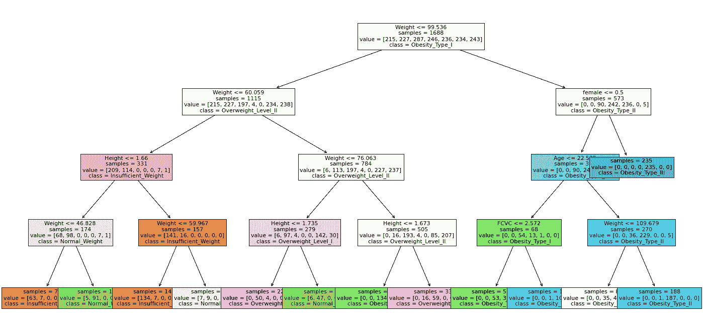

每个节点显示的信息肯定比我们在文章开头使用的理论图更全面，所以让我们仔细分析一下我们在这里看到的内容，以澄清任何困惑:

*   每个节点中的最上面一行表示用于分割决策路径的条件。由于`scikit-learn`只对数字信息起作用，这个条件将总是被转换成一个**阈值**。换句话说，你更喜欢通过做来学习，而不是像“*这样的问题？*”，我们将始终有一个列名和一个与特定数字的比较。

例如，如果我们的权重< = 76.063，那么权重低于或等于 76.063 的所有观察值都将被评估为真，因此我们将继续左边的子节点。另一方面，值高于 76.063 的所有观察值将评估为假，并且我们将继续到右边的子节点(即，78 <= 76.063 评估为假，因为 78 是高于 76.063 的数字)。

记住: **Left == True。Right == False** ！

*   **样本**字段是指拆分信息后，在该节点下分类的观测值总数。

从这个意义上说，根节点中的“样本”字段将总是等于数据集的观察总数。(注意，这里我们只有 1688 个观察值，而不是 2111 个，因为我们出于测试目的隔离了一些观察值！)

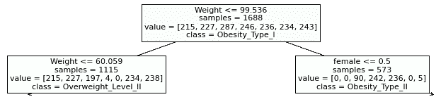

如果我们检查下面级别中的两个节点，我们会看到左边的子节点有 1115 个观察值等于真，而右边的子节点有 573 个观察值等于假。如果我们对它们求和(1115 + 573 ),我们将得到 1688，即来自根节点的*样本*值。

*   **值**字段过滤来自*样本*的数字，以指示每个目标类的观察数量。例如，如果我们关注根节点，并且我们对来自*值*字段的所有数字求和，我们将得到*样本*数字。这个规则适用于*的所有*节点。

    为了确定每个数字属于哪个目标类，我们必须将顺序与`classes_`属性中的顺序进行匹配:

```
tree.classes_
```

```
array(['Insufficient_Weight', 'Normal_Weight', 'Obesity_Type_I',
       'Obesity_Type_II', 'Obesity_Type_III', 'Overweight_Level_I',
       'Overweight_Level_II'], dtype=object)
```

例如，如果我们有来自根节点的值`[215, 227, 287, 246, 236, 234, 243]`，我们将像这样匹配它们:

```
values = [215, 227, 287, 246, 236, 234, 243]
classes = tree.classes_
list(zip(classes, values))
```

```
[('Insufficient_Weight', 215),
 ('Normal_Weight', 227),
 ('Obesity_Type_I', 287),
 ('Obesity_Type_II', 246),
 ('Obesity_Type_III', 236),
 ('Overweight_Level_I', 234),
 ('Overweight_Level_II', 243)]
```

*   最后，我们有**类**字段，它指示每个节点中的主要目标类。

    请注意，正如我们之前所表达的，`scikit-learn`为每个目标类分配了一种特定的颜色，因此，例如，*权重不足的*类具有深浅不同的棕色节点，这取决于该类在每个节点中的支配地位。

    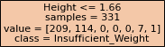

    例如，对于中间左侧的节点*高度< = 1.66* ，尽管该类在那里有 209 个观察值(高于其他棕色节点)，但因为下面的类(*正常权重*)也有大量的观察值(114)，*权重不足*在那里并不占优势，并且它的颜色更浅，尽管与其他棕色节点相比，该目标类有更多的观察值。

    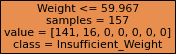

    另一方面，也是最重要的，如果我们想要预测我们自己的观察结果，我们需要到达一个叶节点并读取那里的类，以了解我们的观察结果属于哪个目标类。

既然我们已经看到了绘制的决策树的每个组件，我们将使用它来预测这些女性的体重分类:

1) *瓜达卢佩，体重 75，身高 1.80*


*(在[生成的图像此人不存在](https://thispersondoesnotexist.com/)。)*

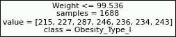

首先我们有根节点，*权重< = 99.536* 。Guadalupe 权重为 75，因此阈值条件评估为 True，我们下降到左侧子节点。

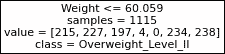

在那里我们有一个阈值*权重< = 60.059* ，所以 *75 < = 60.059* 评估为假，在这种情况下，我们下降到正确的子节点。

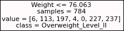

在第三个节点中，我们有*权重< = 76.063* ，所以 *75 < = 76.063* 计算为真，我们下降到左边的子节点。

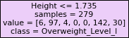

第四个节点的阈值是*高度< = 1.735* ，所以 *1.80 < = 1.735* 求值为假，我们到达正确的子节点，也就是叶子，目标类是*正常权重*。

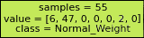

所以瓜达卢佩的体重很健康！

2) *卡蜜拉，体重 111*


*(在[生成的图像此人不存在](https://thispersondoesnotexist.com/)。)*


首先我们有根节点，*权重< = 99.536* 。卡蜜拉体重 111，因此阈值条件评估为假，我们下降到正确的子节点。

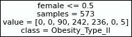

在这第二个节点中，阈值表示*女< = 0.5* 。考虑到当我们预处理数据时，我们改变了*性别*列使其为数字，现在该列被重命名为*女性*，而不是*男性/女性*，如果为假(*男性*)则值为 0，如果为真(*女性*)则值为 1。

所以，因为这个，*女*求值为 1，所以 *1 < = 0.5* 求值为假，我们下降到右边的子节点，也就是叶子，目标类是 *Obesity_Type_III* :

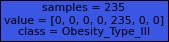

不幸的是，卡蜜拉没有一个最佳体重。

* * *

## 结论

决策树是最受欢迎的机器学习算法之一，这是因为与其他算法相比，它们相对更容易理解，因为我们可以构建它们洞察力的图形表示。

在这篇博文中，我们介绍了以下内容:

*   决策树的整体结构。

*   如何解读决策树？

*   如何用`scikit-learn`创建自己的决策树？

*   如何可视化我们自己的决策树？

然而，这只是一篇介绍性的文章；这些和其他方面将在我们专门针对决策树的[课程中深入讨论。除了以上几点之外，这里还详细探讨了其他一些主题:](https://app.dataquest.io/course/random-forest-modeling-in-python)

*   决策树是如何在表面下生成的。

*   训练决策树的数据预处理(包括一些不广为人知的有用的`scikit-learn`工具！)

*   创建分类**和**回归树。

*   决策树的优点和缺点。

*   决策树的效率评估，包括交叉验证的方法。

*   *决策树的修剪*和优化。

*   集合技术，包括随机森林和额外的树。

如果您有兴趣了解更多信息，您可以在下面的链接中找到更多信息。