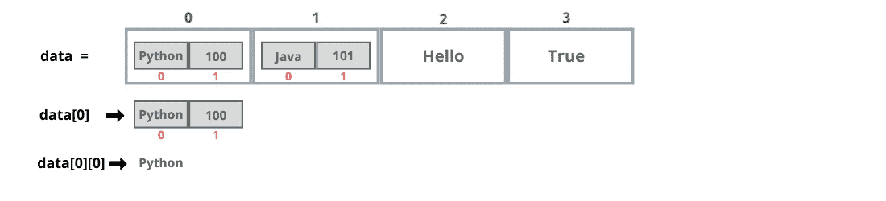
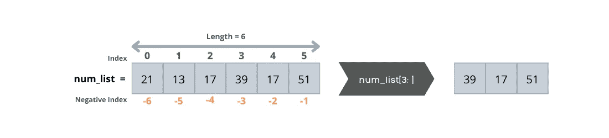
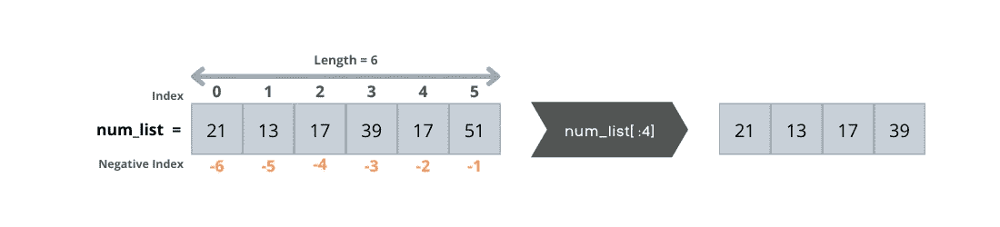
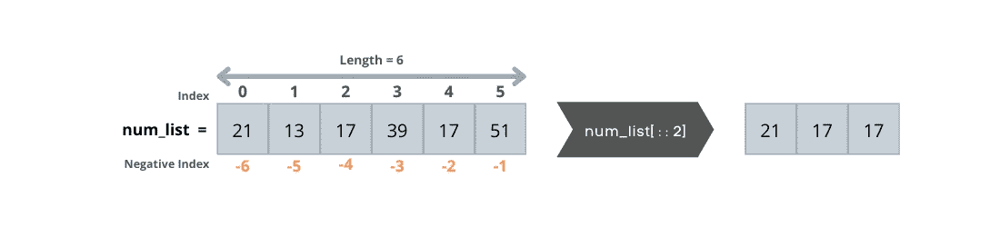
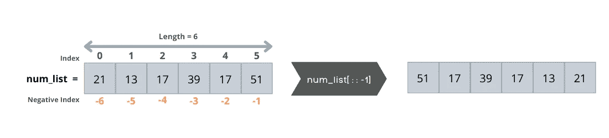

# 教程:揭秘 Python 列表

> 原文：<https://www.dataquest.io/blog/tutorial-demystifying-python-lists/>

January 28, 2022

在本教程中，您将学习如何使用 Python 列表，这是 Python 中最强大的数据类型之一。

完成本教程后，您将了解以下内容:

*   如何定义 Python 列表
*   如何创建 Python 列表以及访问或更改列表中的项目
*   如何创建列表列表
*   如何分割列表
*   如何在列表中添加或删除项目
*   如何使用 for 循环迭代列表中的项目

在本教程中，我们假设您了解 Python 的基础知识，包括变量、数据类型和基本结构。如果你不熟悉这些或者渴望提高你的 Python 技能，请在 Python 课程中尝试我们的[变量、数据类型和列表。](https://www.dataquest.io/course/variables-data-types-and-lists-in-python/)

## 什么是 Python 列表？

Python 列表是一个变量名下的异构元素(项目)的可变集合。在这个上下文中，可变性意味着当程序运行时，列表中的元素可以改变。我们还可以随时在列表中添加或删除元素。在 Python 中，我们通过将元素括在方括号中并用逗号分隔来定义列表。每个列表的元素都有一个索引，表示元素在列表中的位置，起始索引为零。

## 创建 Python 列表

要定义 Python 列表，需要使用以下语法:

```py
variable_name = [item1, item2, item3, … , itemN]
```

作为一个例子，让我们创建我们的第一个 Python 列表。

```py
shopping_list = ["eggs", "milk", "bread", "butter"]
```

上面的代码实现了一个包含四个元素的 Python 列表，这四个元素都是字符串。现在，让我们创建一个只保存购物清单上商品价格的列表。

```py
price_list = [13.99, 8.50, 7.90, 12.50]
```

正如我们在 Python 列表的定义中提到的，列表项不必都是相同的数据类型。它们可以是任何对象，因为在 Python 中一切都是对象。

```py
a_mixed_list = ["dataquest.io", 100, "python.org", 10.01, True, 'A']
```

现在，让我们检查这些列表的数据类型:

```py
print(type(shopping_list))
print(type(price_list))
print(type(a_mixed_list))
```

继续，运行代码。无论列表中存储的是哪种数据类型，所有的`type()`函数都返回`<class 'list'>`，这是列表对象的数据类型。

## 访问 Python 列表中的项目

正如我们所看到的，列表中的每一项都有自己的索引，所以可以使用相关的索引来检索它们。让我们试试代码:

```py
print(shopping_list[0])
print(price_list[2])
```

运行代码；它输出`eggs`和`7.90`。第一个值是`eggs`,因为它是购物列表中索引为 0 的第一个项目，第二个值是`7.90`,因为它是价格列表中索引为 2 的第三个项目。下图显示了一个包含六个整数元素及其从零开始的索引的列表。很高兴知道 Python 支持负索引，这意味着最后一个元素的索引是`-1`，倒数第二个元素的索引是`-2`，倒数第六个元素的索引是`-k`。


让我们首先定义`num_list`列表，然后看一些例子:

```py
num_list = [21, 13, 17, 39, 17, 51]
print(num_list[-1])
print(num_list[0])
print(num_list[-6])
```

现在运行代码，并检查其输出。第一个`print`语句返回`51`，这是列表中的最后一个元素，最后两个`print`语句返回`21`，因为两个语句都引用了列表的第一个元素。有时候，我们需要知道一个列表中有多少个元素。为此，我们使用`len()`函数，就像这样:

```py
print("The length of the list is {}.".format(len(num_list)))
```

运行代码输出`The length of the list is 6`，因为列表中的元素数量是 6。

## 更改列表中的值

修改列表中的项就像将变量重新声明为一个新值。让我们看下面的例子:

```py
num_list = [21, 13, 17, 39, 17, 51]
print(num_list)
num_list[4] = 33
print(num_list)
```

在上面的代码中，在我们修改索引 4 处的值之前，它输出`[21, 13, 17, 39, 17, 51]`，在将索引 4 处的值更改为 33 之后，它输出 `[21, 13, 17, 39, 33, 51]`。换句话说，我们的代码选择了位置 4 的项目，并将其值设置为 33。

## 创建列表的列表

在 Python 中，我们可以将列表存储在另一个列表中(嵌套列表)。为了检查我们如何创建嵌套列表，让我们尝试下面的代码，它使一个列表包含具有不同数据类型的其他列表和值。

```py
data = [["Python", 100], ["Java", 101], "Hello", True]
print(data)
print(data[1])
```

运行代码，并检查其输出。

```py
['Python', 100], ['Java', 101], 'Hello', True]
['Java', 101]
```

第一行显示了存储在 `data`变量中的整个列表，第二行显示了`data`的第二个元素，它本身是一个包含两个元素的列表。到目前为止，您已经学习了如何创建嵌套列表。但是如果我们想从内部列表中检索一个特定的元素呢？在 Python 中，为了访问列表中的一个条目，我们将条目的索引放在一对方括号中。但是，如果项目在内部列表中，我们必须在第一组方括号之后添加第二组方括号。让我们来看一个例子:

```py
print(data[0][0])
inner_list = data[1]
print(inner_list[0])
```

运行上面的代码输出`Python`和`Java`。在第一行代码中，第一组方括号之间的第一个索引引用的是`data`列表中的第一项，它本身就是一个列表，第二组方括号之间的第二个索引引用的是内部列表的第一个值，这就产生了`Python`。下图显示了如何从`data`列表中检索到`Python`。


在第二行代码中，`data`列表的索引 1 处的值，它本身也是一个分配给`inner_list`变量的列表；然后在最后一行，我们正在访问存储在 `inner_list`变量中的内部列表的第一个元素，即`Java`。下图显示了如何从`data`列表中检索到`Java`。



## 切片列表

Python 允许我们使用切片技术创建列表子集。为了创建一个列表片，我们指定第一个和最后一个条目的索引。从第一个索引到最后一个索引(不包括最后一个索引)的项被复制到切片中，很明显，这种复制不会修改原始列表。分割列表有不同的方式；让我们来看看其中的一些。

### 使用起始索引进行切片

省略结束索引意味着切片包含从开始索引到列表结尾的列表元素。让我们来看看:

```py
num_list = [21, 13, 17, 39, 17, 51]
print(num_list[3:])
```



### 使用结束索引切片

省略起始索引意味着切片包含从列表开头到结束索引的列表元素。让我们试试代码:

```py
num_list = [21, 13, 17, 39, 17, 51]
print(num_list[:4])
```



* * *

**注**

省略起始和结束索引会导致整个列表。

```py
print(num_list[:])
[21, 13, 17, 39, 17, 51]
```

* * *

### 分步切片

我们可以使用一个步骤在指定的时间间隔返回项目。步长是可选的，默认情况下为 1。以下代码返回`num_list`的每隔一项。

```py
num_list = [21, 13, 17, 39, 17, 51]
print(num_list[ : :2])
```



### 用负步长反转列表

我们可以通过将步骤指定为-1 来反转列表。下面的代码以相反的顺序返回`num_list`项。

```py
num_list = [21, 13, 17, 39, 17, 51]
print(num_list[ : :-1])
```



* * *

**注**

在上面的代码中，虽然我们没有指定开始和结束索引，但两者都被假定为负索引，如下所示:

```py
print(num_list[-1:-9:-1])
[51, 17, 39, 17, 13, 21]
```

* * *

## 向列表中添加项目

向列表中添加新项目有两种方法，`insert()`和`append()`方法。新项目可以是一个字符串、一个数字，甚至是另一个列表。我们可以使用这两种方法来扩展列表。

### 。插入()

方法在列表中的指定位置添加一个条目。让我们看看它是如何工作的。

```py
fruits = ["apple", "orange", "cherry"]
fruits.insert(1, "pineapple")
print(fruits)
```

上面的代码将`pineapple`插入到列表中的索引 1 处，并输出如下:`['apple', 'pineapple', 'orange', 'cherry']`

### 。追加()

方法在列表的末尾添加一个条目。我们去看看。

```py
fruits = ["apple","orange","cherry"]
fruits.append("pineapple")
print(fruits)
```

上面的代码在列表的末尾添加了`pineapple`并将其打印出来。`['apple', 'orange', 'cherry', 'pineapple']`

* * *

**注**

您可以使用`+=`操作符在列表末尾添加一个对象列表。如果`+=`的左操作数是一个列表，那么右操作数必须是一个列表或者任何其他可迭代的对象。

```py
students = ["Mary", "James","Patricia"]
students += ["Robert"]
students += ["Emma", "William"]
print(students)
['Mary', 'James', 'Patricia', 'Robert', 'Emma', 'William']
```

学生姓名两边的方括号在第二行创建了一个单元素列表，使用`+=`操作符将它附加到`students`列表中。同样，第三行将两个`students`的列表追加到学生列表中。我们还可以使用`+`操作符连接两个列表。结果是一个新的列表，包含 A 类的学生，后面跟着 b 类的学生。

```py
classA = ["Mary", "James","Patricia"]
classB = ["Robert", "Emma", "William"]
students = classA + classB
print(students)
['Mary', 'James', 'Patricia', 'Robert', 'Emma', 'William']
```

* * *

## 从列表中删除项目

从列表中移除条目有两种主要的方法，`pop()`和`remove()`方法。

### 。流行()

`pop()`方法从列表中移除指定索引处的项目，并返回该项目，该项目可以被赋给一个变量供以后使用。索引的默认值是-1，这意味着如果没有提供索引值，它将删除最后一项。

```py
fruits = ["apple", "orange", "cherry", "pineapple"]

second_fruit = fruits.pop(1) # removes the second item
last_fruit = fruits.pop() # removes the last item

print("Second Fruit is {}.".format(second_fruit))
print("Last Fruit is {}.".format(last_fruit))
print(fruits)
```

上面的代码删除了两项:第一项在索引 1 处，第二项在列表的末尾。此外，当从列表中弹出这些项目时，它将它们保存到`second_fruit`和`last_fruit`变量中，稍后将它们与修改后的`fruits`列表一起打印出来。

```py
Second Fruit is orange.
Last Fruit is pineapple.
['apple', 'cherry']
```

### 。移除()

`remove()`方法删除具有指定值的元素的第一次出现。

```py
fruits = ["apple", "orange", "cherry", "pineapple"]
fruits.remove('cherry')
print(fruits)
```

运行代码输出没有“cherry”的`fruits`列表，因为`remove()`方法成功地移除了它。

```py
['apple', 'orange', 'pineapple']
```

但是如果我们要移除的项目不在列表中会发生什么呢？让我们运行下面的代码，看看结果:

```py
fruits = ["apple", "orange", "cherry", "pineapple"]
fruits.remove('blueberry')
print(fruits)
```

代码会引发一个错误，指出该值不在列表中。让我们看看如何通过使用 try-except 块捕捉异常来修复它。

```py
fruits = ["apple", "orange", "cherry", "pineapple"]
try:
  fruits.remove('blueberry')
  print(fruits)
except:
  print("The fruit name does not exist in the list.")
```

运行代码。这一次我们的代码没有崩溃，它输出了一条正确的消息，表明列表中不存在该项目(水果名称)。

```py
The fruit name does not exist in the list.
```

### `in`和`not in`运算符

基本上，`in`操作符检查指定的值是否在列表中。当在一个条件中使用`in`运算符时，该语句返回一个布尔值，计算结果为`True`或`False`。当在列表中找到指定的值时，语句返回`True`；否则返回`False`。

```py
num_list = []
if not num_list:
  print(“The list is empty.”)
```

由于`num_list`为空，代码输出“列表为空”。

* * *

**注**

我们可以通过给变量分配空方括号来创建一个空列表。空列表的长度为零，我们总是可以使用`append()`或`insert()`方法向空列表添加元素。

* * *

### `for`循环和列表

我们可以使用`for`循环来遍历一个项目列表，一次获取一个项目，直到没有其他项目需要处理。让我们看看代码。

```py
fruits = ["apple", "orange", "cherry", "pineapple"]
for fruit in fruits:
  print(fruit)
```

运行上面的代码将列表中的每一项打印在单独的一行上。换句话说，对于`fruits`列表中的每个水果，它打印水果的名称。

```py
apple
orange
cherry
pineapple
```

### 结论

在本教程中，您学习了如何通过简单明了的代码片段使用 Python 列表。我们将在接下来的教程中探讨一些高级技术。