# 教程:R 和 RStudio 入门

> 原文：<https://www.dataquest.io/blog/tutorial-getting-started-with-r-and-rstudio/>

August 5, 2020

在本教程中，我们将学习如何使用 RStudio 开始 R 编程。我们将安装 [R](https://www.r-project.org/) 和 RStudio [RStudio](https://rstudio.com/products/rstudio/) ，这是一个非常流行的 R 开发环境。我们将学习 RStudio 的关键特性，以便自己开始用 R 编程。

如果你已经知道如何使用 RStudio，并想学习一些技巧、诀窍和快捷方式，请查看这篇 Dataquest 博客文章。

## 目录

*   [1。安装 R](#tve-jump-173bb251cef)
*   [2。安装 RStudio](#tve-jump-173bb25517c)
*   [3。先看 RStudio](#tve-jump-173bb2584fe)
*   [4。控制台](#tve-jump-173bb25b418)
*   [5。全球环境](#tve-jump-173bb25e50b)
*   [6。安装`tidyverse`软件包](#tve-jump-173bb26184b)
*   [7。将`tidyverse`包载入内存](#tve-jump-173bb264c2b)
*   [8。识别加载的包](#tve-jump-173bb26816f)
*   [9。获得关于软件包的帮助](#tve-jump-173bb26b47b)
*   10。获取功能帮助
*   [11。RStudio 项目](#tve-jump-173bb271486)
*   [12。保存您的“真实”工作。其余删除。](#tve-jump-173bb274fa1)
*   13。r 脚本
*   [14。运行代码](#tve-jump-173bb27b78f)
*   15。访问内置数据集
*   16。风格
*   [17。可复制的报告，R 降价](#tve-jump-173bb286b87)
*   18。使用 RStudio 云
*   [19。把手弄脏！](#tve-jump-173bb28c943)
*   [附加资源](#tve-jump-173bb28fc12)
*   [奖励:备忘单](#tve-jump-173bb292c63)

## RStudio 入门

RStudio 是一款用于 r 编程的开源工具。RStudio 是一款灵活的工具，可帮助您创建可读的分析，并将您的代码、图像、注释和绘图放在一个地方。有必要了解 RStudio 在数据分析和 r 编程方面的能力。

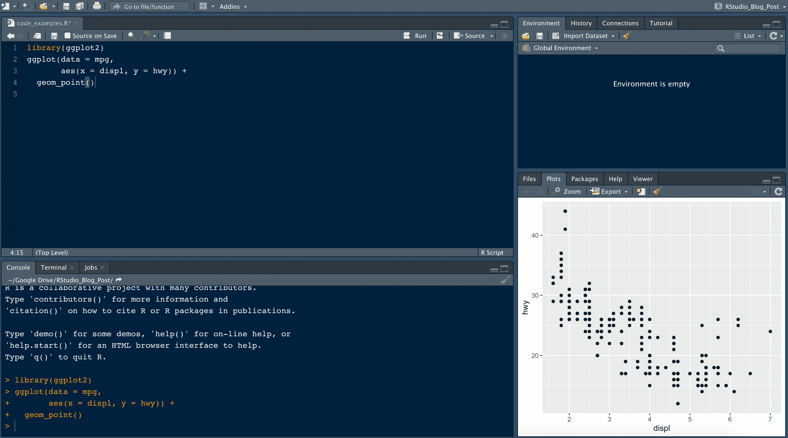

使用 RStudio 进行数据分析和 R 编程有很多好处。以下是 RStudio 提供的一些示例:

*   一个直观的界面，让我们跟踪保存的对象，脚本和图形
*   一个文本编辑器，具有颜色编码语法等功能，可以帮助我们编写简洁的脚本
*   自动完成功能节省时间
*   用于创建包含项目代码、注释和视觉效果的文档的工具
*   专用的项目文件夹，将所有内容保存在一个地方

RStudio 还可以用于其他语言的编程，包括 SQL、Python 和 Bash 等等。

但是在我们安装 RStudio 之前，我们需要在我们的计算机上安装一个最新版本的 R。

## 1.安装 R

R 可从[官方 R 网站](https://cran.r-project.org/)下载。查找网页的这一部分:

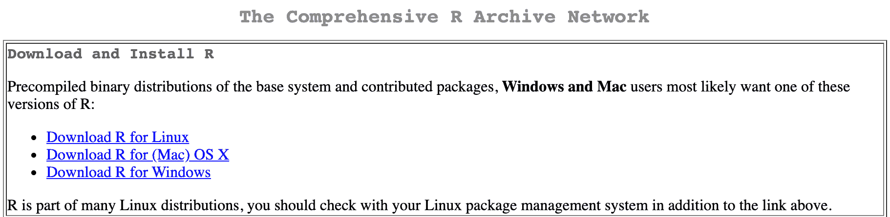

要下载的 R 版本取决于我们的操作系统。下面，我们提供了 Mac OS X、Windows 和 Linux (Ubuntu)的安装说明。

**MAC OS X**

*   选择`Download R for (Mac) OSX`选项。
*   寻找 R 的最新版本(新版本经常发布，出现在页面顶部)并点击`.pkg`文件下载。
*   打开`.pkg`文件，按照标准说明在 MAC OS X 上安装应用程序。
*   将 R 应用程序拖放到`Applications`文件夹中。

**窗户**

*   选择`Download R for Windows`选项。
*   选择`base`，因为这是我们第一次在计算机上安装 R。
*   遵循安装 Windows 程序的标准说明。如果要求我们选择`Customize Startup`或`Accept Default Startup Options`，选择默认选项。

**Linux/Ubuntu**

*   选择`Download R for Linux`选项。
*   选择`Ubuntu`选项。
*   或者，如果您没有使用`Ubuntu`，请选择与您相关的 Linux 包管理系统。

RStudio 兼容许多版本的 R (R 版本 3.0.1 或截至 2020 年 7 月的更新版本)。将 R 与 RStudio 分开安装，用户可以选择适合自己需求的 R 版本。

## 2.安装 RStudio

既然已经安装了 R，我们就可以安装 RStudio 了。导航至 RStudio [下载页面](https://rstudio.com/products/rstudio/download/)。

当我们到达 RStudio 下载页面时，让我们单击`RStudio Desktop Open Source License Free`选项的“下载”按钮:


我们的操作系统通常会被自动检测，因此我们可以通过单击“下载 RStudio”按钮直接下载适合我们计算机的正确版本。如果我们想为另一个操作系统(不是我们正在运行的操作系统)下载 RStudio，请向下导航到页面的“所有安装程序”部分。

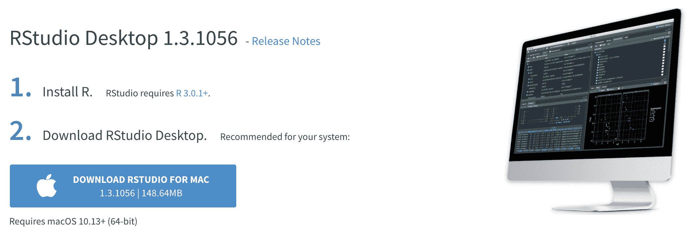

## 3.先看 RStudio

当我们第一次打开 RStudio 时，我们可能会看到这样的布局:

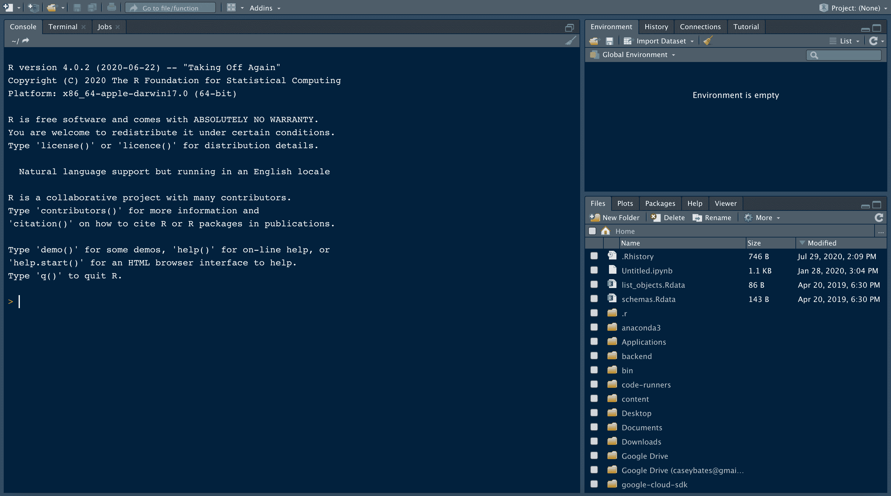但是背景颜色会是白色的，所以不要指望第一次启动 RStudio 时会看到这种蓝色的背景。查看[这个 Dataquest 博客](https://www.dataquest.io/blog/rstudio-tips-tricks-shortcuts/)，了解如何定制 RStudio 的外观。

当我们打开 RStudio 时，R 也会启动。新用户的一个常见错误是打开 R 而不是 RStudio。要打开 RStudio，请在桌面上搜索 RStudio，并将 RStudio 图标固定到首选位置(如桌面或工具栏)。

## 4.控制台

让我们从介绍**控制台**的一些功能开始。`Console`是 RStudio 中的一个选项卡，我们可以在这里运行 R 代码。

请注意，控制台所在的窗格包含三个选项卡:`Console`、`Terminal`和`Jobs`(这可能因使用的 RStudio 版本而异)。我们现在将重点放在控制台上。

当我们打开 RStudio 时，控制台包含我们正在使用的 R 版本的信息。向下滚动，试着键入一些像这样的表达式。按回车键查看结果。

```py
1 + 2
```

正如我们所看到的，我们可以使用控制台立即测试代码。当我们键入一个类似于`1 + 2`的表达式时，我们会在按下回车键后看到下面的输出。

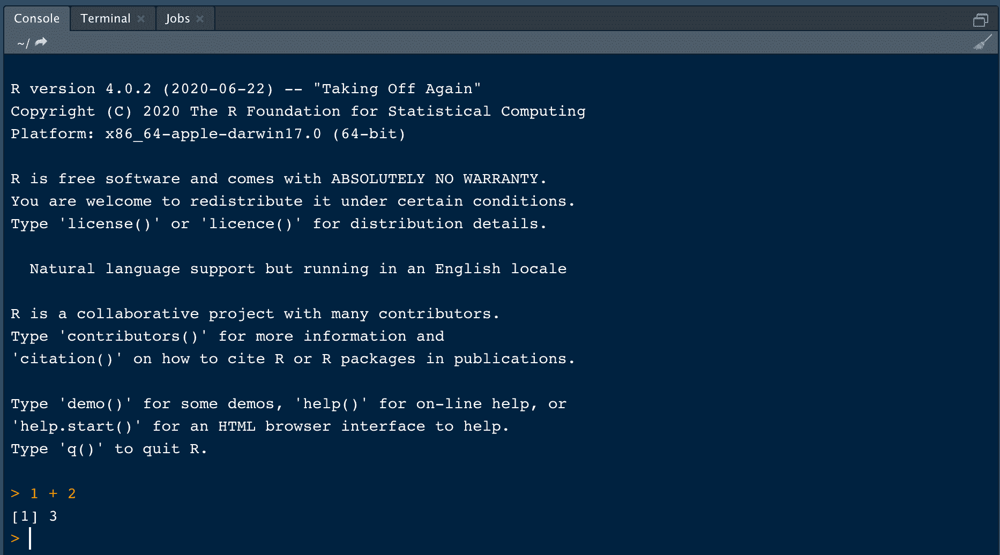

我们可以将该命令的输出存储为一个变量。这里，我们将变量 result 命名为:

```py
result <- 1 + 2
```

`<-`被称为赋值运算符。该运算符为变量赋值。上面的命令被翻译成一句话:

> >结果变量得到一加二的值。

RStudio 的一个很好的特性是输入赋值操作符`<-`的键盘快捷键:

*   麦克·OS X:`Option + -`
*   Windows/Linux: `Alt + -`

我们强烈建议您记住这个键盘快捷键，因为从长远来看，它可以节省很多时间！

当我们在控制台中键入`result`并按 enter 键时，我们会看到`3`的存储值:

```py
> result <- 1 + 2
> result
[1] 3
```

当我们在 RStudio 中创建一个变量时，它会将其保存为 R **全局环境**中的一个对象。我们将在下一节讨论环境以及如何查看存储在环境中的对象。

## 5.全球环境

我们可以将**全球环境**视为我们的工作空间。在 R 的编程会话中，我们定义的任何变量，或者我们导入并保存在 dataframe 中的数据，都存储在我们的全局环境中。在 RStudio 中，我们可以在界面右上角的`Environment`选项卡中看到全局环境中的对象:

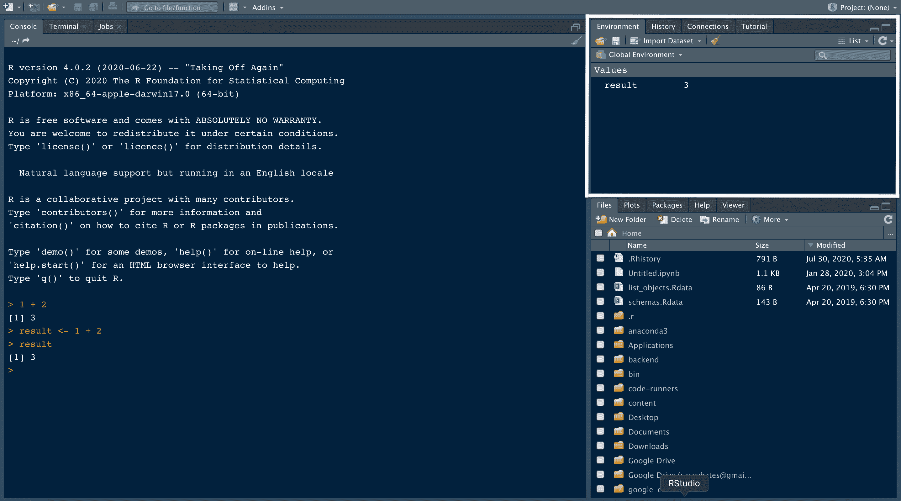

我们将在`Environment`选项卡的值下看到我们创建的任何对象，比如`result`。注意，显示了存储在变量中的值`3`。

有时，在全局环境中有太多的命名对象会造成混乱。也许我们想要移除所有或一些对象。要移除所有对象，请单击窗口顶部的扫帚图标:

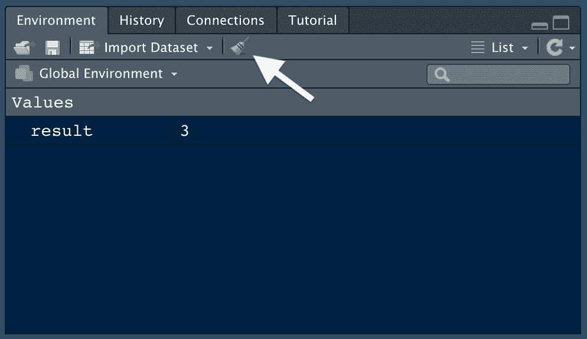

要从工作区中删除选定的对象，请从下拉菜单中选择网格视图:

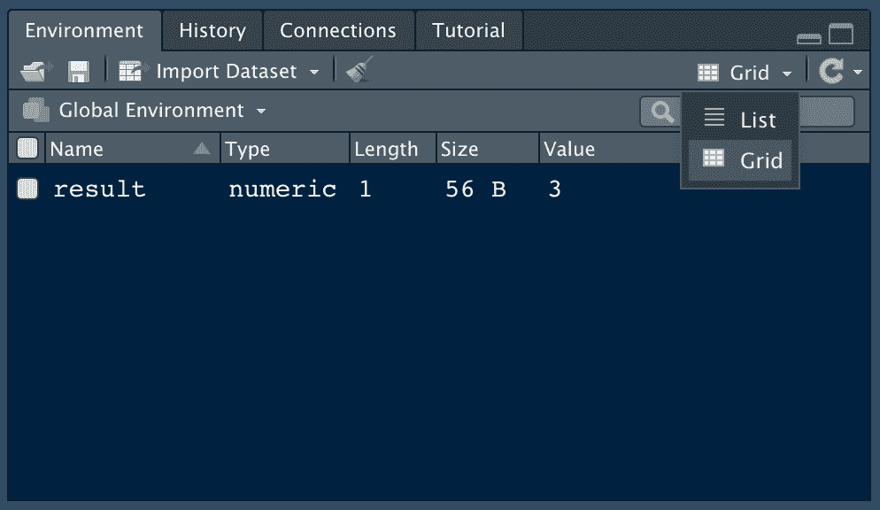

在这里，我们可以勾选想要移除的对象的复选框，并使用扫帚图标将其从我们的`Global Environment`中清除。

## 6.安装 tidyverse 包

R 中的许多功能都来自于使用包。包是代码、数据和文档的可共享集合。软件包本质上是我们上面安装的 R 程序的扩展或附件。

R 中最流行的包集合之一被称为“tidyverse”。tidyverse 是为处理数据而设计的 R 包的[集合。tidyverse 包拥有共同的设计理念、语法和数据结构。Tidyverse 包“一起玩好”。tidyverse 使您能够花更少的时间清理数据，以便您可以将更多的精力放在数据的分析、可视化和建模上。](https://www.tidyverse.org/packages/)

让我们学习如何安装 tidyverse 包。最常见的“核心”tidyverse 包有:

*   `readr`，用于数据导入。
*   `ggplot2`，用于数据可视化。
*   `dplyr`，用于数据操作。
*   `tidyr`，用于数据整理。
*   `purrr`，用于功能编程。
*   对于 tibbles 来说，这是对数据帧的现代重构。
*   `stringr`，用于字符串操作。
*   `forcats`，用于处理因子(分类数据)。

为了在 R 中安装包，我们使用内置的`install.packages()`函数。我们可以一个接一个地安装上面列出的包，但是幸运的是 tidyverse 的创建者提供了一种从一个命令安装所有这些包的方法。在控制台中键入以下命令，然后按 enter 键。

```py
install.packages("tidyverse")
```

第一次下载安装包只需要使用`install.packages()`命令。

> install.packages("Dataquest ")

从我们的[R 课程简介](/course/intro-to-r/)开始学习 R——不需要信用卡！

[SIGN UP](https://app.dataquest.io/signup)

## 7.将 tidyverse 包加载到内存中

将软件包安装到计算机硬盘上后，使用`library()`命令将软件包加载到内存中:

```py
library(readr)
library(ggplot2)
```

用`library()`将包加载到内存中使得给定包的功能可以在当前 R 会话中使用。对于 R 用户来说，在他们的硬盘上安装数百个 R 包是很常见的，所以一次加载所有的包是没有效率的。相反，我们指定特定项目或任务所需的 R 包。

幸运的是，只需一个命令就可以将核心 tidyverse 包加载到内存中。控制台中的命令和输出如下所示:

```py
library(tidyverse)## ── Attaching packages ───────────────────────────────────────────────── tidyverse 1.3.0 ──## ✓ ggplot2 3.3.2 ✓ purrr 0.3.4
## ✓ tibble 3.0.3 ✓ dplyr 1.0.0
## ✓ tidyr 1.1.0 ✓ stringr 1.4.0
## ✓ readr 1.3.1 ✓ forcats 0.5.0## ── Conflicts ──────────────────────────────────────────────────── tidyverse_conflicts() ──
## x dplyr::filter() masks stats::filter()
## x dplyr::lag() masks stats::lag()
```

输出的`Attaching packages`部分指定了加载到内存中的包及其版本。`Conflicts`部分指定了我们刚刚加载到内存中的包中包含的任何函数名，这些函数名与已经加载到内存中的函数名相同。使用上面的例子，现在如果我们调用`filter()`函数，R 将使用`dplyr`包中为这个函数指定的代码。这些冲突通常不是问题，但是值得阅读输出消息来确定。

## 8.识别加载的包

如果我们需要检查我们加载了哪些包，我们可以参考控制台右下角窗口中的**包**选项卡。

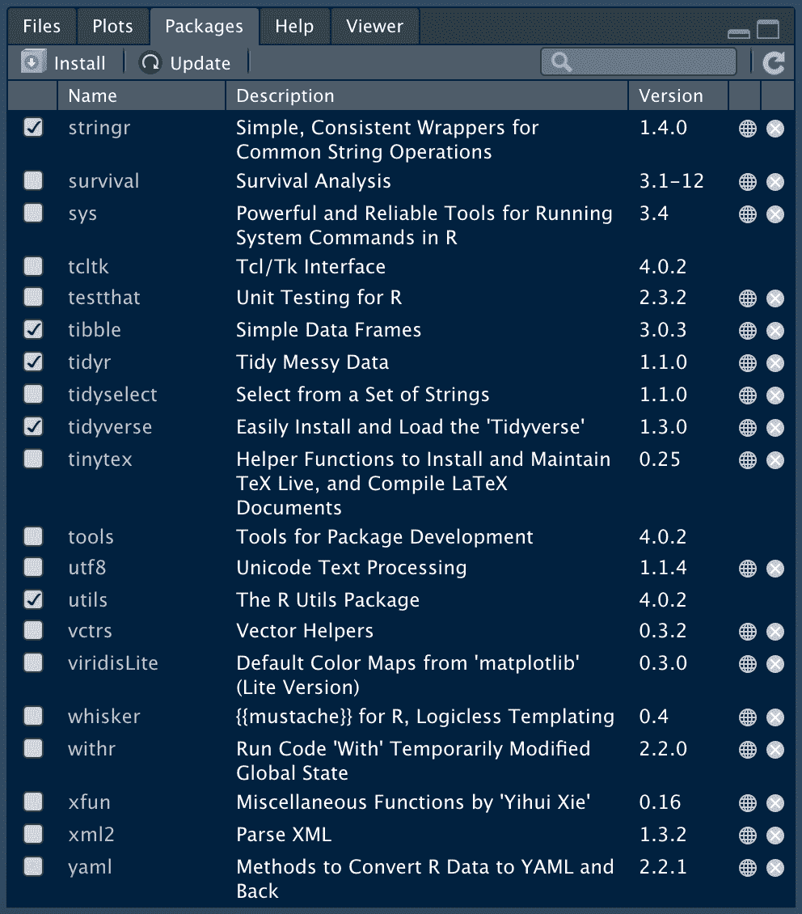

我们可以搜索包，选中包旁边的框就可以加载它(代码出现在控制台中)。

或者，将此代码输入控制台将显示当前加载到内存中的所有包:

```py
(.packages())
```

它返回:

```py
[1] "forcats" "stringr" "dplyr" "purrr" "tidyr" "tibble" "tidyverse"
[8] "ggplot2" "readr" "stats" "graphics" "grDevices" "utils" "datasets" 
[15] "methods" "base"
```

另一个用于返回当前加载到内存中的包名的有用函数是`search()`:

```py
> search()
 [1] ".GlobalEnv" "package:forcats" "package:stringr" "package:dplyr" 
 [5] "package:purrr" "package:readr" "package:tidyr" "package:tibble" 
 [9] "package:ggplot2" "package:tidyverse" "tools:rstudio" "package:stats" 
[13] "package:graphics" "package:grDevices" "package:utils" "package:datasets" 
[17] "package:methods" "Autoloads" "package:base"
```

## 9.获取关于软件包的帮助

我们已经学习了如何安装和加载软件包。但是如果我们想了解更多关于我们已经安装的包的信息呢？那很简单！点击`Packages`选项卡中的包名，我们将进入所选包的`Help`选项卡。如果我们点击`tidyr`包，我们会看到:

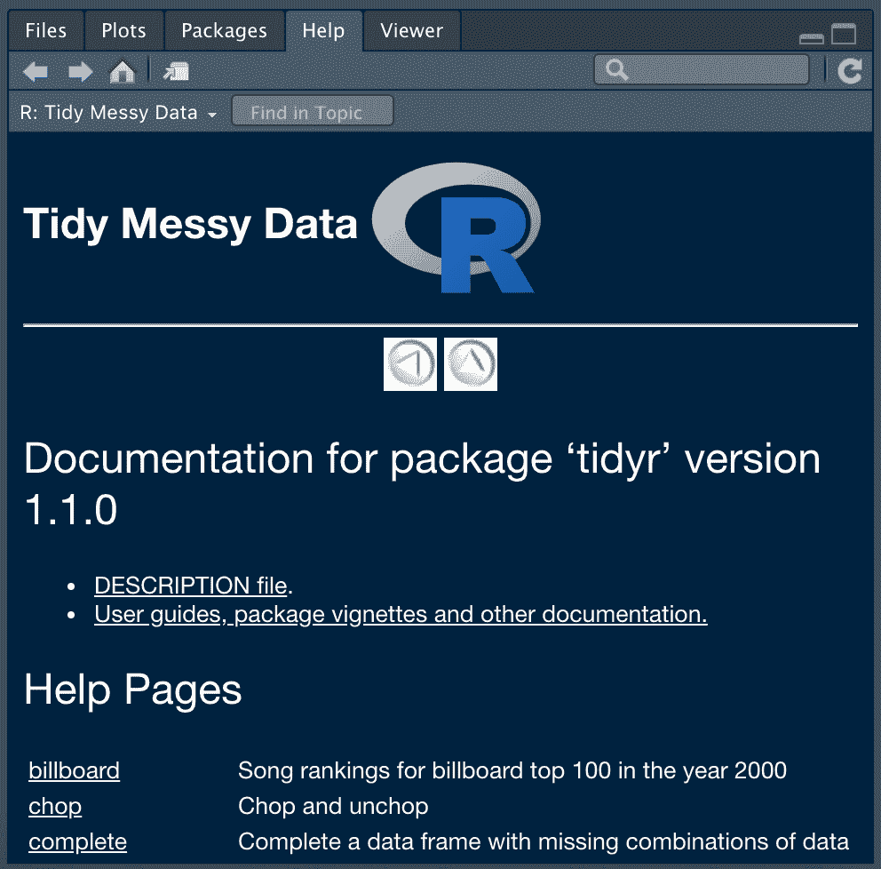

或者，我们可以在控制台中键入以下命令，并获得相同的结果:

```py
help(package = "tidyr")
```

软件包的帮助页面提供了对软件包中包含的每个功能的文档的快速访问。在软件包的主帮助页面上，您还可以访问可用的“简介”。小插图提供关于软件包的简要介绍、教程或其他参考信息，或者如何使用软件包中的特定功能。

```py
vignette(package = "tidyr")
```

这产生了可用选项的列表:

```py
Vignettes in package ‘tidyr’:nest nest (source, html)
pivot Pivoting (source, html)
programming Programming with tidyr (source, html)
rectangle rectangling (source, html)
tidy-data Tidy data (source, html)
in-packages Usage and migration (source, html)
```

在那里，我们可以选择一个特定的插图进行查看:

```py
vignette("pivot")
```

现在我们看到枢轴插图显示在`Help`选项卡中。这就是为什么 RStudio 是一个强大的 r 编程工具的一个例子。我们可以在不离开 RStudio 的情况下访问函数和软件包文档和教程！

## 10.获取函数的帮助

正如我们在上一节中所学的，我们可以通过点击`Packages`中的包名来获得关于函数的帮助，然后点击一个函数名来查看帮助文件。这里我们看到`tidyr`包中的`pivot_longer()`函数位于列表的顶部:

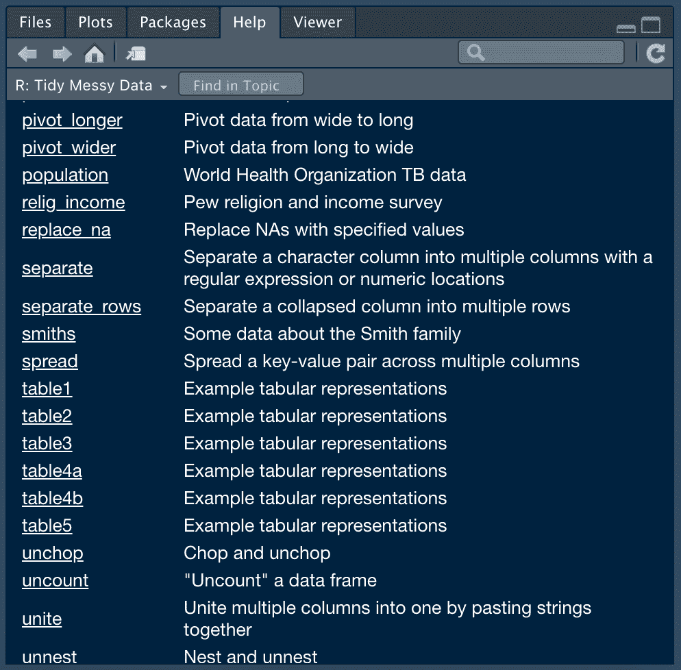

如果我们点击“pivot_longer”，我们会得到这个: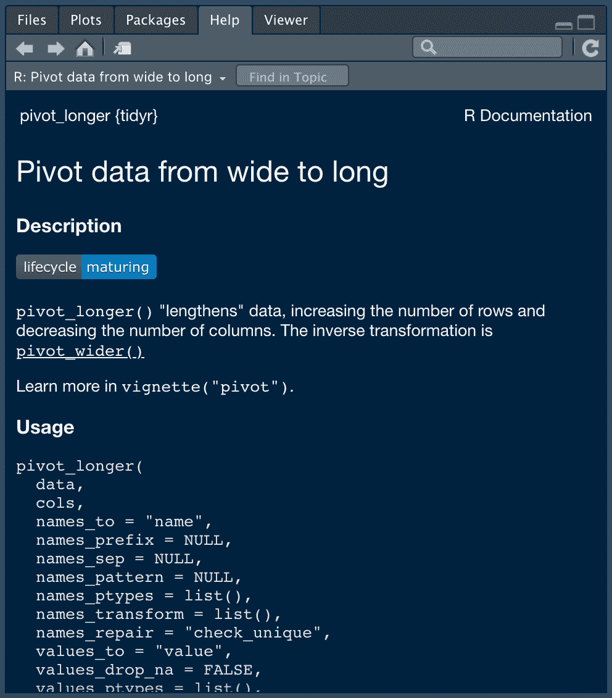

我们可以在`Console`中用这些函数调用中的任何一个获得相同的结果:

```py
help("pivot_longer")
help(pivot_longer)
?pivot_longer
```

注意，如果包含函数的包还没有加载到内存中，那么`pivot_longer()`函数(或者我们感兴趣的任何函数)的特定`Help`选项卡可能不是默认结果。一般来说，在寻求某个函数的帮助之前，最好确保一个特定的包已经被加载。

## 11.RStudio 项目

RStudio 提供了一个强大的功能，让您保持条理；**项目**。当您进行多项分析时，保持条理是非常重要的。RStudio 的项目允许您将所有重要的工作放在一个地方，包括代码脚本、绘图、图表、结果和数据集。

通过导航到 RStudio 中的`File`选项卡并选择`New Project...`来创建一个新项目。然后指定是在新目录中还是在现有目录中创建项目。在这里我们选择“新建目录”:

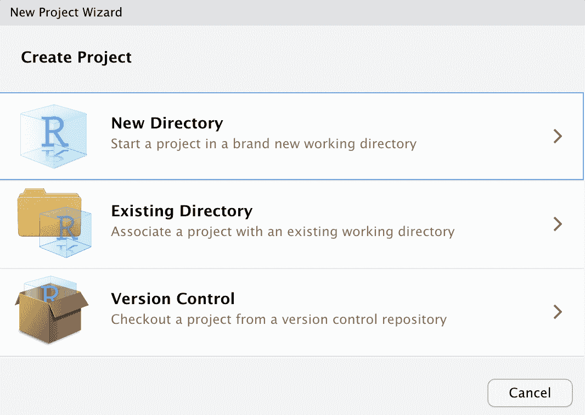

如果你正在开发一个 R 包，或者一个闪亮的 Web 应用程序，RStudio 提供了专门的项目类型。在这里，我们选择“新建项目”，这将创建一个 R 项目:

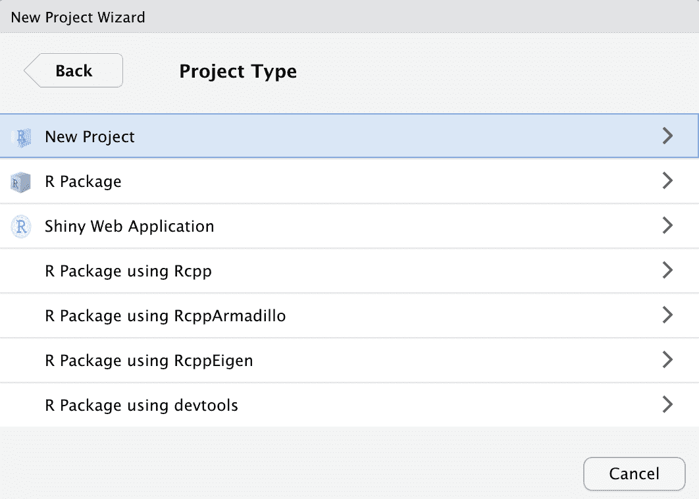

接下来，我们给我们的项目命名。“将项目创建为的子目录:”显示该文件夹在计算机上的位置。如果我们同意该位置，请选择“创建项目”，如果我们不同意，请选择“浏览”并选择该项目文件夹在计算机上的位置。

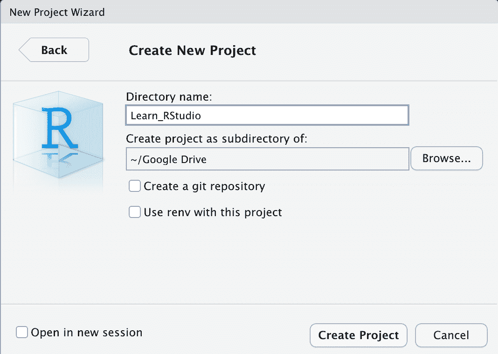

现在，在 RStudio 中，我们看到项目的名称显示在屏幕的右上角。我们也看到了。文件选项卡中的 Rproj 文件。我们在该项目中添加或生成的任何文件都将出现在“文件”选项卡中。

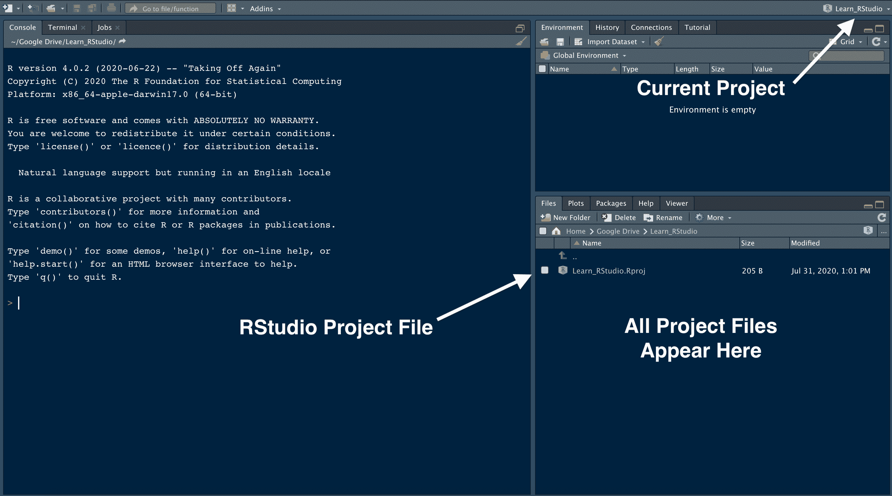

当您需要与同事分享您的工作时，RStudio 项目非常有用。您可以发送您的项目文件(结尾为。Rproj)以及所有支持文件，这将使您的同事更容易重建工作环境并再现结果。

## 12.保存您的“真实”工作。其余删除。

这个技巧来自我们的博客文章 [23 RStudio Tips，Tricks，and Shortcuts](https://www.dataquest.io/blog/rstudio-tips-tricks-shortcuts/) ,但是它非常重要，我们也在这里分享它！

实践良好的内务管理，以避免未来不可预见的挑战。如果您创建了一个值得保存的 R 对象，请在 R 脚本文件中捕获生成该对象的 R 代码。保存 R 脚本，但是不要保存创建对象的环境或工作空间。

要防止 RStudio 保存您的工作空间，请打开`Preferences > General`并取消选择启动时将`.RData`恢复到工作空间的选项。确保指定您永远不想保存您的工作区，如下所示:

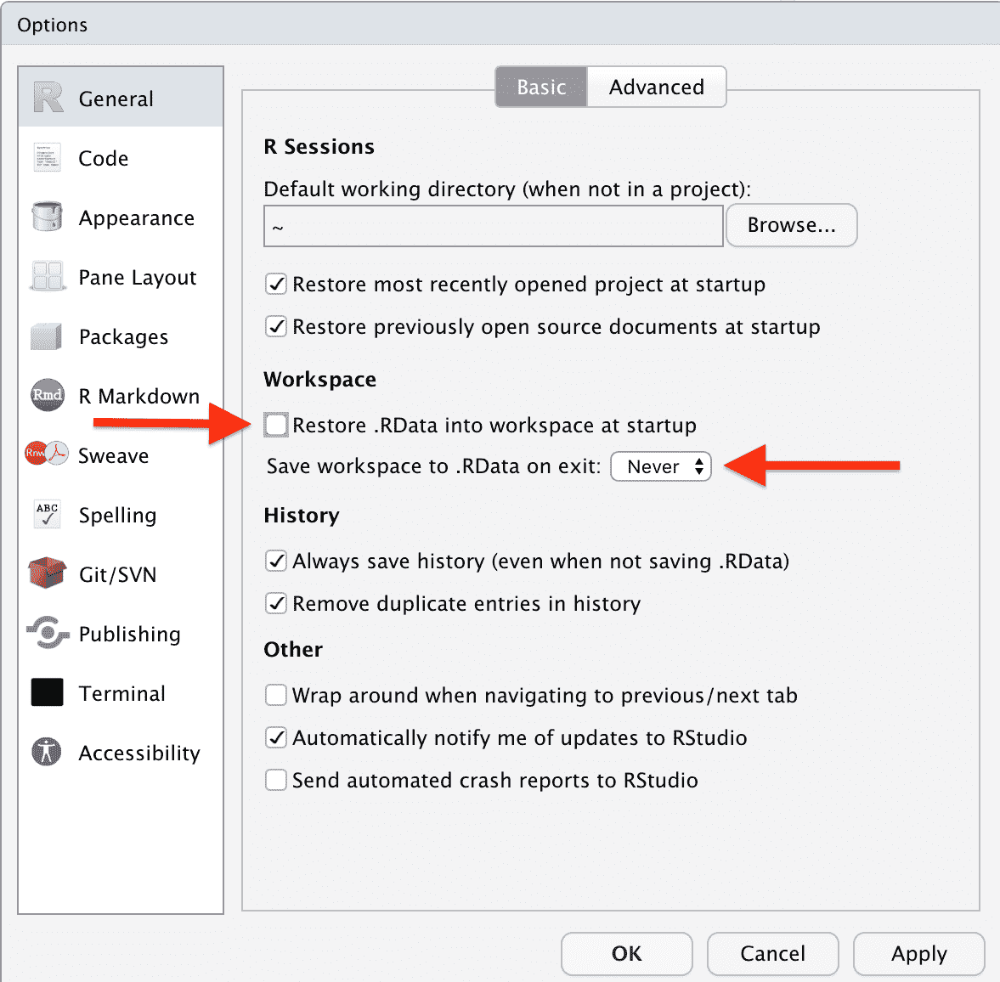

现在，每次打开 RStudio 时，您都将从一个空会话开始。从您之前的会话中生成的任何代码都不会被记住。R 脚本和数据集可以用来从头开始重新创建环境。

[其他专家同意](https://rladiessydney.org/courses/ryouwithme/01-basicbasics-1/#1-3-settings)T2 不保存你的工作空间是使用 RStudio 的最佳实践。

## 13.r 脚本

在学习本教程的过程中，我们在`Console`中编写了代码。随着我们的项目变得越来越复杂，我们编写更长的代码块。如果我们想保存我们的工作，有必要将我们的代码组织成一个脚本。这使我们能够跟踪我们在项目中的工作，用大量的注释编写干净的代码，复制我们的工作，并与他人分享。

在 RStudio 中，我们可以在界面左上角的文本编辑器窗口中编写脚本:

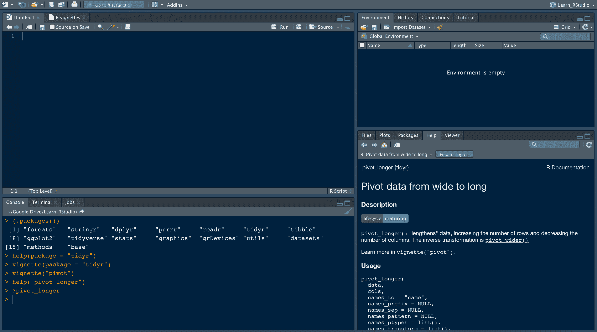要创建新的脚本，我们可以使用文件菜单中的命令:

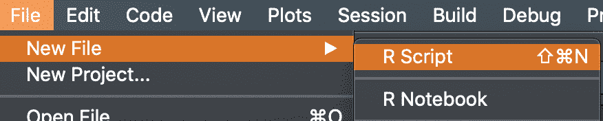

我们也可以使用键盘快捷键 Ctrl + Shift + N。当我们保存一个脚本时，它的文件扩展名为. r。例如，我们将创建一个新的脚本，其中包含生成散点图的代码:

```py
library(ggplot2)
ggplot(data = mpg,
       aes(x = displ, y = hwy)) +
  geom_point()
```

为了保存我们的脚本，我们导航到`File`菜单选项卡并选择`Save`。或者我们输入以下命令:

*   麦克·OS X:`Cmd + S`
*   Windows/Linux: `Ctrl + S`

## 14.运行代码

要运行我们在脚本中输入的一行代码，我们可以点击脚本右上角的`Run`,或者当光标位于我们想要运行的行上时，使用以下键盘命令:

*   麦克·OS X:`Cmd + Enter`
*   Windows/Linux: `Ctrl + Enter`

在这种情况下，我们需要突出显示多行代码来生成散点图。要突出显示并运行脚本中的所有代码行，请输入:

*   麦克·OS X:`Cmd + A + Enter`
*   Windows/Linux: `Ctrl + A + Enter`

让我们看看运行上面指定的代码行的结果:

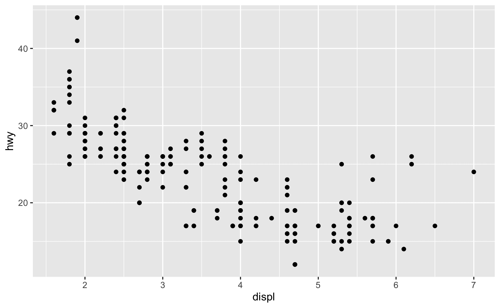

附注:这个散点图是使用包含在`ggplot2`包中的`mpg`数据集的数据生成的。该数据集包含了从 1999 年到 2008 年的 38 种流行车型的燃油经济性数据。

在该曲线图中，发动机排量(即大小)描绘在 x 轴(水平轴)上。y 轴(纵轴)描绘了以英里每加仑为单位的燃料效率。一般来说，燃油经济性随着发动机尺寸的增加而降低。这个图是用 tidyverse 包`ggplot2`生成的。这个包对于 r 中的数据可视化非常流行。

## 15.访问内置数据集

想从我们在上一个例子中提到的`ggplot2`包中了解更多关于`mpg`数据集的信息吗？使用以下命令执行此操作:

```py
data(mpg, package = "ggplot2")
```

从这里，您可以使用`head()`函数查看前六行数据:

```py
head(mpg)
```

```py
## # A tibble: 6 x 11
##   manufacturer model displ  year   cyl trans      drv     cty   hwy fl    class 
##                          
## 1 audi         a4      1.8  1999     4 auto(l5)   f        18    29 p     compa…
## 2 audi         a4      1.8  1999     4 manual(m5) f        21    29 p     compa…
## 3 audi         a4      2    2008     4 manual(m6) f        20    31 p     compa…
## 4 audi         a4      2    2008     4 auto(av)   f        21    30 p     compa…
## 5 audi         a4      2.8  1999     6 auto(l5)   f        16    26 p     compa…
## 6 audi         a4      2.8  1999     6 manual(m5) f        18    26 p     compa…
```

用`summary()`函数获取汇总统计数据:

```py
summary(mpg)
```

```py
##  manufacturer          model               displ            year     
##  Length:234         Length:234         Min.   :1.600   Min.   :1999  
##  Class :character   Class :character   1st Qu.:2.400   1st Qu.:1999  
##  Mode  :character   Mode  :character   Median :3.300   Median :2004  
##                                        Mean   :3.472   Mean   :2004  
##                                        3rd Qu.:4.600   3rd Qu.:2008  
##                                        Max.   :7.000   Max.   :2008  
##       cyl           trans               drv                 cty       
##  Min.   :4.000   Length:234         Length:234         Min.   : 9.00  
##  1st Qu.:4.000   Class :character   Class :character   1st Qu.:14.00  
##  Median :6.000   Mode  :character   Mode  :character   Median :17.00  
##  Mean   :5.889                                         Mean   :16.86  
##  3rd Qu.:8.000                                         3rd Qu.:19.00  
##  Max.   :8.000                                         Max.   :35.00  
##       hwy             fl               class          
##  Min.   :12.00   Length:234         Length:234        
##  1st Qu.:18.00   Class :character   Class :character  
##  Median :24.00   Mode  :character   Mode  :character  
##  Mean   :23.44                                        
##  3rd Qu.:27.00                                        
##  Max.   :44.00
```

或者在`Help`选项卡中打开帮助页面，如下所示:

```py
help(mpg)
```

最后，有许多 R 内置的数据集可以使用。内置的数据集便于练习新的 R 技能，而无需搜索数据。使用以下命令查看可用数据集:

```py
data()
```

## 16.风格

编写 R 脚本时，最好在脚本顶部指定要加载的包:

```py
library(ggplot2)
```

当我们编写 R 脚本时，添加注释来解释我们的代码也是很好的做法(#就像这样)。r 忽略以#开头的代码行。与同事和合作者共享代码是很常见的。确保他们理解我们的方法非常重要。但更重要的是，透彻的笔记对你未来的自己是有帮助的，让你以后重温剧本的时候能明白自己的方法！

下面是我们的散点图代码的注释示例:

```py
library(ggplot2)

# fuel economy data from 1999 to 2008, for 38 popular models of cars
# engine displacement (size) is depicted on the x-axis
# fuel efficiency is depicted on the y-axis
ggplot(data = mpg,
       aes(x = displ, y = hwy)) +
  geom_point()
```

## 17.可重复报告，带 R Markdown

上面例子中使用的注释可以为我们的 R 脚本提供简短的注释，但是这种格式不适合编写需要总结结果和发现的报告。我们可以使用 R Markdown 文件在 RStudio 中创建格式良好的报告。

R Markdown 是一个开源工具，用于在 R 中生成可重复的报告。R Markdown 使我们能够将所有的代码、结果和编写内容放在一个地方。使用 R Markdown，我们可以选择将我们的作品导出为多种格式，包括 PDF、Microsoft Word、幻灯片或 html 文档，以便在网站上使用。

如果你想学习 R Markdown，看看这些 Dataquest 博客帖子:

*   [R Markdown 入门指南和备忘单](https://www.dataquest.io/blog/r-markdown-guide-cheatsheet/)
*   [R 降价提示、技巧和快捷方式](https://www.dataquest.io/blog/r-markdown-tips-tricks-and-shortcuts/)

## 18.使用 RStudio 云

RStudio 现在提供一个基于云的 RStudio 桌面版本，名为 [RStudio Cloud](https://rstudio.cloud/) 。RStudio Cloud 让你不用安装软件就可以在 RStudio 中编码，你只需要一个网页浏览器。我们在本教程中学到的几乎所有内容都适用于 RStudio Cloud！

RStudio Cloud 中的工作被组织到类似于桌面版本的项目中。RStudio Cloud 使您能够指定您希望用于每个项目的 R 版本。如果您正在重新访问一个围绕以前版本的 r 构建的旧项目，这是非常好的。

RStudio Cloud 还可以轻松安全地与同事共享项目，并确保每次访问项目时工作环境完全可再现。

RStudio 云的布局与 RStudio 桌面非常相似:

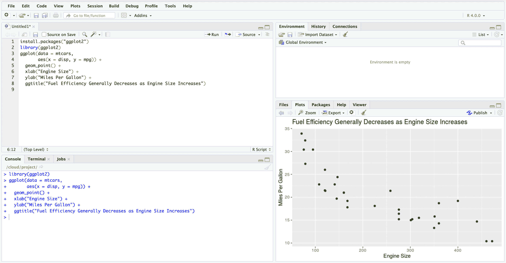

## 19.把手弄脏！

学习 RStudio 的最佳方式是应用我们在本教程中介绍的内容。自己跳起来熟悉 RStudio 吧！创建您自己的项目，保存您的工作，并共享您的结果。我们再怎么强调这一点的重要性也不为过。

不确定从哪里开始？查看下面列出的其他资源！

## 额外资源

如果你喜欢这个教程，来 Dataquest 和我们一起学习吧！如果您不熟悉 R 和 RStudio，我们建议您从 R 课程中的 Dataquest [数据分析介绍开始。这是 R](https://www.dataquest.io/course/introduction-to-data-analysis-in-r/) 路径中 Dataquest [数据分析师的第一门课程。](https://www.dataquest.io/path/data-analyst-r/)

如需更多高级 RStudio 技巧，请查看 Dataquest 博客文章 [23 RStudio 技巧、诀窍和快捷方式](https://www.dataquest.io/blog/rstudio-tips-tricks-shortcuts/)。

在这篇 Dataquest 博客文章的[中，学习如何使用 tidyverse 工具加载和清理数据。](https://www.dataquest.io/blog/load-clean-data-r-tidyverse/)

RStudio 发表了许多关于使用 RStudio 的深入的操作方法文章。找到他们[在这里](https://support.rstudio.com/hc/en-us/sections/200107586-Using-the-RStudio-IDE)。

有一个官方的 RStudio 博客。

如果你想学习 R Markdown，看看这些 Dataquest 博客帖子:

*   [R Markdown 入门指南和备忘单](https://www.dataquest.io/blog/r-markdown-guide-cheatsheet/)
*   [R 降价提示、技巧和快捷方式](https://www.dataquest.io/blog/r-markdown-tips-tricks-and-shortcuts/)

学习 R 和数据科学的 tidyverse 与 [R。通过完成 RStudio 中的练习巩固您的知识，并保存您的工作以供将来参考。](https://r4ds.had.co.nz/)

## 奖励:备忘单

RStudio 发布了[许多与 R 合作的备忘单](https://rstudio.com/resources/cheatsheets/)，包括一份关于使用 RStudio 的[详细备忘单！通过选择`Help > Cheatsheets`，可以从 RStudio 中访问选择备忘单。](https://raw.githubusercontent.com/rstudio/cheatsheets/master/rstudio-ide.pdf)

### 准备好提升你的 R 技能了吗？

我们 R path 的[数据分析师涵盖了你找到工作所需的所有技能，包括:](/path/data-analyst-r/)

*   使用 **ggplot2** 进行数据可视化
*   使用 **tidyverse** 软件包的高级数据清理技能
*   R 用户的重要 SQL 技能
*   **统计**和概率的基础知识
*   ...还有**多得多的**

没有要安装的东西，**没有先决条件**，也没有时间表。

[Start learning for free!](https://app.dataquest.io/signup)