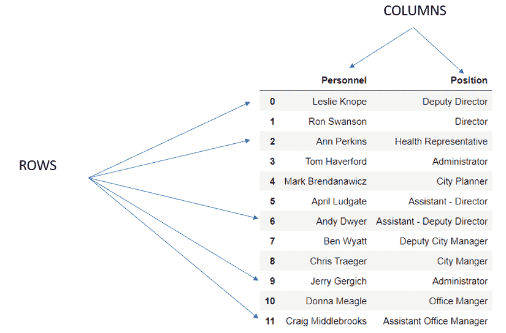

# 教程:如何创建和使用熊猫数据框架

> 原文：<https://www.dataquest.io/blog/tutorial-how-to-create-and-use-a-pandas-dataframe/>

January 31, 2022

当使用 Python 探索数据时，数据帧使得分析和操作数据变得容易。本文将探讨使用数据帧的一些细节。

在处理数据时，Python 是一个强大的工具。它的可扩展性和各种用于数据分析和数据科学应用的[库等特性使其用途广泛。然而，Python 经常被低估但却非常有价值的一点是，我们可以用灵活的数据结构轻松地操纵数据。这些结构之一是数据帧。](https://www.dataquest.io/blog/15-python-libraries-for-data-science/)

## 什么是数据帧？

首先，重要的是要知道数据可以采用各种不同的结构。在大多数情况下，大多数数据都是以[表格形式](https://papl.cs.brown.edu/2016/intro-tabular-data.html)(即，数据被组织成代表单个条目的行)。如果您曾经使用过 Excel 电子表格或 SQL 表，您可能对此已经很熟悉了。代表给定数据条目的这些行中的每一行及其属性的集合被形成为二维结构，其中标题列由相同属性的值组成。

这些结构有几个独特的品质:

1.  行—表示单一的数据输入点
2.  列-对应于与每个给定数据点的单一质量相关的分组，通常有标题
3.  索引—每个数据条目的唯一标识符



尽管根据所使用的编程语言或应用工具的不同，这些结构可以有不同的名称，但在 Python 中，我们称这些结构为 **DataFrames** 。用于处理这些结构的主要库是[熊猫](https://pandas.pydata.org/)。

## 你如何制作一个数据框架？

在创建数据帧时，您可以从外部文件导入，也可以用 Python 自己创建。

### 方法 1-从文件导入数据

在现实世界中，数据集通常通过管理它的外部源读入 Python。我们可以在多种类型的文件中找到这些数据集，但我们最常见的是以逗号分隔值文件(CSV)的形式找到它们。幸运的是，在 Pandas 库中，它有一个功能可以将这种格式的数据转换成名为 [pandas.read_csv()](https://pandas.pydata.org/docs/reference/api/pandas.read_csv.html) 的数据帧。它需要的唯一主要参数是一个路径，该路径概述了文件存在的位置。

一种途径可能来自 web(即来自 API 或 GitHub 库)

```py
import pandas as pd
import numpy as np 
import datetime as dt
```

```py
# While not necessarily the case, you’ll often need to load the numpy library when working with the pandas library 
url = 'https://raw.githubusercontent.com/Vibe1990/Netflix-Project/main/netflix_title.csv'
netflix = pd.read_csv(url)
#  When providing the URL pathway, this will need to be in the form of a raw string, otherwise it will result in an error
netflix
```

|  | 显示 id | 类型 | 标题 | 主管 | 投 | 国家 | 日期 _ 已添加 | 发布年份 | 等级 | 期间 | 列出 _ 在 | 描述 |
| --- | --- | --- | --- | --- | --- | --- | --- | --- | --- | --- | --- | --- |
| Zero | s1 | 电视节目 | 3% | 圆盘烤饼 | 朱奥·米格尔，比安卡·孔帕拉托，米歇尔戈麦斯，R… | 巴西 | 8 月 14 日至 20 日 | Two thousand and twenty | TV-MA | 四季 | 国际电视节目、电视剧、电视科幻片&… | 在未来，精英居住在一个岛上… |
| one | s2 | 电影 | nineteen past seven | 豪尔赫·米歇尔·格劳 | 德米安·毕希、赫克托·博尼利亚、奥斯卡·塞拉诺… | 墨西哥 | 2016 年 12 月 23 日 | Two thousand and sixteen | TV-MA | 93 分钟 | 戏剧、国际电影 | 一场毁灭性的地震袭击了墨西哥城… |
| Two | s3 | 电影 | one to twelve p.m. | 吉尔伯特·陈 | 陈泰德，钟欣桐，许亮宇，劳伦斯… | 新加坡 | 2018 年 12 月 20 日 | Two thousand and eleven | 稀有 | 78 分钟 | 恐怖电影，国际电影 | 当一名新兵被发现死亡时，他的同伴… |
| three | 第四心音 | 电影 | nine | 申·阿克 | 伊利亚·伍德，约翰 C·瑞里，詹妮弗·康纳利… | 美国 | 11 月 16 日至 17 日 | Two thousand and nine | PG-13 | 80 分钟 | 动作和冒险，独立电影，科幻… | 在后启示录世界，布娃娃机器人嗨… |
| four | 表面抗原-5 | 电影 | Twenty-one | 罗伯特·路克蒂克 | 吉姆·斯特吉斯，凯文·史派西，凯特·波茨沃斯，Aar… | 美国 | 2010 年 1 月 1 日 | Two thousand and eight | PG-13 | 123 分钟 | 戏剧 | 一群出色的学生成为了纸牌玩家 |

或者，如果一个文件存储在您的计算机上的工作目录中，那么路径会相应地调整。在这个过程中，我们可以使用[相对路径或完整路径](https://docs.oracle.com/javase/tutorial/essential/io/path.html#:~:text=A%2520path%2520is%2520either%2520relative,required%2520to%2520locate%2520the%2520file.&text=A%2520relative%2520path%2520needs%2520to,foo%2520is%2520a%2520relative%2520path.)来指定获取给定文件的路径，因为该函数可以毫无问题地解释两者之间的差异。

```py
# Assuming you've set up your notebook to have the desired working directory set

netflix = pd.read_csv(“netflix_title.csv”)
netflix
```

|  | 显示 id | 类型 | 标题 | 主管 | 投 | 国家 | 日期 _ 已添加 | 发布年份 | 等级 | 期间 | 列出 _ 在 | 描述 |
| --- | --- | --- | --- | --- | --- | --- | --- | --- | --- | --- | --- | --- |
| Zero | s1 | 电视节目 | 3% | 圆盘烤饼 | 朱奥·米格尔，比安卡·孔帕拉托，米歇尔戈麦斯，R… | 巴西 | 8 月 14 日至 20 日 | Two thousand and twenty | TV-MA | 四季 | 国际电视节目、电视剧、电视科幻片&… | 在未来，精英居住在一个岛上… |
| one | s2 | 电影 | nineteen past seven | 豪尔赫·米歇尔·格劳 | 德米安·毕希、赫克托·博尼利亚、奥斯卡·塞拉诺… | 墨西哥 | 2016 年 12 月 23 日 | Two thousand and sixteen | TV-MA | 93 分钟 | 戏剧、国际电影 | 一场毁灭性的地震袭击了墨西哥城… |
| Two | s3 | 电影 | one to twelve p.m. | 吉尔伯特·陈 | 陈泰德，钟欣桐，许亮宇，劳伦斯… | 新加坡 | 2018 年 12 月 20 日 | Two thousand and eleven | 稀有 | 78 分钟 | 恐怖电影，国际电影 | 当一名新兵被发现死亡时，他的同伴… |
| three | 第四心音 | 电影 | nine | 申·阿克 | 伊利亚·伍德，约翰 C·瑞里，詹妮弗·康纳利… | 美国 | 11 月 16 日至 17 日 | Two thousand and nine | 宜在家长指导下观看的 | 80 分钟 | 动作和冒险，独立电影，科幻… | 在后启示录世界，布娃娃机器人嗨… |
| four | 表面抗原-5 | 电影 | Twenty-one | 罗伯特·路克蒂克 | 吉姆·斯特吉斯，凯文·史派西，凯特·波茨沃斯，Aar… | 美国 | 2010 年 1 月 1 日 | Two thousand and eight | 宜在家长指导下观看的 | 123 分钟 | 戏剧 | 一群出色的学生成为了纸牌玩家 |
| … | … | … | … | … | … | … | … | … | … | … | … | … |
| Seven thousand seven hundred and eighty-two | s7783 | 电影 | 佐佐 | 约瑟夫·法里斯 | 伊马德克雷迪，安托瓦内特土耳其，埃利亚斯格尔吉，汽车… | 瑞典、捷克共和国、英国、丹麦… | 10 月 19 日至 20 日 | Two thousand and five | TV-MA | 99 分钟 | 戏剧、国际电影 | 当黎巴嫩内战剥夺了佐佐的… |
| Seven thousand seven hundred and eighty-three | s7784 | 电影 | 祖班 | 莫兹·辛格 | 维姬·考沙尔，萨拉·简·迪亚斯，拉格哈夫·查南… | 印度 | 2019 年 3 月 2 日 | Two thousand and fifteen | 电视-14 | 111 分钟 | 戏剧、国际电影、音乐和音乐剧 | 一个好斗但贫穷的男孩爬进了一个小村庄… |
| Seven thousand seven hundred and eighty-four | s7785 | 电影 | 日本的祖鲁族人 | 圆盘烤饼 | 讨厌的 C | 圆盘烤饼 | 9 月 25 日至 20 日 | Two thousand and nineteen | TV-MA | 44 分钟 | 纪录片，国际电影，音乐和 M… | 在这部纪录片中，南非说唱歌手纳斯特… |
| Seven thousand seven hundred and eighty-five | s7786 | 电视节目 | 尊宝只是甜点 | 圆盘烤饼 | 雷切尔·库·阿德里亚诺·宗博 | 澳大利亚 | 10 月 31 日至 20 日 | Two thousand and nineteen | 电视-PG | 一季 | 国际电视节目，真人秀 | 甜品师阿德里亚诺·宗博寻找新的… |
| Seven thousand seven hundred and eighty-six | s7787 | 电影 | 来自德克萨斯的小老乐队 | 山姆·邓恩 | 圆盘烤饼 | 英国、加拿大、美国 | 2010 年 3 月 1 日 | Two thousand and nineteen | TV-MA | 90 分钟 | 纪录片、音乐和音乐剧 | 这部纪录片深入探讨了神秘的背后… |

7787 行× 12 列

```py
netflix.head(5)
```

| 显示 id | 类型 | 标题 | 主管 | 投 | 国家 | 日期 _ 已添加 | 发布年份 | 等级 | 期间 | 列出 _ 在 | 描述 |  |
| --- | --- | --- | --- | --- | --- | --- | --- | --- | --- | --- | --- | --- |
| Zero | s1 | 电视节目 | 3% | 圆盘烤饼 | 朱奥·米格尔，比安卡·孔帕拉托，米歇尔戈麦斯，R… | 巴西 | 8 月 14 日至 20 日 | Two thousand and twenty | TV-MA | 四季 | 国际电视节目、电视剧、电视科幻片&… | 在未来，精英居住在一个岛上… |
| one | s2 | 电影 | nineteen past seven | 豪尔赫·米歇尔·格劳 | 德米安·毕希、赫克托·博尼利亚、奥斯卡·塞拉诺… | 墨西哥 | 2016 年 12 月 23 日 | Two thousand and sixteen | TV-MA | 93 分钟 | 戏剧、国际电影 | 一场毁灭性的地震袭击了墨西哥城… |
| Two | s3 | 电影 | one to twelve p.m. | 吉尔伯特·陈 | 陈泰德，钟欣桐，许亮宇，劳伦斯… | 新加坡 | 2018 年 12 月 20 日 | Two thousand and eleven | 稀有 | 78 分钟 | 恐怖电影，国际电影 | 当一名新兵被发现死亡时，他的同伴… |
| three | 第四心音 | 电影 | nine | 申·阿克 | 伊利亚·伍德，约翰 C·瑞里，詹妮弗·康纳利… | 美国 | 11 月 16 日至 17 日 | Two thousand and nine | PG-13 | 80 分钟 | 动作和冒险，独立电影，科幻… | 在后启示录世界，布娃娃机器人嗨… |
| four | 表面抗原-5 | 电影 | Twenty-one | 罗伯特·路克蒂克 | 吉姆·斯特吉斯，凯文·史派西，凯特·波茨沃斯，Aar… | 美国 | 2010 年 1 月 1 日 | Two thousand and eight | PG-13 | 123 分钟 | 戏剧 | 一群出色的学生成为了纸牌玩家 |

尽管 CSV 文件是最常见的，但是在 Pandas 中有许多不同的函数可以将各种类型的文件读入数据帧，该数据帧以相同的一般过程运行:

| 文件类型 | 在熊猫中的作用 |
| 杰森 | [read_json()](https://pandas.pydata.org/pandas-docs/stable/user_guide/io.html#io-json-reader) |
| [HTML](https://en.wikipedia.org/wiki/HTML) | [read_html()](https://pandas.pydata.org/pandas-docs/stable/user_guide/io.html#io-read-html) |
| [XML](https://www.w3.org/standards/xml/core) | [read_xml()](https://pandas.pydata.org/pandas-docs/stable/user_guide/io.html#io-read-xml) |
| [SQL](https://en.wikipedia.org/wiki/SQL) | [read_sql()](https://pandas.pydata.org/pandas-docs/stable/user_guide/io.html#io-sql) |
| [Excel](https://en.wikipedia.org/wiki/Microsoft_Excel) | [read_excel()](https://pandas.pydata.org/pandas-docs/stable/user_guide/io.html#io-excel-reader) |

### 方法 2–自己创建数据框

虽然这不是创建数据框的最常用方法，但您当然可以通过输入数据自己创建数据框。我们可以通过[熊猫来实现这一目标。DataFrame()](https://pandas.pydata.org/docs/reference/api/pandas.DataFrame.html#pandas.DataFrame) 函数，它接受数据输入参数并将其转换成 DataFrame。`pandas.DataFrame`函数非常健壮，因为它可以接受各种不同的数据输入:

*   无-这将生成一个空的数据帧，您可以在稍后用数据填充它

    ```py
    # Creating an empty DataFrame
    data = pd.DataFrame()
    print(data)
    ```

    ```py
    Empty DataFrame
    Columns: []
    Index: []
    ```

*   A dictionary of [ndarrays](https://www.geeksforgeeks.org/numpy-ndarray/) / [Lists](https://www.tutorialspoint.com/python/python_lists.htm)

    ```py
    # DataFrame for Pawnee City Hall

    Pawnee_city_hall = {
        "Personnel": ["Leslie Knope", "Ron Swanson", "Ann Perkins", "Tom Haverford", "Mark Brendanawicz", "April Ludgate", "Andy Dwyer", "Ben Wyatt", "Chris Traeger","Jerry Gergich", "Donna Meagle", "Craig Middlebrooks"],
        "Position":["Deputy Director", "Director", "Health Representative", "Administrator", "City Planner", "Assistant - Director", "Assistant - Deputy Director", "Deputy City Manager", "City Manger", "Administrator", "Office Manger", "Assistant Office Manager"]
    }

    Pawnee_city_hall = pd.DataFrame(Pawnee_city_hall)
    Pawnee_city_hall
    ```

    20] Leslie Knope T67] Eight [T95 】 Ten

    |  | Position |
    | --- | --- |
    | Zero | Deputy Director |
    | One | Ron swanson | Director |
    | Two [ 36] Ann Perkins | Health Representative |
    | Three | Tom Haverford | Manager |
    | 52] Mark Bredanavich | Urban Planner |
    | Five | April Ludgate | Assistant Director |
    | Assistant-Deputy Director of Andy dwyer |  |
    | Seven | Ben Wyatt | Deputy City Manager | Chris Traege | CEO |
    | Nine | Jerry Grdjic | Manager | Donna Miguel | Business Manager |
    | Eleven | Craig Middlebrooks | Assistant Office Manager |

*   A dictionary of [series](https://pandas.pydata.org/docs/reference/api/pandas.Series.html) (a one-dimensional array of data with an axis label)

    ```py
    # Another way to create a DataFrame for Pawnee City Hall
    personnel = pd.Series(["Leslie Knope", "Ron Swanson", "Ann Perkins", "Tom Haverford", "Mark Brendanawicz", "April Ludgate", "Andy Dwyer", "Ben Wyatt", "Chris Traeger","Jerry Gergich", "Donna Meagle", "Craig Middlebrooks"])
    position = pd.Series(["Deputy Director", "Director", "Health Representative", "Administrator", "City Planner", "Assistant - Director", "Assistant - Deputy Director", "Deputy City Manager", "City Manger", "Administrator", "Office Manger", "Assistant Office Manager"])

    Pawnee_city_hall = pd.DataFrame({"Names":personnel, "Job":position})
    Pawnee_city_hall
    ```

    |  | Name | Position |
    | --- | --- | --- |
    | Zero | Leslie Knope [T11 | Deputy Director |
    | One | Ron swanson | Director |
    | Two | Ann Pope 】 Health Representative |
    | Three | Tom Haverford | Manager |
    | Four | Mark Brendan | Assistant Director of Urban Planner |
    | Five | April Ludgate |  |
    | Six [T66 67] | Assistant-Deputy Director |
    | Seven | Ben Wyatt | Deputy City Manager |
    | Traege | CEO |
    | Nine | Jerry Grdjic | Manager |
    | Miguel | Business Manager |
    | Eleven | Craig Middlebrooks | Assistant Office Manager |

*   A list of lists

    ```py
    # Another way to create a DataFrame for Pawnee City Hall

    data = [
        ["Leslie Knope", "Deputy Director"], 
        ["Ron Swanson", "Director"], 
        ["Tom Haverford", "Administrator"], 
        ["April Ludgate", "Assistant-Director"], 
        ["Donna Meagle", "Office Manager"],
        ["Andy Dwyer", "Assistant - Deputy Director"], 
        ['Jerry Gergich', "Administrator"]]

    Pawnee_city_hall = pd.DataFrame(data, columns = ["Names", "Position"])
    Pawnee_city_hall
    ```

    Ford 8] Donna Miguel 4] Jerry Grdjic

    |  | Name | Location |
    | --- | --- | --- |
    | Zero | Les Li E Knope | Deputy Director |
    | One | Ron swanson | Director |
    | Two | Manager |
    | Three | April Ludgate | Assistant Director |
    | Four | Business Manager |
    | Five | Andy dwyer | Assistant-Deputy Director |
    | Manager |

*   A list of dictionaries

    ```py
    # DATAFRAME FOR RAPTORS

    raptors = [{"Player": "Pascal Siakim", "PPG": 23.7, "College":"University of New Mexico", "is_starting_five": True},
               {"Player": "Fred VanVleet", "PPG": 20.1, "College":"Wichita State", "is_starting_five": True},
               {"Player": "Scottie Barnes", "PPG": 15.1, "College":"Florida State", "is_starting_five": True},
               {"Player": "Chris Boucher", "PPG": 8.7, "College":"Oregon", "is_starting_five": False}
              ]

    raptors = pd.DataFrame(raptors, index = ['Power Forward', "Point Guard", "Small Forward", "Center"])
    raptors
    ```

    |  | 运动员 | PPG | 大学 | 从五点开始 | 从五点开始 |
    | --- | --- | --- | --- | --- | --- |
    | 大前锋 | 帕斯卡尔·西亚金 | Twenty-three point seven | 新墨西哥大学 | 真实的 | 真实的 |
    | 控球后卫 | 弗瑞德疯了 | Twenty point one | 威奇托州 | 真实的 | 真实的 |
    | 小前锋 | 斯科蒂·巴恩斯 | Fifteen point one | 佛罗里达州 | 真实的 | 真实的 |
    | 中心 | 克里斯·鲍彻 | Eight point seven | 俄勒冈州 | 错误的 | 错误的 |

    ***注意:**`pandas.DataFrame`函数也有 index 和 column 参数，分别用于命名行索引和列标题。*

虽然在上面的例子中使用了相同的数据类型(字符串)，但数据帧可以由各种不同的数据类型组成，如整数、浮点、列表、日期时间、布尔、列表等。

```py
# DATAFRAME FOR LAKERS

lakers = {
"player" : ['Lebron James', 
              'Russell Westbrook', 'Anthony Davis', 'Dwight Howard', 'Avery Bradley', 'DeAndre Jordan', 
              'Carmelo Anthony', 'Austin Reaves', 'Kent Bazemore', 'Malik Monk', 'Stanley Johnson', 
              'Trevor Ariza', 'Wayne Ellington', 'Talen Horton-Tucker'],
"PPG": [28.7, 19.3, 23.3, 5, 6.9, 4.5, 13.4, 5.4, 4.1, 12.1, 6.2, 3.5, 6.4, 10.9],
"in_starting_lineup": [True, True, True, False, True, False, False, False, False, True, False, False, False, False]
}

lakers = pd.DataFrame(lakers)
lakers
```

|  | 运动员 | PPG | 首发阵容中 |
| --- | --- | --- | --- |
| Zero | 勒布朗·詹姆斯 | Twenty-eight point seven | 真实的 |
| one | 拉塞尔·维斯特布鲁克 | Nineteen point three | 真实的 |
| Two | 安东尼·戴维斯 | Twenty-three point three | 真实的 |
| three | 德怀特·霍华德 | Five | 错误的 |
| four | 艾弗里·布拉德利 | Six point nine | 真实的 |
| five | 迪安卓·乔丹 | Four point five | 错误的 |
| six | 卡梅隆·安东尼 | Thirteen point four | 错误的 |
| seven | 奥斯汀·雷夫斯 | Five point four | 错误的 |
| eight | 肯特·巴兹摩尔 | Four point one | 错误的 |
| nine | Malik Monk | Twelve point one | 真实的 |
| Ten | 斯坦利·约翰逊 | Six point two | 错误的 |
| Eleven | 特雷沃·阿里扎 | Three point five | 错误的 |
| Twelve | 韦恩·艾灵顿 | Six point four | 错误的 |
| Thirteen | 塔伦·霍顿-塔克 | Ten point nine | 错误的 |

## 探索数据框架

因为 Python 是一种面向对象的编程语言，所以创建 DataFrame 意味着创建 DataFrame 类的对象。这也意味着我们可以探索许多不同的属性和方法来应用于数据帧。虽然我们在不熟悉数据集的情况下(比如从某个地方导入数据集)更经常使用它们，但它们仍然是有用的。

每当数据集作为数据帧加载到 Python 中时，最好查看它的结构。有许多不同的属性可以提供该信息:

*   [DataFrame.shape](https://pandas.pydata.org/docs/reference/api/pandas.DataFrame.shape.html#pandas.DataFrame.shape) —返回指示数据帧的行数和列数的元组
*   [DataFrame.size](https://pandas.pydata.org/docs/reference/api/pandas.DataFrame.size.html#pandas.DataFrame.size) —返回数据集中数据点数的整数值

    ```py
    print(netflix.shape)
    print(netflix.size)
    ```

    ```py
    (7787, 12)
    93444
    ```

如果您要探索数据帧的轴，您可以通过让数组经由 [DataFrame.columns](https://pandas.pydata.org/docs/reference/api/pandas.DataFrame.columns.html#pandas.DataFrame.columns) 和 [DataFrame.index](https://pandas.pydata.org/docs/reference/api/pandas.DataFrame.index.html#pandas.DataFrame.index) 返回列出的列和索引来实现。另一方面，查看组成数据集的不同类型的数据可能是有用的。在这些情况下，使用 [DataFrame.dtypes](https://pandas.pydata.org/docs/reference/api/pandas.DataFrame.dtypes.html#pandas.DataFrame.dtypes) 。

```py
print(netflix.columns)
print("")
print(netflix.index)
print("")
print(netflix.dtypes)
```

```py
Index(['show_id', 'type', 'title', 'director', 'cast', 'country', 'date_added',
       'release_year', 'rating', 'duration', 'listed_in', 'description'],
      dtype='object')
RangeIndex(start=0, stop=7787, step=1)
```

| 显示 id | 目标 |
| --- | --- |
| 类型 | 目标 |
| 标题 | 目标 |
| 主管 | 目标 |
| 投 | 目标 |
| 国家 | 目标 |
| 日期 _ 已添加 | 目标 |
| 发布年份 | int64 |
| 等级 | 目标 |
| 期间 | 目标 |
| 列出 _ 在 | 目标 |
| 描述 | 目标 |
| dtype:对象 |  |

## 操作数据帧

现在我们知道了 DataFrame 是什么，是时候做一些真正的工作了！原则上，这包括在实际分析之前，将它作为数据清理和数据争论过程的一部分进行操作。现在，每个人都应该掌握一些基本操作，首先是能够访问和隔离数据帧的给定部分。

为了分割数据帧，我们使用 [DataFrame.loc](https://pandas.pydata.org/docs/reference/api/pandas.DataFrame.loc.html#pandas.DataFrame.loc) 属性或 [DataFrame.iloc](https://pandas.pydata.org/docs/reference/api/pandas.DataFrame.iloc.html#pandas.DataFrame.iloc) 属性，其中输入指示提取哪些行或列([rows: columns])。如果一个列需要被隔离，那么这个过程将会是使用方括号和给定列的名称。

```py
print(netflix['title'])
print("")
print(netflix.loc[0])
```

| Zero | 3% |
| --- | --- |
| one | nineteen past seven |
| Two | one to twelve p.m. |
| three | nine |
| four | Twenty-one |
| … |  |
| Seven thousand seven hundred and eighty-two | 佐佐 |
| Seven thousand seven hundred and eighty-three | 祖班 |
| Seven thousand seven hundred and eighty-four | 日本的祖鲁族人 |
| Seven thousand seven hundred and eighty-five | 尊宝只是甜点 |
| Seven thousand seven hundred and eighty-six | 来自德克萨斯的小老乐队 |
| 名称:标题，长度:7787，数据类型:对象 |  |

| 显示 id | s1 |
| --- | --- |
| 类型 | 电视节目 |
| 标题 | 3% |
| 主管 | 圆盘烤饼 |
| 投 | 朱奥·米格尔，比安卡·孔帕拉托，米歇尔戈麦斯，R… |
| 国家 | 巴西 |
| 日期 _ 已添加 | 8 月 14 日至 20 日 |
| 发布年份 | Two thousand and twenty |
| 等级 | TV-MA |
| 期间 | 四季 |
| 列出 _ 在 | 国际电视节目、电视剧、电视科幻片&… |
| 描述 | 在未来，精英居住在一个岛上… |
| 名称:0，数据类型:对象 |  |

在我们需要提取多行或多列的情况下，我们使用[切片方法](https://realpython.com/lessons/indexing-and-slicing/)，这涉及到使用“:”来指示一个连续的范围，该范围的结束范围是排他的(即不包括在内)，或者通过在方括号内输入标准，其方式类似于使用带有 NumPy 的布尔的[索引。](https://numpy.org/doc/stable/user/quickstart.html#indexing-with-boolean-arrays)

```py
# Select the first two row of the raptors DataFrame 
raptors.iloc[0:2]
```

|  | 运动员 | PPG | 大学 | 从五点开始 |
| --- | --- | --- | --- | --- |
| 大前锋 | 帕斯卡尔·西亚金 | Twenty-three point seven | 新墨西哥大学 | 真实的 |
| 控球后卫 | 弗瑞德疯了 | Twenty point one | 威奇托州 | 真实的 |

```py
# Select the last three columns of the raptors DataFrame
raptors.iloc[:, 1:4]
```

|  | PPG | 大学 | 从五点开始 |
| --- | --- | --- | --- |
| 大前锋 | Twenty-three point seven | 新墨西哥大学 | 真实的 |
| 控球后卫 | Twenty point one | 威奇托州 | 真实的 |
| 小前锋 | Fifteen point one | 佛罗里达州 | 真实的 |
| 中心 | Eight point seven | 俄勒冈州 | 错误的 |

```py
# Select players that averaged more than 15 PPG on the Laker DataFrame
lakers[lakers["PPG"] > 15]
```

|  | 运动员 | PPG | 首发阵容中 |
| --- | --- | --- | --- |
| Zero | 勒布朗·詹姆斯 | Twenty-eight point seven | 真实的 |
| one | 拉塞尔·维斯特布鲁克 | Nineteen point three | 真实的 |
| Two | 安东尼·戴维斯 | Twenty-three point three | 真实的 |

虽然上面的例子很简单，但是通过使用 AND (&)、OR (|)、NOT EQUAL TO(！idspnonenote)等运算符，可以使它变得更加强大和复杂。=)或等于(==)。为此，让我们创建一个包含当前 UFC 冠军信息的新数据框架:

```py
# DATAFRAME FOR UFC CHAMPS

ufc_champs = {
    "names" : ['Francis Ngannou', "Glover Teixeira", 
             "Israel Adesanya", "Kamaru Usman", 
             "Charles Oliveira", "Alex Volkanowski", 
             'Aljamain Sterling', "Brandon Morano", 
             "Julianna Pena", "Valentina Shevchenko", "Rose Namajunas"],
    "nicknames" : ['The Predator', None, "The Last Stylebender", 
                 "The Nigerian Nightmare", "Da Bronx", "The Great",
                "Funk Master", "The Assassin Baby", "The Venezulean Vixen",
                "The Bullet", "Thug"],
    "wins" : [16,33,21,19,31,23,20,19,11,22,11],
    "losses" : [3,7,1,1,8,1,3,5,4,3,4],
    "weightclass" : ['Heavyweight', "Light Heavyweight", "Middleweight",
                   'Welterweight', "Lightweight", "Featherweight", 
                   'Bantamweight', "Flyweight", "Bantamweight", "Flyweight", "Strawweight"]
}

ufc_champs = pd.DataFrame(ufc_champs)
ufc_champs
```

|  | 名称 | 绰号 | 视窗网际网路名称服务 | 损耗 | 失重的 | 国家 |
| --- | --- | --- | --- | --- | --- | --- |
| Zero | 弗兰西斯甘努 | 掠夺者 | Sixteen | three | 要人 | 喀麦隆 |
| one | 格洛弗·特谢拉 | 没有人 | Thirty-three | seven | 轻量级 | 巴西 |
| Two | 以色列阿德桑亚 | 最后的御术师 | Twenty-one | one | 中量级 | 新西兰 |
| three | Kamaru Usman | 尼日利亚的噩梦 | Nineteen | one | 次中量级 | 美利坚合众国 |
| four | 查尔斯·奥利维拉 | 达布朗克斯 | Thirty-one | eight | 轻量级选手 | 巴西 |
| five | 亚历克斯·弗莱根斯基 | 伟大的 | Twenty-three | one | 轻量级 | 澳大利亚 |
| six | 阿尔贾曼·斯特林 | 恐惧大师 | Twenty | three | 轻量级 | 美利坚合众国 |
| seven | 布兰登·莫拉诺 | 刺客宝贝 | Nineteen | five | 轻量级 | 墨西哥 |
| eight | 朱莉安娜·佩纳 | 委内瑞拉雌狐 | Eleven | four | 轻量级 | 美利坚合众国 |
| nine | 瓦伦蒂娜·舍甫琴科 | 子弹 | Twenty-two | three | 轻量级 | 吉尔吉斯斯坦 |
| Ten | 罗斯·纳马朱纳斯 | 暴徒 | Eleven | four | 秸秆重量 | 美利坚合众国 |

```py
# Select champion that came from Brazil + is the Light Heavyweight Champ
ufc_champs[(ufc_champs['country'] == "Brazil") & (ufc_champs['weightclass'] == "Light Heavyweight")]
```

|  | 名称 | 绰号 | 视窗网际网路名称服务 | 损耗 | 失重的 | 国家 |
| --- | --- | --- | --- | --- | --- | --- |
| one | 格洛弗·特谢拉 | 没有人 | Thirty-three | seven | 轻量级 | 巴西 |

```py
# Select champion(s) if home country is Brazil OR has at Less than 2 losses 
ufc_champs[(ufc_champs['country'] == "Brazil") | (ufc_champs['losses'] < 2)]
```

|  | 名称 | 绰号 | 视窗网际网路名称服务 | 损耗 | 失重的 | 国家 |
| --- | --- | --- | --- | --- | --- | --- |
| one | 格洛弗·特谢拉 | 没有人 | Thirty-three | seven | 轻量级 | 巴西 |
| Two | 以色列阿德桑亚 | 最后的御术师 | Twenty-one | one | 中量级 | 新西兰 |
| three | Kamaru Usman | 尼日利亚的噩梦 | Nineteen | one | 次中量级 | 美利坚合众国 |
| four | 查尔斯·奥利维拉 | 达布朗克斯 | Thirty-one | eight | 轻量级选手 | 巴西 |
| five | 亚历克斯·弗莱根斯基 | 伟大的 | Twenty-three | one | 轻量级 | 澳大利亚 |

```py
# Select chamption with less than 20 wins AND home country is not USA
print(ufc_champs[(ufc_champs['wins'] < 20) & (ufc_champs["country"] != "USA")])
```

|  | 名称 | 绰号 | 视窗网际网路名称服务 | 损耗 | 失重的 | 国家 |
| --- | --- | --- | --- | --- | --- | --- |
| Zero | 弗兰西斯甘努 | 掠夺者 | Sixteen | three | 要人 | 喀麦隆 |
| seven | 布兰登·莫拉诺 | 刺客宝贝 | Nineteen | five | 轻量级 | 墨西哥 |

除了过滤掉数据帧或将其分段，还可以使用`DataFrame.iloc()`和`DataFrame.loc()`属性来更改特定的值。让我们看一个例子，看看我们如何用真实数据做到这一点。假设湖人改变了首发五人阵容，用迪安卓·乔丹替换安东尼·戴维斯。我们可以用`DataFrame.iloc()`这样做:

```py
# The Lakers made a change in the starting 5 lineup where we replace Anthony Davis with DeAndre Jordan

lakers.iloc[2,2] = False
lakers.loc[5,"in_starting_lineup"] = True
lakers
```

|  | 运动员 | PPG | 首发阵容中 |
| --- | --- | --- | --- |
| Zero | 勒布朗·詹姆斯 | Twenty-eight point seven | 真实的 |
| one | 拉塞尔·维斯特布鲁克 | Nineteen point three | 真实的 |
| Two | 安东尼·戴维斯 | Twenty-three point three | 错误的 |
| three | 德怀特·霍华德 | Five | 错误的 |
| four | 艾弗里·布拉德利 | Six point nine | 真实的 |
| five | 迪安卓·乔丹 | Four point five | 真实的 |
| six | 卡梅隆·安东尼 | Thirteen point four | 错误的 |
| seven | 奥斯汀·雷夫斯 | Five point four | 错误的 |
| eight | 肯特·巴兹摩尔 | Four point one | 错误的 |
| nine | Malik Monk | Twelve point one | 真实的 |
| Ten | 斯坦利·约翰逊 | Six point two | 错误的 |
| Eleven | 特雷沃·阿里扎 | Three point five | 错误的 |
| Twelve | 韦恩·艾灵顿 | Six point four | 错误的 |
| Thirteen | 塔伦·霍顿-塔克 | Ten point nine | 错误的 |

在某些情况下，可能需要在数据帧中插入或删除数据。我们可以使用 [`append()`](https://pandas.pydata.org/docs/reference/api/pandas.DataFrame.append.html) 和 [`drop()`](https://pandas.pydata.org/docs/reference/api/pandas.DataFrame.drop.html#pandas.DataFrame.drop) 方法插入或删除一行。对于 append 方法，您将使用一个 [panda。Series](https://pandas.pydata.org/docs/reference/api/pandas.Series.html) 对象，匹配作为函数参数的数据帧的维度。对于 drop 方法，我们需要声明的只是需要删除的数据帧中的索引/列标签。这两种方法都包含 axis 参数，该参数指定是添加还是删除行或列。

回想一下，我们创建了一个由 UFC 冠军组成的数据框架，这些冠军在 2021 年底获得冠军，并拥有他们的绰号和输赢记录:

```py
# Say we create a DataFrame consisting of UFC champions that held the title at the end of 2021 with their monikers and win-loss record 

ufc_champs = {
    "names": ['Francis Ngannou', "Glover Teixeira", 
             "Israel Adesanya", "Kamaru Usman", 
             "Charles Oliveira", "Alex Volkanowski", 
             'Aljamain Sterling', "Brandon Morano", 
             "Julianna Pena", "Valentina Shevchenko", "Rose Namajunas"],
    "nicknames": ['The Predator', None, "The Last Stylebender", 
                 "The Nigerian Nightmare", "Da Bronx", "The Great",
                "Funk Master", "The Assassin Baby", "The Venezulean Vixen",
                "The Bullet", "Thug"],
    "wins": [16,33,21,19,31,23,20,19,11,22,11],
    "losses": [3,7,1,1,8,1,3,5,4,3,4],
    "weightclass": ['Heavyweight', "Light Heavyweight", "Middleweight",
                   'Welterweight', "Lightweight", "Featherweight", 
                   'Bantamweight', "Flyweight", "Bantamweight", "Flyweight", "Strawweight"]
}

ufc_champs = pd.DataFrame(ufc_champs)
ufc_champs

# In making this DataFrame, we forgot to include the Women’s Featherweight champ 
ufc_champs.append(pd.Series(data = ["Amanda Nunes", "Lioness", 21, 5, "Featherweight"], index = ufc_champs.columns, name = 17))
```

|  | 名称 | 绰号 | 视窗网际网路名称服务 | 损耗 | 重量级 |
| --- | --- | --- | --- | --- | --- |
| Zero | 弗兰西斯甘努 | 掠夺者 | Sixteen | three | 要人 |
| one | 格洛弗·特谢拉 | 没有人 | Thirty-three | seven | 轻量级 |
| Two | 以色列阿德桑亚 | 最后的御术师 | Twenty-one | one | 中量级 |
| three | Kamaru Usman | 尼日利亚的噩梦 | Nineteen | one | 次中量级 |
| four | 查尔斯·奥利维拉 | 达布朗克斯 | Thirty-one | eight | 轻量级选手 |
| five | 亚历克斯·弗莱根斯基 | 伟大的 | Twenty-three | one | 轻量级 |
| six | 阿尔贾曼·斯特林 | 恐惧大师 | Twenty | three | 轻量级 |
| seven | 布兰登·莫拉诺 | 刺客宝贝 | Nineteen | five | 轻量级 |
| eight | 朱莉安娜·佩纳 | 委内瑞拉雌狐 | Eleven | four | 轻量级 |
| nine | 瓦伦蒂娜·舍甫琴科 | 子弹 | Twenty-two | three | 轻量级 |
| Ten | 罗斯·纳马朱纳斯 | 暴徒 | Eleven | four | 秸秆重量 |
| Seventeen | 阿曼达纽内斯 | 母狮子 | Twenty-one | five | 轻量级 |

```py
ufc_champs.drop([0], axis = 0) # drops first row
```

|  | 名称 | 绰号 | 视窗网际网路名称服务 | 损耗 | 失重的 |
| --- | --- | --- | --- | --- | --- |
| one | 格洛弗·特谢拉 | 没有人 | Thirty-three | seven | 轻量级 |
| Two | 以色列阿德桑亚 | 最后的御术师 | Twenty-one | one | 中量级 |
| three | Kamaru Usman | 尼日利亚的噩梦 | Nineteen | one | 次中量级 |
| four | 查尔斯·奥利维拉 | 达布朗克斯 | Thirty-one | eight | 轻量级选手 |
| five | 亚历克斯·弗莱根斯基 | 伟大的 | Twenty-three | one | 轻量级 |
| six | 阿尔贾曼·斯特林 | 恐惧大师 | Twenty | three | 轻量级 |
| seven | 布兰登·莫拉诺 | 刺客宝贝 | Nineteen | five | 轻量级 |
| eight | 朱莉安娜·佩纳 | 委内瑞拉雌狐 | Eleven | four | 轻量级 |
| nine | 瓦伦蒂娜·舍甫琴科 | 子弹 | Twenty-two | three | 轻量级 |
| Ten | 罗斯·纳马朱纳斯 | 暴徒 | Eleven | four | 秸秆重量 |

在添加列的情况下，这个过程类似于将一个条目添加到字典中。

```py
weight_limit = [265,205,185,170,155,145,135,125,135,125,115]
ufc_champs['weight_limit'] = weight_limit
ufc_champs
```

|  | 名称 | 绰号 | 视窗网际网路名称服务 | 损耗 | 失重的 | 重量限制 |
| --- | --- | --- | --- | --- | --- | --- |
| Zero | 弗兰西斯甘努 | 掠夺者 | Sixteen | three | 要人 | Two hundred and sixty-five |
| one | 格洛弗·特谢拉 | 没有人 | Thirty-three | seven | 轻量级 | Two hundred and five |
| Two | 以色列阿德桑亚 | 最后的御术师 | Twenty-one | one | 中量级 | One hundred and eighty-five |
| three | Kamaru Usman | 尼日利亚的噩梦 | Nineteen | one | 次中量级 | One hundred and seventy |
| four | 查尔斯·奥利维拉 | 达布朗克斯 | Thirty-one | eight | 轻量级选手 | One hundred and fifty-five |
| five | 亚历克斯·弗莱根斯基 | 伟大的 | Twenty-three | one | 轻量级 | One hundred and forty-five |
| six | 阿尔贾曼·斯特林 | 恐惧大师 | Twenty | three | 轻量级 | One hundred and thirty-five |
| seven | 布兰登·莫拉诺 | 刺客宝贝 | Nineteen | five | 轻量级 | One hundred and twenty-five |
| eight | 朱莉安娜·佩纳 | 委内瑞拉雌狐 | Eleven | four | 轻量级 | One hundred and thirty-five |
| nine | 瓦伦蒂娜·舍甫琴科 | 子弹 | Twenty-two | three | 轻量级 | One hundred and twenty-five |
| Ten | 罗斯·纳马朱纳斯 | 暴徒 | Eleven | four | 秸秆重量 | One hundred and fifteen |

有时对于数据集，用于标识列的标签可能无法准确描述其属性。要更改这些标签，我们可以使用`[DataFrame.rename()](https://pandas.pydata.org/docs/reference/api/pandas.DataFrame.rename.html#pandas.DataFrame.rename)`方法，该方法接受 index 参数(以类似字典的格式指定索引的标签)、columns 参数(以类似字典的格式指定列的标签)以及确定是否返回新数据帧的就地参数。

```py
# Let’s say we need to rename the columns of the UFC champ DataFrame by capitalizing the labels

ufc_champs.rename(columns = {'names': 'Names', 
                             'nicknames': 'Nicknames', 
                             'wins': 'Wins',  
                             'losses': 'Losses', 
                             'weightclass': 'Weight Class', 
                             'weight_limit': 'Weight Limit'})
```

|  | 名称 | 绰号 | 视窗网际网路名称服务 | 损耗 | 重量级 | 重量限度 |
| --- | --- | --- | --- | --- | --- | --- |
| Zero | 弗兰西斯甘努 | 掠夺者 | Sixteen | three | 要人 | Two hundred and sixty-five |
| one | 格洛弗·特谢拉 | 没有人 | Thirty-three | seven | 轻量级 | Two hundred and five |
| Two | 以色列阿德桑亚 | 最后的御术师 | Twenty-one | one | 中量级 | One hundred and eighty-five |
| three | Kamaru Usman | 尼日利亚的噩梦 | Nineteen | one | 次中量级 | One hundred and seventy |
| four | 查尔斯·奥利维拉 | 达布朗克斯 | Thirty-one | eight | 轻量级选手 | One hundred and fifty-five |
| five | 亚历克斯·弗莱根斯基 | 伟大的 | Twenty-three | one | 轻量级 | One hundred and forty-five |
| six | 阿尔贾曼·斯特林 | 恐惧大师 | Twenty | three | 轻量级 | One hundred and thirty-five |
| seven | 布兰登·莫拉诺 | 刺客宝贝 | Nineteen | five | 轻量级 | One hundred and twenty-five |
| eight | 朱莉安娜·佩纳 | 委内瑞拉雌狐 | Eleven | four | 轻量级 | One hundred and thirty-five |
| nine | 瓦伦蒂娜·舍甫琴科 | 子弹 | Twenty-two | three | 轻量级 | One hundred and twenty-five |
| Ten | 罗斯·纳马朱纳斯 | 暴徒 | Eleven | four | 秸秆重量 | One hundred and fifteen |

最后，在某些情况下，我们可能需要重塑数据集的当前构成，以使其适合数据分析。虽然手动重新制作另一个数据帧肯定是可能的，但转换它会更容易。在 Pandas 中，我们可以使用三种不同的转换函数来重塑数据帧:

### 方法 1 —旋转

这种转换实质上是将一个较长格式的数据帧变得更宽。这通常是因为每个后续条目的唯一标识符在多行中重复。导出新格式化的数据帧的一种方法是使用 [DataFrame.pivot](https://pandas.pydata.org/docs/reference/api/pandas.DataFrame.pivot.html) 。这种方法需要定义哪些数据列将用作新的索引和索引以及数据帧的值。

```py
# Say we are creating a DataFrame that maps out the voting for the season MVP of the 2021-2022 NBA season from 5 different sports journalist/reporter/pundits in sports media

mvp_vote_2022 = pd.DataFrame({
    "Voter": ['Kenny Smith', 'Kenny Smith', 'Kenny Smith', 'Kenny Smith', 'Kenny Smith',
               "Charles Barkley", "Charles Barkley", "Charles Barkley", "Charles Barkley", "Charles Barkley",
               "Ernie Johnson", "Ernie Johnson", "Ernie Johnson", "Ernie Johnson", "Ernie Johnson",
               "Michael Wilbon", "Michael Wilbon", "Michael Wilbon", "Michael Wilbon", "Michael Wilbon",
               "Doris Burke", "Doris Burke", "Doris Burke", "Doris Burke", "Doris Burke"
              ], 
    "Player": ['Steph Curry', 'Lebron James', 'Chris Paul', 'Kevin Durant', 'Giannis Antetokounmpo',
                'Steph Curry', 'Nikola Jokic', 'Giannis Antetokounmpo', 'Chris Paul', 'DeMar DeRozan',
                'Steph Curry', 'Giannis Antetokounmpo', 'Kevin Durant', 'Nikola Jokic', 'Joel Embid',
                'Kevin Durant', 'Giannis Antetokounmpo', 'Nikola Jokic', 'Steph Curry', 'DeMar DeRozan',
                'Kevin Durant', 'Giannis Antetokounmpo', 'Steph Curry', 'Nikola Jokic', 'DeMar DeRozan',],

    "Placing": [1,2,3,4,5,1,2,3,4,5,1,2,3,4,5,1,2,3,4,5,1,2,3,4,5] 
})

# Say if we need to switch the index to indicate voters as the index values and columns with the MVP placings from each voter

mvp_vote_2022.pivot(index = 'Voter', columns = 'Placing')
```

| 运动员 |
| --- |
| **放置** | **1** | **2** | **3** | **4** | **5** |
| **投票人** |  |  |  |  |  |
| **查尔斯·巴克利** | 斯蒂芬·库里 | 尼古拉·约基奇 | 扬尼斯·阿德托昆博 | 克里斯·保罗 | 德马尔·德罗赞 |
| 多丽丝·伯克 | 凯文·杜兰特 | 扬尼斯·阿德托昆博 | 斯蒂芬·库里 | 尼古拉·约基奇 | 德马尔·德罗赞 |
| **厄尼·约翰逊** | 斯蒂芬·库里 | 扬尼斯·阿德托昆博 | 凯文·杜兰特 | 尼古拉·约基奇 | Joel Embid |
| **肯尼·史密斯** | 斯蒂芬·库里 | 勒布朗·詹姆斯 | 克里斯·保罗 | 凯文·杜兰特 | 扬尼斯·阿德托昆博 |
| 迈克尔·威尔本 | 凯文·杜兰特 | 扬尼斯·阿德托昆博 | 尼古拉·约基奇 | 斯蒂芬·库里 | 德马尔·德罗赞 |

对于给定的列，`DataFrame.pivot`方法不允许有重复值的行。如果不能保证这种唯一性，另一种方法是使用 [`DataFrame.pivot_table()`](https://pandas.pydata.org/docs/reference/api/pandas.pivot_table.html) 函数。这种方法需要用于指定索引、列和值的参数。独特的是，这个函数还有一个额外的参数“agg func”(*默认为 numpy.mean* )，它传递一个函数来聚合 DataFrame 的值。

```py
# Create a new DataFrame that shows the median placing for NBA MVP 
mvp_vote_2022.pivot_table(index = 'Player', values = 'Placing', aggfunc = np.median).sort_values(by= 'Placing') 

# the .sort_values() method is used to arrange the DataFrame by some existing variable in either ascending or descending order
```

| 名次 |
| --- |
| 运动员 |  |
| 斯蒂芬·库里 | One |
| 扬尼斯·阿德托昆博 | Two |
| 凯文·杜兰特 | Two |
| 勒布朗·詹姆斯 | Two |
| 克里斯·保罗 | Three point five |
| 尼古拉·约基奇 | Three point five |
| 德马尔·德罗赞 | Five |
| Joel Embid | Five |

### 方法 2——堆叠/拆分

有时一个数据帧可能有多个索引，如下所示:

```py
array = [["Month 1",  "Month 2", "Month  3", "Month 4"], 
        ['Squat', "Squat", "Squat", "Squat"]]

array2 = [['Arnold', "Arnold","Larry", "Larry"], 
          ["Before", "After", "Before", "After"]]

values = [[225, 245, 275, 315], [335, 355, 365, 405], [315, 365, 435, 455], [495, 405, 545, 585]]

values = np.array(values)

effect_of_ped = pd.DataFrame(data = values, index = array2, columns = array)
effect_of_ped
```

|  |  | 第一个月 | 第二个月 | 第三个月 | 第 4 个月 |
| --- | --- | --- | --- | --- | --- |
|  |  | **下蹲** | **下蹲** | **下蹲** | **下蹲** |
| 阿诺德 | **在**之前 | Two hundred and twenty-five | Two hundred and forty-five | Two hundred and seventy-five | Three hundred and fifteen |
| 之后 | Three hundred and thirty-five | Three hundred and fifty-five | Three hundred and sixty-five | Four hundred and five |
| 拉里 | **在**之前 | Three hundred and fifteen | Three hundred and sixty-five | Four hundred and thirty-five | Four hundred and fifty-five |
| 之后 | Four hundred and ninety-five | Four hundred and five | Five hundred and forty-five | Five hundred and eighty-five |

通常很难理解数据的含义或对其进行分析。因此，诸如 [`stack()`](https://pandas.pydata.org/docs/reference/api/pandas.DataFrame.stack.html#pandas.DataFrame.stack) 或 [`unstack()`](https://pandas.pydata.org/docs/reference/api/pandas.DataFrame.unstack.html#pandas.DataFrame.unstack) 之类的功能可以分别使其更长或更宽。

```py
effect_of_ped.stack()
```

|  |  |  | 第三个月 | 第一个月 | 第二个月 | 第 4 个月 |
| --- | --- | --- | --- | --- | --- | --- |
| 阿诺德 | **在**之前 | **下蹲** | Two hundred and seventy-five | Two hundred and twenty-five | Two hundred and forty-five | Three hundred and fifteen |
| 之后 | **下蹲** | Three hundred and sixty-five | Three hundred and thirty-five | Three hundred and fifty-five | Four hundred and five |
| 拉里 | **在**之前 | **下蹲** | Four hundred and thirty-five | Three hundred and fifteen | Three hundred and sixty-five | Four hundred and fifty-five |
| 之后 | **下蹲** | Five hundred and forty-five | Four hundred and ninety-five | Four hundred and five | Five hundred and eighty-five |

```py
effect_of_ped.unstack()
```

|  | 第一个月 | 第二个月 | 第三个月 | 第 4 个月 |
| --- | --- | --- | --- | --- |
|  | **下蹲** | **下蹲** | **下蹲** | **下蹲** |
|  | 之后 | **在**之前 | 之后 | **在**之前 | 之后 | **在**之前 | 之后 | **在**之前 |
| 阿诺德 | Three hundred and thirty-five | Two hundred and twenty-five | Three hundred and fifty-five | Two hundred and forty-five | Three hundred and sixty-five | Two hundred and seventy-five | Four hundred and five | Three hundred and fifteen |
| 拉里 | Four hundred and ninety-five | Three hundred and fifteen | Four hundred and five | Three hundred and sixty-five | Five hundred and forty-five | Four hundred and thirty-five | Five hundred and eighty-five | Four hundred and fifty-five |

### 方法 3 —熔化

这被称为 *unpivoting* a DataFrame，其工作原理是将宽格式数据帧转换为长格式数据帧。这通常发生在多个列作为给定分析的标识符时。为了将数据帧转换成更长的格式，我们需要使用 [`DataFrame.melt()`](https://pandas.pydata.org/docs/reference/api/pandas.DataFrame.melt.html#pandas.DataFrame.melt) 函数，该函数需要确定哪些列将被用作标识符变量，哪些列将被“取消透视”以对应于所述标识符的值。

```py
data = pd.DataFrame({"Name": ["Pankaj", "Lisa", "David"], "ID": [1, 2, 3], "Role": ["CEO", "Editor", "Author"]})
data

# Let's say the identifier is ID and the values would be Name + Role

pd.melt(data, id_vars = ["ID"], value_vars = ['Name', 'Role'])
```

|  | 身份证明 | 可变的 | 价值 |
| --- | --- | --- | --- |
| Zero | one | 名字 | Pankaj |
| one | Two | 名字 | elizabeth 的昵称 |
| Two | three | 名字 | 大卫 |
| three | one | 作用 | 首席执行官 |
| four | Two | 作用 | 编者ˌ编辑 |
| five | three | 作用 | 作者 |

* * *

到目前为止，我们只是触及了数据框架的表面。Python 中有更多的函数和方法可以对这些数据结构进行操作，从而更深入地了解数据。你可以在[熊猫数据框架参考指南](https://pandas.pydata.org/docs/reference/frame.html)中找到这些。然而，Dataquest 上的[熊猫和 NumPy 基础课程是一个很好的起点。一旦你了解了基础知识，就可以在](https://app.dataquest.io/course/pandas-fundamentals)[数据分析师职业道路](https://www.dataquest.io/path/data-analyst/)的其他课程中继续学习使用 Python 处理数据。