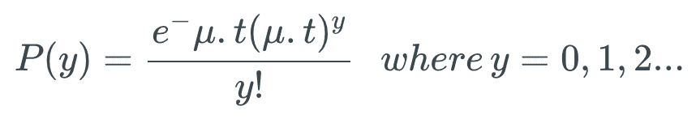
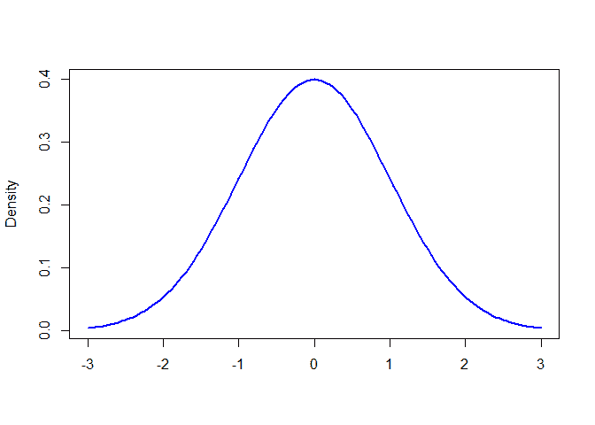
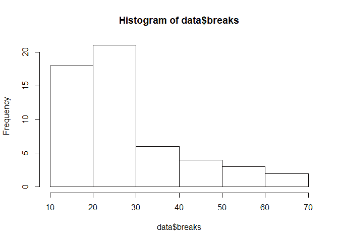
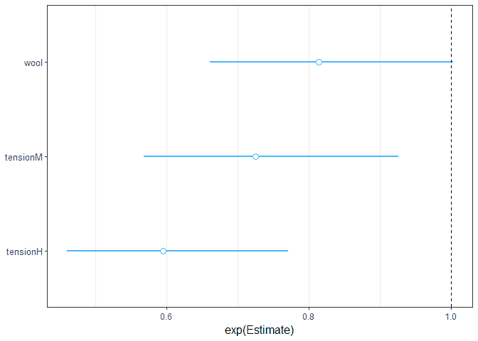
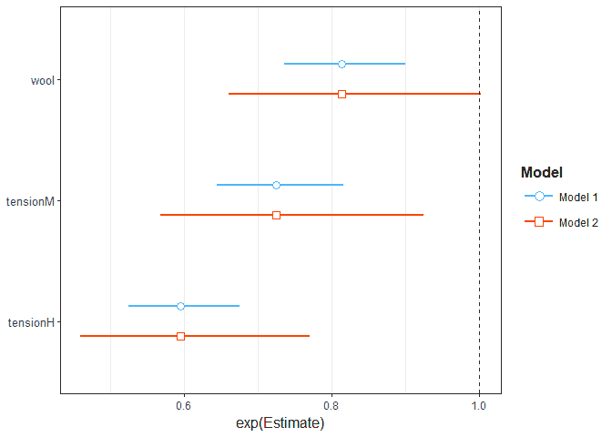
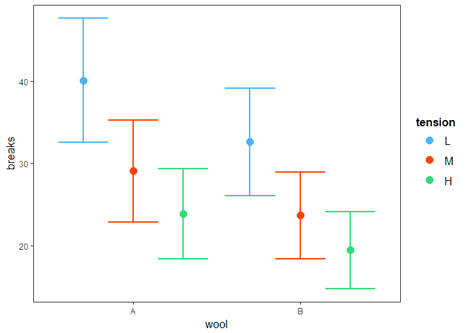
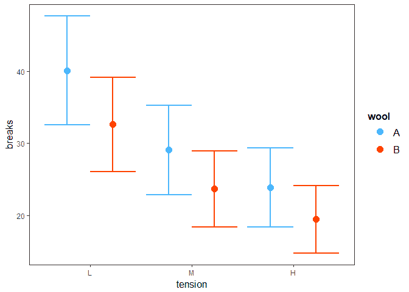
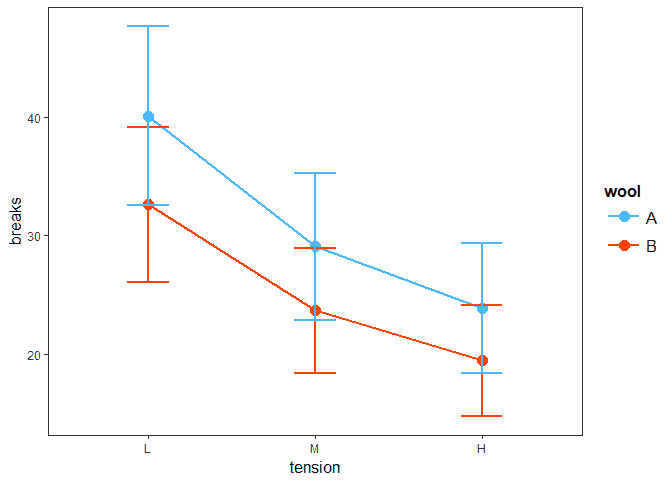
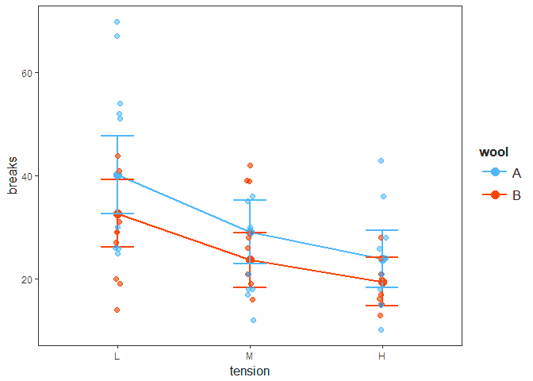

# 教程:R 中的泊松回归

> 原文：<https://www.dataquest.io/blog/tutorial-poisson-regression-in-r/>

February 27, 2019

如果你知道如何以及何时使用泊松回归，它会是一个非常有用的工具。在本教程中，我们将深入了解泊松回归，它是什么，以及 R 程序员如何在现实世界中使用它。

具体来说，我们将涵盖:

*   泊松回归实际上是什么，我们什么时候应该使用它
*   泊松分布，以及它与正态分布的区别
*   基于广义最小二乘法的泊松回归建模
*   计数数据的泊松回归建模
*   使用 jtools 可视化来自模型的发现
*   费率数据的泊松回归建模

> install.packages("Dataquest ")

从我们的[R 课程简介](/course/intro-to-r/)开始学习 R——不需要信用卡！

[SIGN UP](https://app.dataquest.io/signup)

## 什么是泊松回归模型？

泊松回归模型最适用于对结果为计数的事件进行建模。或者，更具体地说，*计数数据*:具有非负整数值的离散数据，用于计数，比如某个事件在给定时间段内发生的次数或者在杂货店排队的人数。

*计数数据*也可以表示为*速率数据*，因为事件在一个时间范围内发生的次数可以表示为原始计数(即“一天中，我们吃三顿饭”)或速率(我们以每小时 0.125 顿饭的速率吃饭)。

泊松回归允许我们确定哪些解释变量(X 值)对给定的响应变量(Y 值、计数或比率)有影响，从而帮助我们分析计数数据和比率数据。例如，杂货店可以应用泊松回归来更好地理解和预测排队人数。

## 什么是泊松分布？

泊松分布是以法国数学家西蒙·丹尼斯·泊松命名的统计理论。假设 *y* 的发生不受 *y* 之前发生的时间的影响，它对特定时间范围内发生的一个或多个事件 *y* 的概率进行建模。这可以用下面的公式进行数学表达:



这里， *μ* (在某些教科书中你可能会看到 *λ* 而不是 *μ* )是单位*曝光*下一个事件可能发生的平均次数。也叫泊松分布的**参数**。*曝光*可能是时间、空间、人口规模、距离或面积，但往往是时间，用 *t* 表示。如果未给出曝光值，则假定其等于 **1** 。

让我们通过为不同的 *μ* 值创建一个泊松分布图来形象化这一点。

首先，我们将创建一个 6 色矢量:

```py
 # vector of colors
colors <- c("Red", "Blue", "Gold", "Black", "Pink", "Green") 
```

接下来，我们将为分布创建一个列表，它将具有不同的 *μ* 值:

```py
 # declare a list to hold distribution values
poisson.dist < - list() 
```

然后，我们将为 *μ* 创建一个值向量，并对来自 *μ* 的值进行循环，每个值的分位数范围为 0-20，将结果存储在一个列表中:

```py
 a < - c(1, 2, 3, 4, 5, 6) # A vector for values of u
for (i in 1:6) {
    poisson.dist[[i]] <- c(dpois(0:20, i)) # Store distribution vector for each corresponding value of u
} 
```

最后，我们将使用`plot()`来绘制这些点。`plot()`是 R 中的基本图形函数。在 R 中绘制数据的另一种常用方法是使用流行的`ggplot2`包；这包括在 [Dataquest 的 R 课程](https://www.dataquest.io/path/data-analyst-r)中。但是对于本教程，我们将坚持基 R 函数。

```py
 # plot each vector in the list using the colors vectors to represent each value for u
plot(unlist(poisson.dist[1]), type = "o", xlab="y", ylab = "P(y)", 
col = colors[i])
for (i in 1:6) {
    lines(unlist(poisson.dist[i]), type = "o", col = colors[i])
}
# Adds legend to the graph plotted
legend("topright", legend = a, inset = 0.08, cex = 1.0, fill = colors, title = "Values of u") 
```


注意，我们使用`dpois(sequence,lambda)`来绘制泊松分布中的概率密度函数(PDF)。在概率论中，概率密度函数是描述连续随机变量(其可能值是随机事件的连续结果的变量)具有给定值的相对可能性的函数。(在统计学中,“随机”变量只是一个其结果是随机事件的结果的变量。)

### 泊松分布和正态分布有什么不同？

泊松分布最常用于计算给定时间间隔内事件发生的概率。因为我们讨论的是一个计数，泊松分布的结果必须是 0 或更高——一个事件不可能发生负次数。另一方面，*正态分布*是连续变量的连续分布，它可能导致正值或负值:

| 泊松分布 | 正态分布 |
| --- | --- |
| 用于计数数据或比率数据 | 用于连续变量 |
| 取决于λ值的偏斜。 | 围绕平均值对称的钟形曲线。 |
| 方差=平均值 | 方差和均值是不同的参数；均值、中值和众数相等 |

我们可以生成 R 的正态分布，如下所示:

```py
 # create a sequence -3 to +3 with .05 increments 
xseq < - seq(-3, 3, .05) 

# generate a Probability Density Function
densities <- dnorm(xseq, 0, 1) 

# plot the graph
plot(xseq, densities, col = "blue", xlab = "", ylab = "Density", type = "l", lwd = 2) 
# col: changes the color of line
# 'xlab' and 'ylab' are labels for x and y axis respectively
# type: defines the type of plot. 'l' gives a line graph
# lwd: defines line width 
```



在 R 中，`dnorm(sequence, mean, std.dev)`用于绘制正态分布的概率密度函数(PDF)。

为了理解泊松分布，考虑来自 Chi Yau 的 R 教程教科书的以下问题:

如果平均每分钟有 12 辆车过桥，那么在任何给定的一分钟内有 17 辆或更多的车过桥的概率是多少？

这里，平均每分钟过桥的车辆数量是 *μ* = 12 辆。

`ppois(q, u, lower.tail = TRUE)`是一个 R 函数，给出一个随机变量低于或等于一个值的概率。

我们必须找出拥有十七辆或多**辆**汽车的概率，所以我们将使用`lower.trail = FALSE`并将 q 设为 16:

```py
 ppois(16, 12, lower.tail = FALSE)
# lower.tail = logical; if TRUE (default) then probabilities are P[X < = x], otherwise, P[X > x]. 
```

```py
 ## [1] 0.101291 
```

要得到一个百分比，我们只需将这个输出乘以 100。现在我们有了问题的答案:在任何特定的一分钟内，有 17 辆或更多的汽车通过这座桥的概率是 **10.1%** 。

### 泊松回归模型和广义最小二乘法

广义线性模型是响应变量遵循非正态分布的模型。这与线性回归模型形成对比，在线性回归模型中，响应变量遵循正态分布。这是因为广义线性模型的响应变量是绝对的，如是、否；或者 A 组、B 组，因此不在-∞到+∞的范围内。因此，反应和预测变量之间的关系可能不是线性的。在 GLM:

*和*[*【I】*]=*+*【β】[+*<sub>*【p】*]***【I】*+) *n****</sub>**

 *响应变量*y*[I由预测变量和一些误差项的*线性函数建模。*]

泊松回归模型是一种*广义线性模型(GLM)* ，用于对计数数据和列联表进行建模。输出 *Y* (计数)是一个遵循泊松分布的值。它假设*期望值(均值)*的对数，可以通过一些未知参数建模成线性形式。

**注:** *在统计学中，列联表([例](https://i.stack.imgur.com/8YuSA.jpg))是依赖于多个变量的频率矩阵。*

为了将非线性关系转换成线性形式，使用了一个**链接函数**，它是泊松回归的**对数**。因此，泊松回归模型也被称为*对数线性模型*。泊松回归模型的一般数学形式是:

```py
log(y)=α + β[1]x[1] + β[2]x[2] + … + β[p]x[p]
```

在哪里，

*   *y* :响应变量
*   *α* 和 *β* :数值系数， *α* 为截距，有时 *α* 也用 *β* [0] 表示，同样如此
*   *x* 是预测值/解释变量

使用最大似然估计(MLE)或[最大似然](https://en.wikipedia.org/wiki/Quasi-likelihood)等方法计算系数。

考虑一个包含一个预测变量和一个响应变量的方程:

```py
log(y)=α + β(x)
```

 **这相当于:

```py
y = exp(α + β(x)) = exp(α) + exp(β * x)
```
 **注意:在泊松回归模型中，预测变量或解释变量可以是数值或分类值的混合。

泊松分布和泊松回归最重要的特征之一是**等离差**，这意味着分布的均值和方差相等。

方差衡量数据的分布。它是“平均值的平方差的平均值”。如果所有值都相同，方差(Var)等于 0。值之间的差异越大，方差越大。Mean 是数据集值的平均值。平均值是值的总和除以值的个数。

假设平均值( *μ* )由 *E* ( *X* )表示

*E* ( *X* )= *μ*

对于泊松回归，均值和方差的关系如下:

*v*a*r*(*X*)=*σ*2E(*X*)

其中*σ*T2 2 为色散参数。由于*v*a*r*(*X*)=*E*(*X*)(方差=均值)必须成立，泊松模型才能完全拟合， *σ*² 必须等于 1。

当方差大于均值时，称为**过分散**，且大于 1。如果它小于 1，则称为**欠分散**。

## 使用计数数据的泊松回归建模

在 R 中，`glm()`命令用于建模广义线性模型。下面是`glm()`的大致结构:

```py
 glm(formula, family = familytype(link = ""), data,...) 
```

在本教程中，我们将使用这三个参数。要了解更多细节，我们可以查阅 R 文档，但让我们快速浏览一下每个文档所指的内容:

| 参数 | 描述 |
| --: | :-- |
| **公式** | 该公式是如何拟合模型的符号表示 |
| **家庭** | 家族告诉方差和连接函数的选择。家庭有几种选择，包括泊松和逻辑斯蒂 |
| **数据** | 数据是要使用的数据集 |

`glm()`通过以下默认链接功能为系列提供八种选择:

| 家庭的 | 默认链接功能 |
| --- | --- |
| 二项式 | (link = "logit ") |
| 高斯的 | (link = "身份") |
| 微克 | (link = "反向") |
| 逆高斯 | (链接= $frac{1}{mu^2}$) |
| 泊松 | (link = "log ") |
| 类似的 | (link = "恒等式"，variance = "常数") |
| 拟二项式 | (link = "logit ") |
| 准泊松 | (link = "log ") |

### 让我们开始建模吧！

我们将建立与织造过程中纱线断裂频率相关的泊松回归模型。这些数据可以在 R 中的`datasets`包中找到，所以我们需要做的第一件事是使用`install.package("datasets")`安装包，并用`library(datasets)`加载库:

```py
 # install.packages("datasets")
library(datasets) # include library datasets after installation 
```

`datasets`包包括大量的数据集，所以我们需要专门选择我们的纱线数据。[查阅包文档](https://cran.r-project.org/manuals.html)，我们可以看到它被称为 **warpbreaks** ，所以我们把它作为一个对象存储。

```py
 data < - warpbreaks 
```

我们来看看数据:

```py
 columns < - names(data) # Extract column names from dataframe
columns # show columns 
```

输出:`[1] "breaks" "wool" "tension"`

### 我们的数据里有什么？

该数据集显示了每台织机上不同类型的织机在每根固定长度的纱线上发生了多少次经纱断头。我们可以在文档[这里](https://cran.r-project.org/manuals.html)中阅读关于该数据集的更多详细信息，但这里是我们将查看的三列以及每一列所指的内容:

| 圆柱 | 类型 | 描述 |
| --- | --- | --- |
| 休息 | 数字的 | 休息的次数 |
| 羊毛 | 因素 | 羊毛的种类(A 或 B) |
| 紧张 | 因素 | 张力水平(L，M，H) |

在 9 台织机上测量了 6 种经纱中的每一种，数据集中总共有 54 个条目。

让我们看看如何使用`ls.str()`命令构建数据:

```py
 ls.str(warpbreaks) 
```

输出:

```py
breaks : num [1:54] 26 30 54 25 70 52 51 26 67 18 ...
tension : Factor w/ 3 levels "L","M","H": 1 1 1 1 1 1 1 1 1 2 ...
wool : Factor w/ 2 levels "A","B": 1 1 1 1 1 1 1 1 1 1 ... 
```

从上面，我们可以看到数据中存在的类型和级别。阅读这个来学习更多关于 r 中的因子。

现在我们将使用`data`数据帧。请记住，使用泊松分布模型，我们试图弄清楚一些预测变量如何影响响应变量。这里，`breaks`是响应变量，`wool`和`tension`是预测变量。

我们可以通过创建直方图来查看因变量`breaks`的数据连续性:

```py
 hist(data$breaks) 
```



显然，这些数据并不像正态分布那样呈钟形曲线。

让我们检查因变量的`mean()`和`var()`:

```py
 mean(data$breaks) # calculate mean 
```

输出:`[1] 28.14815`

```py
 var(data$breaks) # calculate variance 
```

输出:`[1] 174.2041`

方差远大于平均值，这表明我们将在模型中出现过度分散。

让我们使用`glm()`命令来拟合泊松模型。

```py
 # model poisson regression using glm()
poisson.model < - glm(breaks ~ wool + tension, data, family = poisson(link = "log"))
summary(poisson.model) 
```

`summary()`是一个通用函数，用于生成各种模型拟合函数的结果汇总。

输出:

```py
Call: glm(formula = breaks ~ wool + tension, family = poisson(link = "log"), data = data)

Deviance Residuals: 
Min 1Q Median 3Q Max 
-3.6871 -1.6503 -0.4269 1.1902 4.2616 

Coefficients:
Estimate Std. Error z value Pr(>|z|) 
(Intercept) 3.69196 0.04541 81.302 < 2e-16 ***
woolB -0.20599 0.05157 -3.994 6.49e-05 ***
tensionM -0.32132 0.06027 -5.332 9.73e-08 ***
tensionH -0.51849 0.06396 -8.107 5.21e-16 ***
---
Signif. codes: 0 ‘***’ 0.001 ‘**’ 0.01 ‘*’ 0.05 ‘.’ 0.1 ‘ ’ 1
(Dispersion parameter for poisson family taken to be 1)
Null deviance: 297.37 on 53 degrees of freedom
Residual deviance: 210.39 on 50 degrees of freedom
AIC: 493.06Number of Fisher Scoring iterations: 4
 
```

### 解读泊松模型

我们刚刚得到了许多信息，现在我们需要解释这些信息。名为`Estimate`的第一列是 *α* (截距) *β* [1] 等的系数值。以下是对参数估计的解释:

*   当 X = 0 时， *e* x *p* ( *α* )=对平均值的影响 *μ*
*   *e*X*p*(*β*)= X 每增加一个单位，预测变量对 Y 的均值有 *e **x** p* ( *β* )的乘法效应，即 *μ*
*   如果 *β* = 0，那么 exp( *β* ) = 1，期望计数为 *e* x *p* ( *α* )并且，Y 和 X 不相关。
*   如果 *β* > 0，那么 exp( *β* ) > 1，期望计数是 X = 0 时的 exp( *β* )倍
*   如果 *β* < 0，那么 exp( *β* ) < 1，期望计数比 X = 0 时的 exp( *β* )小一倍

如果`family = poisson`保存在`glm()`中，则使用[最大似然估计 MLE](https://en.wikipedia.org/wiki/Maximum_likelihood_estimation) 计算这些参数。

r 将分类变量视为哑变量。分类变量，也称为指标变量，通过将变量中的级别指定为某种数字表示形式而转换为虚拟变量。一般规则是，如果一个因子变量中有 *k* 个类别，`glm()`的输出将有*k*1 个类别，剩余的 1 个作为基本类别。

我们可以在上面的总结中看到，对于羊毛来说，“A”是基础，没有在总结中显示。同样，对于张力来说,“L”是基本范畴。

为了了解哪些解释变量对响应变量有影响，我们将查看 *p* 值。如果 ***p 小于 0.05*** ，则该变量对响应变量有影响。在上面的总结中，我们可以看到所有的 p 值都小于 0.05，因此，*和*两个解释变量(羊毛和张力)对断裂都有显著影响。注意 R 输出是如何在每个变量的末尾使用`***`的。星星的数量象征着意义。

在开始解释结果之前，让我们检查一下这个模型是过度分散还是分散不足。如果*剩余偏差*大于自由度，则存在过度分散。这意味着估计值是正确的，但是标准误差(标准差)是错误的，并且没有被模型解释。

零偏差显示了模型对响应变量的预测有多好，该模型仅包括截距(大平均值),而残差包括独立变量。上面，我们可以看到，3 (53-50 =3)个独立变量的加入使偏离度从 297.37 下降到 210.39。价值观差异越大意味着不适合。

因此，为了获得更准确的标准误差，我们可以使用*准泊松*模型:

```py
 poisson.model2 < - glm(breaks ~ wool + tension, data = data, family = quasipoisson(link = "log"))
summary(poisson.model2) 
```

输出:

```py
Call: 
glm(formula = breaks ~ wool + tension, family = poisson(link = "log"), data = data)

Deviance Residuals: 
Min 1Q Median 3Q Max 
-3.6871 -1.6503 -0.4269 1.1902 4.2616 

Coefficients:
Estimate Std. Error z value Pr(>|z|) 
(Intercept) 3.69196 0.04541 81.302 < 2e-16 ***
woolB -0.20599 0.05157 -3.994 6.49e-05 ***
tensionM -0.32132 0.06027 -5.332 9.73e-08 ***
tensionH -0.51849 0.06396 -8.107 5.21e-16 ***
---
Signif. codes: 0 ‘***’ 0.001 ‘**’ 0.01 ‘*’ 0.05 ‘.’ 0.1 ‘ ’ 1
(Dispersion parameter for poisson family taken to be 1)
Null deviance: 297.37 on 53 degrees of freedom
Residual deviance: 210.39 on 50 degrees of freedom
AIC: 493.06
Number of Fisher Scoring iterations: 4
 
```

### 比较模型:

既然我们有了两种不同的型号，让我们来比较一下哪一种更好。首先，我们将安装`arm`库，因为它包含了我们需要的一个函数:

```py
 # install.packages("arm")

# load library arm that contains the function se.coef()
library(arm) 
```

现在我们将使用`se.coef()`函数从每个模型中提取系数，然后使用`cbind()`将这些提取的值合并到一个数据帧中，这样我们就可以对它们进行比较。

```py
 # extract coefficients from first model using 'coef()'
coef1 = coef(poisson.model) 

# extract coefficients from second model
coef2 = coef(poisson.model2) 

# extract standard errors from first model using 'se.coef()'
se.coef1 = se.coef(poisson.model) 

# extract standard errors from second model
se.coef2 = se.coef(poisson.model2)

# use 'cbind()' to combine values into one dataframe
models.both < - cbind(coef1, se.coef1, coef2, se.coef2, exponent = exp(coef1)) 

# show dataframe
models.both 
```

输出:

```py
coef1 se.coef1 coef2 se.coef2 exponent
(Intercept) 3.6919631 0.04541069 3.6919631 0.09374352 40.1235380
woolB -0.2059884 0.05157117 -0.2059884 0.10646089 0.8138425
tensionM -0.3213204 0.06026580 -0.3213204 0.12440965 0.7251908
tensionH -0.5184885 0.06395944 -0.5184885 0.13203462 0.5954198 
```

在上面的输出中，我们可以看到系数是相同的，但是标准误差是不同的。

记住这几点，让我们看看*羊毛*的估价。其值为 **-0.2059884** ， **-0.2059884** 的指数为 **0.8138425** 。

```py
1-0.8138425 
```

输出:`[1] 0.1861575`

这表明从 A 型羊毛换成 B 型羊毛导致断裂*减少*0.8138425 倍截距，因为估计值-0.2059884 为负。另一种说法是，假设所有其他变量都相同，如果我们将羊毛类型从 A 改为 B，断裂次数将下降 18.6%。

### 从模型中预测

一旦建立了模型，我们就可以使用`predict(model, data, type)`来预测结果，使用新的数据框架包含除训练数据之外的数据。让我们看一个例子。

```py
 # make a dataframe with new data
newdata = data.frame(wool = "B", tension = "M")

# use 'predict()' to run model on new data
predict(poisson.model2, newdata = newdata, type = "response") 
```

输出:`[1] 23.68056`

我们的模型预测，对于羊毛类型 B 和张力级别 m，将有大约 **24** 个断裂。

### 使用 jtools 可视化结果

当你与他人分享你的分析时，表格通常不是吸引人们注意力的最佳方式。图表帮助人们更快地掌握你的发现。在 R 中可视化数据最流行的方法可能是`ggplot2`(在 [Dataquest 的数据可视化课程](https://www.dataquest.io/course/r-data-viz/)中讲授)，我们还将使用一个名为 [jtools](https://cran.r-project.org/web/packages/jtools/jtools.pdf) 的出色的 R 包，它包括专门用于汇总和可视化回归模型的工具。让我们用`jtools`来形象化`poisson.model2`。

```py
 # Install the package jtools if not already installed
install.packages("jtools")

# you may be asked to install 'broom' and 'ggstance' packages as well
install.packages("broom")
install.packages("ggstance") 
```

`jtools`提供了`plot_summs()`和`plot_coefs()`来可视化模型的概要，也允许我们用`ggplot2`来比较不同的模型。

```py
 # Include jtools library
library(jtools)

# plot regression coefficients for poisson.model2
plot_summs(poisson.model2, scale = TRUE, exp = TRUE) 
```



```py
 # plot regression coefficients for poisson.model2 and poisson.model
plot_summs(poisson.model, poisson.model2, scale = TRUE, exp = TRUE) 
```

输出:



在上面的代码中，`plot_summs(poisson.model2, scale = TRUE, exp = TRUE)`使用`glm`中的准泊松家族绘制了第二个模型。

*   `plot_summs()`中的第一个参数是要使用的回归模型，可以是一个或多个。
*   `scale`有助于解决变量尺度不同的问题。
*   `exp`被设置为`TRUE`,因为对于泊松回归，我们更可能对估计值的指数值感兴趣，而不是线性值。

你可以在文档中找到关于`jtools`和`plot_summs()` [的更多细节。](https://www.jtools.jacob-long.com/reference/plot_summs.html)

我们还可以将预测变量之间的相互作用可视化。`jtools`为不同类型的变量提供不同的函数。例如，如果所有的变量都是分类的，我们可以使用`cat_plot()`来更好地理解它们之间的相互作用。对于连续变量，使用`interact_plot()`。

在 **warpbreaks** 数据中，我们有分类预测变量，所以我们将使用`cat_plot()`来可视化它们之间的相互作用，通过给它参数来指定我们想要使用的模型、我们正在查看的预测变量以及它与之组合以产生结果的其他预测变量。

```py
 cat_plot(poisson.model2, pred = wool, modx = tension)
# argument 1: regression model
# pred: The categorical variable that will appear on x-axis
# modx: Moderator variable that has an effect in combination to pred on outcome 
```

输出:



我们可以做同样的事情来看看`tension`:

```py
 # using cat_plot. Pass poisson.model2 and we want to see effect of tension type so we set pred=tension
cat_plot(poisson.model2, pred = tension, modx = wool) 
```

输出:



上面，我们看到了三种不同类型的张力(L、M 和 H)如何影响每种羊毛类型的断裂。例如，低张力和 A 型羊毛的断裂倾向最高。

我们还可以使用`geom`参数定义由`cat_plot()`创建的绘图类型。该参数增强了对图的解释。我们可以这样使用它，将`geom`作为附加参数传递给`cat_plot`:

```py
 cat_plot(poisson.model2, pred = tension, modx = wool, geom = "line") 
```

输出:



我们也可以通过添加`plot.points = TRUE`来将观察结果包含在绘图中:

```py
 cat_plot(poisson.model2, pred = tension, modx = wool, geom = "line", plot.points = TRUE) 
```

输出:



有很多其他的设计选项，包括线条样式、颜色等，这将允许我们定制这些可视化的外观。具体的，参考`jtools`文档[这里](https://cran.r-project.org/web/packages/jtools/jtools.pdf)。

## 使用速率数据的泊松回归建模

到目前为止，在本教程中，我们已经对计数数据进行了建模，但我们也可以对预测一段时间或分组内的计数数量的速率数据进行建模。模拟速率数据的公式如下:

*l*o*g*(*x*/*n*=*β*+

这相当于:(应用对数公式)

或*g*(*x*)─l*或*(*n*=**

 **或*g*(*x*=*l*或*(*n【t11 })+**

 **因此，速率数据可以通过包括系数为 1 的 **log(n)** 项来建模。这被称为**偏移**。该偏移用 r 中的`offset()`建模。

让我们使用来自 [ISwR 包](https://cran.r-project.org/web/packages/ISwR/index.html)的另一个名为`eba1977`的数据集来为比率数据建立泊松回归模型。首先，我们将安装软件包:

```py
 # install.packages("ISwR")library(ISwR) 
```

```py
## Warning: package 'ISwR' was built under R version 3.4.4 
```

现在，让我们来看看关于数据的一些细节，并打印前十行来了解数据集包含的内容。

```py
 data(eba1977)
cancer.data = eba1977
cancer.data[1:10, ]
# Description
# Lung cancer incidence in four Danish cities 1968-1971
# Description:
# This data set contains counts of incident lung cancer cases and
# population size in four neighbouring Danish cities by age group.
# Format:
# A data frame with 24 observations on the following 4 variables: 
# city a factor with levels Fredericia, Horsens, Kolding, and Vejle.
# age a factor with levels 40-54, 55-59, 60-64, 65-69,70-74, and 75+.
# pop a numeric vector, number of inhabitants.
# cases a numeric vector, number of lung cancer cases. 
```

输出:

```py
city age pop cases
1 Fredericia 40-54 3059 11
2 Horsens 40-54 2879 13
3 Kolding 40-54 3142 4
4 Vejle 40-54 2520 5
5 Fredericia 55-59 800 11
6 Horsens 55-59 1083 6
7 Kolding 55-59 1050 8
8 Vejle 55-59 878 7
9 Fredericia 60-64 710 11
10 Horsens 60-64 923 15 
```

为了对速率数据建模，我们使用 **X/n** ，其中 *X* 是要发生的事件，而 *n* 是分组。在本例中，**X =病例**(事件为癌症病例) **n=pop** (人群为分组)。

如上式所示，比率数据由 *log* ( *n* )计算，在该数据中 *n* 是人口，因此我们将首先找到人口的 log。我们可以为*病例/人群*建模如下:

```py
 # find the log(n) of each value in 'pop' column. It is the third column
logpop = log(cancer.data[ ,3])

# add the log values to the dataframe using 'cbind()'
new.cancer.data = cbind(cancer.data, logpop)

# display new dataframe
new.cancer.data 
```

输出:

```py
city age pop cases logpop
1 Fredericia 40-54 3059 11 8.025843
2 Horsens 40-54 2879 13 7.965198
3 Kolding 40-54 3142 4 8.052615
4 Vejle 40-54 2520 5 7.832014
5 Fredericia 55-59 800 11 6.684612
6 Horsens 55-59 1083 6 6.987490
7 Kolding 55-59 1050 8 6.956545
8 Vejle 55-59 878 7 6.777647
9 Fredericia 60-64 710 11 6.565265
10 Horsens 60-64 923 15 6.827629
11 Kolding 60-64 895 7 6.796824
12 Vejle 60-64 839 10 6.732211
13 Fredericia 65-69 581 10 6.364751
14 Horsens 65-69 834 10 6.726233
15 Kolding 65-69 702 11 6.553933
16 Vejle 65-69 631 14 6.447306
17 Fredericia 70-74 509 11 6.232448
18 Horsens 70-74 634 12 6.452049
19 Kolding 70-74 535 9 6.282267
20 Vejle 70-74 539 8 6.289716
21 Fredericia 75+ 605 10 6.405228
22 Horsens 75+ 782 2 6.661855
23 Kolding 75+ 659 12 6.490724
24 Vejle 75+ 619 7 6.428105 
```

现在，让我们用`offset()`对速率数据进行建模。

```py
 poisson.model.rate < - glm(cases ~ city + age+ offset(logpop), family = poisson(link = "log"), data = cancer.data)

#display summary
summary(poisson.model.rate) 
```

输出:

```py
Call:
glm(formula = cases ~ city + age + offset(logpop), family = poisson(link = "log"), data = cancer.data)

Deviance Residuals: 
Min 1Q Median 3Q Max 
-2.63573 -0.67296 -0.03436 0.37258 1.85267 

Coefficients:
Estimate Std. Error z value Pr(>|z|) 
(Intercept) -5.6321 0.2003 -28.125 < 2e-16 ***
cityHorsens -0.3301 0.1815 -1.818 0.0690 . 
cityKolding -0.3715 0.1878 -1.978 0.0479 * 
cityVejle -0.2723 0.1879 -1.450 0.1472 
age55-59 1.1010 0.2483 4.434 9.23e-06 ***
age60-64 1.5186 0.2316 6.556 5.53e-11 ***
age65-69 1.7677 0.2294 7.704 1.31e-14 ***
age70-74 1.8569 0.2353 7.891 3.00e-15 ***
age75+ 1.4197 0.2503 5.672 1.41e-08 ***
---
Signif. codes: 0 ‘***’ 0.001 ‘**’ 0.01 ‘*’ 0.05 ‘.’ 0.1 ‘ ’ 1
(Dispersion parameter for poisson family taken to be 1)Null deviance: 129.908 on 23 degrees of freedom

Residual deviance: 23.447 on 15 degrees of freedom
AIC: 137.84
Number of Fisher Scoring iterations: 5
 
```

在这个数据集中，我们可以看到剩余偏差接近自由度，离散参数为 **1.5 (23.447/15)** 很小，因此模型是一个很好的拟合。

我们使用`fitted(model)`返回模型拟合的值。它使用模型所基于的训练数据返回结果。让我们试一试:

```py
 fitted(poisson.model.rate) 
```

```py
1 2 3 4 5 6 7 8 
10.954812 7.411803 7.760169 6.873215 8.615485 8.384458 7.798635 7.201421 
9 10 11 12 13 14 15 16 
11.609373 10.849479 10.092831 10.448316 12.187276 12.576313 10.155638 10.080773 
17 18 19 20 21 22 23 24 
11.672630 10.451942 8.461440 9.413988 8.960422 8.326004 6.731286 6.982287 
```

使用此模型，我们可以使用`predict()`函数预测新数据集每 1000 人的病例数，就像我们之前对计数数据模型所做的那样:

```py
 # create a test dataframe containing new values of variables
test.data = data.frame(city = "Kolding", age = "40-54", pop = 1000, logpop = log(1000)) 

# predict outcomes (responses) using 'predict()' 
predicted.value < - predict(poisson.model.rate, test.data, type = "response") 

# show predicted value
predicted.value 
```

输出:`[1] 2.469818`

因此，**对于科灵市 40-54 岁年龄组的人来说，我们可以预计每 1000 人中大约有 2 或 3 例肺癌**。

与计数数据一样，我们也可以使用准泊松来获得比率数据的更正确的标准误差，但是出于本教程的目的，我们不会重复该过程。

## 结论

泊松回归模型在计量经济学和现实世界预测中具有重要意义。在本教程中，我们学习了泊松分布、广义线性模型和泊松回归模型。

我们还学习了如何使用`glm()`为 R 中的计数和比率数据实现泊松回归模型，以及如何将数据拟合到模型中以预测新的数据集。此外，我们研究了如何使用*准泊松*在`glm()`中获得更精确的标准误差，并看到了一些使用`jtools`进行可视化的可能性。

[thrive _ leads id = ' 21203 ']

如果你想了解更多关于这个话题的信息，可以去看看 Dataquest 的数据分析师 R 网站，这将帮助你在大约 6 个月内做好工作准备。

### 参考

1.  [https://stat . ethz . ch/R-manual/R-devel/library/stats/html/poisson . html](https://cran.r-project.org/manuals.html)
2.  [https://www . the analysis factor . com/generalized-linear-models-in-r-part-6-poisson-regression-count-variables/](https://www.theanalysisfactor.com/generalized-linear-models-in-r-part-6-poisson-regression-count-variables/)
3.  [https://stats.idre.ucla.edu/r/dae/poisson-regression/](https://stats.idre.ucla.edu/r/dae/poisson-regression/)
4.  [https://www . rdocumentation . org/packages/base/versions/3 . 5 . 2/topics/summary](https://www.rdocumentation.org/packages/base/versions/3.5.2/topics/summary)

### 准备好提升你的 R 技能了吗？

我们 R path 的[数据分析师涵盖了你找到工作所需的所有技能，包括:](/path/data-analyst-r/)

*   使用 **ggplot2** 进行数据可视化
*   使用 **tidyverse** 软件包的高级数据清理技能
*   R 用户的重要 SQL 技能
*   **统计**和概率的基础知识
*   ...还有**多得多的**

没有要安装的东西，**没有先决条件**，也没有时间表。

[Start learning for free!](https://app.dataquest.io/signup)*********