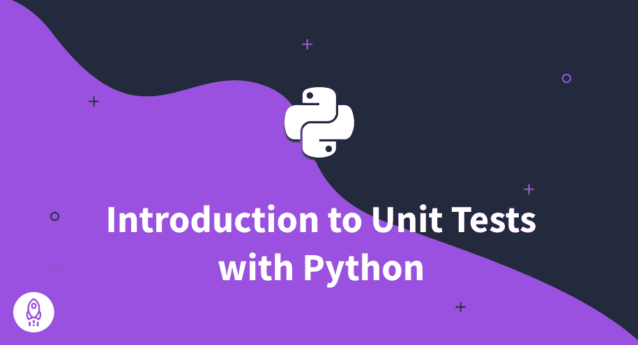

# Python 单元测试初学者指南(2022)

> 原文：<https://www.dataquest.io/blog/unit-tests-python/>

October 6, 2022

单元测试是为了测试其他代码而编写的代码段，通常是一个函数或方法，我们称之为单元。它们是软件开发过程中非常重要的一部分，因为它们有助于确保代码按预期工作，并在早期捕捉到错误。此外，测试是一种最佳实践，通过在问题导致重大问题之前发现并修复问题，可以节省时间和金钱。

在本文中，我们将介绍用 Python 编写单元测试，从理解`assert`语句到使用专门为此类任务设计的框架——并遵循 Python 单元测试的最佳实践。

Python 有两个主要框架来简化单元测试:`unittest`和`PyTest`。第一个是从 Python 2.1 开始的 Python 标准库的一部分，也是我们在本文中关注的一个。

按照单元测试教程，您不需要任何高级知识，但是我们希望您对 Python 函数和类的工作原理有一个基本的了解。

## `assert`声明

`assert`语句是 Python 中的内置语句，顾名思义，用于断言给定条件是否为真。如果条件为真，什么都不会发生，但是如果条件不为真，就会产生一个错误。尽管最初看起来像是`try`和`except`子句，但它们是完全不同的，并且`assert`不应该用于错误处理，而是用于调试和测试。

例如，下面一行中的条件为真，因此它不输出或返回任何内容:

```py
assert 1 > 0
```

然而，如果我们改变这个条件，使它成为假，我们得到一个`AssertionError`:

```py
assert 1 < 0
```

```py
---------------------------------------------------------------------------
AssertionError                            Traceback (most recent call last)
<ipython-input-2-2d19dbe67b58> in <module>
----> 1 assert 1 < 0

AssertionError: 
```

注意，在错误消息的最后一行中，在`AssertionError:`之后没有实际的消息。那是因为用户应该传递这个消息。方法如下:

```py
n = 0
assert 1 < n, 'The Condition is False'
```

```py
---------------------------------------------------------------------------
AssertionError                            Traceback (most recent call last)
<ipython-input-3-e335e3eb84ff> in <module>
      1 n = 0
----> 2 assert 1 < n, 'The Condition is False'

AssertionError: The Condition is False
```

因此，使用`assert`的基本语法如下:

```py
assert <condition being tested>, <error message to be displayed>
```

`assert`使用起来非常简单。理解它对于测试来说是至关重要的，我们将在下面的章节中看到。

## `unittest`模块

`unittest`模块是一个框架，旨在让我们测试代码的工作变得更容易。该模块基于一些重要的面向对象概念工作，这就是为什么您需要理解 Python 中的类和方法的基础。

一个测试用例被认为是一个单一的测试单元，它由`TestCase`类来表示。在`unittest`提供的众多允许我们测试代码的工具中，这个类是最重要的工具之一。它被用作基类来创建我们自己的测试用例，使我们能够一次运行多个测试。

虽然我们在上一节已经看到了 Python `assert`语句的重要性，但是这里不会用到它。这是因为`TestCase`类也提供了几个自己的断言方法，它们的工作方式就像`assert`语句一样，只是针对特定类型的断言。

例如，`assertEqual`获取两个元素并测试它们是否相等，而`assertNotEqual`测试元素是否不同。同样，`assertTrue`方法接受一个元素并测试它是否为真，而`assertFalse`测试它是否为假。

下面是官方文档提供的`TestCase`类中最常用的断言方法列表:

| 方法 | 检查一下 |
| --- | --- |
| `assertEqual(a, b)` | `a == b` |
| `assertNotEqual(a, b)` | `a != b` |
| `assertTrue(x)` | `bool(x) is True` |
| `assertFalse(x)` | `bool(x) is False` |
| `assertIs(a, b)` | `a is b` |
| `assertIsNot(a, b)` | `a is not b` |
| `assertIsNone(x)` | `x is None` |
| `assertIsNotNone(x)` | `x is not None` |
| `assertIn(a, b)` | `a in b` |
| `assertNotIn(a, b)` | `a not in b` |
| `assertIsInstance(a, b)` | `isinstance(a, b)` |
| `assertNotIsInstance(a, b)` | `not isinstance(a, b)` |

很重要的一点是，`TestCase`类中的所有 assert 方法也接受一个`msg`参数，该参数在测试失败时用作错误消息。

## 实现单元测试

所以让我们实现一组简单的单元测试。首先，我们需要有一些代码来测试。为此，让我们考虑下面的`Calculations`类，它位于`tests`目录下的`my_calculations.py`文件中:

```py
# project/code/my_calculations.py

class Calculations:
    def __init__(self, a, b):
        self.a = a
        self.b = b

    def get_sum(self):
        return self.a + self.b

    def get_difference(self):
        return self.a - self.b

    def get_product(self):
        return self.a * self.b

    def get_quotient(self):
        return self.a / self.b
```

这是一个非常简单的类，接受两个数字，有四个方法将第一个数字与第二个数字相加、相减、相乘和相除，并返回结果。

所以现在我们想测试这个类中的方法。为此，我们需要基于`TestCase`类创建一个类，这个类将包含执行测试的方法。

假设我们有以下文件夹结构:

```py
project/
│
├── code/
│   ├── __initII.py
│   └── my_calculations
│
└── tests.py
```

```py
# project/test.py

import unittest
from code.my_calculations import Calculations

class TestCalculations(unittest.TestCase):

    def test_sum(self):
        calculation = Calculations(8, 2)
        self.assertEqual(calculation.get_sum(), 10, 'The sum is wrong.')

if __name__ == '__main__':
    unittest.main()
```

上面的代码测试了`Calculations`类的`get_sum`方法。为此，我们必须做到以下几点:

1.  导入`unittests`和`Calculations`类
2.  实例化一个对象如果`Calculations`类
3.  创建`TestCalculations`类和其中的`test_sum`方法

注意，我们使用`assertEqual`来断言`get_sum`的输出是否等于 10。我们还为失败的情况设置了消息。最后，当我们运行这个脚本时，`unittest.main()`运行测试。这是我们得到的输出:

```py
.
----------------------------------------------------------------------
Ran 1 test in 0.000s
OK
```

例如，如果我们将期望值从 10 更改为 11，测试将会失败，并且我们会得到以下输出:

```py
----------------------------------------------------------------------
Traceback (most recent call last):
  File ".\my_test.py", line 9, in test_sum
    self.assertEqual(calculation.get_sum(), 11, 'The sum is wrong.')
AssertionError: 10 != 11 : The sum is wrong.
----------------------------------------------------------------------
Ran 1 test in 0.001s
```

注意到`The sum is wrong.`消息如预期的那样出现了。

按照同样的逻辑，我们有下面的代码来测试`Calculations`类中的所有四个方法:

```py
import unittest
from code.my_calculations import Calculations

class TestCalculations(unittest.TestCase):

    def test_sum(self):
        calculation = Calculations(8, 2)
        self.assertEqual(calculation.get_sum(), 10, 'The sum is wrong.')

    def test_diff(self):
        calculation = Calculations(8, 2)
        self.assertEqual(calculation.get_difference(), 6, 'The difference is wrong.')

    def test_product(self):
        calculation = Calculations(8, 2)
        self.assertEqual(calculation.get_product(), 16, 'The product is wrong.')

    def test_quotient(self):
        calculation = Calculations(8, 2)
        self.assertEqual(calculation.get_quotient(), 4, 'The quotient is wrong.')

if __name__ == '__main__':
    unittest.main()
```

所有的测试都运行了:

```py
....
----------------------------------------------------------------------
Ran 4 tests in 0.001s
OK
```

顺便说一下，所有方法的名称都以单词`test`开头并不是偶然的。这是我们使用的惯例，以便`unittest`能够识别它应该运行的测试。例如，下面的代码只运行三个测试:

```py
import unittest
from code.my_calculations import Calculations

class TestCalculations(unittest.TestCase):

    def not_a_test_sum(self):
        calculation = Calculations(8, 2)
        self.assertEqual(calculation.get_sum(), 10, 'The sum is wrong.')

    def test_diff(self):
        calculation = Calculations(8, 2)
        self.assertEqual(calculation.get_difference(), 6, 'The difference is wrong.')

    def test_product(self):
        calculation = Calculations(8, 2)
        self.assertEqual(calculation.get_product(), 16, 'The product is wrong.')

    def test_quotient(self):
        calculation = Calculations(8, 2)
        self.assertEqual(calculation.get_quotient(), 4, 'The quotient is wrong.')

if __name__ == '__main__':
    unittest.main()
```

```py
...
----------------------------------------------------------------------
Ran 3 tests in 0.001s
OK
```

输出显示运行了三个测试。注意，第一个方法叫做`not_a_test_sum`，这就是为什么它没有被执行。

### `setUp`法

现在我们已经理解了使用`unittest`模块进行单元测试的基础，让我们稍微优化一下我们的代码。您可能已经注意到，在每个测试中，我们初始化了一个`Calculations`类的对象，它将被测试。然而，我们可以通过创建一个`setUp`方法来避免这种情况。

`TestCase`类已经有一个在每次测试前运行的`setUp`方法。所以当我们创建一个新的方法时，实际上是用我们自己的方法覆盖默认方法。这是实现了这个新方法的代码:

```py
import unittest
from code.my_calculations import Calculations

class TestCalculations(unittest.TestCase):

    def setUp(self):
        self.calculation = Calculations(8, 2)

    def test_sum(self):
        self.assertEqual(self.calculation.get_sum(), 10, 'The sum is wrong.')

    def test_diff(self):
        self.assertEqual(self.calculation.get_difference(), 6, 'The difference is wrong.')

    def test_product(self):
        self.assertEqual(self.calculation.get_product(), 16, 'The product is wrong.')

    def test_quotient(self):
        self.assertEqual(self.calculation.get_quotient(), 4, 'The quotient is wrong.')

if __name__ == '__main__':
    unittest.main()
```

这意味着`calculations`对象将在每次测试运行之前被初始化。另一种选择是使用`setUpClass`来代替。这个想法是一样的，唯一的区别是这个方法将只运行一次，而不是在每次测试之前。这是该方法的实现方式:

```py
@classmethod
def setUpClass(self):
    self.calculation = Calculations(8, 2)
```

## 从命令行运行测试

在上一节中，我们看到了用`.py`文件中的`unittest.main()`运行测试是可能的。然而，另一个非常有用的运行测试的方法是直接从命令行调用`unittest`。

使用命令行界面运行单元测试可以提高您的工作效率，因为它允许您一次运行多个文件:

```py
>>>pyhon -m unittest
```

上面的行将运行`unittest`中的发现模式，该模式将在当前目录中查找测试。

然而，为了运行测试，我们必须遵循一些命名惯例:包含测试的每个文件的名称必须以`test`开头，并且所有的测试必须是基于`TestCase`类的方法。正如我们前面所说的，所有这些方法的名字都必须以`test`这个词开头。最后，目录必须是一个可导入的模块，这意味着它应该包含一个`init.py`文件。

假设我们有下面的`tests`目录:

```py
tests/
├── init.py
├── test.py
└── test_str.py
```

`test_str.py`文件包含以下测试，这些测试取自 unittest 文档中的一个示例:

```py
import unittest

class TestStringMethods(unittest.TestCase):

    def test_upper(self):
        self.assertEqual('foo'.upper(), 'FOO')

    def test_isupper(self):
        self.assertTrue('FOO'.isupper())
        self.assertFalse('Foo'.isupper())

    def test_split(self):
        s = 'hello world'
        self.assertEqual(s.split(), ['hello', 'world'])
        # check that s.split fails when the separator is not a string
        with self.assertRaises(TypeError):
            s.split(2)

if __name__ == '__main__':
    unittest.main()
```

如果我们想在两个文件中运行测试，我们可以使用下面一行:

```py
>>>python -m unittest -v
```

`-v`使输出更加详细，这在同时运行几个测试时非常有用:

```py
test_diff (teste.test.TestCalculations) ... ok
test_product (teste.test.TestCalculations) ... ok
test_quotient (teste.test.TestCalculations) ... ok
test_sum (teste.test.TestCalculations) ... ok
test_isupper (teste.test_str.TestStringMethods) ... ok
test_split (teste.test_str.TestStringMethods) ... ok
test_upper (teste.test_str.TestStringMethods) ... ok
----------------------------------------------------------------------
Ran 7 tests in 0.002s
OK
```

我们还可以指定要运行的单个文件:

```py
>>>python -m unittest -v tests.test
```

在上一行中，`tests.test`确保只有 tests.py 文件会运行。使用相同的逻辑，我们指定测试类，甚至我们想要运行的单个方法:

```py
>>>python -m unittest -v tests.test.TestCalculations.test_diff
```

上面的行将只运行`test_diff`方法，正如我们在输出中看到的:

```py
test_diff (teste.test.TestCalculations) ... ok
----------------------------------------------------------------------
Ran 1 test in 0.000s
OK
```

## 结论

单元测试对于任何开发人员来说都是一项非常重要的技能。在本教程中，我们探索了基本概念以及如何使用强大的 Python 框架实现一些单元测试及其最佳实践。

然而，我们在这篇文章中看到的仍然只是对`unittest`能为您做什么的介绍。这是一个非常强大的工具，现在您已经了解了基础知识，还有更多的东西需要学习。