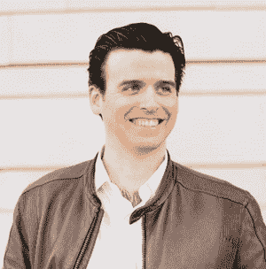

# 帕特里克·肯尼迪如何利用 Dataquest 向数据科学转型

> 原文：<https://www.dataquest.io/blog/user-story-patrick-kennedy/>

February 18, 2016

为了突出 Dataquest 如何改变人们的生活，我们已经开始了一个名为[用户故事](https://www.dataquest.io/blog/topics/student-stories/)的新博客系列，在这里我们采访我们的用户，以了解他们的个人旅程以及我们如何帮助他们达到他们需要的目的。

在本帖中，我们采访了顾问、作家兼企业家[帕特里克·肯尼迪](https://www.linkedin.com/in/1patrickkennedy)。帕特里克曾在多家房地产公司担任高管职务。他现在正在学习数据科学，因为他想探索它对现有行业的影响。对于他正在从事的数据科学公司和项目，他有很多想法。

## Dataquest 对您的学习过程有什么帮助？

很难用语言表达。这是非凡的。这正是我需要的，来弥合我以前作为一名实验心理学家的生活和我现在作为一名专注于建立企业的人的生活之间的差距。我知道许多统计数据和一些编码，但对 Sci-kit learn 中的模型构建技术却一无所知。我知道更仔细地查看数据会产生很好的结果，但我仍然手动构建应用程序，将我们的财务报告与我们的销售渠道、我们的个人销售人员目标、我们的预算以及我们上一年的业绩联系起来。那是一只熊。现在，想到我可以用这些类型的模型生产出什么东西，我感到非常兴奋。然而更重要的是，它向我展示了一种思考开发智力的新方法。

## 是什么让你决定开始使用 Dataquest？

我是从一个叫“激励”的招聘人员那里了解到 DataQuest 的。我是在与另一家在奥斯汀交易的大型商业房地产公司的一次会议上了解到这个项目的。当我听说了 gentile 的产品后，我知道我的未来在于以一种我在以前的职位上没有经历过的方式将数据与业务联系起来。glazing 的招聘人员让我看了一个 quora 帖子，是由 glazing 的 CTO 发的，他提到 DataQuest 是一个很棒的工具。我制定了一个计划，尽可能快地浏览尽可能多的 DataQuest 内容。这是一场斗争，因为你们都制作了新的内容！

## 你正在学习一门大会数据科学课程，很快就会身临其境。你如何对比训练营和在线学习的体验？

我把它看作一个垫脚石。从我读到的一切来看，数据科学沉浸式将会让我大吃一惊。然而，我用 DQ 弄湿了我的脚，所以我能知道我在做什么。我可以探索各种不同的主题，我可以在结构化的环境中这样做。这是最好的学习方法。随着引导式项目的引入，DQ 将培训的车轮移开了一些，但仍然提供了如何在数据科学过程中组织你的思想的基本轮廓。大会提供了少一点的结构和多一点的责任，让你自己去解决问题，你可以自己挑选、调查和展示一个顶点项目。GA 以实践的方式提供数据科学各方面的帮助和教学，使人们能够成功地开发他们的项目，但最终还是取决于个人。激励似乎是把个人扔进火里，然后看另一头出来的是什么。通过 DQ 和 GA 之前的充分准备，我认为这是一个完美的 1-2-3。

## 您一般的数据科学学习流程和计划是什么？

我的计划是双重的。首先，我在探索各种不同的商业想法，看看会推出什么，每一个都有数据科学的一个方面，有些比其他的更多。卖掉最后一家公司后，我很幸运有了自由去打探消息。第二，我知道让一家企业运转起来很难，所以我正在利用“激励”的结果援助来为我确定一些好的地方。当一个团体根据合同有义务安置你的时候总是很好的。最后，我想我不会只做一件事——我太容易厌倦了。我甚至可能只是再写一本关于学习数据科学过程的书。

## 你在心理学、房地产和管理方面有着丰富的职业和教育经历。这些是如何将你引向数据科学的？

到目前为止，这是一条有趣的道路——我希望我可以说这一切都是有预谋的。但对数据的真正感受来自于在哥伦比亚大学攻读实验心理学博士学位。这是我第一次真正深入研究具体的工具来分析数据，并为实验构建软件应用程序，并以一种使后端数据收集更容易的方式构建它们。这迫使我以一种全面的方式思考数据。此外，和一群追求相同目标的人在一起，让我找到了不同的做事方式。我的好朋友 Dave 教我关于分层混合模型，Baruch 教我如何以有意义的方式分析小数据集。对我来说，问题是一旦我们有了见解，目标就是发表、推广并继续下一个研究。没有任何一部分涉及到帮助他人。我的研究是关于我在电子游戏设计、最佳表现和员工敬业度或倦怠方面的感觉。一次又一次，有人告诉我，我的重点应该是研究，而不是应用研究。在与一名顾问(现已离职)讨论了区内研究可能涉及的所有有趣应用后，她告诉我，她对商业一无所知，也许我不适合做研究。所以我接受了她的建议，在整理我的论文提案的过程中离开了。

对我来说不幸的是，我把婴儿和洗澡水一起扔了出去，并试图不惜一切代价避免严格的数据分析，认为它被归入那些象牙塔。相反，我进入了创业世界，创办了几个自己的公司(一个变成了僵尸，另一个很快就被烧掉了)，拿到了商学学位，在一家科技孵化器工作。在孵化器里，我不断看到这些公司，我会帮助他们完善一个推介平台(由于我在哥伦比亚大学的多年教学，这个平台变得很容易)，然后筹集大量资金并毕业。但我想要的不仅仅是引领一家公司进入青春期。我想加入其中一家公司。我尽力推脱，但被告知我要么做销售，要么做工程。我不认为自己是一名工程师，销售让我觉得很酸，所以我做了任何非销售、非工程人员都会做的事情:咨询。

我咨询过的一家公司最终聘请我加入公司，担任运营总监。那是一家商业房地产公司——对此我只有一个模糊的概念。他们需要的似乎很简单:帮助找出谁做了什么。令我困惑的是，这甚至是一个问题，但当你试图在没有运营骨干的情况下快速增长时，你会错过其中的一些结构组件。所以我走进去，立刻看到了一份申请，是关于我几年前在这个区域进行的所有研究的。我可以用我对员工敬业度的研究来培养一种文化，看看这将如何影响未来的收入(提示:它影响很大)。

所以在这里，我用我的旧研究，它的工作。这让我想到了一个问题——在这里我还能做什么？我疯狂地开发各种工具和程序，这导致了我的第一本书的出版，我被提升到首席运营官，并最终将公司卖给了一家全球公司。太棒了。压力很大，但是很棒。这是通过对各种数据的调查得出的。构建实时销售漏斗需要数据收集、管理、分析和展示技术。大部分工作我都是手工完成的，但是我一直在寻找新的和改进的方法来实现自动化。然而，大约在这个时候，事情开始变得更加摩擦。

我越是尝试开发可扩展的技术，以达到既能预测潜在客户与我们签署意向书的可能性，又能预测哪家经纪人最有可能最大化这种可能性的最终目标，我就越感到阻力重重。当我负责三个办公室和大约 80 人的销售团队时，没有人真正关心收入最大化。这件事很奇怪，我过了一会儿才明白过来。简而言之，经纪人通常能从一堂销售课中赚取 50%以上的利润，这使得一个 3-5 岁的经纪人每年能赚 50 万美元。考虑到经纪公司在给经纪人一大笔钱后通常不会剩下多少钱，这导致很少或没有管理，或由经纪人管理。人们可以很容易地假设，如果一个经纪人/经理可以通过经纪业务每年赚取数百万美元，他们会花时间做些什么。

我在打一场必败的仗。当经纪人一周能打 4 天高尔夫，一年能赚 50 万的时候，他们试图推动经纪人赚更多的钱。为什么他们想工作而不是打高尔夫？当然，他们都认识到这很重要，但是其他人参与到这个系统中也很重要。不是他们。与许多想法一样，我的挫折让我再次意识到数据的力量。但是数据需要一个繁荣的环境。我生成、处理和展示的数据几乎没有任何效果。我需要一个开关。

任何销售组织都涉及到大量的数据，从最初陌生电话中的语气、情绪和用词，到管道管理的可预测性，再到对场地和办公空间位置的建议。见鬼，在研究谈判技巧方面有很大的空间。我决定，与其在我周围为这些更老的学校经纪人展开新的一页而斗争，我想尽可能快地了解我所能了解的一切，以调查所有这些潜在的数据来源。我想知道如何收集，如何操作，如何让数据以一种有意义的方式与我交流。

这就是我进入数据科学领域的原因。是的，这是一个超长的答案。

## 你在商业运作和高层次思考商业方面有着丰富的经验。数据科学如何帮助你做到这一点？

数据科学几乎可以在企业的任何层面运作。它甚至可以经营企业，但这只是我受到了我刚刚读完的这本书的影响。具体来说，对于运营来说，它是巨大的。无论你是在经营一家供应链管理繁重的企业，还是像我一样经营一家以销售为主的机构，数据科学都是至关重要的一部分。部分原因是数据科学这个术语包含的内容太多，还因为数据无处不在。一项数据科学技术的每一次成功应用都应该带来至少两次以上的应用机会。例如，我们使用 CRM 来管理我们所有的数据。但是在花了比我愿意承认的更多的钱之后，我们不得不雇人来管理这个数据库，因为没有人想直接使用它，而且 99%的时间它仅仅被用作一个数字通讯录。RelateIQ 在使用自然语言处理技术从各种不同的来源(日历、电子邮件、VoIP 电话等)收集数据方面做了大量工作，从而消除了 CRM 的数据输入方面。还有另一个工具(我现在忘记了它的名字)，让你有可能根据你的电子邮件链达成交易。现在 LinkedIn 有了他们的销售导航工具，使他们的整个平台成为 CRM。

在内部运营中，销售是一个不用动脑筋的事情，但管理层有大量的机会来应用数据科学。现在，目标设定在组织中非常重要。与标准的绩效评估(当你试图解雇某人时，它实际上只是一份书面记录)不同，目标设定让经理能够与员工建立融洽的关系，并鼓励他们沿着自己的道路前进。组织中的大多数目标设定“程序”都保存在 excel 文件中，信息处于休眠状态。相反，这些信息可以输入到应用程序中，如果员工被困在一个特定的项目中，有一段时间没有更新他们的状态，这些应用程序可以提供帮助；或者，如果其他人在他们不知道的情况下正在使用类似的应用程序，这些应用程序可以建议与其他人合作。管理层的大部分工作是激励员工和促进对话。这两个角色都可以在一定程度上实现自动化。

## 关于学习数据科学和找工作，你看到的最大误解是什么？

首先，这是一种时尚。我在奥斯汀采访过的许多人在听到“数据科学”这个术语时都会翻白眼。我明白了。这是一个热门的新事物，公司说他们需要，即使他们不知道为什么。当然这很烦人。统计学家、计算机科学家和工程师了解这些技术已经有一段时间了。当我了解到许多数据科学模型的构建都是通过回归来完成时，我感到很惊讶，因为回归是我在大多数实验中使用的模型！我只是从来不知道实验环境中的模型构建和商业或工程环境中的模型构建之间的关系。但这背后的基础是，数据科学本身并不是一种时尚。它是各种不同学科的重组。这就是进步！能够把有些不相关的领域放在一起是很棒的。当然，这种热情可能会在未来几年内稍微平静下来，但该领域所做工作的重要性不会。

第二个是难学。有些人说他们没有得到代码。还有人说自己不是数学人。当然，如果你想成为有史以来最好的数据科学家，你可能会想了解一点代码和数学。但你不一定要成为最好的。你只要足够优秀，就能实现你的目标。因此，对于那些真正感兴趣，但对你将要学习的新语言或做数学题感到害怕的人，想想你想做什么。你想建立一种新型的电影推荐服务？开始阅读关于服务的内容，推荐是由什么产生的，以及这些推荐服务是如何编码的。把它分成几块。不要从拿起一本关于 Java 或 Python 之类的书开始。你会很快失去兴趣，因为没有目标在推动你前进。我在大学当吉他导师的时候犯了一个错误。我在辅导一个 9 岁左右的男孩。他想演奏猫王的歌曲。相反，我告诉他，他需要先学习他的音阶，所以我们花了前三节 30 分钟的时间复习音阶。他妈妈在第四次治疗前给我打电话说，对不起，他已经不感兴趣了。我感到遗憾的是，他可能因为我而对一种乐器失去了兴趣，但至少这给我上了宝贵的一课:让目标驱动表现。

## 2016 年你最兴奋的学习是什么？

坦率地说，我想学习如何赢得纸牌比赛。我现在正处于其中，并把我有限的知识投入到如何建立一个越来越好的模型中。但是唷，有一些*好的*人在做这些比赛！我很难停止竞争…我想赢🙂

除此之外，对我来说，数据科学最有趣的方面是自然语言处理。我们如何感受、思考和解释他人，在很大程度上取决于语言。我的一个朋友在哈佛获得了临床心理学学位，他的研究表明移动治疗干预有助于缓解焦虑和抑郁情绪。你能想象 Siri 是你的治疗师吗？有很多好事要做，我认为我们正处于伟大事业的尖端。