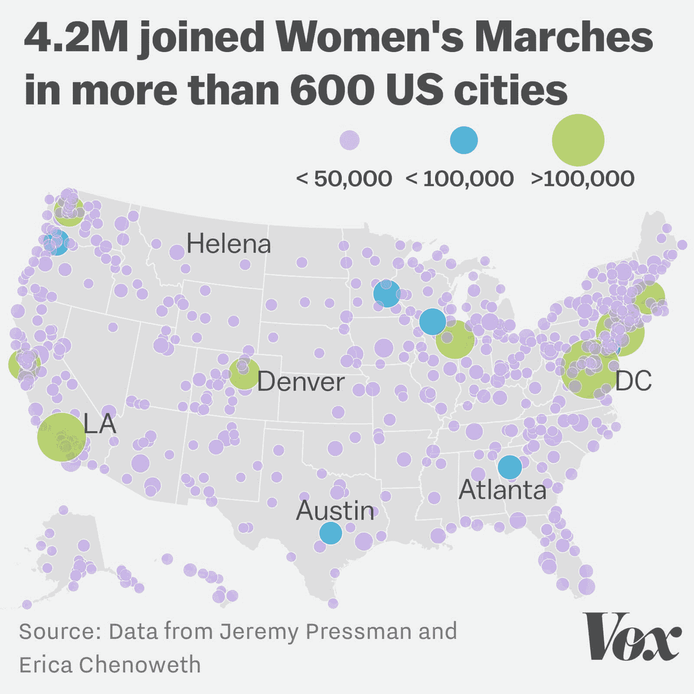
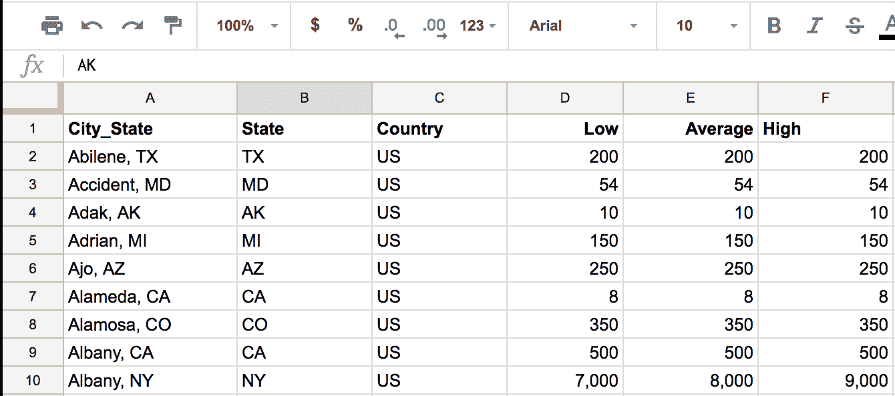
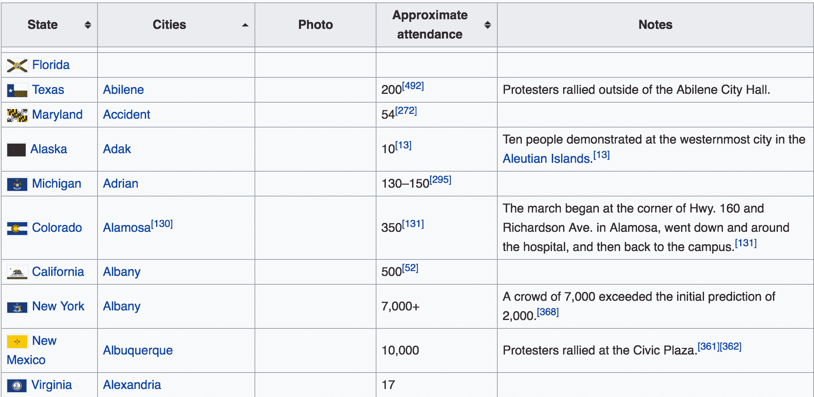
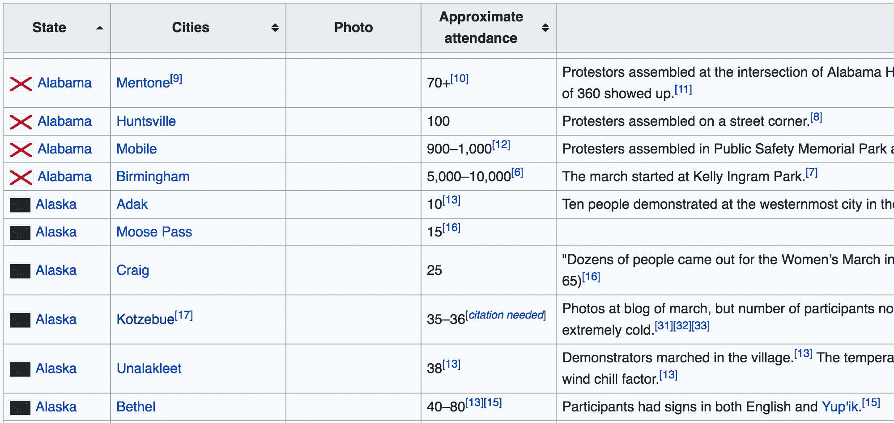
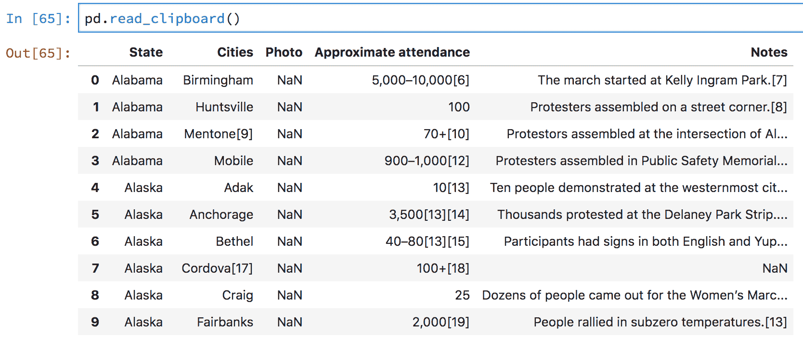
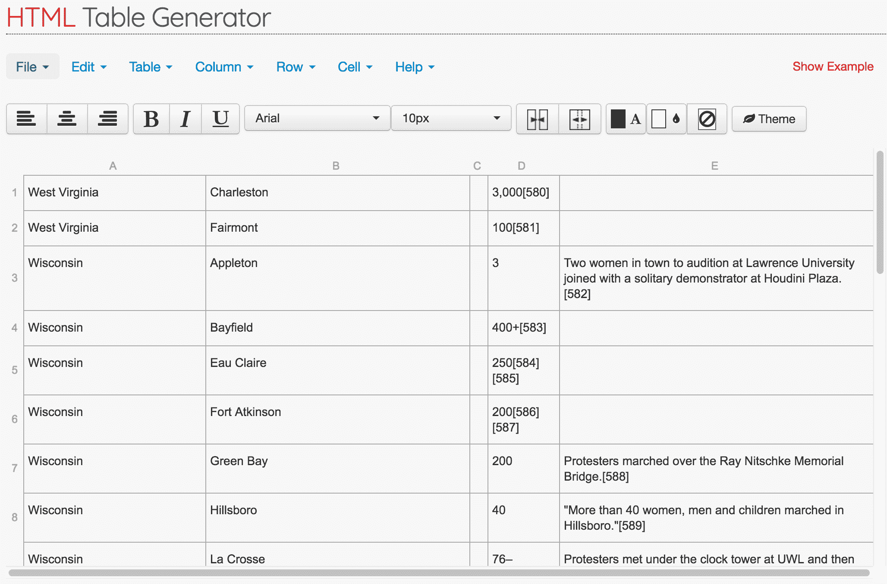
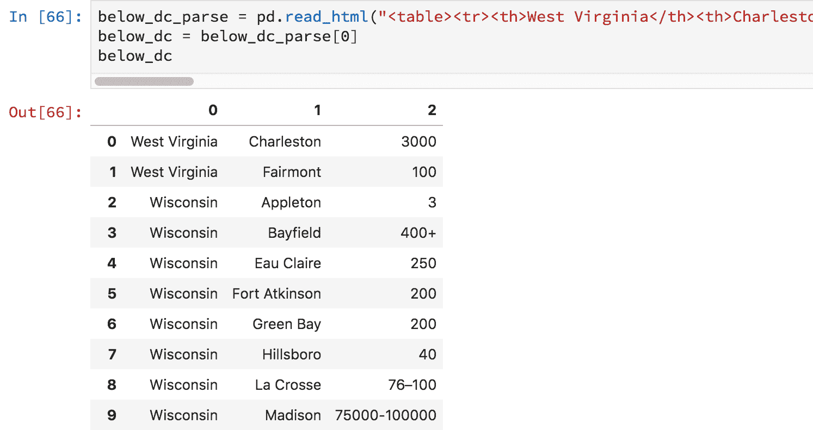
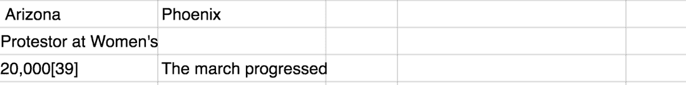
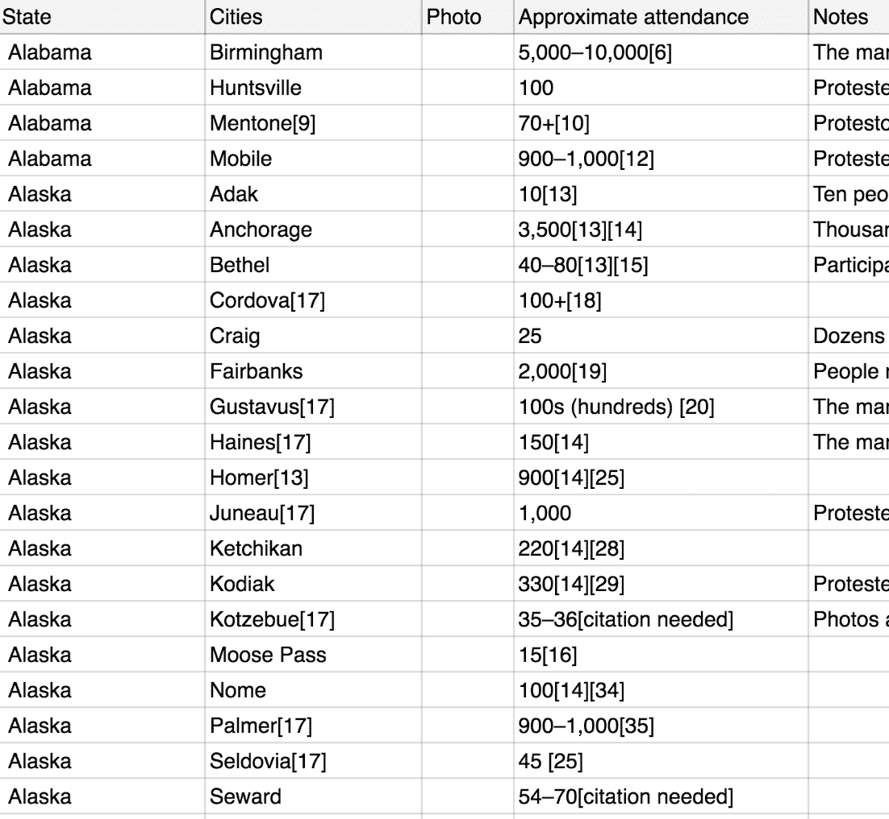

# 可视化女性游行:第一部分

> 原文：<https://www.dataquest.io/blog/visualizing-womens-marches-part-1/>

March 26, 2018

为了庆祝妇女历史月，我想更好地了解 2017 年 1 月发生的妇女游行的规模。游行结束后不久，Vox [发布了一张地图，直观显示了全国的预计投票人数。](https://www.vox.com/2017/1/22/14350808/womens-marches-largest-demonstration-us-history-map)



这张地图很好地展示了:

*   相对道岔最高的位置
*   游行发生的中心和聚集地

我立即有了许多后续问题，所以我进一步深入数据集，寻找其他潜在的数据源并创建自己的可视化。在这一系列的文章中，我将回顾我的探索，只关注发生在美国的游行。

在这篇文章中，我将回顾数据收集和清理。在第 2 部分中，我们将研究数据丰富和可视化。

我在这个系列中的主要目标是:

*   强调大多数数据科学实际上是数据收集和数据清理
*   使用数字和可视化来欣赏这些游行的规模
*   能够问更多的问题并给出近似的答案

如果您想继续并重新创建这个过程，您需要熟悉 Python(特别是 pandas 和 matplotlib 库)和电子表格工具(Microsoft Excel 或 Google Sheets)。我还建议在你跟随的时候，打开我们的[熊猫备忘单](https://www.dataquest.io/blog/pandas-cheat-sheet/)。

## 数据收集

我在这篇博文中使用的两个数据集都是由志愿者众包的。幸运的是，大部分的数据都有链接。不幸的是，这些源链接中的一些不再存在或可能不可靠(自我报告的计数)。这意味着我们应该避免得出实质性的结论，而是利用这些结论来提供一些总体趋势和见解。

### 社交媒体众包数据集

上面的地图是由教授[艾丽卡·切诺维特](https://www.ericachenoweth.com/)和[杰瑞米·普雷斯曼](https://polisci.uconn.edu/person/jeremy-pressman/)领导的[众包数据工作](https://docs.google.com/spreadsheets/d/1xa0iLqYKz8x9Yc_rfhtmSOJQ2EGgeUVjvV4A8LsIaxY/edit?usp=sharing)生成的。

电子表格包含一些工作表，这些工作表大多是同一数据的不同视图。似乎第一个工作表( **By Town/City** )中关于美国游行的行数最多，所以我们将使用那个。

因为电子表格是公共文件，所以它被锁定以供编辑。让我们将感兴趣的行和列复制并粘贴到一个新的电子表格中，并下载为 CSV 文件。对于包含公式的列，在复制后重写公式很重要。

仅保留以下各列:



我们将在后面的数据清理小节中再次讨论这个数据集。

### 维基百科众包数据集

我发现的另一个很好的资源是一个维基百科页面，列出了所有的游行，由维基志愿者社区众包。



下载这个数据集要痛苦得多，需要更多的实验。以下是我尝试过的两种不同的技巧，中途我放弃了:

*   使用[请求](https://2.python-requests.org/en/latest/)和 [BeautifulSoup](https://www.crummy.com/software/BeautifulSoup/bs4/doc/) 获取并解析页面。
    *   *问题:*表格的 HTML 格式不一致，在提交大量 HTML 代码之前，我想尝试一些其他方法。
*   使用 [`pandas.read_html()`](https://pandas.pydata.org/pandas-docs/version/0.23/generated/pandas.read_html.html) 函数读取整个网页，并尝试将相关表格解析为 DataFrame 对象。
    *   *问题:*同样的 HTML 格式不一致的问题，特别是关于每行的列数。产生的数据帧将需要大量的手工清理(几乎达到逐行转录的水平)。

试图从 HTML 代码生成数据帧的挑战在于格式必须*完美*。每一行都需要有相同的列数，否则产生的数据帧可能会出错。

另一方面，Wikipedia 将底层 HTML 代码呈现在一个很好的表格中，便于我们进行交互。我们可以执行手动文本选择来选择格式良好的行，并将其复制粘贴到其他地方。

这是我最终使用的工作流程:

*   按照**状态**列对表格进行排序，以强制每一行包含相同数量的列(熊猫的要求)，除了**华盛顿州 DC** 的行。
*   用鼠标选择并复制上面的*行、**华盛顿 DC** 行，包括带有列名的标题行。然后，我使用 [`pandas.read_clipboard()`](https://pandas.pydata.org/pandas-docs/stable/generated/pandas.read_clipboard.html) 将我的选择读入数据帧。这个函数是由 pandas 开发人员专门为复制小表格而实现的:*
*   用鼠标选择并复制位于**华盛顿 DC** 行下面的*行。不幸的是，当我这次试图解析我的剪贴板时，Pandas 返回了一个错误，因为列数不一致。而是用免费工具 [HTML 表格生成器](https://www.tablesgenerator.com/html_tables#)生成一个 HTML 表格(**文件>粘贴表格数据**)，用编辑器快速清理数据，导出 HTML。*
*   然后，我从这个清理后的表中生成新的 HTML 代码，将其复制到 Python string 对象中，然后使用`pandas.read_html()`将字符串读入 DataFrame。
*   最后，我在第一个数据帧中手动添加了一行，包含华盛顿 DC 的数据。

虽然这个工作流肯定是拼凑起来的，并不是真正可扩展的，但它让我很快获得了我需要的数据，而不必做任何不成熟的优化。此外，这更像是一个随意的项目，所以一个简单的方法就可以了！最终，更严格的分析需要建立强大的数据管道、维护数据质量的严格程序以及更可靠的数据集。

## 数据清理

现在是有趣的部分，清理数据集！

### 社交媒体众包数据集

因为这个数据集很小(只包含几百行和六列)，所以使用像 Microsoft Excel 或 Google Sheets 这样的直接操作电子表格工具来执行一些数据清理真的很方便。当您滚动电子表格时，您会注意到数据中的一些问题:

*   一些行缺少道岔编号值。
*   `State`栏的几个问题:
    *   两行的`State`列有`--`。
    *   一行的 state 列有`CA/NV`。
*   一些行缺少州和国家的信息。
*   `City_state`列中的某些值的格式不符合样式:`<city>, <state>`。
*   一些行同时缺少`State`和`Country`列的值。
*   两行描述了不同日期发生在同一城市的游行(`Salt Lake City, UT (1/20)`和`Salt Lake City, UT (1/23)`)。

我们可以先用电子表格工具处理最后五个问题。

*   删除`State/Country`列中带有`--`的行，因为它们似乎没有发生在美国的州或地区。
*   对于`State/Country`列带有`South Lake Tahoe, NV`的行，将其编辑为`South Lake Tahoe, NV`，编辑为`State`列的`NV`。
*   对于`City_state`列中缺少城市的值(例如`Cambridge`，使用`State`值将其添加回来。
*   对于逗号后没有州值的`City_state`列中的值，手动查找并修复(例如`Christiansted, St. Croix`应为维尔京群岛的`Christiansted, VI`)。
*   对于包含额外信息的`City_state`列中的值，缩短(如`Encinitas, CA (Seacrest)`到`Encinitas, CA`)。
*   对于在`State`和`Country`列中缺少值的行，手动将其添加回去。
*   将两行合并为`Salt Lake City, UT (1/20)`和`Salt Lake City, UT (1/23)`。

这里有一个链接指向最终的电子表格。将其下载为 CSV 文件并加载到 pandas 数据帧中，以处理包含道岔编号缺失值的行的第一个问题。

```py
import pandas as pd
all_marches = pd.read_csv("FinalSocialMedia.csv")
all_marches
```

|  | 城市州 | 状态 | 国家 | 低的 | 平均的 | 高的 |
| Zero | 德克萨斯州阿比林 | 谢谢 | 美国 | Two hundred | Two hundred | Two hundred |
| one | 事故，医学博士 | 医学博士 | 美国 | Fifty-four | Fifty-four | Fifty-four |
| Two | Adak, AK | 阿拉斯加 | 美国 | Ten | Ten | Ten |
| three | 密歇根州阿德里安 | 大调音阶的第三音 | 美国 | One hundred and fifty | One hundred and fifty | One hundred and fifty |
| four | 亚利桑那州阿霍 | 阿塞拜疆（Azerbaijan 的缩写） | 美国 | Two hundred and fifty | Two hundred and fifty | Two hundred and fifty |
| … | … | … | … | … | … | … |
| Six hundred and sixty-seven | 俄亥俄州黄泉市 | 俄亥俄州 | 美国 | Two hundred and fifty | Two hundred and fifty | Two hundred and fifty |
| Six hundred and sixty-eight | ypsilanti，我 | 大调音阶的第三音 | 美国 | One thousand two hundred | One thousand two hundred | One thousand two hundred |
| Six hundred and sixty-nine | 加利福尼亚州尤卡谷 | 加拿大 | 美国 | Seventy-six | One hundred and thirty-eight | Two hundred |
| Six hundred and seventy | 亚利桑那州尤马 | 阿塞拜疆（Azerbaijan 的缩写） | 美国 | Ten | Ten | Ten |
| Six hundred and seventy-one | 西布伦，走 | 通用航空 | 美国 | Thirty-five | Thirty-five | Thirty-five |

让我们计算每列缺少值的行数:

```py
all_marches.isnull().sum()
```

```py
 City_State     0
State          2
Country        1
Low           44
Average        0
High          44
dtype: int64
```

然后，调查`State`列的两行缺失值:

```py
 all_marches[all_marches['State'].isnull()] 
```

|  | 城市州 | 状态 | 国家 | 低的 | 平均的 | 高的 |
| One hundred and forty-nine | 残疾(在线) | 圆盘烤饼 | 美国 | 圆盘烤饼 | Zero | 圆盘烤饼 |
| Six hundred and sixty-five | 马萨诸塞州伍斯特 | 圆盘烤饼 | 圆盘烤饼 | 圆盘烤饼 | Zero | 圆盘烤饼 |

看起来我们还发现了`Country`列缺少值的行。让我们删除这两行，因为一行是遗漏的投票数，另一行是在线发生的(这限制了我们在地图上可视化)。

```py
 all_marches = all_marches.drop([149, 665], axis=0)
all_marches.isnull().sum()
```

```py
 City_State     0
State          0
Country        0
Low           42
Average        0
High          42
dtype: int64
```

现在我们只需要处理包含`Low`和`High`列缺失值的行。包含一列缺失值的行很可能也包含另一列的缺失值。尝试删除`Low`列中所有缺少值的行，看看是否能处理那些缺少`High`值的行:

```py
 low_null = all_marches[~all_marches['Low'].isnull()]
low_null.isnull().sum()
```

```py
 City_State    0
State         0
Country       0
Low           0
Average       0
High          0
dtype: int64
```

看来我们的假设是正确的！我们可以删除主数据帧的那些行，并将结果分配给新的数据帧。

```py
sm_marches = all_marches[~all_marches['Low'].isnull()]
```

### 维基百科众包数据集

让我们从将两个数据帧导出到单独的 CSV 文件`above_dc.csv`和`below_dc.csv`开始。然后，将它们导入电子表格工具。浏览两个电子表格，开始寻找数据质量问题。以下是我们需要解决的一些问题:

*   包含照片的行溢出到两三行。
*   在`Cities`和`Approximate Attendance`列中为许多值(`[6]`)添加了引用链接的额外文本。
*   在 pandas 中，许多无法解析为数字的范围实例。
    *   `5,000 - 10,000`
    *   `70+`
    *   `100s (hundreds)`
*   某些`State`值中的重复或额外信息(如`Georgia (U.S State) Georgia`)。

让我们使用电子表格工具来解决所有这些问题(大约需要 30 分钟):

*   找到所有分成两到三行的进行曲，手动设置它们的格式。
*   使用以下规则替换所有格式错误的数值:
    *   用平均值替换像`5,000 - 10,0000`这样的范围。通过创建 2 列(一列为低，一列为高)来保留 rangaes 是很好的，但是这增加了我们手动清理的时间。
    *   仅用`70`替换像`70+`这样的值。
    *   仅用`100`替换像`100s (hundreds)`这样的值。
    *   对于任何无关紧要的小问题，使用你最好的判断。

最后，将两个电子表格合并成一个电子表格，并导出为 CSV 文件。这里有一个最终版本的链接: [Google Sheets 链接](https://docs.google.com/spreadsheets/d/1wln0EnRqSP5vMl6hmDaLDMrMerEOuUJp3odh0HtX_UU/edit#gid=0)

## 后续步骤

经过几个小时的数据收集和清理，我们有两个干净的数据集可以使用。在下一篇博文中，我们将重点关注用更多信息(例如地理数据)丰富数据集，计算一些汇总统计数据，并创建一些简单的可视化。