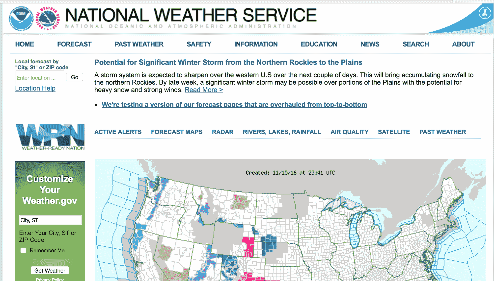
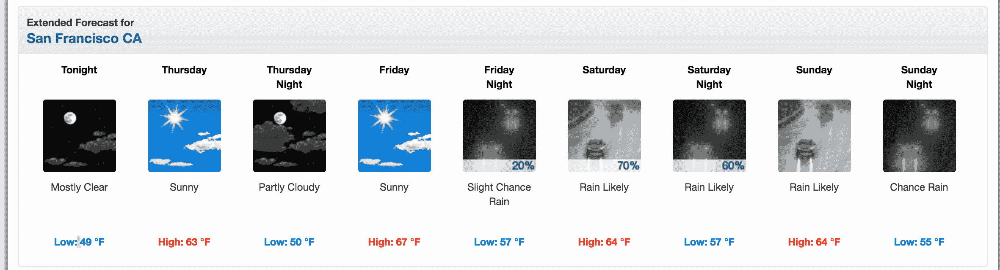
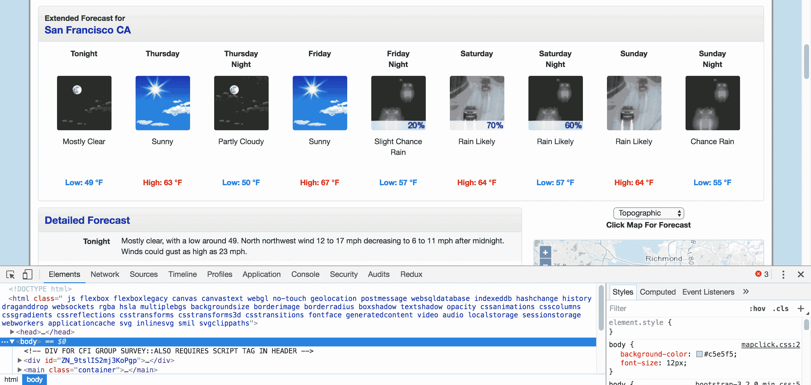
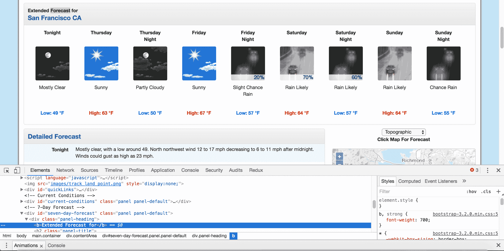
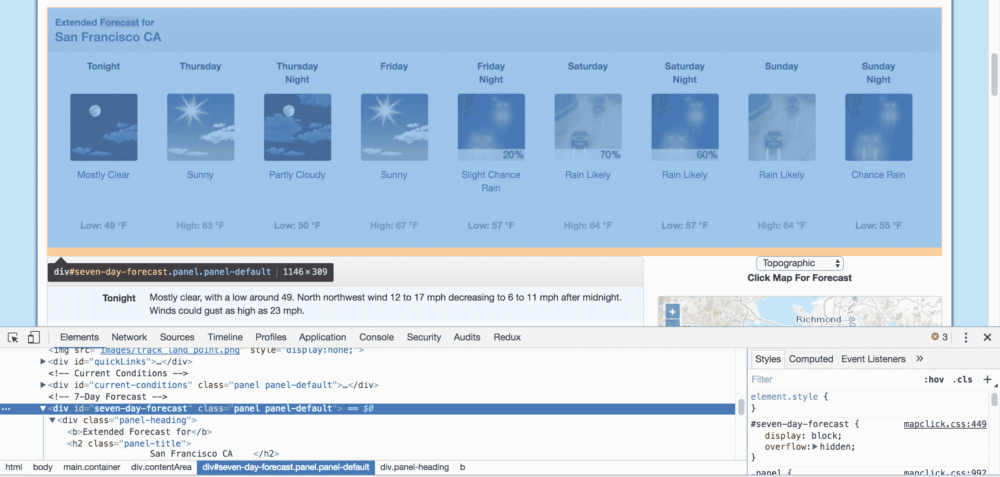

# 教程:使用漂亮的汤用 Python 进行网页抓取

> 原文：<https://www.dataquest.io/blog/web-scraping-python-using-beautiful-soup/>

March 30, 2021

*学习如何用 Python 刮网页！*

互联网绝对是一个巨大的数据来源——我们可以使用网络抓取和 Python 来访问这些数据！

事实上，网络抓取通常是我们获取数据的唯一方式。有很多信息是方便的 CSV 导出或易于连接的 API 所没有的。网站本身通常是有价值的数据来源——例如，考虑一下，如果你可以下载网络论坛上的每一篇帖子，你可以做什么样的分析。

要访问这些页面上的数据集，我们必须使用网络抓取。

如果你还是一个完全的初学者，不要担心！

在本教程中，我们将从头开始讲述如何使用 Python 进行 web 抓取，从一些常见问题的答案开始。

然后，**我们将通过一个实际的网络抓取项目**来工作，重点是天气数据。


我们将合作从网上搜集天气数据来支持天气应用程序。

但是在我们开始编写任何 Python 之前，我们必须先了解基础知识！如果你已经熟悉了网络抓取的概念，请随意浏览这些问题，直接进入教程！

## 网络抓取的基础:

### Python 中的 Web 抓取是什么？

一些网站提供 CSV 格式的可下载数据集，或者通过[应用编程接口](https://en.wikipedia.org/wiki/Application_programming_interface) (API)访问。但是很多有有用数据的网站并没有提供这些便捷的选项。

例如，考虑一下国家气象局的网站。它包含美国每个地方的最新天气预报，但这些天气数据不能以 CSV 格式或通过 API 访问。必须在 NWS 网站上查看:



如果我们想分析这些数据，或者下载到其他应用程序中使用，我们不会刻意复制粘贴所有数据。Web 抓取是一种让我们使用编程来完成繁重工作的技术。我们将编写一些代码来查看 NWS 站点，获取我们想要处理的数据，并以我们需要的格式输出。

在本教程中，我们将向您展示如何使用 [Python 3](https://www.python.org/downloads/release/python-350/) 和[美汤](https://www.crummy.com/software/BeautifulSoup/)库来执行网页抓取。我们将从[国家气象局](https://www.weather.gov/)抓取天气预报，然后使用[熊猫](https://pandas.pydata.org/)库分析它们。

但是要明确的是，很多编程语言都可以用来抓取网页！例如，我们也在 R 中教授[网页抓取。但是，对于本教程，我们将坚持使用 Python。](https://www.dataquest.io/blog/web-scraping-in-r-rvest/)

### 网页抓取是如何工作的？

当我们抓取网页时，我们编写代码向托管我们指定的页面的服务器发送请求。服务器将返回我们请求的页面的源代码——主要是 HTML。

到目前为止，我们基本上是在做与 web 浏览器相同的事情——发送带有特定 URL 的服务器请求，并请求服务器返回该页面的代码。

但是*与*网络浏览器不同，我们的网络抓取代码不会解释页面的源代码，也不会直观地显示页面。相反，我们将编写一些自定义代码，过滤页面的源代码，寻找我们指定的特定元素，并提取我们指示它提取的任何内容。

例如，如果我们想从网页上显示的表中获取所有数据，我们的代码将按顺序执行以下步骤:

1.  向服务器请求特定 URL 的内容(源代码)
2.  下载返回的内容
3.  识别我们想要的表格中的页面元素 
4.  提取这些元素并(如有必要)将其重新格式化成一个数据集，我们可以根据需要以任何方式进行分析或使用。

如果这一切听起来很复杂，不要担心！ Python 和 Beautiful Soup 具有内置特性，旨在使这一点变得相对简单。

需要注意的一点是:从服务器的角度来看，通过 web 抓取请求页面与在 web 浏览器中加载页面是一样的。当我们使用代码提交这些请求时，我们可能会比普通用户更快地“加载”页面，从而很快耗尽网站所有者的服务器资源。

### 为什么要用 Python 做网页抓取？

如前所述，可以用许多编程语言进行网络抓取。

然而，最流行的方法之一是使用 Python 和漂亮的 Soup 库，正如我们将在本教程中所做的。

学会用 Python 做这件事意味着一旦你掌握了漂亮的汤的基础知识，就会有大量的教程、操作视频和一些示例代码来帮助你加深知识。

### 网络抓取合法吗？

不幸的是，这里没有现成的答案。一些网站明确允许网络抓取。还有的明确禁止。许多网站没有提供任何明确的指导。

在抓取任何网站之前，我们应该寻找一个条款和条件页面，看看是否有明确的规则。如果有，我们应该跟着他们。如果没有，那么这就变成了一个判断的问题。

请记住，虽然*网络抓取消耗主机网站的服务器资源。*如果我们只是一次抓取一页，这不会造成问题。但是如果我们的代码每 10 分钟抓取 1000 个页面，网站所有者很快就会为此付出昂贵的代价。

因此，除了遵循网站上发布的所有关于网络抓取的明确规则之外，遵循以下最佳实践也是一个好主意:

#### 网页抓取最佳实践:

*   不要刮得太频繁。
*   考虑[缓存](https://pypi.org/project/requests-cache/)你抓取的内容，这样它只被下载一次。
*   使用像 [`time.sleep()`](https://docs.python.org/3/library/time.html) 这样的函数在你的代码中构建暂停，以避免服务器因为太多太快的请求而不堪重负。

在本教程中，NWS 的数据是公开的，其条款没有禁止网络抓取，所以我们可以继续。

## 用正确的方法学习 Python。

从第一天开始，就在你的浏览器窗口中通过编写 Python 代码来学习 Python。这是学习 Python 的最佳方式——亲自看看我们 60 多门免费课程中的一门。


[尝试 Dataquest](https://app.dataquest.io/signup)

## 网页的组成部分

在我们开始写代码之前，我们需要了解一点关于网页的结构。我们将使用网站的结构来编写代码，以获取我们想要抓取的数据，因此理解该结构是任何 web 抓取项目的重要第一步。
当我们访问网页时，我们的网络浏览器向网络服务器发出请求。这个请求被称为`GET`请求，因为我们从服务器获取文件。然后，服务器发回文件，告诉我们的浏览器如何为我们呈现页面。这些文件通常包括:

*   [HTML](https://www.w3.org/TR/html/) —页面的主要内容。
*   CSS —用于添加样式，使页面看起来更好。
*   [JS](https://developer.mozilla.org/en-US/docs/Web/JavaScript) — Javascript 文件为网页增加了交互性。
*   图像——图像格式，如 [JPG](https://en.wikipedia.org/wiki/JPEG) 和 [PNG](https://en.wikipedia.org/wiki/Portable_Network_Graphics) ，允许网页显示图片。

在我们的浏览器接收到所有文件后，它会呈现页面并显示给我们。

为了很好地呈现页面，在幕后发生了很多事情，但是当我们抓取网页时，我们不需要担心其中的大部分。当我们执行网络抓取时，我们对网页的主要内容感兴趣，所以我们主要看 HTML。

## 超文本标记语言

超文本标记语言(HTML)是创建网页的语言。然而，HTML 不像 Python 那样是一种编程语言。它是一种**标记语言**，告诉浏览器如何显示内容。

HTML 有许多功能类似于你可能在像 Microsoft Word 这样的文字处理器中找到的功能——它可以使文本加粗，创建段落，等等。

如果你已经熟悉 HTML，请随意[跳到本教程的下一部分](#tve-jump-178843cde0c)。否则，让我们快速浏览一下 HTML，这样我们就能知道足够多的信息来有效地抓取。

HTML 由称为**标签**的元素组成。最基本的标签是`<html>`标签。这个标签告诉 web 浏览器里面的所有东西都是 HTML。我们可以用这个标签制作一个简单的 HTML 文档:

```py
<html>
</html>
```

我们还没有向页面添加任何内容，所以如果我们在 web 浏览器中查看 HTML 文档，我们将看不到任何内容:

在一个`html`标签的内部，我们可以放置另外两个标签:`head`标签和`body`标签。

网页的主要内容放在`body`标签中。`head`标签包含关于页面标题的数据，以及其他在 web 抓取中通常没有用的信息:

```py
<html>
<head>
</head>
<body>
</body>
</html>
```

我们还没有向页面添加任何内容(在`body`标签中)，所以如果我们在浏览器中打开这个 HTML 文件，我们仍然看不到任何内容:

你可能已经注意到，我们把`head`和`body`标签放在了`html`标签里面。在 HTML 中，标签是嵌套的，可以放在其他标签中。

我们现在将第一个内容添加到页面中的一个`p`标签中。`p`标签定义了一个段落，标签内的任何文本都显示为一个单独的段落:

```py
<html>
<head>
</head>
<body>
<p>
Here's a paragraph of text!
</p>
<p>
Here's a second paragraph of text!
</p>
</body>
</html>
```

在浏览器中呈现时，该 HTML 文件将如下所示:

下面是一段文字！

下面是第二段文字！

标签的常用名称取决于它们相对于其他标签的位置:

*   `child` —子标签是另一个标签中的标签。所以上面的两个`p`标签都是`body`标签的子标签。
*   `parent` —父标签是另一个标签所在的标签。上图中，`html`标签是`body`标签的父标签。
*   `sibiling`-咝咝声是嵌套在与另一个标签相同的父标签中的标签。例如，`head`和`body`是兄弟姐妹，因为他们都在`html`里面。两个`p`标签都是兄弟姐妹，因为它们都在`body`里面。

我们也可以给 HTML 标签添加属性来改变它们的行为。下面，我们将使用`a`标签添加一些额外的文本和超链接。

```py
<html>
<head>
</head>
<body>
<p>
Here's a paragraph of text!
<a href="https://www.dataquest.io">Learn Data Science Online</a>
</p>
<p>
Here's a second paragraph of text!
<a href="https://www.python.org">Python</a> </p>
</body></html>
```

这将是这样的:

下面是一段文字！[在线学习数据科学](https://www.dataquest.io)

下面是第二段文字！ [Python](https://www.python.org)

在上面的例子中，我们添加了两个`a`标签。`a`标签是链接，告诉浏览器呈现另一个网页的链接。标签的`href`属性决定了链接的位置。

`a`和`p`是极其常见的 html 标签。以下是其他一些例子:

*   `div` —表示页面的分区或区域。
*   `b` —加粗内部的任何文本。
*   `i` —斜体显示内部的任何文本。
*   `table` —创建一个表格。
*   `form` —创建一个输入表单。

如需标签的完整列表，请查看[此处](https://developer.mozilla.org/en-US/docs/Web/HTML/Element)。

在我们进入实际的 web 抓取之前，让我们了解一下`class`和`id`属性。这些特殊的属性赋予 HTML 元素名称，使它们在我们抓取时更容易交互。

一个元素可以有多个类，一个类可以在元素之间共享。每个元素只能有一个 id，一个 id 在一个页面上只能使用一次。类和 id 是可选的，并不是所有的元素都有。

我们可以在示例中添加类和 id:

```py
<html>
<head>
</head>
<body>
<p class="bold-paragraph">
Here's a paragraph of text!
<a href="https://www.dataquest.io" id="learn-link">Learn Data Science Online</a>
</p>
<p class="bold-paragraph extra-large">
Here's a second paragraph of text!
<a href="https://www.python.org" class="extra-large">Python</a>
</p>
</body>
</html>
```

这将是这样的:

下面是一段文字！[在线学习数据科学](https://www.dataquest.io)

下面是第二段文字！ [Python](https://www.python.org)

如您所见，添加类和 id 根本不会改变标签的呈现方式。

## 请求库

现在我们已经了解了网页的结构，是时候进入有趣的部分了:抓取我们想要的内容！要抓取一个网页，我们需要做的第一件事就是下载该网页。我们可以使用 Python [请求](https://2.python-requests.org/en/latest/)库下载页面。

请求库将向 web 服务器发出一个`GET`请求，它将为我们下载给定网页的 HTML 内容。我们可以使用`requests`发出几种不同类型的请求，`GET`只是其中之一。如果你想了解更多，查看我们的 [API 教程](https://www.dataquest.io/blog/python-api-tutorial/)。

让我们试着下载一个简单的示例网站，`https://dataquestio.github.io/web-scraping-pages/simple.html`。

我们需要首先导入`requests`库，然后使用 [requests.get](https://2.python-requests.org/en/master/user/quickstart/#make-a-request) 方法下载页面:

```py
import requests
page = requests.get("https://dataquestio.github.io/web-scraping-pages/simple.html")
page
```

```py
<Response [200]>
```

运行我们的请求后，我们得到一个[响应](https://2.python-requests.org/en/master/user/quickstart/#response-content)对象。这个对象有一个`status_code`属性，指示页面是否下载成功:

```py
page.status_code
```

```py
200
```

`200`的一个`status_code`表示页面下载成功。我们不会在这里详细讨论状态代码，但是以`2`开头的状态代码通常表示成功，以`4`或`5`开头的代码表示错误。

我们可以使用`content`属性打印出页面的 HTML 内容:

```py
page.content
```

```py
<!DOCTYPE html>
<html>
<head>
<title>A simple example page</title>
</head>
<body>
<p>Here is some simple content for this page.</p>
</body>
</html>
```

## 用 BeautifulSoup 解析页面

正如你在上面看到的，我们现在已经下载了一个 HTML 文档。

我们可以使用 [BeautifulSoup](https://www.crummy.com/software/BeautifulSoup/) 库来解析这个文档，并从`p`标签中提取文本。

我们首先必须导入这个库，并创建一个`BeautifulSoup`类的实例来解析我们的文档:

```py
from bs4 import BeautifulSoup
soup = BeautifulSoup(page.content, 'html.parser')
```

我们现在可以打印出页面的 HTML 内容，格式很好，在`BeautifulSoup`对象上使用`prettify`方法。

```py
print(soup.prettify())
```

```py
<!DOCTYPE html>
<html>
    <head>
        <title>A simple example page</title>
    </head>
    <body>
        <p>Here is some simple content for this page.</p>
    </body>
</html>
```

严格来说，这一步不是必需的，我们也不会总是为此费心，但是查看美化过的 HTML 会有所帮助，这样可以更容易地看到嵌套标签的和的结构。
由于所有的标签都是嵌套的，我们可以一次移动一层。我们可以首先使用`soup`的`children`属性选择页面顶层的所有元素。

注意，`children`返回一个列表生成器，所以我们需要对它调用`list`函数:

```py
list(soup.children)
```

```py
['html', 'n', <html> <head> <title>A simple example page</title> </head> <body> <p>Here is some simple content for this page.</p> </body> </html>]
```

上面告诉我们在页面的顶层有两个标签——初始的`<!DOCTYPE html>`标签和`<html>`标签。列表中还有一个换行符(`n`)。让我们看看列表中每个元素的类型:

```py
[type(item) for item in list(soup.children)]
```

```py
[bs4.element.Doctype, bs4.element.NavigableString, bs4.element.Tag]
```

正如我们所见，所有的项目都是`BeautifulSoup`对象:

*   第一个是一个`Doctype`对象，它包含关于文档类型的信息。
*   第二个是一个`NavigableString`，它表示在 HTML 文档中找到的文本。
*   最后一项是一个`Tag`对象，它包含其他嵌套标签。

最重要的对象类型，也是我们最常处理的对象类型，是`Tag`对象。

对象允许我们浏览 HTML 文档，并提取其他标签和文本。你可以在这里了解更多关于各种`BeautifulSoup`物体[的信息。](https://www.crummy.com/software/BeautifulSoup/bs4/doc/#kinds-of-objects)

我们现在可以通过选择列表中的第三项来选择`html`标签及其子标签:

```py
html = list(soup.children)[2]
```

由`children`属性返回的列表中的每一项也是一个`BeautifulSoup`对象，所以我们也可以在`html`上调用`children`方法。

现在，我们可以在`html`标签中找到孩子:

```py
list(html.children)
```

```py
['n', <head> <title>A simple example page</title> </head>, 'n', <body> <p>Here is some simple content for this page.</p> </body>, 'n']
```

正如我们在上面看到的，这里有两个标签，`head`和`body`。我们想要提取`p`标签中的文本，所以我们将深入主体:

```py
body = list(html.children)[3]
```

现在，我们可以通过找到 body 标签的子标签来获得`p`标签:

```py
list(body.children)
```

```py
['n', <p>Here is some simple content for this page.</p>, 'n']
```

我们现在可以分离出 p 标签:

```py
p = list(body.children)[1]
```

一旦我们隔离了标签，我们可以使用`get_text`方法提取标签中的所有文本:

```py
p.get_text()
```

```py
'Here is some simple content for this page.'
```

## 一次查找一个标签的所有实例

我们上面所做的对于弄清楚如何导航一个页面是有用的，但是它需要很多命令来做一些相当简单的事情。

如果我们想提取一个标签，我们可以使用`find_all`方法，它会在页面上找到一个标签的所有实例。

```py
soup = BeautifulSoup(page.content, 'html.parser')
soup.find_all('p')
```

```py
[<p>Here is some simple content for this page.</p>]
```

注意，`find_all`返回一个列表，所以我们必须循环遍历，或者使用列表索引，来提取文本:

```py
soup.find_all('p')[0].get_text()
```

```py
'Here is some simple content for this page.'
```

如果您只想找到标签的第一个实例，您可以使用`find`方法，该方法将返回一个单独的`BeautifulSoup`对象:

```py
soup.find('p')
```

```py
<p>Here is some simple content for this page.</p>
```

## 按类别和 id 搜索标签

我们前面介绍了类和 id，但是可能不清楚它们为什么有用。

CSS 使用类和 id 来决定对哪些 HTML 元素应用特定的样式。但是当我们刮的时候，*我们*也可以用它们来指定我们想要刮的元素。

为了说明这一原则，我们将使用以下页面:

```py
<html>
    <head>
        <title>A simple example page</title>
    </head>
    <body>
        <div>
            <p class="inner-text first-item" id="first">
                First paragraph.
            </p>
            <p class="inner-text">
                Second paragraph.
            </p>
        </div>
            <p class="outer-text first-item" id="second">
                <b>
                First outer paragraph.
                </b>
            </p>
            <p class="outer-text">
                <b>
                Second outer paragraph.
                </b>
            </p>
    </body>
</html>
```

我们可以通过 URL `https://dataquestio.github.io/web-scraping-pages/ids_and_classes.html`访问上面的文档。

让我们首先下载页面并创建一个`BeautifulSoup`对象:

```py
page = requests.get("https://dataquestio.github.io/web-scraping-pages/ids_and_classes.html")
soup = BeautifulSoup(page.content, 'html.parser')
soup
```

```py
<html>
<head>
<title>A simple example page
</title>
</head>
<body>
<div>
<p class="inner-text first-item" id="first">
First paragraph.
</p><p class="inner-text">
Second paragraph.
</p></div>
<p class="outer-text first-item" id="second"><b>
First outer paragraph.
</b></p><p class="outer-text"><b>
Second outer paragraph.
</b>
</p>
</body>
</html>
```

现在，我们可以使用`find_all`方法按类或 id 搜索条目。在下面的例子中，我们将搜索任何具有类别`outer-text`的`p`标签:

```py
soup.find_all('p', class_='outer-text')
```

```py
[<p class="outer-text first-item" id="second"> <b> First outer paragraph. </b> </p>, <p class="outer-text"> <b> Second outer paragraph. </b> </p>]
```

在下面的例子中，我们将寻找任何具有类`outer-text`的标签:

```py
soup.find_all(class_="outer-text")
```

```py
<p class="outer-text first-item" id="second">
<b>
First outer paragraph.
</b>
</p>, <p class="outer-text">
<b>
Second outer paragraph.
</b>
</p>]
```

我们还可以通过 id 搜索元素:

```py
soup.find_all(id="first")
```

```py
[<p class="inner-text first-item" id="first">
First paragraph.
</p>]
```

## 使用 CSS 选择器

我们也可以使用 [CSS 选择器](https://developer.mozilla.org/en-US/docs/Web/Guide/CSS/Getting_started/Selectors)来搜索条目。这些选择器是 CSS 语言允许开发人员指定 HTML 标签样式的方式。以下是一些例子:

*   `p a` —查找一个`p`标签内的所有`a`标签。
*   `body p a` —查找`body`标签内`p`标签内的所有`a`标签。
*   `html body` —查找一个`html`标签内的所有`body`标签。
*   `p.outer-text` —查找类别为`outer-text`的所有`p`标签。
*   `p#first` —查找 id 为`first`的所有`p`标签。
*   `body p.outer-text` —查找任何在`body`标签内带有`outer-text`类别的`p`标签。

你可以在这里了解更多关于 CSS 选择器[的信息。](https://developer.mozilla.org/en-US/docs/Web/Guide/CSS/Getting_started/Selectors)

`BeautifulSoup`对象支持使用`select`方法通过 CSS 选择器搜索页面。我们可以使用 CSS 选择器来查找页面中位于像这样的`div`内的所有`p`标签:

```py
soup.select("div p")
```

```py
[<p class="inner-text first-item" id="first">
First paragraph.
</p>, <p class="inner-text">
Second paragraph.
</p>]
```

注意，上面的`select`方法返回了一个`BeautifulSoup`对象的列表，就像`find`和`find_all`一样。

## 下载天气数据

我们现在已经知道了足够多的信息，可以从国家气象局网站上提取当地天气信息了！

第一步，找到我们要刮的页面。我们将从本页中提取旧金山市中心的天气信息。



具体来说，让我们提取关于扩展预测的数据。

正如我们从图像中看到的，该页面包含了下周的详细天气预报信息，包括一天中的时间、温度以及天气状况的简要描述。

## 使用 Chrome DevTools 探索页面结构

我们需要做的第一件事是使用 [Chrome Devtools](https://developer.chrome.com/devtools) 检查页面。如果你使用的是另一款浏览器， [Firefox](https://developer.mozilla.org/en-US/docs/Tools/Web_Console/Opening_the_Web_Console) 和 [Safari](https://developer.apple.com/safari/tools/) 都有对应的浏览器。

你可以通过点击`View -> Developer -> Developer Tools`来启动 Chrome 中的开发者工具。你应该在浏览器的底部看到一个面板，如下图所示。确保`Elements`面板高亮显示:



*Chrome 开发者工具*

元素面板将显示页面上的所有 HTML 标签，并允许您浏览它们。这是一个非常方便的功能！

通过右键单击页面上靠近“扩展预测”的位置，然后单击“检查”，我们将在元素面板中打开包含文本“扩展预测”的标签:



*扩展预测文本*

然后，我们可以在“元素”面板中向上滚动，找到包含与扩展预测相对应的所有文本的“最外层”元素。在这种情况下，它是一个 id 为`seven-day-forecast`的`div`标签:



*包含扩展预测项目的 div。*

如果我们在控制台上单击并浏览 div，我们会发现每个预测项目(如“今晚”、“周四”和“周四晚上”)都包含在一个带有类`tombstone-container`的`div`中。

## 是时候开始刮了！

我们现在已经知道了足够多的信息，可以下载页面并开始解析它。在下面的代码中，我们将:

*   下载包含预测的网页。
*   创建一个`BeautifulSoup`类来解析页面。
*   找到 id 为`seven-day-forecast`的`div`，分配给`seven_day`
*   在`seven_day`中，找到每个单独的预测项目。
*   提取并打印第一个预测项目。

```py
page = requests.get("https://forecast.weather.gov/MapClick.php?lat=37.7772&lon=-122.4168")
soup = BeautifulSoup(page.content, 'html.parser')
seven_day = soup.find(id="seven-day-forecast")
forecast_items = seven_day.find_all(class_="tombstone-container")
tonight = forecast_items[0]
print(tonight.prettify())
```

```py
<div class="tombstone-container">
	<p class="period-name">
		Tonight
		<br>
		<br/>
		</br>
	</p>
	<p>
		
	</p>
	<p class="short-desc">
		Mostly Clear
	</p>
	<p class="temp temp-low">
		Low: 49 °F
	</p>
</div>
```

## 从页面中提取信息

正如我们所看到的，预测项目`tonight`中包含了我们想要的所有信息。我们可以提取四条信息:

*   预测项目的名称—在本例中为`Tonight`。
*   条件的描述—存储在`img`的`title`属性中。
*   条件的简短描述—在本例中为`Mostly Clear`。
*   温度低——在这种情况下，`49`度。

我们将首先提取预测项目的名称、简短描述和温度，因为它们都是相似的:

```py
period = tonight.find(class_="period-name").get_text()
short_desc = tonight.find(class_="short-desc").get_text()
temp = tonight.find(class_="temp").get_text()
print(period)
print(short_desc)
print(temp)
```

```py
Tonight
Mostly Clear
Low: 49 °F
```

现在，我们可以从`img`标签中提取出`title`属性。为此，我们只需将`BeautifulSoup`对象视为一个字典，并将我们想要的属性作为一个键传入:

```py
img = tonight.find("img")
desc = img['title']
print(desc)
```

```py
Tonight: Mostly clear, with a low around 49\. West northwest wind 12 to 17 mph decreasing to 6 to 11 mph after midnight. Winds could gust as high as 23 mph.
```

## 从页面中提取所有信息

现在我们知道了如何提取每一条信息，我们可以将我们的知识与 CSS 选择器和列表理解结合起来**一次提取所有内容**。

在下面的代码中，我们将:

*   在`seven_day`中选择类别为`tombstone-container`的项目内类别为`period-name`的所有项目。
*   使用 list comprehension 在每个`BeautifulSoup`对象上调用`get_text`方法。

```py
period_tags = seven_day.select(".tombstone-container .period-name")
periods = [pt.get_text() for pt in period_tags]
periods
```

```py
['Tonight',
'Thursday',
'ThursdayNight',
'Friday',
'FridayNight',
'Saturday',
'SaturdayNight',
'Sunday',
'SundayNight']
```

正如我们在上面看到的，我们的技术按顺序得到了每个周期的名称。

我们可以应用相同的技术来获得其他三个字段:

```py
short_descs = [sd.get_text() for sd in seven_day.select(".tombstone-container .short-desc")]
temps = [t.get_text() for t in seven_day.select(".tombstone-container .temp")]
descs = [d["title"] for d in seven_day.select(".tombstone-container img")]print(short_descs)print(temps)print(descs)
```

```py
['Mostly Clear', 'Sunny', 'Mostly Clear', 'Sunny', 'Slight ChanceRain', 'Rain Likely', 'Rain Likely', 'Rain Likely', 'Chance Rain']
['Low: 49 °F', 'High: 63 °F', 'Low: 50 °F', 'High: 67 °F', 'Low: 57 °F', 'High: 64 °F', 'Low: 57 °F', 'High: 64 °F', 'Low: 55 °F']
['Tonight: Mostly clear, with a low around 49\. West northwest wind 12 to 17 mph decreasing to 6 to 11 mph after midnight. Winds could gust as high as 23 mph. ', 'Thursday: Sunny, with a high near 63\. North wind 3 to 5 mph. ', 'Thursday Night: Mostly clear, with a low around 50\. Light and variable wind becoming east southeast 5 to 8 mph after midnight. ', 'Friday: Sunny, with a high near 67\. Southeast wind around 9 mph. ', 'Friday Night: A 20 percent chance of rain after 11pm. Partly cloudy, with a low around 57\. South southeast wind 13 to 15 mph, with gusts as high as 20 mph. New precipitation amounts of less than a tenth of an inch possible. ', 'Saturday: Rain likely. Cloudy, with a high near 64\. Chance of precipitation is 70%. New precipitation amounts between a quarter and half of an inch possible. ', 'Saturday Night: Rain likely. Cloudy, with a low around 57\. Chance of precipitation is 60%.', 'Sunday: Rain likely. Cloudy, with a high near 64.', 'Sunday Night: A chance of rain. Mostly cloudy, with a low around 55.']
```

## 将我们的数据整合成熊猫的数据框架

我们现在可以将这些数据组合成一个数据框架并进行分析。DataFrame 是可以存储表格数据的对象，使数据分析变得容易。如果你想了解更多关于熊猫的知识，请点击这里查看我们的免费课程。

为了做到这一点，我们将调用 [DataFrame](https://pandas.pydata.org/pandas-docs/stable/generated/pandas.DataFrame.html) 类，并传入我们拥有的每个项目列表。我们将它们作为字典的一部分传入。

每个字典键将成为数据帧中的一列，每个列表将成为该列中的值:

```py
import pandas as pd
weather = pd.DataFrame({
    "period": periods,
    "short_desc": short_descs,
    "temp": temps,
    "desc":descs
})
weather
```

|  | desc | 时期 | 肖特 _desc | 临时雇员 |
| --- | --- | --- | --- | --- |
| Zero | 今晚:基本晴朗，最低气温 49 度左右。W… | 今晚 | 基本清楚 | 低:49 华氏度 |
| one | 星期四:晴，最高气温接近 63 度。北 wi… | 星期四 | 快活的 | 高:63 华氏度 |
| Two | 周四晚上:大部分时间是晴朗的，周围有低气温… | 周四晚上 | 基本清楚 | 低:50 华氏度 |
| three | 星期五:晴，最高气温接近 67 度。东南… | 星期五 | 快活的 | 高:67 华氏度 |
| four | 周五晚上:20%的可能性下雨后… | 星期五晚上 | 轻微偶然事件 | 低:57 华氏度 |
| five | 周六:可能会下雨。多云，东北风高… | 星期六 | 可能会下雨 | 高:64 华氏度 |
| six | 周六晚上:可能会下雨。多云，有一个 l… | 周六晚上 | 可能会下雨 | 低:57 华氏度 |
| seven | 周日:可能会下雨。多云，附近有高… | 星期日 | 可能会下雨 | 高:64 华氏度 |
| eight | 周日晚上:可能会下雨。大部分时间多云… | 周日晚上 | 偶然下雨 | 低:55 华氏度 |

我们现在可以对数据进行一些分析。例如，我们可以使用一个[正则表达式](https://app.dataquest.io/m/354/)和 [Series.str.extract](https://pandas.pydata.org/pandas-docs/stable/generated/pandas.Series.str.extract.html) 方法来提取数字温度值:

```py
temp_nums = weather["temp"].str.extract("(?Pd+)", expand=False)
weather["temp_num"] = temp_nums.astype('int')
temp_nums
```

```py
0 49
1 63
2 50
3 67
4 57
5 64
6 57
7 64
8 55
Name: temp_num, dtype: object
```

然后我们可以找到所有高温和低温的平均值:

```py
weather["temp_num"].mean()
```

```py
58.444444444444443
```

我们也可以只选择夜间发生的行:

```py
is_night = weather["temp"].str.contains("Low")
weather["is_night"] = is_night
is_night
```

```py
0 True
1 False
2 True
3 False
4 True
5 False
6 True
7 False
8 True
Name: temp, dtype: bool
```

```py
weather[is_night]
```

```py
0 True
1 False
2 True
3 False
4 True
5 False
6 True
7 False
8 True
Name: temp, dtype: bool
```

|  | desc | 时期 | 肖特 _desc | 临时雇员 | 临时 _num | 见识 |
| --- | --- | --- | --- | --- | --- | --- |
| Zero | 今晚:基本晴朗，最低气温 49 度左右。W… | 今晚 | 基本清楚 | 低:49 华氏度 | forty-nine | 真实的 |
| Two | 周四晚上:大部分时间是晴朗的，周围有低气温… | 周四晚上 | 基本清楚 | 低:50 华氏度 | Fifty | 真实的 |
| four | 周五晚上:20%的可能性下雨后… | 星期五晚上 | 轻微偶然事件 | 低:57 华氏度 | Fifty-seven | 真实的 |
| six | 周六晚上:可能会下雨。多云，有一个 l… | 周六晚上 | 可能会下雨 | 低:57 华氏度 | Fifty-seven | 真实的 |
| eight | 周日晚上:可能会下雨。大部分时间多云… | 周日晚上 | 偶然下雨 | 低:55 华氏度 | Fifty-five | 真实的 |

## 这个网页抓取项目的下一步

如果你已经走到这一步，恭喜你！您现在应该对如何抓取网页和提取数据有了很好的理解。当然，还有很多东西要学！

如果你想走得更远，一个好的下一步是选择一个网站，自己尝试一些网络抓取。一些很好的收集数据的例子是:

*   新闻文章
*   体育比分
*   天气预报
*   股票价格
*   在线零售商价格

你可能还想继续搜集国家气象局的信息，看看你还能从这个页面中提取出什么其他数据，或者关于你自己的城市。

或者，如果你想让你的网络抓取技能更上一层楼，你可以看看我们的互动课程，它涵盖了网络抓取的基础知识和使用 Python 连接 API。有了这两项技能，你将能够从网络上的站点收集大量独特而有趣的数据集！

## 用正确的方法学习 Python。

从第一天开始，就在你的浏览器窗口中通过编写 Python 代码来学习 Python。这是学习 Python 的最佳方式——亲自看看我们 60 多门免费课程中的一门。


[尝试 Dataquest](https://app.dataquest.io/signup)