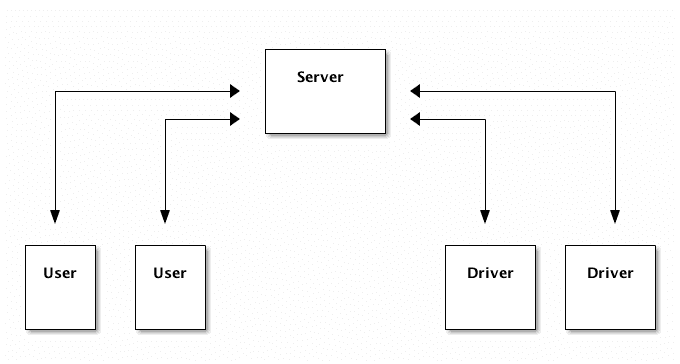
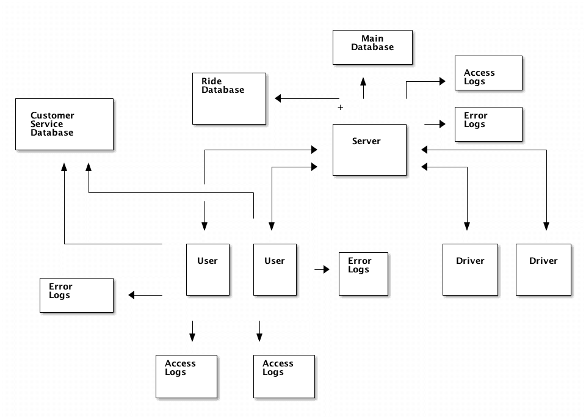
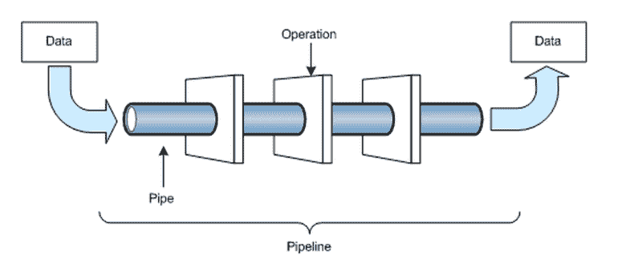
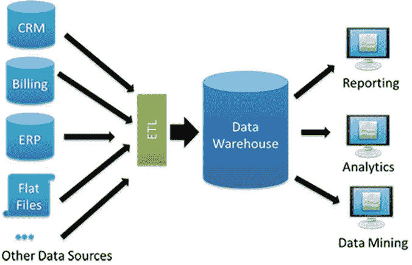

# 什么是数据工程师？

> 原文：<https://www.dataquest.io/blog/what-is-a-data-engineer/>

January 25, 2017

从帮助[汽车自动驾驶](https://www.wired.com/2017/01/human-problem-blocking-path-self-driving-cars/)到帮助[脸书在照片中给你贴标签](https://www.npr.org/sections/alltechconsidered/2016/05/18/477819617/facebooks-facial-recognition-software-is-different-from-the-fbis-heres-why)，数据科学最近吸引了很多关注。数据科学家已经成为非常受欢迎的[，这是有充分理由的——一个熟练的数据科学家可以给企业带来难以置信的价值。但是数据工程师呢？他们是谁，他们是做什么的？](https://readwrite.com/2014/07/21/data-scientist-income-skills-jobs/)

数据科学家的能力取决于他们能接触到的数据。大多数公司在数据库和文本文件中以各种格式存储数据。这就是数据工程师的用武之地——他们构建管道，将数据转换成数据科学家可以使用的格式。数据工程师与数据科学家一样重要，但往往不太引人注目，因为他们往往离分析的最终产品更远。

一个很好的类比是赛车制造商和赛车手。车手获得了在赛道上飞驰的兴奋，以及在人群面前胜利的激动。但建设者得到了调整引擎的乐趣，试验不同的排气设置，并创造一个强大，稳健的机器。如果你是那种喜欢构建和调整系统的人，数据工程可能适合你。在本帖中，我们将探索数据工程师的日常工作，并讨论该角色所需的技能。

## 数据工程师角色

数据科学领域非常广泛，从清理数据到部署预测模型，无所不包。然而，很少有一个数据科学家日复一日地跨领域工作。数据科学家通常专注于几个领域，并由其他科学家和分析师组成的团队进行补充。

数据工程也是一个广阔的领域，但是任何一个数据工程师都不需要知道所有的技能。在这一节中，我们将勾勒出数据工程的大致轮廓，然后通过更具体的描述来说明具体的数据工程角色。

数据工程师将数据转换成对分析有用的格式。想象一下，你是一名数据工程师，正在研究优步的一个简单的竞争对手 Rebu。您的用户在他们的设备上有一个应用程序，通过该应用程序他们可以访问您的服务。他们通过你的应用程序请求搭车到目的地，然后被路由到一个司机那里，司机接他们并把他们放下。乘车结束后，他们被充电，并可以选择评价他们的司机。

为了维持这样的服务，您需要:

*   面向用户的移动应用
*   一款面向司机的手机应用
*   可以将用户的请求传递给司机，并处理其他细节(如更新支付信息)的服务器

这是一个展示交流的图表:

如你所料，这种系统会产生大量的数据。您将拥有几个不同的数据存储:

*   支持主应用程序的数据库。这包含用户和驱动程序信息。
*   服务器分析日志
    *   服务器访问日志。对于应用程序向服务器发出的每个请求，它们各占一行。
    *   服务器错误日志。这些包含了你的应用程序产生的所有服务器端错误。
*   应用分析日志
    *   应用程序事件日志。这些信息包含用户和司机在应用程序中采取的行动。例如，当他们点击一个按钮或者更新他们的支付信息时，你会记录下来。
    *   应用程序错误日志。这些包含应用程序中的错误信息。
*   游乐设备数据库。这包含用户/驾驶员对的单个游乐设备的信息，并包含游乐设备的状态信息。
*   客户服务数据库。这包含关于客户服务代理的客户交互的信息。它可以包括语音记录和电子邮件日志。

以下是显示数据源的更新图表:

假设一位数据科学家想要分析用户使用您的服务的行为历史，并查看哪些行为与花费更多的用户相关联。为了让他们能够创建这些，您需要结合来自服务器访问日志和应用程序事件日志的信息。您需要:

*   定期从用户设备收集应用分析日志
*   将应用分析日志与引用用户的任何服务器日志条目相结合
*   创建一个 API 端点，返回任何用户的事件历史

为了解决这个问题，您需要创建一个管道，可以实时接收移动应用程序日志和服务器日志，解析它们，并将它们附加到特定用户。然后，您需要将解析后的日志存储在数据库中，这样 API 就可以方便地查询它们。您需要在负载平衡器后面启动几个服务器来处理传入的日志。

您将遇到的大多数问题都与可靠性和分布式系统有关。例如，如果您有数以百万计的设备要收集日志，并且需求不断变化(早上，您会收到大量日志，但午夜不会有这么多)，那么您将需要一个能够自动增减服务器数量的系统。

在负载平衡器后运行服务器。服务器向负载平衡器注册，负载平衡器根据它们的繁忙程度向它们发送流量。这意味着可以根据需要添加或删除服务器。

粗略地说，数据管道中的操作包括以下阶段:

*   摄取—这包括收集所需的数据。
*   处理-这包括处理数据以获得您想要的最终结果。
*   存储—这包括存储最终结果以便快速检索。
*   访问—您需要启用工具或用户来访问管道的最终结果。

数据管道—输入数据通过一系列阶段转换为输出数据。

### 发现质量差的游乐设施

举一个更复杂的例子，假设一位数据科学家想要构建一个系统，找出所有因应用程序或驱动程序问题而提前结束的乘坐。一种方法是查看客户服务数据库，查看哪些游乐设备以问题结束，并使用一些关于游乐设备的数据分析他们的语言日志。

在数据科学家能够做到这一点之前，他们需要一种方法来将客户服务数据库中的日志与特定的乘坐进行匹配。作为一名数据工程师，您会希望创建一个 API 端点，允许数据科学家查询与特定游乐设备相关的所有客户服务消息。为此，您需要:

*   创建一个系统，从乘车数据库中提取数据，并计算出有关乘车的信息，例如乘车时间，以及目的地是否符合用户的初始请求。
*   将每次乘坐的统计数据与用户信息(如姓名和用户 id)结合起来。
*   从应用程序和服务器分析日志中提取在游乐设备时间段内与用户相关的错误信息。
*   查找用户的所有客户服务查询。
*   创建一些启发式规则来匹配乘坐和客户服务查询(一个简单的例子是客户服务查询总是关于前一次乘坐)
*   根据需要存储值，以确保 API 快速执行，即使是为了将来的乘坐。
*   创建一个 API，返回与特定游乐设备相关的所有客户服务信息。

一个熟练的数据工程师将能够建立一个管道，每次增加一个新的游乐设备时，执行上述每个步骤。这将确保 API 提供的数据总是最新的，并且数据科学家所做的任何分析都是有效的。

### 数据工程技能

数据工程师需要擅长:

*   构建分布式系统
*   创建可靠的管道
*   组合数据源
*   构建数据存储
*   与数据科学团队合作，为他们构建合适的解决方案

注意，上面我们没有提到任何工具。虽然像 Hadoop 和 Spark 这样的工具以及像 Scala 和 Python 这样的语言对于数据工程来说很重要，但是更重要的是要很好地理解这些概念并知道如何构建现实世界的系统。在这个数据工程系列中，我们将继续关注概念胜于工具。

## 数据工程角色

尽管数据工程师需要具备上面列出的技能，但数据工程师的日常工作会因他们工作的公司类型而有所不同。大体上，您可以将数据工程师分为几类:

*   通才
*   以管道为中心
*   以数据库为中心

让我们逐一了解这些类别。

### 通才

通才数据工程师通常在一个小团队中工作。没有数据工程师，数据分析师和科学论者就没有什么可分析的，这使得数据工程师成为数据科学团队中至关重要的第一个成员。

当数据工程师是公司中唯一关注数据的人时，他们通常最终不得不做更多的端到端工作。例如，一个通才数据工程师可能需要做从接收数据到处理数据再到最终分析的所有事情。这需要比大多数数据工程师更多的数据科学技能。然而，它还需要较少的系统架构知识——小团队和公司没有大量用户，因此规模工程并不重要。对于一个想转型到数据工程的数据科学家来说，这是一个很好的角色。

当我们假设的优步竞争对手 Rebu 规模较小时，可能会要求数据工程师创建一个仪表板，显示上个月每天的乘车次数，以及下个月的预测。

### 以管道为中心

在具有复杂数据科学需求的中型公司中，以管道为中心的数据工程师往往是必要的。以管道为中心的数据工程师将与数据科学家团队合作，将数据转换为有用的分析格式。这需要深入了解分布式系统和计算机科学。

随着 Rebu 的发展，以管道为中心的数据工程师可能会被要求创建一个工具，使数据科学家能够查询有关游乐设备的元数据，以便在预测算法中使用。

### 以数据库为中心

以数据库为中心的数据工程师专注于设置和填充分析数据库。这涉及到一些管道方面的工作，但更多的工作是调优数据库以进行快速分析和创建表模式。这涉及到将数据放入 T2 仓库的 ETL 工作。这种类型的数据工程师通常出现在拥有许多数据分析师的大型公司中，他们的数据分布在多个数据库中。

在 Rebu 接管世界后，以数据库为中心的数据工程师可能会设计一个分析数据库，然后创建脚本将信息从主应用程序数据库拉入分析数据库。

数据仓库接收数据，然后使其他人可以方便地查询它。

## 数据工程技能

在这篇文章中，我们讨论了数据工程和在高层次实践它所需的技能。如果你对构建大规模系统感兴趣，或者对处理大量数据感兴趣，那么数据工程是一个很好的领域。

看到您的自动缩放数据管道突然处理流量高峰，或者开始使用具有数兆字节 RAM 的机器，可能会非常令人兴奋。构建一个只需少量调整就能工作数月或数年的健壮系统令人满意。

因为数据工程是关于学习处理规模和效率的，你自己很难找到好的实践材料。但是不要放弃希望——自学数据工程并在该领域找到工作是很有可能的。

我们最近在 Dataquest 推出了新的互动[数据工程路径](https://www.dataquest.io/path/data-engineer)，旨在教你成为数据工程师所需的技能。如果你有兴趣，你可以[注册开始免费学习](https://www.dataquest.io)。

### 成为一名数据工程师！

现在就学习成为一名数据工程师所需的技能。注册一个免费帐户，访问我们的交互式 Python 数据工程课程内容。

[Sign up now!](https://app.dataquest.io/signup)

*(免费)*

*[https://www.youtube.com/embed/ddM21fz1Tt0?rel=0](https://www.youtube.com/embed/ddM21fz1Tt0?rel=0)*