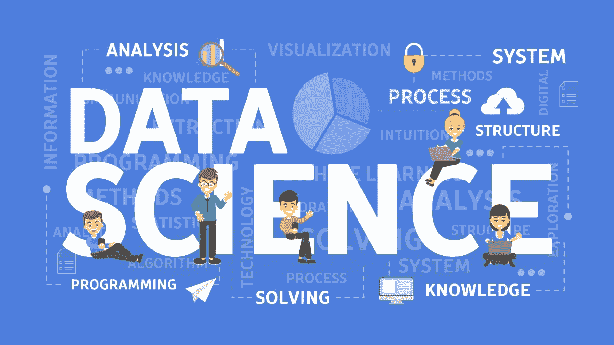

# 什么是数据科学？

> 原文：<https://www.dataquest.io/blog/what-is-data-science/>

May 23, 2019

## 什么是数据科学？

数据科学是一个专注于从数据中获取洞察力的研究和实践领域。

数据科学的从业者使用编程技能、统计知识和机器学习技术来挖掘大型数据集，以获得可用于分析过去甚至预测未来的模式。

## 数学遇见编程:快速历史

为了更好地理解数据科学到底是什么，快速浏览一下它的来源会很有帮助。在许多方面，数据科学是已经存在了几十年的两个领域的合并的结果:统计学和计算机科学。

当然，几个世纪以来，统计学家一直在处理数字。但 20 世纪中期计算机科学的出现为统计学家提供了一种新的工具，可以比以前更快地分析数据。

早在 20 世纪 60 年代，像约翰·w·图基(John W. Tukey)这样的统计学家就在理论上探讨计算机如何能够给这个领域带来革命性的变化，但当时它们的影响微乎其微——它们只是太慢、太贵了。20 世纪 80 年代，个人电脑的兴起使数字数据收集成为可能，公司开始尽可能地收集数据。到了 20 世纪 90 年代，一些公司成功地利用这些数据来设计营销策略。分析这些新的数字数据既需要统计学家的统计知识，也需要计算机科学家的编程技能。

到 21 世纪初，部分由于互联网的出现，许多公司可以访问海量数据。与此同时，计算机的处理能力已经发展到可以对庞大的数据集进行复杂分析的程度，更先进的技术，如带有机器学习的预测分析，也即将实现。

企业和学术界都开始认识到拥有收集、处理和分析数字数据所需的编程技能的专家的价值*以及选择准确回答问题和获得有意义的见解所需的分析类型所需的统计技能。“数据科学”这个术语已经存在了几十年，成为描述这种技能融合的主流短语。*

## 数据科学家是做什么的？

在日常工作中，数据科学家通常负责数据发生的一切，从收集数据到分析数据并报告结果。尽管每项数据科学工作都不同，但这里有一种方法可以直观显示数据科学工作流，并提供了一些数据科学家在每个步骤中可能执行的典型任务的示例。

它是这样工作的:

1.  **捕捉数据。**例如:从公司数据库中提取数据，从网站上抓取数据，访问 API 等。
2.  **管理数据。**例如:正确存储数据，并且几乎总是会涉及到清理数据。
3.  **探索性分析。**例如:执行不同的分析并以各种方式可视化数据，以寻找模式、问题和更深入研究的机会。
4.  **最终分析。**例如:深入挖掘数据以回答特定的业务问题，并微调预测模型以获得最准确的结果。
5.  **举报。**例如:向管理层提交分析结果，这可能包括撰写报告、制作可视化效果以及根据分析结果提出建议。报告还可能意味着将分析结果插入到数据产品或仪表板中，以便其他团队成员或客户可以轻松地访问它。

尽管如此，数据科学家每天做的事情可能会有很大差异，这在很大程度上是因为不同的公司以不同的方式利用数据科学。

## 企业如何从雇佣数据科学家中获益

在最高级别，数据科学允许公司将数据转化为实际的商业价值。

例如，考虑一家专业电子商务零售商。这样的公司每天可能会有数万次浏览量和数百个订单。对于每次浏览量，它可以使用自动化工具收集大量关于访问者是谁以及他们在网站上采取了什么行动的数据。对于每一笔订单，他们的销售系统都可以轻松地收集关于实际客户的各种数据点。

然而，这些数据堆积得很快，它本身没有任何固有的值。为了从中获取价值，公司需要对其进行分析，寻找能够暗示未来商业战略和战术的模式和见解。这些数据提供的可操作性和前瞻性洞察越多，对公司的价值就越大。

因为公司可以收集许多不同类型的数据，所以数据科学家可以通过各种方式增加价值。以下是数据科学如何为全球企业增加价值的几个例子:

*   改善决策—数据科学为管理层提供了可操作的情报，领导者可以利用这些情报来制定短期和长期战略。
*   改善招聘——数据科学可以帮助更客观地评估候选人，根除低效和偏见。
*   预测未来-使用机器学习算法，数据科学家可以在数据中发现人类无法发现的模式，并以更高的准确度预测未来的结果。
*   提高针对性-数据科学可以帮助公司找到新的目标市场，更好地了解现有客户，更准确地预测客户的需求。
*   识别新的机会—通过探索数据和寻找模式，数据科学家可以识别新的业务机会，否则这些机会可能不会显而易见。
*   改善风险评估-数据科学通常可以在将风险想法付诸实施之前通过运行数字来“测试”这些想法，从而使公司能够避免潜在的代价高昂的风险和错误。
*   培养数据第一的文化-数据科学家或数据科学团队可以通过为他们提供仪表板等数据工具以及理解这些工具所需的培训，来帮助整个公司的每个团队进行基于数据的决策。

## 数据科学领域的可用职业

数据科学是一个快速发展的领域，合格的数据科学家 T2 非常吃香。

许多专业人士以数据分析师的身份进入该领域，这是一个技术技能门槛较低的入门级角色，一旦他们有了一点专业经验，就会晋升到数据科学家级别，尽管也有可能直接被聘为数据科学家。有关数据科学行业各种工作角色的更多详细信息，请查看[我们的数据科学职业选择指南](https://www.dataquest.io/blog/career-guide-data-science-options/)。

薪水各不相同，但在美国，数据分析师的平均年薪超过 65，000 美元(根据大约 2019 年 5 月的[实际上是](https://www.indeed.com/salaries/Data-Analyst-Salaries))。数据科学家的平均年薪超过 12 万美元。甚至更高级的职位，如高级数据科学家或机器学习工程师，也可以达到 14 万美元以上。

虽然看起来这么高的薪水需要在教育上进行大量的前期投资，但事实并非如此！你可以[在线学习数据科学所需的所有技能](https://www.dataquest.io/path/data-scientist/)。

#### 揭穿关于数据科学职业的神话

你不需要数学或编程背景。虽然这两者中的任何一个肯定会对*有所帮助*，但是完全有可能从头开始学习数据科学，除了你在高中学到的东西之外，不需要任何编程技能和数学知识。查看[我们的特色学生故事](https://www.dataquest.io/blog/topics/student-stories/)，你会发现很多快乐就业的学生的例子，他们第一次来到 Dataquest 时很少或没有受过编程或统计培训。

你不需要花很多钱。大学学位要花费数十万美元，甚至训练营的费用也超过 1 万美元。但是在 Dataquest，你可以以更便宜的价格在线互动学习。 [88%的学生](https://www.dataquest.io/blog/dataquest-reviews-survey-2019/)表示 Dataquest 是他们学习数据科学的主要或唯一来源，96%的学生推荐 Dataquest 来改善你的职业机会。

不会花很长时间的。我们的大多数学生在不到一年的时间内达到了他们的学习目标(尽管许多人会继续学习更长时间，以保持他们的技能，并在我们添加新课程时学习新的技能)，同时每周学习不到 10 个小时。当然，成为一名*伟大的*数据科学家需要时间和努力，但你可能会惊讶于你能多快学会完成伟大工作所需的所有基本技能。

## 如何学习数据科学

对数据科学感兴趣吗？现在你可以做一些事情来确保你有一个好的开始。

首先，**花点时间思考一下** ***为什么*** —是什么激励你学习数据科学？当然，这里有诱人的薪水，但是试着更深入一些，找到一些你感兴趣的数据。找到你想要回答的基于数据的问题，这个问题会推动你继续学习。

二、**通读** [**我们的数据科学职业指南**](https://www.dataquest.io/blog/data-science-career-guide/) 。它很长，但它是基于对数据科学家和数据科学招聘经理的数十次采访。它会让你很好地了解数据科学行业目前的状况，以及截至 2019 年招聘人员的需求。提前了解这一点将有助于你避免错误，并为你节省一些申请工作的时间，因为你已经有了一个很好的项目组合，并准备根据指南的建议进行。

第三，无论你在哪里学习，**确保你是通过做**来学习的。在 [Dataquest](https://www.dataquest.io) ，我们确保所有学生通过我们的交互式浏览器内编码环境应用我们教授的所有内容，因此您可以在学习的同时不断应用，并获得关于您的代码是否正常工作的反馈。但是不管你是选择在我们的网站上学习还是在其他地方学习，确保你经常应用你所学的东西，并且花大量的时间实际编写代码。很容易看一个小时的视频，*会觉得*你学到了一些东西，但你并没有真正学到任何有用的东西，除非你[自己应用你所学的东西](https://www.dataquest.io/blog/video-text-learn-data-science-online/)。

第四，**计划与您的同行和数据科学社区建立联系**。在 Dataquest，我们有一个学生可以加入的在线学习者社区，但您也可以查看 Twitter、Reddit 和其他社交网络上的数据科学社区。你可以建立一些很好的联系，并从社区中的其他人那里学到很多东西，数据科学领域的大多数人都非常开放和慷慨地分享他们的时间和专业知识。

准备好开始了吗？一个新的和令人兴奋的职业等待着你！您现在就可以在我们的免费入门课程中开始学习编码，我们也会为您提供一些其他优秀的数据科学资源。