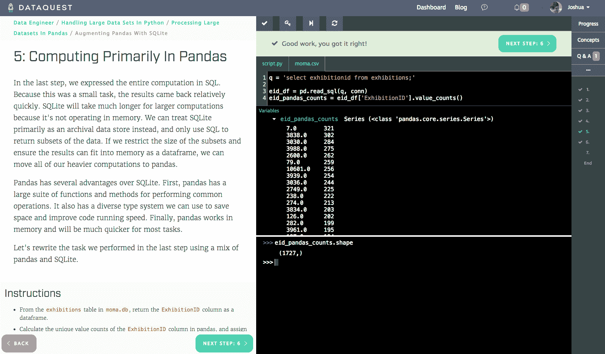
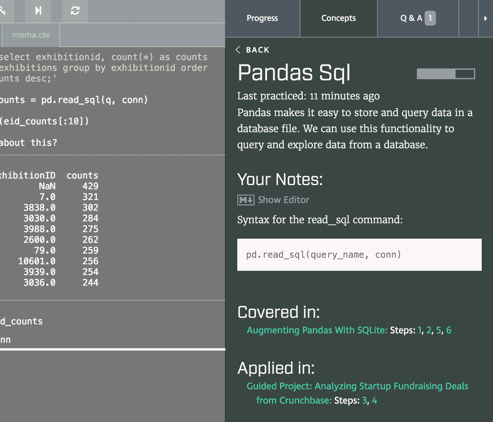
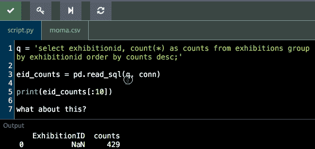

# v1.19 中的新功能:多屏幕、概念、数据集预览等！

> 原文：<https://www.dataquest.io/blog/whats-new-v1-19/>

May 2, 2017

我们的 1.19 版本包括旨在改善您的学习体验的新功能。

你可能注意到的第一件事是一个新的外观。我们做了一些设计调整，包括一个新的教训-文本字体，我们认为你会同意，使一切更容易阅读。v1.19 中的其他重大变化包括:

*   多屏显示，让您在课堂上更高效地工作。
*   概念，旨在帮助您将学习提高到一个新的水平。
*   课堂数据集预览和下载。

你可以在这篇文章的底部找到每一个新特性和错误修复的列表。

[立即体验新功能！](https://app.dataquest.io/login)

## 多银幕放映的

多屏将使你的学习体验更容易。并排设计基于我们指导项目的布局，旨在让您更快、更轻松地学习和探索。

我们新的多屏界面

通过将说明和代码框放在一起，multiscreen 使您更容易完成每个步骤。此外，您可以方便地访问控制台，这样您就可以交互式地浏览数据，并尝试不同的方法。

最后，您的代码现在在您键入时就被保存了，所以如果您必须返回到上一步来检查某些东西，当您回来时，您所有的工作都在那里。

## 概念

我们很高兴发布“概念”的第一阶段。概念的想法来自于像您一样的用户的反馈，他们希望:

*   跟踪他们学到了什么技能。
*   查找教授概念的早期课程。
*   对某些话题做笔记。

课程边栏中的概念

概念将在每个课程和项目的边栏中以及您的仪表板中提供。Concepts 将向您展示该课程中教授的内容，做笔记，以及查看教授该概念的其他课程和实践该概念的项目和挑战。

您还可以从 Dataquest 仪表盘的侧边栏访问概念，从而轻松查看您的进度，并找到具体的课程来回顾您所学的内容。

我们计划在这一年中扩展概念，最终在每个概念中提供练习——如果您对我们如何添加概念有其他想法，我们很乐意倾听。

## 数据集预览和下载

再次根据像您这样的用户的反馈，我们创建了一个数据集预览，以便您可以轻松检查您正在处理的数据的格式。

通过单击“数据集”选项卡，您可以预览以表格格式排列的前 5 行数据。

此外，您将能够轻松地在那里下载数据集，因此您可以在自己的计算机上扩展您的工作，使用您在课程中使用的数据的精确副本。

## 1.19 版中的新功能

今天版本中的完整功能列表如下:

*   我们更新了我们的设计，包括使我们的课内字体更容易阅读。
*   我们控制台的第一个版本在非 Python 课程中为您提供了一个 Python 控制台。现在 R 和 SQL 课程有了正确的控制台。
*   我们增加了向您展示进度的粒度。以前进步四舍五入到最接近的 5%，现在四舍五入到最接近的 1%。
*   当您在常规代码框中键入代码时，我们会保存您的代码，使您可以更轻松地在屏幕之间单击，而不会丢失工作。
*   修复了命令行项目在某些情况下缺少跳过提示和解决方案按钮的错误。
*   为我们新的顶级“plus”计划增加了一个试点计划，其中包括指导和项目评审。
*   增加了专属于 plus 用户的新“plus 项目”,以帮助建立投资组合。
*   让我们的定价页面更容易理解。
*   修正了一个错误，控制台提示符不一致加载。
*   增加了一个新的课程结束屏幕，这样你可以给出更详细的反馈，更容易看到你的进度。
*   将课程重置按钮移到进度边栏，以便您可以随时重置课程进度。
*   改进了内部错误报告，因此我们可以更快地识别和修复正在发生的问题。
*   修正了一个阻止某些用户加载 Dataquest 站点的错误。
*   控制台现在可以在所有屏幕类型上立即加载。
*   一个新的[机器学习基础](https://www.dataquest.io/course/machine-learning-fundamentals)课程，作为我们整个 ML 模块重写的一部分。
*   [算法和数据结构](https://www.dataquest.io/course/course-data-structures-fundamentals/)，我们新[数据工程师之路](https://www.dataquest.io/path/data-engineer)的第三个课程。
*   跨平台对速度和可靠性的各种改进。
*   杂项课错误修正和错误修复。

[立即体验新功能！](https://app.dataquest.io/login)

## 即将推出

如果您对未来几个月的内容感兴趣:

*   更多的机器学习和数据工程课程。
*   课程目标。
*   能够设定学习目标并制定学习计划。
*   课内自动完成和文档。

一如既往，我们希望听到您对我们下一步应该构建什么的反馈。如果你有一个好主意，[给我们发电子邮件](/cdn-cgi/l/email-protection#ed8588818182ad898c998c9c98889e99c38482)或者简单地在下面评论！